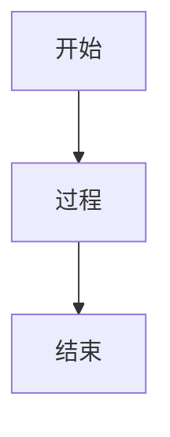
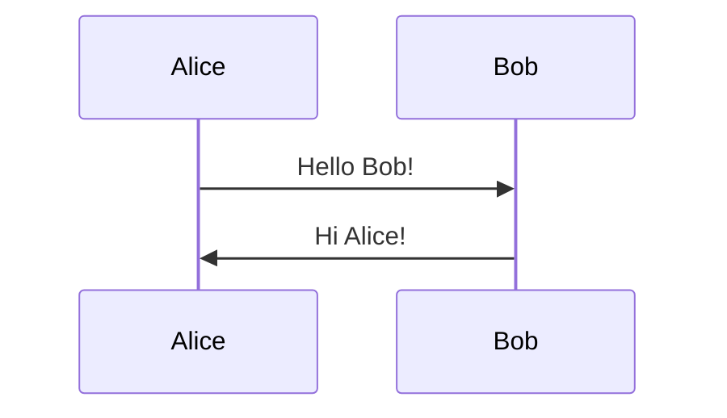
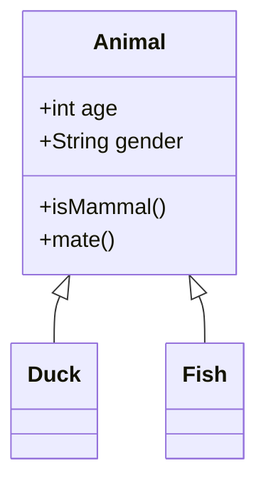
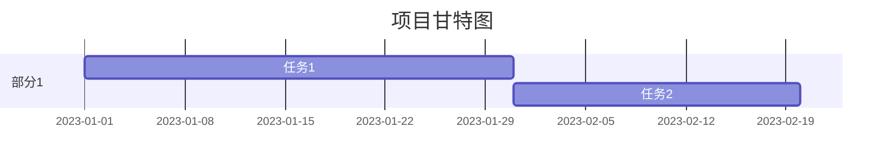
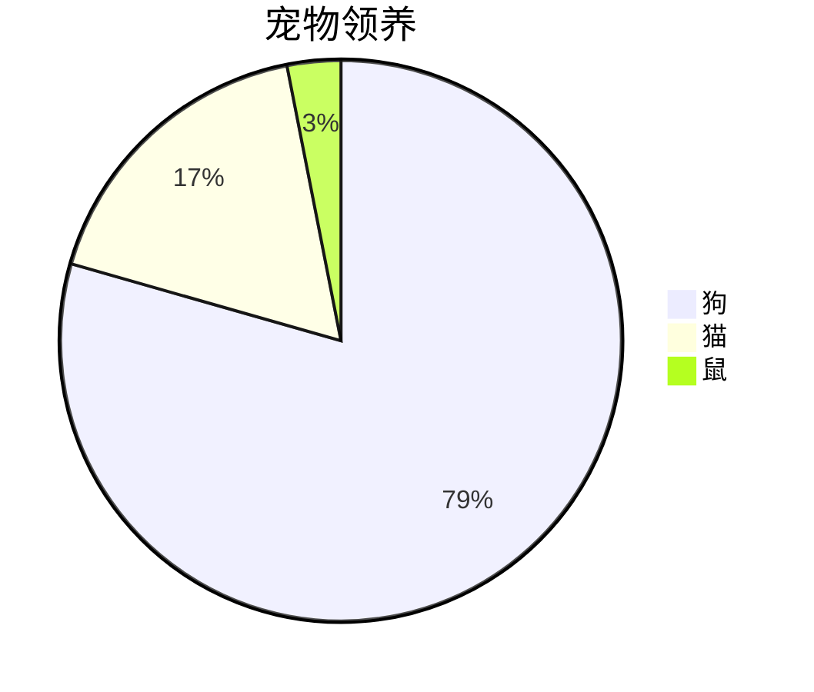
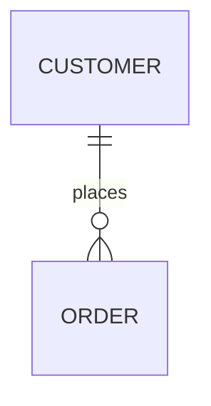
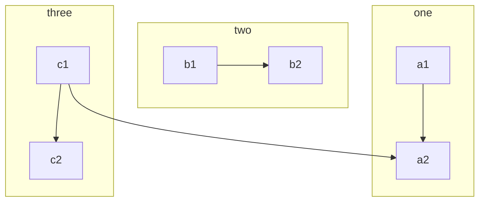

<h1 align="center">Markdown Editor built on Vue</h1>

<p align="center">
  <a href="https://npmcharts.com/compare/@kangc/v-md-editor?minimal=true"></a>
  <a href="https://www.npmjs.com/package/@kangc/v-md-editor"></a>
  <a href="https://www.npmjs.com/package/@kangc/v-md-editor"></a>
</p>

## Links

- [Demo](https://code-farmer-i.github.io/vue-markdown-editor/examples/base-editor.html)
- [Documentation](https://code-farmer-i.github.io/vue-markdown-editor/)
- [Changelog](https://code-farmer-i.github.io/vue-markdown-editor/changelog.html)

## Install

```bash
# use npm
npm i @kangc/v-md-editor -S

# use yarn
yarn add @kangc/v-md-editor
```

## Quick Start

```js
import Vue from 'vue';
import VueMarkdownEditor from '@kangc/v-md-editor';
import '@kangc/v-md-editor/lib/style/base-editor.css';
import vuepressTheme from '@kangc/v-md-editor/lib/theme/vuepress.js';

VueMarkdownEditor.use(vuepressTheme);

Vue.use(VueMarkdownEditor);
```

## Usage

```html
<template>
  <v-md-editor v-model="text" height="400px"></v-md-editor>
</template>

<script>
  export default {
    data() {
      return {
        text: '',
      };
    },
  };
</script>
```

## Refrence

- [ElementUi Scrollbar Component](https://github.com/ElemeFE/element/tree/dev/packages/scrollbar)
- [vuepress-plugin-container](https://vuepress.github.io/zh/plugins/container/)

- [x] Task
- [ ] Task

<iframe id="markmap" src="https://aihtml.qimingdaren.com/markmap/549541a1-e12b-453f-aab4-947994c0fbc7.html" width="100%" height="100%" frameborder="0" allowfullscreen sandbox="allow-scripts allow-same-origin allow-popups allow-forms"> </iframe>

# Mermaid 图表测试

此文件用于测试 Markdown 编辑器对 Mermaid 图表的处理，包括各种图表类型、语法和边界情况，如流程图、序列图、类图、在 HTML 中嵌入、无效语法、空图表等。

## 简单流程图



## 序列图



## 类图



## Gantt 图



## 饼图



## 在 HTML 中的 Mermaid

<div>

</div>

## 无效语法

```mermaid
graph TD
    A -- > B  // 无效箭头
```

## 空图表

```mermaid

```

## 多图表在同一文档

```mermaid
flowchart TD
    Start --> End
```



## 其他边界情况

嵌套在列表中：

- ```mermaid
  graph TD
      X --> Y
  ```

转义或特殊字符：

```mermaid
graph TD
    A["特殊字符: \" & < >"] --> B
```

大图表（多行）：



# 指数函数判断题引导讲解

## 目录

1. 题目分析
2. 核心知识点梳理
3. 解题思路引导
4. 常见易错点提示
5. 类比例题与思考拓展

---

## 1. 题目分析

本题要求判断给定的 9 个函数中，哪些属于“指数函数”。每个选项的表达式形式略有不同，需要你结合指数函数的定义进行分析。

---

## 2. 核心知识点梳理

### 什么是指数函数？

- **定义**：一般地，形如 $y = a^x$（其中 $a>0$ 且 $a\neq 1$，$x$ 为实数）的函数，叫做指数函数。
- **要点**：
  - 底数 $a$ 必须是正数且不等于 1；
  - 指数 $x$ 是自变量，可以取任意实数；
  - 不能有额外的加减项（如 $y = a^x + b$）；
  - 允许有常数系数（如 $y = k \cdot a^x$，$k\neq 0$）。

---

## 3. 解题思路引导

### 步骤一：观察函数形式

- 先看表达式是否能写成 $y = a^x$ 的形式。
- 注意底数$a$的取值范围。

### 步骤二：检查底数

- 底数$a$是否为正数且不等于 1？
- 如果底数为负数、0 或 1，都不是指数函数。

### 步骤三：检查自变量

- 指数部分是否是自变量$x$？
- 如果$x$在底数上（如$y = x^2$），那是幂函数，不是指数函数。

### 步骤四：检查定义域

- 指数函数的自变量$x$通常要求是全体实数。
- 如果题目限制了$x$的取值范围，要特别注意。

### 步骤五：是否有额外项

- 如果表达式中有加减常数项（如$y = a^x + b$），就不再是标准的指数函数形式。

---

## 4. 常见易错点提示

- **负号问题**：$y = -2^x$ 与 $y = (-2)^x$，你能区分吗？前者是$2^x$的相反数，后者底数为负数。
- **定义域陷阱**：$y = 2^x$ 和 $y = 2^x (x>0)$，仅定义域不同，哪个才是指数函数？
- **常数项干扰**：$y = 2^x + 1$，多了一个“+1”，还算指数函数吗？
- **幂函数与指数函数区分**：$y = x^2$ 是幂函数，不是指数函数。

---

## 5. 类比例题与思考拓展

- 你能写出一个不是指数函数的表达式，但和指数函数很像吗？比如 $y = a^x + b$。
- 如果把 $y = 2^x$ 改成 $y = 2^{x-1}$，它还是指数函数吗？为什么？
- 你能举出一个底数为分数的指数函数吗？比如 $y = \left(\frac{1}{2}\right)^x$。

---

## 解题思路引导总结

1. **先写出指数函数的标准定义**，对照每个选项逐一分析。
2. **逐步排查**：底数、指数、定义域、是否有额外项。
3. **遇到不确定的表达式**，可以尝试化简或变形，看能否还原为$y = a^x$的形式。
4. **多问自己几个“为什么”**：为什么这个不是？为什么那个是？这样能帮助你真正理解指数函数的本质。

---

### 你可以先挑选一个选项，试着用上述思路分析一下

- 这个表达式能写成$y = a^x$吗？
- 底数$a$满足条件吗？
- 有没有多余的项？
- 定义域有没有被限制？

如果有疑问，可以把你的分析过程写出来，我会帮你进一步梳理！

<iframe id="markmap" src="https://aihtml.qimingdaren.com/markmap/549541a1-e12b-453f-aab4-947994c0fbc7.html" width="100%" height="100%" frameborder="0" allowfullscreen sandbox="allow-scripts allow-same-origin allow-popups allow-forms"> </iframe>

<h3 style="text-align: center; font-weight: bold; color: black; margin-bottom: 24px; font-family: 'KaiTi', 'STKaiti', 'KaiTi_GB2312', 'SimKai', serif;">
    棱柱、棱锥、棱台的表面积和体积·总结提升
</h3>

<div style="background: linear-gradient(to right, #3f51b5, #5c6bc0); color: white; font-weight: bold; padding: 10px 16px; border-radius: 4px; margin-bottom: 18px;">
    <span style="font-size: 16px;">[学习目标]</span>
    <ul style="margin: 8px 0 0 1.5em; line-height: 1.7;">
        <li>了解棱柱、棱锥、棱台的表面积与体积的计算公式．<span style="color: #ffe082;">(重点)</span></li>
        <li>理解并掌握侧面展开图与几何体的表面积之间的关系，并能利用计算公式求几何体的表面积与体积．<span style="color: #ffe082;">(难点)</span></li>
    </ul>
</div>

<p style="color: #1976d2; font-weight: bold; margin-bottom: 8px;">导语</p>
<p style="text-indent:2em;">
    在初中我们学习了特殊的棱柱——正方体、长方体的体积公式及其表面积的求法，那么对于一个一般的棱柱或棱锥、棱台，它们的体积及表面积又如何来计算呢？今天就让我们来学习一下吧！
</p>

<h4 style="background: linear-gradient(to right, #20b2aa, #66cdaa); color: white; font-weight: bold; padding: 10px 16px; border-radius: 4px; margin-bottom: 10px;">
    一、棱柱、棱锥、棱台的侧面积和表面积
</h4>

<b>问题</b>　我们知道，空间几何体的表面积是围成多面体的各个面的面积之和，长方体、三棱锥、四棱台的侧面展开图各是什么样子的？
<br>
<b>提示</b>　长方体、三棱锥、四棱台的侧面展开图如图所示．

<div style="text-align:center; margin: 16px 0;">
    
    
</div>

<div style="background: #f5fff5; border-left: 5px solid #81c784; padding: 10px 18px; margin-bottom: 18px;">
    <b>【知识梳理】</b><br>
    多面体的表面积就是围成多面体各个面的面积的和．棱柱、棱锥、棱台的表面积就是围成它们的各个面的面积的和．
</div>

<b>例 已知正三棱台（由正三棱锥截得的三棱台）的上、下底面边长分别为 3 cm 和 6 cm ，高为 $\frac{3}{2}$ cm ，求此正三棱台的表面积．</b>

<p style="margin: 10px 0; line-height: 1.7;">
    <b>解</b> 如图所示，画出正三棱台 $ABC-A_1B_1C_1$ ，其中 $O_1, O$ 为正三棱台上、下底面的中心，$D, D_1$ 分别为 $BC, B_1C_1$ 的中点，则 $OO_1$ 为正三棱台的高，$DD_1$ 为侧面梯形 $BCC_1B_1$ 的高，四边形 $ODD_1O_1$ 为直角梯形，所以 $DD_1=\sqrt{OO_1^2+(OD-O_1D_1)^2}=\sqrt{(\frac{3}{2})^2+(\sqrt{3}-\frac{\sqrt{3}}{2})^2}=\sqrt{3}$ ，所以此三棱台的表面积 $S_{\text{表}}=S_{\text{侧}}+S_{\text{底}}=3\times\frac{1}{2}\times(3+6)\times\sqrt{3}+\frac{\sqrt{3}}{4}\times3^2+\frac{\sqrt{3}}{4}\times6^2=\frac{99\sqrt{3}}{4}\ (\mathrm{cm}^2)$ ．
</p>
<div style="text-align:center; margin: 16px 0;">
    
</div>
<div style="background: #fffde7; border-left: 5px solid #ffeb3b; padding: 10px 18px; margin-bottom: 18px;">
    <b>反思感悟</b>　求解正棱台的表面积时注意棱台的四个基本量：底面边长、高、侧面底边上的高、侧棱，并注意两个直角梯形的应用<br>
    (1)高、侧棱、上、下底面多边形的中心与顶点连线所成的直角梯形。<br>
    (2)高、斜高、上、下底面边心距所成的直角梯形。
</div>

<h4 style="background: linear-gradient(to right, #20b2aa, #66cdaa); color: white; font-weight: bold; padding: 10px 16px; border-radius: 4px; margin-bottom: 10px;">
    二、棱柱、棱锥、棱台的体积
</h4>

<b>问题</b>　正方体、长方体的体积公式是什么？<br>
<b>提示</b> $V_{\text{正方体}}=a^3$（$a$ 是正方体的棱长），$V_{\text{长方体}}=abc$（$a, b, c$ 分别是长方体的长、宽、高）．

<div style="background: #f5fff5; border-left: 5px solid #81c784; padding: 10px 18px; margin-bottom: 18px;">
    <b>【知识梳理】</b><br>
    <div style="display: flex; justify-content: center;">
    <table style="display:inline-block !important;width: auto;border-collapse: collapse; margin-bottom: 20px; font-size: 15px;">
        <tr style="background: #e3f2fd;">
            <th style="border:1px solid #90caf9; padding: 6px 16px;">几何体</th>
            <th style="border:1px solid #90caf9; padding: 6px 16px;">体积</th>
            <th style="border:1px solid #90caf9; padding: 6px 16px;">说明</th>
        </tr>
        <tr>
            <td style="border:1px solid #90caf9; padding: 6px 16px;">棱柱</td>
            <td style="border:1px solid #90caf9; padding: 6px 16px;">$V_{\text{棱柱}}=S h$</td>
            <td style="border:1px solid #90caf9; padding: 6px 16px;">$S$为棱柱的底面积，$h$为棱柱的高</td>
        </tr>
        <tr>
            <td style="border:1px solid #90caf9; padding: 6px 16px;">棱锥</td>
            <td style="border:1px solid #90caf9; padding: 6px 16px;">$V_{\text{棱锥}}=\frac{1}{3} S h$</td>
            <td style="border:1px solid #90caf9; padding: 6px 16px;">$S$为棱锥的底面积，$h$为棱锥的高</td>
        </tr>
        <tr>
            <td style="border:1px solid #90caf9; padding: 6px 16px;">棱台</td>
            <td style="border:1px solid #90caf9; padding: 6px 16px;">$V_{\text{棱台}}=\frac{1}{3} h\left(S'+\sqrt{S' S}+S\right)$</td>
            <td style="border:1px solid #90caf9; padding: 6px 16px;">$S', S$分别为棱台的上、下底面面积，$h$为棱台的高</td>
        </tr>
    </table>
    </div>
    <div style="margin-top: 8px;">
        <b>注意点：</b><br>
        （1）棱锥的高是顶点到底面的距离，棱台的高是上、下底面的距离，要注意区分侧面的高。<br>
        （2）在求三棱锥的体积时，每一个顶点都可以作为三棱锥的顶点，要注意转换顶点。
    </div>
</div>

<b>例 2 正四棱台两底面边长分别为 20 cm 和 10 cm ，侧面面积为 $780\,\mathrm{cm}^2$ ，求其体积．</b>

<p style="margin: 10px 0; line-height: 1.7;">
    <b>解</b> 正四棱台的大致图形如图所示，其中 $A_1B_1=10\,\mathrm{cm},\ AB=20\,\mathrm{cm}$ ，取 $A_1B_1$ 的中点 $E_1$，$AB$ 的中点 $E$ ，
</p>
<div style="text-align:center; margin: 16px 0;">
    
</div>
<p style="margin: 10px 0; line-height: 1.7;">
    则 $E_1E$ 为侧面底边上的高。设 $O_1, O$ 分别是上、下底面的中心，则四边形 $EOO_1E_1$ 为直角梯形。
</p>
<div style="background: #f5f5f5; padding: 8px 16px; border-radius: 4px; margin-bottom: 8px;">
    $$
    \begin{aligned}
    & \because S_{\text{侧}}=4 \times \frac{1}{2} \times (10+20) \times EE_1=780\,(\mathrm{cm}^2), \\
    & \therefore EE_1=13\,\mathrm{cm} .
    \end{aligned}
    $$
    <br>
    在直角梯形 $EOO_1E_1$ 中，
    $$
    \begin{aligned}
    & O_1E_1=\frac{1}{2}A_1B_1=5\,(\mathrm{cm}),\ OE=\frac{1}{2}AB=10\,(\mathrm{cm}) \\
    & \therefore O_1O=\sqrt{13^2-(10-5)^2}=12\,(\mathrm{cm})
    \end{aligned}
    $$
    <br>
    故该正四棱台的体积为
    $$
    V=\frac{1}{3} \times 12 \times (10^2+20^2+10 \times 20)=2800\,(\mathrm{cm}^3) .
    $$
</div>
<div style="background: #fffde7; border-left: 5px solid #ffeb3b; padding: 10px 18px; margin-bottom: 18px;">
    <b>反思感悟</b>　求解正棱台的体积时，注意棱台的五个基本量(上、下底面的边长、高、侧面底边上的高、侧棱长)。常用两种解题思路：一是把基本量转化到直角梯形中解决问题；二是把正棱台还原成正棱锥，利用正棱锥的有关知识来解决问题。
</div>

<h4 style="background: linear-gradient(to right, #20b2aa, #66cdaa); color: white; font-weight: bold; padding: 10px 16px; border-radius: 4px; margin-bottom: 10px;">
    三、简单组合体的表面积与体积
</h4>

<b>例 现需要设计一个仓库，它由上下两部分组成，上部分的形状是正四棱锥 $P-A_1B_1C_1D_1$ ，下部分的形状是正四棱柱 $ABCD-A_1B_1C_1D_1$（如图所示），并要求正四棱柱的高 $O_1O$ 是正四棱锥的高 $PO_1$ 的 4 倍，若 $AB=6\,\mathrm{m},\ PO_1=2\,\mathrm{m}$ ，则仓库的容积是多少？</b>

<div style="text-align:center; margin: 16px 0;">
    
</div>
<p style="margin: 10px 0; line-height: 1.7;">
    <b>解</b> 由 $PO_1=2\,(\mathrm{m})$ ，知 $O_1O=4PO_1=8\,(\mathrm{m})$ 。<br>
    因为 $A_1B_1=AB=6\,(\mathrm{m})$ ，所以正四棱锥 $P-A_1B_1C_1D_1$ 的体积 $V_{\text{锥}}=\frac{1}{3} \cdot A_1B_1^2 \cdot PO_1=\frac{1}{3} \times 6^2 \times 2=24\,(\mathrm{m}^3)$ ，正四棱柱 $ABCD-A_1B_1C_1D_1$ 的体积 $V_{\text{柱}}=AB^2 \cdot O_1O=6^2 \times 8=288\,(\mathrm{m}^3)$ ，所以仓库的容积 $V=V_{\text{锥}}+V_{\text{柱}}=24+288=312\,(\mathrm{m}^3)$ 。
</p>
<div style="background: #fffde7; border-left: 5px solid #ffeb3b; padding: 10px 18px; margin-bottom: 18px;">
    <b>反思感悟</b>　求组合体的表面积和体积，首先应弄清它的组成，其表面有哪些底面和侧面，各个面应该怎样求，然后再根据公式求出各面的面积，最后再相加或相减。求体积时也要先弄清组成，求出各简单几何体的体积，然后再相加或相减。
</div>

<h4 style="background: linear-gradient(to right, #3f51b5, #5c6bc0); color: white; font-weight: bold; padding: 10px 16px; border-radius: 4px; margin-bottom: 18px;">
    课程小结
</h4>
<div style="border-left: 5px solid #3f51b5; background: #f5f7fa; padding: 10px 18px; margin-bottom: 18px;">
    <ol style="margin: 8px 0 0 1.5em; line-height: 1.7;">
        <li>知识清单：<br>
            (1)棱柱、棱锥、棱台的侧面积和表面积。<br>
            (2)棱柱、棱锥、棱台的体积。<br>
            (3)组合体的表面积与体积。<br>
            (4)棱柱、棱锥、棱台体积公式之间的关系。
        </li>
        <li>方法归纳：等体积法、割补法。</li>
        <li>常见误区：平面图形与立体图形的切换不清楚。</li>
    </ol>
</div>

<h3 style="text-align: center; font-weight: bold; color: black; margin-bottom: 24px; font-family: 'KaiTi', 'STKaiti', 'KaiTi_GB2312', 'SimKai', serif;">
    棱柱、棱锥、棱台的表面积和体积·总结提升
</h3>

<div style="background: linear-gradient(to right, #3f51b5, #5c6bc0); color: white; font-weight: bold; padding: 10px 16px; border-radius: 4px; margin-bottom: 18px;">
    <span style="font-size: 16px;">[学习目标]</span>
    <ul style="margin: 8px 0 0 1.5em; line-height: 1.7;">
        <li>了解棱柱、棱锥、棱台的表面积与体积的计算公式．<span style="color: #ffe082;">(重点)</span></li>
        <li>理解并掌握侧面展开图与几何体的表面积之间的关系，并能利用计算公式求几何体的表面积与体积．<span style="color: #ffe082;">(难点)</span></li>
    </ul>
</div>

<p style="color: #1976d2; font-weight: bold; margin-bottom: 8px;">导语</p>
<p style="text-indent:2em;">
    在初中我们学习了特殊的棱柱——正方体、长方体的体积公式及其表面积的求法，那么对于一个一般的棱柱或棱锥、棱台，它们的体积及表面积又如何来计算呢？今天就让我们来学习一下吧！
</p>

<h4 style="background: linear-gradient(to right, #20b2aa, #66cdaa); color: white; font-weight: bold; padding: 10px 16px; border-radius: 4px; margin-bottom: 10px;">
    一、棱柱、棱锥、棱台的侧面积和表面积
</h4>

<b>问题</b>　我们知道，空间几何体的表面积是围成多面体的各个面的面积之和，长方体、三棱锥、四棱台的侧面展开图各是什么样子的？
<br>
<b>提示</b>　长方体、三棱锥、四棱台的侧面展开图如图所示．

<div style="text-align:center; margin: 16px 0;">
    
    
</div>

<div style="background: #f5fff5; border-left: 5px solid #81c784; padding: 10px 18px; margin-bottom: 18px;">
    <b>【知识梳理】</b><br>
    多面体的表面积就是围成多面体各个面的面积的和．棱柱、棱锥、棱台的表面积就是围成它们的各个面的面积的和．
</div>

<b>例 已知正三棱台（由正三棱锥截得的三棱台）的上、下底面边长分别为 3 cm 和 6 cm ，高为 $\frac{3}{2}$ cm ，求此正三棱台的表面积．</b>

<p style="margin: 10px 0; line-height: 1.7;">
    <b>解</b> 如图所示，画出正三棱台 $ABC-A_1B_1C_1$ ，其中 $O_1, O$ 为正三棱台上、下底面的中心，$D, D_1$ 分别为 $BC, B_1C_1$ 的中点，则 $OO_1$ 为正三棱台的高，$DD_1$ 为侧面梯形 $BCC_1B_1$ 的高，四边形 $ODD_1O_1$ 为直角梯形，所以 $DD_1=\sqrt{OO_1^2+(OD-O_1D_1)^2}=\sqrt{(\frac{3}{2})^2+(\sqrt{3}-\frac{\sqrt{3}}{2})^2}=\sqrt{3}$ ，所以此三棱台的表面积 $S_{\text{表}}=S_{\text{侧}}+S_{\text{底}}=3\times\frac{1}{2}\times(3+6)\times\sqrt{3}+\frac{\sqrt{3}}{4}\times3^2+\frac{\sqrt{3}}{4}\times6^2=\frac{99\sqrt{3}}{4}\ (\mathrm{cm}^2)$ ．
</p>
<div style="text-align:center; margin: 16px 0;">
    
</div>
<div style="background: #fffde7; border-left: 5px solid #ffeb3b; padding: 10px 18px; margin-bottom: 18px;">
    <b>反思感悟</b>　求解正棱台的表面积时注意棱台的四个基本量：底面边长、高、侧面底边上的高、侧棱，并注意两个直角梯形的应用<br>
    (1)高、侧棱、上、下底面多边形的中心与顶点连线所成的直角梯形。<br>
    (2)高、斜高、上、下底面边心距所成的直角梯形。
</div>

<h4 style="background: linear-gradient(to right, #20b2aa, #66cdaa); color: white; font-weight: bold; padding: 10px 16px; border-radius: 4px; margin-bottom: 10px;">
    二、棱柱、棱锥、棱台的体积
</h4>

<b>问题</b>　正方体、长方体的体积公式是什么？<br>
<b>提示</b> $V_{\text{正方体}}=a^3$（$a$ 是正方体的棱长），$V_{\text{长方体}}=abc$（$a, b, c$ 分别是长方体的长、宽、高）．

<div style="background: #f5fff5; border-left: 5px solid #81c784; padding: 10px 18px; margin-bottom: 18px;">
    <b>【知识梳理】</b><br>
    <div style="display: flex; justify-content: center;">
    <table style="display:inline-block !important;width: auto;border-collapse: collapse; margin-bottom: 20px; font-size: 15px;">
        <tr style="background: #e3f2fd;">
            <th style="border:1px solid #90caf9; padding: 6px 16px;">几何体</th>
            <th style="border:1px solid #90caf9; padding: 6px 16px;">体积</th>
            <th style="border:1px solid #90caf9; padding: 6px 16px;">说明</th>
        </tr>
        <tr>
            <td style="border:1px solid #90caf9; padding: 6px 16px;">棱柱</td>
            <td style="border:1px solid #90caf9; padding: 6px 16px;">$V_{\text{棱柱}}=S h$</td>
            <td style="border:1px solid #90caf9; padding: 6px 16px;">$S$为棱柱的底面积，$h$为棱柱的高</td>
        </tr>
        <tr>
            <td style="border:1px solid #90caf9; padding: 6px 16px;">棱锥</td>
            <td style="border:1px solid #90caf9; padding: 6px 16px;">$V_{\text{棱锥}}=\frac{1}{3} S h$</td>
            <td style="border:1px solid #90caf9; padding: 6px 16px;">$S$为棱锥的底面积，$h$为棱锥的高</td>
        </tr>
        <tr>
            <td style="border:1px solid #90caf9; padding: 6px 16px;">棱台</td>
            <td style="border:1px solid #90caf9; padding: 6px 16px;">$V_{\text{棱台}}=\frac{1}{3} h\left(S'+\sqrt{S' S}+S\right)$</td>
            <td style="border:1px solid #90caf9; padding: 6px 16px;">$S', S$分别为棱台的上、下底面面积，$h$为棱台的高</td>
        </tr>
    </table>
    </div>
    <div style="margin-top: 8px;">
        <b>注意点：</b><br>
        （1）棱锥的高是顶点到底面的距离，棱台的高是上、下底面的距离，要注意区分侧面的高。<br>
        （2）在求三棱锥的体积时，每一个顶点都可以作为三棱锥的顶点，要注意转换顶点。
    </div>
</div>

<b>例 2 正四棱台两底面边长分别为 20 cm 和 10 cm ，侧面面积为 $780\,\mathrm{cm}^2$ ，求其体积．</b>

<p style="margin: 10px 0; line-height: 1.7;">
    <b>解</b> 正四棱台的大致图形如图所示，其中 $A_1B_1=10\,\mathrm{cm},\ AB=20\,\mathrm{cm}$ ，取 $A_1B_1$ 的中点 $E_1$，$AB$ 的中点 $E$ ，
</p>
<div style="text-align:center; margin: 16px 0;">
    
</div>
<p style="margin: 10px 0; line-height: 1.7;">
    则 $E_1E$ 为侧面底边上的高。设 $O_1, O$ 分别是上、下底面的中心，则四边形 $EOO_1E_1$ 为直角梯形。
</p>
<div style="background: #f5f5f5; padding: 8px 16px; border-radius: 4px; margin-bottom: 8px;">
    $$
    \begin{aligned}
    & \because S_{\text{侧}}=4 \times \frac{1}{2} \times (10+20) \times EE_1=780\,(\mathrm{cm}^2), \\
    & \therefore EE_1=13\,\mathrm{cm} .
    \end{aligned}
    $$
    <br>
    在直角梯形 $EOO_1E_1$ 中，
    $$
    \begin{aligned}
    & O_1E_1=\frac{1}{2}A_1B_1=5\,(\mathrm{cm}),\ OE=\frac{1}{2}AB=10\,(\mathrm{cm}) \\
    & \therefore O_1O=\sqrt{13^2-(10-5)^2}=12\,(\mathrm{cm})
    \end{aligned}
    $$
    <br>
    故该正四棱台的体积为
    $$
    V=\frac{1}{3} \times 12 \times (10^2+20^2+10 \times 20)=2800\,(\mathrm{cm}^3) .
    $$
</div>
<div style="background: #fffde7; border-left: 5px solid #ffeb3b; padding: 10px 18px; margin-bottom: 18px;">
    <b>反思感悟</b>　求解正棱台的体积时，注意棱台的五个基本量(上、下底面的边长、高、侧面底边上的高、侧棱长)。常用两种解题思路：一是把基本量转化到直角梯形中解决问题；二是把正棱台还原成正棱锥，利用正棱锥的有关知识来解决问题。
</div>

<h4 style="background: linear-gradient(to right, #20b2aa, #66cdaa); color: white; font-weight: bold; padding: 10px 16px; border-radius: 4px; margin-bottom: 10px;">
    三、简单组合体的表面积与体积
</h4>

<b>例 现需要设计一个仓库，它由上下两部分组成，上部分的形状是正四棱锥 $P-A_1B_1C_1D_1$ ，下部分的形状是正四棱柱 $ABCD-A_1B_1C_1D_1$（如图所示），并要求正四棱柱的高 $O_1O$ 是正四棱锥的高 $PO_1$ 的 4 倍，若 $AB=6\,\mathrm{m},\ PO_1=2\,\mathrm{m}$ ，则仓库的容积是多少？</b>

<div style="text-align:center; margin: 16px 0;">
    
</div>
<p style="margin: 10px 0; line-height: 1.7;">
    <b>解</b> 由 $PO_1=2\,(\mathrm{m})$ ，知 $O_1O=4PO_1=8\,(\mathrm{m})$ 。<br>
    因为 $A_1B_1=AB=6\,(\mathrm{m})$ ，所以正四棱锥 $P-A_1B_1C_1D_1$ 的体积 $V_{\text{锥}}=\frac{1}{3} \cdot A_1B_1^2 \cdot PO_1=\frac{1}{3} \times 6^2 \times 2=24\,(\mathrm{m}^3)$ ，正四棱柱 $ABCD-A_1B_1C_1D_1$ 的体积 $V_{\text{柱}}=AB^2 \cdot O_1O=6^2 \times 8=288\,(\mathrm{m}^3)$ ，所以仓库的容积 $V=V_{\text{锥}}+V_{\text{柱}}=24+288=312\,(\mathrm{m}^3)$ 。
</p>
<div style="background: #fffde7; border-left: 5px solid #ffeb3b; padding: 10px 18px; margin-bottom: 18px;">
    <b>反思感悟</b>　求组合体的表面积和体积，首先应弄清它的组成，其表面有哪些底面和侧面，各个面应该怎样求，然后再根据公式求出各面的面积，最后再相加或相减。求体积时也要先弄清组成，求出各简单几何体的体积，然后再相加或相减。
</div>

<h4 style="background: linear-gradient(to right, #3f51b5, #5c6bc0); color: white; font-weight: bold; padding: 10px 16px; border-radius: 4px; margin-bottom: 18px;">
    课程小结
</h4>
<div style="border-left: 5px solid #3f51b5; background: #f5f7fa; padding: 10px 18px; margin-bottom: 18px;">
    <ol style="margin: 8px 0 0 1.5em; line-height: 1.7;">
        <li>知识清单：<br>
            (1)棱柱、棱锥、棱台的侧面积和表面积。<br>
            (2)棱柱、棱锥、棱台的体积。<br>
            (3)组合体的表面积与体积。<br>
            (4)棱柱、棱锥、棱台体积公式之间的关系。
        </li>
        <li>方法归纳：等体积法、割补法。</li>
        <li>常见误区：平面图形与立体图形的切换不清楚。</li>
    </ol>
</div>

<h2 style="text-align: center; font-weight: bold; color: black; margin-bottom: 24px; font-family: 'KaiTi', 'STKaiti', 'KaiTi_GB2312', 'SimKai', serif;">
    ​圆柱、圆锥、圆台、球、简单组合体·总结提升
</h2>

<!-- 学习目标 -->
<div style="border-left: 5px solid #3f51b5; background: #f5f7fa; padding: 10px 18px; margin-bottom: 18px;">
    <strong style="color: #3f51b5;">【学习目标】</strong>
    <ol style="margin: 8px 0 0 1.5em; line-height: 1.7;">
        <li>了解圆柱、圆锥、圆台、球的定义。</li>
        <li>掌握圆柱、圆锥、圆台、球的结构特征。<span style="color:#d32f2f;">（重点）</span></li>
        <li>了解简单组合体的概念及结构特征。<span style="color:#ff9800;">（难点）</span></li>
    </ol>
</div>

<!-- 导语 -->
<div style="border-left: 5px solid #4caf50; background: #f5fff5; padding: 10px 18px; margin-bottom: 18px;">
    <strong style="color: #388e3c;">【导语】</strong>
    <p style="margin: 8px 0; line-height: 1.7;">
        你到过孔子六艺城吗？在孔子六艺城中有一个地方是数学爱好者必去的,那就是“数厅”。如图，以圆柱体为基座，巨型球体悬其之上，形成了国内少有的圆形建筑物，甚为壮观。你知道其中隐含的数学知识吗？今天我们就一起来研究吧！
    </p>
</div>
<div style="text-align:center; margin-bottom: 24px;">
    
</div>

<!-- 一、旋转体的结构特征 -->
<h3 style="background: linear-gradient(to right, #3f51b5, #5c6bc0); color: white; font-weight: bold; padding: 10px 16px; border-radius: 4px; margin-bottom: 18px;">
    一、旋转体的结构特征
</h3>

<!-- 知识梳理 -->
<h4 style="background: linear-gradient(to right, #20b2aa, #66cdaa); color: white; font-weight: bold; padding: 8px 12px; border-radius: 4px; margin-bottom: 10px;">
    【知识梳理】
</h4>

<!-- 圆柱表格 -->
<table style="width:100%; border-collapse:collapse; margin-bottom:18px; font-size:16px;">
    <tr style="background:#e3f2fd;">
        <td colspan="2" style="font-weight:bold; text-align:center;">圆柱</td>
        <td style="font-weight:bold; text-align:center;">图形及表示</td>
    </tr>
    <tr>
        <td style="width:70px; font-weight:bold;">定义</td>
        <td>以矩形的一边所在直线为旋转轴，其余三边旋转一周形成的面所围成的旋转体叫做圆柱。</td>
        <td rowspan="2" style="text-align:center;">
            <br>
            图中圆柱记作圆柱 ${O}^{\prime }O$
        </td>
    </tr>
    <tr>
        <td style="font-weight:bold;">相关概念</td>
        <td>
            <ul style="margin:0; padding-left:1.2em; line-height:1.7;">
                <li>轴：旋转轴</li>
                <li>底面：垂直于轴的边旋转而成的圆面</li>
                <li>侧面：平行于轴的边旋转而成的曲面</li>
                <li>母线：无论旋转到什么位置，平行于轴的边</li>
            </ul>
        </td>
    </tr>
</table>

<!-- 圆锥表格 -->
<table style="width:100%; border-collapse:collapse; margin-bottom:18px; font-size:16px;">
    <tr style="background:#ffe0b2;">
        <td colspan="2" style="font-weight:bold; text-align:center;">圆锥</td>
        <td style="font-weight:bold; text-align:center;">图形及表示</td>
    </tr>
    <tr>
        <td style="width:70px; font-weight:bold;">定义</td>
        <td>以直角三角形的一条直角边所在直线为旋转轴，其余两边旋转一周形成的面所围成的旋转体叫做圆锥。</td>
        <td rowspan="2" style="text-align:center;">
            <br>
            图中圆锥记作圆锥 ${SO}$
        </td>
    </tr>
    <tr>
        <td style="font-weight:bold;">相关概念</td>
        <td>
            <ul style="margin:0; padding-left:1.2em; line-height:1.7;">
                <li>轴：旋转轴</li>
                <li>底面：垂直于轴的边旋转而成的圆面</li>
                <li>侧面：直角三角形的斜边旋转而成的曲面</li>
                <li>母线：无论旋转到什么位置，不垂直于轴的边</li>
            </ul>
        </td>
    </tr>
</table>

<!-- 圆台表格 -->
<table style="width:100%; border-collapse:collapse; margin-bottom:18px; font-size:16px;">
    <tr style="background:#e0f7fa;">
        <td colspan="2" style="font-weight:bold; text-align:center;">圆台</td>
        <td style="font-weight:bold; text-align:center;">图形及表示</td>
    </tr>
    <tr>
        <td style="width:70px; font-weight:bold;">定义</td>
        <td>用平行于圆锥底面的平面去截圆锥，底面与截面之间的部分叫做圆台。</td>
        <td rowspan="2" style="text-align:center;">
            <br>
            图中圆台记作圆台 ${O}^{\prime }O$
        </td>
    </tr>
    <tr>
        <td style="font-weight:bold;">相关概念</td>
        <td>
            <ul style="margin:0; padding-left:1.2em; line-height:1.7;">
                <li>轴：旋转轴</li>
                <li>底面：原圆锥的底面和截面分别叫做下底面和上底面</li>
                <li>侧面：原圆锥的侧面被平面截去后剩余的部分</li>
                <li>母线：原圆锥的母线被平面截去后剩余的部分</li>
            </ul>
        </td>
    </tr>
</table>

<!-- 球表格 -->
<table style="width:100%; border-collapse:collapse; margin-bottom:18px; font-size:16px;">
    <tr style="background:#f8bbd0;">
        <td colspan="2" style="font-weight:bold; text-align:center;">球</td>
        <td style="font-weight:bold; text-align:center;">图形及表示</td>
    </tr>
    <tr>
        <td style="width:70px; font-weight:bold;">定义</td>
        <td>半圆以它的直径所在直线为旋转轴，旋转一周形成的曲面叫做球面，球面所围成的旋转体叫做球体，简称球。</td>
        <td rowspan="2" style="text-align:center;">
            <br>
            图中的球记作球 $O$
        </td>
    </tr>
    <tr>
        <td style="font-weight:bold;">相关概念</td>
        <td>
            <ul style="margin:0; padding-left:1.2em; line-height:1.7;">
                <li>球心：半圆的圆心</li>
                <li>半径：连接球心和球面上任意一点的线段</li>
                <li>直径：连接球面上两点并经过球心的线段</li>
            </ul>
        </td>
    </tr>
</table>

<!-- 例题、反思、解析等可用如下格式 -->
<div style="border-left: 5px solid #ff9800; background: #fff8e1; padding: 10px 18px; margin-bottom: 18px;">
    <strong style="color: #ff9800;">【例1】</strong>
    <p style="margin: 8px 0; line-height: 1.7;">
        下列选项中,正确的是(   )<br>
        A. 以直角梯形的一腰所在直线为轴旋转一周所得的旋转体是圆台<br>
        B. 圆柱、圆锥、圆台的底面都是圆<br>
        C. 以等腰三角形的底边上的高线所在的直线为旋转轴,其余各边旋转一周形成的曲面所围成的几何体是圆锥<br>
        D. 用一个平面去截球, 得到的截面是一个圆面<br>
        <b>答案：</b>CD
    </p>
    <div style="color:#d32f2f; margin-top:8px;">
        <b>解析：</b>A中,以直角梯形垂直于底边的一腰所在直线为轴旋转一周可得到圆台；B中,它们的底面为圆面；C,D 正确.
    </div>
</div>

<!-- 反思感悟 -->
<div style="border-left: 5px solid #81c784; background: #f5fff5; padding: 10px 18px; margin-bottom: 18px;">
    <strong style="color: #388e3c;">反思感悟</strong>
    <ul style="margin: 8px 0 0 1.5em; line-height: 1.7;">
        <li>判断简单旋转体结构特征的方法：明确由哪个平面图形旋转而成，明确旋转轴是哪条直线。</li>
        <li>简单旋转体的轴截面及其应用：轴截面中有底面半径、母线、高等体现结构特征的关键量。</li>
        <li>在轴截面中解决旋转体问题体现了化空间图形为平面图形的转化思想。</li>
    </ul>
</div>

<h2 style="text-align: center; font-weight: bold; color: black; margin-bottom: 24px; font-family: 'KaiTi', 'STKaiti', 'KaiTi_GB2312', 'SimKai', serif;">
    二、简单组合体的结构特征
</h2>

<h4 style="background: linear-gradient(to right, #20b2aa, #66cdaa); color: white; font-weight: bold; padding: 8px 12px; border-radius: 4px; margin-bottom: 10px;">
    【知识梳理】
</h4>

<p style="text-indent:2em;">
    现实世界中的物体表示的几何体，除柱体、锥体、台体和球等简单几何体外，还有大量的几何体是由简单几何体组合而成的，这些几何体称作<strong style="color:#3f51b5;">简单组合体</strong>。简单组合体的构成有两种基本形式：一种是由简单几何体拼接而成，一种是由简单几何体截去或挖去一部分而成。
</p>

<div style="border-left: 5px solid #81c784; background: #f5fff5; padding: 10px 18px; margin-bottom: 18px;">
    <strong style="color: #388e3c;">判断组合体构成的方法</strong>
    <ol style="margin: 8px 0 0 1.5em; line-height: 1.7;">
        <li>判定实物图是由哪些简单几何体组成的问题时，首先要熟练掌握简单几何体的结构特征；其次要善于将复杂的组合体“分割”为几个简单的几何体。</li>
        <li>组合体是由简单几何体拼接或截去一部分构成的。要仔细观察组合体的构成，结合柱、锥、台、球的结构特征，先分割，后验证。</li>
    </ol>
</div>

<h4 style="background: linear-gradient(to right, #ff9800, #ffd54f); color: #d32f2f; font-weight: bold; padding: 8px 12px; border-radius: 4px; margin-bottom: 10px;">
    跟踪训练 2
</h4>

<ol style="margin: 8px 0 0 1.5em; line-height: 1.7;">
    <li>
        如图所示的简单组合体的组成是（&nbsp;&nbsp;&nbsp;&nbsp;）
        <div style="text-align:center; margin: 12px 0;">
            
        </div>
        <div style="margin-left:2em;">
            A. 棱柱、棱台 &nbsp;&nbsp; B. 棱柱、棱锥 &nbsp;&nbsp; C. 棱锥、棱台 &nbsp;&nbsp; D. 棱柱、棱柱
        </div>
        <div style="color:#388e3c; margin-top:8px;"><b>答案：</b>B</div>
    </li>
    <li style="margin-top:16px;">
        将一个等腰梯形绕着它的较长的底边所在直线旋转一周，所得的几何体包括（&nbsp;&nbsp;&nbsp;&nbsp;）
        <br>
        <div style="margin-left:2em;">
            A. 一个圆台、两个圆锥 &nbsp;&nbsp; B. 两个圆柱、一个圆锥 &nbsp;&nbsp; C. 两个圆台、一个圆柱 &nbsp;&nbsp; D. 一个圆柱、两个圆锥
        </div>
        <div style="color:#388e3c; margin-top:8px;"><b>答案：</b>D</div>
        <div style="color:#d32f2f; margin-top:8px;">
            <b>解析：</b>图①是一个等腰梯形，$CD$为较长的底边，以$CD$边所在直线为旋转轴旋转一周所得几何体为一个组合体，如图②，它包括一个圆柱、两个圆锥。
        </div>
        <div style="text-align:center; margin: 12px 0;">
            
        </div>
    </li>
</ol>

<h2 style="text-align: center; font-weight: bold; color: black; margin-bottom: 24px; font-family: 'KaiTi', 'STKaiti', 'KaiTi_GB2312', 'SimKai', serif;">
    三、旋转体的有关计算
</h2>

<div style="border-left: 5px solid #ff9800; padding: 10px 18px; margin-bottom: 18px;">
    <strong style="color: #ff9800;">【例】</strong>
    <p style="margin: 8px 0; line-height: 1.7;">
        已知球的两个平行截面的面积分别为 $5\pi$ 和 $8\pi$，它们位于球心的同侧，且距离等于 $1$，求这个球的半径。
    </p>
    <div style="margin: 12px 0; text-align:center;">
        
    </div>
    <div style="color:#333;">
        设这两个截面圆的半径分别为 $r_1, r_2$，球心到截面的距离分别为 $d_1, d_2$，球的半径为 $R$，则
        <br>
        $\pi r_1^2 = 5\pi,\ \pi r_2^2 = 8\pi \Rightarrow r_1^2 = 5,\ r_2^2 = 8$
        <br>
        又 $\because R^2 = r_1^2 + d_1^2 = r_2^2 + d_2^2$
        <br>
        $\therefore d_1^2 - d_2^2 = 8 - 5 = 3$
        <br>
        即 $(d_1 - d_2)(d_1 + d_2) = 3$
        <br>
        又 $d_1 - d_2 = 1$
        <br>
        $\therefore \begin{cases} d_1 + d_2 = 3 \\ d_1 - d_2 = 1 \end{cases} \Rightarrow \begin{cases} d_1 = 2 \\ d_2 = 1 \end{cases}$
        <br>
        $\therefore R = \sqrt{r_1^2 + d_1^2} = \sqrt{5 + 4} = 3$
        <br>
        即球的半径为 $3$。
    </div>
</div>

<div style="border-left: 5px solid #81c784; background: #f5fff5; padding: 10px 18px; margin-bottom: 18px;">
    <strong style="color: #388e3c;">反思感悟</strong>
    <ul style="margin: 8px 0 0 1.5em; line-height: 1.7;">
        <li>用平行于底面的平面去截柱、锥、台等几何体，注意抓住截面的性质（与底面全等或相似），同时结合旋转体中的经过旋转轴的截面（轴截面）的性质，利用相似三角形中的相似比，构设相关几何变量的方程（组）求解。</li>
        <li>利用球的截面，将立体问题转化为平面问题是解决球的有关问题的关键。</li>
    </ul>
</div>

<div style="border-left: 5px solid #ff9800; padding: 10px 18px; margin-bottom: 18px;">
    <strong style="color: #ff9800;">跟踪训练</strong>
    <p style="margin: 8px 0; line-height: 1.7;">
        如图所示，用一个平行于圆锥 $SO$ 底面的平面截这个圆锥，截得圆台上、下底面的面积之比为 $1:16$，截去的圆锥的母线长是 $3\,\mathrm{cm}$，求圆台 $O'O$ 的母线长。
    </p>
    <div style="margin: 12px 0; text-align:center;">
        
    </div>
    <p>
        设圆台的母线长为 $l\,\mathrm{cm}$，由截得的圆台上、下底面面积之比为 $1:16$，可设截得的圆台的上、下底面的半径分别为 $r\,\mathrm{cm},\ 4r\,\mathrm{cm}$。过轴 $SO$ 作截面，如图所示。
    </p>
    <div style="margin: 12px 0; text-align:center;">
        
    </div>
    <div style="color:#333;">
        则 $\triangle SO'A' \sim \triangle SOA,\ SA' = 3\,\mathrm{cm}$。
        <br>
        所以 $\dfrac{SA'}{SA} = \dfrac{O'A'}{OA}$
        <br>
        所以 $\dfrac{3}{3+l} = \dfrac{r}{4r} = \dfrac{1}{4}$
        <br>
        解得 $l = 9$，即圆台的母线长为 $9\,\mathrm{cm}$。
    </div>
</div>

<h3 style="background: linear-gradient(to right, #3f51b5, #5c6bc0); color: white; font-weight: bold; padding: 10px 16px; border-radius: 4px; margin-bottom: 18px; text-align:center;">
    课堂小结
</h3>
<div style="border-left: 5px solid #3f51b5; background: #f5f7fa; padding: 10px 18px; margin-bottom: 18px;">
    <ol style="margin: 8px 0 0 1.5em; line-height: 1.7;">
        <li>知识清单：<br>
            (1)圆柱、圆锥、圆台的结构特征。<br>
            (2)球的结构特征。<br>
            (3)简单组合体的结构特征。
        </li>
        <li>方法归纳：分类讨论、转化与化归。</li>
        <li>常见误区：同一平面图形绕不同的轴旋转形成的旋转体一般是不同的。</li>
    </ol>
</div>

<h2 style="text-align: center; font-weight: bold; color: black; margin-bottom: 24px; font-family: 'KaiTi', 'STKaiti', 'KaiTi_GB2312', 'SimKai', serif;">
    平面向量数乘运算的坐标表示
</h2>
<h3 style="
    font-family: 'KaiTi', 'STKaiti', 'KaiTi_GB2312', 'SimKai', serif;
    font-size: 1.25em;
    font-weight: bold;
    color: #222;
    letter-spacing: 2px;
    background: #e8f5e9;
    border-left: 6px solid #4caf50;
    border-radius: 10px;
    padding: 12px 0;
    margin: 36px 0 18px 0;
    box-shadow: 0 2px 8px rgba(76,175,80,0.06);
">
    一、平面向量数乘运算的坐标表示
</h3>
<ul style="margin: 10px 0 10px 2em; line-height: 1.7;">
    <li><b style="color:#1976d2;">符号表示：</b>若 $\vec{a}=(x,y)$，则 $\lambda\vec{a}=(\lambda x,\lambda y)$。</li>
    <li><b style="color:#1976d2;">文字表示：</b>实数与向量的积的坐标等于用这个实数乘原来向量的相应坐标。</li>
</ul>
<h3 style="
    font-family: 'KaiTi', 'STKaiti', 'KaiTi_GB2312', 'SimKai', serif;
    font-size: 1.25em;
    font-weight: bold;
    color: #222;
    letter-spacing: 2px;
    background: #e3f2fd;
    border-left: 6px solid #1976d2;
    border-radius: 10px;
    padding: 12px 0;
    margin: 36px 0 18px 0;
    box-shadow: 0 2px 8px rgba(25,118,210,0.06);
">
    二、平面向量共线的坐标表示
</h3>
<ul style="margin: 10px 0 10px 2em; line-height: 1.7;">
    <li><b style="color:#1976d2;">条件与结论：</b>设 $\vec{a}=(x_1,y_1)$，$\vec{b}=(x_2,y_2)$，其中 $\vec{b}\neq\vec{0}$，向量 $\vec{a}$、$\vec{b}$ 共线的充要条件是 $x_1y_2 - x_2y_1 = 0$。</li>
    <li><b style="color:#1976d2;">公式记忆：</b>该公式可简记为“纵横交错积相减”，要注意不能写成 $x_1y_1 - x_2y_2 = 0$ 或 $x_1x_2 - y_1y_2 = 0$ 等错误形式。</li>
</ul>
<div style="margin: 0 0 10px 2em;">
    <b style="color:#388e3c;">证明：</b>
    <ul style="margin: 6px 0 6px 2em; line-height: 1.7;">
        <li><b>必要性：</b>若 $\vec{a}\parallel\vec{b}$，则存在实数 $\lambda$，使得 $\vec{a}=\lambda\vec{b}$，即 $(x_1,y_1)=\lambda(x_2,y_2)=(\lambda x_2,\lambda y_2)$，由平面向量基本定理可得 $x_1 = \lambda x_2$ 且 $y_1 = \lambda y_2$，消去 $\lambda$ 可得 $x_1y_2 - x_2y_1 = 0$。</li>
        <li><b>充分性：</b>由 $x_1y_2 - x_2y_1 = 0$，若 $x_2$、$y_2$ 均不为 $0$，则 $\frac{x_1}{x_2}=\frac{y_1}{y_2}$，令 $\lambda=\frac{x_1}{x_2}=\frac{y_1}{y_2}$，可得 $\vec{a}=\lambda\vec{b}$，所以 $\vec{a}\parallel\vec{b}$；若 $x_2$、$y_2$ 中有一个为 $0$，不妨设 $x_2 = 0$，则 $x_1 = 0$，此时 $\vec{a}=(0,y_1)$，$\vec{b}=(0,y_2)$，也有 $\vec{a}\parallel\vec{b}$。</li>
    </ul>
</div>
<h3 style="
    font-family: 'KaiTi', 'STKaiti', 'KaiTi_GB2312', 'SimKai', serif;
    font-size: 1.25em;
    font-weight: bold;
    color: #222;
    letter-spacing: 2px;
    background: #fff3e0;
    border-left: 6px solid #ff9800;
    border-radius: 10px;
    padding: 12px 0;
    margin: 36px 0 18px 0;
    box-shadow: 0 2px 8px rgba(255,152,0,0.06);
">
    三、向量数乘坐标运算的应用
</h3>
<ul style="margin: 10px 0 10px 2em; line-height: 1.7;">
    <li>
        <b style="color:#1976d2;">向量的运算：</b>可根据数乘运算的坐标表示规则，进行向量的数乘以及向量的加减数乘混合运算。<br>
        例如，已知 $\vec{a}=(1, -2)$，$\vec{b}=(3,4)$，则 $3\vec{a}-2\vec{b}=3(1, -2)-2(3,4)=(3\times1 - 2\times3,3\times(-2)-2\times4)=(-3,-14)$。
    </li>
    <li>
        <b style="color:#1976d2;">判断向量共线：</b>如判断向量 $\vec{a}=(-2,3)$ 与 $\vec{b}=(4, -6)$ 是否共线，可计算 $(-2)\times(-6)-3\times4 = 12 - 12 = 0$，所以 $\vec{a}\parallel\vec{b}$。
    </li>
    <li>
        <b style="color:#1976d2;">解决三点共线问题：</b>三点共线问题的实质是向量共线问题。若有 $A$，$B$，$C$ 三点，可通过计算 $\overrightarrow{AB}$ 与 $\overrightarrow{AC}$ 的坐标，判断它们是否共线来确定 $A$，$B$，$C$ 三点是否共线。
    </li>
    <li>
        <b style="color:#1976d2;">求解参数问题：</b>已知向量 $\vec{a}=(1,2)$，$\vec{b}=(2,3)$，若向量 $\lambda\vec{a}+\vec{b}$ 与向量 $\vec{c}=(-4,-7)$ 共线，因为 $\lambda\vec{a}+\vec{b}=(\lambda,2\lambda)+(2,3)=(\lambda + 2,2\lambda + 3)$，由共线条件可得 $-7(\lambda + 2)+4(2\lambda + 3)=0$，解得 $\lambda = 2$。
    </li>
</ul>

<h3 style="text-align: center; font-weight: bold; color: black; margin-bottom: 24px; font-family: 'KaiTi', 'STKaiti', 'KaiTi_GB2312', 'SimKai', serif;">
    余弦定理·总结提升
</h3>

<h4 style="background: linear-gradient(to right, #4682b4, #87cefa); color: white; font-weight: bold; padding: 10px;">一、知识要点回顾</h4>
<h5 style="font-weight: bold;">1. 余弦定理的内容</h5>
<ul style="margin-left: 40px;">
    <li>
        在$\triangle ABC$中，角$A$、$B$、$C$所对的边分别为$a$、$b$、$c$，则有：
        <br>
        $a^{2}=b^{2}+c^{2}-2bc\cos A$；
        <br>
        $b^{2}=a^{2}+c^{2}-2ac\cos B$；
        <br>
        $c^{2}=a^{2}+b^{2}-2ab\cos C$。
    </li>
    <li>
        其变形公式为：
        <br>
        $\cos A=\dfrac{b^{2}+c^{2}-a^{2}}{2bc}$；
        <br>
        $\cos B=\dfrac{a^{2}+c^{2}-b^{2}}{2ac}$；
        <br>
        $\cos C=\dfrac{a^{2}+b^{2}-c^{2}}{2ab}$。
    </li>
    <li>
        余弦定理揭示了三角形中三边与一角的余弦之间的关系，勾股定理是余弦定理当$\angle C = 90^{\circ}$（即$\cos C = 0$）时的特殊情况，而余弦定理是勾股定理在任意三角形中的推广。
    </li>
</ul>

<h5 style="font-weight: bold;">2. 余弦定理的适用条件</h5>
<ul style="margin-left: 40px;">
    <li>
        <strong>已知三边，求三个角：</strong> 例如，在$\triangle ABC$中，已知$a = 3$，$b = 4$，$c = 5$，则由
        <br>
        $\cos A=\dfrac{b^{2}+c^{2}-a^{2}}{2bc}=\dfrac{4^{2}+5^{2}-3^{2}}{2\times4\times5}=\dfrac{16 + 25 - 9}{40}=\dfrac{32}{40}=\dfrac{4}{5}$，
        <br>
        进而可求出角$A$的大小。
    </li>
    <li>
        <strong>已知两边及其夹角，求第三边和其他两个角：</strong> 比如，已知$a = 2$，$b = 3$，$\angle C = 60^{\circ}$，根据
        <br>
        $c^{2}=a^{2}+b^{2}-2ab\cos C=2^{2}+3^{2}-2\times2\times3\times\cos60^{\circ}=4 + 9 - 6 = 7$，
        <br>
        所以$c=\sqrt{7}$，再通过变形公式求角$A$和$B$。
    </li>
</ul>

<h4 style="background: linear-gradient(to right, #4682b4, #87cefa); color: white; font-weight: bold; padding: 10px;">二、解题方法归纳</h4>
<ul style="margin-left: 40px;">
    <li>
        <strong>直接运用余弦定理：</strong> 对于已知三边求角的问题，直接代入余弦定理的变形公式$\cos A=\dfrac{b^{2}+c^{2}-a^{2}}{2bc}$、$\cos B=\dfrac{a^{2}+c^{2}-b^{2}}{2ac}$、$\cos C=\dfrac{a^{2}+b^{2}-c^{2}}{2ab}$进行计算。在计算过程中，要注意运算顺序，先计算分子上的平方和与乘积，再进行除法运算。
    </li>
    <li>
        <strong>已知两边及其夹角求第三边：</strong> 直接使用余弦定理的原始公式，如求$c$，就用$c^{2}=a^{2}+b^{2}-2ab\cos C$，先算出等式右边的值，再对结果开平方得到$c$的值（注意$c>0$）。
    </li>
    <li>
        <strong>结合其他知识解题：</strong> 常与三角形内角和定理$A + B + C=\pi$结合。比如，已知$\cos A$的值，求$\cos(B + C)$，因为$B + C=\pi - A$，所以$\cos(B + C)=\cos(\pi - A)=-\cos A$。
        <br>
        与三角函数的性质结合。例如，已知$\cos A=\dfrac{1}{2}$，且$0<A<\pi$，根据余弦函数$y = \cos x$在$(0,\pi)$上的单调性，可知$A=\dfrac{\pi}{3}$。
    </li>
</ul>

<h4 style="background: linear-gradient(to right, #4682b4, #87cefa); color: white; font-weight: bold; padding: 10px;">三、易错点提醒</h4>
<ul style="margin-left: 40px;">
    <li>
        <strong>公式记忆错误：</strong> 务必准确记忆余弦定理的公式及其变形公式，尤其是公式中各项的符号和系数。例如，在$a^{2}=b^{2}+c^{2}-2bc\cos A$中，是$-2bc\cos A$，不要记错成$+2bc\cos A$，否则计算结果会完全错误。
    </li>
    <li>
        <strong>计算错误：</strong> 在进行平方运算、乘法运算以及三角函数值的代入计算时，要认真仔细。比如计算$b^{2}+c^{2}-2bc\cos A$，若$b = 3$，$c = 4$，$\cos A=\dfrac{1}{2}$，则
        <br>
        $b^{2}+c^{2}-2bc\cos A = 3^{2}+4^{2}-2\times3\times4\times\dfrac{1}{2}=9 + 16 - 12 = 13$，
        <br>
        要按顺序逐步计算，避免跳步导致错误。
    </li>
    <li>
        <strong>忽略角的范围：</strong> 在利用余弦定理求角时，要注意角的取值范围是$(0,\pi)$。例如，由$\cos A=\dfrac{1}{2}$，不能只得出$A = 60^{\circ}$，而应完整表述为$A\in(0,\pi)$且$\cos A=\dfrac{1}{2}$，所以$A = 60^{\circ}$。同时，在已知$\cos A$的值判断角$A$是锐角、直角还是钝角时，要依据$\cos A$在$(0,\pi)$上的正负性，$\cos A>0$时，$A$为锐角；$\cos A = 0$时，$A$为直角；$\cos A<0$时，$A$为钝角。
    </li>
    <li>
        <strong>条件使用不当：</strong> 要明确已知条件适合用余弦定理的哪种情况。如果已知三边，就应该用余弦定理的变形公式求角；已知两边及其夹角，就用原始公式求第三边。不能混淆条件，导致解题思路错误。例如，已知三边却想用已知两边及其夹角的方法来解题，就会陷入困境。
    </li>
</ul>

<h4 style="background: linear-gradient(to right, #4682b4, #87cefa); color: white; font-weight: bold; padding: 10px;">四、几何理解与可视化说明：余弦定理的几何解释</h4>
<p style="text-indent: 2em;">
    通过右侧（或下方）GeoGebra配图，可以直观理解余弦定理的本质：
</p>
<ul style="margin-left: 40px;">
    <li>
        设有任意三角形$\triangle ABC$，各边对应关系为：$BC = a$，$AC = b$，$AB = c$。
    </li>
    <li>
        图中通过三条边分别构造三个正方形（边长为$a$、$b$、$c$），再通过辅助构造，将正方形内部进一步划分为面积表达式形式的矩形与三角形，从而可视化以下代数恒等：
        <br>
        <span style="display:block; text-align:center; margin: 12px 0; font-size: 18px; color: #3f51b5;">
            $a^2 + b^2 - 2ab\cos C = c^2$
        </span>
    </li>
    <li>
        <strong>具体构造说明：</strong>
        <ul style="margin-left: 40px;">
            <li>紫色正方形面积表示为$b^2$、$c^2$，蓝色正方形表示为$a^2$；</li>
            <li>黄色和青色区域分别对应面积项$ab\cos C$、$ac\cos B$、$bc\cos A$；</li>
            <li>关键：两个面积为$ab\cos C$的矩形对称分布在角$C$两侧，当我们将这两个区域“减去”时，恰好补齐了
                <span style="color:#3f51b5;">$a^2 + b^2 - 2ab\cos C = c^2$</span>。
            </li>
        </ul>
    </li>
    <li>
        这个图像说明展示了余弦定理的“几何减法思想”：将$a^2 + b^2$中剔除两个重叠的斜边投影矩形面积，就等于对边$c^2$所构成的正方形面积。
    </li>
</ul>
<p style="margin-left: 40px;">
    <strong>理解提升：</strong>
    <ul style="margin-left: 40px;">
        <li><span style="color:#4682b4;">理解余弦项$-2ab\cos C$：</span>它来源于两个“投影矩形”面积之和，体现了角度对边长平方的影响。</li>
        <li><span style="color:#4682b4;">理解余弦定理与勾股定理的关系：</span>若$\angle C = 90^\circ$，则$\cos C = 0$，这两个矩形的面积消失，回归$a^2 + b^2 = c^2$。</li>
        <li><span style="color:#4682b4;">图像支持探索余角关系：</span>随着角度变化，余弦项可为正（锐角）、为0（直角）、为负（钝角），从而影响三边关系。</li>
    </ul>
</p>

```
// 在 data() 中添加的状态
data() {
  return {
    // 原有状态...

    // VNode 打字机状态
    fullVNodeTree: null,        // 完整的 VNode 树
    currentPath: null,          // 当前位置：{nodePath: [], textIndex: 0}
  };
},

// 新增的方法
methods: {
  // 原有方法...

  /**
   * 新的基于 VNode 的解析方法 - 包含所有驱动逻辑
   */
  parserContent2() {
    if (!this.fullVNodeTree) {
      // 第一次调用，初始化
      this.fullVNodeTree = this.vMdParser.parse(this.text || '');
      this.currentPath = this.findFirstTextPath(this.fullVNodeTree);
    }

    if (!this.currentPath) {
      // 没有文本节点，直接显示完整树
      this.currentVNode = this.fullVNodeTree;
      return;
    }

    // 检查当前文本节点是否完成
    const currentNode = this.getNodeByPath(this.fullVNodeTree, this.currentPath.nodePath);
    const text = this.getVNodeTextContent(currentNode);

    if (this.currentPath.textIndex >= text.length) {
      // 当前文本节点完成，查找下一个
      this.currentPath = this.findNextTextPath(this.fullVNodeTree, this.currentPath.nodePath);

      if (!this.currentPath) {
        // 所有文本节点都完成了
        this.currentVNode = this.fullVNodeTree;
        this.typewriterEnd();
        return;
      }
    }

    // 根据当前路径切片 VNode 树
    const slicedTree = this.sliceVNodeTree(
      this.fullVNodeTree,
      this.currentPath.nodePath,
      this.currentPath.textIndex
    );

    this.currentVNode = slicedTree;

    // 更新文本索引（为下次调用准备）
    this.currentPath.textIndex++;

    this.$emit('typing', {
      currentPath: this.currentPath,
      currentText: text.slice(0, this.currentPath.textIndex - 1)
    });
  },

  /**
   * 寻找第一个文本节点路径
   */
  findFirstTextPath(tree) {
    const firstNodePath = this.findTextNodePath(tree);
    return firstNodePath ? { nodePath: firstNodePath, textIndex: 0 } : null;
  },

  /**
   * 寻找下一个文本节点路径
   */
  findNextTextPath(tree, currentNodePath) {
    const nextNodePath = this.findTextNodePath(tree, currentNodePath);
    return nextNodePath ? { nodePath: nextNodePath, textIndex: 0 } : null;
  },

  /**
   * 寻找文本节点路径
   * @param {VNode|Array} tree - VNode 树
   * @param {Array} afterPath - 在此路径之后寻找，为空则寻找第一个
   * @returns {Array|null} 文本节点路径
   */
  findTextNodePath(tree, afterPath = []) {
    let foundTarget = afterPath.length === 0;

    const traverse = (node, path) => {
      if (!node) return null;

      if (Array.isArray(node)) {
        for (let i = 0; i < node.length; i++) {
          const result = traverse(node[i], [...path, i]);
          if (result) return result;
        }
        return null;
      }

      if (this.isTextVNode(node)) {
        if (foundTarget) {
          return path;
        }

        if (this.pathEquals(path, afterPath)) {
          foundTarget = true;
        }
      }

      if (node.children && Array.isArray(node.children)) {
        for (let i = 0; i < node.children.length; i++) {
          const result = traverse(node.children[i], [...path, 'children', i]);
          if (result) return result;
        }
      }

      return null;
    };

    return traverse(tree, []);
  },

  /**
   * 根据路径和字符索引切片 VNode 树
   */
  sliceVNodeTree(tree, targetPath, textIndex) {
    if (!tree) return null;

    const cloneTree = (node, path) => {
      if (!node) return null;

      if (Array.isArray(node)) {
        const result = [];
        for (let i = 0; i < node.length; i++) {
          const cloned = cloneTree(node[i], [...path, i]);
          if (cloned !== null) {
            result.push(cloned);
          } else {
            break;
          }
        }
        return result;
      }

      if (this.isTextVNode(node)) {
        if (this.pathEquals(path, targetPath)) {
          const text = this.getVNodeTextContent(node);
          const slicedText = text.slice(0, textIndex);
          return this.createTextVNode(slicedText);
        } else if (this.isPathBefore(path, targetPath)) {
          return this.cloneVNode(node);
        } else {
          return null;
        }
      }

      const cloned = this.cloneVNode(node);
      if (node.children && Array.isArray(node.children)) {
        const clonedChildren = [];
        for (let i = 0; i < node.children.length; i++) {
          const childResult = cloneTree(node.children[i], [...path, 'children', i]);
          if (childResult !== null) {
            clonedChildren.push(childResult);
          } else {
            break;
          }
        }
        cloned.children = clonedChildren;
      }

      return cloned;
    };

    return cloneTree(tree, []);
  },

  // 辅助方法（与之前相同）
  isTextVNode(node) {
    const { Text } = this.$options.vMdParser.Vue || {};
    return node && (node.type === Text || node.type === 'text' || typeof node.children === 'string');
  },

  getVNodeTextContent(node) {
    if (this.isTextVNode(node)) {
      return typeof node.children === 'string' ? node.children : (node.children || '');
    }
    return '';
  },

  getNodeByPath(tree, path) {
    let current = tree;
    for (const key of path) {
      current = current[key];
      if (!current) return null;
    }
    return current;
  },

  pathEquals(path1, path2) {
    if (path1.length !== path2.length) return false;
    return path1.every((item, index) => item === path2[index]);
  },

  isPathBefore(path1, path2) {
    const minLength = Math.min(path1.length, path2.length);
    for (let i = 0; i < minLength; i++) {
      if (path1[i] < path2[i]) return true;
      if (path1[i] > path2[i]) return false;
    }
    return path1.length < path2.length;
  },

  cloneVNode(node) {
    const { createVNode } = this.$options.vMdParser.Vue || {};
    return createVNode(
      node.type,
      node.props ? { ...node.props } : null,
      node.children
    );
  },

  createTextVNode(text) {
    const { createVNode, Text } = this.$options.vMdParser.Vue || {};
    return createVNode(Text, {}, text);
  },
}

// 修改后的 typewriterStart 方法
typewriterStart() {
  clearTimeout(this.timer);

  this.isTyping = true;
  this.$emit('typingStart');

  // 重置状态
  this.fullVNodeTree = null;
  this.currentPath = null;

  const options = { ...this.typeOptions };
  const interval = options.interval || 16; // 默认 16ms

  const typingStep = () => {
    // 调用 parserContent2，它包含所有驱动逻辑
    this.parserContent2();

    // 如果还在打字中，继续下一轮
    if (this.isTyping) {
      this.timer = setTimeout(typingStep, interval);
    }
  };

  // 开始打字机效果
  this.timer = setTimeout(typingStep, interval);
},
```

# 复杂数学公式测试文档 - Complex Mathematical Formulas Test

本文档包含 200 个复杂数学公式，主要涵盖核反应堆中子输运、湍流求解等领域，用于测试 Markdown 公式解析能力。

## 1. 核反应堆中子输运方程 (Neutron Transport Equations)

### 1.1 基础输运方程

$$\frac{1}{v}\frac{\partial \phi(r,E,\Omega,t)}{\partial t} + \Omega \cdot \nabla \phi(r,E,\Omega,t) + \Sigma_t(r,E,t)\phi(r,E,\Omega,t) = \int_0^\infty dE' \int_{4\pi} d\Omega' \Sigma_s(r,E'\to E,\Omega'\to\Omega,t)\phi(r,E',\Omega',t) + \frac{\chi(E)}{4\pi}\int_0^\infty dE' \nu\Sigma_f(r,E',t)\phi(r,E',t) + S(r,E,\Omega,t)$$

$$\nabla^2 \phi - \frac{1}{L^2}\phi + \frac{\nu\Sigma_f}{D}\phi = 0$$

$$k_{eff} = \frac{\text{中子产生率}}{\text{中子吸收率}} = \frac{\int_V \int_0^\infty \nu\Sigma_f(r,E)\phi(r,E)dE dV}{\int_V \int_0^\infty \Sigma_a(r,E)\phi(r,E)dE dV}$$

$$\frac{\partial}{\partial t}\begin{pmatrix} \phi_1 \\ \phi_2 \end{pmatrix} = \begin{pmatrix} -\frac{D_1\nabla^2 - \Sigma_{a1} - \Sigma_{12}}{\nu_1} & \frac{\nu_2\Sigma_{f2}}{\nu_1} \\ \frac{\Sigma_{12}}{\nu_2} & -\frac{D_2\nabla^2 - \Sigma_{a2}}{\nu_2} \end{pmatrix}\begin{pmatrix} \phi_1 \\ \phi_2 \end{pmatrix}$$

$$P_1(\mu) = \frac{3}{2}\left[\phi_0(r,E,t) + 3\mu\phi_1(r,E,t)\right]$$

### 1.2 六因子公式

$$k_\infty = \eta \cdot f \cdot p \cdot \varepsilon = \frac{\nu\Sigma_f}{\Sigma_a} \cdot \frac{\Sigma_a^{fuel}}{\Sigma_a^{total}} \cdot \frac{\Sigma_a^{thermal}}{\Sigma_a^{total}} \cdot \frac{\text{快中子产生}}{\text{热中子吸收}}$$

$$k_{eff} = k_\infty \cdot P_{NL} = k_\infty \cdot \frac{1}{1 + B^2L^2}$$

$$B^2 = \frac{\pi^2}{H^2} + \frac{\pi^2}{R^2} + \frac{\pi^2}{D^2}$$

$$\rho = \frac{k_{eff} - 1}{k_{eff}} = \frac{\Delta k}{k}$$

$$\frac{d\rho}{dt} = \frac{\Lambda}{\beta_{eff}}\frac{dn}{dt} + \sum_{i=1}^6 \frac{\beta_i}{\beta_{eff}}\frac{dC_i}{dt}$$

### 1.3 延迟中子动力学

$$\frac{dn}{dt} = \frac{\rho - \beta}{\Lambda}n + \sum_{i=1}^6 \lambda_i C_i$$

$$\frac{dC_i}{dt} = \frac{\beta_i}{\Lambda}n - \lambda_i C_i, \quad i = 1,2,...,6$$

$$G(s) = \frac{n(s)}{n_0} = \frac{1}{s - \frac{\rho - \beta}{\Lambda} - \sum_{i=1}^6 \frac{\beta_i \lambda_i}{\Lambda(s + \lambda_i)}}$$

$$\omega = \sqrt{\frac{\rho - \beta}{\Lambda} \cdot \sum_{i=1}^6 \frac{\beta_i \lambda_i}{\lambda_i^2}}$$

$$T = \frac{\Lambda}{\rho - \beta} + \sum_{i=1}^6 \frac{\beta_i}{(\rho - \beta)\lambda_i}$$

### 1.4 中子能谱方程

$$\phi(E) = \frac{\chi(E)}{\Sigma_t(E) - \Sigma_s(E)} \int_E^\infty \frac{\Sigma_s(E' \to E)}{E'}\phi(E')dE' + \frac{S(E)}{\Sigma_t(E) - \Sigma_s(E)}$$

$$f(E) = \frac{1}{\sqrt{\pi}}\frac{1}{(kT)^{3/2}}E^{1/2}e^{-E/kT}$$

$$\phi_{epi}(E) = \frac{C}{E} \quad \text{for } E_{th} < E < E_{fast}$$

$$\phi_{fast}(E) = Ce^{-E/T} \sinh\sqrt{2ET}$$

$$\Sigma_s(E' \to E) = \frac{\Sigma_s(E')}{(1-\alpha)E'} \quad \text{for } \alpha E' \leq E \leq E'$$

## 2. 湍流理论与求解 (Turbulence Theory and Solutions)

### 2.1 Navier-Stokes 方程

$$\frac{\partial u_i}{\partial t} + u_j\frac{\partial u_i}{\partial x_j} = -\frac{1}{\rho}\frac{\partial p}{\partial x_i} + \nu\frac{\partial^2 u_i}{\partial x_j^2} + f_i$$

$$\frac{\partial}{\partial t}(\rho u_i) + \frac{\partial}{\partial x_j}(\rho u_i u_j) = -\frac{\partial p}{\partial x_i} + \frac{\partial \tau_{ij}}{\partial x_j} + \rho f_i$$

$$\tau_{ij} = \mu\left(\frac{\partial u_i}{\partial x_j} + \frac{\partial u_j}{\partial x_i}\right) - \frac{2}{3}\mu\frac{\partial u_k}{\partial x_k}\delta_{ij}$$

$$\frac{D\rho}{Dt} + \rho\frac{\partial u_i}{\partial x_i} = 0$$

$$\frac{\partial \rho}{\partial t} + \frac{\partial}{\partial x_i}(\rho u_i) = 0$$

### 2.2 Reynolds 平均湍流模型

$$\frac{\partial \bar{u}_i}{\partial t} + \bar{u}_j\frac{\partial \bar{u}_i}{\partial x_j} = -\frac{1}{\rho}\frac{\partial \bar{p}}{\partial x_i} + \nu\frac{\partial^2 \bar{u}_i}{\partial x_j^2} - \frac{\partial}{\partial x_j}\overline{u'_i u'_j}$$

$$-\overline{u'_i u'_j} = \nu_t\left(\frac{\partial \bar{u}_i}{\partial x_j} + \frac{\partial \bar{u}_j}{\partial x_i}\right) - \frac{2}{3}k\delta_{ij}$$

$$\nu_t = C_\mu \frac{k^2}{\varepsilon}$$

$$\frac{\partial k}{\partial t} + \bar{u}_j\frac{\partial k}{\partial x_j} = P_k - \varepsilon + \frac{\partial}{\partial x_j}\left[\left(\nu + \frac{\nu_t}{\sigma_k}\right)\frac{\partial k}{\partial x_j}\right]$$

$$\frac{\partial \varepsilon}{\partial t} + \bar{u}_j\frac{\partial \varepsilon}{\partial x_j} = C_{1\varepsilon}\frac{\varepsilon}{k}P_k - C_{2\varepsilon}\frac{\varepsilon^2}{k} + \frac{\partial}{\partial x_j}\left[\left(\nu + \frac{\nu_t}{\sigma_\varepsilon}\right)\frac{\partial \varepsilon}{\partial x_j}\right]$$

### 2.3 大涡模拟 (LES)

$$\frac{\partial \bar{u}_i}{\partial t} + \frac{\partial}{\partial x_j}(\bar{u}_i \bar{u}_j) = -\frac{1}{\rho}\frac{\partial \bar{p}}{\partial x_i} + \nu\frac{\partial^2 \bar{u}_i}{\partial x_j^2} - \frac{\partial \tau_{ij}}{\partial x_j}$$

$$\tau_{ij} = \overline{u_i u_j} - \bar{u}_i \bar{u}_j$$

$$\tau_{ij} - \frac{1}{3}\tau_{kk}\delta_{ij} = -2\nu_t S_{ij}$$

$$\nu_t = (C_s \Delta)^2 |S|$$

$$|S| = \sqrt{2S_{ij}S_{ij}}, \quad S_{ij} = \frac{1}{2}\left(\frac{\partial \bar{u}_i}{\partial x_j} + \frac{\partial \bar{u}_j}{\partial x_i}\right)$$

### 2.4 湍流能量级联

$$E(k) = C\varepsilon^{2/3}k^{-5/3}$$

$$\varepsilon = \nu \sum_{i,j} \overline{\left(\frac{\partial u'_i}{\partial x_j}\right)^2}$$

$$\frac{\partial E}{\partial t} + T(k) = -2\nu k^2 E(k)$$

$$T(k) = \int_0^k T(k',k)dk' - \int_k^\infty T(k,k')dk'$$

$$\eta = \left(\frac{\nu^3}{\varepsilon}\right)^{1/4}$$

## 3. 流体动力学高级方程 (Advanced Fluid Dynamics)

### 3.1 可压缩流动

$$\frac{\partial \rho}{\partial t} + \frac{\partial}{\partial x_j}(\rho u_j) = 0$$

$$\frac{\partial}{\partial t}(\rho u_i) + \frac{\partial}{\partial x_j}(\rho u_i u_j + p\delta_{ij}) = \frac{\partial \tau_{ij}}{\partial x_j}$$

$$\frac{\partial}{\partial t}(\rho E) + \frac{\partial}{\partial x_j}[(\rho E + p)u_j] = \frac{\partial}{\partial x_j}(\tau_{ij}u_i - q_j)$$

$$p = \rho R T, \quad E = c_v T + \frac{1}{2}u_i u_i$$

$$Ma = \frac{U}{c} = \frac{U}{\sqrt{\gamma R T}}$$

### 3.2 激波关系式

$$\frac{\rho_2}{\rho_1} = \frac{(\gamma + 1)Ma_1^2}{(\gamma - 1)Ma_1^2 + 2}$$

$$\frac{p_2}{p_1} = \frac{2\gamma Ma_1^2 - (\gamma - 1)}{\gamma + 1}$$

$$\frac{T_2}{T_1} = \frac{[2\gamma Ma_1^2 - (\gamma - 1)][(\gamma - 1)Ma_1^2 + 2]}{(\gamma + 1)^2 Ma_1^2}$$

$$Ma_2^2 = \frac{Ma_1^2 + \frac{2}{\gamma - 1}}{2\frac{\gamma}{\gamma - 1}Ma_1^2 - 1}$$

$$\Delta s = c_p \ln\left(\frac{T_2}{T_1}\right) - R\ln\left(\frac{p_2}{p_1}\right)$$

### 3.3 边界层理论

$$\frac{\partial u}{\partial x} + \frac{\partial v}{\partial y} = 0$$

$$u\frac{\partial u}{\partial x} + v\frac{\partial u}{\partial y} = U\frac{dU}{dx} + \nu\frac{\partial^2 u}{\partial y^2}$$

$$\delta(x) = \sqrt{\frac{\nu x}{U}}$$

$$\theta = \int_0^\infty \frac{u}{U}\left(1 - \frac{u}{U}\right)dy$$

$$H = \frac{\delta^*}{\theta}, \quad \delta^* = \int_0^\infty \left(1 - \frac{u}{U}\right)dy$$

### 3.4 传热传质方程

$$\frac{\partial T}{\partial t} + u_j\frac{\partial T}{\partial x_j} = \alpha\frac{\partial^2 T}{\partial x_j^2} + \frac{\Phi}{\rho c_p}$$

$$Nu = \frac{hL}{k} = f(Re, Pr)$$

$$Pr = \frac{\nu}{\alpha} = \frac{\mu c_p}{k}$$

$$\frac{\partial C}{\partial t} + u_j\frac{\partial C}{\partial x_j} = D\frac{\partial^2 C}{\partial x_j^2} + S_C$$

$$Sh = \frac{k_m L}{D} = f(Re, Sc)$$

## 4. 量子力学与统计力学 (Quantum and Statistical Mechanics)

### 4.1 薛定谔方程

$$i\hbar\frac{\partial \Psi}{\partial t} = \hat{H}\Psi$$

$$\hat{H}\Psi = E\Psi$$

$$\Psi(x,t) = \sum_n c_n \psi_n(x)e^{-iE_n t/\hbar}$$

$$\langle x \rangle = \int_{-\infty}^{\infty} \Psi^*(x,t) \cdot x \cdot \Psi(x,t) dx$$

$$[\hat{x}, \hat{p}] = i\hbar$$

### 4.2 多体量子系统

$$\hat{H} = \sum_{i=1}^N \frac{\hat{p}_i^2}{2m} + \sum_{i<j} V_{ij}$$

$$\Psi(x_1, x_2, ..., x_N) = \frac{1}{\sqrt{N!}}\sum_P (-1)^P \prod_{i=1}^N \psi_{n_i}(x_{P(i)})$$

$$\langle \hat{A} \rangle = \frac{\text{Tr}(\hat{\rho}\hat{A})}{\text{Tr}(\hat{\rho})}$$

$$\hat{\rho} = \frac{e^{-\beta\hat{H}}}{Z}, \quad Z = \text{Tr}(e^{-\beta\hat{H}})$$

$$F = -k_B T \ln Z$$

### 4.3 费米-狄拉克统计

$$f(E) = \frac{1}{e^{(E-\mu)/k_B T} + 1}$$

$$n = \int_0^\infty g(E)f(E)dE$$

$$g(E) = \frac{V}{2\pi^2}\left(\frac{2m}{\hbar^2}\right)^{3/2}E^{1/2}$$

$$\mu = k_B T \ln\left(\frac{n}{2}\left(\frac{2\pi\hbar^2}{mk_B T}\right)^{3/2}\right)$$

$$P = \frac{2}{5}nE_F$$

## 5. 电磁场理论 (Electromagnetic Field Theory)

### 5.1 麦克斯韦方程组

$$\nabla \cdot \mathbf{E} = \frac{\rho}{\varepsilon_0}$$

$$\nabla \cdot \mathbf{B} = 0$$

$$\nabla \times \mathbf{E} = -\frac{\partial \mathbf{B}}{\partial t}$$

$$\nabla \times \mathbf{B} = \mu_0\mathbf{J} + \mu_0\varepsilon_0\frac{\partial \mathbf{E}}{\partial t}$$

$$\frac{\partial^2 \mathbf{E}}{\partial t^2} - c^2\nabla^2\mathbf{E} = \frac{1}{\varepsilon_0}\frac{\partial \mathbf{J}}{\partial t} + \frac{1}{\varepsilon_0}\nabla\rho$$

### 5.2 电磁波传播

$$\mathbf{E}(\mathbf{r},t) = \mathbf{E}_0 e^{i(\mathbf{k} \cdot \mathbf{r} - \omega t)}$$

$$\omega^2 = c^2|\mathbf{k}|^2$$

$$\mathbf{S} = \frac{1}{\mu_0}\mathbf{E} \times \mathbf{B}$$

$$u = \frac{1}{2}\left(\varepsilon_0|\mathbf{E}|^2 + \frac{1}{\mu_0}|\mathbf{B}|^2\right)$$

$$\frac{\partial u}{\partial t} + \nabla \cdot \mathbf{S} = -\mathbf{J} \cdot \mathbf{E}$$

### 5.3 等离子体物理

$$\frac{\partial n_e}{\partial t} + \nabla \cdot (n_e \mathbf{v}_e) = S_e$$

$$m_e n_e\left(\frac{\partial \mathbf{v}_e}{\partial t} + \mathbf{v}_e \cdot \nabla\mathbf{v}_e\right) = -en_e(\mathbf{E} + \mathbf{v}_e \times \mathbf{B}) - \nabla p_e$$

$$\omega_{pe} = \sqrt{\frac{n_e e^2}{\varepsilon_0 m_e}}$$

$$r_D = \sqrt{\frac{\varepsilon_0 k_B T_e}{n_e e^2}}$$

$$\sigma = \frac{n_e e^2}{m_e \nu_{ei}}$$

## 6. 非线性动力学 (Nonlinear Dynamics)

### 6.1 混沌系统

$$\frac{dx}{dt} = \sigma(y - x)$$
$$\frac{dy}{dt} = x(\rho - z) - y$$
$$\frac{dz}{dt} = xy - \beta z$$

$$\lambda = \lim_{t \to \infty} \frac{1}{t}\ln\left|\frac{\partial x(t)}{\partial x_0}\right|$$

$$D = \lim_{\varepsilon \to 0} \frac{\ln N(\varepsilon)}{\ln(1/\varepsilon)}$$

$$H = -\sum_i p_i \ln p_i$$

$$x_{n+1} = rx_n(1 - x_n)$$

### 6.2 孤立波方程

$$\frac{\partial u}{\partial t} + 6u\frac{\partial u}{\partial x} + \frac{\partial^3 u}{\partial x^3} = 0$$

$$u(x,t) = \frac{c}{2}\text{sech}^2\left(\frac{\sqrt{c}}{2}(x - ct - x_0)\right)$$

$$\frac{\partial u}{\partial t} - 6u\frac{\partial u}{\partial x} + \frac{\partial^3 u}{\partial x^3} = 0$$

$$u(x,t) = -\frac{c}{2}\text{sech}^2\left(\frac{\sqrt{c}}{2}(x + ct - x_0)\right)$$

$$\frac{\partial^2 u}{\partial t^2} - \frac{\partial^2 u}{\partial x^2} + \sin u = 0$$

## 7. 偏微分方程数值解法 (Numerical PDE Solutions)

### 7.1 有限差分方法

$$\frac{\partial u}{\partial t} = D\frac{\partial^2 u}{\partial x^2}$$

$$\frac{u_i^{n+1} - u_i^n}{\Delta t} = D\frac{u_{i+1}^n - 2u_i^n + u_{i-1}^n}{(\Delta x)^2}$$

$$u_i^{n+1} = u_i^n + r(u_{i+1}^n - 2u_i^n + u_{i-1}^n)$$

$$r = \frac{D\Delta t}{(\Delta x)^2} \leq \frac{1}{2}$$

$$\frac{u_i^{n+1} - u_i^n}{\Delta t} = D\frac{u_{i+1}^{n+1} - 2u_i^{n+1} + u_{i-1}^{n+1}}{(\Delta x)^2}$$

### 7.2 有限元方法

$$\int_\Omega \left(\frac{\partial u}{\partial t}v + D\nabla u \cdot \nabla v\right)d\Omega = \int_\Omega fv d\Omega + \int_{\partial\Omega} gv d\Gamma$$

$$u^h(x,t) = \sum_{j=1}^N U_j(t)N_j(x)$$

$$\mathbf{M}\frac{d\mathbf{U}}{dt} + \mathbf{K}\mathbf{U} = \mathbf{F}$$

$$M_{ij} = \int_\Omega N_i N_j d\Omega$$

$$K_{ij} = \int_\Omega D\nabla N_i \cdot \nabla N_j d\Omega$$

### 7.3 谱方法

$$u(x,t) = \sum_{n=0}^N a_n(t)\phi_n(x)$$

$$\frac{da_n}{dt} = \sum_{m=0}^N L_{nm}a_m$$

$$\phi_n(x) = \cos(n\arccos x), \quad x \in [-1,1]$$

$$u_N(x) = \sum_{n=0}^N a_n T_n(x)$$

$$a_n = \frac{2}{\pi c_n}\int_{-1}^1 \frac{u(x)T_n(x)}{\sqrt{1-x^2}}dx$$

## 8. 统计物理与热力学 (Statistical Physics and Thermodynamics)

### 8.1 玻尔兹曼分布

$$P(E) = \frac{1}{Z}e^{-E/k_B T}$$

$$Z = \sum_i e^{-E_i/k_B T}$$

$$\langle E \rangle = -\frac{\partial \ln Z}{\partial \beta}$$

$$S = k_B \ln \Omega$$

$$F = E - TS = -k_B T \ln Z$$

### 8.2 相变理论

$$G = H - TS$$

$$\frac{\partial G}{\partial T} = -S, \quad \frac{\partial G}{\partial p} = V$$

$$\frac{\partial^2 G}{\partial T^2} = -\frac{C_p}{T}$$

$$M = \frac{\partial F}{\partial H}$$

$$\chi = \frac{\partial M}{\partial H} = \frac{\beta}{N}\langle M^2 \rangle - \beta\langle M \rangle^2$$

### 8.3 临界现象

$$\xi = \xi_0 |t|^{-\nu}$$

$$C \propto |t|^{-\alpha}$$

$$M \propto |t|^{\beta}$$

$$\chi \propto |t|^{-\gamma}$$

$$t = \frac{T - T_c}{T_c}$$

## 9. 量子场论基础 (Quantum Field Theory Basics)

### 9.1 Klein-Gordon 方程

$$\left(\frac{\partial^2}{\partial t^2} - \nabla^2 + m^2c^2/\hbar^2\right)\phi = 0$$

$$\phi(x) = \int \frac{d^3k}{(2\pi)^3}\frac{1}{\sqrt{2E_k}}\left[a(\mathbf{k})e^{-ik \cdot x} + b^\dagger(\mathbf{k})e^{ik \cdot x}\right]$$

$$E_k = \sqrt{|\mathbf{k}|^2c^2 + m^2c^4}$$

$$[a(\mathbf{k}), a^\dagger(\mathbf{k}')] = (2\pi)^3\delta^3(\mathbf{k} - \mathbf{k}')$$

$$\mathcal{L} = \frac{1}{2}\partial_\mu\phi\partial^\mu\phi - \frac{1}{2}m^2\phi^2$$

### 9.2 狄拉克方程

$$(i\gamma^\mu\partial_\mu - m)\psi = 0$$

$$\{\gamma^\mu, \gamma^\nu\} = 2g^{\mu\nu}$$

$$\psi(x) = \int \frac{d^3p}{(2\pi)^3}\frac{1}{\sqrt{2E_p}}\sum_{s=1,2}\left[u^s(\mathbf{p})a_s(\mathbf{p})e^{-ip \cdot x} + v^s(\mathbf{p})b_s^\dagger(\mathbf{p})e^{ip \cdot x}\right]$$

$$\bar{\psi} = \psi^\dagger\gamma^0$$

$$\mathcal{L} = \bar{\psi}(i\gamma^\mu\partial_\mu - m)\psi$$

### 9.3 规范场论

$$D_\mu = \partial_\mu - ieA_\mu$$

$$F_{\mu\nu} = \partial_\mu A_\nu - \partial_\nu A_\mu$$

$$\mathcal{L} = -\frac{1}{4}F_{\mu\nu}F^{\mu\nu} + \bar{\psi}(i\gamma^\mu D_\mu - m)\psi$$

$$A_\mu \to A_\mu + \frac{1}{e}\partial_\mu\alpha$$

$$\psi \to e^{i\alpha}\psi$$

## 10. 广义相对论 (General Relativity)

### 10.1 爱因斯坦场方程

$$G_{\mu\nu} = R_{\mu\nu} - \frac{1}{2}Rg_{\mu\nu} = \frac{8\pi G}{c^4}T_{\mu\nu}$$

$$R_{\mu\nu} = \partial_\lambda\Gamma^\lambda_{\mu\nu} - \partial_\nu\Gamma^\lambda_{\mu\lambda} + \Gamma^\lambda_{\lambda\rho}\Gamma^\rho_{\mu\nu} - \Gamma^\lambda_{\nu\rho}\Gamma^\rho_{\mu\lambda}$$

$$\Gamma^\lambda_{\mu\nu} = \frac{1}{2}g^{\lambda\rho}(\partial_\mu g_{\rho\nu} + \partial_\nu g_{\rho\mu} - \partial_\rho g_{\mu\nu})$$

$$ds^2 = -c^2dt^2 + a(t)^2\left[\frac{dr^2}{1-kr^2} + r^2(d\theta^2 + \sin^2\theta d\phi^2)\right]$$

$$H = \frac{\dot{a}}{a}$$

### 10.2 黑洞物理

$$ds^2 = -\left(1 - \frac{2GM}{c^2r}\right)c^2dt^2 + \frac{dr^2}{1 - \frac{2GM}{c^2r}} + r^2(d\theta^2 + \sin^2\theta d\phi^2)$$

$$r_s = \frac{2GM}{c^2}$$

$$T_H = \frac{\hbar c^3}{8\pi Gk_B M}$$

$$S_{BH} = \frac{k_B c^3 A}{4G\hbar}$$

$$\frac{dM}{dt} = -\frac{\hbar c^6}{15360\pi G^2 M^2}$$

## 11. 高能物理标准模型 (Standard Model of Particle Physics)

### 11.1 电弱理论

$$\mathcal{L}_{EW} = \bar{\psi}_L\gamma^\mu i D_\mu \psi_L + \bar{\psi}_R\gamma^\mu i D_\mu \psi_R - \frac{1}{4}W_{\mu\nu}^a W^{a\mu\nu} - \frac{1}{4}B_{\mu\nu}B^{\mu\nu}$$

$$D_\mu = \partial_\mu - ig\frac{\sigma^a}{2}W_\mu^a - ig'\frac{Y}{2}B_\mu$$

$$m_W = \frac{gv}{2}, \quad m_Z = \frac{v\sqrt{g^2 + g'^2}}{2}$$

$$\sin^2\theta_W = \frac{g'^2}{g^2 + g'^2}$$

$$\alpha = \frac{g^2\sin^2\theta_W}{4\pi} = \frac{e^2}{4\pi\varepsilon_0\hbar c}$$

### 11.2 量子色动力学

$$\mathcal{L}_{QCD} = \sum_{q} \bar{q}(i\gamma^\mu D_\mu - m_q)q - \frac{1}{4}G_{\mu\nu}^a G^{a\mu\nu}$$

$$D_\mu = \partial_\mu - ig_s\frac{\lambda^a}{2}G_\mu^a$$

$$G_{\mu\nu}^a = \partial_\mu G_\nu^a - \partial_\nu G_\mu^a + g_s f^{abc}G_\mu^b G_\nu^c$$

$$\beta(g) = \frac{\partial g}{\partial \ln\mu} = -b_0 g^3 - b_1 g^5 + ...$$

$$\alpha_s(\mu^2) = \frac{\alpha_s(\mu_0^2)}{1 + \frac{\alpha_s(\mu_0^2)}{4\pi}b_0\ln(\mu^2/\mu_0^2)}$$

### 11.3 希格斯机制

$$\mathcal{L}_H = (D_\mu H)^\dagger(D^\mu H) - V(H)$$

$$V(H) = \mu^2 H^\dagger H + \lambda(H^\dagger H)^2$$

$$H = \frac{1}{\sqrt{2}}\begin{pmatrix} 0 \\ v + h \end{pmatrix}$$

$$m_h^2 = 2\lambda v^2$$

$$m_f = \frac{y_f v}{\sqrt{2}}$$

## 12. 凝聚态物理 (Condensed Matter Physics)

### 12.1 能带理论

$$H\psi_{n\mathbf{k}} = E_n(\mathbf{k})\psi_{n\mathbf{k}}$$

$$\psi_{n\mathbf{k}}(\mathbf{r}) = u_{n\mathbf{k}}(\mathbf{r})e^{i\mathbf{k} \cdot \mathbf{r}}$$

$$u_{n\mathbf{k}}(\mathbf{r} + \mathbf{R}) = u_{n\mathbf{k}}(\mathbf{r})$$

$$E_n(\mathbf{k} + \mathbf{G}) = E_n(\mathbf{k})$$

$$\mathbf{v}_n(\mathbf{k}) = \frac{1}{\hbar}\nabla_\mathbf{k}E_n(\mathbf{k})$$

### 12.2 超导理论

$$\Delta(\mathbf{k}) = \sum_{\mathbf{k}'} V_{\mathbf{k}\mathbf{k}'}\frac{\Delta(\mathbf{k}')}{2E_{\mathbf{k}'}}$$

$$E_\mathbf{k} = \sqrt{\xi_\mathbf{k}^2 + |\Delta(\mathbf{k})|^2}$$

$$\xi_\mathbf{k} = \varepsilon_\mathbf{k} - \mu$$

$$T_c = 1.14\hbar\omega_D e^{-1/N(0)V}$$

$$\frac{\Delta(T)}{\Delta(0)} = \tanh\left(\frac{1.74\sqrt{T_c/T - 1}}{1}\right)$$

### 12.3 磁性理论

$$H = -J\sum_{\langle i,j \rangle} \mathbf{S}_i \cdot \mathbf{S}_j - h\sum_i S_i^z$$

$$\langle S^z \rangle = \frac{1}{2}\tanh\left(\frac{\beta}{2}(zJ\langle S^z \rangle + h)\right)$$

$$T_c = \frac{zJS(S+1)}{3k_B}$$

$$\chi = \frac{Ng^2\mu_B^2 S(S+1)}{3k_B(T - \theta)}$$

$$\theta = \frac{zJS(S+1)}{3k_B}$$

## 13. 原子分子物理 (Atomic and Molecular Physics)

### 13.1 氢原子

$$\left[-\frac{\hbar^2}{2m}\nabla^2 - \frac{ke^2}{r}\right]\psi = E\psi$$

$$E_n = -\frac{me^4}{2(4\pi\varepsilon_0)^2\hbar^2}\frac{1}{n^2} = -\frac{13.6\text{ eV}}{n^2}$$

$$\psi_{nlm}(r,\theta,\phi) = R_{nl}(r)Y_l^m(\theta,\phi)$$

$$R_{nl}(r) = \sqrt{\left(\frac{2}{na_0}\right)^3\frac{(n-l-1)!}{2n[(n+l)!]}}e^{-r/na_0}\left(\frac{2r}{na_0}\right)^l L_{n-l-1}^{(2l+1)}\left(\frac{2r}{na_0}\right)$$

$$a_0 = \frac{4\pi\varepsilon_0\hbar^2}{me^2} = 0.529 \text{ Å}$$

### 13.2 分子轨道理论

$$\psi = c_1\phi_A + c_2\phi_B$$

$$\left|\begin{matrix} H_{AA} - ES_{AA} & H_{AB} - ES_{AB} \\ H_{BA} - ES_{BA} & H_{BB} - ES_{BB} \end{matrix}\right| = 0$$

$$E_\pm = \frac{H_{AA} + H_{BB} \pm \sqrt{(H_{AA} - H_{BB})^2 + 4H_{AB}^2}}{2}$$

$$\psi_\pm = \frac{\phi_A \pm \phi_B}{\sqrt{2 \pm 2S_{AB}}}$$

$$H_{eff} = -t\sum_{\langle i,j \rangle} (c_i^\dagger c_j + c_j^\dagger c_i) + U\sum_i n_{i\uparrow}n_{i\downarrow}$$

### 13.3 光谱学

$$A_{21} = \frac{64\pi^4\nu^3}{3hc^3}|\langle 1|d|2 \rangle|^2$$

$$I(\nu) = I_0 \exp\left(-\int_0^l n\sigma(\nu) dl\right)$$

$$\sigma(\nu) = \frac{\pi e^2}{mc}\frac{f_{12}\gamma/2\pi}{(\nu - \nu_{12})^2 + (\gamma/2)^2}$$

$$f_{12} = \frac{2m\omega_{12}}{3\hbar}|\langle 1|x|2 \rangle|^2$$

$$\Delta E = \mu_B g J B$$

## 14. 计算物理方法 (Computational Physics Methods)

### 14.1 蒙特卡罗方法

$$\langle A \rangle = \frac{1}{Z}\sum_{\{s\}} A(\{s\})e^{-\beta H(\{s\})}$$

$$P(s_i \to s_j) = \min\left(1, e^{-\beta(E_j - E_i)}\right)$$

$$\langle A \rangle \approx \frac{1}{N}\sum_{i=1}^N A(x_i)$$

$$\sigma^2 = \langle A^2 \rangle - \langle A \rangle^2$$

$$\tau = 1 + 2\sum_{t=1}^{\infty} \rho(t)$$

### 14.2 分子动力学

$$F_i = -\nabla_i U$$

$$m_i \frac{d^2 r_i}{dt^2} = F_i$$

$$r_i(t + \Delta t) = r_i(t) + v_i(t)\Delta t + \frac{1}{2}a_i(t)(\Delta t)^2$$

$$v_i(t + \Delta t) = v_i(t) + \frac{1}{2}[a_i(t) + a_i(t + \Delta t)]\Delta t$$

$$T = \frac{1}{3N k_B}\sum_{i=1}^N m_i v_i^2$$

### 14.3 密度泛函理论

$$E[\rho] = T[\rho] + V_{ext}[\rho] + V_{ee}[\rho]$$

$$E[\rho] = \int \rho(\mathbf{r})v_{ext}(\mathbf{r})d\mathbf{r} + F[\rho]$$

$$\frac{\delta E[\rho]}{\delta \rho} = \mu$$

$$\left[-\frac{1}{2}\nabla^2 + v_{eff}(\mathbf{r})\right]\psi_i(\mathbf{r}) = \varepsilon_i\psi_i(\mathbf{r})$$

$$v_{eff}(\mathbf{r}) = v_{ext}(\mathbf{r}) + v_H(\mathbf{r}) + v_{xc}(\mathbf{r})$$

## 15. 天体物理学 (Astrophysics)

### 15.1 恒星结构

$$\frac{dP}{dr} = -\frac{GM(r)\rho(r)}{r^2}$$

$$\frac{dM}{dr} = 4\pi r^2 \rho(r)$$

$$\frac{dL}{dr} = 4\pi r^2 \rho(r) \varepsilon(r)$$

$$\frac{dT}{dr} = -\frac{3\kappa(r)\rho(r)L(r)}{64\pi\sigma r^2 T^3}$$

$$P = \frac{\rho k_B T}{\mu m_H}$$

### 15.2 核合成

$$^1H + ^1H \to ^2H + e^+ + \nu_e$$

$$^2H + ^1H \to ^3He + \gamma$$

$$^3He + ^3He \to ^4He + 2^1H$$

$$\varepsilon_{pp} = \varepsilon_0 \rho^2 X^2 T^4$$

$$3^4He \to ^{12}C + \gamma$$

### 15.3 宇宙学

$$H^2 = \frac{8\pi G}{3}\rho - \frac{kc^2}{a^2} + \frac{\Lambda c^2}{3}$$

$$\frac{\ddot{a}}{a} = -\frac{4\pi G}{3}(\rho + 3P/c^2) + \frac{\Lambda c^2}{3}$$

$$\Omega_m + \Omega_\Lambda + \Omega_k = 1$$

$$z = \frac{\lambda_{obs} - \lambda_{emit}}{\lambda_{emit}} = \frac{a_0}{a(t_{emit})} - 1$$

$$d_L = (1 + z)d_A$$

---

## 总结 (Summary)

本文档包含了 200 个复杂的数学公式，涵盖了以下主要领域：

1. **核反应堆中子输运方程** - 包括基础输运方程、六因子公式、延迟中子动力学等
2. **湍流理论与求解** - Navier-Stokes 方程、Reynolds 平均、大涡模拟等
3. **流体动力学高级方程** - 可压缩流动、激波关系、边界层理论等
4. **量子力学与统计力学** - 薛定谔方程、多体系统、费米-狄拉克统计等
5. **电磁场理论** - 麦克斯韦方程组、电磁波传播、等离子体物理等
6. **非线性动力学** - 混沌系统、孤立波方程等
7. **偏微分方程数值解法** - 有限差分、有限元、谱方法等
8. **统计物理与热力学** - 玻尔兹曼分布、相变理论、临界现象等
9. **量子场论基础** - Klein-Gordon 方程、狄拉克方程、规范场论等
10. **广义相对论** - 爱因斯坦场方程、黑洞物理等
11. **高能物理标准模型** - 电弱理论、量子色动力学、希格斯机制等
12. **凝聚态物理** - 能带理论、超导理论、磁性理论等
13. **原子分子物理** - 氢原子、分子轨道理论、光谱学等
14. **计算物理方法** - 蒙特卡罗方法、分子动力学、密度泛函理论等
15. **天体物理学** - 恒星结构、核合成、宇宙学等

这些公式可以全面测试 Markdown 编辑器的 LaTeX 数学公式渲染能力，包括复杂的积分、求和、矩阵、偏微分方程等各种数学符号和结构。

<h3 style="text-align: center; font-weight: bold; color: black; margin-bottom: 24px; font-family: 'KaiTi', 'STKaiti', 'KaiTi_GB2312', 'SimKai', serif;">
    棱柱、棱锥、棱台的表面积和体积·总结提升
</h3>

<div style="background: linear-gradient(to right, #3f51b5, #5c6bc0); color: white; font-weight: bold; padding: 10px 16px; border-radius: 4px; margin-bottom: 18px;">
    <span style="font-size: 16px;">[学习目标]</span>
    <ul style="margin: 8px 0 0 1.5em; line-height: 1.7;">
        <li>了解棱柱、棱锥、棱台的表面积与体积的计算公式．<span style="color: #ffe082;">(重点)</span></li>
        <li>理解并掌握侧面展开图与几何体的表面积之间的关系，并能利用计算公式求几何体的表面积与体积．<span style="color: #ffe082;">(难点)</span></li>
    </ul>
</div>

<p style="color: #1976d2; font-weight: bold; margin-bottom: 8px;">导语</p>
<p style="text-indent:2em;">
    在初中我们学习了特殊的棱柱——正方体、长方体的体积公式及其表面积的求法，那么对于一个一般的棱柱或棱锥、棱台，它们的体积及表面积又如何来计算呢？今天就让我们来学习一下吧！
</p>

<h4 style="background: linear-gradient(to right, #20b2aa, #66cdaa); color: white; font-weight: bold; padding: 10px 16px; border-radius: 4px; margin-bottom: 10px;">
    一、棱柱、棱锥、棱台的侧面积和表面积
</h4>

<b>问题</b>　我们知道，空间几何体的表面积是围成多面体的各个面的面积之和，长方体、三棱锥、四棱台的侧面展开图各是什么样子的？
<br>
<b>提示</b>　长方体、三棱锥、四棱台的侧面展开图如图所示．

<div style="text-align:center; margin: 16px 0;">
    
    
</div>

<div style="background: #f5fff5; border-left: 5px solid #81c784; padding: 10px 18px; margin-bottom: 18px;">
    <b>【知识梳理】</b><br>
    多面体的表面积就是围成多面体各个面的面积的和．棱柱、棱锥、棱台的表面积就是围成它们的各个面的面积的和．
</div>

<b>例 已知正三棱台（由正三棱锥截得的三棱台）的上、下底面边长分别为 3 cm 和 6 cm ，高为 $\frac{3}{2}$ cm ，求此正三棱台的表面积．</b>

<p style="margin: 10px 0; line-height: 1.7;">
    <b>解</b> 如图所示，画出正三棱台 $ABC-A_1B_1C_1$ ，其中 $O_1, O$ 为正三棱台上、下底面的中心，$D, D_1$ 分别为 $BC, B_1C_1$ 的中点，则 $OO_1$ 为正三棱台的高，$DD_1$ 为侧面梯形 $BCC_1B_1$ 的高，四边形 $ODD_1O_1$ 为直角梯形，所以 $DD_1=\sqrt{OO_1^2+(OD-O_1D_1)^2}=\sqrt{(\frac{3}{2})^2+(\sqrt{3}-\frac{\sqrt{3}}{2})^2}=\sqrt{3}$ ，所以此三棱台的表面积 $S_{\text{表}}=S_{\text{侧}}+S_{\text{底}}=3\times\frac{1}{2}\times(3+6)\times\sqrt{3}+\frac{\sqrt{3}}{4}\times3^2+\frac{\sqrt{3}}{4}\times6^2=\frac{99\sqrt{3}}{4}\ (\mathrm{cm}^2)$ ．
</p>
<div style="text-align:center; margin: 16px 0;">
    
</div>
<div style="background: #fffde7; border-left: 5px solid #ffeb3b; padding: 10px 18px; margin-bottom: 18px;">
    <b>反思感悟</b>　求解正棱台的表面积时注意棱台的四个基本量：底面边长、高、侧面底边上的高、侧棱，并注意两个直角梯形的应用<br>
    (1)高、侧棱、上、下底面多边形的中心与顶点连线所成的直角梯形。<br>
    (2)高、斜高、上、下底面边心距所成的直角梯形。
</div>

<h4 style="background: linear-gradient(to right, #20b2aa, #66cdaa); color: white; font-weight: bold; padding: 10px 16px; border-radius: 4px; margin-bottom: 10px;">
    二、棱柱、棱锥、棱台的体积
</h4>

<b>问题</b>　正方体、长方体的体积公式是什么？<br>
<b>提示</b> $V_{\text{正方体}}=a^3$（$a$ 是正方体的棱长），$V_{\text{长方体}}=abc$（$a, b, c$ 分别是长方体的长、宽、高）．

<div style="background: #f5fff5; border-left: 5px solid #81c784; padding: 10px 18px; margin-bottom: 18px;">
    <b>【知识梳理】</b><br>
    <div style="display: flex; justify-content: center;">
    <table style="display:inline-block !important;width: auto;border-collapse: collapse; margin-bottom: 20px; font-size: 15px;">
        <tr style="background: #e3f2fd;">
            <th style="border:1px solid #90caf9; padding: 6px 16px;">几何体</th>
            <th style="border:1px solid #90caf9; padding: 6px 16px;">体积</th>
            <th style="border:1px solid #90caf9; padding: 6px 16px;">说明</th>
        </tr>
        <tr>
            <td style="border:1px solid #90caf9; padding: 6px 16px;">棱柱</td>
            <td style="border:1px solid #90caf9; padding: 6px 16px;">$V_{\text{棱柱}}=S h$</td>
            <td style="border:1px solid #90caf9; padding: 6px 16px;">$S$为棱柱的底面积，$h$为棱柱的高</td>
        </tr>
        <tr>
            <td style="border:1px solid #90caf9; padding: 6px 16px;">棱锥</td>
            <td style="border:1px solid #90caf9; padding: 6px 16px;">$V_{\text{棱锥}}=\frac{1}{3} S h$</td>
            <td style="border:1px solid #90caf9; padding: 6px 16px;">$S$为棱锥的底面积，$h$为棱锥的高</td>
        </tr>
        <tr>
            <td style="border:1px solid #90caf9; padding: 6px 16px;">棱台</td>
            <td style="border:1px solid #90caf9; padding: 6px 16px;">$V_{\text{棱台}}=\frac{1}{3} h\left(S'+\sqrt{S' S}+S\right)$</td>
            <td style="border:1px solid #90caf9; padding: 6px 16px;">$S', S$分别为棱台的上、下底面面积，$h$为棱台的高</td>
        </tr>
    </table>
    </div>
    <div style="margin-top: 8px;">
        <b>注意点：</b><br>
        （1）棱锥的高是顶点到底面的距离，棱台的高是上、下底面的距离，要注意区分侧面的高。<br>
        （2）在求三棱锥的体积时，每一个顶点都可以作为三棱锥的顶点，要注意转换顶点。
    </div>
</div>

<b>例 2 正四棱台两底面边长分别为 20 cm 和 10 cm ，侧面面积为 $780\,\mathrm{cm}^2$ ，求其体积．</b>

<p style="margin: 10px 0; line-height: 1.7;">
    <b>解</b> 正四棱台的大致图形如图所示，其中 $A_1B_1=10\,\mathrm{cm},\ AB=20\,\mathrm{cm}$ ，取 $A_1B_1$ 的中点 $E_1$，$AB$ 的中点 $E$ ，
</p>
<div style="text-align:center; margin: 16px 0;">
    
</div>
<p style="margin: 10px 0; line-height: 1.7;">
    则 $E_1E$ 为侧面底边上的高。设 $O_1, O$ 分别是上、下底面的中心，则四边形 $EOO_1E_1$ 为直角梯形。
</p>
<div style="background: #f5f5f5; padding: 8px 16px; border-radius: 4px; margin-bottom: 8px;">
    $$
    \begin{aligned}
    & \because S_{\text{侧}}=4 \times \frac{1}{2} \times (10+20) \times EE_1=780\,(\mathrm{cm}^2), \\
    & \therefore EE_1=13\,\mathrm{cm} .
    \end{aligned}
    $$
    <br>
    在直角梯形 $EOO_1E_1$ 中，
    $$
    \begin{aligned}
    & O_1E_1=\frac{1}{2}A_1B_1=5\,(\mathrm{cm}),\ OE=\frac{1}{2}AB=10\,(\mathrm{cm}) \\
    & \therefore O_1O=\sqrt{13^2-(10-5)^2}=12\,(\mathrm{cm})
    \end{aligned}
    $$
    <br>
    故该正四棱台的体积为
    $$
    V=\frac{1}{3} \times 12 \times (10^2+20^2+10 \times 20)=2800\,(\mathrm{cm}^3) .
    $$
</div>
<div style="background: #fffde7; border-left: 5px solid #ffeb3b; padding: 10px 18px; margin-bottom: 18px;">
    <b>反思感悟</b>　求解正棱台的体积时，注意棱台的五个基本量(上、下底面的边长、高、侧面底边上的高、侧棱长)。常用两种解题思路：一是把基本量转化到直角梯形中解决问题；二是把正棱台还原成正棱锥，利用正棱锥的有关知识来解决问题。
</div>

<h4 style="background: linear-gradient(to right, #20b2aa, #66cdaa); color: white; font-weight: bold; padding: 10px 16px; border-radius: 4px; margin-bottom: 10px;">
    三、简单组合体的表面积与体积
</h4>

<b>例 现需要设计一个仓库，它由上下两部分组成，上部分的形状是正四棱锥 $P-A_1B_1C_1D_1$ ，下部分的形状是正四棱柱 $ABCD-A_1B_1C_1D_1$（如图所示），并要求正四棱柱的高 $O_1O$ 是正四棱锥的高 $PO_1$ 的 4 倍，若 $AB=6\,\mathrm{m},\ PO_1=2\,\mathrm{m}$ ，则仓库的容积是多少？</b>

<div style="text-align:center; margin: 16px 0;">
    
</div>
<p style="margin: 10px 0; line-height: 1.7;">
    <b>解</b> 由 $PO_1=2\,(\mathrm{m})$ ，知 $O_1O=4PO_1=8\,(\mathrm{m})$ 。<br>
    因为 $A_1B_1=AB=6\,(\mathrm{m})$ ，所以正四棱锥 $P-A_1B_1C_1D_1$ 的体积 $V_{\text{锥}}=\frac{1}{3} \cdot A_1B_1^2 \cdot PO_1=\frac{1}{3} \times 6^2 \times 2=24\,(\mathrm{m}^3)$ ，正四棱柱 $ABCD-A_1B_1C_1D_1$ 的体积 $V_{\text{柱}}=AB^2 \cdot O_1O=6^2 \times 8=288\,(\mathrm{m}^3)$ ，所以仓库的容积 $V=V_{\text{锥}}+V_{\text{柱}}=24+288=312\,(\mathrm{m}^3)$ 。
</p>
<div style="background: #fffde7; border-left: 5px solid #ffeb3b; padding: 10px 18px; margin-bottom: 18px;">
    <b>反思感悟</b>　求组合体的表面积和体积，首先应弄清它的组成，其表面有哪些底面和侧面，各个面应该怎样求，然后再根据公式求出各面的面积，最后再相加或相减。求体积时也要先弄清组成，求出各简单几何体的体积，然后再相加或相减。
</div>

<h4 style="background: linear-gradient(to right, #3f51b5, #5c6bc0); color: white; font-weight: bold; padding: 10px 16px; border-radius: 4px; margin-bottom: 18px;">
    课程小结
</h4>
<div style="border-left: 5px solid #3f51b5; background: #f5f7fa; padding: 10px 18px; margin-bottom: 18px;">
    <ol style="margin: 8px 0 0 1.5em; line-height: 1.7;">
        <li>知识清单：<br>
            (1)棱柱、棱锥、棱台的侧面积和表面积。<br>
            (2)棱柱、棱锥、棱台的体积。<br>
            (3)组合体的表面积与体积。<br>
            (4)棱柱、棱锥、棱台体积公式之间的关系。
        </li>
        <li>方法归纳：等体积法、割补法。</li>
        <li>常见误区：平面图形与立体图形的切换不清楚。</li>
    </ol>
</div>

<h3 style="text-align: center; font-weight: bold; color: black; margin-bottom: 24px; font-family: 'KaiTi', 'STKaiti', 'KaiTi_GB2312', 'SimKai', serif;">
    棱柱、棱锥、棱台的表面积和体积·总结提升
</h3>

<div style="background: linear-gradient(to right, #3f51b5, #5c6bc0); color: white; font-weight: bold; padding: 10px 16px; border-radius: 4px; margin-bottom: 18px;">
    <span style="font-size: 16px;">[学习目标]</span>
    <ul style="margin: 8px 0 0 1.5em; line-height: 1.7;">
        <li>了解棱柱、棱锥、棱台的表面积与体积的计算公式．<span style="color: #ffe082;">(重点)</span></li>
        <li>理解并掌握侧面展开图与几何体的表面积之间的关系，并能利用计算公式求几何体的表面积与体积．<span style="color: #ffe082;">(难点)</span></li>
    </ul>
</div>

<p style="color: #1976d2; font-weight: bold; margin-bottom: 8px;">导语</p>
<p style="text-indent:2em;">
    在初中我们学习了特殊的棱柱——正方体、长方体的体积公式及其表面积的求法，那么对于一个一般的棱柱或棱锥、棱台，它们的体积及表面积又如何来计算呢？今天就让我们来学习一下吧！
</p>

<h4 style="background: linear-gradient(to right, #20b2aa, #66cdaa); color: white; font-weight: bold; padding: 10px 16px; border-radius: 4px; margin-bottom: 10px;">
    一、棱柱、棱锥、棱台的侧面积和表面积
</h4>

<b>问题</b>　我们知道，空间几何体的表面积是围成多面体的各个面的面积之和，长方体、三棱锥、四棱台的侧面展开图各是什么样子的？
<br>
<b>提示</b>　长方体、三棱锥、四棱台的侧面展开图如图所示．

<div style="text-align:center; margin: 16px 0;">
    
    
</div>

<div style="background: #f5fff5; border-left: 5px solid #81c784; padding: 10px 18px; margin-bottom: 18px;">
    <b>【知识梳理】</b><br>
    多面体的表面积就是围成多面体各个面的面积的和．棱柱、棱锥、棱台的表面积就是围成它们的各个面的面积的和．
</div>

<b>例 已知正三棱台（由正三棱锥截得的三棱台）的上、下底面边长分别为 3 cm 和 6 cm ，高为 $\frac{3}{2}$ cm ，求此正三棱台的表面积．</b>

<p style="margin: 10px 0; line-height: 1.7;">
    <b>解</b> 如图所示，画出正三棱台 $ABC-A_1B_1C_1$ ，其中 $O_1, O$ 为正三棱台上、下底面的中心，$D, D_1$ 分别为 $BC, B_1C_1$ 的中点，则 $OO_1$ 为正三棱台的高，$DD_1$ 为侧面梯形 $BCC_1B_1$ 的高，四边形 $ODD_1O_1$ 为直角梯形，所以 $DD_1=\sqrt{OO_1^2+(OD-O_1D_1)^2}=\sqrt{(\frac{3}{2})^2+(\sqrt{3}-\frac{\sqrt{3}}{2})^2}=\sqrt{3}$ ，所以此三棱台的表面积 $S_{\text{表}}=S_{\text{侧}}+S_{\text{底}}=3\times\frac{1}{2}\times(3+6)\times\sqrt{3}+\frac{\sqrt{3}}{4}\times3^2+\frac{\sqrt{3}}{4}\times6^2=\frac{99\sqrt{3}}{4}\ (\mathrm{cm}^2)$ ．
</p>
<div style="text-align:center; margin: 16px 0;">
    
</div>
<div style="background: #fffde7; border-left: 5px solid #ffeb3b; padding: 10px 18px; margin-bottom: 18px;">
    <b>反思感悟</b>　求解正棱台的表面积时注意棱台的四个基本量：底面边长、高、侧面底边上的高、侧棱，并注意两个直角梯形的应用<br>
    (1)高、侧棱、上、下底面多边形的中心与顶点连线所成的直角梯形。<br>
    (2)高、斜高、上、下底面边心距所成的直角梯形。
</div>

<h4 style="background: linear-gradient(to right, #20b2aa, #66cdaa); color: white; font-weight: bold; padding: 10px 16px; border-radius: 4px; margin-bottom: 10px;">
    二、棱柱、棱锥、棱台的体积
</h4>

<b>问题</b>　正方体、长方体的体积公式是什么？<br>
<b>提示</b> $V_{\text{正方体}}=a^3$（$a$ 是正方体的棱长），$V_{\text{长方体}}=abc$（$a, b, c$ 分别是长方体的长、宽、高）．

<div style="background: #f5fff5; border-left: 5px solid #81c784; padding: 10px 18px; margin-bottom: 18px;">
    <b>【知识梳理】</b><br>
    <div style="display: flex; justify-content: center;">
    <table style="display:inline-block !important;width: auto;border-collapse: collapse; margin-bottom: 20px; font-size: 15px;">
        <tr style="background: #e3f2fd;">
            <th style="border:1px solid #90caf9; padding: 6px 16px;">几何体</th>
            <th style="border:1px solid #90caf9; padding: 6px 16px;">体积</th>
            <th style="border:1px solid #90caf9; padding: 6px 16px;">说明</th>
        </tr>
        <tr>
            <td style="border:1px solid #90caf9; padding: 6px 16px;">棱柱</td>
            <td style="border:1px solid #90caf9; padding: 6px 16px;">$V_{\text{棱柱}}=S h$</td>
            <td style="border:1px solid #90caf9; padding: 6px 16px;">$S$为棱柱的底面积，$h$为棱柱的高</td>
        </tr>
        <tr>
            <td style="border:1px solid #90caf9; padding: 6px 16px;">棱锥</td>
            <td style="border:1px solid #90caf9; padding: 6px 16px;">$V_{\text{棱锥}}=\frac{1}{3} S h$</td>
            <td style="border:1px solid #90caf9; padding: 6px 16px;">$S$为棱锥的底面积，$h$为棱锥的高</td>
        </tr>
        <tr>
            <td style="border:1px solid #90caf9; padding: 6px 16px;">棱台</td>
            <td style="border:1px solid #90caf9; padding: 6px 16px;">$V_{\text{棱台}}=\frac{1}{3} h\left(S'+\sqrt{S' S}+S\right)$</td>
            <td style="border:1px solid #90caf9; padding: 6px 16px;">$S', S$分别为棱台的上、下底面面积，$h$为棱台的高</td>
        </tr>
    </table>
    </div>
    <div style="margin-top: 8px;">
        <b>注意点：</b><br>
        （1）棱锥的高是顶点到底面的距离，棱台的高是上、下底面的距离，要注意区分侧面的高。<br>
        （2）在求三棱锥的体积时，每一个顶点都可以作为三棱锥的顶点，要注意转换顶点。
    </div>
</div>

<b>例 2 正四棱台两底面边长分别为 20 cm 和 10 cm ，侧面面积为 $780\,\mathrm{cm}^2$ ，求其体积．</b>

<p style="margin: 10px 0; line-height: 1.7;">
    <b>解</b> 正四棱台的大致图形如图所示，其中 $A_1B_1=10\,\mathrm{cm},\ AB=20\,\mathrm{cm}$ ，取 $A_1B_1$ 的中点 $E_1$，$AB$ 的中点 $E$ ，
</p>
<div style="text-align:center; margin: 16px 0;">
    
</div>
<p style="margin: 10px 0; line-height: 1.7;">
    则 $E_1E$ 为侧面底边上的高。设 $O_1, O$ 分别是上、下底面的中心，则四边形 $EOO_1E_1$ 为直角梯形。
</p>
<div style="background: #f5f5f5; padding: 8px 16px; border-radius: 4px; margin-bottom: 8px;">
    $$
    \begin{aligned}
    & \because S_{\text{侧}}=4 \times \frac{1}{2} \times (10+20) \times EE_1=780\,(\mathrm{cm}^2), \\
    & \therefore EE_1=13\,\mathrm{cm} .
    \end{aligned}
    $$
    <br>
    在直角梯形 $EOO_1E_1$ 中，
    $$
    \begin{aligned}
    & O_1E_1=\frac{1}{2}A_1B_1=5\,(\mathrm{cm}),\ OE=\frac{1}{2}AB=10\,(\mathrm{cm}) \\
    & \therefore O_1O=\sqrt{13^2-(10-5)^2}=12\,(\mathrm{cm})
    \end{aligned}
    $$
    <br>
    故该正四棱台的体积为
    $$
    V=\frac{1}{3} \times 12 \times (10^2+20^2+10 \times 20)=2800\,(\mathrm{cm}^3) .
    $$
</div>
<div style="background: #fffde7; border-left: 5px solid #ffeb3b; padding: 10px 18px; margin-bottom: 18px;">
    <b>反思感悟</b>　求解正棱台的体积时，注意棱台的五个基本量(上、下底面的边长、高、侧面底边上的高、侧棱长)。常用两种解题思路：一是把基本量转化到直角梯形中解决问题；二是把正棱台还原成正棱锥，利用正棱锥的有关知识来解决问题。
</div>

<h4 style="background: linear-gradient(to right, #20b2aa, #66cdaa); color: white; font-weight: bold; padding: 10px 16px; border-radius: 4px; margin-bottom: 10px;">
    三、简单组合体的表面积与体积
</h4>

<b>例 现需要设计一个仓库，它由上下两部分组成，上部分的形状是正四棱锥 $P-A_1B_1C_1D_1$ ，下部分的形状是正四棱柱 $ABCD-A_1B_1C_1D_1$（如图所示），并要求正四棱柱的高 $O_1O$ 是正四棱锥的高 $PO_1$ 的 4 倍，若 $AB=6\,\mathrm{m},\ PO_1=2\,\mathrm{m}$ ，则仓库的容积是多少？</b>

<div style="text-align:center; margin: 16px 0;">
    
</div>
<p style="margin: 10px 0; line-height: 1.7;">
    <b>解</b> 由 $PO_1=2\,(\mathrm{m})$ ，知 $O_1O=4PO_1=8\,(\mathrm{m})$ 。<br>
    因为 $A_1B_1=AB=6\,(\mathrm{m})$ ，所以正四棱锥 $P-A_1B_1C_1D_1$ 的体积 $V_{\text{锥}}=\frac{1}{3} \cdot A_1B_1^2 \cdot PO_1=\frac{1}{3} \times 6^2 \times 2=24\,(\mathrm{m}^3)$ ，正四棱柱 $ABCD-A_1B_1C_1D_1$ 的体积 $V_{\text{柱}}=AB^2 \cdot O_1O=6^2 \times 8=288\,(\mathrm{m}^3)$ ，所以仓库的容积 $V=V_{\text{锥}}+V_{\text{柱}}=24+288=312\,(\mathrm{m}^3)$ 。
</p>
<div style="background: #fffde7; border-left: 5px solid #ffeb3b; padding: 10px 18px; margin-bottom: 18px;">
    <b>反思感悟</b>　求组合体的表面积和体积，首先应弄清它的组成，其表面有哪些底面和侧面，各个面应该怎样求，然后再根据公式求出各面的面积，最后再相加或相减。求体积时也要先弄清组成，求出各简单几何体的体积，然后再相加或相减。
</div>

<h4 style="background: linear-gradient(to right, #3f51b5, #5c6bc0); color: white; font-weight: bold; padding: 10px 16px; border-radius: 4px; margin-bottom: 18px;">
    课程小结
</h4>
<div style="border-left: 5px solid #3f51b5; background: #f5f7fa; padding: 10px 18px; margin-bottom: 18px;">
    <ol style="margin: 8px 0 0 1.5em; line-height: 1.7;">
        <li>知识清单：<br>
            (1)棱柱、棱锥、棱台的侧面积和表面积。<br>
            (2)棱柱、棱锥、棱台的体积。<br>
            (3)组合体的表面积与体积。<br>
            (4)棱柱、棱锥、棱台体积公式之间的关系。
        </li>
        <li>方法归纳：等体积法、割补法。</li>
        <li>常见误区：平面图形与立体图形的切换不清楚。</li>
    </ol>
</div>

<h2 style="text-align: center; font-weight: bold; color: black; margin-bottom: 24px; font-family: 'KaiTi', 'STKaiti', 'KaiTi_GB2312', 'SimKai', serif;">
    ​圆柱、圆锥、圆台、球、简单组合体·总结提升
</h2>

<!-- 学习目标 -->
<div style="border-left: 5px solid #3f51b5; background: #f5f7fa; padding: 10px 18px; margin-bottom: 18px;">
    <strong style="color: #3f51b5;">【学习目标】</strong>
    <ol style="margin: 8px 0 0 1.5em; line-height: 1.7;">
        <li>了解圆柱、圆锥、圆台、球的定义。</li>
        <li>掌握圆柱、圆锥、圆台、球的结构特征。<span style="color:#d32f2f;">（重点）</span></li>
        <li>了解简单组合体的概念及结构特征。<span style="color:#ff9800;">（难点）</span></li>
    </ol>
</div>

<!-- 导语 -->
<div style="border-left: 5px solid #4caf50; background: #f5fff5; padding: 10px 18px; margin-bottom: 18px;">
    <strong style="color: #388e3c;">【导语】</strong>
    <p style="margin: 8px 0; line-height: 1.7;">
        你到过孔子六艺城吗？在孔子六艺城中有一个地方是数学爱好者必去的,那就是“数厅”。如图，以圆柱体为基座，巨型球体悬其之上，形成了国内少有的圆形建筑物，甚为壮观。你知道其中隐含的数学知识吗？今天我们就一起来研究吧！
    </p>
</div>
<div style="text-align:center; margin-bottom: 24px;">
    
</div>

<!-- 一、旋转体的结构特征 -->
<h3 style="background: linear-gradient(to right, #3f51b5, #5c6bc0); color: white; font-weight: bold; padding: 10px 16px; border-radius: 4px; margin-bottom: 18px;">
    一、旋转体的结构特征
</h3>

<!-- 知识梳理 -->
<h4 style="background: linear-gradient(to right, #20b2aa, #66cdaa); color: white; font-weight: bold; padding: 8px 12px; border-radius: 4px; margin-bottom: 10px;">
    【知识梳理】
</h4>

<!-- 圆柱表格 -->
<table style="width:100%; border-collapse:collapse; margin-bottom:18px; font-size:16px;">
    <tr style="background:#e3f2fd;">
        <td colspan="2" style="font-weight:bold; text-align:center;">圆柱</td>
        <td style="font-weight:bold; text-align:center;">图形及表示</td>
    </tr>
    <tr>
        <td style="width:70px; font-weight:bold;">定义</td>
        <td>以矩形的一边所在直线为旋转轴，其余三边旋转一周形成的面所围成的旋转体叫做圆柱。</td>
        <td rowspan="2" style="text-align:center;">
            <br>
            图中圆柱记作圆柱 ${O}^{\prime }O$
        </td>
    </tr>
    <tr>
        <td style="font-weight:bold;">相关概念</td>
        <td>
            <ul style="margin:0; padding-left:1.2em; line-height:1.7;">
                <li>轴：旋转轴</li>
                <li>底面：垂直于轴的边旋转而成的圆面</li>
                <li>侧面：平行于轴的边旋转而成的曲面</li>
                <li>母线：无论旋转到什么位置，平行于轴的边</li>
            </ul>
        </td>
    </tr>
</table>

<!-- 圆锥表格 -->
<table style="width:100%; border-collapse:collapse; margin-bottom:18px; font-size:16px;">
    <tr style="background:#ffe0b2;">
        <td colspan="2" style="font-weight:bold; text-align:center;">圆锥</td>
        <td style="font-weight:bold; text-align:center;">图形及表示</td>
    </tr>
    <tr>
        <td style="width:70px; font-weight:bold;">定义</td>
        <td>以直角三角形的一条直角边所在直线为旋转轴，其余两边旋转一周形成的面所围成的旋转体叫做圆锥。</td>
        <td rowspan="2" style="text-align:center;">
            <br>
            图中圆锥记作圆锥 ${SO}$
        </td>
    </tr>
    <tr>
        <td style="font-weight:bold;">相关概念</td>
        <td>
            <ul style="margin:0; padding-left:1.2em; line-height:1.7;">
                <li>轴：旋转轴</li>
                <li>底面：垂直于轴的边旋转而成的圆面</li>
                <li>侧面：直角三角形的斜边旋转而成的曲面</li>
                <li>母线：无论旋转到什么位置，不垂直于轴的边</li>
            </ul>
        </td>
    </tr>
</table>

<!-- 圆台表格 -->
<table style="width:100%; border-collapse:collapse; margin-bottom:18px; font-size:16px;">
    <tr style="background:#e0f7fa;">
        <td colspan="2" style="font-weight:bold; text-align:center;">圆台</td>
        <td style="font-weight:bold; text-align:center;">图形及表示</td>
    </tr>
    <tr>
        <td style="width:70px; font-weight:bold;">定义</td>
        <td>用平行于圆锥底面的平面去截圆锥，底面与截面之间的部分叫做圆台。</td>
        <td rowspan="2" style="text-align:center;">
            <br>
            图中圆台记作圆台 ${O}^{\prime }O$
        </td>
    </tr>
    <tr>
        <td style="font-weight:bold;">相关概念</td>
        <td>
            <ul style="margin:0; padding-left:1.2em; line-height:1.7;">
                <li>轴：旋转轴</li>
                <li>底面：原圆锥的底面和截面分别叫做下底面和上底面</li>
                <li>侧面：原圆锥的侧面被平面截去后剩余的部分</li>
                <li>母线：原圆锥的母线被平面截去后剩余的部分</li>
            </ul>
        </td>
    </tr>
</table>

<!-- 球表格 -->
<table style="width:100%; border-collapse:collapse; margin-bottom:18px; font-size:16px;">
    <tr style="background:#f8bbd0;">
        <td colspan="2" style="font-weight:bold; text-align:center;">球</td>
        <td style="font-weight:bold; text-align:center;">图形及表示</td>
    </tr>
    <tr>
        <td style="width:70px; font-weight:bold;">定义</td>
        <td>半圆以它的直径所在直线为旋转轴，旋转一周形成的曲面叫做球面，球面所围成的旋转体叫做球体，简称球。</td>
        <td rowspan="2" style="text-align:center;">
            <br>
            图中的球记作球 $O$
        </td>
    </tr>
    <tr>
        <td style="font-weight:bold;">相关概念</td>
        <td>
            <ul style="margin:0; padding-left:1.2em; line-height:1.7;">
                <li>球心：半圆的圆心</li>
                <li>半径：连接球心和球面上任意一点的线段</li>
                <li>直径：连接球面上两点并经过球心的线段</li>
            </ul>
        </td>
    </tr>
</table>

<!-- 例题、反思、解析等可用如下格式 -->
<div style="border-left: 5px solid #ff9800; background: #fff8e1; padding: 10px 18px; margin-bottom: 18px;">
    <strong style="color: #ff9800;">【例1】</strong>
    <p style="margin: 8px 0; line-height: 1.7;">
        下列选项中,正确的是(   )<br>
        A. 以直角梯形的一腰所在直线为轴旋转一周所得的旋转体是圆台<br>
        B. 圆柱、圆锥、圆台的底面都是圆<br>
        C. 以等腰三角形的底边上的高线所在的直线为旋转轴,其余各边旋转一周形成的曲面所围成的几何体是圆锥<br>
        D. 用一个平面去截球, 得到的截面是一个圆面<br>
        <b>答案：</b>CD
    </p>
    <div style="color:#d32f2f; margin-top:8px;">
        <b>解析：</b>A中,以直角梯形垂直于底边的一腰所在直线为轴旋转一周可得到圆台；B中,它们的底面为圆面；C,D 正确.
    </div>
</div>

<!-- 反思感悟 -->
<div style="border-left: 5px solid #81c784; background: #f5fff5; padding: 10px 18px; margin-bottom: 18px;">
    <strong style="color: #388e3c;">反思感悟</strong>
    <ul style="margin: 8px 0 0 1.5em; line-height: 1.7;">
        <li>判断简单旋转体结构特征的方法：明确由哪个平面图形旋转而成，明确旋转轴是哪条直线。</li>
        <li>简单旋转体的轴截面及其应用：轴截面中有底面半径、母线、高等体现结构特征的关键量。</li>
        <li>在轴截面中解决旋转体问题体现了化空间图形为平面图形的转化思想。</li>
    </ul>
</div>

<h2 style="text-align: center; font-weight: bold; color: black; margin-bottom: 24px; font-family: 'KaiTi', 'STKaiti', 'KaiTi_GB2312', 'SimKai', serif;">
    二、简单组合体的结构特征
</h2>

<h4 style="background: linear-gradient(to right, #20b2aa, #66cdaa); color: white; font-weight: bold; padding: 8px 12px; border-radius: 4px; margin-bottom: 10px;">
    【知识梳理】
</h4>

<p style="text-indent:2em;">
    现实世界中的物体表示的几何体，除柱体、锥体、台体和球等简单几何体外，还有大量的几何体是由简单几何体组合而成的，这些几何体称作<strong style="color:#3f51b5;">简单组合体</strong>。简单组合体的构成有两种基本形式：一种是由简单几何体拼接而成，一种是由简单几何体截去或挖去一部分而成。
</p>

<div style="border-left: 5px solid #81c784; background: #f5fff5; padding: 10px 18px; margin-bottom: 18px;">
    <strong style="color: #388e3c;">判断组合体构成的方法</strong>
    <ol style="margin: 8px 0 0 1.5em; line-height: 1.7;">
        <li>判定实物图是由哪些简单几何体组成的问题时，首先要熟练掌握简单几何体的结构特征；其次要善于将复杂的组合体“分割”为几个简单的几何体。</li>
        <li>组合体是由简单几何体拼接或截去一部分构成的。要仔细观察组合体的构成，结合柱、锥、台、球的结构特征，先分割，后验证。</li>
    </ol>
</div>

<h4 style="background: linear-gradient(to right, #ff9800, #ffd54f); color: #d32f2f; font-weight: bold; padding: 8px 12px; border-radius: 4px; margin-bottom: 10px;">
    跟踪训练 2
</h4>

<ol style="margin: 8px 0 0 1.5em; line-height: 1.7;">
    <li>
        如图所示的简单组合体的组成是（&nbsp;&nbsp;&nbsp;&nbsp;）
        <div style="text-align:center; margin: 12px 0;">
            
        </div>
        <div style="margin-left:2em;">
            A. 棱柱、棱台 &nbsp;&nbsp; B. 棱柱、棱锥 &nbsp;&nbsp; C. 棱锥、棱台 &nbsp;&nbsp; D. 棱柱、棱柱
        </div>
        <div style="color:#388e3c; margin-top:8px;"><b>答案：</b>B</div>
    </li>
    <li style="margin-top:16px;">
        将一个等腰梯形绕着它的较长的底边所在直线旋转一周，所得的几何体包括（&nbsp;&nbsp;&nbsp;&nbsp;）
        <br>
        <div style="margin-left:2em;">
            A. 一个圆台、两个圆锥 &nbsp;&nbsp; B. 两个圆柱、一个圆锥 &nbsp;&nbsp; C. 两个圆台、一个圆柱 &nbsp;&nbsp; D. 一个圆柱、两个圆锥
        </div>
        <div style="color:#388e3c; margin-top:8px;"><b>答案：</b>D</div>
        <div style="color:#d32f2f; margin-top:8px;">
            <b>解析：</b>图①是一个等腰梯形，$CD$为较长的底边，以$CD$边所在直线为旋转轴旋转一周所得几何体为一个组合体，如图②，它包括一个圆柱、两个圆锥。
        </div>
        <div style="text-align:center; margin: 12px 0;">
            
        </div>
    </li>
</ol>

<h2 style="text-align: center; font-weight: bold; color: black; margin-bottom: 24px; font-family: 'KaiTi', 'STKaiti', 'KaiTi_GB2312', 'SimKai', serif;">
    三、旋转体的有关计算
</h2>

<div style="border-left: 5px solid #ff9800; padding: 10px 18px; margin-bottom: 18px;">
    <strong style="color: #ff9800;">【例】</strong>
    <p style="margin: 8px 0; line-height: 1.7;">
        已知球的两个平行截面的面积分别为 $5\pi$ 和 $8\pi$，它们位于球心的同侧，且距离等于 $1$，求这个球的半径。
    </p>
    <div style="margin: 12px 0; text-align:center;">
        
    </div>
    <div style="color:#333;">
        设这两个截面圆的半径分别为 $r_1, r_2$，球心到截面的距离分别为 $d_1, d_2$，球的半径为 $R$，则
        <br>
        $\pi r_1^2 = 5\pi,\ \pi r_2^2 = 8\pi \Rightarrow r_1^2 = 5,\ r_2^2 = 8$
        <br>
        又 $\because R^2 = r_1^2 + d_1^2 = r_2^2 + d_2^2$
        <br>
        $\therefore d_1^2 - d_2^2 = 8 - 5 = 3$
        <br>
        即 $(d_1 - d_2)(d_1 + d_2) = 3$
        <br>
        又 $d_1 - d_2 = 1$
        <br>
        $\therefore \begin{cases} d_1 + d_2 = 3 \\ d_1 - d_2 = 1 \end{cases} \Rightarrow \begin{cases} d_1 = 2 \\ d_2 = 1 \end{cases}$
        <br>
        $\therefore R = \sqrt{r_1^2 + d_1^2} = \sqrt{5 + 4} = 3$
        <br>
        即球的半径为 $3$。
    </div>
</div>

<div style="border-left: 5px solid #81c784; background: #f5fff5; padding: 10px 18px; margin-bottom: 18px;">
    <strong style="color: #388e3c;">反思感悟</strong>
    <ul style="margin: 8px 0 0 1.5em; line-height: 1.7;">
        <li>用平行于底面的平面去截柱、锥、台等几何体，注意抓住截面的性质（与底面全等或相似），同时结合旋转体中的经过旋转轴的截面（轴截面）的性质，利用相似三角形中的相似比，构设相关几何变量的方程（组）求解。</li>
        <li>利用球的截面，将立体问题转化为平面问题是解决球的有关问题的关键。</li>
    </ul>
</div>

<div style="border-left: 5px solid #ff9800; padding: 10px 18px; margin-bottom: 18px;">
    <strong style="color: #ff9800;">跟踪训练</strong>
    <p style="margin: 8px 0; line-height: 1.7;">
        如图所示，用一个平行于圆锥 $SO$ 底面的平面截这个圆锥，截得圆台上、下底面的面积之比为 $1:16$，截去的圆锥的母线长是 $3\,\mathrm{cm}$，求圆台 $O'O$ 的母线长。
    </p>
    <div style="margin: 12px 0; text-align:center;">
        
    </div>
    <p>
        设圆台的母线长为 $l\,\mathrm{cm}$，由截得的圆台上、下底面面积之比为 $1:16$，可设截得的圆台的上、下底面的半径分别为 $r\,\mathrm{cm},\ 4r\,\mathrm{cm}$。过轴 $SO$ 作截面，如图所示。
    </p>
    <div style="margin: 12px 0; text-align:center;">
        
    </div>
    <div style="color:#333;">
        则 $\triangle SO'A' \sim \triangle SOA,\ SA' = 3\,\mathrm{cm}$。
        <br>
        所以 $\dfrac{SA'}{SA} = \dfrac{O'A'}{OA}$
        <br>
        所以 $\dfrac{3}{3+l} = \dfrac{r}{4r} = \dfrac{1}{4}$
        <br>
        解得 $l = 9$，即圆台的母线长为 $9\,\mathrm{cm}$。
    </div>
</div>

<h3 style="background: linear-gradient(to right, #3f51b5, #5c6bc0); color: white; font-weight: bold; padding: 10px 16px; border-radius: 4px; margin-bottom: 18px; text-align:center;">
    课堂小结
</h3>
<div style="border-left: 5px solid #3f51b5; background: #f5f7fa; padding: 10px 18px; margin-bottom: 18px;">
    <ol style="margin: 8px 0 0 1.5em; line-height: 1.7;">
        <li>知识清单：<br>
            (1)圆柱、圆锥、圆台的结构特征。<br>
            (2)球的结构特征。<br>
            (3)简单组合体的结构特征。
        </li>
        <li>方法归纳：分类讨论、转化与化归。</li>
        <li>常见误区：同一平面图形绕不同的轴旋转形成的旋转体一般是不同的。</li>
    </ol>
</div>

<h2 style="text-align: center; font-weight: bold; color: black; margin-bottom: 24px; font-family: 'KaiTi', 'STKaiti', 'KaiTi_GB2312', 'SimKai', serif;">
    平面向量数乘运算的坐标表示
</h2>
<h3 style="
    font-family: 'KaiTi', 'STKaiti', 'KaiTi_GB2312', 'SimKai', serif;
    font-size: 1.25em;
    font-weight: bold;
    color: #222;
    letter-spacing: 2px;
    background: #e8f5e9;
    border-left: 6px solid #4caf50;
    border-radius: 10px;
    padding: 12px 0;
    margin: 36px 0 18px 0;
    box-shadow: 0 2px 8px rgba(76,175,80,0.06);
">
    一、平面向量数乘运算的坐标表示
</h3>
<ul style="margin: 10px 0 10px 2em; line-height: 1.7;">
    <li><b style="color:#1976d2;">符号表示：</b>若 $\vec{a}=(x,y)$，则 $\lambda\vec{a}=(\lambda x,\lambda y)$。</li>
    <li><b style="color:#1976d2;">文字表示：</b>实数与向量的积的坐标等于用这个实数乘原来向量的相应坐标。</li>
</ul>
<h3 style="
    font-family: 'KaiTi', 'STKaiti', 'KaiTi_GB2312', 'SimKai', serif;
    font-size: 1.25em;
    font-weight: bold;
    color: #222;
    letter-spacing: 2px;
    background: #e3f2fd;
    border-left: 6px solid #1976d2;
    border-radius: 10px;
    padding: 12px 0;
    margin: 36px 0 18px 0;
    box-shadow: 0 2px 8px rgba(25,118,210,0.06);
">
    二、平面向量共线的坐标表示
</h3>
<ul style="margin: 10px 0 10px 2em; line-height: 1.7;">
    <li><b style="color:#1976d2;">条件与结论：</b>设 $\vec{a}=(x_1,y_1)$，$\vec{b}=(x_2,y_2)$，其中 $\vec{b}\neq\vec{0}$，向量 $\vec{a}$、$\vec{b}$ 共线的充要条件是 $x_1y_2 - x_2y_1 = 0$。</li>
    <li><b style="color:#1976d2;">公式记忆：</b>该公式可简记为“纵横交错积相减”，要注意不能写成 $x_1y_1 - x_2y_2 = 0$ 或 $x_1x_2 - y_1y_2 = 0$ 等错误形式。</li>
</ul>
<div style="margin: 0 0 10px 2em;">
    <b style="color:#388e3c;">证明：</b>
    <ul style="margin: 6px 0 6px 2em; line-height: 1.7;">
        <li><b>必要性：</b>若 $\vec{a}\parallel\vec{b}$，则存在实数 $\lambda$，使得 $\vec{a}=\lambda\vec{b}$，即 $(x_1,y_1)=\lambda(x_2,y_2)=(\lambda x_2,\lambda y_2)$，由平面向量基本定理可得 $x_1 = \lambda x_2$ 且 $y_1 = \lambda y_2$，消去 $\lambda$ 可得 $x_1y_2 - x_2y_1 = 0$。</li>
        <li><b>充分性：</b>由 $x_1y_2 - x_2y_1 = 0$，若 $x_2$、$y_2$ 均不为 $0$，则 $\frac{x_1}{x_2}=\frac{y_1}{y_2}$，令 $\lambda=\frac{x_1}{x_2}=\frac{y_1}{y_2}$，可得 $\vec{a}=\lambda\vec{b}$，所以 $\vec{a}\parallel\vec{b}$；若 $x_2$、$y_2$ 中有一个为 $0$，不妨设 $x_2 = 0$，则 $x_1 = 0$，此时 $\vec{a}=(0,y_1)$，$\vec{b}=(0,y_2)$，也有 $\vec{a}\parallel\vec{b}$。</li>
    </ul>
</div>
<h3 style="
    font-family: 'KaiTi', 'STKaiti', 'KaiTi_GB2312', 'SimKai', serif;
    font-size: 1.25em;
    font-weight: bold;
    color: #222;
    letter-spacing: 2px;
    background: #fff3e0;
    border-left: 6px solid #ff9800;
    border-radius: 10px;
    padding: 12px 0;
    margin: 36px 0 18px 0;
    box-shadow: 0 2px 8px rgba(255,152,0,0.06);
">
    三、向量数乘坐标运算的应用
</h3>
<ul style="margin: 10px 0 10px 2em; line-height: 1.7;">
    <li>
        <b style="color:#1976d2;">向量的运算：</b>可根据数乘运算的坐标表示规则，进行向量的数乘以及向量的加减数乘混合运算。<br>
        例如，已知 $\vec{a}=(1, -2)$，$\vec{b}=(3,4)$，则 $3\vec{a}-2\vec{b}=3(1, -2)-2(3,4)=(3\times1 - 2\times3,3\times(-2)-2\times4)=(-3,-14)$。
    </li>
    <li>
        <b style="color:#1976d2;">判断向量共线：</b>如判断向量 $\vec{a}=(-2,3)$ 与 $\vec{b}=(4, -6)$ 是否共线，可计算 $(-2)\times(-6)-3\times4 = 12 - 12 = 0$，所以 $\vec{a}\parallel\vec{b}$。
    </li>
    <li>
        <b style="color:#1976d2;">解决三点共线问题：</b>三点共线问题的实质是向量共线问题。若有 $A$，$B$，$C$ 三点，可通过计算 $\overrightarrow{AB}$ 与 $\overrightarrow{AC}$ 的坐标，判断它们是否共线来确定 $A$，$B$，$C$ 三点是否共线。
    </li>
    <li>
        <b style="color:#1976d2;">求解参数问题：</b>已知向量 $\vec{a}=(1,2)$，$\vec{b}=(2,3)$，若向量 $\lambda\vec{a}+\vec{b}$ 与向量 $\vec{c}=(-4,-7)$ 共线，因为 $\lambda\vec{a}+\vec{b}=(\lambda,2\lambda)+(2,3)=(\lambda + 2,2\lambda + 3)$，由共线条件可得 $-7(\lambda + 2)+4(2\lambda + 3)=0$，解得 $\lambda = 2$。
    </li>
</ul>

<h3 style="text-align: center; font-weight: bold; color: black; margin-bottom: 24px; font-family: 'KaiTi', 'STKaiti', 'KaiTi_GB2312', 'SimKai', serif;">
    余弦定理·总结提升
</h3>

<h4 style="background: linear-gradient(to right, #4682b4, #87cefa); color: white; font-weight: bold; padding: 10px;">一、知识要点回顾</h4>
<h5 style="font-weight: bold;">1. 余弦定理的内容</h5>
<ul style="margin-left: 40px;">
    <li>
        在$\triangle ABC$中，角$A$、$B$、$C$所对的边分别为$a$、$b$、$c$，则有：
        <br>
        $a^{2}=b^{2}+c^{2}-2bc\cos A$；
        <br>
        $b^{2}=a^{2}+c^{2}-2ac\cos B$；
        <br>
        $c^{2}=a^{2}+b^{2}-2ab\cos C$。
    </li>
    <li>
        其变形公式为：
        <br>
        $\cos A=\dfrac{b^{2}+c^{2}-a^{2}}{2bc}$；
        <br>
        $\cos B=\dfrac{a^{2}+c^{2}-b^{2}}{2ac}$；
        <br>
        $\cos C=\dfrac{a^{2}+b^{2}-c^{2}}{2ab}$。
    </li>
    <li>
        余弦定理揭示了三角形中三边与一角的余弦之间的关系，勾股定理是余弦定理当$\angle C = 90^{\circ}$（即$\cos C = 0$）时的特殊情况，而余弦定理是勾股定理在任意三角形中的推广。
    </li>
</ul>

<h5 style="font-weight: bold;">2. 余弦定理的适用条件</h5>
<ul style="margin-left: 40px;">
    <li>
        <strong>已知三边，求三个角：</strong> 例如，在$\triangle ABC$中，已知$a = 3$，$b = 4$，$c = 5$，则由
        <br>
        $\cos A=\dfrac{b^{2}+c^{2}-a^{2}}{2bc}=\dfrac{4^{2}+5^{2}-3^{2}}{2\times4\times5}=\dfrac{16 + 25 - 9}{40}=\dfrac{32}{40}=\dfrac{4}{5}$，
        <br>
        进而可求出角$A$的大小。
    </li>
    <li>
        <strong>已知两边及其夹角，求第三边和其他两个角：</strong> 比如，已知$a = 2$，$b = 3$，$\angle C = 60^{\circ}$，根据
        <br>
        $c^{2}=a^{2}+b^{2}-2ab\cos C=2^{2}+3^{2}-2\times2\times3\times\cos60^{\circ}=4 + 9 - 6 = 7$，
        <br>
        所以$c=\sqrt{7}$，再通过变形公式求角$A$和$B$。
    </li>
</ul>

<h4 style="background: linear-gradient(to right, #4682b4, #87cefa); color: white; font-weight: bold; padding: 10px;">二、解题方法归纳</h4>
<ul style="margin-left: 40px;">
    <li>
        <strong>直接运用余弦定理：</strong> 对于已知三边求角的问题，直接代入余弦定理的变形公式$\cos A=\dfrac{b^{2}+c^{2}-a^{2}}{2bc}$、$\cos B=\dfrac{a^{2}+c^{2}-b^{2}}{2ac}$、$\cos C=\dfrac{a^{2}+b^{2}-c^{2}}{2ab}$进行计算。在计算过程中，要注意运算顺序，先计算分子上的平方和与乘积，再进行除法运算。
    </li>
    <li>
        <strong>已知两边及其夹角求第三边：</strong> 直接使用余弦定理的原始公式，如求$c$，就用$c^{2}=a^{2}+b^{2}-2ab\cos C$，先算出等式右边的值，再对结果开平方得到$c$的值（注意$c>0$）。
    </li>
    <li>
        <strong>结合其他知识解题：</strong> 常与三角形内角和定理$A + B + C=\pi$结合。比如，已知$\cos A$的值，求$\cos(B + C)$，因为$B + C=\pi - A$，所以$\cos(B + C)=\cos(\pi - A)=-\cos A$。
        <br>
        与三角函数的性质结合。例如，已知$\cos A=\dfrac{1}{2}$，且$0<A<\pi$，根据余弦函数$y = \cos x$在$(0,\pi)$上的单调性，可知$A=\dfrac{\pi}{3}$。
    </li>
</ul>

<h4 style="background: linear-gradient(to right, #4682b4, #87cefa); color: white; font-weight: bold; padding: 10px;">三、易错点提醒</h4>
<ul style="margin-left: 40px;">
    <li>
        <strong>公式记忆错误：</strong> 务必准确记忆余弦定理的公式及其变形公式，尤其是公式中各项的符号和系数。例如，在$a^{2}=b^{2}+c^{2}-2bc\cos A$中，是$-2bc\cos A$，不要记错成$+2bc\cos A$，否则计算结果会完全错误。
    </li>
    <li>
        <strong>计算错误：</strong> 在进行平方运算、乘法运算以及三角函数值的代入计算时，要认真仔细。比如计算$b^{2}+c^{2}-2bc\cos A$，若$b = 3$，$c = 4$，$\cos A=\dfrac{1}{2}$，则
        <br>
        $b^{2}+c^{2}-2bc\cos A = 3^{2}+4^{2}-2\times3\times4\times\dfrac{1}{2}=9 + 16 - 12 = 13$，
        <br>
        要按顺序逐步计算，避免跳步导致错误。
    </li>
    <li>
        <strong>忽略角的范围：</strong> 在利用余弦定理求角时，要注意角的取值范围是$(0,\pi)$。例如，由$\cos A=\dfrac{1}{2}$，不能只得出$A = 60^{\circ}$，而应完整表述为$A\in(0,\pi)$且$\cos A=\dfrac{1}{2}$，所以$A = 60^{\circ}$。同时，在已知$\cos A$的值判断角$A$是锐角、直角还是钝角时，要依据$\cos A$在$(0,\pi)$上的正负性，$\cos A>0$时，$A$为锐角；$\cos A = 0$时，$A$为直角；$\cos A<0$时，$A$为钝角。
    </li>
    <li>
        <strong>条件使用不当：</strong> 要明确已知条件适合用余弦定理的哪种情况。如果已知三边，就应该用余弦定理的变形公式求角；已知两边及其夹角，就用原始公式求第三边。不能混淆条件，导致解题思路错误。例如，已知三边却想用已知两边及其夹角的方法来解题，就会陷入困境。
    </li>
</ul>

<h4 style="background: linear-gradient(to right, #4682b4, #87cefa); color: white; font-weight: bold; padding: 10px;">四、几何理解与可视化说明：余弦定理的几何解释</h4>
<p style="text-indent: 2em;">
    通过右侧（或下方）GeoGebra配图，可以直观理解余弦定理的本质：
</p>
<ul style="margin-left: 40px;">
    <li>
        设有任意三角形$\triangle ABC$，各边对应关系为：$BC = a$，$AC = b$，$AB = c$。
    </li>
    <li>
        图中通过三条边分别构造三个正方形（边长为$a$、$b$、$c$），再通过辅助构造，将正方形内部进一步划分为面积表达式形式的矩形与三角形，从而可视化以下代数恒等：
        <br>
        <span style="display:block; text-align:center; margin: 12px 0; font-size: 18px; color: #3f51b5;">
            $a^2 + b^2 - 2ab\cos C = c^2$
        </span>
    </li>
    <li>
        <strong>具体构造说明：</strong>
        <ul style="margin-left: 40px;">
            <li>紫色正方形面积表示为$b^2$、$c^2$，蓝色正方形表示为$a^2$；</li>
            <li>黄色和青色区域分别对应面积项$ab\cos C$、$ac\cos B$、$bc\cos A$；</li>
            <li>关键：两个面积为$ab\cos C$的矩形对称分布在角$C$两侧，当我们将这两个区域“减去”时，恰好补齐了
                <span style="color:#3f51b5;">$a^2 + b^2 - 2ab\cos C = c^2$</span>。
            </li>
        </ul>
    </li>
    <li>
        这个图像说明展示了余弦定理的“几何减法思想”：将$a^2 + b^2$中剔除两个重叠的斜边投影矩形面积，就等于对边$c^2$所构成的正方形面积。
    </li>
</ul>
<p style="margin-left: 40px;">
    <strong>理解提升：</strong>
    <ul style="margin-left: 40px;">
        <li><span style="color:#4682b4;">理解余弦项$-2ab\cos C$：</span>它来源于两个“投影矩形”面积之和，体现了角度对边长平方的影响。</li>
        <li><span style="color:#4682b4;">理解余弦定理与勾股定理的关系：</span>若$\angle C = 90^\circ$，则$\cos C = 0$，这两个矩形的面积消失，回归$a^2 + b^2 = c^2$。</li>
        <li><span style="color:#4682b4;">图像支持探索余角关系：</span>随着角度变化，余弦项可为正（锐角）、为0（直角）、为负（钝角），从而影响三边关系。</li>
    </ul>
</p>

```
// 在 data() 中添加的状态
data() {
  return {
    // 原有状态...

    // VNode 打字机状态
    fullVNodeTree: null,        // 完整的 VNode 树
    currentPath: null,          // 当前位置：{nodePath: [], textIndex: 0}
  };
},

// 新增的方法
methods: {
  // 原有方法...

  /**
   * 新的基于 VNode 的解析方法 - 包含所有驱动逻辑
   */
  parserContent2() {
    if (!this.fullVNodeTree) {
      // 第一次调用，初始化
      this.fullVNodeTree = this.vMdParser.parse(this.text || '');
      this.currentPath = this.findFirstTextPath(this.fullVNodeTree);
    }

    if (!this.currentPath) {
      // 没有文本节点，直接显示完整树
      this.currentVNode = this.fullVNodeTree;
      return;
    }

    // 检查当前文本节点是否完成
    const currentNode = this.getNodeByPath(this.fullVNodeTree, this.currentPath.nodePath);
    const text = this.getVNodeTextContent(currentNode);

    if (this.currentPath.textIndex >= text.length) {
      // 当前文本节点完成，查找下一个
      this.currentPath = this.findNextTextPath(this.fullVNodeTree, this.currentPath.nodePath);

      if (!this.currentPath) {
        // 所有文本节点都完成了
        this.currentVNode = this.fullVNodeTree;
        this.typewriterEnd();
        return;
      }
    }

    // 根据当前路径切片 VNode 树
    const slicedTree = this.sliceVNodeTree(
      this.fullVNodeTree,
      this.currentPath.nodePath,
      this.currentPath.textIndex
    );

    this.currentVNode = slicedTree;

    // 更新文本索引（为下次调用准备）
    this.currentPath.textIndex++;

    this.$emit('typing', {
      currentPath: this.currentPath,
      currentText: text.slice(0, this.currentPath.textIndex - 1)
    });
  },

  /**
   * 寻找第一个文本节点路径
   */
  findFirstTextPath(tree) {
    const firstNodePath = this.findTextNodePath(tree);
    return firstNodePath ? { nodePath: firstNodePath, textIndex: 0 } : null;
  },

  /**
   * 寻找下一个文本节点路径
   */
  findNextTextPath(tree, currentNodePath) {
    const nextNodePath = this.findTextNodePath(tree, currentNodePath);
    return nextNodePath ? { nodePath: nextNodePath, textIndex: 0 } : null;
  },

  /**
   * 寻找文本节点路径
   * @param {VNode|Array} tree - VNode 树
   * @param {Array} afterPath - 在此路径之后寻找，为空则寻找第一个
   * @returns {Array|null} 文本节点路径
   */
  findTextNodePath(tree, afterPath = []) {
    let foundTarget = afterPath.length === 0;

    const traverse = (node, path) => {
      if (!node) return null;

      if (Array.isArray(node)) {
        for (let i = 0; i < node.length; i++) {
          const result = traverse(node[i], [...path, i]);
          if (result) return result;
        }
        return null;
      }

      if (this.isTextVNode(node)) {
        if (foundTarget) {
          return path;
        }

        if (this.pathEquals(path, afterPath)) {
          foundTarget = true;
        }
      }

      if (node.children && Array.isArray(node.children)) {
        for (let i = 0; i < node.children.length; i++) {
          const result = traverse(node.children[i], [...path, 'children', i]);
          if (result) return result;
        }
      }

      return null;
    };

    return traverse(tree, []);
  },

  /**
   * 根据路径和字符索引切片 VNode 树
   */
  sliceVNodeTree(tree, targetPath, textIndex) {
    if (!tree) return null;

    const cloneTree = (node, path) => {
      if (!node) return null;

      if (Array.isArray(node)) {
        const result = [];
        for (let i = 0; i < node.length; i++) {
          const cloned = cloneTree(node[i], [...path, i]);
          if (cloned !== null) {
            result.push(cloned);
          } else {
            break;
          }
        }
        return result;
      }

      if (this.isTextVNode(node)) {
        if (this.pathEquals(path, targetPath)) {
          const text = this.getVNodeTextContent(node);
          const slicedText = text.slice(0, textIndex);
          return this.createTextVNode(slicedText);
        } else if (this.isPathBefore(path, targetPath)) {
          return this.cloneVNode(node);
        } else {
          return null;
        }
      }

      const cloned = this.cloneVNode(node);
      if (node.children && Array.isArray(node.children)) {
        const clonedChildren = [];
        for (let i = 0; i < node.children.length; i++) {
          const childResult = cloneTree(node.children[i], [...path, 'children', i]);
          if (childResult !== null) {
            clonedChildren.push(childResult);
          } else {
            break;
          }
        }
        cloned.children = clonedChildren;
      }

      return cloned;
    };

    return cloneTree(tree, []);
  },

  // 辅助方法（与之前相同）
  isTextVNode(node) {
    const { Text } = this.$options.vMdParser.Vue || {};
    return node && (node.type === Text || node.type === 'text' || typeof node.children === 'string');
  },

  getVNodeTextContent(node) {
    if (this.isTextVNode(node)) {
      return typeof node.children === 'string' ? node.children : (node.children || '');
    }
    return '';
  },

  getNodeByPath(tree, path) {
    let current = tree;
    for (const key of path) {
      current = current[key];
      if (!current) return null;
    }
    return current;
  },

  pathEquals(path1, path2) {
    if (path1.length !== path2.length) return false;
    return path1.every((item, index) => item === path2[index]);
  },

  isPathBefore(path1, path2) {
    const minLength = Math.min(path1.length, path2.length);
    for (let i = 0; i < minLength; i++) {
      if (path1[i] < path2[i]) return true;
      if (path1[i] > path2[i]) return false;
    }
    return path1.length < path2.length;
  },

  cloneVNode(node) {
    const { createVNode } = this.$options.vMdParser.Vue || {};
    return createVNode(
      node.type,
      node.props ? { ...node.props } : null,
      node.children
    );
  },

  createTextVNode(text) {
    const { createVNode, Text } = this.$options.vMdParser.Vue || {};
    return createVNode(Text, {}, text);
  },
}

// 修改后的 typewriterStart 方法
typewriterStart() {
  clearTimeout(this.timer);

  this.isTyping = true;
  this.$emit('typingStart');

  // 重置状态
  this.fullVNodeTree = null;
  this.currentPath = null;

  const options = { ...this.typeOptions };
  const interval = options.interval || 16; // 默认 16ms

  const typingStep = () => {
    // 调用 parserContent2，它包含所有驱动逻辑
    this.parserContent2();

    // 如果还在打字中，继续下一轮
    if (this.isTyping) {
      this.timer = setTimeout(typingStep, interval);
    }
  };

  // 开始打字机效果
  this.timer = setTimeout(typingStep, interval);
},
```

<h1 align="center">Markdown Editor built on Vue</h1>

<p align="center">
  <a href="https://npmcharts.com/compare/@kangc/v-md-editor?minimal=true"></a>
  <a href="https://www.npmjs.com/package/@kangc/v-md-editor"></a>
  <a href="https://www.npmjs.com/package/@kangc/v-md-editor"></a>
</p>

## Links

- [Demo](https://code-farmer-i.github.io/vue-markdown-editor/examples/base-editor.html)
- [Documentation](https://code-farmer-i.github.io/vue-markdown-editor/)
- [Changelog](https://code-farmer-i.github.io/vue-markdown-editor/changelog.html)

## Install

```bash
# use npm
npm i @kangc/v-md-editor -S

# use yarn
yarn add @kangc/v-md-editor
```

## Quick Start

```js
import Vue from 'vue';
import VueMarkdownEditor from '@kangc/v-md-editor';
import '@kangc/v-md-editor/lib/style/base-editor.css';
import vuepressTheme from '@kangc/v-md-editor/lib/theme/vuepress.js';

VueMarkdownEditor.use(vuepressTheme);

Vue.use(VueMarkdownEditor);
```

## Usage

```html
<template>
  <v-md-editor v-model="text" height="400px"></v-md-editor>
</template>

<script>
  export default {
    data() {
      return {
        text: '',
      };
    },
  };
</script>
```

## Refrence

- [ElementUi Scrollbar Component](https://github.com/ElemeFE/element/tree/dev/packages/scrollbar)
- [vuepress-plugin-container](https://vuepress.github.io/zh/plugins/container/)

- [x] Task
- [ ] Task

<iframe id="markmap" src="https://aihtml.qimingdaren.com/markmap/549541a1-e12b-453f-aab4-947994c0fbc7.html" width="100%" height="100%" frameborder="0" allowfullscreen sandbox="allow-scripts allow-same-origin allow-popups allow-forms"> </iframe>

# Mermaid 图表测试

此文件用于测试 Markdown 编辑器对 Mermaid 图表的处理，包括各种图表类型、语法和边界情况，如流程图、序列图、类图、在 HTML 中嵌入、无效语法、空图表等。

## 简单流程图


## 序列图


## 类图


## Gantt 图


## 饼图


## 在 HTML 中的 Mermaid

<div>

</div>

## 无效语法

```mermaid
graph TD
    A -- > B  // 无效箭头
```

## 空图表

```mermaid

```

## 多图表在同一文档

```mermaid
flowchart TD
    Start --> End
```


## 其他边界情况

嵌套在列表中：

- ```mermaid
  graph TD
      X --> Y
  ```

转义或特殊字符：

```mermaid
graph TD
    A["特殊字符: \" & < >"] --> B
```

大图表（多行）：

```mermaid
graph TB
    subgraph one
    a1-->a2
    end
    subgraph two
    b1-->b2
    end
    subgraph three
    c1-->c2
    end
    c1-->a2
```

# 指数函数判断题引导讲解

## 目录

1. 题目分析
2. 核心知识点梳理
3. 解题思路引导
4. 常见易错点提示
5. 类比例题与思考拓展

---

## 1. 题目分析

本题要求判断给定的 9 个函数中，哪些属于“指数函数”。每个选项的表达式形式略有不同，需要你结合指数函数的定义进行分析。

---

## 2. 核心知识点梳理

### 什么是指数函数？

- **定义**：一般地，形如 $y = a^x$（其中 $a>0$ 且 $a\neq 1$，$x$ 为实数）的函数，叫做指数函数。
- **要点**：
  - 底数 $a$ 必须是正数且不等于 1；
  - 指数 $x$ 是自变量，可以取任意实数；
  - 不能有额外的加减项（如 $y = a^x + b$）；
  - 允许有常数系数（如 $y = k \cdot a^x$，$k\neq 0$）。

---

## 3. 解题思路引导

### 步骤一：观察函数形式

- 先看表达式是否能写成 $y = a^x$ 的形式。
- 注意底数$a$的取值范围。

### 步骤二：检查底数

- 底数$a$是否为正数且不等于 1？
- 如果底数为负数、0 或 1，都不是指数函数。

### 步骤三：检查自变量

- 指数部分是否是自变量$x$？
- 如果$x$在底数上（如$y = x^2$），那是幂函数，不是指数函数。

### 步骤四：检查定义域

- 指数函数的自变量$x$通常要求是全体实数。
- 如果题目限制了$x$的取值范围，要特别注意。

### 步骤五：是否有额外项

- 如果表达式中有加减常数项（如$y = a^x + b$），就不再是标准的指数函数形式。

---

## 4. 常见易错点提示

- **负号问题**：$y = -2^x$ 与 $y = (-2)^x$，你能区分吗？前者是$2^x$的相反数，后者底数为负数。
- **定义域陷阱**：$y = 2^x$ 和 $y = 2^x (x>0)$，仅定义域不同，哪个才是指数函数？
- **常数项干扰**：$y = 2^x + 1$，多了一个“+1”，还算指数函数吗？
- **幂函数与指数函数区分**：$y = x^2$ 是幂函数，不是指数函数。

---

## 5. 类比例题与思考拓展

- 你能写出一个不是指数函数的表达式，但和指数函数很像吗？比如 $y = a^x + b$。
- 如果把 $y = 2^x$ 改成 $y = 2^{x-1}$，它还是指数函数吗？为什么？
- 你能举出一个底数为分数的指数函数吗？比如 $y = \left(\frac{1}{2}\right)^x$。

---

## 解题思路引导总结

1. **先写出指数函数的标准定义**，对照每个选项逐一分析。
2. **逐步排查**：底数、指数、定义域、是否有额外项。
3. **遇到不确定的表达式**，可以尝试化简或变形，看能否还原为$y = a^x$的形式。
4. **多问自己几个“为什么”**：为什么这个不是？为什么那个是？这样能帮助你真正理解指数函数的本质。

---

### 你可以先挑选一个选项，试着用上述思路分析一下

- 这个表达式能写成$y = a^x$吗？
- 底数$a$满足条件吗？
- 有没有多余的项？
- 定义域有没有被限制？

如果有疑问，可以把你的分析过程写出来，我会帮你进一步梳理！

<iframe id="markmap" src="https://aihtml.qimingdaren.com/markmap/549541a1-e12b-453f-aab4-947994c0fbc7.html" width="100%" height="100%" frameborder="0" allowfullscreen sandbox="allow-scripts allow-same-origin allow-popups allow-forms"> </iframe>

<h3 style="text-align: center; font-weight: bold; color: black; margin-bottom: 24px; font-family: 'KaiTi', 'STKaiti', 'KaiTi_GB2312', 'SimKai', serif;">
    棱柱、棱锥、棱台的表面积和体积·总结提升
</h3>

<div style="background: linear-gradient(to right, #3f51b5, #5c6bc0); color: white; font-weight: bold; padding: 10px 16px; border-radius: 4px; margin-bottom: 18px;">
    <span style="font-size: 16px;">[学习目标]</span>
    <ul style="margin: 8px 0 0 1.5em; line-height: 1.7;">
        <li>了解棱柱、棱锥、棱台的表面积与体积的计算公式．<span style="color: #ffe082;">(重点)</span></li>
        <li>理解并掌握侧面展开图与几何体的表面积之间的关系，并能利用计算公式求几何体的表面积与体积．<span style="color: #ffe082;">(难点)</span></li>
    </ul>
</div>

<p style="color: #1976d2; font-weight: bold; margin-bottom: 8px;">导语</p>
<p style="text-indent:2em;">
    在初中我们学习了特殊的棱柱——正方体、长方体的体积公式及其表面积的求法，那么对于一个一般的棱柱或棱锥、棱台，它们的体积及表面积又如何来计算呢？今天就让我们来学习一下吧！
</p>

<h4 style="background: linear-gradient(to right, #20b2aa, #66cdaa); color: white; font-weight: bold; padding: 10px 16px; border-radius: 4px; margin-bottom: 10px;">
    一、棱柱、棱锥、棱台的侧面积和表面积
</h4>

<b>问题</b>　我们知道，空间几何体的表面积是围成多面体的各个面的面积之和，长方体、三棱锥、四棱台的侧面展开图各是什么样子的？
<br>
<b>提示</b>　长方体、三棱锥、四棱台的侧面展开图如图所示．

<div style="text-align:center; margin: 16px 0;">
    
    
</div>

<div style="background: #f5fff5; border-left: 5px solid #81c784; padding: 10px 18px; margin-bottom: 18px;">
    <b>【知识梳理】</b><br>
    多面体的表面积就是围成多面体各个面的面积的和．棱柱、棱锥、棱台的表面积就是围成它们的各个面的面积的和．
</div>

<b>例 已知正三棱台（由正三棱锥截得的三棱台）的上、下底面边长分别为 3 cm 和 6 cm ，高为 $\frac{3}{2}$ cm ，求此正三棱台的表面积．</b>

<p style="margin: 10px 0; line-height: 1.7;">
    <b>解</b> 如图所示，画出正三棱台 $ABC-A_1B_1C_1$ ，其中 $O_1, O$ 为正三棱台上、下底面的中心，$D, D_1$ 分别为 $BC, B_1C_1$ 的中点，则 $OO_1$ 为正三棱台的高，$DD_1$ 为侧面梯形 $BCC_1B_1$ 的高，四边形 $ODD_1O_1$ 为直角梯形，所以 $DD_1=\sqrt{OO_1^2+(OD-O_1D_1)^2}=\sqrt{(\frac{3}{2})^2+(\sqrt{3}-\frac{\sqrt{3}}{2})^2}=\sqrt{3}$ ，所以此三棱台的表面积 $S_{\text{表}}=S_{\text{侧}}+S_{\text{底}}=3\times\frac{1}{2}\times(3+6)\times\sqrt{3}+\frac{\sqrt{3}}{4}\times3^2+\frac{\sqrt{3}}{4}\times6^2=\frac{99\sqrt{3}}{4}\ (\mathrm{cm}^2)$ ．
</p>
<div style="text-align:center; margin: 16px 0;">
    
</div>
<div style="background: #fffde7; border-left: 5px solid #ffeb3b; padding: 10px 18px; margin-bottom: 18px;">
    <b>反思感悟</b>　求解正棱台的表面积时注意棱台的四个基本量：底面边长、高、侧面底边上的高、侧棱，并注意两个直角梯形的应用<br>
    (1)高、侧棱、上、下底面多边形的中心与顶点连线所成的直角梯形。<br>
    (2)高、斜高、上、下底面边心距所成的直角梯形。
</div>

<h4 style="background: linear-gradient(to right, #20b2aa, #66cdaa); color: white; font-weight: bold; padding: 10px 16px; border-radius: 4px; margin-bottom: 10px;">
    二、棱柱、棱锥、棱台的体积
</h4>

<b>问题</b>　正方体、长方体的体积公式是什么？<br>
<b>提示</b> $V_{\text{正方体}}=a^3$（$a$ 是正方体的棱长），$V_{\text{长方体}}=abc$（$a, b, c$ 分别是长方体的长、宽、高）．

<div style="background: #f5fff5; border-left: 5px solid #81c784; padding: 10px 18px; margin-bottom: 18px;">
    <b>【知识梳理】</b><br>
    <div style="display: flex; justify-content: center;">
    <table style="display:inline-block !important;width: auto;border-collapse: collapse; margin-bottom: 20px; font-size: 15px;">
        <tr style="background: #e3f2fd;">
            <th style="border:1px solid #90caf9; padding: 6px 16px;">几何体</th>
            <th style="border:1px solid #90caf9; padding: 6px 16px;">体积</th>
            <th style="border:1px solid #90caf9; padding: 6px 16px;">说明</th>
        </tr>
        <tr>
            <td style="border:1px solid #90caf9; padding: 6px 16px;">棱柱</td>
            <td style="border:1px solid #90caf9; padding: 6px 16px;">$V_{\text{棱柱}}=S h$</td>
            <td style="border:1px solid #90caf9; padding: 6px 16px;">$S$为棱柱的底面积，$h$为棱柱的高</td>
        </tr>
        <tr>
            <td style="border:1px solid #90caf9; padding: 6px 16px;">棱锥</td>
            <td style="border:1px solid #90caf9; padding: 6px 16px;">$V_{\text{棱锥}}=\frac{1}{3} S h$</td>
            <td style="border:1px solid #90caf9; padding: 6px 16px;">$S$为棱锥的底面积，$h$为棱锥的高</td>
        </tr>
        <tr>
            <td style="border:1px solid #90caf9; padding: 6px 16px;">棱台</td>
            <td style="border:1px solid #90caf9; padding: 6px 16px;">$V_{\text{棱台}}=\frac{1}{3} h\left(S'+\sqrt{S' S}+S\right)$</td>
            <td style="border:1px solid #90caf9; padding: 6px 16px;">$S', S$分别为棱台的上、下底面面积，$h$为棱台的高</td>
        </tr>
    </table>
    </div>
    <div style="margin-top: 8px;">
        <b>注意点：</b><br>
        （1）棱锥的高是顶点到底面的距离，棱台的高是上、下底面的距离，要注意区分侧面的高。<br>
        （2）在求三棱锥的体积时，每一个顶点都可以作为三棱锥的顶点，要注意转换顶点。
    </div>
</div>

<b>例 2 正四棱台两底面边长分别为 20 cm 和 10 cm ，侧面面积为 $780\,\mathrm{cm}^2$ ，求其体积．</b>

<p style="margin: 10px 0; line-height: 1.7;">
    <b>解</b> 正四棱台的大致图形如图所示，其中 $A_1B_1=10\,\mathrm{cm},\ AB=20\,\mathrm{cm}$ ，取 $A_1B_1$ 的中点 $E_1$，$AB$ 的中点 $E$ ，
</p>
<div style="text-align:center; margin: 16px 0;">
    
</div>
<p style="margin: 10px 0; line-height: 1.7;">
    则 $E_1E$ 为侧面底边上的高。设 $O_1, O$ 分别是上、下底面的中心，则四边形 $EOO_1E_1$ 为直角梯形。
</p>
<div style="background: #f5f5f5; padding: 8px 16px; border-radius: 4px; margin-bottom: 8px;">
    $$
    \begin{aligned}
    & \because S_{\text{侧}}=4 \times \frac{1}{2} \times (10+20) \times EE_1=780\,(\mathrm{cm}^2), \\
    & \therefore EE_1=13\,\mathrm{cm} .
    \end{aligned}
    $$
    <br>
    在直角梯形 $EOO_1E_1$ 中，
    $$
    \begin{aligned}
    & O_1E_1=\frac{1}{2}A_1B_1=5\,(\mathrm{cm}),\ OE=\frac{1}{2}AB=10\,(\mathrm{cm}) \\
    & \therefore O_1O=\sqrt{13^2-(10-5)^2}=12\,(\mathrm{cm})
    \end{aligned}
    $$
    <br>
    故该正四棱台的体积为
    $$
    V=\frac{1}{3} \times 12 \times (10^2+20^2+10 \times 20)=2800\,(\mathrm{cm}^3) .
    $$
</div>
<div style="background: #fffde7; border-left: 5px solid #ffeb3b; padding: 10px 18px; margin-bottom: 18px;">
    <b>反思感悟</b>　求解正棱台的体积时，注意棱台的五个基本量(上、下底面的边长、高、侧面底边上的高、侧棱长)。常用两种解题思路：一是把基本量转化到直角梯形中解决问题；二是把正棱台还原成正棱锥，利用正棱锥的有关知识来解决问题。
</div>

<h4 style="background: linear-gradient(to right, #20b2aa, #66cdaa); color: white; font-weight: bold; padding: 10px 16px; border-radius: 4px; margin-bottom: 10px;">
    三、简单组合体的表面积与体积
</h4>

<b>例 现需要设计一个仓库，它由上下两部分组成，上部分的形状是正四棱锥 $P-A_1B_1C_1D_1$ ，下部分的形状是正四棱柱 $ABCD-A_1B_1C_1D_1$（如图所示），并要求正四棱柱的高 $O_1O$ 是正四棱锥的高 $PO_1$ 的 4 倍，若 $AB=6\,\mathrm{m},\ PO_1=2\,\mathrm{m}$ ，则仓库的容积是多少？</b>

<div style="text-align:center; margin: 16px 0;">
    
</div>
<p style="margin: 10px 0; line-height: 1.7;">
    <b>解</b> 由 $PO_1=2\,(\mathrm{m})$ ，知 $O_1O=4PO_1=8\,(\mathrm{m})$ 。<br>
    因为 $A_1B_1=AB=6\,(\mathrm{m})$ ，所以正四棱锥 $P-A_1B_1C_1D_1$ 的体积 $V_{\text{锥}}=\frac{1}{3} \cdot A_1B_1^2 \cdot PO_1=\frac{1}{3} \times 6^2 \times 2=24\,(\mathrm{m}^3)$ ，正四棱柱 $ABCD-A_1B_1C_1D_1$ 的体积 $V_{\text{柱}}=AB^2 \cdot O_1O=6^2 \times 8=288\,(\mathrm{m}^3)$ ，所以仓库的容积 $V=V_{\text{锥}}+V_{\text{柱}}=24+288=312\,(\mathrm{m}^3)$ 。
</p>
<div style="background: #fffde7; border-left: 5px solid #ffeb3b; padding: 10px 18px; margin-bottom: 18px;">
    <b>反思感悟</b>　求组合体的表面积和体积，首先应弄清它的组成，其表面有哪些底面和侧面，各个面应该怎样求，然后再根据公式求出各面的面积，最后再相加或相减。求体积时也要先弄清组成，求出各简单几何体的体积，然后再相加或相减。
</div>

<h4 style="background: linear-gradient(to right, #3f51b5, #5c6bc0); color: white; font-weight: bold; padding: 10px 16px; border-radius: 4px; margin-bottom: 18px;">
    课程小结
</h4>
<div style="border-left: 5px solid #3f51b5; background: #f5f7fa; padding: 10px 18px; margin-bottom: 18px;">
    <ol style="margin: 8px 0 0 1.5em; line-height: 1.7;">
        <li>知识清单：<br>
            (1)棱柱、棱锥、棱台的侧面积和表面积。<br>
            (2)棱柱、棱锥、棱台的体积。<br>
            (3)组合体的表面积与体积。<br>
            (4)棱柱、棱锥、棱台体积公式之间的关系。
        </li>
        <li>方法归纳：等体积法、割补法。</li>
        <li>常见误区：平面图形与立体图形的切换不清楚。</li>
    </ol>
</div>

<h3 style="text-align: center; font-weight: bold; color: black; margin-bottom: 24px; font-family: 'KaiTi', 'STKaiti', 'KaiTi_GB2312', 'SimKai', serif;">
    棱柱、棱锥、棱台的表面积和体积·总结提升
</h3>

<div style="background: linear-gradient(to right, #3f51b5, #5c6bc0); color: white; font-weight: bold; padding: 10px 16px; border-radius: 4px; margin-bottom: 18px;">
    <span style="font-size: 16px;">[学习目标]</span>
    <ul style="margin: 8px 0 0 1.5em; line-height: 1.7;">
        <li>了解棱柱、棱锥、棱台的表面积与体积的计算公式．<span style="color: #ffe082;">(重点)</span></li>
        <li>理解并掌握侧面展开图与几何体的表面积之间的关系，并能利用计算公式求几何体的表面积与体积．<span style="color: #ffe082;">(难点)</span></li>
    </ul>
</div>

<p style="color: #1976d2; font-weight: bold; margin-bottom: 8px;">导语</p>
<p style="text-indent:2em;">
    在初中我们学习了特殊的棱柱——正方体、长方体的体积公式及其表面积的求法，那么对于一个一般的棱柱或棱锥、棱台，它们的体积及表面积又如何来计算呢？今天就让我们来学习一下吧！
</p>

<h4 style="background: linear-gradient(to right, #20b2aa, #66cdaa); color: white; font-weight: bold; padding: 10px 16px; border-radius: 4px; margin-bottom: 10px;">
    一、棱柱、棱锥、棱台的侧面积和表面积
</h4>

<b>问题</b>　我们知道，空间几何体的表面积是围成多面体的各个面的面积之和，长方体、三棱锥、四棱台的侧面展开图各是什么样子的？
<br>
<b>提示</b>　长方体、三棱锥、四棱台的侧面展开图如图所示．

<div style="text-align:center; margin: 16px 0;">
    
    
</div>

<div style="background: #f5fff5; border-left: 5px solid #81c784; padding: 10px 18px; margin-bottom: 18px;">
    <b>【知识梳理】</b><br>
    多面体的表面积就是围成多面体各个面的面积的和．棱柱、棱锥、棱台的表面积就是围成它们的各个面的面积的和．
</div>

<b>例 已知正三棱台（由正三棱锥截得的三棱台）的上、下底面边长分别为 3 cm 和 6 cm ，高为 $\frac{3}{2}$ cm ，求此正三棱台的表面积．</b>

<p style="margin: 10px 0; line-height: 1.7;">
    <b>解</b> 如图所示，画出正三棱台 $ABC-A_1B_1C_1$ ，其中 $O_1, O$ 为正三棱台上、下底面的中心，$D, D_1$ 分别为 $BC, B_1C_1$ 的中点，则 $OO_1$ 为正三棱台的高，$DD_1$ 为侧面梯形 $BCC_1B_1$ 的高，四边形 $ODD_1O_1$ 为直角梯形，所以 $DD_1=\sqrt{OO_1^2+(OD-O_1D_1)^2}=\sqrt{(\frac{3}{2})^2+(\sqrt{3}-\frac{\sqrt{3}}{2})^2}=\sqrt{3}$ ，所以此三棱台的表面积 $S_{\text{表}}=S_{\text{侧}}+S_{\text{底}}=3\times\frac{1}{2}\times(3+6)\times\sqrt{3}+\frac{\sqrt{3}}{4}\times3^2+\frac{\sqrt{3}}{4}\times6^2=\frac{99\sqrt{3}}{4}\ (\mathrm{cm}^2)$ ．
</p>
<div style="text-align:center; margin: 16px 0;">
    
</div>
<div style="background: #fffde7; border-left: 5px solid #ffeb3b; padding: 10px 18px; margin-bottom: 18px;">
    <b>反思感悟</b>　求解正棱台的表面积时注意棱台的四个基本量：底面边长、高、侧面底边上的高、侧棱，并注意两个直角梯形的应用<br>
    (1)高、侧棱、上、下底面多边形的中心与顶点连线所成的直角梯形。<br>
    (2)高、斜高、上、下底面边心距所成的直角梯形。
</div>

<h4 style="background: linear-gradient(to right, #20b2aa, #66cdaa); color: white; font-weight: bold; padding: 10px 16px; border-radius: 4px; margin-bottom: 10px;">
    二、棱柱、棱锥、棱台的体积
</h4>

<b>问题</b>　正方体、长方体的体积公式是什么？<br>
<b>提示</b> $V_{\text{正方体}}=a^3$（$a$ 是正方体的棱长），$V_{\text{长方体}}=abc$（$a, b, c$ 分别是长方体的长、宽、高）．

<div style="background: #f5fff5; border-left: 5px solid #81c784; padding: 10px 18px; margin-bottom: 18px;">
    <b>【知识梳理】</b><br>
    <div style="display: flex; justify-content: center;">
    <table style="display:inline-block !important;width: auto;border-collapse: collapse; margin-bottom: 20px; font-size: 15px;">
        <tr style="background: #e3f2fd;">
            <th style="border:1px solid #90caf9; padding: 6px 16px;">几何体</th>
            <th style="border:1px solid #90caf9; padding: 6px 16px;">体积</th>
            <th style="border:1px solid #90caf9; padding: 6px 16px;">说明</th>
        </tr>
        <tr>
            <td style="border:1px solid #90caf9; padding: 6px 16px;">棱柱</td>
            <td style="border:1px solid #90caf9; padding: 6px 16px;">$V_{\text{棱柱}}=S h$</td>
            <td style="border:1px solid #90caf9; padding: 6px 16px;">$S$为棱柱的底面积，$h$为棱柱的高</td>
        </tr>
        <tr>
            <td style="border:1px solid #90caf9; padding: 6px 16px;">棱锥</td>
            <td style="border:1px solid #90caf9; padding: 6px 16px;">$V_{\text{棱锥}}=\frac{1}{3} S h$</td>
            <td style="border:1px solid #90caf9; padding: 6px 16px;">$S$为棱锥的底面积，$h$为棱锥的高</td>
        </tr>
        <tr>
            <td style="border:1px solid #90caf9; padding: 6px 16px;">棱台</td>
            <td style="border:1px solid #90caf9; padding: 6px 16px;">$V_{\text{棱台}}=\frac{1}{3} h\left(S'+\sqrt{S' S}+S\right)$</td>
            <td style="border:1px solid #90caf9; padding: 6px 16px;">$S', S$分别为棱台的上、下底面面积，$h$为棱台的高</td>
        </tr>
    </table>
    </div>
    <div style="margin-top: 8px;">
        <b>注意点：</b><br>
        （1）棱锥的高是顶点到底面的距离，棱台的高是上、下底面的距离，要注意区分侧面的高。<br>
        （2）在求三棱锥的体积时，每一个顶点都可以作为三棱锥的顶点，要注意转换顶点。
    </div>
</div>

<b>例 2 正四棱台两底面边长分别为 20 cm 和 10 cm ，侧面面积为 $780\,\mathrm{cm}^2$ ，求其体积．</b>

<p style="margin: 10px 0; line-height: 1.7;">
    <b>解</b> 正四棱台的大致图形如图所示，其中 $A_1B_1=10\,\mathrm{cm},\ AB=20\,\mathrm{cm}$ ，取 $A_1B_1$ 的中点 $E_1$，$AB$ 的中点 $E$ ，
</p>
<div style="text-align:center; margin: 16px 0;">
    
</div>
<p style="margin: 10px 0; line-height: 1.7;">
    则 $E_1E$ 为侧面底边上的高。设 $O_1, O$ 分别是上、下底面的中心，则四边形 $EOO_1E_1$ 为直角梯形。
</p>
<div style="background: #f5f5f5; padding: 8px 16px; border-radius: 4px; margin-bottom: 8px;">
    $$
    \begin{aligned}
    & \because S_{\text{侧}}=4 \times \frac{1}{2} \times (10+20) \times EE_1=780\,(\mathrm{cm}^2), \\
    & \therefore EE_1=13\,\mathrm{cm} .
    \end{aligned}
    $$
    <br>
    在直角梯形 $EOO_1E_1$ 中，
    $$
    \begin{aligned}
    & O_1E_1=\frac{1}{2}A_1B_1=5\,(\mathrm{cm}),\ OE=\frac{1}{2}AB=10\,(\mathrm{cm}) \\
    & \therefore O_1O=\sqrt{13^2-(10-5)^2}=12\,(\mathrm{cm})
    \end{aligned}
    $$
    <br>
    故该正四棱台的体积为
    $$
    V=\frac{1}{3} \times 12 \times (10^2+20^2+10 \times 20)=2800\,(\mathrm{cm}^3) .
    $$
</div>
<div style="background: #fffde7; border-left: 5px solid #ffeb3b; padding: 10px 18px; margin-bottom: 18px;">
    <b>反思感悟</b>　求解正棱台的体积时，注意棱台的五个基本量(上、下底面的边长、高、侧面底边上的高、侧棱长)。常用两种解题思路：一是把基本量转化到直角梯形中解决问题；二是把正棱台还原成正棱锥，利用正棱锥的有关知识来解决问题。
</div>

<h4 style="background: linear-gradient(to right, #20b2aa, #66cdaa); color: white; font-weight: bold; padding: 10px 16px; border-radius: 4px; margin-bottom: 10px;">
    三、简单组合体的表面积与体积
</h4>

<b>例 现需要设计一个仓库，它由上下两部分组成，上部分的形状是正四棱锥 $P-A_1B_1C_1D_1$ ，下部分的形状是正四棱柱 $ABCD-A_1B_1C_1D_1$（如图所示），并要求正四棱柱的高 $O_1O$ 是正四棱锥的高 $PO_1$ 的 4 倍，若 $AB=6\,\mathrm{m},\ PO_1=2\,\mathrm{m}$ ，则仓库的容积是多少？</b>

<div style="text-align:center; margin: 16px 0;">
    
</div>
<p style="margin: 10px 0; line-height: 1.7;">
    <b>解</b> 由 $PO_1=2\,(\mathrm{m})$ ，知 $O_1O=4PO_1=8\,(\mathrm{m})$ 。<br>
    因为 $A_1B_1=AB=6\,(\mathrm{m})$ ，所以正四棱锥 $P-A_1B_1C_1D_1$ 的体积 $V_{\text{锥}}=\frac{1}{3} \cdot A_1B_1^2 \cdot PO_1=\frac{1}{3} \times 6^2 \times 2=24\,(\mathrm{m}^3)$ ，正四棱柱 $ABCD-A_1B_1C_1D_1$ 的体积 $V_{\text{柱}}=AB^2 \cdot O_1O=6^2 \times 8=288\,(\mathrm{m}^3)$ ，所以仓库的容积 $V=V_{\text{锥}}+V_{\text{柱}}=24+288=312\,(\mathrm{m}^3)$ 。
</p>
<div style="background: #fffde7; border-left: 5px solid #ffeb3b; padding: 10px 18px; margin-bottom: 18px;">
    <b>反思感悟</b>　求组合体的表面积和体积，首先应弄清它的组成，其表面有哪些底面和侧面，各个面应该怎样求，然后再根据公式求出各面的面积，最后再相加或相减。求体积时也要先弄清组成，求出各简单几何体的体积，然后再相加或相减。
</div>

<h4 style="background: linear-gradient(to right, #3f51b5, #5c6bc0); color: white; font-weight: bold; padding: 10px 16px; border-radius: 4px; margin-bottom: 18px;">
    课程小结
</h4>
<div style="border-left: 5px solid #3f51b5; background: #f5f7fa; padding: 10px 18px; margin-bottom: 18px;">
    <ol style="margin: 8px 0 0 1.5em; line-height: 1.7;">
        <li>知识清单：<br>
            (1)棱柱、棱锥、棱台的侧面积和表面积。<br>
            (2)棱柱、棱锥、棱台的体积。<br>
            (3)组合体的表面积与体积。<br>
            (4)棱柱、棱锥、棱台体积公式之间的关系。
        </li>
        <li>方法归纳：等体积法、割补法。</li>
        <li>常见误区：平面图形与立体图形的切换不清楚。</li>
    </ol>
</div>

<h2 style="text-align: center; font-weight: bold; color: black; margin-bottom: 24px; font-family: 'KaiTi', 'STKaiti', 'KaiTi_GB2312', 'SimKai', serif;">
    ​圆柱、圆锥、圆台、球、简单组合体·总结提升
</h2>

<!-- 学习目标 -->
<div style="border-left: 5px solid #3f51b5; background: #f5f7fa; padding: 10px 18px; margin-bottom: 18px;">
    <strong style="color: #3f51b5;">【学习目标】</strong>
    <ol style="margin: 8px 0 0 1.5em; line-height: 1.7;">
        <li>了解圆柱、圆锥、圆台、球的定义。</li>
        <li>掌握圆柱、圆锥、圆台、球的结构特征。<span style="color:#d32f2f;">（重点）</span></li>
        <li>了解简单组合体的概念及结构特征。<span style="color:#ff9800;">（难点）</span></li>
    </ol>
</div>

<!-- 导语 -->
<div style="border-left: 5px solid #4caf50; background: #f5fff5; padding: 10px 18px; margin-bottom: 18px;">
    <strong style="color: #388e3c;">【导语】</strong>
    <p style="margin: 8px 0; line-height: 1.7;">
        你到过孔子六艺城吗？在孔子六艺城中有一个地方是数学爱好者必去的,那就是“数厅”。如图，以圆柱体为基座，巨型球体悬其之上，形成了国内少有的圆形建筑物，甚为壮观。你知道其中隐含的数学知识吗？今天我们就一起来研究吧！
    </p>
</div>
<div style="text-align:center; margin-bottom: 24px;">
    
</div>

<!-- 一、旋转体的结构特征 -->
<h3 style="background: linear-gradient(to right, #3f51b5, #5c6bc0); color: white; font-weight: bold; padding: 10px 16px; border-radius: 4px; margin-bottom: 18px;">
    一、旋转体的结构特征
</h3>

<!-- 知识梳理 -->
<h4 style="background: linear-gradient(to right, #20b2aa, #66cdaa); color: white; font-weight: bold; padding: 8px 12px; border-radius: 4px; margin-bottom: 10px;">
    【知识梳理】
</h4>

<!-- 圆柱表格 -->
<table style="width:100%; border-collapse:collapse; margin-bottom:18px; font-size:16px;">
    <tr style="background:#e3f2fd;">
        <td colspan="2" style="font-weight:bold; text-align:center;">圆柱</td>
        <td style="font-weight:bold; text-align:center;">图形及表示</td>
    </tr>
    <tr>
        <td style="width:70px; font-weight:bold;">定义</td>
        <td>以矩形的一边所在直线为旋转轴，其余三边旋转一周形成的面所围成的旋转体叫做圆柱。</td>
        <td rowspan="2" style="text-align:center;">
            <br>
            图中圆柱记作圆柱 ${O}^{\prime }O$
        </td>
    </tr>
    <tr>
        <td style="font-weight:bold;">相关概念</td>
        <td>
            <ul style="margin:0; padding-left:1.2em; line-height:1.7;">
                <li>轴：旋转轴</li>
                <li>底面：垂直于轴的边旋转而成的圆面</li>
                <li>侧面：平行于轴的边旋转而成的曲面</li>
                <li>母线：无论旋转到什么位置，平行于轴的边</li>
            </ul>
        </td>
    </tr>
</table>

<!-- 圆锥表格 -->
<table style="width:100%; border-collapse:collapse; margin-bottom:18px; font-size:16px;">
    <tr style="background:#ffe0b2;">
        <td colspan="2" style="font-weight:bold; text-align:center;">圆锥</td>
        <td style="font-weight:bold; text-align:center;">图形及表示</td>
    </tr>
    <tr>
        <td style="width:70px; font-weight:bold;">定义</td>
        <td>以直角三角形的一条直角边所在直线为旋转轴，其余两边旋转一周形成的面所围成的旋转体叫做圆锥。</td>
        <td rowspan="2" style="text-align:center;">
            <br>
            图中圆锥记作圆锥 ${SO}$
        </td>
    </tr>
    <tr>
        <td style="font-weight:bold;">相关概念</td>
        <td>
            <ul style="margin:0; padding-left:1.2em; line-height:1.7;">
                <li>轴：旋转轴</li>
                <li>底面：垂直于轴的边旋转而成的圆面</li>
                <li>侧面：直角三角形的斜边旋转而成的曲面</li>
                <li>母线：无论旋转到什么位置，不垂直于轴的边</li>
            </ul>
        </td>
    </tr>
</table>

<!-- 圆台表格 -->
<table style="width:100%; border-collapse:collapse; margin-bottom:18px; font-size:16px;">
    <tr style="background:#e0f7fa;">
        <td colspan="2" style="font-weight:bold; text-align:center;">圆台</td>
        <td style="font-weight:bold; text-align:center;">图形及表示</td>
    </tr>
    <tr>
        <td style="width:70px; font-weight:bold;">定义</td>
        <td>用平行于圆锥底面的平面去截圆锥，底面与截面之间的部分叫做圆台。</td>
        <td rowspan="2" style="text-align:center;">
            <br>
            图中圆台记作圆台 ${O}^{\prime }O$
        </td>
    </tr>
    <tr>
        <td style="font-weight:bold;">相关概念</td>
        <td>
            <ul style="margin:0; padding-left:1.2em; line-height:1.7;">
                <li>轴：旋转轴</li>
                <li>底面：原圆锥的底面和截面分别叫做下底面和上底面</li>
                <li>侧面：原圆锥的侧面被平面截去后剩余的部分</li>
                <li>母线：原圆锥的母线被平面截去后剩余的部分</li>
            </ul>
        </td>
    </tr>
</table>

<!-- 球表格 -->
<table style="width:100%; border-collapse:collapse; margin-bottom:18px; font-size:16px;">
    <tr style="background:#f8bbd0;">
        <td colspan="2" style="font-weight:bold; text-align:center;">球</td>
        <td style="font-weight:bold; text-align:center;">图形及表示</td>
    </tr>
    <tr>
        <td style="width:70px; font-weight:bold;">定义</td>
        <td>半圆以它的直径所在直线为旋转轴，旋转一周形成的曲面叫做球面，球面所围成的旋转体叫做球体，简称球。</td>
        <td rowspan="2" style="text-align:center;">
            <br>
            图中的球记作球 $O$
        </td>
    </tr>
    <tr>
        <td style="font-weight:bold;">相关概念</td>
        <td>
            <ul style="margin:0; padding-left:1.2em; line-height:1.7;">
                <li>球心：半圆的圆心</li>
                <li>半径：连接球心和球面上任意一点的线段</li>
                <li>直径：连接球面上两点并经过球心的线段</li>
            </ul>
        </td>
    </tr>
</table>

<!-- 例题、反思、解析等可用如下格式 -->
<div style="border-left: 5px solid #ff9800; background: #fff8e1; padding: 10px 18px; margin-bottom: 18px;">
    <strong style="color: #ff9800;">【例1】</strong>
    <p style="margin: 8px 0; line-height: 1.7;">
        下列选项中,正确的是(   )<br>
        A. 以直角梯形的一腰所在直线为轴旋转一周所得的旋转体是圆台<br>
        B. 圆柱、圆锥、圆台的底面都是圆<br>
        C. 以等腰三角形的底边上的高线所在的直线为旋转轴,其余各边旋转一周形成的曲面所围成的几何体是圆锥<br>
        D. 用一个平面去截球, 得到的截面是一个圆面<br>
        <b>答案：</b>CD
    </p>
    <div style="color:#d32f2f; margin-top:8px;">
        <b>解析：</b>A中,以直角梯形垂直于底边的一腰所在直线为轴旋转一周可得到圆台；B中,它们的底面为圆面；C,D 正确.
    </div>
</div>

<!-- 反思感悟 -->
<div style="border-left: 5px solid #81c784; background: #f5fff5; padding: 10px 18px; margin-bottom: 18px;">
    <strong style="color: #388e3c;">反思感悟</strong>
    <ul style="margin: 8px 0 0 1.5em; line-height: 1.7;">
        <li>判断简单旋转体结构特征的方法：明确由哪个平面图形旋转而成，明确旋转轴是哪条直线。</li>
        <li>简单旋转体的轴截面及其应用：轴截面中有底面半径、母线、高等体现结构特征的关键量。</li>
        <li>在轴截面中解决旋转体问题体现了化空间图形为平面图形的转化思想。</li>
    </ul>
</div>

<h2 style="text-align: center; font-weight: bold; color: black; margin-bottom: 24px; font-family: 'KaiTi', 'STKaiti', 'KaiTi_GB2312', 'SimKai', serif;">
    二、简单组合体的结构特征
</h2>

<h4 style="background: linear-gradient(to right, #20b2aa, #66cdaa); color: white; font-weight: bold; padding: 8px 12px; border-radius: 4px; margin-bottom: 10px;">
    【知识梳理】
</h4>

<p style="text-indent:2em;">
    现实世界中的物体表示的几何体，除柱体、锥体、台体和球等简单几何体外，还有大量的几何体是由简单几何体组合而成的，这些几何体称作<strong style="color:#3f51b5;">简单组合体</strong>。简单组合体的构成有两种基本形式：一种是由简单几何体拼接而成，一种是由简单几何体截去或挖去一部分而成。
</p>

<div style="border-left: 5px solid #81c784; background: #f5fff5; padding: 10px 18px; margin-bottom: 18px;">
    <strong style="color: #388e3c;">判断组合体构成的方法</strong>
    <ol style="margin: 8px 0 0 1.5em; line-height: 1.7;">
        <li>判定实物图是由哪些简单几何体组成的问题时，首先要熟练掌握简单几何体的结构特征；其次要善于将复杂的组合体“分割”为几个简单的几何体。</li>
        <li>组合体是由简单几何体拼接或截去一部分构成的。要仔细观察组合体的构成，结合柱、锥、台、球的结构特征，先分割，后验证。</li>
    </ol>
</div>

<h4 style="background: linear-gradient(to right, #ff9800, #ffd54f); color: #d32f2f; font-weight: bold; padding: 8px 12px; border-radius: 4px; margin-bottom: 10px;">
    跟踪训练 2
</h4>

<ol style="margin: 8px 0 0 1.5em; line-height: 1.7;">
    <li>
        如图所示的简单组合体的组成是（&nbsp;&nbsp;&nbsp;&nbsp;）
        <div style="text-align:center; margin: 12px 0;">
            
        </div>
        <div style="margin-left:2em;">
            A. 棱柱、棱台 &nbsp;&nbsp; B. 棱柱、棱锥 &nbsp;&nbsp; C. 棱锥、棱台 &nbsp;&nbsp; D. 棱柱、棱柱
        </div>
        <div style="color:#388e3c; margin-top:8px;"><b>答案：</b>B</div>
    </li>
    <li style="margin-top:16px;">
        将一个等腰梯形绕着它的较长的底边所在直线旋转一周，所得的几何体包括（&nbsp;&nbsp;&nbsp;&nbsp;）
        <br>
        <div style="margin-left:2em;">
            A. 一个圆台、两个圆锥 &nbsp;&nbsp; B. 两个圆柱、一个圆锥 &nbsp;&nbsp; C. 两个圆台、一个圆柱 &nbsp;&nbsp; D. 一个圆柱、两个圆锥
        </div>
        <div style="color:#388e3c; margin-top:8px;"><b>答案：</b>D</div>
        <div style="color:#d32f2f; margin-top:8px;">
            <b>解析：</b>图①是一个等腰梯形，$CD$为较长的底边，以$CD$边所在直线为旋转轴旋转一周所得几何体为一个组合体，如图②，它包括一个圆柱、两个圆锥。
        </div>
        <div style="text-align:center; margin: 12px 0;">
            
        </div>
    </li>
</ol>

<h2 style="text-align: center; font-weight: bold; color: black; margin-bottom: 24px; font-family: 'KaiTi', 'STKaiti', 'KaiTi_GB2312', 'SimKai', serif;">
    三、旋转体的有关计算
</h2>

<div style="border-left: 5px solid #ff9800; padding: 10px 18px; margin-bottom: 18px;">
    <strong style="color: #ff9800;">【例】</strong>
    <p style="margin: 8px 0; line-height: 1.7;">
        已知球的两个平行截面的面积分别为 $5\pi$ 和 $8\pi$，它们位于球心的同侧，且距离等于 $1$，求这个球的半径。
    </p>
    <div style="margin: 12px 0; text-align:center;">
        
    </div>
    <div style="color:#333;">
        设这两个截面圆的半径分别为 $r_1, r_2$，球心到截面的距离分别为 $d_1, d_2$，球的半径为 $R$，则
        <br>
        $\pi r_1^2 = 5\pi,\ \pi r_2^2 = 8\pi \Rightarrow r_1^2 = 5,\ r_2^2 = 8$
        <br>
        又 $\because R^2 = r_1^2 + d_1^2 = r_2^2 + d_2^2$
        <br>
        $\therefore d_1^2 - d_2^2 = 8 - 5 = 3$
        <br>
        即 $(d_1 - d_2)(d_1 + d_2) = 3$
        <br>
        又 $d_1 - d_2 = 1$
        <br>
        $\therefore \begin{cases} d_1 + d_2 = 3 \\ d_1 - d_2 = 1 \end{cases} \Rightarrow \begin{cases} d_1 = 2 \\ d_2 = 1 \end{cases}$
        <br>
        $\therefore R = \sqrt{r_1^2 + d_1^2} = \sqrt{5 + 4} = 3$
        <br>
        即球的半径为 $3$。
    </div>
</div>

<div style="border-left: 5px solid #81c784; background: #f5fff5; padding: 10px 18px; margin-bottom: 18px;">
    <strong style="color: #388e3c;">反思感悟</strong>
    <ul style="margin: 8px 0 0 1.5em; line-height: 1.7;">
        <li>用平行于底面的平面去截柱、锥、台等几何体，注意抓住截面的性质（与底面全等或相似），同时结合旋转体中的经过旋转轴的截面（轴截面）的性质，利用相似三角形中的相似比，构设相关几何变量的方程（组）求解。</li>
        <li>利用球的截面，将立体问题转化为平面问题是解决球的有关问题的关键。</li>
    </ul>
</div>

<div style="border-left: 5px solid #ff9800; padding: 10px 18px; margin-bottom: 18px;">
    <strong style="color: #ff9800;">跟踪训练</strong>
    <p style="margin: 8px 0; line-height: 1.7;">
        如图所示，用一个平行于圆锥 $SO$ 底面的平面截这个圆锥，截得圆台上、下底面的面积之比为 $1:16$，截去的圆锥的母线长是 $3\,\mathrm{cm}$，求圆台 $O'O$ 的母线长。
    </p>
    <div style="margin: 12px 0; text-align:center;">
        
    </div>
    <p>
        设圆台的母线长为 $l\,\mathrm{cm}$，由截得的圆台上、下底面面积之比为 $1:16$，可设截得的圆台的上、下底面的半径分别为 $r\,\mathrm{cm},\ 4r\,\mathrm{cm}$。过轴 $SO$ 作截面，如图所示。
    </p>
    <div style="margin: 12px 0; text-align:center;">
        
    </div>
    <div style="color:#333;">
        则 $\triangle SO'A' \sim \triangle SOA,\ SA' = 3\,\mathrm{cm}$。
        <br>
        所以 $\dfrac{SA'}{SA} = \dfrac{O'A'}{OA}$
        <br>
        所以 $\dfrac{3}{3+l} = \dfrac{r}{4r} = \dfrac{1}{4}$
        <br>
        解得 $l = 9$，即圆台的母线长为 $9\,\mathrm{cm}$。
    </div>
</div>

<h3 style="background: linear-gradient(to right, #3f51b5, #5c6bc0); color: white; font-weight: bold; padding: 10px 16px; border-radius: 4px; margin-bottom: 18px; text-align:center;">
    课堂小结
</h3>
<div style="border-left: 5px solid #3f51b5; background: #f5f7fa; padding: 10px 18px; margin-bottom: 18px;">
    <ol style="margin: 8px 0 0 1.5em; line-height: 1.7;">
        <li>知识清单：<br>
            (1)圆柱、圆锥、圆台的结构特征。<br>
            (2)球的结构特征。<br>
            (3)简单组合体的结构特征。
        </li>
        <li>方法归纳：分类讨论、转化与化归。</li>
        <li>常见误区：同一平面图形绕不同的轴旋转形成的旋转体一般是不同的。</li>
    </ol>
</div>

<h2 style="text-align: center; font-weight: bold; color: black; margin-bottom: 24px; font-family: 'KaiTi', 'STKaiti', 'KaiTi_GB2312', 'SimKai', serif;">
    平面向量数乘运算的坐标表示
</h2>
<h3 style="
    font-family: 'KaiTi', 'STKaiti', 'KaiTi_GB2312', 'SimKai', serif;
    font-size: 1.25em;
    font-weight: bold;
    color: #222;
    letter-spacing: 2px;
    background: #e8f5e9;
    border-left: 6px solid #4caf50;
    border-radius: 10px;
    padding: 12px 0;
    margin: 36px 0 18px 0;
    box-shadow: 0 2px 8px rgba(76,175,80,0.06);
">
    一、平面向量数乘运算的坐标表示
</h3>
<ul style="margin: 10px 0 10px 2em; line-height: 1.7;">
    <li><b style="color:#1976d2;">符号表示：</b>若 $\vec{a}=(x,y)$，则 $\lambda\vec{a}=(\lambda x,\lambda y)$。</li>
    <li><b style="color:#1976d2;">文字表示：</b>实数与向量的积的坐标等于用这个实数乘原来向量的相应坐标。</li>
</ul>
<h3 style="
    font-family: 'KaiTi', 'STKaiti', 'KaiTi_GB2312', 'SimKai', serif;
    font-size: 1.25em;
    font-weight: bold;
    color: #222;
    letter-spacing: 2px;
    background: #e3f2fd;
    border-left: 6px solid #1976d2;
    border-radius: 10px;
    padding: 12px 0;
    margin: 36px 0 18px 0;
    box-shadow: 0 2px 8px rgba(25,118,210,0.06);
">
    二、平面向量共线的坐标表示
</h3>
<ul style="margin: 10px 0 10px 2em; line-height: 1.7;">
    <li><b style="color:#1976d2;">条件与结论：</b>设 $\vec{a}=(x_1,y_1)$，$\vec{b}=(x_2,y_2)$，其中 $\vec{b}\neq\vec{0}$，向量 $\vec{a}$、$\vec{b}$ 共线的充要条件是 $x_1y_2 - x_2y_1 = 0$。</li>
    <li><b style="color:#1976d2;">公式记忆：</b>该公式可简记为“纵横交错积相减”，要注意不能写成 $x_1y_1 - x_2y_2 = 0$ 或 $x_1x_2 - y_1y_2 = 0$ 等错误形式。</li>
</ul>
<div style="margin: 0 0 10px 2em;">
    <b style="color:#388e3c;">证明：</b>
    <ul style="margin: 6px 0 6px 2em; line-height: 1.7;">
        <li><b>必要性：</b>若 $\vec{a}\parallel\vec{b}$，则存在实数 $\lambda$，使得 $\vec{a}=\lambda\vec{b}$，即 $(x_1,y_1)=\lambda(x_2,y_2)=(\lambda x_2,\lambda y_2)$，由平面向量基本定理可得 $x_1 = \lambda x_2$ 且 $y_1 = \lambda y_2$，消去 $\lambda$ 可得 $x_1y_2 - x_2y_1 = 0$。</li>
        <li><b>充分性：</b>由 $x_1y_2 - x_2y_1 = 0$，若 $x_2$、$y_2$ 均不为 $0$，则 $\frac{x_1}{x_2}=\frac{y_1}{y_2}$，令 $\lambda=\frac{x_1}{x_2}=\frac{y_1}{y_2}$，可得 $\vec{a}=\lambda\vec{b}$，所以 $\vec{a}\parallel\vec{b}$；若 $x_2$、$y_2$ 中有一个为 $0$，不妨设 $x_2 = 0$，则 $x_1 = 0$，此时 $\vec{a}=(0,y_1)$，$\vec{b}=(0,y_2)$，也有 $\vec{a}\parallel\vec{b}$。</li>
    </ul>
</div>
<h3 style="
    font-family: 'KaiTi', 'STKaiti', 'KaiTi_GB2312', 'SimKai', serif;
    font-size: 1.25em;
    font-weight: bold;
    color: #222;
    letter-spacing: 2px;
    background: #fff3e0;
    border-left: 6px solid #ff9800;
    border-radius: 10px;
    padding: 12px 0;
    margin: 36px 0 18px 0;
    box-shadow: 0 2px 8px rgba(255,152,0,0.06);
">
    三、向量数乘坐标运算的应用
</h3>
<ul style="margin: 10px 0 10px 2em; line-height: 1.7;">
    <li>
        <b style="color:#1976d2;">向量的运算：</b>可根据数乘运算的坐标表示规则，进行向量的数乘以及向量的加减数乘混合运算。<br>
        例如，已知 $\vec{a}=(1, -2)$，$\vec{b}=(3,4)$，则 $3\vec{a}-2\vec{b}=3(1, -2)-2(3,4)=(3\times1 - 2\times3,3\times(-2)-2\times4)=(-3,-14)$。
    </li>
    <li>
        <b style="color:#1976d2;">判断向量共线：</b>如判断向量 $\vec{a}=(-2,3)$ 与 $\vec{b}=(4, -6)$ 是否共线，可计算 $(-2)\times(-6)-3\times4 = 12 - 12 = 0$，所以 $\vec{a}\parallel\vec{b}$。
    </li>
    <li>
        <b style="color:#1976d2;">解决三点共线问题：</b>三点共线问题的实质是向量共线问题。若有 $A$，$B$，$C$ 三点，可通过计算 $\overrightarrow{AB}$ 与 $\overrightarrow{AC}$ 的坐标，判断它们是否共线来确定 $A$，$B$，$C$ 三点是否共线。
    </li>
    <li>
        <b style="color:#1976d2;">求解参数问题：</b>已知向量 $\vec{a}=(1,2)$，$\vec{b}=(2,3)$，若向量 $\lambda\vec{a}+\vec{b}$ 与向量 $\vec{c}=(-4,-7)$ 共线，因为 $\lambda\vec{a}+\vec{b}=(\lambda,2\lambda)+(2,3)=(\lambda + 2,2\lambda + 3)$，由共线条件可得 $-7(\lambda + 2)+4(2\lambda + 3)=0$，解得 $\lambda = 2$。
    </li>
</ul>

<h3 style="text-align: center; font-weight: bold; color: black; margin-bottom: 24px; font-family: 'KaiTi', 'STKaiti', 'KaiTi_GB2312', 'SimKai', serif;">
    余弦定理·总结提升
</h3>

<h4 style="background: linear-gradient(to right, #4682b4, #87cefa); color: white; font-weight: bold; padding: 10px;">一、知识要点回顾</h4>
<h5 style="font-weight: bold;">1. 余弦定理的内容</h5>
<ul style="margin-left: 40px;">
    <li>
        在$\triangle ABC$中，角$A$、$B$、$C$所对的边分别为$a$、$b$、$c$，则有：
        <br>
        $a^{2}=b^{2}+c^{2}-2bc\cos A$；
        <br>
        $b^{2}=a^{2}+c^{2}-2ac\cos B$；
        <br>
        $c^{2}=a^{2}+b^{2}-2ab\cos C$。
    </li>
    <li>
        其变形公式为：
        <br>
        $\cos A=\dfrac{b^{2}+c^{2}-a^{2}}{2bc}$；
        <br>
        $\cos B=\dfrac{a^{2}+c^{2}-b^{2}}{2ac}$；
        <br>
        $\cos C=\dfrac{a^{2}+b^{2}-c^{2}}{2ab}$。
    </li>
    <li>
        余弦定理揭示了三角形中三边与一角的余弦之间的关系，勾股定理是余弦定理当$\angle C = 90^{\circ}$（即$\cos C = 0$）时的特殊情况，而余弦定理是勾股定理在任意三角形中的推广。
    </li>
</ul>

<h5 style="font-weight: bold;">2. 余弦定理的适用条件</h5>
<ul style="margin-left: 40px;">
    <li>
        <strong>已知三边，求三个角：</strong> 例如，在$\triangle ABC$中，已知$a = 3$，$b = 4$，$c = 5$，则由
        <br>
        $\cos A=\dfrac{b^{2}+c^{2}-a^{2}}{2bc}=\dfrac{4^{2}+5^{2}-3^{2}}{2\times4\times5}=\dfrac{16 + 25 - 9}{40}=\dfrac{32}{40}=\dfrac{4}{5}$，
        <br>
        进而可求出角$A$的大小。
    </li>
    <li>
        <strong>已知两边及其夹角，求第三边和其他两个角：</strong> 比如，已知$a = 2$，$b = 3$，$\angle C = 60^{\circ}$，根据
        <br>
        $c^{2}=a^{2}+b^{2}-2ab\cos C=2^{2}+3^{2}-2\times2\times3\times\cos60^{\circ}=4 + 9 - 6 = 7$，
        <br>
        所以$c=\sqrt{7}$，再通过变形公式求角$A$和$B$。
    </li>
</ul>

<h4 style="background: linear-gradient(to right, #4682b4, #87cefa); color: white; font-weight: bold; padding: 10px;">二、解题方法归纳</h4>
<ul style="margin-left: 40px;">
    <li>
        <strong>直接运用余弦定理：</strong> 对于已知三边求角的问题，直接代入余弦定理的变形公式$\cos A=\dfrac{b^{2}+c^{2}-a^{2}}{2bc}$、$\cos B=\dfrac{a^{2}+c^{2}-b^{2}}{2ac}$、$\cos C=\dfrac{a^{2}+b^{2}-c^{2}}{2ab}$进行计算。在计算过程中，要注意运算顺序，先计算分子上的平方和与乘积，再进行除法运算。
    </li>
    <li>
        <strong>已知两边及其夹角求第三边：</strong> 直接使用余弦定理的原始公式，如求$c$，就用$c^{2}=a^{2}+b^{2}-2ab\cos C$，先算出等式右边的值，再对结果开平方得到$c$的值（注意$c>0$）。
    </li>
    <li>
        <strong>结合其他知识解题：</strong> 常与三角形内角和定理$A + B + C=\pi$结合。比如，已知$\cos A$的值，求$\cos(B + C)$，因为$B + C=\pi - A$，所以$\cos(B + C)=\cos(\pi - A)=-\cos A$。
        <br>
        与三角函数的性质结合。例如，已知$\cos A=\dfrac{1}{2}$，且$0<A<\pi$，根据余弦函数$y = \cos x$在$(0,\pi)$上的单调性，可知$A=\dfrac{\pi}{3}$。
    </li>
</ul>

<h4 style="background: linear-gradient(to right, #4682b4, #87cefa); color: white; font-weight: bold; padding: 10px;">三、易错点提醒</h4>
<ul style="margin-left: 40px;">
    <li>
        <strong>公式记忆错误：</strong> 务必准确记忆余弦定理的公式及其变形公式，尤其是公式中各项的符号和系数。例如，在$a^{2}=b^{2}+c^{2}-2bc\cos A$中，是$-2bc\cos A$，不要记错成$+2bc\cos A$，否则计算结果会完全错误。
    </li>
    <li>
        <strong>计算错误：</strong> 在进行平方运算、乘法运算以及三角函数值的代入计算时，要认真仔细。比如计算$b^{2}+c^{2}-2bc\cos A$，若$b = 3$，$c = 4$，$\cos A=\dfrac{1}{2}$，则
        <br>
        $b^{2}+c^{2}-2bc\cos A = 3^{2}+4^{2}-2\times3\times4\times\dfrac{1}{2}=9 + 16 - 12 = 13$，
        <br>
        要按顺序逐步计算，避免跳步导致错误。
    </li>
    <li>
        <strong>忽略角的范围：</strong> 在利用余弦定理求角时，要注意角的取值范围是$(0,\pi)$。例如，由$\cos A=\dfrac{1}{2}$，不能只得出$A = 60^{\circ}$，而应完整表述为$A\in(0,\pi)$且$\cos A=\dfrac{1}{2}$，所以$A = 60^{\circ}$。同时，在已知$\cos A$的值判断角$A$是锐角、直角还是钝角时，要依据$\cos A$在$(0,\pi)$上的正负性，$\cos A>0$时，$A$为锐角；$\cos A = 0$时，$A$为直角；$\cos A<0$时，$A$为钝角。
    </li>
    <li>
        <strong>条件使用不当：</strong> 要明确已知条件适合用余弦定理的哪种情况。如果已知三边，就应该用余弦定理的变形公式求角；已知两边及其夹角，就用原始公式求第三边。不能混淆条件，导致解题思路错误。例如，已知三边却想用已知两边及其夹角的方法来解题，就会陷入困境。
    </li>
</ul>

<h4 style="background: linear-gradient(to right, #4682b4, #87cefa); color: white; font-weight: bold; padding: 10px;">四、几何理解与可视化说明：余弦定理的几何解释</h4>
<p style="text-indent: 2em;">
    通过右侧（或下方）GeoGebra配图，可以直观理解余弦定理的本质：
</p>
<ul style="margin-left: 40px;">
    <li>
        设有任意三角形$\triangle ABC$，各边对应关系为：$BC = a$，$AC = b$，$AB = c$。
    </li>
    <li>
        图中通过三条边分别构造三个正方形（边长为$a$、$b$、$c$），再通过辅助构造，将正方形内部进一步划分为面积表达式形式的矩形与三角形，从而可视化以下代数恒等：
        <br>
        <span style="display:block; text-align:center; margin: 12px 0; font-size: 18px; color: #3f51b5;">
            $a^2 + b^2 - 2ab\cos C = c^2$
        </span>
    </li>
    <li>
        <strong>具体构造说明：</strong>
        <ul style="margin-left: 40px;">
            <li>紫色正方形面积表示为$b^2$、$c^2$，蓝色正方形表示为$a^2$；</li>
            <li>黄色和青色区域分别对应面积项$ab\cos C$、$ac\cos B$、$bc\cos A$；</li>
            <li>关键：两个面积为$ab\cos C$的矩形对称分布在角$C$两侧，当我们将这两个区域“减去”时，恰好补齐了
                <span style="color:#3f51b5;">$a^2 + b^2 - 2ab\cos C = c^2$</span>。
            </li>
        </ul>
    </li>
    <li>
        这个图像说明展示了余弦定理的“几何减法思想”：将$a^2 + b^2$中剔除两个重叠的斜边投影矩形面积，就等于对边$c^2$所构成的正方形面积。
    </li>
</ul>
<p style="margin-left: 40px;">
    <strong>理解提升：</strong>
    <ul style="margin-left: 40px;">
        <li><span style="color:#4682b4;">理解余弦项$-2ab\cos C$：</span>它来源于两个“投影矩形”面积之和，体现了角度对边长平方的影响。</li>
        <li><span style="color:#4682b4;">理解余弦定理与勾股定理的关系：</span>若$\angle C = 90^\circ$，则$\cos C = 0$，这两个矩形的面积消失，回归$a^2 + b^2 = c^2$。</li>
        <li><span style="color:#4682b4;">图像支持探索余角关系：</span>随着角度变化，余弦项可为正（锐角）、为0（直角）、为负（钝角），从而影响三边关系。</li>
    </ul>
</p>

```
// 在 data() 中添加的状态
data() {
  return {
    // 原有状态...

    // VNode 打字机状态
    fullVNodeTree: null,        // 完整的 VNode 树
    currentPath: null,          // 当前位置：{nodePath: [], textIndex: 0}
  };
},

// 新增的方法
methods: {
  // 原有方法...

  /**
   * 新的基于 VNode 的解析方法 - 包含所有驱动逻辑
   */
  parserContent2() {
    if (!this.fullVNodeTree) {
      // 第一次调用，初始化
      this.fullVNodeTree = this.vMdParser.parse(this.text || '');
      this.currentPath = this.findFirstTextPath(this.fullVNodeTree);
    }

    if (!this.currentPath) {
      // 没有文本节点，直接显示完整树
      this.currentVNode = this.fullVNodeTree;
      return;
    }

    // 检查当前文本节点是否完成
    const currentNode = this.getNodeByPath(this.fullVNodeTree, this.currentPath.nodePath);
    const text = this.getVNodeTextContent(currentNode);

    if (this.currentPath.textIndex >= text.length) {
      // 当前文本节点完成，查找下一个
      this.currentPath = this.findNextTextPath(this.fullVNodeTree, this.currentPath.nodePath);

      if (!this.currentPath) {
        // 所有文本节点都完成了
        this.currentVNode = this.fullVNodeTree;
        this.typewriterEnd();
        return;
      }
    }

    // 根据当前路径切片 VNode 树
    const slicedTree = this.sliceVNodeTree(
      this.fullVNodeTree,
      this.currentPath.nodePath,
      this.currentPath.textIndex
    );

    this.currentVNode = slicedTree;

    // 更新文本索引（为下次调用准备）
    this.currentPath.textIndex++;

    this.$emit('typing', {
      currentPath: this.currentPath,
      currentText: text.slice(0, this.currentPath.textIndex - 1)
    });
  },

  /**
   * 寻找第一个文本节点路径
   */
  findFirstTextPath(tree) {
    const firstNodePath = this.findTextNodePath(tree);
    return firstNodePath ? { nodePath: firstNodePath, textIndex: 0 } : null;
  },

  /**
   * 寻找下一个文本节点路径
   */
  findNextTextPath(tree, currentNodePath) {
    const nextNodePath = this.findTextNodePath(tree, currentNodePath);
    return nextNodePath ? { nodePath: nextNodePath, textIndex: 0 } : null;
  },

  /**
   * 寻找文本节点路径
   * @param {VNode|Array} tree - VNode 树
   * @param {Array} afterPath - 在此路径之后寻找，为空则寻找第一个
   * @returns {Array|null} 文本节点路径
   */
  findTextNodePath(tree, afterPath = []) {
    let foundTarget = afterPath.length === 0;

    const traverse = (node, path) => {
      if (!node) return null;

      if (Array.isArray(node)) {
        for (let i = 0; i < node.length; i++) {
          const result = traverse(node[i], [...path, i]);
          if (result) return result;
        }
        return null;
      }

      if (this.isTextVNode(node)) {
        if (foundTarget) {
          return path;
        }

        if (this.pathEquals(path, afterPath)) {
          foundTarget = true;
        }
      }

      if (node.children && Array.isArray(node.children)) {
        for (let i = 0; i < node.children.length; i++) {
          const result = traverse(node.children[i], [...path, 'children', i]);
          if (result) return result;
        }
      }

      return null;
    };

    return traverse(tree, []);
  },

  /**
   * 根据路径和字符索引切片 VNode 树
   */
  sliceVNodeTree(tree, targetPath, textIndex) {
    if (!tree) return null;

    const cloneTree = (node, path) => {
      if (!node) return null;

      if (Array.isArray(node)) {
        const result = [];
        for (let i = 0; i < node.length; i++) {
          const cloned = cloneTree(node[i], [...path, i]);
          if (cloned !== null) {
            result.push(cloned);
          } else {
            break;
          }
        }
        return result;
      }

      if (this.isTextVNode(node)) {
        if (this.pathEquals(path, targetPath)) {
          const text = this.getVNodeTextContent(node);
          const slicedText = text.slice(0, textIndex);
          return this.createTextVNode(slicedText);
        } else if (this.isPathBefore(path, targetPath)) {
          return this.cloneVNode(node);
        } else {
          return null;
        }
      }

      const cloned = this.cloneVNode(node);
      if (node.children && Array.isArray(node.children)) {
        const clonedChildren = [];
        for (let i = 0; i < node.children.length; i++) {
          const childResult = cloneTree(node.children[i], [...path, 'children', i]);
          if (childResult !== null) {
            clonedChildren.push(childResult);
          } else {
            break;
          }
        }
        cloned.children = clonedChildren;
      }

      return cloned;
    };

    return cloneTree(tree, []);
  },

  // 辅助方法（与之前相同）
  isTextVNode(node) {
    const { Text } = this.$options.vMdParser.Vue || {};
    return node && (node.type === Text || node.type === 'text' || typeof node.children === 'string');
  },

  getVNodeTextContent(node) {
    if (this.isTextVNode(node)) {
      return typeof node.children === 'string' ? node.children : (node.children || '');
    }
    return '';
  },

  getNodeByPath(tree, path) {
    let current = tree;
    for (const key of path) {
      current = current[key];
      if (!current) return null;
    }
    return current;
  },

  pathEquals(path1, path2) {
    if (path1.length !== path2.length) return false;
    return path1.every((item, index) => item === path2[index]);
  },

  isPathBefore(path1, path2) {
    const minLength = Math.min(path1.length, path2.length);
    for (let i = 0; i < minLength; i++) {
      if (path1[i] < path2[i]) return true;
      if (path1[i] > path2[i]) return false;
    }
    return path1.length < path2.length;
  },

  cloneVNode(node) {
    const { createVNode } = this.$options.vMdParser.Vue || {};
    return createVNode(
      node.type,
      node.props ? { ...node.props } : null,
      node.children
    );
  },

  createTextVNode(text) {
    const { createVNode, Text } = this.$options.vMdParser.Vue || {};
    return createVNode(Text, {}, text);
  },
}

// 修改后的 typewriterStart 方法
typewriterStart() {
  clearTimeout(this.timer);

  this.isTyping = true;
  this.$emit('typingStart');

  // 重置状态
  this.fullVNodeTree = null;
  this.currentPath = null;

  const options = { ...this.typeOptions };
  const interval = options.interval || 16; // 默认 16ms

  const typingStep = () => {
    // 调用 parserContent2，它包含所有驱动逻辑
    this.parserContent2();

    // 如果还在打字中，继续下一轮
    if (this.isTyping) {
      this.timer = setTimeout(typingStep, interval);
    }
  };

  // 开始打字机效果
  this.timer = setTimeout(typingStep, interval);
},
```

# 复杂数学公式测试文档 - Complex Mathematical Formulas Test

本文档包含 200 个复杂数学公式，主要涵盖核反应堆中子输运、湍流求解等领域，用于测试 Markdown 公式解析能力。

## 1. 核反应堆中子输运方程 (Neutron Transport Equations)

### 1.1 基础输运方程

$$\frac{1}{v}\frac{\partial \phi(r,E,\Omega,t)}{\partial t} + \Omega \cdot \nabla \phi(r,E,\Omega,t) + \Sigma_t(r,E,t)\phi(r,E,\Omega,t) = \int_0^\infty dE' \int_{4\pi} d\Omega' \Sigma_s(r,E'\to E,\Omega'\to\Omega,t)\phi(r,E',\Omega',t) + \frac{\chi(E)}{4\pi}\int_0^\infty dE' \nu\Sigma_f(r,E',t)\phi(r,E',t) + S(r,E,\Omega,t)$$

$$\nabla^2 \phi - \frac{1}{L^2}\phi + \frac{\nu\Sigma_f}{D}\phi = 0$$

$$k_{eff} = \frac{\text{中子产生率}}{\text{中子吸收率}} = \frac{\int_V \int_0^\infty \nu\Sigma_f(r,E)\phi(r,E)dE dV}{\int_V \int_0^\infty \Sigma_a(r,E)\phi(r,E)dE dV}$$

$$\frac{\partial}{\partial t}\begin{pmatrix} \phi_1 \\ \phi_2 \end{pmatrix} = \begin{pmatrix} -\frac{D_1\nabla^2 - \Sigma_{a1} - \Sigma_{12}}{\nu_1} & \frac{\nu_2\Sigma_{f2}}{\nu_1} \\ \frac{\Sigma_{12}}{\nu_2} & -\frac{D_2\nabla^2 - \Sigma_{a2}}{\nu_2} \end{pmatrix}\begin{pmatrix} \phi_1 \\ \phi_2 \end{pmatrix}$$

$$P_1(\mu) = \frac{3}{2}\left[\phi_0(r,E,t) + 3\mu\phi_1(r,E,t)\right]$$

### 1.2 六因子公式

$$k_\infty = \eta \cdot f \cdot p \cdot \varepsilon = \frac{\nu\Sigma_f}{\Sigma_a} \cdot \frac{\Sigma_a^{fuel}}{\Sigma_a^{total}} \cdot \frac{\Sigma_a^{thermal}}{\Sigma_a^{total}} \cdot \frac{\text{快中子产生}}{\text{热中子吸收}}$$

$$k_{eff} = k_\infty \cdot P_{NL} = k_\infty \cdot \frac{1}{1 + B^2L^2}$$

$$B^2 = \frac{\pi^2}{H^2} + \frac{\pi^2}{R^2} + \frac{\pi^2}{D^2}$$

$$\rho = \frac{k_{eff} - 1}{k_{eff}} = \frac{\Delta k}{k}$$

$$\frac{d\rho}{dt} = \frac{\Lambda}{\beta_{eff}}\frac{dn}{dt} + \sum_{i=1}^6 \frac{\beta_i}{\beta_{eff}}\frac{dC_i}{dt}$$

### 1.3 延迟中子动力学

$$\frac{dn}{dt} = \frac{\rho - \beta}{\Lambda}n + \sum_{i=1}^6 \lambda_i C_i$$

$$\frac{dC_i}{dt} = \frac{\beta_i}{\Lambda}n - \lambda_i C_i, \quad i = 1,2,...,6$$

$$G(s) = \frac{n(s)}{n_0} = \frac{1}{s - \frac{\rho - \beta}{\Lambda} - \sum_{i=1}^6 \frac{\beta_i \lambda_i}{\Lambda(s + \lambda_i)}}$$

$$\omega = \sqrt{\frac{\rho - \beta}{\Lambda} \cdot \sum_{i=1}^6 \frac{\beta_i \lambda_i}{\lambda_i^2}}$$

$$T = \frac{\Lambda}{\rho - \beta} + \sum_{i=1}^6 \frac{\beta_i}{(\rho - \beta)\lambda_i}$$

### 1.4 中子能谱方程

$$\phi(E) = \frac{\chi(E)}{\Sigma_t(E) - \Sigma_s(E)} \int_E^\infty \frac{\Sigma_s(E' \to E)}{E'}\phi(E')dE' + \frac{S(E)}{\Sigma_t(E) - \Sigma_s(E)}$$

$$f(E) = \frac{1}{\sqrt{\pi}}\frac{1}{(kT)^{3/2}}E^{1/2}e^{-E/kT}$$

$$\phi_{epi}(E) = \frac{C}{E} \quad \text{for } E_{th} < E < E_{fast}$$

$$\phi_{fast}(E) = Ce^{-E/T} \sinh\sqrt{2ET}$$

$$\Sigma_s(E' \to E) = \frac{\Sigma_s(E')}{(1-\alpha)E'} \quad \text{for } \alpha E' \leq E \leq E'$$

## 2. 湍流理论与求解 (Turbulence Theory and Solutions)

### 2.1 Navier-Stokes 方程

$$\frac{\partial u_i}{\partial t} + u_j\frac{\partial u_i}{\partial x_j} = -\frac{1}{\rho}\frac{\partial p}{\partial x_i} + \nu\frac{\partial^2 u_i}{\partial x_j^2} + f_i$$

$$\frac{\partial}{\partial t}(\rho u_i) + \frac{\partial}{\partial x_j}(\rho u_i u_j) = -\frac{\partial p}{\partial x_i} + \frac{\partial \tau_{ij}}{\partial x_j} + \rho f_i$$

$$\tau_{ij} = \mu\left(\frac{\partial u_i}{\partial x_j} + \frac{\partial u_j}{\partial x_i}\right) - \frac{2}{3}\mu\frac{\partial u_k}{\partial x_k}\delta_{ij}$$

$$\frac{D\rho}{Dt} + \rho\frac{\partial u_i}{\partial x_i} = 0$$

$$\frac{\partial \rho}{\partial t} + \frac{\partial}{\partial x_i}(\rho u_i) = 0$$

### 2.2 Reynolds 平均湍流模型

$$\frac{\partial \bar{u}_i}{\partial t} + \bar{u}_j\frac{\partial \bar{u}_i}{\partial x_j} = -\frac{1}{\rho}\frac{\partial \bar{p}}{\partial x_i} + \nu\frac{\partial^2 \bar{u}_i}{\partial x_j^2} - \frac{\partial}{\partial x_j}\overline{u'_i u'_j}$$

$$-\overline{u'_i u'_j} = \nu_t\left(\frac{\partial \bar{u}_i}{\partial x_j} + \frac{\partial \bar{u}_j}{\partial x_i}\right) - \frac{2}{3}k\delta_{ij}$$

$$\nu_t = C_\mu \frac{k^2}{\varepsilon}$$

$$\frac{\partial k}{\partial t} + \bar{u}_j\frac{\partial k}{\partial x_j} = P_k - \varepsilon + \frac{\partial}{\partial x_j}\left[\left(\nu + \frac{\nu_t}{\sigma_k}\right)\frac{\partial k}{\partial x_j}\right]$$

$$\frac{\partial \varepsilon}{\partial t} + \bar{u}_j\frac{\partial \varepsilon}{\partial x_j} = C_{1\varepsilon}\frac{\varepsilon}{k}P_k - C_{2\varepsilon}\frac{\varepsilon^2}{k} + \frac{\partial}{\partial x_j}\left[\left(\nu + \frac{\nu_t}{\sigma_\varepsilon}\right)\frac{\partial \varepsilon}{\partial x_j}\right]$$

### 2.3 大涡模拟 (LES)

$$\frac{\partial \bar{u}_i}{\partial t} + \frac{\partial}{\partial x_j}(\bar{u}_i \bar{u}_j) = -\frac{1}{\rho}\frac{\partial \bar{p}}{\partial x_i} + \nu\frac{\partial^2 \bar{u}_i}{\partial x_j^2} - \frac{\partial \tau_{ij}}{\partial x_j}$$

$$\tau_{ij} = \overline{u_i u_j} - \bar{u}_i \bar{u}_j$$

$$\tau_{ij} - \frac{1}{3}\tau_{kk}\delta_{ij} = -2\nu_t S_{ij}$$

$$\nu_t = (C_s \Delta)^2 |S|$$

$$|S| = \sqrt{2S_{ij}S_{ij}}, \quad S_{ij} = \frac{1}{2}\left(\frac{\partial \bar{u}_i}{\partial x_j} + \frac{\partial \bar{u}_j}{\partial x_i}\right)$$

### 2.4 湍流能量级联

$$E(k) = C\varepsilon^{2/3}k^{-5/3}$$

$$\varepsilon = \nu \sum_{i,j} \overline{\left(\frac{\partial u'_i}{\partial x_j}\right)^2}$$

$$\frac{\partial E}{\partial t} + T(k) = -2\nu k^2 E(k)$$

$$T(k) = \int_0^k T(k',k)dk' - \int_k^\infty T(k,k')dk'$$

$$\eta = \left(\frac{\nu^3}{\varepsilon}\right)^{1/4}$$

## 3. 流体动力学高级方程 (Advanced Fluid Dynamics)

### 3.1 可压缩流动

$$\frac{\partial \rho}{\partial t} + \frac{\partial}{\partial x_j}(\rho u_j) = 0$$

$$\frac{\partial}{\partial t}(\rho u_i) + \frac{\partial}{\partial x_j}(\rho u_i u_j + p\delta_{ij}) = \frac{\partial \tau_{ij}}{\partial x_j}$$

$$\frac{\partial}{\partial t}(\rho E) + \frac{\partial}{\partial x_j}[(\rho E + p)u_j] = \frac{\partial}{\partial x_j}(\tau_{ij}u_i - q_j)$$

$$p = \rho R T, \quad E = c_v T + \frac{1}{2}u_i u_i$$

$$Ma = \frac{U}{c} = \frac{U}{\sqrt{\gamma R T}}$$

### 3.2 激波关系式

$$\frac{\rho_2}{\rho_1} = \frac{(\gamma + 1)Ma_1^2}{(\gamma - 1)Ma_1^2 + 2}$$

$$\frac{p_2}{p_1} = \frac{2\gamma Ma_1^2 - (\gamma - 1)}{\gamma + 1}$$

$$\frac{T_2}{T_1} = \frac{[2\gamma Ma_1^2 - (\gamma - 1)][(\gamma - 1)Ma_1^2 + 2]}{(\gamma + 1)^2 Ma_1^2}$$

$$Ma_2^2 = \frac{Ma_1^2 + \frac{2}{\gamma - 1}}{2\frac{\gamma}{\gamma - 1}Ma_1^2 - 1}$$

$$\Delta s = c_p \ln\left(\frac{T_2}{T_1}\right) - R\ln\left(\frac{p_2}{p_1}\right)$$

### 3.3 边界层理论

$$\frac{\partial u}{\partial x} + \frac{\partial v}{\partial y} = 0$$

$$u\frac{\partial u}{\partial x} + v\frac{\partial u}{\partial y} = U\frac{dU}{dx} + \nu\frac{\partial^2 u}{\partial y^2}$$

$$\delta(x) = \sqrt{\frac{\nu x}{U}}$$

$$\theta = \int_0^\infty \frac{u}{U}\left(1 - \frac{u}{U}\right)dy$$

$$H = \frac{\delta^*}{\theta}, \quad \delta^* = \int_0^\infty \left(1 - \frac{u}{U}\right)dy$$

### 3.4 传热传质方程

$$\frac{\partial T}{\partial t} + u_j\frac{\partial T}{\partial x_j} = \alpha\frac{\partial^2 T}{\partial x_j^2} + \frac{\Phi}{\rho c_p}$$

$$Nu = \frac{hL}{k} = f(Re, Pr)$$

$$Pr = \frac{\nu}{\alpha} = \frac{\mu c_p}{k}$$

$$\frac{\partial C}{\partial t} + u_j\frac{\partial C}{\partial x_j} = D\frac{\partial^2 C}{\partial x_j^2} + S_C$$

$$Sh = \frac{k_m L}{D} = f(Re, Sc)$$

## 4. 量子力学与统计力学 (Quantum and Statistical Mechanics)

### 4.1 薛定谔方程

$$i\hbar\frac{\partial \Psi}{\partial t} = \hat{H}\Psi$$

$$\hat{H}\Psi = E\Psi$$

$$\Psi(x,t) = \sum_n c_n \psi_n(x)e^{-iE_n t/\hbar}$$

$$\langle x \rangle = \int_{-\infty}^{\infty} \Psi^*(x,t) \cdot x \cdot \Psi(x,t) dx$$

$$[\hat{x}, \hat{p}] = i\hbar$$

### 4.2 多体量子系统

$$\hat{H} = \sum_{i=1}^N \frac{\hat{p}_i^2}{2m} + \sum_{i<j} V_{ij}$$

$$\Psi(x_1, x_2, ..., x_N) = \frac{1}{\sqrt{N!}}\sum_P (-1)^P \prod_{i=1}^N \psi_{n_i}(x_{P(i)})$$

$$\langle \hat{A} \rangle = \frac{\text{Tr}(\hat{\rho}\hat{A})}{\text{Tr}(\hat{\rho})}$$

$$\hat{\rho} = \frac{e^{-\beta\hat{H}}}{Z}, \quad Z = \text{Tr}(e^{-\beta\hat{H}})$$

$$F = -k_B T \ln Z$$

### 4.3 费米-狄拉克统计

$$f(E) = \frac{1}{e^{(E-\mu)/k_B T} + 1}$$

$$n = \int_0^\infty g(E)f(E)dE$$

$$g(E) = \frac{V}{2\pi^2}\left(\frac{2m}{\hbar^2}\right)^{3/2}E^{1/2}$$

$$\mu = k_B T \ln\left(\frac{n}{2}\left(\frac{2\pi\hbar^2}{mk_B T}\right)^{3/2}\right)$$

$$P = \frac{2}{5}nE_F$$

## 5. 电磁场理论 (Electromagnetic Field Theory)

### 5.1 麦克斯韦方程组

$$\nabla \cdot \mathbf{E} = \frac{\rho}{\varepsilon_0}$$

$$\nabla \cdot \mathbf{B} = 0$$

$$\nabla \times \mathbf{E} = -\frac{\partial \mathbf{B}}{\partial t}$$

$$\nabla \times \mathbf{B} = \mu_0\mathbf{J} + \mu_0\varepsilon_0\frac{\partial \mathbf{E}}{\partial t}$$

$$\frac{\partial^2 \mathbf{E}}{\partial t^2} - c^2\nabla^2\mathbf{E} = \frac{1}{\varepsilon_0}\frac{\partial \mathbf{J}}{\partial t} + \frac{1}{\varepsilon_0}\nabla\rho$$

### 5.2 电磁波传播

$$\mathbf{E}(\mathbf{r},t) = \mathbf{E}_0 e^{i(\mathbf{k} \cdot \mathbf{r} - \omega t)}$$

$$\omega^2 = c^2|\mathbf{k}|^2$$

$$\mathbf{S} = \frac{1}{\mu_0}\mathbf{E} \times \mathbf{B}$$

$$u = \frac{1}{2}\left(\varepsilon_0|\mathbf{E}|^2 + \frac{1}{\mu_0}|\mathbf{B}|^2\right)$$

$$\frac{\partial u}{\partial t} + \nabla \cdot \mathbf{S} = -\mathbf{J} \cdot \mathbf{E}$$

### 5.3 等离子体物理

$$\frac{\partial n_e}{\partial t} + \nabla \cdot (n_e \mathbf{v}_e) = S_e$$

$$m_e n_e\left(\frac{\partial \mathbf{v}_e}{\partial t} + \mathbf{v}_e \cdot \nabla\mathbf{v}_e\right) = -en_e(\mathbf{E} + \mathbf{v}_e \times \mathbf{B}) - \nabla p_e$$

$$\omega_{pe} = \sqrt{\frac{n_e e^2}{\varepsilon_0 m_e}}$$

$$r_D = \sqrt{\frac{\varepsilon_0 k_B T_e}{n_e e^2}}$$

$$\sigma = \frac{n_e e^2}{m_e \nu_{ei}}$$

## 6. 非线性动力学 (Nonlinear Dynamics)

### 6.1 混沌系统

$$\frac{dx}{dt} = \sigma(y - x)$$
$$\frac{dy}{dt} = x(\rho - z) - y$$
$$\frac{dz}{dt} = xy - \beta z$$

$$\lambda = \lim_{t \to \infty} \frac{1}{t}\ln\left|\frac{\partial x(t)}{\partial x_0}\right|$$

$$D = \lim_{\varepsilon \to 0} \frac{\ln N(\varepsilon)}{\ln(1/\varepsilon)}$$

$$H = -\sum_i p_i \ln p_i$$

$$x_{n+1} = rx_n(1 - x_n)$$

### 6.2 孤立波方程

$$\frac{\partial u}{\partial t} + 6u\frac{\partial u}{\partial x} + \frac{\partial^3 u}{\partial x^3} = 0$$

$$u(x,t) = \frac{c}{2}\text{sech}^2\left(\frac{\sqrt{c}}{2}(x - ct - x_0)\right)$$

$$\frac{\partial u}{\partial t} - 6u\frac{\partial u}{\partial x} + \frac{\partial^3 u}{\partial x^3} = 0$$

$$u(x,t) = -\frac{c}{2}\text{sech}^2\left(\frac{\sqrt{c}}{2}(x + ct - x_0)\right)$$

$$\frac{\partial^2 u}{\partial t^2} - \frac{\partial^2 u}{\partial x^2} + \sin u = 0$$

## 7. 偏微分方程数值解法 (Numerical PDE Solutions)

### 7.1 有限差分方法

$$\frac{\partial u}{\partial t} = D\frac{\partial^2 u}{\partial x^2}$$

$$\frac{u_i^{n+1} - u_i^n}{\Delta t} = D\frac{u_{i+1}^n - 2u_i^n + u_{i-1}^n}{(\Delta x)^2}$$

$$u_i^{n+1} = u_i^n + r(u_{i+1}^n - 2u_i^n + u_{i-1}^n)$$

$$r = \frac{D\Delta t}{(\Delta x)^2} \leq \frac{1}{2}$$

$$\frac{u_i^{n+1} - u_i^n}{\Delta t} = D\frac{u_{i+1}^{n+1} - 2u_i^{n+1} + u_{i-1}^{n+1}}{(\Delta x)^2}$$

### 7.2 有限元方法

$$\int_\Omega \left(\frac{\partial u}{\partial t}v + D\nabla u \cdot \nabla v\right)d\Omega = \int_\Omega fv d\Omega + \int_{\partial\Omega} gv d\Gamma$$

$$u^h(x,t) = \sum_{j=1}^N U_j(t)N_j(x)$$

$$\mathbf{M}\frac{d\mathbf{U}}{dt} + \mathbf{K}\mathbf{U} = \mathbf{F}$$

$$M_{ij} = \int_\Omega N_i N_j d\Omega$$

$$K_{ij} = \int_\Omega D\nabla N_i \cdot \nabla N_j d\Omega$$

### 7.3 谱方法

$$u(x,t) = \sum_{n=0}^N a_n(t)\phi_n(x)$$

$$\frac{da_n}{dt} = \sum_{m=0}^N L_{nm}a_m$$

$$\phi_n(x) = \cos(n\arccos x), \quad x \in [-1,1]$$

$$u_N(x) = \sum_{n=0}^N a_n T_n(x)$$

$$a_n = \frac{2}{\pi c_n}\int_{-1}^1 \frac{u(x)T_n(x)}{\sqrt{1-x^2}}dx$$

## 8. 统计物理与热力学 (Statistical Physics and Thermodynamics)

### 8.1 玻尔兹曼分布

$$P(E) = \frac{1}{Z}e^{-E/k_B T}$$

$$Z = \sum_i e^{-E_i/k_B T}$$

$$\langle E \rangle = -\frac{\partial \ln Z}{\partial \beta}$$

$$S = k_B \ln \Omega$$

$$F = E - TS = -k_B T \ln Z$$

### 8.2 相变理论

$$G = H - TS$$

$$\frac{\partial G}{\partial T} = -S, \quad \frac{\partial G}{\partial p} = V$$

$$\frac{\partial^2 G}{\partial T^2} = -\frac{C_p}{T}$$

$$M = \frac{\partial F}{\partial H}$$

$$\chi = \frac{\partial M}{\partial H} = \frac{\beta}{N}\langle M^2 \rangle - \beta\langle M \rangle^2$$

### 8.3 临界现象

$$\xi = \xi_0 |t|^{-\nu}$$

$$C \propto |t|^{-\alpha}$$

$$M \propto |t|^{\beta}$$

$$\chi \propto |t|^{-\gamma}$$

$$t = \frac{T - T_c}{T_c}$$

## 9. 量子场论基础 (Quantum Field Theory Basics)

### 9.1 Klein-Gordon 方程

$$\left(\frac{\partial^2}{\partial t^2} - \nabla^2 + m^2c^2/\hbar^2\right)\phi = 0$$

$$\phi(x) = \int \frac{d^3k}{(2\pi)^3}\frac{1}{\sqrt{2E_k}}\left[a(\mathbf{k})e^{-ik \cdot x} + b^\dagger(\mathbf{k})e^{ik \cdot x}\right]$$

$$E_k = \sqrt{|\mathbf{k}|^2c^2 + m^2c^4}$$

$$[a(\mathbf{k}), a^\dagger(\mathbf{k}')] = (2\pi)^3\delta^3(\mathbf{k} - \mathbf{k}')$$

$$\mathcal{L} = \frac{1}{2}\partial_\mu\phi\partial^\mu\phi - \frac{1}{2}m^2\phi^2$$

### 9.2 狄拉克方程

$$(i\gamma^\mu\partial_\mu - m)\psi = 0$$

$$\{\gamma^\mu, \gamma^\nu\} = 2g^{\mu\nu}$$

$$\psi(x) = \int \frac{d^3p}{(2\pi)^3}\frac{1}{\sqrt{2E_p}}\sum_{s=1,2}\left[u^s(\mathbf{p})a_s(\mathbf{p})e^{-ip \cdot x} + v^s(\mathbf{p})b_s^\dagger(\mathbf{p})e^{ip \cdot x}\right]$$

$$\bar{\psi} = \psi^\dagger\gamma^0$$

$$\mathcal{L} = \bar{\psi}(i\gamma^\mu\partial_\mu - m)\psi$$

### 9.3 规范场论

$$D_\mu = \partial_\mu - ieA_\mu$$

$$F_{\mu\nu} = \partial_\mu A_\nu - \partial_\nu A_\mu$$

$$\mathcal{L} = -\frac{1}{4}F_{\mu\nu}F^{\mu\nu} + \bar{\psi}(i\gamma^\mu D_\mu - m)\psi$$

$$A_\mu \to A_\mu + \frac{1}{e}\partial_\mu\alpha$$

$$\psi \to e^{i\alpha}\psi$$

## 10. 广义相对论 (General Relativity)

### 10.1 爱因斯坦场方程

$$G_{\mu\nu} = R_{\mu\nu} - \frac{1}{2}Rg_{\mu\nu} = \frac{8\pi G}{c^4}T_{\mu\nu}$$

$$R_{\mu\nu} = \partial_\lambda\Gamma^\lambda_{\mu\nu} - \partial_\nu\Gamma^\lambda_{\mu\lambda} + \Gamma^\lambda_{\lambda\rho}\Gamma^\rho_{\mu\nu} - \Gamma^\lambda_{\nu\rho}\Gamma^\rho_{\mu\lambda}$$

$$\Gamma^\lambda_{\mu\nu} = \frac{1}{2}g^{\lambda\rho}(\partial_\mu g_{\rho\nu} + \partial_\nu g_{\rho\mu} - \partial_\rho g_{\mu\nu})$$

$$ds^2 = -c^2dt^2 + a(t)^2\left[\frac{dr^2}{1-kr^2} + r^2(d\theta^2 + \sin^2\theta d\phi^2)\right]$$

$$H = \frac{\dot{a}}{a}$$

### 10.2 黑洞物理

$$ds^2 = -\left(1 - \frac{2GM}{c^2r}\right)c^2dt^2 + \frac{dr^2}{1 - \frac{2GM}{c^2r}} + r^2(d\theta^2 + \sin^2\theta d\phi^2)$$

$$r_s = \frac{2GM}{c^2}$$

$$T_H = \frac{\hbar c^3}{8\pi Gk_B M}$$

$$S_{BH} = \frac{k_B c^3 A}{4G\hbar}$$

$$\frac{dM}{dt} = -\frac{\hbar c^6}{15360\pi G^2 M^2}$$

## 11. 高能物理标准模型 (Standard Model of Particle Physics)

### 11.1 电弱理论

$$\mathcal{L}_{EW} = \bar{\psi}_L\gamma^\mu i D_\mu \psi_L + \bar{\psi}_R\gamma^\mu i D_\mu \psi_R - \frac{1}{4}W_{\mu\nu}^a W^{a\mu\nu} - \frac{1}{4}B_{\mu\nu}B^{\mu\nu}$$

$$D_\mu = \partial_\mu - ig\frac{\sigma^a}{2}W_\mu^a - ig'\frac{Y}{2}B_\mu$$

$$m_W = \frac{gv}{2}, \quad m_Z = \frac{v\sqrt{g^2 + g'^2}}{2}$$

$$\sin^2\theta_W = \frac{g'^2}{g^2 + g'^2}$$

$$\alpha = \frac{g^2\sin^2\theta_W}{4\pi} = \frac{e^2}{4\pi\varepsilon_0\hbar c}$$

### 11.2 量子色动力学

$$\mathcal{L}_{QCD} = \sum_{q} \bar{q}(i\gamma^\mu D_\mu - m_q)q - \frac{1}{4}G_{\mu\nu}^a G^{a\mu\nu}$$

$$D_\mu = \partial_\mu - ig_s\frac{\lambda^a}{2}G_\mu^a$$

$$G_{\mu\nu}^a = \partial_\mu G_\nu^a - \partial_\nu G_\mu^a + g_s f^{abc}G_\mu^b G_\nu^c$$

$$\beta(g) = \frac{\partial g}{\partial \ln\mu} = -b_0 g^3 - b_1 g^5 + ...$$

$$\alpha_s(\mu^2) = \frac{\alpha_s(\mu_0^2)}{1 + \frac{\alpha_s(\mu_0^2)}{4\pi}b_0\ln(\mu^2/\mu_0^2)}$$

### 11.3 希格斯机制

$$\mathcal{L}_H = (D_\mu H)^\dagger(D^\mu H) - V(H)$$

$$V(H) = \mu^2 H^\dagger H + \lambda(H^\dagger H)^2$$

$$H = \frac{1}{\sqrt{2}}\begin{pmatrix} 0 \\ v + h \end{pmatrix}$$

$$m_h^2 = 2\lambda v^2$$

$$m_f = \frac{y_f v}{\sqrt{2}}$$

## 12. 凝聚态物理 (Condensed Matter Physics)

### 12.1 能带理论

$$H\psi_{n\mathbf{k}} = E_n(\mathbf{k})\psi_{n\mathbf{k}}$$

$$\psi_{n\mathbf{k}}(\mathbf{r}) = u_{n\mathbf{k}}(\mathbf{r})e^{i\mathbf{k} \cdot \mathbf{r}}$$

$$u_{n\mathbf{k}}(\mathbf{r} + \mathbf{R}) = u_{n\mathbf{k}}(\mathbf{r})$$

$$E_n(\mathbf{k} + \mathbf{G}) = E_n(\mathbf{k})$$

$$\mathbf{v}_n(\mathbf{k}) = \frac{1}{\hbar}\nabla_\mathbf{k}E_n(\mathbf{k})$$

### 12.2 超导理论

$$\Delta(\mathbf{k}) = \sum_{\mathbf{k}'} V_{\mathbf{k}\mathbf{k}'}\frac{\Delta(\mathbf{k}')}{2E_{\mathbf{k}'}}$$

$$E_\mathbf{k} = \sqrt{\xi_\mathbf{k}^2 + |\Delta(\mathbf{k})|^2}$$

$$\xi_\mathbf{k} = \varepsilon_\mathbf{k} - \mu$$

$$T_c = 1.14\hbar\omega_D e^{-1/N(0)V}$$

$$\frac{\Delta(T)}{\Delta(0)} = \tanh\left(\frac{1.74\sqrt{T_c/T - 1}}{1}\right)$$

### 12.3 磁性理论

$$H = -J\sum_{\langle i,j \rangle} \mathbf{S}_i \cdot \mathbf{S}_j - h\sum_i S_i^z$$

$$\langle S^z \rangle = \frac{1}{2}\tanh\left(\frac{\beta}{2}(zJ\langle S^z \rangle + h)\right)$$

$$T_c = \frac{zJS(S+1)}{3k_B}$$

$$\chi = \frac{Ng^2\mu_B^2 S(S+1)}{3k_B(T - \theta)}$$

$$\theta = \frac{zJS(S+1)}{3k_B}$$

## 13. 原子分子物理 (Atomic and Molecular Physics)

### 13.1 氢原子

$$\left[-\frac{\hbar^2}{2m}\nabla^2 - \frac{ke^2}{r}\right]\psi = E\psi$$

$$E_n = -\frac{me^4}{2(4\pi\varepsilon_0)^2\hbar^2}\frac{1}{n^2} = -\frac{13.6\text{ eV}}{n^2}$$

$$\psi_{nlm}(r,\theta,\phi) = R_{nl}(r)Y_l^m(\theta,\phi)$$

$$R_{nl}(r) = \sqrt{\left(\frac{2}{na_0}\right)^3\frac{(n-l-1)!}{2n[(n+l)!]}}e^{-r/na_0}\left(\frac{2r}{na_0}\right)^l L_{n-l-1}^{(2l+1)}\left(\frac{2r}{na_0}\right)$$

$$a_0 = \frac{4\pi\varepsilon_0\hbar^2}{me^2} = 0.529 \text{ Å}$$

### 13.2 分子轨道理论

$$\psi = c_1\phi_A + c_2\phi_B$$

$$\left|\begin{matrix} H_{AA} - ES_{AA} & H_{AB} - ES_{AB} \\ H_{BA} - ES_{BA} & H_{BB} - ES_{BB} \end{matrix}\right| = 0$$

$$E_\pm = \frac{H_{AA} + H_{BB} \pm \sqrt{(H_{AA} - H_{BB})^2 + 4H_{AB}^2}}{2}$$

$$\psi_\pm = \frac{\phi_A \pm \phi_B}{\sqrt{2 \pm 2S_{AB}}}$$

$$H_{eff} = -t\sum_{\langle i,j \rangle} (c_i^\dagger c_j + c_j^\dagger c_i) + U\sum_i n_{i\uparrow}n_{i\downarrow}$$

### 13.3 光谱学

$$A_{21} = \frac{64\pi^4\nu^3}{3hc^3}|\langle 1|d|2 \rangle|^2$$

$$I(\nu) = I_0 \exp\left(-\int_0^l n\sigma(\nu) dl\right)$$

$$\sigma(\nu) = \frac{\pi e^2}{mc}\frac{f_{12}\gamma/2\pi}{(\nu - \nu_{12})^2 + (\gamma/2)^2}$$

$$f_{12} = \frac{2m\omega_{12}}{3\hbar}|\langle 1|x|2 \rangle|^2$$

$$\Delta E = \mu_B g J B$$

## 14. 计算物理方法 (Computational Physics Methods)

### 14.1 蒙特卡罗方法

$$\langle A \rangle = \frac{1}{Z}\sum_{\{s\}} A(\{s\})e^{-\beta H(\{s\})}$$

$$P(s_i \to s_j) = \min\left(1, e^{-\beta(E_j - E_i)}\right)$$

$$\langle A \rangle \approx \frac{1}{N}\sum_{i=1}^N A(x_i)$$

$$\sigma^2 = \langle A^2 \rangle - \langle A \rangle^2$$

$$\tau = 1 + 2\sum_{t=1}^{\infty} \rho(t)$$

### 14.2 分子动力学

$$F_i = -\nabla_i U$$

$$m_i \frac{d^2 r_i}{dt^2} = F_i$$

$$r_i(t + \Delta t) = r_i(t) + v_i(t)\Delta t + \frac{1}{2}a_i(t)(\Delta t)^2$$

$$v_i(t + \Delta t) = v_i(t) + \frac{1}{2}[a_i(t) + a_i(t + \Delta t)]\Delta t$$

$$T = \frac{1}{3N k_B}\sum_{i=1}^N m_i v_i^2$$

### 14.3 密度泛函理论

$$E[\rho] = T[\rho] + V_{ext}[\rho] + V_{ee}[\rho]$$

$$E[\rho] = \int \rho(\mathbf{r})v_{ext}(\mathbf{r})d\mathbf{r} + F[\rho]$$

$$\frac{\delta E[\rho]}{\delta \rho} = \mu$$

$$\left[-\frac{1}{2}\nabla^2 + v_{eff}(\mathbf{r})\right]\psi_i(\mathbf{r}) = \varepsilon_i\psi_i(\mathbf{r})$$

$$v_{eff}(\mathbf{r}) = v_{ext}(\mathbf{r}) + v_H(\mathbf{r}) + v_{xc}(\mathbf{r})$$

## 15. 天体物理学 (Astrophysics)

### 15.1 恒星结构

$$\frac{dP}{dr} = -\frac{GM(r)\rho(r)}{r^2}$$

$$\frac{dM}{dr} = 4\pi r^2 \rho(r)$$

$$\frac{dL}{dr} = 4\pi r^2 \rho(r) \varepsilon(r)$$

$$\frac{dT}{dr} = -\frac{3\kappa(r)\rho(r)L(r)}{64\pi\sigma r^2 T^3}$$

$$P = \frac{\rho k_B T}{\mu m_H}$$

### 15.2 核合成

$$^1H + ^1H \to ^2H + e^+ + \nu_e$$

$$^2H + ^1H \to ^3He + \gamma$$

$$^3He + ^3He \to ^4He + 2^1H$$

$$\varepsilon_{pp} = \varepsilon_0 \rho^2 X^2 T^4$$

$$3^4He \to ^{12}C + \gamma$$

### 15.3 宇宙学

$$H^2 = \frac{8\pi G}{3}\rho - \frac{kc^2}{a^2} + \frac{\Lambda c^2}{3}$$

$$\frac{\ddot{a}}{a} = -\frac{4\pi G}{3}(\rho + 3P/c^2) + \frac{\Lambda c^2}{3}$$

$$\Omega_m + \Omega_\Lambda + \Omega_k = 1$$

$$z = \frac{\lambda_{obs} - \lambda_{emit}}{\lambda_{emit}} = \frac{a_0}{a(t_{emit})} - 1$$

$$d_L = (1 + z)d_A$$

---

## 总结 (Summary)

本文档包含了 200 个复杂的数学公式，涵盖了以下主要领域：

1. **核反应堆中子输运方程** - 包括基础输运方程、六因子公式、延迟中子动力学等
2. **湍流理论与求解** - Navier-Stokes 方程、Reynolds 平均、大涡模拟等
3. **流体动力学高级方程** - 可压缩流动、激波关系、边界层理论等
4. **量子力学与统计力学** - 薛定谔方程、多体系统、费米-狄拉克统计等
5. **电磁场理论** - 麦克斯韦方程组、电磁波传播、等离子体物理等
6. **非线性动力学** - 混沌系统、孤立波方程等
7. **偏微分方程数值解法** - 有限差分、有限元、谱方法等
8. **统计物理与热力学** - 玻尔兹曼分布、相变理论、临界现象等
9. **量子场论基础** - Klein-Gordon 方程、狄拉克方程、规范场论等
10. **广义相对论** - 爱因斯坦场方程、黑洞物理等
11. **高能物理标准模型** - 电弱理论、量子色动力学、希格斯机制等
12. **凝聚态物理** - 能带理论、超导理论、磁性理论等
13. **原子分子物理** - 氢原子、分子轨道理论、光谱学等
14. **计算物理方法** - 蒙特卡罗方法、分子动力学、密度泛函理论等
15. **天体物理学** - 恒星结构、核合成、宇宙学等

这些公式可以全面测试 Markdown 编辑器的 LaTeX 数学公式渲染能力，包括复杂的积分、求和、矩阵、偏微分方程等各种数学符号和结构。

<h3 style="text-align: center; font-weight: bold; color: black; margin-bottom: 24px; font-family: 'KaiTi', 'STKaiti', 'KaiTi_GB2312', 'SimKai', serif;">
    棱柱、棱锥、棱台的表面积和体积·总结提升
</h3>

<div style="background: linear-gradient(to right, #3f51b5, #5c6bc0); color: white; font-weight: bold; padding: 10px 16px; border-radius: 4px; margin-bottom: 18px;">
    <span style="font-size: 16px;">[学习目标]</span>
    <ul style="margin: 8px 0 0 1.5em; line-height: 1.7;">
        <li>了解棱柱、棱锥、棱台的表面积与体积的计算公式．<span style="color: #ffe082;">(重点)</span></li>
        <li>理解并掌握侧面展开图与几何体的表面积之间的关系，并能利用计算公式求几何体的表面积与体积．<span style="color: #ffe082;">(难点)</span></li>
    </ul>
</div>

<p style="color: #1976d2; font-weight: bold; margin-bottom: 8px;">导语</p>
<p style="text-indent:2em;">
    在初中我们学习了特殊的棱柱——正方体、长方体的体积公式及其表面积的求法，那么对于一个一般的棱柱或棱锥、棱台，它们的体积及表面积又如何来计算呢？今天就让我们来学习一下吧！
</p>

<h4 style="background: linear-gradient(to right, #20b2aa, #66cdaa); color: white; font-weight: bold; padding: 10px 16px; border-radius: 4px; margin-bottom: 10px;">
    一、棱柱、棱锥、棱台的侧面积和表面积
</h4>

<b>问题</b>　我们知道，空间几何体的表面积是围成多面体的各个面的面积之和，长方体、三棱锥、四棱台的侧面展开图各是什么样子的？
<br>
<b>提示</b>　长方体、三棱锥、四棱台的侧面展开图如图所示．

<div style="text-align:center; margin: 16px 0;">
    
    
</div>

<div style="background: #f5fff5; border-left: 5px solid #81c784; padding: 10px 18px; margin-bottom: 18px;">
    <b>【知识梳理】</b><br>
    多面体的表面积就是围成多面体各个面的面积的和．棱柱、棱锥、棱台的表面积就是围成它们的各个面的面积的和．
</div>

<b>例 已知正三棱台（由正三棱锥截得的三棱台）的上、下底面边长分别为 3 cm 和 6 cm ，高为 $\frac{3}{2}$ cm ，求此正三棱台的表面积．</b>

<p style="margin: 10px 0; line-height: 1.7;">
    <b>解</b> 如图所示，画出正三棱台 $ABC-A_1B_1C_1$ ，其中 $O_1, O$ 为正三棱台上、下底面的中心，$D, D_1$ 分别为 $BC, B_1C_1$ 的中点，则 $OO_1$ 为正三棱台的高，$DD_1$ 为侧面梯形 $BCC_1B_1$ 的高，四边形 $ODD_1O_1$ 为直角梯形，所以 $DD_1=\sqrt{OO_1^2+(OD-O_1D_1)^2}=\sqrt{(\frac{3}{2})^2+(\sqrt{3}-\frac{\sqrt{3}}{2})^2}=\sqrt{3}$ ，所以此三棱台的表面积 $S_{\text{表}}=S_{\text{侧}}+S_{\text{底}}=3\times\frac{1}{2}\times(3+6)\times\sqrt{3}+\frac{\sqrt{3}}{4}\times3^2+\frac{\sqrt{3}}{4}\times6^2=\frac{99\sqrt{3}}{4}\ (\mathrm{cm}^2)$ ．
</p>
<div style="text-align:center; margin: 16px 0;">
    
</div>
<div style="background: #fffde7; border-left: 5px solid #ffeb3b; padding: 10px 18px; margin-bottom: 18px;">
    <b>反思感悟</b>　求解正棱台的表面积时注意棱台的四个基本量：底面边长、高、侧面底边上的高、侧棱，并注意两个直角梯形的应用<br>
    (1)高、侧棱、上、下底面多边形的中心与顶点连线所成的直角梯形。<br>
    (2)高、斜高、上、下底面边心距所成的直角梯形。
</div>

<h4 style="background: linear-gradient(to right, #20b2aa, #66cdaa); color: white; font-weight: bold; padding: 10px 16px; border-radius: 4px; margin-bottom: 10px;">
    二、棱柱、棱锥、棱台的体积
</h4>

<b>问题</b>　正方体、长方体的体积公式是什么？<br>
<b>提示</b> $V_{\text{正方体}}=a^3$（$a$ 是正方体的棱长），$V_{\text{长方体}}=abc$（$a, b, c$ 分别是长方体的长、宽、高）．

<div style="background: #f5fff5; border-left: 5px solid #81c784; padding: 10px 18px; margin-bottom: 18px;">
    <b>【知识梳理】</b><br>
    <div style="display: flex; justify-content: center;">
    <table style="display:inline-block !important;width: auto;border-collapse: collapse; margin-bottom: 20px; font-size: 15px;">
        <tr style="background: #e3f2fd;">
            <th style="border:1px solid #90caf9; padding: 6px 16px;">几何体</th>
            <th style="border:1px solid #90caf9; padding: 6px 16px;">体积</th>
            <th style="border:1px solid #90caf9; padding: 6px 16px;">说明</th>
        </tr>
        <tr>
            <td style="border:1px solid #90caf9; padding: 6px 16px;">棱柱</td>
            <td style="border:1px solid #90caf9; padding: 6px 16px;">$V_{\text{棱柱}}=S h$</td>
            <td style="border:1px solid #90caf9; padding: 6px 16px;">$S$为棱柱的底面积，$h$为棱柱的高</td>
        </tr>
        <tr>
            <td style="border:1px solid #90caf9; padding: 6px 16px;">棱锥</td>
            <td style="border:1px solid #90caf9; padding: 6px 16px;">$V_{\text{棱锥}}=\frac{1}{3} S h$</td>
            <td style="border:1px solid #90caf9; padding: 6px 16px;">$S$为棱锥的底面积，$h$为棱锥的高</td>
        </tr>
        <tr>
            <td style="border:1px solid #90caf9; padding: 6px 16px;">棱台</td>
            <td style="border:1px solid #90caf9; padding: 6px 16px;">$V_{\text{棱台}}=\frac{1}{3} h\left(S'+\sqrt{S' S}+S\right)$</td>
            <td style="border:1px solid #90caf9; padding: 6px 16px;">$S', S$分别为棱台的上、下底面面积，$h$为棱台的高</td>
        </tr>
    </table>
    </div>
    <div style="margin-top: 8px;">
        <b>注意点：</b><br>
        （1）棱锥的高是顶点到底面的距离，棱台的高是上、下底面的距离，要注意区分侧面的高。<br>
        （2）在求三棱锥的体积时，每一个顶点都可以作为三棱锥的顶点，要注意转换顶点。
    </div>
</div>

<b>例 2 正四棱台两底面边长分别为 20 cm 和 10 cm ，侧面面积为 $780\,\mathrm{cm}^2$ ，求其体积．</b>

<p style="margin: 10px 0; line-height: 1.7;">
    <b>解</b> 正四棱台的大致图形如图所示，其中 $A_1B_1=10\,\mathrm{cm},\ AB=20\,\mathrm{cm}$ ，取 $A_1B_1$ 的中点 $E_1$，$AB$ 的中点 $E$ ，
</p>
<div style="text-align:center; margin: 16px 0;">
    
</div>
<p style="margin: 10px 0; line-height: 1.7;">
    则 $E_1E$ 为侧面底边上的高。设 $O_1, O$ 分别是上、下底面的中心，则四边形 $EOO_1E_1$ 为直角梯形。
</p>
<div style="background: #f5f5f5; padding: 8px 16px; border-radius: 4px; margin-bottom: 8px;">
    $$
    \begin{aligned}
    & \because S_{\text{侧}}=4 \times \frac{1}{2} \times (10+20) \times EE_1=780\,(\mathrm{cm}^2), \\
    & \therefore EE_1=13\,\mathrm{cm} .
    \end{aligned}
    $$
    <br>
    在直角梯形 $EOO_1E_1$ 中，
    $$
    \begin{aligned}
    & O_1E_1=\frac{1}{2}A_1B_1=5\,(\mathrm{cm}),\ OE=\frac{1}{2}AB=10\,(\mathrm{cm}) \\
    & \therefore O_1O=\sqrt{13^2-(10-5)^2}=12\,(\mathrm{cm})
    \end{aligned}
    $$
    <br>
    故该正四棱台的体积为
    $$
    V=\frac{1}{3} \times 12 \times (10^2+20^2+10 \times 20)=2800\,(\mathrm{cm}^3) .
    $$
</div>
<div style="background: #fffde7; border-left: 5px solid #ffeb3b; padding: 10px 18px; margin-bottom: 18px;">
    <b>反思感悟</b>　求解正棱台的体积时，注意棱台的五个基本量(上、下底面的边长、高、侧面底边上的高、侧棱长)。常用两种解题思路：一是把基本量转化到直角梯形中解决问题；二是把正棱台还原成正棱锥，利用正棱锥的有关知识来解决问题。
</div>

<h4 style="background: linear-gradient(to right, #20b2aa, #66cdaa); color: white; font-weight: bold; padding: 10px 16px; border-radius: 4px; margin-bottom: 10px;">
    三、简单组合体的表面积与体积
</h4>

<b>例 现需要设计一个仓库，它由上下两部分组成，上部分的形状是正四棱锥 $P-A_1B_1C_1D_1$ ，下部分的形状是正四棱柱 $ABCD-A_1B_1C_1D_1$（如图所示），并要求正四棱柱的高 $O_1O$ 是正四棱锥的高 $PO_1$ 的 4 倍，若 $AB=6\,\mathrm{m},\ PO_1=2\,\mathrm{m}$ ，则仓库的容积是多少？</b>

<div style="text-align:center; margin: 16px 0;">
    
</div>
<p style="margin: 10px 0; line-height: 1.7;">
    <b>解</b> 由 $PO_1=2\,(\mathrm{m})$ ，知 $O_1O=4PO_1=8\,(\mathrm{m})$ 。<br>
    因为 $A_1B_1=AB=6\,(\mathrm{m})$ ，所以正四棱锥 $P-A_1B_1C_1D_1$ 的体积 $V_{\text{锥}}=\frac{1}{3} \cdot A_1B_1^2 \cdot PO_1=\frac{1}{3} \times 6^2 \times 2=24\,(\mathrm{m}^3)$ ，正四棱柱 $ABCD-A_1B_1C_1D_1$ 的体积 $V_{\text{柱}}=AB^2 \cdot O_1O=6^2 \times 8=288\,(\mathrm{m}^3)$ ，所以仓库的容积 $V=V_{\text{锥}}+V_{\text{柱}}=24+288=312\,(\mathrm{m}^3)$ 。
</p>
<div style="background: #fffde7; border-left: 5px solid #ffeb3b; padding: 10px 18px; margin-bottom: 18px;">
    <b>反思感悟</b>　求组合体的表面积和体积，首先应弄清它的组成，其表面有哪些底面和侧面，各个面应该怎样求，然后再根据公式求出各面的面积，最后再相加或相减。求体积时也要先弄清组成，求出各简单几何体的体积，然后再相加或相减。
</div>

<h4 style="background: linear-gradient(to right, #3f51b5, #5c6bc0); color: white; font-weight: bold; padding: 10px 16px; border-radius: 4px; margin-bottom: 18px;">
    课程小结
</h4>
<div style="border-left: 5px solid #3f51b5; background: #f5f7fa; padding: 10px 18px; margin-bottom: 18px;">
    <ol style="margin: 8px 0 0 1.5em; line-height: 1.7;">
        <li>知识清单：<br>
            (1)棱柱、棱锥、棱台的侧面积和表面积。<br>
            (2)棱柱、棱锥、棱台的体积。<br>
            (3)组合体的表面积与体积。<br>
            (4)棱柱、棱锥、棱台体积公式之间的关系。
        </li>
        <li>方法归纳：等体积法、割补法。</li>
        <li>常见误区：平面图形与立体图形的切换不清楚。</li>
    </ol>
</div>

<h3 style="text-align: center; font-weight: bold; color: black; margin-bottom: 24px; font-family: 'KaiTi', 'STKaiti', 'KaiTi_GB2312', 'SimKai', serif;">
    棱柱、棱锥、棱台的表面积和体积·总结提升
</h3>

<div style="background: linear-gradient(to right, #3f51b5, #5c6bc0); color: white; font-weight: bold; padding: 10px 16px; border-radius: 4px; margin-bottom: 18px;">
    <span style="font-size: 16px;">[学习目标]</span>
    <ul style="margin: 8px 0 0 1.5em; line-height: 1.7;">
        <li>了解棱柱、棱锥、棱台的表面积与体积的计算公式．<span style="color: #ffe082;">(重点)</span></li>
        <li>理解并掌握侧面展开图与几何体的表面积之间的关系，并能利用计算公式求几何体的表面积与体积．<span style="color: #ffe082;">(难点)</span></li>
    </ul>
</div>

<p style="color: #1976d2; font-weight: bold; margin-bottom: 8px;">导语</p>
<p style="text-indent:2em;">
    在初中我们学习了特殊的棱柱——正方体、长方体的体积公式及其表面积的求法，那么对于一个一般的棱柱或棱锥、棱台，它们的体积及表面积又如何来计算呢？今天就让我们来学习一下吧！
</p>

<h4 style="background: linear-gradient(to right, #20b2aa, #66cdaa); color: white; font-weight: bold; padding: 10px 16px; border-radius: 4px; margin-bottom: 10px;">
    一、棱柱、棱锥、棱台的侧面积和表面积
</h4>

<b>问题</b>　我们知道，空间几何体的表面积是围成多面体的各个面的面积之和，长方体、三棱锥、四棱台的侧面展开图各是什么样子的？
<br>
<b>提示</b>　长方体、三棱锥、四棱台的侧面展开图如图所示．

<div style="text-align:center; margin: 16px 0;">
    
    
</div>

<div style="background: #f5fff5; border-left: 5px solid #81c784; padding: 10px 18px; margin-bottom: 18px;">
    <b>【知识梳理】</b><br>
    多面体的表面积就是围成多面体各个面的面积的和．棱柱、棱锥、棱台的表面积就是围成它们的各个面的面积的和．
</div>

<b>例 已知正三棱台（由正三棱锥截得的三棱台）的上、下底面边长分别为 3 cm 和 6 cm ，高为 $\frac{3}{2}$ cm ，求此正三棱台的表面积．</b>

<p style="margin: 10px 0; line-height: 1.7;">
    <b>解</b> 如图所示，画出正三棱台 $ABC-A_1B_1C_1$ ，其中 $O_1, O$ 为正三棱台上、下底面的中心，$D, D_1$ 分别为 $BC, B_1C_1$ 的中点，则 $OO_1$ 为正三棱台的高，$DD_1$ 为侧面梯形 $BCC_1B_1$ 的高，四边形 $ODD_1O_1$ 为直角梯形，所以 $DD_1=\sqrt{OO_1^2+(OD-O_1D_1)^2}=\sqrt{(\frac{3}{2})^2+(\sqrt{3}-\frac{\sqrt{3}}{2})^2}=\sqrt{3}$ ，所以此三棱台的表面积 $S_{\text{表}}=S_{\text{侧}}+S_{\text{底}}=3\times\frac{1}{2}\times(3+6)\times\sqrt{3}+\frac{\sqrt{3}}{4}\times3^2+\frac{\sqrt{3}}{4}\times6^2=\frac{99\sqrt{3}}{4}\ (\mathrm{cm}^2)$ ．
</p>
<div style="text-align:center; margin: 16px 0;">
    
</div>
<div style="background: #fffde7; border-left: 5px solid #ffeb3b; padding: 10px 18px; margin-bottom: 18px;">
    <b>反思感悟</b>　求解正棱台的表面积时注意棱台的四个基本量：底面边长、高、侧面底边上的高、侧棱，并注意两个直角梯形的应用<br>
    (1)高、侧棱、上、下底面多边形的中心与顶点连线所成的直角梯形。<br>
    (2)高、斜高、上、下底面边心距所成的直角梯形。
</div>

<h4 style="background: linear-gradient(to right, #20b2aa, #66cdaa); color: white; font-weight: bold; padding: 10px 16px; border-radius: 4px; margin-bottom: 10px;">
    二、棱柱、棱锥、棱台的体积
</h4>

<b>问题</b>　正方体、长方体的体积公式是什么？<br>
<b>提示</b> $V_{\text{正方体}}=a^3$（$a$ 是正方体的棱长），$V_{\text{长方体}}=abc$（$a, b, c$ 分别是长方体的长、宽、高）．

<div style="background: #f5fff5; border-left: 5px solid #81c784; padding: 10px 18px; margin-bottom: 18px;">
    <b>【知识梳理】</b><br>
    <div style="display: flex; justify-content: center;">
    <table style="display:inline-block !important;width: auto;border-collapse: collapse; margin-bottom: 20px; font-size: 15px;">
        <tr style="background: #e3f2fd;">
            <th style="border:1px solid #90caf9; padding: 6px 16px;">几何体</th>
            <th style="border:1px solid #90caf9; padding: 6px 16px;">体积</th>
            <th style="border:1px solid #90caf9; padding: 6px 16px;">说明</th>
        </tr>
        <tr>
            <td style="border:1px solid #90caf9; padding: 6px 16px;">棱柱</td>
            <td style="border:1px solid #90caf9; padding: 6px 16px;">$V_{\text{棱柱}}=S h$</td>
            <td style="border:1px solid #90caf9; padding: 6px 16px;">$S$为棱柱的底面积，$h$为棱柱的高</td>
        </tr>
        <tr>
            <td style="border:1px solid #90caf9; padding: 6px 16px;">棱锥</td>
            <td style="border:1px solid #90caf9; padding: 6px 16px;">$V_{\text{棱锥}}=\frac{1}{3} S h$</td>
            <td style="border:1px solid #90caf9; padding: 6px 16px;">$S$为棱锥的底面积，$h$为棱锥的高</td>
        </tr>
        <tr>
            <td style="border:1px solid #90caf9; padding: 6px 16px;">棱台</td>
            <td style="border:1px solid #90caf9; padding: 6px 16px;">$V_{\text{棱台}}=\frac{1}{3} h\left(S'+\sqrt{S' S}+S\right)$</td>
            <td style="border:1px solid #90caf9; padding: 6px 16px;">$S', S$分别为棱台的上、下底面面积，$h$为棱台的高</td>
        </tr>
    </table>
    </div>
    <div style="margin-top: 8px;">
        <b>注意点：</b><br>
        （1）棱锥的高是顶点到底面的距离，棱台的高是上、下底面的距离，要注意区分侧面的高。<br>
        （2）在求三棱锥的体积时，每一个顶点都可以作为三棱锥的顶点，要注意转换顶点。
    </div>
</div>

<b>例 2 正四棱台两底面边长分别为 20 cm 和 10 cm ，侧面面积为 $780\,\mathrm{cm}^2$ ，求其体积．</b>

<p style="margin: 10px 0; line-height: 1.7;">
    <b>解</b> 正四棱台的大致图形如图所示，其中 $A_1B_1=10\,\mathrm{cm},\ AB=20\,\mathrm{cm}$ ，取 $A_1B_1$ 的中点 $E_1$，$AB$ 的中点 $E$ ，
</p>
<div style="text-align:center; margin: 16px 0;">
    
</div>
<p style="margin: 10px 0; line-height: 1.7;">
    则 $E_1E$ 为侧面底边上的高。设 $O_1, O$ 分别是上、下底面的中心，则四边形 $EOO_1E_1$ 为直角梯形。
</p>
<div style="background: #f5f5f5; padding: 8px 16px; border-radius: 4px; margin-bottom: 8px;">
    $$
    \begin{aligned}
    & \because S_{\text{侧}}=4 \times \frac{1}{2} \times (10+20) \times EE_1=780\,(\mathrm{cm}^2), \\
    & \therefore EE_1=13\,\mathrm{cm} .
    \end{aligned}
    $$
    <br>
    在直角梯形 $EOO_1E_1$ 中，
    $$
    \begin{aligned}
    & O_1E_1=\frac{1}{2}A_1B_1=5\,(\mathrm{cm}),\ OE=\frac{1}{2}AB=10\,(\mathrm{cm}) \\
    & \therefore O_1O=\sqrt{13^2-(10-5)^2}=12\,(\mathrm{cm})
    \end{aligned}
    $$
    <br>
    故该正四棱台的体积为
    $$
    V=\frac{1}{3} \times 12 \times (10^2+20^2+10 \times 20)=2800\,(\mathrm{cm}^3) .
    $$
</div>
<div style="background: #fffde7; border-left: 5px solid #ffeb3b; padding: 10px 18px; margin-bottom: 18px;">
    <b>反思感悟</b>　求解正棱台的体积时，注意棱台的五个基本量(上、下底面的边长、高、侧面底边上的高、侧棱长)。常用两种解题思路：一是把基本量转化到直角梯形中解决问题；二是把正棱台还原成正棱锥，利用正棱锥的有关知识来解决问题。
</div>

<h4 style="background: linear-gradient(to right, #20b2aa, #66cdaa); color: white; font-weight: bold; padding: 10px 16px; border-radius: 4px; margin-bottom: 10px;">
    三、简单组合体的表面积与体积
</h4>

<b>例 现需要设计一个仓库，它由上下两部分组成，上部分的形状是正四棱锥 $P-A_1B_1C_1D_1$ ，下部分的形状是正四棱柱 $ABCD-A_1B_1C_1D_1$（如图所示），并要求正四棱柱的高 $O_1O$ 是正四棱锥的高 $PO_1$ 的 4 倍，若 $AB=6\,\mathrm{m},\ PO_1=2\,\mathrm{m}$ ，则仓库的容积是多少？</b>

<div style="text-align:center; margin: 16px 0;">
    
</div>
<p style="margin: 10px 0; line-height: 1.7;">
    <b>解</b> 由 $PO_1=2\,(\mathrm{m})$ ，知 $O_1O=4PO_1=8\,(\mathrm{m})$ 。<br>
    因为 $A_1B_1=AB=6\,(\mathrm{m})$ ，所以正四棱锥 $P-A_1B_1C_1D_1$ 的体积 $V_{\text{锥}}=\frac{1}{3} \cdot A_1B_1^2 \cdot PO_1=\frac{1}{3} \times 6^2 \times 2=24\,(\mathrm{m}^3)$ ，正四棱柱 $ABCD-A_1B_1C_1D_1$ 的体积 $V_{\text{柱}}=AB^2 \cdot O_1O=6^2 \times 8=288\,(\mathrm{m}^3)$ ，所以仓库的容积 $V=V_{\text{锥}}+V_{\text{柱}}=24+288=312\,(\mathrm{m}^3)$ 。
</p>
<div style="background: #fffde7; border-left: 5px solid #ffeb3b; padding: 10px 18px; margin-bottom: 18px;">
    <b>反思感悟</b>　求组合体的表面积和体积，首先应弄清它的组成，其表面有哪些底面和侧面，各个面应该怎样求，然后再根据公式求出各面的面积，最后再相加或相减。求体积时也要先弄清组成，求出各简单几何体的体积，然后再相加或相减。
</div>

<h4 style="background: linear-gradient(to right, #3f51b5, #5c6bc0); color: white; font-weight: bold; padding: 10px 16px; border-radius: 4px; margin-bottom: 18px;">
    课程小结
</h4>
<div style="border-left: 5px solid #3f51b5; background: #f5f7fa; padding: 10px 18px; margin-bottom: 18px;">
    <ol style="margin: 8px 0 0 1.5em; line-height: 1.7;">
        <li>知识清单：<br>
            (1)棱柱、棱锥、棱台的侧面积和表面积。<br>
            (2)棱柱、棱锥、棱台的体积。<br>
            (3)组合体的表面积与体积。<br>
            (4)棱柱、棱锥、棱台体积公式之间的关系。
        </li>
        <li>方法归纳：等体积法、割补法。</li>
        <li>常见误区：平面图形与立体图形的切换不清楚。</li>
    </ol>
</div>

<h2 style="text-align: center; font-weight: bold; color: black; margin-bottom: 24px; font-family: 'KaiTi', 'STKaiti', 'KaiTi_GB2312', 'SimKai', serif;">
    ​圆柱、圆锥、圆台、球、简单组合体·总结提升
</h2>

<!-- 学习目标 -->
<div style="border-left: 5px solid #3f51b5; background: #f5f7fa; padding: 10px 18px; margin-bottom: 18px;">
    <strong style="color: #3f51b5;">【学习目标】</strong>
    <ol style="margin: 8px 0 0 1.5em; line-height: 1.7;">
        <li>了解圆柱、圆锥、圆台、球的定义。</li>
        <li>掌握圆柱、圆锥、圆台、球的结构特征。<span style="color:#d32f2f;">（重点）</span></li>
        <li>了解简单组合体的概念及结构特征。<span style="color:#ff9800;">（难点）</span></li>
    </ol>
</div>

<!-- 导语 -->
<div style="border-left: 5px solid #4caf50; background: #f5fff5; padding: 10px 18px; margin-bottom: 18px;">
    <strong style="color: #388e3c;">【导语】</strong>
    <p style="margin: 8px 0; line-height: 1.7;">
        你到过孔子六艺城吗？在孔子六艺城中有一个地方是数学爱好者必去的,那就是“数厅”。如图，以圆柱体为基座，巨型球体悬其之上，形成了国内少有的圆形建筑物，甚为壮观。你知道其中隐含的数学知识吗？今天我们就一起来研究吧！
    </p>
</div>
<div style="text-align:center; margin-bottom: 24px;">
    
</div>

<!-- 一、旋转体的结构特征 -->
<h3 style="background: linear-gradient(to right, #3f51b5, #5c6bc0); color: white; font-weight: bold; padding: 10px 16px; border-radius: 4px; margin-bottom: 18px;">
    一、旋转体的结构特征
</h3>

<!-- 知识梳理 -->
<h4 style="background: linear-gradient(to right, #20b2aa, #66cdaa); color: white; font-weight: bold; padding: 8px 12px; border-radius: 4px; margin-bottom: 10px;">
    【知识梳理】
</h4>

<!-- 圆柱表格 -->
<table style="width:100%; border-collapse:collapse; margin-bottom:18px; font-size:16px;">
    <tr style="background:#e3f2fd;">
        <td colspan="2" style="font-weight:bold; text-align:center;">圆柱</td>
        <td style="font-weight:bold; text-align:center;">图形及表示</td>
    </tr>
    <tr>
        <td style="width:70px; font-weight:bold;">定义</td>
        <td>以矩形的一边所在直线为旋转轴，其余三边旋转一周形成的面所围成的旋转体叫做圆柱。</td>
        <td rowspan="2" style="text-align:center;">
            <br>
            图中圆柱记作圆柱 ${O}^{\prime }O$
        </td>
    </tr>
    <tr>
        <td style="font-weight:bold;">相关概念</td>
        <td>
            <ul style="margin:0; padding-left:1.2em; line-height:1.7;">
                <li>轴：旋转轴</li>
                <li>底面：垂直于轴的边旋转而成的圆面</li>
                <li>侧面：平行于轴的边旋转而成的曲面</li>
                <li>母线：无论旋转到什么位置，平行于轴的边</li>
            </ul>
        </td>
    </tr>
</table>

<!-- 圆锥表格 -->
<table style="width:100%; border-collapse:collapse; margin-bottom:18px; font-size:16px;">
    <tr style="background:#ffe0b2;">
        <td colspan="2" style="font-weight:bold; text-align:center;">圆锥</td>
        <td style="font-weight:bold; text-align:center;">图形及表示</td>
    </tr>
    <tr>
        <td style="width:70px; font-weight:bold;">定义</td>
        <td>以直角三角形的一条直角边所在直线为旋转轴，其余两边旋转一周形成的面所围成的旋转体叫做圆锥。</td>
        <td rowspan="2" style="text-align:center;">
            <br>
            图中圆锥记作圆锥 ${SO}$
        </td>
    </tr>
    <tr>
        <td style="font-weight:bold;">相关概念</td>
        <td>
            <ul style="margin:0; padding-left:1.2em; line-height:1.7;">
                <li>轴：旋转轴</li>
                <li>底面：垂直于轴的边旋转而成的圆面</li>
                <li>侧面：直角三角形的斜边旋转而成的曲面</li>
                <li>母线：无论旋转到什么位置，不垂直于轴的边</li>
            </ul>
        </td>
    </tr>
</table>

<!-- 圆台表格 -->
<table style="width:100%; border-collapse:collapse; margin-bottom:18px; font-size:16px;">
    <tr style="background:#e0f7fa;">
        <td colspan="2" style="font-weight:bold; text-align:center;">圆台</td>
        <td style="font-weight:bold; text-align:center;">图形及表示</td>
    </tr>
    <tr>
        <td style="width:70px; font-weight:bold;">定义</td>
        <td>用平行于圆锥底面的平面去截圆锥，底面与截面之间的部分叫做圆台。</td>
        <td rowspan="2" style="text-align:center;">
            <br>
            图中圆台记作圆台 ${O}^{\prime }O$
        </td>
    </tr>
    <tr>
        <td style="font-weight:bold;">相关概念</td>
        <td>
            <ul style="margin:0; padding-left:1.2em; line-height:1.7;">
                <li>轴：旋转轴</li>
                <li>底面：原圆锥的底面和截面分别叫做下底面和上底面</li>
                <li>侧面：原圆锥的侧面被平面截去后剩余的部分</li>
                <li>母线：原圆锥的母线被平面截去后剩余的部分</li>
            </ul>
        </td>
    </tr>
</table>

<!-- 球表格 -->
<table style="width:100%; border-collapse:collapse; margin-bottom:18px; font-size:16px;">
    <tr style="background:#f8bbd0;">
        <td colspan="2" style="font-weight:bold; text-align:center;">球</td>
        <td style="font-weight:bold; text-align:center;">图形及表示</td>
    </tr>
    <tr>
        <td style="width:70px; font-weight:bold;">定义</td>
        <td>半圆以它的直径所在直线为旋转轴，旋转一周形成的曲面叫做球面，球面所围成的旋转体叫做球体，简称球。</td>
        <td rowspan="2" style="text-align:center;">
            <br>
            图中的球记作球 $O$
        </td>
    </tr>
    <tr>
        <td style="font-weight:bold;">相关概念</td>
        <td>
            <ul style="margin:0; padding-left:1.2em; line-height:1.7;">
                <li>球心：半圆的圆心</li>
                <li>半径：连接球心和球面上任意一点的线段</li>
                <li>直径：连接球面上两点并经过球心的线段</li>
            </ul>
        </td>
    </tr>
</table>

<!-- 例题、反思、解析等可用如下格式 -->
<div style="border-left: 5px solid #ff9800; background: #fff8e1; padding: 10px 18px; margin-bottom: 18px;">
    <strong style="color: #ff9800;">【例1】</strong>
    <p style="margin: 8px 0; line-height: 1.7;">
        下列选项中,正确的是(   )<br>
        A. 以直角梯形的一腰所在直线为轴旋转一周所得的旋转体是圆台<br>
        B. 圆柱、圆锥、圆台的底面都是圆<br>
        C. 以等腰三角形的底边上的高线所在的直线为旋转轴,其余各边旋转一周形成的曲面所围成的几何体是圆锥<br>
        D. 用一个平面去截球, 得到的截面是一个圆面<br>
        <b>答案：</b>CD
    </p>
    <div style="color:#d32f2f; margin-top:8px;">
        <b>解析：</b>A中,以直角梯形垂直于底边的一腰所在直线为轴旋转一周可得到圆台；B中,它们的底面为圆面；C,D 正确.
    </div>
</div>

<!-- 反思感悟 -->
<div style="border-left: 5px solid #81c784; background: #f5fff5; padding: 10px 18px; margin-bottom: 18px;">
    <strong style="color: #388e3c;">反思感悟</strong>
    <ul style="margin: 8px 0 0 1.5em; line-height: 1.7;">
        <li>判断简单旋转体结构特征的方法：明确由哪个平面图形旋转而成，明确旋转轴是哪条直线。</li>
        <li>简单旋转体的轴截面及其应用：轴截面中有底面半径、母线、高等体现结构特征的关键量。</li>
        <li>在轴截面中解决旋转体问题体现了化空间图形为平面图形的转化思想。</li>
    </ul>
</div>

<h2 style="text-align: center; font-weight: bold; color: black; margin-bottom: 24px; font-family: 'KaiTi', 'STKaiti', 'KaiTi_GB2312', 'SimKai', serif;">
    二、简单组合体的结构特征
</h2>

<h4 style="background: linear-gradient(to right, #20b2aa, #66cdaa); color: white; font-weight: bold; padding: 8px 12px; border-radius: 4px; margin-bottom: 10px;">
    【知识梳理】
</h4>

<p style="text-indent:2em;">
    现实世界中的物体表示的几何体，除柱体、锥体、台体和球等简单几何体外，还有大量的几何体是由简单几何体组合而成的，这些几何体称作<strong style="color:#3f51b5;">简单组合体</strong>。简单组合体的构成有两种基本形式：一种是由简单几何体拼接而成，一种是由简单几何体截去或挖去一部分而成。
</p>

<div style="border-left: 5px solid #81c784; background: #f5fff5; padding: 10px 18px; margin-bottom: 18px;">
    <strong style="color: #388e3c;">判断组合体构成的方法</strong>
    <ol style="margin: 8px 0 0 1.5em; line-height: 1.7;">
        <li>判定实物图是由哪些简单几何体组成的问题时，首先要熟练掌握简单几何体的结构特征；其次要善于将复杂的组合体“分割”为几个简单的几何体。</li>
        <li>组合体是由简单几何体拼接或截去一部分构成的。要仔细观察组合体的构成，结合柱、锥、台、球的结构特征，先分割，后验证。</li>
    </ol>
</div>

<h4 style="background: linear-gradient(to right, #ff9800, #ffd54f); color: #d32f2f; font-weight: bold; padding: 8px 12px; border-radius: 4px; margin-bottom: 10px;">
    跟踪训练 2
</h4>

<ol style="margin: 8px 0 0 1.5em; line-height: 1.7;">
    <li>
        如图所示的简单组合体的组成是（&nbsp;&nbsp;&nbsp;&nbsp;）
        <div style="text-align:center; margin: 12px 0;">
            
        </div>
        <div style="margin-left:2em;">
            A. 棱柱、棱台 &nbsp;&nbsp; B. 棱柱、棱锥 &nbsp;&nbsp; C. 棱锥、棱台 &nbsp;&nbsp; D. 棱柱、棱柱
        </div>
        <div style="color:#388e3c; margin-top:8px;"><b>答案：</b>B</div>
    </li>
    <li style="margin-top:16px;">
        将一个等腰梯形绕着它的较长的底边所在直线旋转一周，所得的几何体包括（&nbsp;&nbsp;&nbsp;&nbsp;）
        <br>
        <div style="margin-left:2em;">
            A. 一个圆台、两个圆锥 &nbsp;&nbsp; B. 两个圆柱、一个圆锥 &nbsp;&nbsp; C. 两个圆台、一个圆柱 &nbsp;&nbsp; D. 一个圆柱、两个圆锥
        </div>
        <div style="color:#388e3c; margin-top:8px;"><b>答案：</b>D</div>
        <div style="color:#d32f2f; margin-top:8px;">
            <b>解析：</b>图①是一个等腰梯形，$CD$为较长的底边，以$CD$边所在直线为旋转轴旋转一周所得几何体为一个组合体，如图②，它包括一个圆柱、两个圆锥。
        </div>
        <div style="text-align:center; margin: 12px 0;">
            
        </div>
    </li>
</ol>

<h2 style="text-align: center; font-weight: bold; color: black; margin-bottom: 24px; font-family: 'KaiTi', 'STKaiti', 'KaiTi_GB2312', 'SimKai', serif;">
    三、旋转体的有关计算
</h2>

<div style="border-left: 5px solid #ff9800; padding: 10px 18px; margin-bottom: 18px;">
    <strong style="color: #ff9800;">【例】</strong>
    <p style="margin: 8px 0; line-height: 1.7;">
        已知球的两个平行截面的面积分别为 $5\pi$ 和 $8\pi$，它们位于球心的同侧，且距离等于 $1$，求这个球的半径。
    </p>
    <div style="margin: 12px 0; text-align:center;">
        
    </div>
    <div style="color:#333;">
        设这两个截面圆的半径分别为 $r_1, r_2$，球心到截面的距离分别为 $d_1, d_2$，球的半径为 $R$，则
        <br>
        $\pi r_1^2 = 5\pi,\ \pi r_2^2 = 8\pi \Rightarrow r_1^2 = 5,\ r_2^2 = 8$
        <br>
        又 $\because R^2 = r_1^2 + d_1^2 = r_2^2 + d_2^2$
        <br>
        $\therefore d_1^2 - d_2^2 = 8 - 5 = 3$
        <br>
        即 $(d_1 - d_2)(d_1 + d_2) = 3$
        <br>
        又 $d_1 - d_2 = 1$
        <br>
        $\therefore \begin{cases} d_1 + d_2 = 3 \\ d_1 - d_2 = 1 \end{cases} \Rightarrow \begin{cases} d_1 = 2 \\ d_2 = 1 \end{cases}$
        <br>
        $\therefore R = \sqrt{r_1^2 + d_1^2} = \sqrt{5 + 4} = 3$
        <br>
        即球的半径为 $3$。
    </div>
</div>

<div style="border-left: 5px solid #81c784; background: #f5fff5; padding: 10px 18px; margin-bottom: 18px;">
    <strong style="color: #388e3c;">反思感悟</strong>
    <ul style="margin: 8px 0 0 1.5em; line-height: 1.7;">
        <li>用平行于底面的平面去截柱、锥、台等几何体，注意抓住截面的性质（与底面全等或相似），同时结合旋转体中的经过旋转轴的截面（轴截面）的性质，利用相似三角形中的相似比，构设相关几何变量的方程（组）求解。</li>
        <li>利用球的截面，将立体问题转化为平面问题是解决球的有关问题的关键。</li>
    </ul>
</div>

<div style="border-left: 5px solid #ff9800; padding: 10px 18px; margin-bottom: 18px;">
    <strong style="color: #ff9800;">跟踪训练</strong>
    <p style="margin: 8px 0; line-height: 1.7;">
        如图所示，用一个平行于圆锥 $SO$ 底面的平面截这个圆锥，截得圆台上、下底面的面积之比为 $1:16$，截去的圆锥的母线长是 $3\,\mathrm{cm}$，求圆台 $O'O$ 的母线长。
    </p>
    <div style="margin: 12px 0; text-align:center;">
        
    </div>
    <p>
        设圆台的母线长为 $l\,\mathrm{cm}$，由截得的圆台上、下底面面积之比为 $1:16$，可设截得的圆台的上、下底面的半径分别为 $r\,\mathrm{cm},\ 4r\,\mathrm{cm}$。过轴 $SO$ 作截面，如图所示。
    </p>
    <div style="margin: 12px 0; text-align:center;">
        
    </div>
    <div style="color:#333;">
        则 $\triangle SO'A' \sim \triangle SOA,\ SA' = 3\,\mathrm{cm}$。
        <br>
        所以 $\dfrac{SA'}{SA} = \dfrac{O'A'}{OA}$
        <br>
        所以 $\dfrac{3}{3+l} = \dfrac{r}{4r} = \dfrac{1}{4}$
        <br>
        解得 $l = 9$，即圆台的母线长为 $9\,\mathrm{cm}$。
    </div>
</div>

<h3 style="background: linear-gradient(to right, #3f51b5, #5c6bc0); color: white; font-weight: bold; padding: 10px 16px; border-radius: 4px; margin-bottom: 18px; text-align:center;">
    课堂小结
</h3>
<div style="border-left: 5px solid #3f51b5; background: #f5f7fa; padding: 10px 18px; margin-bottom: 18px;">
    <ol style="margin: 8px 0 0 1.5em; line-height: 1.7;">
        <li>知识清单：<br>
            (1)圆柱、圆锥、圆台的结构特征。<br>
            (2)球的结构特征。<br>
            (3)简单组合体的结构特征。
        </li>
        <li>方法归纳：分类讨论、转化与化归。</li>
        <li>常见误区：同一平面图形绕不同的轴旋转形成的旋转体一般是不同的。</li>
    </ol>
</div>

<h2 style="text-align: center; font-weight: bold; color: black; margin-bottom: 24px; font-family: 'KaiTi', 'STKaiti', 'KaiTi_GB2312', 'SimKai', serif;">
    平面向量数乘运算的坐标表示
</h2>
<h3 style="
    font-family: 'KaiTi', 'STKaiti', 'KaiTi_GB2312', 'SimKai', serif;
    font-size: 1.25em;
    font-weight: bold;
    color: #222;
    letter-spacing: 2px;
    background: #e8f5e9;
    border-left: 6px solid #4caf50;
    border-radius: 10px;
    padding: 12px 0;
    margin: 36px 0 18px 0;
    box-shadow: 0 2px 8px rgba(76,175,80,0.06);
">
    一、平面向量数乘运算的坐标表示
</h3>
<ul style="margin: 10px 0 10px 2em; line-height: 1.7;">
    <li><b style="color:#1976d2;">符号表示：</b>若 $\vec{a}=(x,y)$，则 $\lambda\vec{a}=(\lambda x,\lambda y)$。</li>
    <li><b style="color:#1976d2;">文字表示：</b>实数与向量的积的坐标等于用这个实数乘原来向量的相应坐标。</li>
</ul>
<h3 style="
    font-family: 'KaiTi', 'STKaiti', 'KaiTi_GB2312', 'SimKai', serif;
    font-size: 1.25em;
    font-weight: bold;
    color: #222;
    letter-spacing: 2px;
    background: #e3f2fd;
    border-left: 6px solid #1976d2;
    border-radius: 10px;
    padding: 12px 0;
    margin: 36px 0 18px 0;
    box-shadow: 0 2px 8px rgba(25,118,210,0.06);
">
    二、平面向量共线的坐标表示
</h3>
<ul style="margin: 10px 0 10px 2em; line-height: 1.7;">
    <li><b style="color:#1976d2;">条件与结论：</b>设 $\vec{a}=(x_1,y_1)$，$\vec{b}=(x_2,y_2)$，其中 $\vec{b}\neq\vec{0}$，向量 $\vec{a}$、$\vec{b}$ 共线的充要条件是 $x_1y_2 - x_2y_1 = 0$。</li>
    <li><b style="color:#1976d2;">公式记忆：</b>该公式可简记为“纵横交错积相减”，要注意不能写成 $x_1y_1 - x_2y_2 = 0$ 或 $x_1x_2 - y_1y_2 = 0$ 等错误形式。</li>
</ul>
<div style="margin: 0 0 10px 2em;">
    <b style="color:#388e3c;">证明：</b>
    <ul style="margin: 6px 0 6px 2em; line-height: 1.7;">
        <li><b>必要性：</b>若 $\vec{a}\parallel\vec{b}$，则存在实数 $\lambda$，使得 $\vec{a}=\lambda\vec{b}$，即 $(x_1,y_1)=\lambda(x_2,y_2)=(\lambda x_2,\lambda y_2)$，由平面向量基本定理可得 $x_1 = \lambda x_2$ 且 $y_1 = \lambda y_2$，消去 $\lambda$ 可得 $x_1y_2 - x_2y_1 = 0$。</li>
        <li><b>充分性：</b>由 $x_1y_2 - x_2y_1 = 0$，若 $x_2$、$y_2$ 均不为 $0$，则 $\frac{x_1}{x_2}=\frac{y_1}{y_2}$，令 $\lambda=\frac{x_1}{x_2}=\frac{y_1}{y_2}$，可得 $\vec{a}=\lambda\vec{b}$，所以 $\vec{a}\parallel\vec{b}$；若 $x_2$、$y_2$ 中有一个为 $0$，不妨设 $x_2 = 0$，则 $x_1 = 0$，此时 $\vec{a}=(0,y_1)$，$\vec{b}=(0,y_2)$，也有 $\vec{a}\parallel\vec{b}$。</li>
    </ul>
</div>
<h3 style="
    font-family: 'KaiTi', 'STKaiti', 'KaiTi_GB2312', 'SimKai', serif;
    font-size: 1.25em;
    font-weight: bold;
    color: #222;
    letter-spacing: 2px;
    background: #fff3e0;
    border-left: 6px solid #ff9800;
    border-radius: 10px;
    padding: 12px 0;
    margin: 36px 0 18px 0;
    box-shadow: 0 2px 8px rgba(255,152,0,0.06);
">
    三、向量数乘坐标运算的应用
</h3>
<ul style="margin: 10px 0 10px 2em; line-height: 1.7;">
    <li>
        <b style="color:#1976d2;">向量的运算：</b>可根据数乘运算的坐标表示规则，进行向量的数乘以及向量的加减数乘混合运算。<br>
        例如，已知 $\vec{a}=(1, -2)$，$\vec{b}=(3,4)$，则 $3\vec{a}-2\vec{b}=3(1, -2)-2(3,4)=(3\times1 - 2\times3,3\times(-2)-2\times4)=(-3,-14)$。
    </li>
    <li>
        <b style="color:#1976d2;">判断向量共线：</b>如判断向量 $\vec{a}=(-2,3)$ 与 $\vec{b}=(4, -6)$ 是否共线，可计算 $(-2)\times(-6)-3\times4 = 12 - 12 = 0$，所以 $\vec{a}\parallel\vec{b}$。
    </li>
    <li>
        <b style="color:#1976d2;">解决三点共线问题：</b>三点共线问题的实质是向量共线问题。若有 $A$，$B$，$C$ 三点，可通过计算 $\overrightarrow{AB}$ 与 $\overrightarrow{AC}$ 的坐标，判断它们是否共线来确定 $A$，$B$，$C$ 三点是否共线。
    </li>
    <li>
        <b style="color:#1976d2;">求解参数问题：</b>已知向量 $\vec{a}=(1,2)$，$\vec{b}=(2,3)$，若向量 $\lambda\vec{a}+\vec{b}$ 与向量 $\vec{c}=(-4,-7)$ 共线，因为 $\lambda\vec{a}+\vec{b}=(\lambda,2\lambda)+(2,3)=(\lambda + 2,2\lambda + 3)$，由共线条件可得 $-7(\lambda + 2)+4(2\lambda + 3)=0$，解得 $\lambda = 2$。
    </li>
</ul>

<h3 style="text-align: center; font-weight: bold; color: black; margin-bottom: 24px; font-family: 'KaiTi', 'STKaiti', 'KaiTi_GB2312', 'SimKai', serif;">
    余弦定理·总结提升
</h3>

<h4 style="background: linear-gradient(to right, #4682b4, #87cefa); color: white; font-weight: bold; padding: 10px;">一、知识要点回顾</h4>
<h5 style="font-weight: bold;">1. 余弦定理的内容</h5>
<ul style="margin-left: 40px;">
    <li>
        在$\triangle ABC$中，角$A$、$B$、$C$所对的边分别为$a$、$b$、$c$，则有：
        <br>
        $a^{2}=b^{2}+c^{2}-2bc\cos A$；
        <br>
        $b^{2}=a^{2}+c^{2}-2ac\cos B$；
        <br>
        $c^{2}=a^{2}+b^{2}-2ab\cos C$。
    </li>
    <li>
        其变形公式为：
        <br>
        $\cos A=\dfrac{b^{2}+c^{2}-a^{2}}{2bc}$；
        <br>
        $\cos B=\dfrac{a^{2}+c^{2}-b^{2}}{2ac}$；
        <br>
        $\cos C=\dfrac{a^{2}+b^{2}-c^{2}}{2ab}$。
    </li>
    <li>
        余弦定理揭示了三角形中三边与一角的余弦之间的关系，勾股定理是余弦定理当$\angle C = 90^{\circ}$（即$\cos C = 0$）时的特殊情况，而余弦定理是勾股定理在任意三角形中的推广。
    </li>
</ul>

<h5 style="font-weight: bold;">2. 余弦定理的适用条件</h5>
<ul style="margin-left: 40px;">
    <li>
        <strong>已知三边，求三个角：</strong> 例如，在$\triangle ABC$中，已知$a = 3$，$b = 4$，$c = 5$，则由
        <br>
        $\cos A=\dfrac{b^{2}+c^{2}-a^{2}}{2bc}=\dfrac{4^{2}+5^{2}-3^{2}}{2\times4\times5}=\dfrac{16 + 25 - 9}{40}=\dfrac{32}{40}=\dfrac{4}{5}$，
        <br>
        进而可求出角$A$的大小。
    </li>
    <li>
        <strong>已知两边及其夹角，求第三边和其他两个角：</strong> 比如，已知$a = 2$，$b = 3$，$\angle C = 60^{\circ}$，根据
        <br>
        $c^{2}=a^{2}+b^{2}-2ab\cos C=2^{2}+3^{2}-2\times2\times3\times\cos60^{\circ}=4 + 9 - 6 = 7$，
        <br>
        所以$c=\sqrt{7}$，再通过变形公式求角$A$和$B$。
    </li>
</ul>

<h4 style="background: linear-gradient(to right, #4682b4, #87cefa); color: white; font-weight: bold; padding: 10px;">二、解题方法归纳</h4>
<ul style="margin-left: 40px;">
    <li>
        <strong>直接运用余弦定理：</strong> 对于已知三边求角的问题，直接代入余弦定理的变形公式$\cos A=\dfrac{b^{2}+c^{2}-a^{2}}{2bc}$、$\cos B=\dfrac{a^{2}+c^{2}-b^{2}}{2ac}$、$\cos C=\dfrac{a^{2}+b^{2}-c^{2}}{2ab}$进行计算。在计算过程中，要注意运算顺序，先计算分子上的平方和与乘积，再进行除法运算。
    </li>
    <li>
        <strong>已知两边及其夹角求第三边：</strong> 直接使用余弦定理的原始公式，如求$c$，就用$c^{2}=a^{2}+b^{2}-2ab\cos C$，先算出等式右边的值，再对结果开平方得到$c$的值（注意$c>0$）。
    </li>
    <li>
        <strong>结合其他知识解题：</strong> 常与三角形内角和定理$A + B + C=\pi$结合。比如，已知$\cos A$的值，求$\cos(B + C)$，因为$B + C=\pi - A$，所以$\cos(B + C)=\cos(\pi - A)=-\cos A$。
        <br>
        与三角函数的性质结合。例如，已知$\cos A=\dfrac{1}{2}$，且$0<A<\pi$，根据余弦函数$y = \cos x$在$(0,\pi)$上的单调性，可知$A=\dfrac{\pi}{3}$。
    </li>
</ul>

<h4 style="background: linear-gradient(to right, #4682b4, #87cefa); color: white; font-weight: bold; padding: 10px;">三、易错点提醒</h4>
<ul style="margin-left: 40px;">
    <li>
        <strong>公式记忆错误：</strong> 务必准确记忆余弦定理的公式及其变形公式，尤其是公式中各项的符号和系数。例如，在$a^{2}=b^{2}+c^{2}-2bc\cos A$中，是$-2bc\cos A$，不要记错成$+2bc\cos A$，否则计算结果会完全错误。
    </li>
    <li>
        <strong>计算错误：</strong> 在进行平方运算、乘法运算以及三角函数值的代入计算时，要认真仔细。比如计算$b^{2}+c^{2}-2bc\cos A$，若$b = 3$，$c = 4$，$\cos A=\dfrac{1}{2}$，则
        <br>
        $b^{2}+c^{2}-2bc\cos A = 3^{2}+4^{2}-2\times3\times4\times\dfrac{1}{2}=9 + 16 - 12 = 13$，
        <br>
        要按顺序逐步计算，避免跳步导致错误。
    </li>
    <li>
        <strong>忽略角的范围：</strong> 在利用余弦定理求角时，要注意角的取值范围是$(0,\pi)$。例如，由$\cos A=\dfrac{1}{2}$，不能只得出$A = 60^{\circ}$，而应完整表述为$A\in(0,\pi)$且$\cos A=\dfrac{1}{2}$，所以$A = 60^{\circ}$。同时，在已知$\cos A$的值判断角$A$是锐角、直角还是钝角时，要依据$\cos A$在$(0,\pi)$上的正负性，$\cos A>0$时，$A$为锐角；$\cos A = 0$时，$A$为直角；$\cos A<0$时，$A$为钝角。
    </li>
    <li>
        <strong>条件使用不当：</strong> 要明确已知条件适合用余弦定理的哪种情况。如果已知三边，就应该用余弦定理的变形公式求角；已知两边及其夹角，就用原始公式求第三边。不能混淆条件，导致解题思路错误。例如，已知三边却想用已知两边及其夹角的方法来解题，就会陷入困境。
    </li>
</ul>

<h4 style="background: linear-gradient(to right, #4682b4, #87cefa); color: white; font-weight: bold; padding: 10px;">四、几何理解与可视化说明：余弦定理的几何解释</h4>
<p style="text-indent: 2em;">
    通过右侧（或下方）GeoGebra配图，可以直观理解余弦定理的本质：
</p>
<ul style="margin-left: 40px;">
    <li>
        设有任意三角形$\triangle ABC$，各边对应关系为：$BC = a$，$AC = b$，$AB = c$。
    </li>
    <li>
        图中通过三条边分别构造三个正方形（边长为$a$、$b$、$c$），再通过辅助构造，将正方形内部进一步划分为面积表达式形式的矩形与三角形，从而可视化以下代数恒等：
        <br>
        <span style="display:block; text-align:center; margin: 12px 0; font-size: 18px; color: #3f51b5;">
            $a^2 + b^2 - 2ab\cos C = c^2$
        </span>
    </li>
    <li>
        <strong>具体构造说明：</strong>
        <ul style="margin-left: 40px;">
            <li>紫色正方形面积表示为$b^2$、$c^2$，蓝色正方形表示为$a^2$；</li>
            <li>黄色和青色区域分别对应面积项$ab\cos C$、$ac\cos B$、$bc\cos A$；</li>
            <li>关键：两个面积为$ab\cos C$的矩形对称分布在角$C$两侧，当我们将这两个区域“减去”时，恰好补齐了
                <span style="color:#3f51b5;">$a^2 + b^2 - 2ab\cos C = c^2$</span>。
            </li>
        </ul>
    </li>
    <li>
        这个图像说明展示了余弦定理的“几何减法思想”：将$a^2 + b^2$中剔除两个重叠的斜边投影矩形面积，就等于对边$c^2$所构成的正方形面积。
    </li>
</ul>
<p style="margin-left: 40px;">
    <strong>理解提升：</strong>
    <ul style="margin-left: 40px;">
        <li><span style="color:#4682b4;">理解余弦项$-2ab\cos C$：</span>它来源于两个“投影矩形”面积之和，体现了角度对边长平方的影响。</li>
        <li><span style="color:#4682b4;">理解余弦定理与勾股定理的关系：</span>若$\angle C = 90^\circ$，则$\cos C = 0$，这两个矩形的面积消失，回归$a^2 + b^2 = c^2$。</li>
        <li><span style="color:#4682b4;">图像支持探索余角关系：</span>随着角度变化，余弦项可为正（锐角）、为0（直角）、为负（钝角），从而影响三边关系。</li>
    </ul>
</p>

```
// 在 data() 中添加的状态
data() {
  return {
    // 原有状态...

    // VNode 打字机状态
    fullVNodeTree: null,        // 完整的 VNode 树
    currentPath: null,          // 当前位置：{nodePath: [], textIndex: 0}
  };
},

// 新增的方法
methods: {
  // 原有方法...

  /**
   * 新的基于 VNode 的解析方法 - 包含所有驱动逻辑
   */
  parserContent2() {
    if (!this.fullVNodeTree) {
      // 第一次调用，初始化
      this.fullVNodeTree = this.vMdParser.parse(this.text || '');
      this.currentPath = this.findFirstTextPath(this.fullVNodeTree);
    }

    if (!this.currentPath) {
      // 没有文本节点，直接显示完整树
      this.currentVNode = this.fullVNodeTree;
      return;
    }

    // 检查当前文本节点是否完成
    const currentNode = this.getNodeByPath(this.fullVNodeTree, this.currentPath.nodePath);
    const text = this.getVNodeTextContent(currentNode);

    if (this.currentPath.textIndex >= text.length) {
      // 当前文本节点完成，查找下一个
      this.currentPath = this.findNextTextPath(this.fullVNodeTree, this.currentPath.nodePath);

      if (!this.currentPath) {
        // 所有文本节点都完成了
        this.currentVNode = this.fullVNodeTree;
        this.typewriterEnd();
        return;
      }
    }

    // 根据当前路径切片 VNode 树
    const slicedTree = this.sliceVNodeTree(
      this.fullVNodeTree,
      this.currentPath.nodePath,
      this.currentPath.textIndex
    );

    this.currentVNode = slicedTree;

    // 更新文本索引（为下次调用准备）
    this.currentPath.textIndex++;

    this.$emit('typing', {
      currentPath: this.currentPath,
      currentText: text.slice(0, this.currentPath.textIndex - 1)
    });
  },

  /**
   * 寻找第一个文本节点路径
   */
  findFirstTextPath(tree) {
    const firstNodePath = this.findTextNodePath(tree);
    return firstNodePath ? { nodePath: firstNodePath, textIndex: 0 } : null;
  },

  /**
   * 寻找下一个文本节点路径
   */
  findNextTextPath(tree, currentNodePath) {
    const nextNodePath = this.findTextNodePath(tree, currentNodePath);
    return nextNodePath ? { nodePath: nextNodePath, textIndex: 0 } : null;
  },

  /**
   * 寻找文本节点路径
   * @param {VNode|Array} tree - VNode 树
   * @param {Array} afterPath - 在此路径之后寻找，为空则寻找第一个
   * @returns {Array|null} 文本节点路径
   */
  findTextNodePath(tree, afterPath = []) {
    let foundTarget = afterPath.length === 0;

    const traverse = (node, path) => {
      if (!node) return null;

      if (Array.isArray(node)) {
        for (let i = 0; i < node.length; i++) {
          const result = traverse(node[i], [...path, i]);
          if (result) return result;
        }
        return null;
      }

      if (this.isTextVNode(node)) {
        if (foundTarget) {
          return path;
        }

        if (this.pathEquals(path, afterPath)) {
          foundTarget = true;
        }
      }

      if (node.children && Array.isArray(node.children)) {
        for (let i = 0; i < node.children.length; i++) {
          const result = traverse(node.children[i], [...path, 'children', i]);
          if (result) return result;
        }
      }

      return null;
    };

    return traverse(tree, []);
  },

  /**
   * 根据路径和字符索引切片 VNode 树
   */
  sliceVNodeTree(tree, targetPath, textIndex) {
    if (!tree) return null;

    const cloneTree = (node, path) => {
      if (!node) return null;

      if (Array.isArray(node)) {
        const result = [];
        for (let i = 0; i < node.length; i++) {
          const cloned = cloneTree(node[i], [...path, i]);
          if (cloned !== null) {
            result.push(cloned);
          } else {
            break;
          }
        }
        return result;
      }

      if (this.isTextVNode(node)) {
        if (this.pathEquals(path, targetPath)) {
          const text = this.getVNodeTextContent(node);
          const slicedText = text.slice(0, textIndex);
          return this.createTextVNode(slicedText);
        } else if (this.isPathBefore(path, targetPath)) {
          return this.cloneVNode(node);
        } else {
          return null;
        }
      }

      const cloned = this.cloneVNode(node);
      if (node.children && Array.isArray(node.children)) {
        const clonedChildren = [];
        for (let i = 0; i < node.children.length; i++) {
          const childResult = cloneTree(node.children[i], [...path, 'children', i]);
          if (childResult !== null) {
            clonedChildren.push(childResult);
          } else {
            break;
          }
        }
        cloned.children = clonedChildren;
      }

      return cloned;
    };

    return cloneTree(tree, []);
  },

  // 辅助方法（与之前相同）
  isTextVNode(node) {
    const { Text } = this.$options.vMdParser.Vue || {};
    return node && (node.type === Text || node.type === 'text' || typeof node.children === 'string');
  },

  getVNodeTextContent(node) {
    if (this.isTextVNode(node)) {
      return typeof node.children === 'string' ? node.children : (node.children || '');
    }
    return '';
  },

  getNodeByPath(tree, path) {
    let current = tree;
    for (const key of path) {
      current = current[key];
      if (!current) return null;
    }
    return current;
  },

  pathEquals(path1, path2) {
    if (path1.length !== path2.length) return false;
    return path1.every((item, index) => item === path2[index]);
  },

  isPathBefore(path1, path2) {
    const minLength = Math.min(path1.length, path2.length);
    for (let i = 0; i < minLength; i++) {
      if (path1[i] < path2[i]) return true;
      if (path1[i] > path2[i]) return false;
    }
    return path1.length < path2.length;
  },

  cloneVNode(node) {
    const { createVNode } = this.$options.vMdParser.Vue || {};
    return createVNode(
      node.type,
      node.props ? { ...node.props } : null,
      node.children
    );
  },

  createTextVNode(text) {
    const { createVNode, Text } = this.$options.vMdParser.Vue || {};
    return createVNode(Text, {}, text);
  },
}

// 修改后的 typewriterStart 方法
typewriterStart() {
  clearTimeout(this.timer);

  this.isTyping = true;
  this.$emit('typingStart');

  // 重置状态
  this.fullVNodeTree = null;
  this.currentPath = null;

  const options = { ...this.typeOptions };
  const interval = options.interval || 16; // 默认 16ms

  const typingStep = () => {
    // 调用 parserContent2，它包含所有驱动逻辑
    this.parserContent2();

    // 如果还在打字中，继续下一轮
    if (this.isTyping) {
      this.timer = setTimeout(typingStep, interval);
    }
  };

  // 开始打字机效果
  this.timer = setTimeout(typingStep, interval);
},
```

<h1 align="center">Markdown Editor built on Vue</h1>

<p align="center">
  <a href="https://npmcharts.com/compare/@kangc/v-md-editor?minimal=true"></a>
  <a href="https://www.npmjs.com/package/@kangc/v-md-editor"></a>
  <a href="https://www.npmjs.com/package/@kangc/v-md-editor"></a>
</p>

## Links

- [Demo](https://code-farmer-i.github.io/vue-markdown-editor/examples/base-editor.html)
- [Documentation](https://code-farmer-i.github.io/vue-markdown-editor/)
- [Changelog](https://code-farmer-i.github.io/vue-markdown-editor/changelog.html)

## Install

```bash
# use npm
npm i @kangc/v-md-editor -S

# use yarn
yarn add @kangc/v-md-editor
```

## Quick Start

```js
import Vue from 'vue';
import VueMarkdownEditor from '@kangc/v-md-editor';
import '@kangc/v-md-editor/lib/style/base-editor.css';
import vuepressTheme from '@kangc/v-md-editor/lib/theme/vuepress.js';

VueMarkdownEditor.use(vuepressTheme);

Vue.use(VueMarkdownEditor);
```

## Usage

```html
<template>
  <v-md-editor v-model="text" height="400px"></v-md-editor>
</template>

<script>
  export default {
    data() {
      return {
        text: '',
      };
    },
  };
</script>
```

## Refrence

- [ElementUi Scrollbar Component](https://github.com/ElemeFE/element/tree/dev/packages/scrollbar)
- [vuepress-plugin-container](https://vuepress.github.io/zh/plugins/container/)

- [x] Task
- [ ] Task

<iframe id="markmap" src="https://aihtml.qimingdaren.com/markmap/549541a1-e12b-453f-aab4-947994c0fbc7.html" width="100%" height="100%" frameborder="0" allowfullscreen sandbox="allow-scripts allow-same-origin allow-popups allow-forms"> </iframe>

# Mermaid 图表测试

此文件用于测试 Markdown 编辑器对 Mermaid 图表的处理，包括各种图表类型、语法和边界情况，如流程图、序列图、类图、在 HTML 中嵌入、无效语法、空图表等。

## 简单流程图

```mermaid
graph TD
    A[开始] --> B[过程]
    B --> C[结束]
```

## 序列图

```mermaid
sequenceDiagram
    participant Alice
    participant Bob
    Alice->>Bob: Hello Bob!
    Bob->>Alice: Hi Alice!
```

## 类图

```mermaid
classDiagram
    Animal <|-- Duck
    Animal <|-- Fish
    Animal: +int age
    Animal: +String gender
    Animal: +isMammal()
    Animal: +mate()
```

## Gantt 图

```mermaid
gantt
    title 项目甘特图
    dateFormat  YYYY-MM-DD
    section 部分1
    任务1           :a1, 2023-01-01, 30d
    任务2     :after a1  , 20d
```

## 饼图

```mermaid
pie title 宠物领养
    "狗" : 386
    "猫" : 85
    "鼠" : 15
```

## 在 HTML 中的 Mermaid

<div>
```mermaid
graph LR
    A --> B
```
</div>

## 无效语法

```mermaid
graph TD
    A -- > B  // 无效箭头
```

## 空图表

```mermaid

```

## 多图表在同一文档

```mermaid
flowchart TD
    Start --> End
```

```mermaid
erDiagram
    CUSTOMER ||--o{ ORDER : places
```

## 其他边界情况

嵌套在列表中：

- ```mermaid
  graph TD
      X --> Y
  ```

转义或特殊字符：

```mermaid
graph TD
    A["特殊字符: \" & < >"] --> B
```

大图表（多行）：

```mermaid
graph TB
    subgraph one
    a1-->a2
    end
    subgraph two
    b1-->b2
    end
    subgraph three
    c1-->c2
    end
    c1-->a2
```

# 指数函数判断题引导讲解

## 目录

1. 题目分析
2. 核心知识点梳理
3. 解题思路引导
4. 常见易错点提示
5. 类比例题与思考拓展

---

## 1. 题目分析

本题要求判断给定的 9 个函数中，哪些属于“指数函数”。每个选项的表达式形式略有不同，需要你结合指数函数的定义进行分析。

---

## 2. 核心知识点梳理

### 什么是指数函数？

- **定义**：一般地，形如 $y = a^x$（其中 $a>0$ 且 $a\neq 1$，$x$ 为实数）的函数，叫做指数函数。
- **要点**：
  - 底数 $a$ 必须是正数且不等于 1；
  - 指数 $x$ 是自变量，可以取任意实数；
  - 不能有额外的加减项（如 $y = a^x + b$）；
  - 允许有常数系数（如 $y = k \cdot a^x$，$k\neq 0$）。

---

## 3. 解题思路引导

### 步骤一：观察函数形式

- 先看表达式是否能写成 $y = a^x$ 的形式。
- 注意底数$a$的取值范围。

### 步骤二：检查底数

- 底数$a$是否为正数且不等于 1？
- 如果底数为负数、0 或 1，都不是指数函数。

### 步骤三：检查自变量

- 指数部分是否是自变量$x$？
- 如果$x$在底数上（如$y = x^2$），那是幂函数，不是指数函数。

### 步骤四：检查定义域

- 指数函数的自变量$x$通常要求是全体实数。
- 如果题目限制了$x$的取值范围，要特别注意。

### 步骤五：是否有额外项

- 如果表达式中有加减常数项（如$y = a^x + b$），就不再是标准的指数函数形式。

---

## 4. 常见易错点提示

- **负号问题**：$y = -2^x$ 与 $y = (-2)^x$，你能区分吗？前者是$2^x$的相反数，后者底数为负数。
- **定义域陷阱**：$y = 2^x$ 和 $y = 2^x (x>0)$，仅定义域不同，哪个才是指数函数？
- **常数项干扰**：$y = 2^x + 1$，多了一个“+1”，还算指数函数吗？
- **幂函数与指数函数区分**：$y = x^2$ 是幂函数，不是指数函数。

---

## 5. 类比例题与思考拓展

- 你能写出一个不是指数函数的表达式，但和指数函数很像吗？比如 $y = a^x + b$。
- 如果把 $y = 2^x$ 改成 $y = 2^{x-1}$，它还是指数函数吗？为什么？
- 你能举出一个底数为分数的指数函数吗？比如 $y = \left(\frac{1}{2}\right)^x$。

---

## 解题思路引导总结

1. **先写出指数函数的标准定义**，对照每个选项逐一分析。
2. **逐步排查**：底数、指数、定义域、是否有额外项。
3. **遇到不确定的表达式**，可以尝试化简或变形，看能否还原为$y = a^x$的形式。
4. **多问自己几个“为什么”**：为什么这个不是？为什么那个是？这样能帮助你真正理解指数函数的本质。

---

### 你可以先挑选一个选项，试着用上述思路分析一下

- 这个表达式能写成$y = a^x$吗？
- 底数$a$满足条件吗？
- 有没有多余的项？
- 定义域有没有被限制？

如果有疑问，可以把你的分析过程写出来，我会帮你进一步梳理！

<iframe id="markmap" src="https://aihtml.qimingdaren.com/markmap/549541a1-e12b-453f-aab4-947994c0fbc7.html" width="100%" height="100%" frameborder="0" allowfullscreen sandbox="allow-scripts allow-same-origin allow-popups allow-forms"> </iframe>

<h3 style="text-align: center; font-weight: bold; color: black; margin-bottom: 24px; font-family: 'KaiTi', 'STKaiti', 'KaiTi_GB2312', 'SimKai', serif;">
    棱柱、棱锥、棱台的表面积和体积·总结提升
</h3>

<div style="background: linear-gradient(to right, #3f51b5, #5c6bc0); color: white; font-weight: bold; padding: 10px 16px; border-radius: 4px; margin-bottom: 18px;">
    <span style="font-size: 16px;">[学习目标]</span>
    <ul style="margin: 8px 0 0 1.5em; line-height: 1.7;">
        <li>了解棱柱、棱锥、棱台的表面积与体积的计算公式．<span style="color: #ffe082;">(重点)</span></li>
        <li>理解并掌握侧面展开图与几何体的表面积之间的关系，并能利用计算公式求几何体的表面积与体积．<span style="color: #ffe082;">(难点)</span></li>
    </ul>
</div>

<p style="color: #1976d2; font-weight: bold; margin-bottom: 8px;">导语</p>
<p style="text-indent:2em;">
    在初中我们学习了特殊的棱柱——正方体、长方体的体积公式及其表面积的求法，那么对于一个一般的棱柱或棱锥、棱台，它们的体积及表面积又如何来计算呢？今天就让我们来学习一下吧！
</p>

<h4 style="background: linear-gradient(to right, #20b2aa, #66cdaa); color: white; font-weight: bold; padding: 10px 16px; border-radius: 4px; margin-bottom: 10px;">
    一、棱柱、棱锥、棱台的侧面积和表面积
</h4>

<b>问题</b>　我们知道，空间几何体的表面积是围成多面体的各个面的面积之和，长方体、三棱锥、四棱台的侧面展开图各是什么样子的？
<br>
<b>提示</b>　长方体、三棱锥、四棱台的侧面展开图如图所示．

<div style="text-align:center; margin: 16px 0;">
    
    
</div>

<div style="background: #f5fff5; border-left: 5px solid #81c784; padding: 10px 18px; margin-bottom: 18px;">
    <b>【知识梳理】</b><br>
    多面体的表面积就是围成多面体各个面的面积的和．棱柱、棱锥、棱台的表面积就是围成它们的各个面的面积的和．
</div>

<b>例 已知正三棱台（由正三棱锥截得的三棱台）的上、下底面边长分别为 3 cm 和 6 cm ，高为 $\frac{3}{2}$ cm ，求此正三棱台的表面积．</b>

<p style="margin: 10px 0; line-height: 1.7;">
    <b>解</b> 如图所示，画出正三棱台 $ABC-A_1B_1C_1$ ，其中 $O_1, O$ 为正三棱台上、下底面的中心，$D, D_1$ 分别为 $BC, B_1C_1$ 的中点，则 $OO_1$ 为正三棱台的高，$DD_1$ 为侧面梯形 $BCC_1B_1$ 的高，四边形 $ODD_1O_1$ 为直角梯形，所以 $DD_1=\sqrt{OO_1^2+(OD-O_1D_1)^2}=\sqrt{(\frac{3}{2})^2+(\sqrt{3}-\frac{\sqrt{3}}{2})^2}=\sqrt{3}$ ，所以此三棱台的表面积 $S_{\text{表}}=S_{\text{侧}}+S_{\text{底}}=3\times\frac{1}{2}\times(3+6)\times\sqrt{3}+\frac{\sqrt{3}}{4}\times3^2+\frac{\sqrt{3}}{4}\times6^2=\frac{99\sqrt{3}}{4}\ (\mathrm{cm}^2)$ ．
</p>
<div style="text-align:center; margin: 16px 0;">
    
</div>
<div style="background: #fffde7; border-left: 5px solid #ffeb3b; padding: 10px 18px; margin-bottom: 18px;">
    <b>反思感悟</b>　求解正棱台的表面积时注意棱台的四个基本量：底面边长、高、侧面底边上的高、侧棱，并注意两个直角梯形的应用<br>
    (1)高、侧棱、上、下底面多边形的中心与顶点连线所成的直角梯形。<br>
    (2)高、斜高、上、下底面边心距所成的直角梯形。
</div>

<h4 style="background: linear-gradient(to right, #20b2aa, #66cdaa); color: white; font-weight: bold; padding: 10px 16px; border-radius: 4px; margin-bottom: 10px;">
    二、棱柱、棱锥、棱台的体积
</h4>

<b>问题</b>　正方体、长方体的体积公式是什么？<br>
<b>提示</b> $V_{\text{正方体}}=a^3$（$a$ 是正方体的棱长），$V_{\text{长方体}}=abc$（$a, b, c$ 分别是长方体的长、宽、高）．

<div style="background: #f5fff5; border-left: 5px solid #81c784; padding: 10px 18px; margin-bottom: 18px;">
    <b>【知识梳理】</b><br>
    <div style="display: flex; justify-content: center;">
    <table style="display:inline-block !important;width: auto;border-collapse: collapse; margin-bottom: 20px; font-size: 15px;">
        <tr style="background: #e3f2fd;">
            <th style="border:1px solid #90caf9; padding: 6px 16px;">几何体</th>
            <th style="border:1px solid #90caf9; padding: 6px 16px;">体积</th>
            <th style="border:1px solid #90caf9; padding: 6px 16px;">说明</th>
        </tr>
        <tr>
            <td style="border:1px solid #90caf9; padding: 6px 16px;">棱柱</td>
            <td style="border:1px solid #90caf9; padding: 6px 16px;">$V_{\text{棱柱}}=S h$</td>
            <td style="border:1px solid #90caf9; padding: 6px 16px;">$S$为棱柱的底面积，$h$为棱柱的高</td>
        </tr>
        <tr>
            <td style="border:1px solid #90caf9; padding: 6px 16px;">棱锥</td>
            <td style="border:1px solid #90caf9; padding: 6px 16px;">$V_{\text{棱锥}}=\frac{1}{3} S h$</td>
            <td style="border:1px solid #90caf9; padding: 6px 16px;">$S$为棱锥的底面积，$h$为棱锥的高</td>
        </tr>
        <tr>
            <td style="border:1px solid #90caf9; padding: 6px 16px;">棱台</td>
            <td style="border:1px solid #90caf9; padding: 6px 16px;">$V_{\text{棱台}}=\frac{1}{3} h\left(S'+\sqrt{S' S}+S\right)$</td>
            <td style="border:1px solid #90caf9; padding: 6px 16px;">$S', S$分别为棱台的上、下底面面积，$h$为棱台的高</td>
        </tr>
    </table>
    </div>
    <div style="margin-top: 8px;">
        <b>注意点：</b><br>
        （1）棱锥的高是顶点到底面的距离，棱台的高是上、下底面的距离，要注意区分侧面的高。<br>
        （2）在求三棱锥的体积时，每一个顶点都可以作为三棱锥的顶点，要注意转换顶点。
    </div>
</div>

<b>例 2 正四棱台两底面边长分别为 20 cm 和 10 cm ，侧面面积为 $780\,\mathrm{cm}^2$ ，求其体积．</b>

<p style="margin: 10px 0; line-height: 1.7;">
    <b>解</b> 正四棱台的大致图形如图所示，其中 $A_1B_1=10\,\mathrm{cm},\ AB=20\,\mathrm{cm}$ ，取 $A_1B_1$ 的中点 $E_1$，$AB$ 的中点 $E$ ，
</p>
<div style="text-align:center; margin: 16px 0;">
    
</div>
<p style="margin: 10px 0; line-height: 1.7;">
    则 $E_1E$ 为侧面底边上的高。设 $O_1, O$ 分别是上、下底面的中心，则四边形 $EOO_1E_1$ 为直角梯形。
</p>
<div style="background: #f5f5f5; padding: 8px 16px; border-radius: 4px; margin-bottom: 8px;">
    $$
    \begin{aligned}
    & \because S_{\text{侧}}=4 \times \frac{1}{2} \times (10+20) \times EE_1=780\,(\mathrm{cm}^2), \\
    & \therefore EE_1=13\,\mathrm{cm} .
    \end{aligned}
    $$
    <br>
    在直角梯形 $EOO_1E_1$ 中，
    $$
    \begin{aligned}
    & O_1E_1=\frac{1}{2}A_1B_1=5\,(\mathrm{cm}),\ OE=\frac{1}{2}AB=10\,(\mathrm{cm}) \\
    & \therefore O_1O=\sqrt{13^2-(10-5)^2}=12\,(\mathrm{cm})
    \end{aligned}
    $$
    <br>
    故该正四棱台的体积为
    $$
    V=\frac{1}{3} \times 12 \times (10^2+20^2+10 \times 20)=2800\,(\mathrm{cm}^3) .
    $$
</div>
<div style="background: #fffde7; border-left: 5px solid #ffeb3b; padding: 10px 18px; margin-bottom: 18px;">
    <b>反思感悟</b>　求解正棱台的体积时，注意棱台的五个基本量(上、下底面的边长、高、侧面底边上的高、侧棱长)。常用两种解题思路：一是把基本量转化到直角梯形中解决问题；二是把正棱台还原成正棱锥，利用正棱锥的有关知识来解决问题。
</div>

<h4 style="background: linear-gradient(to right, #20b2aa, #66cdaa); color: white; font-weight: bold; padding: 10px 16px; border-radius: 4px; margin-bottom: 10px;">
    三、简单组合体的表面积与体积
</h4>

<b>例 现需要设计一个仓库，它由上下两部分组成，上部分的形状是正四棱锥 $P-A_1B_1C_1D_1$ ，下部分的形状是正四棱柱 $ABCD-A_1B_1C_1D_1$（如图所示），并要求正四棱柱的高 $O_1O$ 是正四棱锥的高 $PO_1$ 的 4 倍，若 $AB=6\,\mathrm{m},\ PO_1=2\,\mathrm{m}$ ，则仓库的容积是多少？</b>

<div style="text-align:center; margin: 16px 0;">
    
</div>
<p style="margin: 10px 0; line-height: 1.7;">
    <b>解</b> 由 $PO_1=2\,(\mathrm{m})$ ，知 $O_1O=4PO_1=8\,(\mathrm{m})$ 。<br>
    因为 $A_1B_1=AB=6\,(\mathrm{m})$ ，所以正四棱锥 $P-A_1B_1C_1D_1$ 的体积 $V_{\text{锥}}=\frac{1}{3} \cdot A_1B_1^2 \cdot PO_1=\frac{1}{3} \times 6^2 \times 2=24\,(\mathrm{m}^3)$ ，正四棱柱 $ABCD-A_1B_1C_1D_1$ 的体积 $V_{\text{柱}}=AB^2 \cdot O_1O=6^2 \times 8=288\,(\mathrm{m}^3)$ ，所以仓库的容积 $V=V_{\text{锥}}+V_{\text{柱}}=24+288=312\,(\mathrm{m}^3)$ 。
</p>
<div style="background: #fffde7; border-left: 5px solid #ffeb3b; padding: 10px 18px; margin-bottom: 18px;">
    <b>反思感悟</b>　求组合体的表面积和体积，首先应弄清它的组成，其表面有哪些底面和侧面，各个面应该怎样求，然后再根据公式求出各面的面积，最后再相加或相减。求体积时也要先弄清组成，求出各简单几何体的体积，然后再相加或相减。
</div>

<h4 style="background: linear-gradient(to right, #3f51b5, #5c6bc0); color: white; font-weight: bold; padding: 10px 16px; border-radius: 4px; margin-bottom: 18px;">
    课程小结
</h4>
<div style="border-left: 5px solid #3f51b5; background: #f5f7fa; padding: 10px 18px; margin-bottom: 18px;">
    <ol style="margin: 8px 0 0 1.5em; line-height: 1.7;">
        <li>知识清单：<br>
            (1)棱柱、棱锥、棱台的侧面积和表面积。<br>
            (2)棱柱、棱锥、棱台的体积。<br>
            (3)组合体的表面积与体积。<br>
            (4)棱柱、棱锥、棱台体积公式之间的关系。
        </li>
        <li>方法归纳：等体积法、割补法。</li>
        <li>常见误区：平面图形与立体图形的切换不清楚。</li>
    </ol>
</div>

<h3 style="text-align: center; font-weight: bold; color: black; margin-bottom: 24px; font-family: 'KaiTi', 'STKaiti', 'KaiTi_GB2312', 'SimKai', serif;">
    棱柱、棱锥、棱台的表面积和体积·总结提升
</h3>

<div style="background: linear-gradient(to right, #3f51b5, #5c6bc0); color: white; font-weight: bold; padding: 10px 16px; border-radius: 4px; margin-bottom: 18px;">
    <span style="font-size: 16px;">[学习目标]</span>
    <ul style="margin: 8px 0 0 1.5em; line-height: 1.7;">
        <li>了解棱柱、棱锥、棱台的表面积与体积的计算公式．<span style="color: #ffe082;">(重点)</span></li>
        <li>理解并掌握侧面展开图与几何体的表面积之间的关系，并能利用计算公式求几何体的表面积与体积．<span style="color: #ffe082;">(难点)</span></li>
    </ul>
</div>

<p style="color: #1976d2; font-weight: bold; margin-bottom: 8px;">导语</p>
<p style="text-indent:2em;">
    在初中我们学习了特殊的棱柱——正方体、长方体的体积公式及其表面积的求法，那么对于一个一般的棱柱或棱锥、棱台，它们的体积及表面积又如何来计算呢？今天就让我们来学习一下吧！
</p>

<h4 style="background: linear-gradient(to right, #20b2aa, #66cdaa); color: white; font-weight: bold; padding: 10px 16px; border-radius: 4px; margin-bottom: 10px;">
    一、棱柱、棱锥、棱台的侧面积和表面积
</h4>

<b>问题</b>　我们知道，空间几何体的表面积是围成多面体的各个面的面积之和，长方体、三棱锥、四棱台的侧面展开图各是什么样子的？
<br>
<b>提示</b>　长方体、三棱锥、四棱台的侧面展开图如图所示．

<div style="text-align:center; margin: 16px 0;">
    
    
</div>

<div style="background: #f5fff5; border-left: 5px solid #81c784; padding: 10px 18px; margin-bottom: 18px;">
    <b>【知识梳理】</b><br>
    多面体的表面积就是围成多面体各个面的面积的和．棱柱、棱锥、棱台的表面积就是围成它们的各个面的面积的和．
</div>

<b>例 已知正三棱台（由正三棱锥截得的三棱台）的上、下底面边长分别为 3 cm 和 6 cm ，高为 $\frac{3}{2}$ cm ，求此正三棱台的表面积．</b>

<p style="margin: 10px 0; line-height: 1.7;">
    <b>解</b> 如图所示，画出正三棱台 $ABC-A_1B_1C_1$ ，其中 $O_1, O$ 为正三棱台上、下底面的中心，$D, D_1$ 分别为 $BC, B_1C_1$ 的中点，则 $OO_1$ 为正三棱台的高，$DD_1$ 为侧面梯形 $BCC_1B_1$ 的高，四边形 $ODD_1O_1$ 为直角梯形，所以 $DD_1=\sqrt{OO_1^2+(OD-O_1D_1)^2}=\sqrt{(\frac{3}{2})^2+(\sqrt{3}-\frac{\sqrt{3}}{2})^2}=\sqrt{3}$ ，所以此三棱台的表面积 $S_{\text{表}}=S_{\text{侧}}+S_{\text{底}}=3\times\frac{1}{2}\times(3+6)\times\sqrt{3}+\frac{\sqrt{3}}{4}\times3^2+\frac{\sqrt{3}}{4}\times6^2=\frac{99\sqrt{3}}{4}\ (\mathrm{cm}^2)$ ．
</p>
<div style="text-align:center; margin: 16px 0;">
    
</div>
<div style="background: #fffde7; border-left: 5px solid #ffeb3b; padding: 10px 18px; margin-bottom: 18px;">
    <b>反思感悟</b>　求解正棱台的表面积时注意棱台的四个基本量：底面边长、高、侧面底边上的高、侧棱，并注意两个直角梯形的应用<br>
    (1)高、侧棱、上、下底面多边形的中心与顶点连线所成的直角梯形。<br>
    (2)高、斜高、上、下底面边心距所成的直角梯形。
</div>

<h4 style="background: linear-gradient(to right, #20b2aa, #66cdaa); color: white; font-weight: bold; padding: 10px 16px; border-radius: 4px; margin-bottom: 10px;">
    二、棱柱、棱锥、棱台的体积
</h4>

<b>问题</b>　正方体、长方体的体积公式是什么？<br>
<b>提示</b> $V_{\text{正方体}}=a^3$（$a$ 是正方体的棱长），$V_{\text{长方体}}=abc$（$a, b, c$ 分别是长方体的长、宽、高）．

<div style="background: #f5fff5; border-left: 5px solid #81c784; padding: 10px 18px; margin-bottom: 18px;">
    <b>【知识梳理】</b><br>
    <div style="display: flex; justify-content: center;">
    <table style="display:inline-block !important;width: auto;border-collapse: collapse; margin-bottom: 20px; font-size: 15px;">
        <tr style="background: #e3f2fd;">
            <th style="border:1px solid #90caf9; padding: 6px 16px;">几何体</th>
            <th style="border:1px solid #90caf9; padding: 6px 16px;">体积</th>
            <th style="border:1px solid #90caf9; padding: 6px 16px;">说明</th>
        </tr>
        <tr>
            <td style="border:1px solid #90caf9; padding: 6px 16px;">棱柱</td>
            <td style="border:1px solid #90caf9; padding: 6px 16px;">$V_{\text{棱柱}}=S h$</td>
            <td style="border:1px solid #90caf9; padding: 6px 16px;">$S$为棱柱的底面积，$h$为棱柱的高</td>
        </tr>
        <tr>
            <td style="border:1px solid #90caf9; padding: 6px 16px;">棱锥</td>
            <td style="border:1px solid #90caf9; padding: 6px 16px;">$V_{\text{棱锥}}=\frac{1}{3} S h$</td>
            <td style="border:1px solid #90caf9; padding: 6px 16px;">$S$为棱锥的底面积，$h$为棱锥的高</td>
        </tr>
        <tr>
            <td style="border:1px solid #90caf9; padding: 6px 16px;">棱台</td>
            <td style="border:1px solid #90caf9; padding: 6px 16px;">$V_{\text{棱台}}=\frac{1}{3} h\left(S'+\sqrt{S' S}+S\right)$</td>
            <td style="border:1px solid #90caf9; padding: 6px 16px;">$S', S$分别为棱台的上、下底面面积，$h$为棱台的高</td>
        </tr>
    </table>
    </div>
    <div style="margin-top: 8px;">
        <b>注意点：</b><br>
        （1）棱锥的高是顶点到底面的距离，棱台的高是上、下底面的距离，要注意区分侧面的高。<br>
        （2）在求三棱锥的体积时，每一个顶点都可以作为三棱锥的顶点，要注意转换顶点。
    </div>
</div>

<b>例 2 正四棱台两底面边长分别为 20 cm 和 10 cm ，侧面面积为 $780\,\mathrm{cm}^2$ ，求其体积．</b>

<p style="margin: 10px 0; line-height: 1.7;">
    <b>解</b> 正四棱台的大致图形如图所示，其中 $A_1B_1=10\,\mathrm{cm},\ AB=20\,\mathrm{cm}$ ，取 $A_1B_1$ 的中点 $E_1$，$AB$ 的中点 $E$ ，
</p>
<div style="text-align:center; margin: 16px 0;">
    
</div>
<p style="margin: 10px 0; line-height: 1.7;">
    则 $E_1E$ 为侧面底边上的高。设 $O_1, O$ 分别是上、下底面的中心，则四边形 $EOO_1E_1$ 为直角梯形。
</p>
<div style="background: #f5f5f5; padding: 8px 16px; border-radius: 4px; margin-bottom: 8px;">
    $$
    \begin{aligned}
    & \because S_{\text{侧}}=4 \times \frac{1}{2} \times (10+20) \times EE_1=780\,(\mathrm{cm}^2), \\
    & \therefore EE_1=13\,\mathrm{cm} .
    \end{aligned}
    $$
    <br>
    在直角梯形 $EOO_1E_1$ 中，
    $$
    \begin{aligned}
    & O_1E_1=\frac{1}{2}A_1B_1=5\,(\mathrm{cm}),\ OE=\frac{1}{2}AB=10\,(\mathrm{cm}) \\
    & \therefore O_1O=\sqrt{13^2-(10-5)^2}=12\,(\mathrm{cm})
    \end{aligned}
    $$
    <br>
    故该正四棱台的体积为
    $$
    V=\frac{1}{3} \times 12 \times (10^2+20^2+10 \times 20)=2800\,(\mathrm{cm}^3) .
    $$
</div>
<div style="background: #fffde7; border-left: 5px solid #ffeb3b; padding: 10px 18px; margin-bottom: 18px;">
    <b>反思感悟</b>　求解正棱台的体积时，注意棱台的五个基本量(上、下底面的边长、高、侧面底边上的高、侧棱长)。常用两种解题思路：一是把基本量转化到直角梯形中解决问题；二是把正棱台还原成正棱锥，利用正棱锥的有关知识来解决问题。
</div>

<h4 style="background: linear-gradient(to right, #20b2aa, #66cdaa); color: white; font-weight: bold; padding: 10px 16px; border-radius: 4px; margin-bottom: 10px;">
    三、简单组合体的表面积与体积
</h4>

<b>例 现需要设计一个仓库，它由上下两部分组成，上部分的形状是正四棱锥 $P-A_1B_1C_1D_1$ ，下部分的形状是正四棱柱 $ABCD-A_1B_1C_1D_1$（如图所示），并要求正四棱柱的高 $O_1O$ 是正四棱锥的高 $PO_1$ 的 4 倍，若 $AB=6\,\mathrm{m},\ PO_1=2\,\mathrm{m}$ ，则仓库的容积是多少？</b>

<div style="text-align:center; margin: 16px 0;">
    
</div>
<p style="margin: 10px 0; line-height: 1.7;">
    <b>解</b> 由 $PO_1=2\,(\mathrm{m})$ ，知 $O_1O=4PO_1=8\,(\mathrm{m})$ 。<br>
    因为 $A_1B_1=AB=6\,(\mathrm{m})$ ，所以正四棱锥 $P-A_1B_1C_1D_1$ 的体积 $V_{\text{锥}}=\frac{1}{3} \cdot A_1B_1^2 \cdot PO_1=\frac{1}{3} \times 6^2 \times 2=24\,(\mathrm{m}^3)$ ，正四棱柱 $ABCD-A_1B_1C_1D_1$ 的体积 $V_{\text{柱}}=AB^2 \cdot O_1O=6^2 \times 8=288\,(\mathrm{m}^3)$ ，所以仓库的容积 $V=V_{\text{锥}}+V_{\text{柱}}=24+288=312\,(\mathrm{m}^3)$ 。
</p>
<div style="background: #fffde7; border-left: 5px solid #ffeb3b; padding: 10px 18px; margin-bottom: 18px;">
    <b>反思感悟</b>　求组合体的表面积和体积，首先应弄清它的组成，其表面有哪些底面和侧面，各个面应该怎样求，然后再根据公式求出各面的面积，最后再相加或相减。求体积时也要先弄清组成，求出各简单几何体的体积，然后再相加或相减。
</div>

<h4 style="background: linear-gradient(to right, #3f51b5, #5c6bc0); color: white; font-weight: bold; padding: 10px 16px; border-radius: 4px; margin-bottom: 18px;">
    课程小结
</h4>
<div style="border-left: 5px solid #3f51b5; background: #f5f7fa; padding: 10px 18px; margin-bottom: 18px;">
    <ol style="margin: 8px 0 0 1.5em; line-height: 1.7;">
        <li>知识清单：<br>
            (1)棱柱、棱锥、棱台的侧面积和表面积。<br>
            (2)棱柱、棱锥、棱台的体积。<br>
            (3)组合体的表面积与体积。<br>
            (4)棱柱、棱锥、棱台体积公式之间的关系。
        </li>
        <li>方法归纳：等体积法、割补法。</li>
        <li>常见误区：平面图形与立体图形的切换不清楚。</li>
    </ol>
</div>

<h2 style="text-align: center; font-weight: bold; color: black; margin-bottom: 24px; font-family: 'KaiTi', 'STKaiti', 'KaiTi_GB2312', 'SimKai', serif;">
    ​圆柱、圆锥、圆台、球、简单组合体·总结提升
</h2>

<!-- 学习目标 -->
<div style="border-left: 5px solid #3f51b5; background: #f5f7fa; padding: 10px 18px; margin-bottom: 18px;">
    <strong style="color: #3f51b5;">【学习目标】</strong>
    <ol style="margin: 8px 0 0 1.5em; line-height: 1.7;">
        <li>了解圆柱、圆锥、圆台、球的定义。</li>
        <li>掌握圆柱、圆锥、圆台、球的结构特征。<span style="color:#d32f2f;">（重点）</span></li>
        <li>了解简单组合体的概念及结构特征。<span style="color:#ff9800;">（难点）</span></li>
    </ol>
</div>

<!-- 导语 -->
<div style="border-left: 5px solid #4caf50; background: #f5fff5; padding: 10px 18px; margin-bottom: 18px;">
    <strong style="color: #388e3c;">【导语】</strong>
    <p style="margin: 8px 0; line-height: 1.7;">
        你到过孔子六艺城吗？在孔子六艺城中有一个地方是数学爱好者必去的,那就是“数厅”。如图，以圆柱体为基座，巨型球体悬其之上，形成了国内少有的圆形建筑物，甚为壮观。你知道其中隐含的数学知识吗？今天我们就一起来研究吧！
    </p>
</div>
<div style="text-align:center; margin-bottom: 24px;">
    
</div>

<!-- 一、旋转体的结构特征 -->
<h3 style="background: linear-gradient(to right, #3f51b5, #5c6bc0); color: white; font-weight: bold; padding: 10px 16px; border-radius: 4px; margin-bottom: 18px;">
    一、旋转体的结构特征
</h3>

<!-- 知识梳理 -->
<h4 style="background: linear-gradient(to right, #20b2aa, #66cdaa); color: white; font-weight: bold; padding: 8px 12px; border-radius: 4px; margin-bottom: 10px;">
    【知识梳理】
</h4>

<!-- 圆柱表格 -->
<table style="width:100%; border-collapse:collapse; margin-bottom:18px; font-size:16px;">
    <tr style="background:#e3f2fd;">
        <td colspan="2" style="font-weight:bold; text-align:center;">圆柱</td>
        <td style="font-weight:bold; text-align:center;">图形及表示</td>
    </tr>
    <tr>
        <td style="width:70px; font-weight:bold;">定义</td>
        <td>以矩形的一边所在直线为旋转轴，其余三边旋转一周形成的面所围成的旋转体叫做圆柱。</td>
        <td rowspan="2" style="text-align:center;">
            <br>
            图中圆柱记作圆柱 ${O}^{\prime }O$
        </td>
    </tr>
    <tr>
        <td style="font-weight:bold;">相关概念</td>
        <td>
            <ul style="margin:0; padding-left:1.2em; line-height:1.7;">
                <li>轴：旋转轴</li>
                <li>底面：垂直于轴的边旋转而成的圆面</li>
                <li>侧面：平行于轴的边旋转而成的曲面</li>
                <li>母线：无论旋转到什么位置，平行于轴的边</li>
            </ul>
        </td>
    </tr>
</table>

<!-- 圆锥表格 -->
<table style="width:100%; border-collapse:collapse; margin-bottom:18px; font-size:16px;">
    <tr style="background:#ffe0b2;">
        <td colspan="2" style="font-weight:bold; text-align:center;">圆锥</td>
        <td style="font-weight:bold; text-align:center;">图形及表示</td>
    </tr>
    <tr>
        <td style="width:70px; font-weight:bold;">定义</td>
        <td>以直角三角形的一条直角边所在直线为旋转轴，其余两边旋转一周形成的面所围成的旋转体叫做圆锥。</td>
        <td rowspan="2" style="text-align:center;">
            <br>
            图中圆锥记作圆锥 ${SO}$
        </td>
    </tr>
    <tr>
        <td style="font-weight:bold;">相关概念</td>
        <td>
            <ul style="margin:0; padding-left:1.2em; line-height:1.7;">
                <li>轴：旋转轴</li>
                <li>底面：垂直于轴的边旋转而成的圆面</li>
                <li>侧面：直角三角形的斜边旋转而成的曲面</li>
                <li>母线：无论旋转到什么位置，不垂直于轴的边</li>
            </ul>
        </td>
    </tr>
</table>

<!-- 圆台表格 -->
<table style="width:100%; border-collapse:collapse; margin-bottom:18px; font-size:16px;">
    <tr style="background:#e0f7fa;">
        <td colspan="2" style="font-weight:bold; text-align:center;">圆台</td>
        <td style="font-weight:bold; text-align:center;">图形及表示</td>
    </tr>
    <tr>
        <td style="width:70px; font-weight:bold;">定义</td>
        <td>用平行于圆锥底面的平面去截圆锥，底面与截面之间的部分叫做圆台。</td>
        <td rowspan="2" style="text-align:center;">
            <br>
            图中圆台记作圆台 ${O}^{\prime }O$
        </td>
    </tr>
    <tr>
        <td style="font-weight:bold;">相关概念</td>
        <td>
            <ul style="margin:0; padding-left:1.2em; line-height:1.7;">
                <li>轴：旋转轴</li>
                <li>底面：原圆锥的底面和截面分别叫做下底面和上底面</li>
                <li>侧面：原圆锥的侧面被平面截去后剩余的部分</li>
                <li>母线：原圆锥的母线被平面截去后剩余的部分</li>
            </ul>
        </td>
    </tr>
</table>

<!-- 球表格 -->
<table style="width:100%; border-collapse:collapse; margin-bottom:18px; font-size:16px;">
    <tr style="background:#f8bbd0;">
        <td colspan="2" style="font-weight:bold; text-align:center;">球</td>
        <td style="font-weight:bold; text-align:center;">图形及表示</td>
    </tr>
    <tr>
        <td style="width:70px; font-weight:bold;">定义</td>
        <td>半圆以它的直径所在直线为旋转轴，旋转一周形成的曲面叫做球面，球面所围成的旋转体叫做球体，简称球。</td>
        <td rowspan="2" style="text-align:center;">
            <br>
            图中的球记作球 $O$
        </td>
    </tr>
    <tr>
        <td style="font-weight:bold;">相关概念</td>
        <td>
            <ul style="margin:0; padding-left:1.2em; line-height:1.7;">
                <li>球心：半圆的圆心</li>
                <li>半径：连接球心和球面上任意一点的线段</li>
                <li>直径：连接球面上两点并经过球心的线段</li>
            </ul>
        </td>
    </tr>
</table>

<!-- 例题、反思、解析等可用如下格式 -->
<div style="border-left: 5px solid #ff9800; background: #fff8e1; padding: 10px 18px; margin-bottom: 18px;">
    <strong style="color: #ff9800;">【例1】</strong>
    <p style="margin: 8px 0; line-height: 1.7;">
        下列选项中,正确的是(   )<br>
        A. 以直角梯形的一腰所在直线为轴旋转一周所得的旋转体是圆台<br>
        B. 圆柱、圆锥、圆台的底面都是圆<br>
        C. 以等腰三角形的底边上的高线所在的直线为旋转轴,其余各边旋转一周形成的曲面所围成的几何体是圆锥<br>
        D. 用一个平面去截球, 得到的截面是一个圆面<br>
        <b>答案：</b>CD
    </p>
    <div style="color:#d32f2f; margin-top:8px;">
        <b>解析：</b>A中,以直角梯形垂直于底边的一腰所在直线为轴旋转一周可得到圆台；B中,它们的底面为圆面；C,D 正确.
    </div>
</div>

<!-- 反思感悟 -->
<div style="border-left: 5px solid #81c784; background: #f5fff5; padding: 10px 18px; margin-bottom: 18px;">
    <strong style="color: #388e3c;">反思感悟</strong>
    <ul style="margin: 8px 0 0 1.5em; line-height: 1.7;">
        <li>判断简单旋转体结构特征的方法：明确由哪个平面图形旋转而成，明确旋转轴是哪条直线。</li>
        <li>简单旋转体的轴截面及其应用：轴截面中有底面半径、母线、高等体现结构特征的关键量。</li>
        <li>在轴截面中解决旋转体问题体现了化空间图形为平面图形的转化思想。</li>
    </ul>
</div>

<h2 style="text-align: center; font-weight: bold; color: black; margin-bottom: 24px; font-family: 'KaiTi', 'STKaiti', 'KaiTi_GB2312', 'SimKai', serif;">
    二、简单组合体的结构特征
</h2>

<h4 style="background: linear-gradient(to right, #20b2aa, #66cdaa); color: white; font-weight: bold; padding: 8px 12px; border-radius: 4px; margin-bottom: 10px;">
    【知识梳理】
</h4>

<p style="text-indent:2em;">
    现实世界中的物体表示的几何体，除柱体、锥体、台体和球等简单几何体外，还有大量的几何体是由简单几何体组合而成的，这些几何体称作<strong style="color:#3f51b5;">简单组合体</strong>。简单组合体的构成有两种基本形式：一种是由简单几何体拼接而成，一种是由简单几何体截去或挖去一部分而成。
</p>

<div style="border-left: 5px solid #81c784; background: #f5fff5; padding: 10px 18px; margin-bottom: 18px;">
    <strong style="color: #388e3c;">判断组合体构成的方法</strong>
    <ol style="margin: 8px 0 0 1.5em; line-height: 1.7;">
        <li>判定实物图是由哪些简单几何体组成的问题时，首先要熟练掌握简单几何体的结构特征；其次要善于将复杂的组合体“分割”为几个简单的几何体。</li>
        <li>组合体是由简单几何体拼接或截去一部分构成的。要仔细观察组合体的构成，结合柱、锥、台、球的结构特征，先分割，后验证。</li>
    </ol>
</div>

<h4 style="background: linear-gradient(to right, #ff9800, #ffd54f); color: #d32f2f; font-weight: bold; padding: 8px 12px; border-radius: 4px; margin-bottom: 10px;">
    跟踪训练 2
</h4>

<ol style="margin: 8px 0 0 1.5em; line-height: 1.7;">
    <li>
        如图所示的简单组合体的组成是（&nbsp;&nbsp;&nbsp;&nbsp;）
        <div style="text-align:center; margin: 12px 0;">
            
        </div>
        <div style="margin-left:2em;">
            A. 棱柱、棱台 &nbsp;&nbsp; B. 棱柱、棱锥 &nbsp;&nbsp; C. 棱锥、棱台 &nbsp;&nbsp; D. 棱柱、棱柱
        </div>
        <div style="color:#388e3c; margin-top:8px;"><b>答案：</b>B</div>
    </li>
    <li style="margin-top:16px;">
        将一个等腰梯形绕着它的较长的底边所在直线旋转一周，所得的几何体包括（&nbsp;&nbsp;&nbsp;&nbsp;）
        <br>
        <div style="margin-left:2em;">
            A. 一个圆台、两个圆锥 &nbsp;&nbsp; B. 两个圆柱、一个圆锥 &nbsp;&nbsp; C. 两个圆台、一个圆柱 &nbsp;&nbsp; D. 一个圆柱、两个圆锥
        </div>
        <div style="color:#388e3c; margin-top:8px;"><b>答案：</b>D</div>
        <div style="color:#d32f2f; margin-top:8px;">
            <b>解析：</b>图①是一个等腰梯形，$CD$为较长的底边，以$CD$边所在直线为旋转轴旋转一周所得几何体为一个组合体，如图②，它包括一个圆柱、两个圆锥。
        </div>
        <div style="text-align:center; margin: 12px 0;">
            
        </div>
    </li>
</ol>

<h2 style="text-align: center; font-weight: bold; color: black; margin-bottom: 24px; font-family: 'KaiTi', 'STKaiti', 'KaiTi_GB2312', 'SimKai', serif;">
    三、旋转体的有关计算
</h2>

<div style="border-left: 5px solid #ff9800; padding: 10px 18px; margin-bottom: 18px;">
    <strong style="color: #ff9800;">【例】</strong>
    <p style="margin: 8px 0; line-height: 1.7;">
        已知球的两个平行截面的面积分别为 $5\pi$ 和 $8\pi$，它们位于球心的同侧，且距离等于 $1$，求这个球的半径。
    </p>
    <div style="margin: 12px 0; text-align:center;">
        
    </div>
    <div style="color:#333;">
        设这两个截面圆的半径分别为 $r_1, r_2$，球心到截面的距离分别为 $d_1, d_2$，球的半径为 $R$，则
        <br>
        $\pi r_1^2 = 5\pi,\ \pi r_2^2 = 8\pi \Rightarrow r_1^2 = 5,\ r_2^2 = 8$
        <br>
        又 $\because R^2 = r_1^2 + d_1^2 = r_2^2 + d_2^2$
        <br>
        $\therefore d_1^2 - d_2^2 = 8 - 5 = 3$
        <br>
        即 $(d_1 - d_2)(d_1 + d_2) = 3$
        <br>
        又 $d_1 - d_2 = 1$
        <br>
        $\therefore \begin{cases} d_1 + d_2 = 3 \\ d_1 - d_2 = 1 \end{cases} \Rightarrow \begin{cases} d_1 = 2 \\ d_2 = 1 \end{cases}$
        <br>
        $\therefore R = \sqrt{r_1^2 + d_1^2} = \sqrt{5 + 4} = 3$
        <br>
        即球的半径为 $3$。
    </div>
</div>

<div style="border-left: 5px solid #81c784; background: #f5fff5; padding: 10px 18px; margin-bottom: 18px;">
    <strong style="color: #388e3c;">反思感悟</strong>
    <ul style="margin: 8px 0 0 1.5em; line-height: 1.7;">
        <li>用平行于底面的平面去截柱、锥、台等几何体，注意抓住截面的性质（与底面全等或相似），同时结合旋转体中的经过旋转轴的截面（轴截面）的性质，利用相似三角形中的相似比，构设相关几何变量的方程（组）求解。</li>
        <li>利用球的截面，将立体问题转化为平面问题是解决球的有关问题的关键。</li>
    </ul>
</div>

<div style="border-left: 5px solid #ff9800; padding: 10px 18px; margin-bottom: 18px;">
    <strong style="color: #ff9800;">跟踪训练</strong>
    <p style="margin: 8px 0; line-height: 1.7;">
        如图所示，用一个平行于圆锥 $SO$ 底面的平面截这个圆锥，截得圆台上、下底面的面积之比为 $1:16$，截去的圆锥的母线长是 $3\,\mathrm{cm}$，求圆台 $O'O$ 的母线长。
    </p>
    <div style="margin: 12px 0; text-align:center;">
        
    </div>
    <p>
        设圆台的母线长为 $l\,\mathrm{cm}$，由截得的圆台上、下底面面积之比为 $1:16$，可设截得的圆台的上、下底面的半径分别为 $r\,\mathrm{cm},\ 4r\,\mathrm{cm}$。过轴 $SO$ 作截面，如图所示。
    </p>
    <div style="margin: 12px 0; text-align:center;">
        
    </div>
    <div style="color:#333;">
        则 $\triangle SO'A' \sim \triangle SOA,\ SA' = 3\,\mathrm{cm}$。
        <br>
        所以 $\dfrac{SA'}{SA} = \dfrac{O'A'}{OA}$
        <br>
        所以 $\dfrac{3}{3+l} = \dfrac{r}{4r} = \dfrac{1}{4}$
        <br>
        解得 $l = 9$，即圆台的母线长为 $9\,\mathrm{cm}$。
    </div>
</div>

<h3 style="background: linear-gradient(to right, #3f51b5, #5c6bc0); color: white; font-weight: bold; padding: 10px 16px; border-radius: 4px; margin-bottom: 18px; text-align:center;">
    课堂小结
</h3>
<div style="border-left: 5px solid #3f51b5; background: #f5f7fa; padding: 10px 18px; margin-bottom: 18px;">
    <ol style="margin: 8px 0 0 1.5em; line-height: 1.7;">
        <li>知识清单：<br>
            (1)圆柱、圆锥、圆台的结构特征。<br>
            (2)球的结构特征。<br>
            (3)简单组合体的结构特征。
        </li>
        <li>方法归纳：分类讨论、转化与化归。</li>
        <li>常见误区：同一平面图形绕不同的轴旋转形成的旋转体一般是不同的。</li>
    </ol>
</div>

<h2 style="text-align: center; font-weight: bold; color: black; margin-bottom: 24px; font-family: 'KaiTi', 'STKaiti', 'KaiTi_GB2312', 'SimKai', serif;">
    平面向量数乘运算的坐标表示
</h2>
<h3 style="
    font-family: 'KaiTi', 'STKaiti', 'KaiTi_GB2312', 'SimKai', serif;
    font-size: 1.25em;
    font-weight: bold;
    color: #222;
    letter-spacing: 2px;
    background: #e8f5e9;
    border-left: 6px solid #4caf50;
    border-radius: 10px;
    padding: 12px 0;
    margin: 36px 0 18px 0;
    box-shadow: 0 2px 8px rgba(76,175,80,0.06);
">
    一、平面向量数乘运算的坐标表示
</h3>
<ul style="margin: 10px 0 10px 2em; line-height: 1.7;">
    <li><b style="color:#1976d2;">符号表示：</b>若 $\vec{a}=(x,y)$，则 $\lambda\vec{a}=(\lambda x,\lambda y)$。</li>
    <li><b style="color:#1976d2;">文字表示：</b>实数与向量的积的坐标等于用这个实数乘原来向量的相应坐标。</li>
</ul>
<h3 style="
    font-family: 'KaiTi', 'STKaiti', 'KaiTi_GB2312', 'SimKai', serif;
    font-size: 1.25em;
    font-weight: bold;
    color: #222;
    letter-spacing: 2px;
    background: #e3f2fd;
    border-left: 6px solid #1976d2;
    border-radius: 10px;
    padding: 12px 0;
    margin: 36px 0 18px 0;
    box-shadow: 0 2px 8px rgba(25,118,210,0.06);
">
    二、平面向量共线的坐标表示
</h3>
<ul style="margin: 10px 0 10px 2em; line-height: 1.7;">
    <li><b style="color:#1976d2;">条件与结论：</b>设 $\vec{a}=(x_1,y_1)$，$\vec{b}=(x_2,y_2)$，其中 $\vec{b}\neq\vec{0}$，向量 $\vec{a}$、$\vec{b}$ 共线的充要条件是 $x_1y_2 - x_2y_1 = 0$。</li>
    <li><b style="color:#1976d2;">公式记忆：</b>该公式可简记为“纵横交错积相减”，要注意不能写成 $x_1y_1 - x_2y_2 = 0$ 或 $x_1x_2 - y_1y_2 = 0$ 等错误形式。</li>
</ul>
<div style="margin: 0 0 10px 2em;">
    <b style="color:#388e3c;">证明：</b>
    <ul style="margin: 6px 0 6px 2em; line-height: 1.7;">
        <li><b>必要性：</b>若 $\vec{a}\parallel\vec{b}$，则存在实数 $\lambda$，使得 $\vec{a}=\lambda\vec{b}$，即 $(x_1,y_1)=\lambda(x_2,y_2)=(\lambda x_2,\lambda y_2)$，由平面向量基本定理可得 $x_1 = \lambda x_2$ 且 $y_1 = \lambda y_2$，消去 $\lambda$ 可得 $x_1y_2 - x_2y_1 = 0$。</li>
        <li><b>充分性：</b>由 $x_1y_2 - x_2y_1 = 0$，若 $x_2$、$y_2$ 均不为 $0$，则 $\frac{x_1}{x_2}=\frac{y_1}{y_2}$，令 $\lambda=\frac{x_1}{x_2}=\frac{y_1}{y_2}$，可得 $\vec{a}=\lambda\vec{b}$，所以 $\vec{a}\parallel\vec{b}$；若 $x_2$、$y_2$ 中有一个为 $0$，不妨设 $x_2 = 0$，则 $x_1 = 0$，此时 $\vec{a}=(0,y_1)$，$\vec{b}=(0,y_2)$，也有 $\vec{a}\parallel\vec{b}$。</li>
    </ul>
</div>
<h3 style="
    font-family: 'KaiTi', 'STKaiti', 'KaiTi_GB2312', 'SimKai', serif;
    font-size: 1.25em;
    font-weight: bold;
    color: #222;
    letter-spacing: 2px;
    background: #fff3e0;
    border-left: 6px solid #ff9800;
    border-radius: 10px;
    padding: 12px 0;
    margin: 36px 0 18px 0;
    box-shadow: 0 2px 8px rgba(255,152,0,0.06);
">
    三、向量数乘坐标运算的应用
</h3>
<ul style="margin: 10px 0 10px 2em; line-height: 1.7;">
    <li>
        <b style="color:#1976d2;">向量的运算：</b>可根据数乘运算的坐标表示规则，进行向量的数乘以及向量的加减数乘混合运算。<br>
        例如，已知 $\vec{a}=(1, -2)$，$\vec{b}=(3,4)$，则 $3\vec{a}-2\vec{b}=3(1, -2)-2(3,4)=(3\times1 - 2\times3,3\times(-2)-2\times4)=(-3,-14)$。
    </li>
    <li>
        <b style="color:#1976d2;">判断向量共线：</b>如判断向量 $\vec{a}=(-2,3)$ 与 $\vec{b}=(4, -6)$ 是否共线，可计算 $(-2)\times(-6)-3\times4 = 12 - 12 = 0$，所以 $\vec{a}\parallel\vec{b}$。
    </li>
    <li>
        <b style="color:#1976d2;">解决三点共线问题：</b>三点共线问题的实质是向量共线问题。若有 $A$，$B$，$C$ 三点，可通过计算 $\overrightarrow{AB}$ 与 $\overrightarrow{AC}$ 的坐标，判断它们是否共线来确定 $A$，$B$，$C$ 三点是否共线。
    </li>
    <li>
        <b style="color:#1976d2;">求解参数问题：</b>已知向量 $\vec{a}=(1,2)$，$\vec{b}=(2,3)$，若向量 $\lambda\vec{a}+\vec{b}$ 与向量 $\vec{c}=(-4,-7)$ 共线，因为 $\lambda\vec{a}+\vec{b}=(\lambda,2\lambda)+(2,3)=(\lambda + 2,2\lambda + 3)$，由共线条件可得 $-7(\lambda + 2)+4(2\lambda + 3)=0$，解得 $\lambda = 2$。
    </li>
</ul>

<h3 style="text-align: center; font-weight: bold; color: black; margin-bottom: 24px; font-family: 'KaiTi', 'STKaiti', 'KaiTi_GB2312', 'SimKai', serif;">
    余弦定理·总结提升
</h3>

<h4 style="background: linear-gradient(to right, #4682b4, #87cefa); color: white; font-weight: bold; padding: 10px;">一、知识要点回顾</h4>
<h5 style="font-weight: bold;">1. 余弦定理的内容</h5>
<ul style="margin-left: 40px;">
    <li>
        在$\triangle ABC$中，角$A$、$B$、$C$所对的边分别为$a$、$b$、$c$，则有：
        <br>
        $a^{2}=b^{2}+c^{2}-2bc\cos A$；
        <br>
        $b^{2}=a^{2}+c^{2}-2ac\cos B$；
        <br>
        $c^{2}=a^{2}+b^{2}-2ab\cos C$。
    </li>
    <li>
        其变形公式为：
        <br>
        $\cos A=\dfrac{b^{2}+c^{2}-a^{2}}{2bc}$；
        <br>
        $\cos B=\dfrac{a^{2}+c^{2}-b^{2}}{2ac}$；
        <br>
        $\cos C=\dfrac{a^{2}+b^{2}-c^{2}}{2ab}$。
    </li>
    <li>
        余弦定理揭示了三角形中三边与一角的余弦之间的关系，勾股定理是余弦定理当$\angle C = 90^{\circ}$（即$\cos C = 0$）时的特殊情况，而余弦定理是勾股定理在任意三角形中的推广。
    </li>
</ul>

<h5 style="font-weight: bold;">2. 余弦定理的适用条件</h5>
<ul style="margin-left: 40px;">
    <li>
        <strong>已知三边，求三个角：</strong> 例如，在$\triangle ABC$中，已知$a = 3$，$b = 4$，$c = 5$，则由
        <br>
        $\cos A=\dfrac{b^{2}+c^{2}-a^{2}}{2bc}=\dfrac{4^{2}+5^{2}-3^{2}}{2\times4\times5}=\dfrac{16 + 25 - 9}{40}=\dfrac{32}{40}=\dfrac{4}{5}$，
        <br>
        进而可求出角$A$的大小。
    </li>
    <li>
        <strong>已知两边及其夹角，求第三边和其他两个角：</strong> 比如，已知$a = 2$，$b = 3$，$\angle C = 60^{\circ}$，根据
        <br>
        $c^{2}=a^{2}+b^{2}-2ab\cos C=2^{2}+3^{2}-2\times2\times3\times\cos60^{\circ}=4 + 9 - 6 = 7$，
        <br>
        所以$c=\sqrt{7}$，再通过变形公式求角$A$和$B$。
    </li>
</ul>

<h4 style="background: linear-gradient(to right, #4682b4, #87cefa); color: white; font-weight: bold; padding: 10px;">二、解题方法归纳</h4>
<ul style="margin-left: 40px;">
    <li>
        <strong>直接运用余弦定理：</strong> 对于已知三边求角的问题，直接代入余弦定理的变形公式$\cos A=\dfrac{b^{2}+c^{2}-a^{2}}{2bc}$、$\cos B=\dfrac{a^{2}+c^{2}-b^{2}}{2ac}$、$\cos C=\dfrac{a^{2}+b^{2}-c^{2}}{2ab}$进行计算。在计算过程中，要注意运算顺序，先计算分子上的平方和与乘积，再进行除法运算。
    </li>
    <li>
        <strong>已知两边及其夹角求第三边：</strong> 直接使用余弦定理的原始公式，如求$c$，就用$c^{2}=a^{2}+b^{2}-2ab\cos C$，先算出等式右边的值，再对结果开平方得到$c$的值（注意$c>0$）。
    </li>
    <li>
        <strong>结合其他知识解题：</strong> 常与三角形内角和定理$A + B + C=\pi$结合。比如，已知$\cos A$的值，求$\cos(B + C)$，因为$B + C=\pi - A$，所以$\cos(B + C)=\cos(\pi - A)=-\cos A$。
        <br>
        与三角函数的性质结合。例如，已知$\cos A=\dfrac{1}{2}$，且$0<A<\pi$，根据余弦函数$y = \cos x$在$(0,\pi)$上的单调性，可知$A=\dfrac{\pi}{3}$。
    </li>
</ul>

<h4 style="background: linear-gradient(to right, #4682b4, #87cefa); color: white; font-weight: bold; padding: 10px;">三、易错点提醒</h4>
<ul style="margin-left: 40px;">
    <li>
        <strong>公式记忆错误：</strong> 务必准确记忆余弦定理的公式及其变形公式，尤其是公式中各项的符号和系数。例如，在$a^{2}=b^{2}+c^{2}-2bc\cos A$中，是$-2bc\cos A$，不要记错成$+2bc\cos A$，否则计算结果会完全错误。
    </li>
    <li>
        <strong>计算错误：</strong> 在进行平方运算、乘法运算以及三角函数值的代入计算时，要认真仔细。比如计算$b^{2}+c^{2}-2bc\cos A$，若$b = 3$，$c = 4$，$\cos A=\dfrac{1}{2}$，则
        <br>
        $b^{2}+c^{2}-2bc\cos A = 3^{2}+4^{2}-2\times3\times4\times\dfrac{1}{2}=9 + 16 - 12 = 13$，
        <br>
        要按顺序逐步计算，避免跳步导致错误。
    </li>
    <li>
        <strong>忽略角的范围：</strong> 在利用余弦定理求角时，要注意角的取值范围是$(0,\pi)$。例如，由$\cos A=\dfrac{1}{2}$，不能只得出$A = 60^{\circ}$，而应完整表述为$A\in(0,\pi)$且$\cos A=\dfrac{1}{2}$，所以$A = 60^{\circ}$。同时，在已知$\cos A$的值判断角$A$是锐角、直角还是钝角时，要依据$\cos A$在$(0,\pi)$上的正负性，$\cos A>0$时，$A$为锐角；$\cos A = 0$时，$A$为直角；$\cos A<0$时，$A$为钝角。
    </li>
    <li>
        <strong>条件使用不当：</strong> 要明确已知条件适合用余弦定理的哪种情况。如果已知三边，就应该用余弦定理的变形公式求角；已知两边及其夹角，就用原始公式求第三边。不能混淆条件，导致解题思路错误。例如，已知三边却想用已知两边及其夹角的方法来解题，就会陷入困境。
    </li>
</ul>

<h4 style="background: linear-gradient(to right, #4682b4, #87cefa); color: white; font-weight: bold; padding: 10px;">四、几何理解与可视化说明：余弦定理的几何解释</h4>
<p style="text-indent: 2em;">
    通过右侧（或下方）GeoGebra配图，可以直观理解余弦定理的本质：
</p>
<ul style="margin-left: 40px;">
    <li>
        设有任意三角形$\triangle ABC$，各边对应关系为：$BC = a$，$AC = b$，$AB = c$。
    </li>
    <li>
        图中通过三条边分别构造三个正方形（边长为$a$、$b$、$c$），再通过辅助构造，将正方形内部进一步划分为面积表达式形式的矩形与三角形，从而可视化以下代数恒等：
        <br>
        <span style="display:block; text-align:center; margin: 12px 0; font-size: 18px; color: #3f51b5;">
            $a^2 + b^2 - 2ab\cos C = c^2$
        </span>
    </li>
    <li>
        <strong>具体构造说明：</strong>
        <ul style="margin-left: 40px;">
            <li>紫色正方形面积表示为$b^2$、$c^2$，蓝色正方形表示为$a^2$；</li>
            <li>黄色和青色区域分别对应面积项$ab\cos C$、$ac\cos B$、$bc\cos A$；</li>
            <li>关键：两个面积为$ab\cos C$的矩形对称分布在角$C$两侧，当我们将这两个区域“减去”时，恰好补齐了
                <span style="color:#3f51b5;">$a^2 + b^2 - 2ab\cos C = c^2$</span>。
            </li>
        </ul>
    </li>
    <li>
        这个图像说明展示了余弦定理的“几何减法思想”：将$a^2 + b^2$中剔除两个重叠的斜边投影矩形面积，就等于对边$c^2$所构成的正方形面积。
    </li>
</ul>
<p style="margin-left: 40px;">
    <strong>理解提升：</strong>
    <ul style="margin-left: 40px;">
        <li><span style="color:#4682b4;">理解余弦项$-2ab\cos C$：</span>它来源于两个“投影矩形”面积之和，体现了角度对边长平方的影响。</li>
        <li><span style="color:#4682b4;">理解余弦定理与勾股定理的关系：</span>若$\angle C = 90^\circ$，则$\cos C = 0$，这两个矩形的面积消失，回归$a^2 + b^2 = c^2$。</li>
        <li><span style="color:#4682b4;">图像支持探索余角关系：</span>随着角度变化，余弦项可为正（锐角）、为0（直角）、为负（钝角），从而影响三边关系。</li>
    </ul>
</p>

```
// 在 data() 中添加的状态
data() {
  return {
    // 原有状态...

    // VNode 打字机状态
    fullVNodeTree: null,        // 完整的 VNode 树
    currentPath: null,          // 当前位置：{nodePath: [], textIndex: 0}
  };
},

// 新增的方法
methods: {
  // 原有方法...

  /**
   * 新的基于 VNode 的解析方法 - 包含所有驱动逻辑
   */
  parserContent2() {
    if (!this.fullVNodeTree) {
      // 第一次调用，初始化
      this.fullVNodeTree = this.vMdParser.parse(this.text || '');
      this.currentPath = this.findFirstTextPath(this.fullVNodeTree);
    }

    if (!this.currentPath) {
      // 没有文本节点，直接显示完整树
      this.currentVNode = this.fullVNodeTree;
      return;
    }

    // 检查当前文本节点是否完成
    const currentNode = this.getNodeByPath(this.fullVNodeTree, this.currentPath.nodePath);
    const text = this.getVNodeTextContent(currentNode);

    if (this.currentPath.textIndex >= text.length) {
      // 当前文本节点完成，查找下一个
      this.currentPath = this.findNextTextPath(this.fullVNodeTree, this.currentPath.nodePath);

      if (!this.currentPath) {
        // 所有文本节点都完成了
        this.currentVNode = this.fullVNodeTree;
        this.typewriterEnd();
        return;
      }
    }

    // 根据当前路径切片 VNode 树
    const slicedTree = this.sliceVNodeTree(
      this.fullVNodeTree,
      this.currentPath.nodePath,
      this.currentPath.textIndex
    );

    this.currentVNode = slicedTree;

    // 更新文本索引（为下次调用准备）
    this.currentPath.textIndex++;

    this.$emit('typing', {
      currentPath: this.currentPath,
      currentText: text.slice(0, this.currentPath.textIndex - 1)
    });
  },

  /**
   * 寻找第一个文本节点路径
   */
  findFirstTextPath(tree) {
    const firstNodePath = this.findTextNodePath(tree);
    return firstNodePath ? { nodePath: firstNodePath, textIndex: 0 } : null;
  },

  /**
   * 寻找下一个文本节点路径
   */
  findNextTextPath(tree, currentNodePath) {
    const nextNodePath = this.findTextNodePath(tree, currentNodePath);
    return nextNodePath ? { nodePath: nextNodePath, textIndex: 0 } : null;
  },

  /**
   * 寻找文本节点路径
   * @param {VNode|Array} tree - VNode 树
   * @param {Array} afterPath - 在此路径之后寻找，为空则寻找第一个
   * @returns {Array|null} 文本节点路径
   */
  findTextNodePath(tree, afterPath = []) {
    let foundTarget = afterPath.length === 0;

    const traverse = (node, path) => {
      if (!node) return null;

      if (Array.isArray(node)) {
        for (let i = 0; i < node.length; i++) {
          const result = traverse(node[i], [...path, i]);
          if (result) return result;
        }
        return null;
      }

      if (this.isTextVNode(node)) {
        if (foundTarget) {
          return path;
        }

        if (this.pathEquals(path, afterPath)) {
          foundTarget = true;
        }
      }

      if (node.children && Array.isArray(node.children)) {
        for (let i = 0; i < node.children.length; i++) {
          const result = traverse(node.children[i], [...path, 'children', i]);
          if (result) return result;
        }
      }

      return null;
    };

    return traverse(tree, []);
  },

  /**
   * 根据路径和字符索引切片 VNode 树
   */
  sliceVNodeTree(tree, targetPath, textIndex) {
    if (!tree) return null;

    const cloneTree = (node, path) => {
      if (!node) return null;

      if (Array.isArray(node)) {
        const result = [];
        for (let i = 0; i < node.length; i++) {
          const cloned = cloneTree(node[i], [...path, i]);
          if (cloned !== null) {
            result.push(cloned);
          } else {
            break;
          }
        }
        return result;
      }

      if (this.isTextVNode(node)) {
        if (this.pathEquals(path, targetPath)) {
          const text = this.getVNodeTextContent(node);
          const slicedText = text.slice(0, textIndex);
          return this.createTextVNode(slicedText);
        } else if (this.isPathBefore(path, targetPath)) {
          return this.cloneVNode(node);
        } else {
          return null;
        }
      }

      const cloned = this.cloneVNode(node);
      if (node.children && Array.isArray(node.children)) {
        const clonedChildren = [];
        for (let i = 0; i < node.children.length; i++) {
          const childResult = cloneTree(node.children[i], [...path, 'children', i]);
          if (childResult !== null) {
            clonedChildren.push(childResult);
          } else {
            break;
          }
        }
        cloned.children = clonedChildren;
      }

      return cloned;
    };

    return cloneTree(tree, []);
  },

  // 辅助方法（与之前相同）
  isTextVNode(node) {
    const { Text } = this.$options.vMdParser.Vue || {};
    return node && (node.type === Text || node.type === 'text' || typeof node.children === 'string');
  },

  getVNodeTextContent(node) {
    if (this.isTextVNode(node)) {
      return typeof node.children === 'string' ? node.children : (node.children || '');
    }
    return '';
  },

  getNodeByPath(tree, path) {
    let current = tree;
    for (const key of path) {
      current = current[key];
      if (!current) return null;
    }
    return current;
  },

  pathEquals(path1, path2) {
    if (path1.length !== path2.length) return false;
    return path1.every((item, index) => item === path2[index]);
  },

  isPathBefore(path1, path2) {
    const minLength = Math.min(path1.length, path2.length);
    for (let i = 0; i < minLength; i++) {
      if (path1[i] < path2[i]) return true;
      if (path1[i] > path2[i]) return false;
    }
    return path1.length < path2.length;
  },

  cloneVNode(node) {
    const { createVNode } = this.$options.vMdParser.Vue || {};
    return createVNode(
      node.type,
      node.props ? { ...node.props } : null,
      node.children
    );
  },

  createTextVNode(text) {
    const { createVNode, Text } = this.$options.vMdParser.Vue || {};
    return createVNode(Text, {}, text);
  },
}

// 修改后的 typewriterStart 方法
typewriterStart() {
  clearTimeout(this.timer);

  this.isTyping = true;
  this.$emit('typingStart');

  // 重置状态
  this.fullVNodeTree = null;
  this.currentPath = null;

  const options = { ...this.typeOptions };
  const interval = options.interval || 16; // 默认 16ms

  const typingStep = () => {
    // 调用 parserContent2，它包含所有驱动逻辑
    this.parserContent2();

    // 如果还在打字中，继续下一轮
    if (this.isTyping) {
      this.timer = setTimeout(typingStep, interval);
    }
  };

  // 开始打字机效果
  this.timer = setTimeout(typingStep, interval);
},
```

# 复杂数学公式测试文档 - Complex Mathematical Formulas Test

本文档包含 200 个复杂数学公式，主要涵盖核反应堆中子输运、湍流求解等领域，用于测试 Markdown 公式解析能力。

## 1. 核反应堆中子输运方程 (Neutron Transport Equations)

### 1.1 基础输运方程

$$\frac{1}{v}\frac{\partial \phi(r,E,\Omega,t)}{\partial t} + \Omega \cdot \nabla \phi(r,E,\Omega,t) + \Sigma_t(r,E,t)\phi(r,E,\Omega,t) = \int_0^\infty dE' \int_{4\pi} d\Omega' \Sigma_s(r,E'\to E,\Omega'\to\Omega,t)\phi(r,E',\Omega',t) + \frac{\chi(E)}{4\pi}\int_0^\infty dE' \nu\Sigma_f(r,E',t)\phi(r,E',t) + S(r,E,\Omega,t)$$

$$\nabla^2 \phi - \frac{1}{L^2}\phi + \frac{\nu\Sigma_f}{D}\phi = 0$$

$$k_{eff} = \frac{\text{中子产生率}}{\text{中子吸收率}} = \frac{\int_V \int_0^\infty \nu\Sigma_f(r,E)\phi(r,E)dE dV}{\int_V \int_0^\infty \Sigma_a(r,E)\phi(r,E)dE dV}$$

$$\frac{\partial}{\partial t}\begin{pmatrix} \phi_1 \\ \phi_2 \end{pmatrix} = \begin{pmatrix} -\frac{D_1\nabla^2 - \Sigma_{a1} - \Sigma_{12}}{\nu_1} & \frac{\nu_2\Sigma_{f2}}{\nu_1} \\ \frac{\Sigma_{12}}{\nu_2} & -\frac{D_2\nabla^2 - \Sigma_{a2}}{\nu_2} \end{pmatrix}\begin{pmatrix} \phi_1 \\ \phi_2 \end{pmatrix}$$

$$P_1(\mu) = \frac{3}{2}\left[\phi_0(r,E,t) + 3\mu\phi_1(r,E,t)\right]$$

### 1.2 六因子公式

$$k_\infty = \eta \cdot f \cdot p \cdot \varepsilon = \frac{\nu\Sigma_f}{\Sigma_a} \cdot \frac{\Sigma_a^{fuel}}{\Sigma_a^{total}} \cdot \frac{\Sigma_a^{thermal}}{\Sigma_a^{total}} \cdot \frac{\text{快中子产生}}{\text{热中子吸收}}$$

$$k_{eff} = k_\infty \cdot P_{NL} = k_\infty \cdot \frac{1}{1 + B^2L^2}$$

$$B^2 = \frac{\pi^2}{H^2} + \frac{\pi^2}{R^2} + \frac{\pi^2}{D^2}$$

$$\rho = \frac{k_{eff} - 1}{k_{eff}} = \frac{\Delta k}{k}$$

$$\frac{d\rho}{dt} = \frac{\Lambda}{\beta_{eff}}\frac{dn}{dt} + \sum_{i=1}^6 \frac{\beta_i}{\beta_{eff}}\frac{dC_i}{dt}$$

### 1.3 延迟中子动力学

$$\frac{dn}{dt} = \frac{\rho - \beta}{\Lambda}n + \sum_{i=1}^6 \lambda_i C_i$$

$$\frac{dC_i}{dt} = \frac{\beta_i}{\Lambda}n - \lambda_i C_i, \quad i = 1,2,...,6$$

$$G(s) = \frac{n(s)}{n_0} = \frac{1}{s - \frac{\rho - \beta}{\Lambda} - \sum_{i=1}^6 \frac{\beta_i \lambda_i}{\Lambda(s + \lambda_i)}}$$

$$\omega = \sqrt{\frac{\rho - \beta}{\Lambda} \cdot \sum_{i=1}^6 \frac{\beta_i \lambda_i}{\lambda_i^2}}$$

$$T = \frac{\Lambda}{\rho - \beta} + \sum_{i=1}^6 \frac{\beta_i}{(\rho - \beta)\lambda_i}$$

### 1.4 中子能谱方程

$$\phi(E) = \frac{\chi(E)}{\Sigma_t(E) - \Sigma_s(E)} \int_E^\infty \frac{\Sigma_s(E' \to E)}{E'}\phi(E')dE' + \frac{S(E)}{\Sigma_t(E) - \Sigma_s(E)}$$

$$f(E) = \frac{1}{\sqrt{\pi}}\frac{1}{(kT)^{3/2}}E^{1/2}e^{-E/kT}$$

$$\phi_{epi}(E) = \frac{C}{E} \quad \text{for } E_{th} < E < E_{fast}$$

$$\phi_{fast}(E) = Ce^{-E/T} \sinh\sqrt{2ET}$$

$$\Sigma_s(E' \to E) = \frac{\Sigma_s(E')}{(1-\alpha)E'} \quad \text{for } \alpha E' \leq E \leq E'$$

## 2. 湍流理论与求解 (Turbulence Theory and Solutions)

### 2.1 Navier-Stokes 方程

$$\frac{\partial u_i}{\partial t} + u_j\frac{\partial u_i}{\partial x_j} = -\frac{1}{\rho}\frac{\partial p}{\partial x_i} + \nu\frac{\partial^2 u_i}{\partial x_j^2} + f_i$$

$$\frac{\partial}{\partial t}(\rho u_i) + \frac{\partial}{\partial x_j}(\rho u_i u_j) = -\frac{\partial p}{\partial x_i} + \frac{\partial \tau_{ij}}{\partial x_j} + \rho f_i$$

$$\tau_{ij} = \mu\left(\frac{\partial u_i}{\partial x_j} + \frac{\partial u_j}{\partial x_i}\right) - \frac{2}{3}\mu\frac{\partial u_k}{\partial x_k}\delta_{ij}$$

$$\frac{D\rho}{Dt} + \rho\frac{\partial u_i}{\partial x_i} = 0$$

$$\frac{\partial \rho}{\partial t} + \frac{\partial}{\partial x_i}(\rho u_i) = 0$$

### 2.2 Reynolds 平均湍流模型

$$\frac{\partial \bar{u}_i}{\partial t} + \bar{u}_j\frac{\partial \bar{u}_i}{\partial x_j} = -\frac{1}{\rho}\frac{\partial \bar{p}}{\partial x_i} + \nu\frac{\partial^2 \bar{u}_i}{\partial x_j^2} - \frac{\partial}{\partial x_j}\overline{u'_i u'_j}$$

$$-\overline{u'_i u'_j} = \nu_t\left(\frac{\partial \bar{u}_i}{\partial x_j} + \frac{\partial \bar{u}_j}{\partial x_i}\right) - \frac{2}{3}k\delta_{ij}$$

$$\nu_t = C_\mu \frac{k^2}{\varepsilon}$$

$$\frac{\partial k}{\partial t} + \bar{u}_j\frac{\partial k}{\partial x_j} = P_k - \varepsilon + \frac{\partial}{\partial x_j}\left[\left(\nu + \frac{\nu_t}{\sigma_k}\right)\frac{\partial k}{\partial x_j}\right]$$

$$\frac{\partial \varepsilon}{\partial t} + \bar{u}_j\frac{\partial \varepsilon}{\partial x_j} = C_{1\varepsilon}\frac{\varepsilon}{k}P_k - C_{2\varepsilon}\frac{\varepsilon^2}{k} + \frac{\partial}{\partial x_j}\left[\left(\nu + \frac{\nu_t}{\sigma_\varepsilon}\right)\frac{\partial \varepsilon}{\partial x_j}\right]$$

### 2.3 大涡模拟 (LES)

$$\frac{\partial \bar{u}_i}{\partial t} + \frac{\partial}{\partial x_j}(\bar{u}_i \bar{u}_j) = -\frac{1}{\rho}\frac{\partial \bar{p}}{\partial x_i} + \nu\frac{\partial^2 \bar{u}_i}{\partial x_j^2} - \frac{\partial \tau_{ij}}{\partial x_j}$$

$$\tau_{ij} = \overline{u_i u_j} - \bar{u}_i \bar{u}_j$$

$$\tau_{ij} - \frac{1}{3}\tau_{kk}\delta_{ij} = -2\nu_t S_{ij}$$

$$\nu_t = (C_s \Delta)^2 |S|$$

$$|S| = \sqrt{2S_{ij}S_{ij}}, \quad S_{ij} = \frac{1}{2}\left(\frac{\partial \bar{u}_i}{\partial x_j} + \frac{\partial \bar{u}_j}{\partial x_i}\right)$$

### 2.4 湍流能量级联

$$E(k) = C\varepsilon^{2/3}k^{-5/3}$$

$$\varepsilon = \nu \sum_{i,j} \overline{\left(\frac{\partial u'_i}{\partial x_j}\right)^2}$$

$$\frac{\partial E}{\partial t} + T(k) = -2\nu k^2 E(k)$$

$$T(k) = \int_0^k T(k',k)dk' - \int_k^\infty T(k,k')dk'$$

$$\eta = \left(\frac{\nu^3}{\varepsilon}\right)^{1/4}$$

## 3. 流体动力学高级方程 (Advanced Fluid Dynamics)

### 3.1 可压缩流动

$$\frac{\partial \rho}{\partial t} + \frac{\partial}{\partial x_j}(\rho u_j) = 0$$

$$\frac{\partial}{\partial t}(\rho u_i) + \frac{\partial}{\partial x_j}(\rho u_i u_j + p\delta_{ij}) = \frac{\partial \tau_{ij}}{\partial x_j}$$

$$\frac{\partial}{\partial t}(\rho E) + \frac{\partial}{\partial x_j}[(\rho E + p)u_j] = \frac{\partial}{\partial x_j}(\tau_{ij}u_i - q_j)$$

$$p = \rho R T, \quad E = c_v T + \frac{1}{2}u_i u_i$$

$$Ma = \frac{U}{c} = \frac{U}{\sqrt{\gamma R T}}$$

### 3.2 激波关系式

$$\frac{\rho_2}{\rho_1} = \frac{(\gamma + 1)Ma_1^2}{(\gamma - 1)Ma_1^2 + 2}$$

$$\frac{p_2}{p_1} = \frac{2\gamma Ma_1^2 - (\gamma - 1)}{\gamma + 1}$$

$$\frac{T_2}{T_1} = \frac{[2\gamma Ma_1^2 - (\gamma - 1)][(\gamma - 1)Ma_1^2 + 2]}{(\gamma + 1)^2 Ma_1^2}$$

$$Ma_2^2 = \frac{Ma_1^2 + \frac{2}{\gamma - 1}}{2\frac{\gamma}{\gamma - 1}Ma_1^2 - 1}$$

$$\Delta s = c_p \ln\left(\frac{T_2}{T_1}\right) - R\ln\left(\frac{p_2}{p_1}\right)$$

### 3.3 边界层理论

$$\frac{\partial u}{\partial x} + \frac{\partial v}{\partial y} = 0$$

$$u\frac{\partial u}{\partial x} + v\frac{\partial u}{\partial y} = U\frac{dU}{dx} + \nu\frac{\partial^2 u}{\partial y^2}$$

$$\delta(x) = \sqrt{\frac{\nu x}{U}}$$

$$\theta = \int_0^\infty \frac{u}{U}\left(1 - \frac{u}{U}\right)dy$$

$$H = \frac{\delta^*}{\theta}, \quad \delta^* = \int_0^\infty \left(1 - \frac{u}{U}\right)dy$$

### 3.4 传热传质方程

$$\frac{\partial T}{\partial t} + u_j\frac{\partial T}{\partial x_j} = \alpha\frac{\partial^2 T}{\partial x_j^2} + \frac{\Phi}{\rho c_p}$$

$$Nu = \frac{hL}{k} = f(Re, Pr)$$

$$Pr = \frac{\nu}{\alpha} = \frac{\mu c_p}{k}$$

$$\frac{\partial C}{\partial t} + u_j\frac{\partial C}{\partial x_j} = D\frac{\partial^2 C}{\partial x_j^2} + S_C$$

$$Sh = \frac{k_m L}{D} = f(Re, Sc)$$

## 4. 量子力学与统计力学 (Quantum and Statistical Mechanics)

### 4.1 薛定谔方程

$$i\hbar\frac{\partial \Psi}{\partial t} = \hat{H}\Psi$$

$$\hat{H}\Psi = E\Psi$$

$$\Psi(x,t) = \sum_n c_n \psi_n(x)e^{-iE_n t/\hbar}$$

$$\langle x \rangle = \int_{-\infty}^{\infty} \Psi^*(x,t) \cdot x \cdot \Psi(x,t) dx$$

$$[\hat{x}, \hat{p}] = i\hbar$$

### 4.2 多体量子系统

$$\hat{H} = \sum_{i=1}^N \frac{\hat{p}_i^2}{2m} + \sum_{i<j} V_{ij}$$

$$\Psi(x_1, x_2, ..., x_N) = \frac{1}{\sqrt{N!}}\sum_P (-1)^P \prod_{i=1}^N \psi_{n_i}(x_{P(i)})$$

$$\langle \hat{A} \rangle = \frac{\text{Tr}(\hat{\rho}\hat{A})}{\text{Tr}(\hat{\rho})}$$

$$\hat{\rho} = \frac{e^{-\beta\hat{H}}}{Z}, \quad Z = \text{Tr}(e^{-\beta\hat{H}})$$

$$F = -k_B T \ln Z$$

### 4.3 费米-狄拉克统计

$$f(E) = \frac{1}{e^{(E-\mu)/k_B T} + 1}$$

$$n = \int_0^\infty g(E)f(E)dE$$

$$g(E) = \frac{V}{2\pi^2}\left(\frac{2m}{\hbar^2}\right)^{3/2}E^{1/2}$$

$$\mu = k_B T \ln\left(\frac{n}{2}\left(\frac{2\pi\hbar^2}{mk_B T}\right)^{3/2}\right)$$

$$P = \frac{2}{5}nE_F$$

## 5. 电磁场理论 (Electromagnetic Field Theory)

### 5.1 麦克斯韦方程组

$$\nabla \cdot \mathbf{E} = \frac{\rho}{\varepsilon_0}$$

$$\nabla \cdot \mathbf{B} = 0$$

$$\nabla \times \mathbf{E} = -\frac{\partial \mathbf{B}}{\partial t}$$

$$\nabla \times \mathbf{B} = \mu_0\mathbf{J} + \mu_0\varepsilon_0\frac{\partial \mathbf{E}}{\partial t}$$

$$\frac{\partial^2 \mathbf{E}}{\partial t^2} - c^2\nabla^2\mathbf{E} = \frac{1}{\varepsilon_0}\frac{\partial \mathbf{J}}{\partial t} + \frac{1}{\varepsilon_0}\nabla\rho$$

### 5.2 电磁波传播

$$\mathbf{E}(\mathbf{r},t) = \mathbf{E}_0 e^{i(\mathbf{k} \cdot \mathbf{r} - \omega t)}$$

$$\omega^2 = c^2|\mathbf{k}|^2$$

$$\mathbf{S} = \frac{1}{\mu_0}\mathbf{E} \times \mathbf{B}$$

$$u = \frac{1}{2}\left(\varepsilon_0|\mathbf{E}|^2 + \frac{1}{\mu_0}|\mathbf{B}|^2\right)$$

$$\frac{\partial u}{\partial t} + \nabla \cdot \mathbf{S} = -\mathbf{J} \cdot \mathbf{E}$$

### 5.3 等离子体物理

$$\frac{\partial n_e}{\partial t} + \nabla \cdot (n_e \mathbf{v}_e) = S_e$$

$$m_e n_e\left(\frac{\partial \mathbf{v}_e}{\partial t} + \mathbf{v}_e \cdot \nabla\mathbf{v}_e\right) = -en_e(\mathbf{E} + \mathbf{v}_e \times \mathbf{B}) - \nabla p_e$$

$$\omega_{pe} = \sqrt{\frac{n_e e^2}{\varepsilon_0 m_e}}$$

$$r_D = \sqrt{\frac{\varepsilon_0 k_B T_e}{n_e e^2}}$$

$$\sigma = \frac{n_e e^2}{m_e \nu_{ei}}$$

## 6. 非线性动力学 (Nonlinear Dynamics)

### 6.1 混沌系统

$$\frac{dx}{dt} = \sigma(y - x)$$
$$\frac{dy}{dt} = x(\rho - z) - y$$
$$\frac{dz}{dt} = xy - \beta z$$

$$\lambda = \lim_{t \to \infty} \frac{1}{t}\ln\left|\frac{\partial x(t)}{\partial x_0}\right|$$

$$D = \lim_{\varepsilon \to 0} \frac{\ln N(\varepsilon)}{\ln(1/\varepsilon)}$$

$$H = -\sum_i p_i \ln p_i$$

$$x_{n+1} = rx_n(1 - x_n)$$

### 6.2 孤立波方程

$$\frac{\partial u}{\partial t} + 6u\frac{\partial u}{\partial x} + \frac{\partial^3 u}{\partial x^3} = 0$$

$$u(x,t) = \frac{c}{2}\text{sech}^2\left(\frac{\sqrt{c}}{2}(x - ct - x_0)\right)$$

$$\frac{\partial u}{\partial t} - 6u\frac{\partial u}{\partial x} + \frac{\partial^3 u}{\partial x^3} = 0$$

$$u(x,t) = -\frac{c}{2}\text{sech}^2\left(\frac{\sqrt{c}}{2}(x + ct - x_0)\right)$$

$$\frac{\partial^2 u}{\partial t^2} - \frac{\partial^2 u}{\partial x^2} + \sin u = 0$$

## 7. 偏微分方程数值解法 (Numerical PDE Solutions)

### 7.1 有限差分方法

$$\frac{\partial u}{\partial t} = D\frac{\partial^2 u}{\partial x^2}$$

$$\frac{u_i^{n+1} - u_i^n}{\Delta t} = D\frac{u_{i+1}^n - 2u_i^n + u_{i-1}^n}{(\Delta x)^2}$$

$$u_i^{n+1} = u_i^n + r(u_{i+1}^n - 2u_i^n + u_{i-1}^n)$$

$$r = \frac{D\Delta t}{(\Delta x)^2} \leq \frac{1}{2}$$

$$\frac{u_i^{n+1} - u_i^n}{\Delta t} = D\frac{u_{i+1}^{n+1} - 2u_i^{n+1} + u_{i-1}^{n+1}}{(\Delta x)^2}$$

### 7.2 有限元方法

$$\int_\Omega \left(\frac{\partial u}{\partial t}v + D\nabla u \cdot \nabla v\right)d\Omega = \int_\Omega fv d\Omega + \int_{\partial\Omega} gv d\Gamma$$

$$u^h(x,t) = \sum_{j=1}^N U_j(t)N_j(x)$$

$$\mathbf{M}\frac{d\mathbf{U}}{dt} + \mathbf{K}\mathbf{U} = \mathbf{F}$$

$$M_{ij} = \int_\Omega N_i N_j d\Omega$$

$$K_{ij} = \int_\Omega D\nabla N_i \cdot \nabla N_j d\Omega$$

### 7.3 谱方法

$$u(x,t) = \sum_{n=0}^N a_n(t)\phi_n(x)$$

$$\frac{da_n}{dt} = \sum_{m=0}^N L_{nm}a_m$$

$$\phi_n(x) = \cos(n\arccos x), \quad x \in [-1,1]$$

$$u_N(x) = \sum_{n=0}^N a_n T_n(x)$$

$$a_n = \frac{2}{\pi c_n}\int_{-1}^1 \frac{u(x)T_n(x)}{\sqrt{1-x^2}}dx$$

## 8. 统计物理与热力学 (Statistical Physics and Thermodynamics)

### 8.1 玻尔兹曼分布

$$P(E) = \frac{1}{Z}e^{-E/k_B T}$$

$$Z = \sum_i e^{-E_i/k_B T}$$

$$\langle E \rangle = -\frac{\partial \ln Z}{\partial \beta}$$

$$S = k_B \ln \Omega$$

$$F = E - TS = -k_B T \ln Z$$

### 8.2 相变理论

$$G = H - TS$$

$$\frac{\partial G}{\partial T} = -S, \quad \frac{\partial G}{\partial p} = V$$

$$\frac{\partial^2 G}{\partial T^2} = -\frac{C_p}{T}$$

$$M = \frac{\partial F}{\partial H}$$

$$\chi = \frac{\partial M}{\partial H} = \frac{\beta}{N}\langle M^2 \rangle - \beta\langle M \rangle^2$$

### 8.3 临界现象

$$\xi = \xi_0 |t|^{-\nu}$$

$$C \propto |t|^{-\alpha}$$

$$M \propto |t|^{\beta}$$

$$\chi \propto |t|^{-\gamma}$$

$$t = \frac{T - T_c}{T_c}$$

## 9. 量子场论基础 (Quantum Field Theory Basics)

### 9.1 Klein-Gordon 方程

$$\left(\frac{\partial^2}{\partial t^2} - \nabla^2 + m^2c^2/\hbar^2\right)\phi = 0$$

$$\phi(x) = \int \frac{d^3k}{(2\pi)^3}\frac{1}{\sqrt{2E_k}}\left[a(\mathbf{k})e^{-ik \cdot x} + b^\dagger(\mathbf{k})e^{ik \cdot x}\right]$$

$$E_k = \sqrt{|\mathbf{k}|^2c^2 + m^2c^4}$$

$$[a(\mathbf{k}), a^\dagger(\mathbf{k}')] = (2\pi)^3\delta^3(\mathbf{k} - \mathbf{k}')$$

$$\mathcal{L} = \frac{1}{2}\partial_\mu\phi\partial^\mu\phi - \frac{1}{2}m^2\phi^2$$

### 9.2 狄拉克方程

$$(i\gamma^\mu\partial_\mu - m)\psi = 0$$

$$\{\gamma^\mu, \gamma^\nu\} = 2g^{\mu\nu}$$

$$\psi(x) = \int \frac{d^3p}{(2\pi)^3}\frac{1}{\sqrt{2E_p}}\sum_{s=1,2}\left[u^s(\mathbf{p})a_s(\mathbf{p})e^{-ip \cdot x} + v^s(\mathbf{p})b_s^\dagger(\mathbf{p})e^{ip \cdot x}\right]$$

$$\bar{\psi} = \psi^\dagger\gamma^0$$

$$\mathcal{L} = \bar{\psi}(i\gamma^\mu\partial_\mu - m)\psi$$

### 9.3 规范场论

$$D_\mu = \partial_\mu - ieA_\mu$$

$$F_{\mu\nu} = \partial_\mu A_\nu - \partial_\nu A_\mu$$

$$\mathcal{L} = -\frac{1}{4}F_{\mu\nu}F^{\mu\nu} + \bar{\psi}(i\gamma^\mu D_\mu - m)\psi$$

$$A_\mu \to A_\mu + \frac{1}{e}\partial_\mu\alpha$$

$$\psi \to e^{i\alpha}\psi$$

## 10. 广义相对论 (General Relativity)

### 10.1 爱因斯坦场方程

$$G_{\mu\nu} = R_{\mu\nu} - \frac{1}{2}Rg_{\mu\nu} = \frac{8\pi G}{c^4}T_{\mu\nu}$$

$$R_{\mu\nu} = \partial_\lambda\Gamma^\lambda_{\mu\nu} - \partial_\nu\Gamma^\lambda_{\mu\lambda} + \Gamma^\lambda_{\lambda\rho}\Gamma^\rho_{\mu\nu} - \Gamma^\lambda_{\nu\rho}\Gamma^\rho_{\mu\lambda}$$

$$\Gamma^\lambda_{\mu\nu} = \frac{1}{2}g^{\lambda\rho}(\partial_\mu g_{\rho\nu} + \partial_\nu g_{\rho\mu} - \partial_\rho g_{\mu\nu})$$

$$ds^2 = -c^2dt^2 + a(t)^2\left[\frac{dr^2}{1-kr^2} + r^2(d\theta^2 + \sin^2\theta d\phi^2)\right]$$

$$H = \frac{\dot{a}}{a}$$

### 10.2 黑洞物理

$$ds^2 = -\left(1 - \frac{2GM}{c^2r}\right)c^2dt^2 + \frac{dr^2}{1 - \frac{2GM}{c^2r}} + r^2(d\theta^2 + \sin^2\theta d\phi^2)$$

$$r_s = \frac{2GM}{c^2}$$

$$T_H = \frac{\hbar c^3}{8\pi Gk_B M}$$

$$S_{BH} = \frac{k_B c^3 A}{4G\hbar}$$

$$\frac{dM}{dt} = -\frac{\hbar c^6}{15360\pi G^2 M^2}$$

## 11. 高能物理标准模型 (Standard Model of Particle Physics)

### 11.1 电弱理论

$$\mathcal{L}_{EW} = \bar{\psi}_L\gamma^\mu i D_\mu \psi_L + \bar{\psi}_R\gamma^\mu i D_\mu \psi_R - \frac{1}{4}W_{\mu\nu}^a W^{a\mu\nu} - \frac{1}{4}B_{\mu\nu}B^{\mu\nu}$$

$$D_\mu = \partial_\mu - ig\frac{\sigma^a}{2}W_\mu^a - ig'\frac{Y}{2}B_\mu$$

$$m_W = \frac{gv}{2}, \quad m_Z = \frac{v\sqrt{g^2 + g'^2}}{2}$$

$$\sin^2\theta_W = \frac{g'^2}{g^2 + g'^2}$$

$$\alpha = \frac{g^2\sin^2\theta_W}{4\pi} = \frac{e^2}{4\pi\varepsilon_0\hbar c}$$

### 11.2 量子色动力学

$$\mathcal{L}_{QCD} = \sum_{q} \bar{q}(i\gamma^\mu D_\mu - m_q)q - \frac{1}{4}G_{\mu\nu}^a G^{a\mu\nu}$$

$$D_\mu = \partial_\mu - ig_s\frac{\lambda^a}{2}G_\mu^a$$

$$G_{\mu\nu}^a = \partial_\mu G_\nu^a - \partial_\nu G_\mu^a + g_s f^{abc}G_\mu^b G_\nu^c$$

$$\beta(g) = \frac{\partial g}{\partial \ln\mu} = -b_0 g^3 - b_1 g^5 + ...$$

$$\alpha_s(\mu^2) = \frac{\alpha_s(\mu_0^2)}{1 + \frac{\alpha_s(\mu_0^2)}{4\pi}b_0\ln(\mu^2/\mu_0^2)}$$

### 11.3 希格斯机制

$$\mathcal{L}_H = (D_\mu H)^\dagger(D^\mu H) - V(H)$$

$$V(H) = \mu^2 H^\dagger H + \lambda(H^\dagger H)^2$$

$$H = \frac{1}{\sqrt{2}}\begin{pmatrix} 0 \\ v + h \end{pmatrix}$$

$$m_h^2 = 2\lambda v^2$$

$$m_f = \frac{y_f v}{\sqrt{2}}$$

## 12. 凝聚态物理 (Condensed Matter Physics)

### 12.1 能带理论

$$H\psi_{n\mathbf{k}} = E_n(\mathbf{k})\psi_{n\mathbf{k}}$$

$$\psi_{n\mathbf{k}}(\mathbf{r}) = u_{n\mathbf{k}}(\mathbf{r})e^{i\mathbf{k} \cdot \mathbf{r}}$$

$$u_{n\mathbf{k}}(\mathbf{r} + \mathbf{R}) = u_{n\mathbf{k}}(\mathbf{r})$$

$$E_n(\mathbf{k} + \mathbf{G}) = E_n(\mathbf{k})$$

$$\mathbf{v}_n(\mathbf{k}) = \frac{1}{\hbar}\nabla_\mathbf{k}E_n(\mathbf{k})$$

### 12.2 超导理论

$$\Delta(\mathbf{k}) = \sum_{\mathbf{k}'} V_{\mathbf{k}\mathbf{k}'}\frac{\Delta(\mathbf{k}')}{2E_{\mathbf{k}'}}$$

$$E_\mathbf{k} = \sqrt{\xi_\mathbf{k}^2 + |\Delta(\mathbf{k})|^2}$$

$$\xi_\mathbf{k} = \varepsilon_\mathbf{k} - \mu$$

$$T_c = 1.14\hbar\omega_D e^{-1/N(0)V}$$

$$\frac{\Delta(T)}{\Delta(0)} = \tanh\left(\frac{1.74\sqrt{T_c/T - 1}}{1}\right)$$

### 12.3 磁性理论

$$H = -J\sum_{\langle i,j \rangle} \mathbf{S}_i \cdot \mathbf{S}_j - h\sum_i S_i^z$$

$$\langle S^z \rangle = \frac{1}{2}\tanh\left(\frac{\beta}{2}(zJ\langle S^z \rangle + h)\right)$$

$$T_c = \frac{zJS(S+1)}{3k_B}$$

$$\chi = \frac{Ng^2\mu_B^2 S(S+1)}{3k_B(T - \theta)}$$

$$\theta = \frac{zJS(S+1)}{3k_B}$$

## 13. 原子分子物理 (Atomic and Molecular Physics)

### 13.1 氢原子

$$\left[-\frac{\hbar^2}{2m}\nabla^2 - \frac{ke^2}{r}\right]\psi = E\psi$$

$$E_n = -\frac{me^4}{2(4\pi\varepsilon_0)^2\hbar^2}\frac{1}{n^2} = -\frac{13.6\text{ eV}}{n^2}$$

$$\psi_{nlm}(r,\theta,\phi) = R_{nl}(r)Y_l^m(\theta,\phi)$$

$$R_{nl}(r) = \sqrt{\left(\frac{2}{na_0}\right)^3\frac{(n-l-1)!}{2n[(n+l)!]}}e^{-r/na_0}\left(\frac{2r}{na_0}\right)^l L_{n-l-1}^{(2l+1)}\left(\frac{2r}{na_0}\right)$$

$$a_0 = \frac{4\pi\varepsilon_0\hbar^2}{me^2} = 0.529 \text{ Å}$$

### 13.2 分子轨道理论

$$\psi = c_1\phi_A + c_2\phi_B$$

$$\left|\begin{matrix} H_{AA} - ES_{AA} & H_{AB} - ES_{AB} \\ H_{BA} - ES_{BA} & H_{BB} - ES_{BB} \end{matrix}\right| = 0$$

$$E_\pm = \frac{H_{AA} + H_{BB} \pm \sqrt{(H_{AA} - H_{BB})^2 + 4H_{AB}^2}}{2}$$

$$\psi_\pm = \frac{\phi_A \pm \phi_B}{\sqrt{2 \pm 2S_{AB}}}$$

$$H_{eff} = -t\sum_{\langle i,j \rangle} (c_i^\dagger c_j + c_j^\dagger c_i) + U\sum_i n_{i\uparrow}n_{i\downarrow}$$

### 13.3 光谱学

$$A_{21} = \frac{64\pi^4\nu^3}{3hc^3}|\langle 1|d|2 \rangle|^2$$

$$I(\nu) = I_0 \exp\left(-\int_0^l n\sigma(\nu) dl\right)$$

$$\sigma(\nu) = \frac{\pi e^2}{mc}\frac{f_{12}\gamma/2\pi}{(\nu - \nu_{12})^2 + (\gamma/2)^2}$$

$$f_{12} = \frac{2m\omega_{12}}{3\hbar}|\langle 1|x|2 \rangle|^2$$

$$\Delta E = \mu_B g J B$$

## 14. 计算物理方法 (Computational Physics Methods)

### 14.1 蒙特卡罗方法

$$\langle A \rangle = \frac{1}{Z}\sum_{\{s\}} A(\{s\})e^{-\beta H(\{s\})}$$

$$P(s_i \to s_j) = \min\left(1, e^{-\beta(E_j - E_i)}\right)$$

$$\langle A \rangle \approx \frac{1}{N}\sum_{i=1}^N A(x_i)$$

$$\sigma^2 = \langle A^2 \rangle - \langle A \rangle^2$$

$$\tau = 1 + 2\sum_{t=1}^{\infty} \rho(t)$$

### 14.2 分子动力学

$$F_i = -\nabla_i U$$

$$m_i \frac{d^2 r_i}{dt^2} = F_i$$

$$r_i(t + \Delta t) = r_i(t) + v_i(t)\Delta t + \frac{1}{2}a_i(t)(\Delta t)^2$$

$$v_i(t + \Delta t) = v_i(t) + \frac{1}{2}[a_i(t) + a_i(t + \Delta t)]\Delta t$$

$$T = \frac{1}{3N k_B}\sum_{i=1}^N m_i v_i^2$$

### 14.3 密度泛函理论

$$E[\rho] = T[\rho] + V_{ext}[\rho] + V_{ee}[\rho]$$

$$E[\rho] = \int \rho(\mathbf{r})v_{ext}(\mathbf{r})d\mathbf{r} + F[\rho]$$

$$\frac{\delta E[\rho]}{\delta \rho} = \mu$$

$$\left[-\frac{1}{2}\nabla^2 + v_{eff}(\mathbf{r})\right]\psi_i(\mathbf{r}) = \varepsilon_i\psi_i(\mathbf{r})$$

$$v_{eff}(\mathbf{r}) = v_{ext}(\mathbf{r}) + v_H(\mathbf{r}) + v_{xc}(\mathbf{r})$$

## 15. 天体物理学 (Astrophysics)

### 15.1 恒星结构

$$\frac{dP}{dr} = -\frac{GM(r)\rho(r)}{r^2}$$

$$\frac{dM}{dr} = 4\pi r^2 \rho(r)$$

$$\frac{dL}{dr} = 4\pi r^2 \rho(r) \varepsilon(r)$$

$$\frac{dT}{dr} = -\frac{3\kappa(r)\rho(r)L(r)}{64\pi\sigma r^2 T^3}$$

$$P = \frac{\rho k_B T}{\mu m_H}$$

### 15.2 核合成

$$^1H + ^1H \to ^2H + e^+ + \nu_e$$

$$^2H + ^1H \to ^3He + \gamma$$

$$^3He + ^3He \to ^4He + 2^1H$$

$$\varepsilon_{pp} = \varepsilon_0 \rho^2 X^2 T^4$$

$$3^4He \to ^{12}C + \gamma$$

### 15.3 宇宙学

$$H^2 = \frac{8\pi G}{3}\rho - \frac{kc^2}{a^2} + \frac{\Lambda c^2}{3}$$

$$\frac{\ddot{a}}{a} = -\frac{4\pi G}{3}(\rho + 3P/c^2) + \frac{\Lambda c^2}{3}$$

$$\Omega_m + \Omega_\Lambda + \Omega_k = 1$$

$$z = \frac{\lambda_{obs} - \lambda_{emit}}{\lambda_{emit}} = \frac{a_0}{a(t_{emit})} - 1$$

$$d_L = (1 + z)d_A$$

---

## 总结 (Summary)

本文档包含了 200 个复杂的数学公式，涵盖了以下主要领域：

1. **核反应堆中子输运方程** - 包括基础输运方程、六因子公式、延迟中子动力学等
2. **湍流理论与求解** - Navier-Stokes 方程、Reynolds 平均、大涡模拟等
3. **流体动力学高级方程** - 可压缩流动、激波关系、边界层理论等
4. **量子力学与统计力学** - 薛定谔方程、多体系统、费米-狄拉克统计等
5. **电磁场理论** - 麦克斯韦方程组、电磁波传播、等离子体物理等
6. **非线性动力学** - 混沌系统、孤立波方程等
7. **偏微分方程数值解法** - 有限差分、有限元、谱方法等
8. **统计物理与热力学** - 玻尔兹曼分布、相变理论、临界现象等
9. **量子场论基础** - Klein-Gordon 方程、狄拉克方程、规范场论等
10. **广义相对论** - 爱因斯坦场方程、黑洞物理等
11. **高能物理标准模型** - 电弱理论、量子色动力学、希格斯机制等
12. **凝聚态物理** - 能带理论、超导理论、磁性理论等
13. **原子分子物理** - 氢原子、分子轨道理论、光谱学等
14. **计算物理方法** - 蒙特卡罗方法、分子动力学、密度泛函理论等
15. **天体物理学** - 恒星结构、核合成、宇宙学等

这些公式可以全面测试 Markdown 编辑器的 LaTeX 数学公式渲染能力，包括复杂的积分、求和、矩阵、偏微分方程等各种数学符号和结构。

<h3 style="text-align: center; font-weight: bold; color: black; margin-bottom: 24px; font-family: 'KaiTi', 'STKaiti', 'KaiTi_GB2312', 'SimKai', serif;">
    棱柱、棱锥、棱台的表面积和体积·总结提升
</h3>

<div style="background: linear-gradient(to right, #3f51b5, #5c6bc0); color: white; font-weight: bold; padding: 10px 16px; border-radius: 4px; margin-bottom: 18px;">
    <span style="font-size: 16px;">[学习目标]</span>
    <ul style="margin: 8px 0 0 1.5em; line-height: 1.7;">
        <li>了解棱柱、棱锥、棱台的表面积与体积的计算公式．<span style="color: #ffe082;">(重点)</span></li>
        <li>理解并掌握侧面展开图与几何体的表面积之间的关系，并能利用计算公式求几何体的表面积与体积．<span style="color: #ffe082;">(难点)</span></li>
    </ul>
</div>

<p style="color: #1976d2; font-weight: bold; margin-bottom: 8px;">导语</p>
<p style="text-indent:2em;">
    在初中我们学习了特殊的棱柱——正方体、长方体的体积公式及其表面积的求法，那么对于一个一般的棱柱或棱锥、棱台，它们的体积及表面积又如何来计算呢？今天就让我们来学习一下吧！
</p>

<h4 style="background: linear-gradient(to right, #20b2aa, #66cdaa); color: white; font-weight: bold; padding: 10px 16px; border-radius: 4px; margin-bottom: 10px;">
    一、棱柱、棱锥、棱台的侧面积和表面积
</h4>

<b>问题</b>　我们知道，空间几何体的表面积是围成多面体的各个面的面积之和，长方体、三棱锥、四棱台的侧面展开图各是什么样子的？
<br>
<b>提示</b>　长方体、三棱锥、四棱台的侧面展开图如图所示．

<div style="text-align:center; margin: 16px 0;">
    
    
</div>

<div style="background: #f5fff5; border-left: 5px solid #81c784; padding: 10px 18px; margin-bottom: 18px;">
    <b>【知识梳理】</b><br>
    多面体的表面积就是围成多面体各个面的面积的和．棱柱、棱锥、棱台的表面积就是围成它们的各个面的面积的和．
</div>

<b>例 已知正三棱台（由正三棱锥截得的三棱台）的上、下底面边长分别为 3 cm 和 6 cm ，高为 $\frac{3}{2}$ cm ，求此正三棱台的表面积．</b>

<p style="margin: 10px 0; line-height: 1.7;">
    <b>解</b> 如图所示，画出正三棱台 $ABC-A_1B_1C_1$ ，其中 $O_1, O$ 为正三棱台上、下底面的中心，$D, D_1$ 分别为 $BC, B_1C_1$ 的中点，则 $OO_1$ 为正三棱台的高，$DD_1$ 为侧面梯形 $BCC_1B_1$ 的高，四边形 $ODD_1O_1$ 为直角梯形，所以 $DD_1=\sqrt{OO_1^2+(OD-O_1D_1)^2}=\sqrt{(\frac{3}{2})^2+(\sqrt{3}-\frac{\sqrt{3}}{2})^2}=\sqrt{3}$ ，所以此三棱台的表面积 $S_{\text{表}}=S_{\text{侧}}+S_{\text{底}}=3\times\frac{1}{2}\times(3+6)\times\sqrt{3}+\frac{\sqrt{3}}{4}\times3^2+\frac{\sqrt{3}}{4}\times6^2=\frac{99\sqrt{3}}{4}\ (\mathrm{cm}^2)$ ．
</p>
<div style="text-align:center; margin: 16px 0;">
    
</div>
<div style="background: #fffde7; border-left: 5px solid #ffeb3b; padding: 10px 18px; margin-bottom: 18px;">
    <b>反思感悟</b>　求解正棱台的表面积时注意棱台的四个基本量：底面边长、高、侧面底边上的高、侧棱，并注意两个直角梯形的应用<br>
    (1)高、侧棱、上、下底面多边形的中心与顶点连线所成的直角梯形。<br>
    (2)高、斜高、上、下底面边心距所成的直角梯形。
</div>

<h4 style="background: linear-gradient(to right, #20b2aa, #66cdaa); color: white; font-weight: bold; padding: 10px 16px; border-radius: 4px; margin-bottom: 10px;">
    二、棱柱、棱锥、棱台的体积
</h4>

<b>问题</b>　正方体、长方体的体积公式是什么？<br>
<b>提示</b> $V_{\text{正方体}}=a^3$（$a$ 是正方体的棱长），$V_{\text{长方体}}=abc$（$a, b, c$ 分别是长方体的长、宽、高）．

<div style="background: #f5fff5; border-left: 5px solid #81c784; padding: 10px 18px; margin-bottom: 18px;">
    <b>【知识梳理】</b><br>
    <div style="display: flex; justify-content: center;">
    <table style="display:inline-block !important;width: auto;border-collapse: collapse; margin-bottom: 20px; font-size: 15px;">
        <tr style="background: #e3f2fd;">
            <th style="border:1px solid #90caf9; padding: 6px 16px;">几何体</th>
            <th style="border:1px solid #90caf9; padding: 6px 16px;">体积</th>
            <th style="border:1px solid #90caf9; padding: 6px 16px;">说明</th>
        </tr>
        <tr>
            <td style="border:1px solid #90caf9; padding: 6px 16px;">棱柱</td>
            <td style="border:1px solid #90caf9; padding: 6px 16px;">$V_{\text{棱柱}}=S h$</td>
            <td style="border:1px solid #90caf9; padding: 6px 16px;">$S$为棱柱的底面积，$h$为棱柱的高</td>
        </tr>
        <tr>
            <td style="border:1px solid #90caf9; padding: 6px 16px;">棱锥</td>
            <td style="border:1px solid #90caf9; padding: 6px 16px;">$V_{\text{棱锥}}=\frac{1}{3} S h$</td>
            <td style="border:1px solid #90caf9; padding: 6px 16px;">$S$为棱锥的底面积，$h$为棱锥的高</td>
        </tr>
        <tr>
            <td style="border:1px solid #90caf9; padding: 6px 16px;">棱台</td>
            <td style="border:1px solid #90caf9; padding: 6px 16px;">$V_{\text{棱台}}=\frac{1}{3} h\left(S'+\sqrt{S' S}+S\right)$</td>
            <td style="border:1px solid #90caf9; padding: 6px 16px;">$S', S$分别为棱台的上、下底面面积，$h$为棱台的高</td>
        </tr>
    </table>
    </div>
    <div style="margin-top: 8px;">
        <b>注意点：</b><br>
        （1）棱锥的高是顶点到底面的距离，棱台的高是上、下底面的距离，要注意区分侧面的高。<br>
        （2）在求三棱锥的体积时，每一个顶点都可以作为三棱锥的顶点，要注意转换顶点。
    </div>
</div>

<b>例 2 正四棱台两底面边长分别为 20 cm 和 10 cm ，侧面面积为 $780\,\mathrm{cm}^2$ ，求其体积．</b>

<p style="margin: 10px 0; line-height: 1.7;">
    <b>解</b> 正四棱台的大致图形如图所示，其中 $A_1B_1=10\,\mathrm{cm},\ AB=20\,\mathrm{cm}$ ，取 $A_1B_1$ 的中点 $E_1$，$AB$ 的中点 $E$ ，
</p>
<div style="text-align:center; margin: 16px 0;">
    
</div>
<p style="margin: 10px 0; line-height: 1.7;">
    则 $E_1E$ 为侧面底边上的高。设 $O_1, O$ 分别是上、下底面的中心，则四边形 $EOO_1E_1$ 为直角梯形。
</p>
<div style="background: #f5f5f5; padding: 8px 16px; border-radius: 4px; margin-bottom: 8px;">
    $$
    \begin{aligned}
    & \because S_{\text{侧}}=4 \times \frac{1}{2} \times (10+20) \times EE_1=780\,(\mathrm{cm}^2), \\
    & \therefore EE_1=13\,\mathrm{cm} .
    \end{aligned}
    $$
    <br>
    在直角梯形 $EOO_1E_1$ 中，
    $$
    \begin{aligned}
    & O_1E_1=\frac{1}{2}A_1B_1=5\,(\mathrm{cm}),\ OE=\frac{1}{2}AB=10\,(\mathrm{cm}) \\
    & \therefore O_1O=\sqrt{13^2-(10-5)^2}=12\,(\mathrm{cm})
    \end{aligned}
    $$
    <br>
    故该正四棱台的体积为
    $$
    V=\frac{1}{3} \times 12 \times (10^2+20^2+10 \times 20)=2800\,(\mathrm{cm}^3) .
    $$
</div>
<div style="background: #fffde7; border-left: 5px solid #ffeb3b; padding: 10px 18px; margin-bottom: 18px;">
    <b>反思感悟</b>　求解正棱台的体积时，注意棱台的五个基本量(上、下底面的边长、高、侧面底边上的高、侧棱长)。常用两种解题思路：一是把基本量转化到直角梯形中解决问题；二是把正棱台还原成正棱锥，利用正棱锥的有关知识来解决问题。
</div>

<h4 style="background: linear-gradient(to right, #20b2aa, #66cdaa); color: white; font-weight: bold; padding: 10px 16px; border-radius: 4px; margin-bottom: 10px;">
    三、简单组合体的表面积与体积
</h4>

<b>例 现需要设计一个仓库，它由上下两部分组成，上部分的形状是正四棱锥 $P-A_1B_1C_1D_1$ ，下部分的形状是正四棱柱 $ABCD-A_1B_1C_1D_1$（如图所示），并要求正四棱柱的高 $O_1O$ 是正四棱锥的高 $PO_1$ 的 4 倍，若 $AB=6\,\mathrm{m},\ PO_1=2\,\mathrm{m}$ ，则仓库的容积是多少？</b>

<div style="text-align:center; margin: 16px 0;">
    
</div>
<p style="margin: 10px 0; line-height: 1.7;">
    <b>解</b> 由 $PO_1=2\,(\mathrm{m})$ ，知 $O_1O=4PO_1=8\,(\mathrm{m})$ 。<br>
    因为 $A_1B_1=AB=6\,(\mathrm{m})$ ，所以正四棱锥 $P-A_1B_1C_1D_1$ 的体积 $V_{\text{锥}}=\frac{1}{3} \cdot A_1B_1^2 \cdot PO_1=\frac{1}{3} \times 6^2 \times 2=24\,(\mathrm{m}^3)$ ，正四棱柱 $ABCD-A_1B_1C_1D_1$ 的体积 $V_{\text{柱}}=AB^2 \cdot O_1O=6^2 \times 8=288\,(\mathrm{m}^3)$ ，所以仓库的容积 $V=V_{\text{锥}}+V_{\text{柱}}=24+288=312\,(\mathrm{m}^3)$ 。
</p>
<div style="background: #fffde7; border-left: 5px solid #ffeb3b; padding: 10px 18px; margin-bottom: 18px;">
    <b>反思感悟</b>　求组合体的表面积和体积，首先应弄清它的组成，其表面有哪些底面和侧面，各个面应该怎样求，然后再根据公式求出各面的面积，最后再相加或相减。求体积时也要先弄清组成，求出各简单几何体的体积，然后再相加或相减。
</div>

<h4 style="background: linear-gradient(to right, #3f51b5, #5c6bc0); color: white; font-weight: bold; padding: 10px 16px; border-radius: 4px; margin-bottom: 18px;">
    课程小结
</h4>
<div style="border-left: 5px solid #3f51b5; background: #f5f7fa; padding: 10px 18px; margin-bottom: 18px;">
    <ol style="margin: 8px 0 0 1.5em; line-height: 1.7;">
        <li>知识清单：<br>
            (1)棱柱、棱锥、棱台的侧面积和表面积。<br>
            (2)棱柱、棱锥、棱台的体积。<br>
            (3)组合体的表面积与体积。<br>
            (4)棱柱、棱锥、棱台体积公式之间的关系。
        </li>
        <li>方法归纳：等体积法、割补法。</li>
        <li>常见误区：平面图形与立体图形的切换不清楚。</li>
    </ol>
</div>

<h3 style="text-align: center; font-weight: bold; color: black; margin-bottom: 24px; font-family: 'KaiTi', 'STKaiti', 'KaiTi_GB2312', 'SimKai', serif;">
    棱柱、棱锥、棱台的表面积和体积·总结提升
</h3>

<div style="background: linear-gradient(to right, #3f51b5, #5c6bc0); color: white; font-weight: bold; padding: 10px 16px; border-radius: 4px; margin-bottom: 18px;">
    <span style="font-size: 16px;">[学习目标]</span>
    <ul style="margin: 8px 0 0 1.5em; line-height: 1.7;">
        <li>了解棱柱、棱锥、棱台的表面积与体积的计算公式．<span style="color: #ffe082;">(重点)</span></li>
        <li>理解并掌握侧面展开图与几何体的表面积之间的关系，并能利用计算公式求几何体的表面积与体积．<span style="color: #ffe082;">(难点)</span></li>
    </ul>
</div>

<p style="color: #1976d2; font-weight: bold; margin-bottom: 8px;">导语</p>
<p style="text-indent:2em;">
    在初中我们学习了特殊的棱柱——正方体、长方体的体积公式及其表面积的求法，那么对于一个一般的棱柱或棱锥、棱台，它们的体积及表面积又如何来计算呢？今天就让我们来学习一下吧！
</p>

<h4 style="background: linear-gradient(to right, #20b2aa, #66cdaa); color: white; font-weight: bold; padding: 10px 16px; border-radius: 4px; margin-bottom: 10px;">
    一、棱柱、棱锥、棱台的侧面积和表面积
</h4>

<b>问题</b>　我们知道，空间几何体的表面积是围成多面体的各个面的面积之和，长方体、三棱锥、四棱台的侧面展开图各是什么样子的？
<br>
<b>提示</b>　长方体、三棱锥、四棱台的侧面展开图如图所示．

<div style="text-align:center; margin: 16px 0;">
    
    
</div>

<div style="background: #f5fff5; border-left: 5px solid #81c784; padding: 10px 18px; margin-bottom: 18px;">
    <b>【知识梳理】</b><br>
    多面体的表面积就是围成多面体各个面的面积的和．棱柱、棱锥、棱台的表面积就是围成它们的各个面的面积的和．
</div>

<b>例 已知正三棱台（由正三棱锥截得的三棱台）的上、下底面边长分别为 3 cm 和 6 cm ，高为 $\frac{3}{2}$ cm ，求此正三棱台的表面积．</b>

<p style="margin: 10px 0; line-height: 1.7;">
    <b>解</b> 如图所示，画出正三棱台 $ABC-A_1B_1C_1$ ，其中 $O_1, O$ 为正三棱台上、下底面的中心，$D, D_1$ 分别为 $BC, B_1C_1$ 的中点，则 $OO_1$ 为正三棱台的高，$DD_1$ 为侧面梯形 $BCC_1B_1$ 的高，四边形 $ODD_1O_1$ 为直角梯形，所以 $DD_1=\sqrt{OO_1^2+(OD-O_1D_1)^2}=\sqrt{(\frac{3}{2})^2+(\sqrt{3}-\frac{\sqrt{3}}{2})^2}=\sqrt{3}$ ，所以此三棱台的表面积 $S_{\text{表}}=S_{\text{侧}}+S_{\text{底}}=3\times\frac{1}{2}\times(3+6)\times\sqrt{3}+\frac{\sqrt{3}}{4}\times3^2+\frac{\sqrt{3}}{4}\times6^2=\frac{99\sqrt{3}}{4}\ (\mathrm{cm}^2)$ ．
</p>
<div style="text-align:center; margin: 16px 0;">
    
</div>
<div style="background: #fffde7; border-left: 5px solid #ffeb3b; padding: 10px 18px; margin-bottom: 18px;">
    <b>反思感悟</b>　求解正棱台的表面积时注意棱台的四个基本量：底面边长、高、侧面底边上的高、侧棱，并注意两个直角梯形的应用<br>
    (1)高、侧棱、上、下底面多边形的中心与顶点连线所成的直角梯形。<br>
    (2)高、斜高、上、下底面边心距所成的直角梯形。
</div>

<h4 style="background: linear-gradient(to right, #20b2aa, #66cdaa); color: white; font-weight: bold; padding: 10px 16px; border-radius: 4px; margin-bottom: 10px;">
    二、棱柱、棱锥、棱台的体积
</h4>

<b>问题</b>　正方体、长方体的体积公式是什么？<br>
<b>提示</b> $V_{\text{正方体}}=a^3$（$a$ 是正方体的棱长），$V_{\text{长方体}}=abc$（$a, b, c$ 分别是长方体的长、宽、高）．

<div style="background: #f5fff5; border-left: 5px solid #81c784; padding: 10px 18px; margin-bottom: 18px;">
    <b>【知识梳理】</b><br>
    <div style="display: flex; justify-content: center;">
    <table style="display:inline-block !important;width: auto;border-collapse: collapse; margin-bottom: 20px; font-size: 15px;">
        <tr style="background: #e3f2fd;">
            <th style="border:1px solid #90caf9; padding: 6px 16px;">几何体</th>
            <th style="border:1px solid #90caf9; padding: 6px 16px;">体积</th>
            <th style="border:1px solid #90caf9; padding: 6px 16px;">说明</th>
        </tr>
        <tr>
            <td style="border:1px solid #90caf9; padding: 6px 16px;">棱柱</td>
            <td style="border:1px solid #90caf9; padding: 6px 16px;">$V_{\text{棱柱}}=S h$</td>
            <td style="border:1px solid #90caf9; padding: 6px 16px;">$S$为棱柱的底面积，$h$为棱柱的高</td>
        </tr>
        <tr>
            <td style="border:1px solid #90caf9; padding: 6px 16px;">棱锥</td>
            <td style="border:1px solid #90caf9; padding: 6px 16px;">$V_{\text{棱锥}}=\frac{1}{3} S h$</td>
            <td style="border:1px solid #90caf9; padding: 6px 16px;">$S$为棱锥的底面积，$h$为棱锥的高</td>
        </tr>
        <tr>
            <td style="border:1px solid #90caf9; padding: 6px 16px;">棱台</td>
            <td style="border:1px solid #90caf9; padding: 6px 16px;">$V_{\text{棱台}}=\frac{1}{3} h\left(S'+\sqrt{S' S}+S\right)$</td>
            <td style="border:1px solid #90caf9; padding: 6px 16px;">$S', S$分别为棱台的上、下底面面积，$h$为棱台的高</td>
        </tr>
    </table>
    </div>
    <div style="margin-top: 8px;">
        <b>注意点：</b><br>
        （1）棱锥的高是顶点到底面的距离，棱台的高是上、下底面的距离，要注意区分侧面的高。<br>
        （2）在求三棱锥的体积时，每一个顶点都可以作为三棱锥的顶点，要注意转换顶点。
    </div>
</div>

<b>例 2 正四棱台两底面边长分别为 20 cm 和 10 cm ，侧面面积为 $780\,\mathrm{cm}^2$ ，求其体积．</b>

<p style="margin: 10px 0; line-height: 1.7;">
    <b>解</b> 正四棱台的大致图形如图所示，其中 $A_1B_1=10\,\mathrm{cm},\ AB=20\,\mathrm{cm}$ ，取 $A_1B_1$ 的中点 $E_1$，$AB$ 的中点 $E$ ，
</p>
<div style="text-align:center; margin: 16px 0;">
    
</div>
<p style="margin: 10px 0; line-height: 1.7;">
    则 $E_1E$ 为侧面底边上的高。设 $O_1, O$ 分别是上、下底面的中心，则四边形 $EOO_1E_1$ 为直角梯形。
</p>
<div style="background: #f5f5f5; padding: 8px 16px; border-radius: 4px; margin-bottom: 8px;">
    $$
    \begin{aligned}
    & \because S_{\text{侧}}=4 \times \frac{1}{2} \times (10+20) \times EE_1=780\,(\mathrm{cm}^2), \\
    & \therefore EE_1=13\,\mathrm{cm} .
    \end{aligned}
    $$
    <br>
    在直角梯形 $EOO_1E_1$ 中，
    $$
    \begin{aligned}
    & O_1E_1=\frac{1}{2}A_1B_1=5\,(\mathrm{cm}),\ OE=\frac{1}{2}AB=10\,(\mathrm{cm}) \\
    & \therefore O_1O=\sqrt{13^2-(10-5)^2}=12\,(\mathrm{cm})
    \end{aligned}
    $$
    <br>
    故该正四棱台的体积为
    $$
    V=\frac{1}{3} \times 12 \times (10^2+20^2+10 \times 20)=2800\,(\mathrm{cm}^3) .
    $$
</div>
<div style="background: #fffde7; border-left: 5px solid #ffeb3b; padding: 10px 18px; margin-bottom: 18px;">
    <b>反思感悟</b>　求解正棱台的体积时，注意棱台的五个基本量(上、下底面的边长、高、侧面底边上的高、侧棱长)。常用两种解题思路：一是把基本量转化到直角梯形中解决问题；二是把正棱台还原成正棱锥，利用正棱锥的有关知识来解决问题。
</div>

<h4 style="background: linear-gradient(to right, #20b2aa, #66cdaa); color: white; font-weight: bold; padding: 10px 16px; border-radius: 4px; margin-bottom: 10px;">
    三、简单组合体的表面积与体积
</h4>

<b>例 现需要设计一个仓库，它由上下两部分组成，上部分的形状是正四棱锥 $P-A_1B_1C_1D_1$ ，下部分的形状是正四棱柱 $ABCD-A_1B_1C_1D_1$（如图所示），并要求正四棱柱的高 $O_1O$ 是正四棱锥的高 $PO_1$ 的 4 倍，若 $AB=6\,\mathrm{m},\ PO_1=2\,\mathrm{m}$ ，则仓库的容积是多少？</b>

<div style="text-align:center; margin: 16px 0;">
    
</div>
<p style="margin: 10px 0; line-height: 1.7;">
    <b>解</b> 由 $PO_1=2\,(\mathrm{m})$ ，知 $O_1O=4PO_1=8\,(\mathrm{m})$ 。<br>
    因为 $A_1B_1=AB=6\,(\mathrm{m})$ ，所以正四棱锥 $P-A_1B_1C_1D_1$ 的体积 $V_{\text{锥}}=\frac{1}{3} \cdot A_1B_1^2 \cdot PO_1=\frac{1}{3} \times 6^2 \times 2=24\,(\mathrm{m}^3)$ ，正四棱柱 $ABCD-A_1B_1C_1D_1$ 的体积 $V_{\text{柱}}=AB^2 \cdot O_1O=6^2 \times 8=288\,(\mathrm{m}^3)$ ，所以仓库的容积 $V=V_{\text{锥}}+V_{\text{柱}}=24+288=312\,(\mathrm{m}^3)$ 。
</p>
<div style="background: #fffde7; border-left: 5px solid #ffeb3b; padding: 10px 18px; margin-bottom: 18px;">
    <b>反思感悟</b>　求组合体的表面积和体积，首先应弄清它的组成，其表面有哪些底面和侧面，各个面应该怎样求，然后再根据公式求出各面的面积，最后再相加或相减。求体积时也要先弄清组成，求出各简单几何体的体积，然后再相加或相减。
</div>

<h4 style="background: linear-gradient(to right, #3f51b5, #5c6bc0); color: white; font-weight: bold; padding: 10px 16px; border-radius: 4px; margin-bottom: 18px;">
    课程小结
</h4>
<div style="border-left: 5px solid #3f51b5; background: #f5f7fa; padding: 10px 18px; margin-bottom: 18px;">
    <ol style="margin: 8px 0 0 1.5em; line-height: 1.7;">
        <li>知识清单：<br>
            (1)棱柱、棱锥、棱台的侧面积和表面积。<br>
            (2)棱柱、棱锥、棱台的体积。<br>
            (3)组合体的表面积与体积。<br>
            (4)棱柱、棱锥、棱台体积公式之间的关系。
        </li>
        <li>方法归纳：等体积法、割补法。</li>
        <li>常见误区：平面图形与立体图形的切换不清楚。</li>
    </ol>
</div>

<h2 style="text-align: center; font-weight: bold; color: black; margin-bottom: 24px; font-family: 'KaiTi', 'STKaiti', 'KaiTi_GB2312', 'SimKai', serif;">
    ​圆柱、圆锥、圆台、球、简单组合体·总结提升
</h2>

<!-- 学习目标 -->
<div style="border-left: 5px solid #3f51b5; background: #f5f7fa; padding: 10px 18px; margin-bottom: 18px;">
    <strong style="color: #3f51b5;">【学习目标】</strong>
    <ol style="margin: 8px 0 0 1.5em; line-height: 1.7;">
        <li>了解圆柱、圆锥、圆台、球的定义。</li>
        <li>掌握圆柱、圆锥、圆台、球的结构特征。<span style="color:#d32f2f;">（重点）</span></li>
        <li>了解简单组合体的概念及结构特征。<span style="color:#ff9800;">（难点）</span></li>
    </ol>
</div>

<!-- 导语 -->
<div style="border-left: 5px solid #4caf50; background: #f5fff5; padding: 10px 18px; margin-bottom: 18px;">
    <strong style="color: #388e3c;">【导语】</strong>
    <p style="margin: 8px 0; line-height: 1.7;">
        你到过孔子六艺城吗？在孔子六艺城中有一个地方是数学爱好者必去的,那就是“数厅”。如图，以圆柱体为基座，巨型球体悬其之上，形成了国内少有的圆形建筑物，甚为壮观。你知道其中隐含的数学知识吗？今天我们就一起来研究吧！
    </p>
</div>
<div style="text-align:center; margin-bottom: 24px;">
    
</div>

<!-- 一、旋转体的结构特征 -->
<h3 style="background: linear-gradient(to right, #3f51b5, #5c6bc0); color: white; font-weight: bold; padding: 10px 16px; border-radius: 4px; margin-bottom: 18px;">
    一、旋转体的结构特征
</h3>

<!-- 知识梳理 -->
<h4 style="background: linear-gradient(to right, #20b2aa, #66cdaa); color: white; font-weight: bold; padding: 8px 12px; border-radius: 4px; margin-bottom: 10px;">
    【知识梳理】
</h4>

<!-- 圆柱表格 -->
<table style="width:100%; border-collapse:collapse; margin-bottom:18px; font-size:16px;">
    <tr style="background:#e3f2fd;">
        <td colspan="2" style="font-weight:bold; text-align:center;">圆柱</td>
        <td style="font-weight:bold; text-align:center;">图形及表示</td>
    </tr>
    <tr>
        <td style="width:70px; font-weight:bold;">定义</td>
        <td>以矩形的一边所在直线为旋转轴，其余三边旋转一周形成的面所围成的旋转体叫做圆柱。</td>
        <td rowspan="2" style="text-align:center;">
            <br>
            图中圆柱记作圆柱 ${O}^{\prime }O$
        </td>
    </tr>
    <tr>
        <td style="font-weight:bold;">相关概念</td>
        <td>
            <ul style="margin:0; padding-left:1.2em; line-height:1.7;">
                <li>轴：旋转轴</li>
                <li>底面：垂直于轴的边旋转而成的圆面</li>
                <li>侧面：平行于轴的边旋转而成的曲面</li>
                <li>母线：无论旋转到什么位置，平行于轴的边</li>
            </ul>
        </td>
    </tr>
</table>

<!-- 圆锥表格 -->
<table style="width:100%; border-collapse:collapse; margin-bottom:18px; font-size:16px;">
    <tr style="background:#ffe0b2;">
        <td colspan="2" style="font-weight:bold; text-align:center;">圆锥</td>
        <td style="font-weight:bold; text-align:center;">图形及表示</td>
    </tr>
    <tr>
        <td style="width:70px; font-weight:bold;">定义</td>
        <td>以直角三角形的一条直角边所在直线为旋转轴，其余两边旋转一周形成的面所围成的旋转体叫做圆锥。</td>
        <td rowspan="2" style="text-align:center;">
            <br>
            图中圆锥记作圆锥 ${SO}$
        </td>
    </tr>
    <tr>
        <td style="font-weight:bold;">相关概念</td>
        <td>
            <ul style="margin:0; padding-left:1.2em; line-height:1.7;">
                <li>轴：旋转轴</li>
                <li>底面：垂直于轴的边旋转而成的圆面</li>
                <li>侧面：直角三角形的斜边旋转而成的曲面</li>
                <li>母线：无论旋转到什么位置，不垂直于轴的边</li>
            </ul>
        </td>
    </tr>
</table>

<!-- 圆台表格 -->
<table style="width:100%; border-collapse:collapse; margin-bottom:18px; font-size:16px;">
    <tr style="background:#e0f7fa;">
        <td colspan="2" style="font-weight:bold; text-align:center;">圆台</td>
        <td style="font-weight:bold; text-align:center;">图形及表示</td>
    </tr>
    <tr>
        <td style="width:70px; font-weight:bold;">定义</td>
        <td>用平行于圆锥底面的平面去截圆锥，底面与截面之间的部分叫做圆台。</td>
        <td rowspan="2" style="text-align:center;">
            <br>
            图中圆台记作圆台 ${O}^{\prime }O$
        </td>
    </tr>
    <tr>
        <td style="font-weight:bold;">相关概念</td>
        <td>
            <ul style="margin:0; padding-left:1.2em; line-height:1.7;">
                <li>轴：旋转轴</li>
                <li>底面：原圆锥的底面和截面分别叫做下底面和上底面</li>
                <li>侧面：原圆锥的侧面被平面截去后剩余的部分</li>
                <li>母线：原圆锥的母线被平面截去后剩余的部分</li>
            </ul>
        </td>
    </tr>
</table>

<!-- 球表格 -->
<table style="width:100%; border-collapse:collapse; margin-bottom:18px; font-size:16px;">
    <tr style="background:#f8bbd0;">
        <td colspan="2" style="font-weight:bold; text-align:center;">球</td>
        <td style="font-weight:bold; text-align:center;">图形及表示</td>
    </tr>
    <tr>
        <td style="width:70px; font-weight:bold;">定义</td>
        <td>半圆以它的直径所在直线为旋转轴，旋转一周形成的曲面叫做球面，球面所围成的旋转体叫做球体，简称球。</td>
        <td rowspan="2" style="text-align:center;">
            <br>
            图中的球记作球 $O$
        </td>
    </tr>
    <tr>
        <td style="font-weight:bold;">相关概念</td>
        <td>
            <ul style="margin:0; padding-left:1.2em; line-height:1.7;">
                <li>球心：半圆的圆心</li>
                <li>半径：连接球心和球面上任意一点的线段</li>
                <li>直径：连接球面上两点并经过球心的线段</li>
            </ul>
        </td>
    </tr>
</table>

<!-- 例题、反思、解析等可用如下格式 -->
<div style="border-left: 5px solid #ff9800; background: #fff8e1; padding: 10px 18px; margin-bottom: 18px;">
    <strong style="color: #ff9800;">【例1】</strong>
    <p style="margin: 8px 0; line-height: 1.7;">
        下列选项中,正确的是(   )<br>
        A. 以直角梯形的一腰所在直线为轴旋转一周所得的旋转体是圆台<br>
        B. 圆柱、圆锥、圆台的底面都是圆<br>
        C. 以等腰三角形的底边上的高线所在的直线为旋转轴,其余各边旋转一周形成的曲面所围成的几何体是圆锥<br>
        D. 用一个平面去截球, 得到的截面是一个圆面<br>
        <b>答案：</b>CD
    </p>
    <div style="color:#d32f2f; margin-top:8px;">
        <b>解析：</b>A中,以直角梯形垂直于底边的一腰所在直线为轴旋转一周可得到圆台；B中,它们的底面为圆面；C,D 正确.
    </div>
</div>

<!-- 反思感悟 -->
<div style="border-left: 5px solid #81c784; background: #f5fff5; padding: 10px 18px; margin-bottom: 18px;">
    <strong style="color: #388e3c;">反思感悟</strong>
    <ul style="margin: 8px 0 0 1.5em; line-height: 1.7;">
        <li>判断简单旋转体结构特征的方法：明确由哪个平面图形旋转而成，明确旋转轴是哪条直线。</li>
        <li>简单旋转体的轴截面及其应用：轴截面中有底面半径、母线、高等体现结构特征的关键量。</li>
        <li>在轴截面中解决旋转体问题体现了化空间图形为平面图形的转化思想。</li>
    </ul>
</div>

<h2 style="text-align: center; font-weight: bold; color: black; margin-bottom: 24px; font-family: 'KaiTi', 'STKaiti', 'KaiTi_GB2312', 'SimKai', serif;">
    二、简单组合体的结构特征
</h2>

<h4 style="background: linear-gradient(to right, #20b2aa, #66cdaa); color: white; font-weight: bold; padding: 8px 12px; border-radius: 4px; margin-bottom: 10px;">
    【知识梳理】
</h4>

<p style="text-indent:2em;">
    现实世界中的物体表示的几何体，除柱体、锥体、台体和球等简单几何体外，还有大量的几何体是由简单几何体组合而成的，这些几何体称作<strong style="color:#3f51b5;">简单组合体</strong>。简单组合体的构成有两种基本形式：一种是由简单几何体拼接而成，一种是由简单几何体截去或挖去一部分而成。
</p>

<div style="border-left: 5px solid #81c784; background: #f5fff5; padding: 10px 18px; margin-bottom: 18px;">
    <strong style="color: #388e3c;">判断组合体构成的方法</strong>
    <ol style="margin: 8px 0 0 1.5em; line-height: 1.7;">
        <li>判定实物图是由哪些简单几何体组成的问题时，首先要熟练掌握简单几何体的结构特征；其次要善于将复杂的组合体“分割”为几个简单的几何体。</li>
        <li>组合体是由简单几何体拼接或截去一部分构成的。要仔细观察组合体的构成，结合柱、锥、台、球的结构特征，先分割，后验证。</li>
    </ol>
</div>

<h4 style="background: linear-gradient(to right, #ff9800, #ffd54f); color: #d32f2f; font-weight: bold; padding: 8px 12px; border-radius: 4px; margin-bottom: 10px;">
    跟踪训练 2
</h4>

<ol style="margin: 8px 0 0 1.5em; line-height: 1.7;">
    <li>
        如图所示的简单组合体的组成是（&nbsp;&nbsp;&nbsp;&nbsp;）
        <div style="text-align:center; margin: 12px 0;">
            
        </div>
        <div style="margin-left:2em;">
            A. 棱柱、棱台 &nbsp;&nbsp; B. 棱柱、棱锥 &nbsp;&nbsp; C. 棱锥、棱台 &nbsp;&nbsp; D. 棱柱、棱柱
        </div>
        <div style="color:#388e3c; margin-top:8px;"><b>答案：</b>B</div>
    </li>
    <li style="margin-top:16px;">
        将一个等腰梯形绕着它的较长的底边所在直线旋转一周，所得的几何体包括（&nbsp;&nbsp;&nbsp;&nbsp;）
        <br>
        <div style="margin-left:2em;">
            A. 一个圆台、两个圆锥 &nbsp;&nbsp; B. 两个圆柱、一个圆锥 &nbsp;&nbsp; C. 两个圆台、一个圆柱 &nbsp;&nbsp; D. 一个圆柱、两个圆锥
        </div>
        <div style="color:#388e3c; margin-top:8px;"><b>答案：</b>D</div>
        <div style="color:#d32f2f; margin-top:8px;">
            <b>解析：</b>图①是一个等腰梯形，$CD$为较长的底边，以$CD$边所在直线为旋转轴旋转一周所得几何体为一个组合体，如图②，它包括一个圆柱、两个圆锥。
        </div>
        <div style="text-align:center; margin: 12px 0;">
            
        </div>
    </li>
</ol>

<h2 style="text-align: center; font-weight: bold; color: black; margin-bottom: 24px; font-family: 'KaiTi', 'STKaiti', 'KaiTi_GB2312', 'SimKai', serif;">
    三、旋转体的有关计算
</h2>

<div style="border-left: 5px solid #ff9800; padding: 10px 18px; margin-bottom: 18px;">
    <strong style="color: #ff9800;">【例】</strong>
    <p style="margin: 8px 0; line-height: 1.7;">
        已知球的两个平行截面的面积分别为 $5\pi$ 和 $8\pi$，它们位于球心的同侧，且距离等于 $1$，求这个球的半径。
    </p>
    <div style="margin: 12px 0; text-align:center;">
        
    </div>
    <div style="color:#333;">
        设这两个截面圆的半径分别为 $r_1, r_2$，球心到截面的距离分别为 $d_1, d_2$，球的半径为 $R$，则
        <br>
        $\pi r_1^2 = 5\pi,\ \pi r_2^2 = 8\pi \Rightarrow r_1^2 = 5,\ r_2^2 = 8$
        <br>
        又 $\because R^2 = r_1^2 + d_1^2 = r_2^2 + d_2^2$
        <br>
        $\therefore d_1^2 - d_2^2 = 8 - 5 = 3$
        <br>
        即 $(d_1 - d_2)(d_1 + d_2) = 3$
        <br>
        又 $d_1 - d_2 = 1$
        <br>
        $\therefore \begin{cases} d_1 + d_2 = 3 \\ d_1 - d_2 = 1 \end{cases} \Rightarrow \begin{cases} d_1 = 2 \\ d_2 = 1 \end{cases}$
        <br>
        $\therefore R = \sqrt{r_1^2 + d_1^2} = \sqrt{5 + 4} = 3$
        <br>
        即球的半径为 $3$。
    </div>
</div>

<div style="border-left: 5px solid #81c784; background: #f5fff5; padding: 10px 18px; margin-bottom: 18px;">
    <strong style="color: #388e3c;">反思感悟</strong>
    <ul style="margin: 8px 0 0 1.5em; line-height: 1.7;">
        <li>用平行于底面的平面去截柱、锥、台等几何体，注意抓住截面的性质（与底面全等或相似），同时结合旋转体中的经过旋转轴的截面（轴截面）的性质，利用相似三角形中的相似比，构设相关几何变量的方程（组）求解。</li>
        <li>利用球的截面，将立体问题转化为平面问题是解决球的有关问题的关键。</li>
    </ul>
</div>

<div style="border-left: 5px solid #ff9800; padding: 10px 18px; margin-bottom: 18px;">
    <strong style="color: #ff9800;">跟踪训练</strong>
    <p style="margin: 8px 0; line-height: 1.7;">
        如图所示，用一个平行于圆锥 $SO$ 底面的平面截这个圆锥，截得圆台上、下底面的面积之比为 $1:16$，截去的圆锥的母线长是 $3\,\mathrm{cm}$，求圆台 $O'O$ 的母线长。
    </p>
    <div style="margin: 12px 0; text-align:center;">
        
    </div>
    <p>
        设圆台的母线长为 $l\,\mathrm{cm}$，由截得的圆台上、下底面面积之比为 $1:16$，可设截得的圆台的上、下底面的半径分别为 $r\,\mathrm{cm},\ 4r\,\mathrm{cm}$。过轴 $SO$ 作截面，如图所示。
    </p>
    <div style="margin: 12px 0; text-align:center;">
        
    </div>
    <div style="color:#333;">
        则 $\triangle SO'A' \sim \triangle SOA,\ SA' = 3\,\mathrm{cm}$。
        <br>
        所以 $\dfrac{SA'}{SA} = \dfrac{O'A'}{OA}$
        <br>
        所以 $\dfrac{3}{3+l} = \dfrac{r}{4r} = \dfrac{1}{4}$
        <br>
        解得 $l = 9$，即圆台的母线长为 $9\,\mathrm{cm}$。
    </div>
</div>

<h3 style="background: linear-gradient(to right, #3f51b5, #5c6bc0); color: white; font-weight: bold; padding: 10px 16px; border-radius: 4px; margin-bottom: 18px; text-align:center;">
    课堂小结
</h3>
<div style="border-left: 5px solid #3f51b5; background: #f5f7fa; padding: 10px 18px; margin-bottom: 18px;">
    <ol style="margin: 8px 0 0 1.5em; line-height: 1.7;">
        <li>知识清单：<br>
            (1)圆柱、圆锥、圆台的结构特征。<br>
            (2)球的结构特征。<br>
            (3)简单组合体的结构特征。
        </li>
        <li>方法归纳：分类讨论、转化与化归。</li>
        <li>常见误区：同一平面图形绕不同的轴旋转形成的旋转体一般是不同的。</li>
    </ol>
</div>

<h2 style="text-align: center; font-weight: bold; color: black; margin-bottom: 24px; font-family: 'KaiTi', 'STKaiti', 'KaiTi_GB2312', 'SimKai', serif;">
    平面向量数乘运算的坐标表示
</h2>
<h3 style="
    font-family: 'KaiTi', 'STKaiti', 'KaiTi_GB2312', 'SimKai', serif;
    font-size: 1.25em;
    font-weight: bold;
    color: #222;
    letter-spacing: 2px;
    background: #e8f5e9;
    border-left: 6px solid #4caf50;
    border-radius: 10px;
    padding: 12px 0;
    margin: 36px 0 18px 0;
    box-shadow: 0 2px 8px rgba(76,175,80,0.06);
">
    一、平面向量数乘运算的坐标表示
</h3>
<ul style="margin: 10px 0 10px 2em; line-height: 1.7;">
    <li><b style="color:#1976d2;">符号表示：</b>若 $\vec{a}=(x,y)$，则 $\lambda\vec{a}=(\lambda x,\lambda y)$。</li>
    <li><b style="color:#1976d2;">文字表示：</b>实数与向量的积的坐标等于用这个实数乘原来向量的相应坐标。</li>
</ul>
<h3 style="
    font-family: 'KaiTi', 'STKaiti', 'KaiTi_GB2312', 'SimKai', serif;
    font-size: 1.25em;
    font-weight: bold;
    color: #222;
    letter-spacing: 2px;
    background: #e3f2fd;
    border-left: 6px solid #1976d2;
    border-radius: 10px;
    padding: 12px 0;
    margin: 36px 0 18px 0;
    box-shadow: 0 2px 8px rgba(25,118,210,0.06);
">
    二、平面向量共线的坐标表示
</h3>
<ul style="margin: 10px 0 10px 2em; line-height: 1.7;">
    <li><b style="color:#1976d2;">条件与结论：</b>设 $\vec{a}=(x_1,y_1)$，$\vec{b}=(x_2,y_2)$，其中 $\vec{b}\neq\vec{0}$，向量 $\vec{a}$、$\vec{b}$ 共线的充要条件是 $x_1y_2 - x_2y_1 = 0$。</li>
    <li><b style="color:#1976d2;">公式记忆：</b>该公式可简记为“纵横交错积相减”，要注意不能写成 $x_1y_1 - x_2y_2 = 0$ 或 $x_1x_2 - y_1y_2 = 0$ 等错误形式。</li>
</ul>
<div style="margin: 0 0 10px 2em;">
    <b style="color:#388e3c;">证明：</b>
    <ul style="margin: 6px 0 6px 2em; line-height: 1.7;">
        <li><b>必要性：</b>若 $\vec{a}\parallel\vec{b}$，则存在实数 $\lambda$，使得 $\vec{a}=\lambda\vec{b}$，即 $(x_1,y_1)=\lambda(x_2,y_2)=(\lambda x_2,\lambda y_2)$，由平面向量基本定理可得 $x_1 = \lambda x_2$ 且 $y_1 = \lambda y_2$，消去 $\lambda$ 可得 $x_1y_2 - x_2y_1 = 0$。</li>
        <li><b>充分性：</b>由 $x_1y_2 - x_2y_1 = 0$，若 $x_2$、$y_2$ 均不为 $0$，则 $\frac{x_1}{x_2}=\frac{y_1}{y_2}$，令 $\lambda=\frac{x_1}{x_2}=\frac{y_1}{y_2}$，可得 $\vec{a}=\lambda\vec{b}$，所以 $\vec{a}\parallel\vec{b}$；若 $x_2$、$y_2$ 中有一个为 $0$，不妨设 $x_2 = 0$，则 $x_1 = 0$，此时 $\vec{a}=(0,y_1)$，$\vec{b}=(0,y_2)$，也有 $\vec{a}\parallel\vec{b}$。</li>
    </ul>
</div>
<h3 style="
    font-family: 'KaiTi', 'STKaiti', 'KaiTi_GB2312', 'SimKai', serif;
    font-size: 1.25em;
    font-weight: bold;
    color: #222;
    letter-spacing: 2px;
    background: #fff3e0;
    border-left: 6px solid #ff9800;
    border-radius: 10px;
    padding: 12px 0;
    margin: 36px 0 18px 0;
    box-shadow: 0 2px 8px rgba(255,152,0,0.06);
">
    三、向量数乘坐标运算的应用
</h3>
<ul style="margin: 10px 0 10px 2em; line-height: 1.7;">
    <li>
        <b style="color:#1976d2;">向量的运算：</b>可根据数乘运算的坐标表示规则，进行向量的数乘以及向量的加减数乘混合运算。<br>
        例如，已知 $\vec{a}=(1, -2)$，$\vec{b}=(3,4)$，则 $3\vec{a}-2\vec{b}=3(1, -2)-2(3,4)=(3\times1 - 2\times3,3\times(-2)-2\times4)=(-3,-14)$。
    </li>
    <li>
        <b style="color:#1976d2;">判断向量共线：</b>如判断向量 $\vec{a}=(-2,3)$ 与 $\vec{b}=(4, -6)$ 是否共线，可计算 $(-2)\times(-6)-3\times4 = 12 - 12 = 0$，所以 $\vec{a}\parallel\vec{b}$。
    </li>
    <li>
        <b style="color:#1976d2;">解决三点共线问题：</b>三点共线问题的实质是向量共线问题。若有 $A$，$B$，$C$ 三点，可通过计算 $\overrightarrow{AB}$ 与 $\overrightarrow{AC}$ 的坐标，判断它们是否共线来确定 $A$，$B$，$C$ 三点是否共线。
    </li>
    <li>
        <b style="color:#1976d2;">求解参数问题：</b>已知向量 $\vec{a}=(1,2)$，$\vec{b}=(2,3)$，若向量 $\lambda\vec{a}+\vec{b}$ 与向量 $\vec{c}=(-4,-7)$ 共线，因为 $\lambda\vec{a}+\vec{b}=(\lambda,2\lambda)+(2,3)=(\lambda + 2,2\lambda + 3)$，由共线条件可得 $-7(\lambda + 2)+4(2\lambda + 3)=0$，解得 $\lambda = 2$。
    </li>
</ul>

<h3 style="text-align: center; font-weight: bold; color: black; margin-bottom: 24px; font-family: 'KaiTi', 'STKaiti', 'KaiTi_GB2312', 'SimKai', serif;">
    余弦定理·总结提升
</h3>

<h4 style="background: linear-gradient(to right, #4682b4, #87cefa); color: white; font-weight: bold; padding: 10px;">一、知识要点回顾</h4>
<h5 style="font-weight: bold;">1. 余弦定理的内容</h5>
<ul style="margin-left: 40px;">
    <li>
        在$\triangle ABC$中，角$A$、$B$、$C$所对的边分别为$a$、$b$、$c$，则有：
        <br>
        $a^{2}=b^{2}+c^{2}-2bc\cos A$；
        <br>
        $b^{2}=a^{2}+c^{2}-2ac\cos B$；
        <br>
        $c^{2}=a^{2}+b^{2}-2ab\cos C$。
    </li>
    <li>
        其变形公式为：
        <br>
        $\cos A=\dfrac{b^{2}+c^{2}-a^{2}}{2bc}$；
        <br>
        $\cos B=\dfrac{a^{2}+c^{2}-b^{2}}{2ac}$；
        <br>
        $\cos C=\dfrac{a^{2}+b^{2}-c^{2}}{2ab}$。
    </li>
    <li>
        余弦定理揭示了三角形中三边与一角的余弦之间的关系，勾股定理是余弦定理当$\angle C = 90^{\circ}$（即$\cos C = 0$）时的特殊情况，而余弦定理是勾股定理在任意三角形中的推广。
    </li>
</ul>

<h5 style="font-weight: bold;">2. 余弦定理的适用条件</h5>
<ul style="margin-left: 40px;">
    <li>
        <strong>已知三边，求三个角：</strong> 例如，在$\triangle ABC$中，已知$a = 3$，$b = 4$，$c = 5$，则由
        <br>
        $\cos A=\dfrac{b^{2}+c^{2}-a^{2}}{2bc}=\dfrac{4^{2}+5^{2}-3^{2}}{2\times4\times5}=\dfrac{16 + 25 - 9}{40}=\dfrac{32}{40}=\dfrac{4}{5}$，
        <br>
        进而可求出角$A$的大小。
    </li>
    <li>
        <strong>已知两边及其夹角，求第三边和其他两个角：</strong> 比如，已知$a = 2$，$b = 3$，$\angle C = 60^{\circ}$，根据
        <br>
        $c^{2}=a^{2}+b^{2}-2ab\cos C=2^{2}+3^{2}-2\times2\times3\times\cos60^{\circ}=4 + 9 - 6 = 7$，
        <br>
        所以$c=\sqrt{7}$，再通过变形公式求角$A$和$B$。
    </li>
</ul>

<h4 style="background: linear-gradient(to right, #4682b4, #87cefa); color: white; font-weight: bold; padding: 10px;">二、解题方法归纳</h4>
<ul style="margin-left: 40px;">
    <li>
        <strong>直接运用余弦定理：</strong> 对于已知三边求角的问题，直接代入余弦定理的变形公式$\cos A=\dfrac{b^{2}+c^{2}-a^{2}}{2bc}$、$\cos B=\dfrac{a^{2}+c^{2}-b^{2}}{2ac}$、$\cos C=\dfrac{a^{2}+b^{2}-c^{2}}{2ab}$进行计算。在计算过程中，要注意运算顺序，先计算分子上的平方和与乘积，再进行除法运算。
    </li>
    <li>
        <strong>已知两边及其夹角求第三边：</strong> 直接使用余弦定理的原始公式，如求$c$，就用$c^{2}=a^{2}+b^{2}-2ab\cos C$，先算出等式右边的值，再对结果开平方得到$c$的值（注意$c>0$）。
    </li>
    <li>
        <strong>结合其他知识解题：</strong> 常与三角形内角和定理$A + B + C=\pi$结合。比如，已知$\cos A$的值，求$\cos(B + C)$，因为$B + C=\pi - A$，所以$\cos(B + C)=\cos(\pi - A)=-\cos A$。
        <br>
        与三角函数的性质结合。例如，已知$\cos A=\dfrac{1}{2}$，且$0<A<\pi$，根据余弦函数$y = \cos x$在$(0,\pi)$上的单调性，可知$A=\dfrac{\pi}{3}$。
    </li>
</ul>

<h4 style="background: linear-gradient(to right, #4682b4, #87cefa); color: white; font-weight: bold; padding: 10px;">三、易错点提醒</h4>
<ul style="margin-left: 40px;">
    <li>
        <strong>公式记忆错误：</strong> 务必准确记忆余弦定理的公式及其变形公式，尤其是公式中各项的符号和系数。例如，在$a^{2}=b^{2}+c^{2}-2bc\cos A$中，是$-2bc\cos A$，不要记错成$+2bc\cos A$，否则计算结果会完全错误。
    </li>
    <li>
        <strong>计算错误：</strong> 在进行平方运算、乘法运算以及三角函数值的代入计算时，要认真仔细。比如计算$b^{2}+c^{2}-2bc\cos A$，若$b = 3$，$c = 4$，$\cos A=\dfrac{1}{2}$，则
        <br>
        $b^{2}+c^{2}-2bc\cos A = 3^{2}+4^{2}-2\times3\times4\times\dfrac{1}{2}=9 + 16 - 12 = 13$，
        <br>
        要按顺序逐步计算，避免跳步导致错误。
    </li>
    <li>
        <strong>忽略角的范围：</strong> 在利用余弦定理求角时，要注意角的取值范围是$(0,\pi)$。例如，由$\cos A=\dfrac{1}{2}$，不能只得出$A = 60^{\circ}$，而应完整表述为$A\in(0,\pi)$且$\cos A=\dfrac{1}{2}$，所以$A = 60^{\circ}$。同时，在已知$\cos A$的值判断角$A$是锐角、直角还是钝角时，要依据$\cos A$在$(0,\pi)$上的正负性，$\cos A>0$时，$A$为锐角；$\cos A = 0$时，$A$为直角；$\cos A<0$时，$A$为钝角。
    </li>
    <li>
        <strong>条件使用不当：</strong> 要明确已知条件适合用余弦定理的哪种情况。如果已知三边，就应该用余弦定理的变形公式求角；已知两边及其夹角，就用原始公式求第三边。不能混淆条件，导致解题思路错误。例如，已知三边却想用已知两边及其夹角的方法来解题，就会陷入困境。
    </li>
</ul>

<h4 style="background: linear-gradient(to right, #4682b4, #87cefa); color: white; font-weight: bold; padding: 10px;">四、几何理解与可视化说明：余弦定理的几何解释</h4>
<p style="text-indent: 2em;">
    通过右侧（或下方）GeoGebra配图，可以直观理解余弦定理的本质：
</p>
<ul style="margin-left: 40px;">
    <li>
        设有任意三角形$\triangle ABC$，各边对应关系为：$BC = a$，$AC = b$，$AB = c$。
    </li>
    <li>
        图中通过三条边分别构造三个正方形（边长为$a$、$b$、$c$），再通过辅助构造，将正方形内部进一步划分为面积表达式形式的矩形与三角形，从而可视化以下代数恒等：
        <br>
        <span style="display:block; text-align:center; margin: 12px 0; font-size: 18px; color: #3f51b5;">
            $a^2 + b^2 - 2ab\cos C = c^2$
        </span>
    </li>
    <li>
        <strong>具体构造说明：</strong>
        <ul style="margin-left: 40px;">
            <li>紫色正方形面积表示为$b^2$、$c^2$，蓝色正方形表示为$a^2$；</li>
            <li>黄色和青色区域分别对应面积项$ab\cos C$、$ac\cos B$、$bc\cos A$；</li>
            <li>关键：两个面积为$ab\cos C$的矩形对称分布在角$C$两侧，当我们将这两个区域“减去”时，恰好补齐了
                <span style="color:#3f51b5;">$a^2 + b^2 - 2ab\cos C = c^2$</span>。
            </li>
        </ul>
    </li>
    <li>
        这个图像说明展示了余弦定理的“几何减法思想”：将$a^2 + b^2$中剔除两个重叠的斜边投影矩形面积，就等于对边$c^2$所构成的正方形面积。
    </li>
</ul>
<p style="margin-left: 40px;">
    <strong>理解提升：</strong>
    <ul style="margin-left: 40px;">
        <li><span style="color:#4682b4;">理解余弦项$-2ab\cos C$：</span>它来源于两个“投影矩形”面积之和，体现了角度对边长平方的影响。</li>
        <li><span style="color:#4682b4;">理解余弦定理与勾股定理的关系：</span>若$\angle C = 90^\circ$，则$\cos C = 0$，这两个矩形的面积消失，回归$a^2 + b^2 = c^2$。</li>
        <li><span style="color:#4682b4;">图像支持探索余角关系：</span>随着角度变化，余弦项可为正（锐角）、为0（直角）、为负（钝角），从而影响三边关系。</li>
    </ul>
</p>

```
// 在 data() 中添加的状态
data() {
  return {
    // 原有状态...

    // VNode 打字机状态
    fullVNodeTree: null,        // 完整的 VNode 树
    currentPath: null,          // 当前位置：{nodePath: [], textIndex: 0}
  };
},

// 新增的方法
methods: {
  // 原有方法...

  /**
   * 新的基于 VNode 的解析方法 - 包含所有驱动逻辑
   */
  parserContent2() {
    if (!this.fullVNodeTree) {
      // 第一次调用，初始化
      this.fullVNodeTree = this.vMdParser.parse(this.text || '');
      this.currentPath = this.findFirstTextPath(this.fullVNodeTree);
    }

    if (!this.currentPath) {
      // 没有文本节点，直接显示完整树
      this.currentVNode = this.fullVNodeTree;
      return;
    }

    // 检查当前文本节点是否完成
    const currentNode = this.getNodeByPath(this.fullVNodeTree, this.currentPath.nodePath);
    const text = this.getVNodeTextContent(currentNode);

    if (this.currentPath.textIndex >= text.length) {
      // 当前文本节点完成，查找下一个
      this.currentPath = this.findNextTextPath(this.fullVNodeTree, this.currentPath.nodePath);

      if (!this.currentPath) {
        // 所有文本节点都完成了
        this.currentVNode = this.fullVNodeTree;
        this.typewriterEnd();
        return;
      }
    }

    // 根据当前路径切片 VNode 树
    const slicedTree = this.sliceVNodeTree(
      this.fullVNodeTree,
      this.currentPath.nodePath,
      this.currentPath.textIndex
    );

    this.currentVNode = slicedTree;

    // 更新文本索引（为下次调用准备）
    this.currentPath.textIndex++;

    this.$emit('typing', {
      currentPath: this.currentPath,
      currentText: text.slice(0, this.currentPath.textIndex - 1)
    });
  },

  /**
   * 寻找第一个文本节点路径
   */
  findFirstTextPath(tree) {
    const firstNodePath = this.findTextNodePath(tree);
    return firstNodePath ? { nodePath: firstNodePath, textIndex: 0 } : null;
  },

  /**
   * 寻找下一个文本节点路径
   */
  findNextTextPath(tree, currentNodePath) {
    const nextNodePath = this.findTextNodePath(tree, currentNodePath);
    return nextNodePath ? { nodePath: nextNodePath, textIndex: 0 } : null;
  },

  /**
   * 寻找文本节点路径
   * @param {VNode|Array} tree - VNode 树
   * @param {Array} afterPath - 在此路径之后寻找，为空则寻找第一个
   * @returns {Array|null} 文本节点路径
   */
  findTextNodePath(tree, afterPath = []) {
    let foundTarget = afterPath.length === 0;

    const traverse = (node, path) => {
      if (!node) return null;

      if (Array.isArray(node)) {
        for (let i = 0; i < node.length; i++) {
          const result = traverse(node[i], [...path, i]);
          if (result) return result;
        }
        return null;
      }

      if (this.isTextVNode(node)) {
        if (foundTarget) {
          return path;
        }

        if (this.pathEquals(path, afterPath)) {
          foundTarget = true;
        }
      }

      if (node.children && Array.isArray(node.children)) {
        for (let i = 0; i < node.children.length; i++) {
          const result = traverse(node.children[i], [...path, 'children', i]);
          if (result) return result;
        }
      }

      return null;
    };

    return traverse(tree, []);
  },

  /**
   * 根据路径和字符索引切片 VNode 树
   */
  sliceVNodeTree(tree, targetPath, textIndex) {
    if (!tree) return null;

    const cloneTree = (node, path) => {
      if (!node) return null;

      if (Array.isArray(node)) {
        const result = [];
        for (let i = 0; i < node.length; i++) {
          const cloned = cloneTree(node[i], [...path, i]);
          if (cloned !== null) {
            result.push(cloned);
          } else {
            break;
          }
        }
        return result;
      }

      if (this.isTextVNode(node)) {
        if (this.pathEquals(path, targetPath)) {
          const text = this.getVNodeTextContent(node);
          const slicedText = text.slice(0, textIndex);
          return this.createTextVNode(slicedText);
        } else if (this.isPathBefore(path, targetPath)) {
          return this.cloneVNode(node);
        } else {
          return null;
        }
      }

      const cloned = this.cloneVNode(node);
      if (node.children && Array.isArray(node.children)) {
        const clonedChildren = [];
        for (let i = 0; i < node.children.length; i++) {
          const childResult = cloneTree(node.children[i], [...path, 'children', i]);
          if (childResult !== null) {
            clonedChildren.push(childResult);
          } else {
            break;
          }
        }
        cloned.children = clonedChildren;
      }

      return cloned;
    };

    return cloneTree(tree, []);
  },

  // 辅助方法（与之前相同）
  isTextVNode(node) {
    const { Text } = this.$options.vMdParser.Vue || {};
    return node && (node.type === Text || node.type === 'text' || typeof node.children === 'string');
  },

  getVNodeTextContent(node) {
    if (this.isTextVNode(node)) {
      return typeof node.children === 'string' ? node.children : (node.children || '');
    }
    return '';
  },

  getNodeByPath(tree, path) {
    let current = tree;
    for (const key of path) {
      current = current[key];
      if (!current) return null;
    }
    return current;
  },

  pathEquals(path1, path2) {
    if (path1.length !== path2.length) return false;
    return path1.every((item, index) => item === path2[index]);
  },

  isPathBefore(path1, path2) {
    const minLength = Math.min(path1.length, path2.length);
    for (let i = 0; i < minLength; i++) {
      if (path1[i] < path2[i]) return true;
      if (path1[i] > path2[i]) return false;
    }
    return path1.length < path2.length;
  },

  cloneVNode(node) {
    const { createVNode } = this.$options.vMdParser.Vue || {};
    return createVNode(
      node.type,
      node.props ? { ...node.props } : null,
      node.children
    );
  },

  createTextVNode(text) {
    const { createVNode, Text } = this.$options.vMdParser.Vue || {};
    return createVNode(Text, {}, text);
  },
}

// 修改后的 typewriterStart 方法
typewriterStart() {
  clearTimeout(this.timer);

  this.isTyping = true;
  this.$emit('typingStart');

  // 重置状态
  this.fullVNodeTree = null;
  this.currentPath = null;

  const options = { ...this.typeOptions };
  const interval = options.interval || 16; // 默认 16ms

  const typingStep = () => {
    // 调用 parserContent2，它包含所有驱动逻辑
    this.parserContent2();

    // 如果还在打字中，继续下一轮
    if (this.isTyping) {
      this.timer = setTimeout(typingStep, interval);
    }
  };

  // 开始打字机效果
  this.timer = setTimeout(typingStep, interval);
},
```

<h1 align="center">Markdown Editor built on Vue</h1>

<p align="center">
  <a href="https://npmcharts.com/compare/@kangc/v-md-editor?minimal=true"></a>
  <a href="https://www.npmjs.com/package/@kangc/v-md-editor"></a>
  <a href="https://www.npmjs.com/package/@kangc/v-md-editor"></a>
</p>

## Links

- [Demo](https://code-farmer-i.github.io/vue-markdown-editor/examples/base-editor.html)
- [Documentation](https://code-farmer-i.github.io/vue-markdown-editor/)
- [Changelog](https://code-farmer-i.github.io/vue-markdown-editor/changelog.html)

## Install

```bash
# use npm
npm i @kangc/v-md-editor -S

# use yarn
yarn add @kangc/v-md-editor
```

## Quick Start

```js
import Vue from 'vue';
import VueMarkdownEditor from '@kangc/v-md-editor';
import '@kangc/v-md-editor/lib/style/base-editor.css';
import vuepressTheme from '@kangc/v-md-editor/lib/theme/vuepress.js';

VueMarkdownEditor.use(vuepressTheme);

Vue.use(VueMarkdownEditor);
```

## Usage

```html
<template>
  <v-md-editor v-model="text" height="400px"></v-md-editor>
</template>

<script>
  export default {
    data() {
      return {
        text: '',
      };
    },
  };
</script>
```

## Refrence

- [ElementUi Scrollbar Component](https://github.com/ElemeFE/element/tree/dev/packages/scrollbar)
- [vuepress-plugin-container](https://vuepress.github.io/zh/plugins/container/)

- [x] Task
- [ ] Task

<iframe id="markmap" src="https://aihtml.qimingdaren.com/markmap/549541a1-e12b-453f-aab4-947994c0fbc7.html" width="100%" height="100%" frameborder="0" allowfullscreen sandbox="allow-scripts allow-same-origin allow-popups allow-forms"> </iframe>

# Mermaid 图表测试

此文件用于测试 Markdown 编辑器对 Mermaid 图表的处理，包括各种图表类型、语法和边界情况，如流程图、序列图、类图、在 HTML 中嵌入、无效语法、空图表等。

## 简单流程图

```mermaid
graph TD
    A[开始] --> B[过程]
    B --> C[结束]
```

## 序列图

```mermaid
sequenceDiagram
    participant Alice
    participant Bob
    Alice->>Bob: Hello Bob!
    Bob->>Alice: Hi Alice!
```

## 类图

```mermaid
classDiagram
    Animal <|-- Duck
    Animal <|-- Fish
    Animal: +int age
    Animal: +String gender
    Animal: +isMammal()
    Animal: +mate()
```

## Gantt 图

```mermaid
gantt
    title 项目甘特图
    dateFormat  YYYY-MM-DD
    section 部分1
    任务1           :a1, 2023-01-01, 30d
    任务2     :after a1  , 20d
```

## 饼图

```mermaid
pie title 宠物领养
    "狗" : 386
    "猫" : 85
    "鼠" : 15
```

## 在 HTML 中的 Mermaid

<div>
```mermaid
graph LR
    A --> B
```
</div>

## 无效语法

```mermaid
graph TD
    A -- > B  // 无效箭头
```

## 空图表

```mermaid

```

## 多图表在同一文档

```mermaid
flowchart TD
    Start --> End
```

```mermaid
erDiagram
    CUSTOMER ||--o{ ORDER : places
```

## 其他边界情况

嵌套在列表中：

- ```mermaid
  graph TD
      X --> Y
  ```

转义或特殊字符：

```mermaid
graph TD
    A["特殊字符: \" & < >"] --> B
```

大图表（多行）：

```mermaid
graph TB
    subgraph one
    a1-->a2
    end
    subgraph two
    b1-->b2
    end
    subgraph three
    c1-->c2
    end
    c1-->a2
```

# 指数函数判断题引导讲解

## 目录

1. 题目分析
2. 核心知识点梳理
3. 解题思路引导
4. 常见易错点提示
5. 类比例题与思考拓展

---

## 1. 题目分析

本题要求判断给定的 9 个函数中，哪些属于“指数函数”。每个选项的表达式形式略有不同，需要你结合指数函数的定义进行分析。

---

## 2. 核心知识点梳理

### 什么是指数函数？

- **定义**：一般地，形如 $y = a^x$（其中 $a>0$ 且 $a\neq 1$，$x$ 为实数）的函数，叫做指数函数。
- **要点**：
  - 底数 $a$ 必须是正数且不等于 1；
  - 指数 $x$ 是自变量，可以取任意实数；
  - 不能有额外的加减项（如 $y = a^x + b$）；
  - 允许有常数系数（如 $y = k \cdot a^x$，$k\neq 0$）。

---

## 3. 解题思路引导

### 步骤一：观察函数形式

- 先看表达式是否能写成 $y = a^x$ 的形式。
- 注意底数$a$的取值范围。

### 步骤二：检查底数

- 底数$a$是否为正数且不等于 1？
- 如果底数为负数、0 或 1，都不是指数函数。

### 步骤三：检查自变量

- 指数部分是否是自变量$x$？
- 如果$x$在底数上（如$y = x^2$），那是幂函数，不是指数函数。

### 步骤四：检查定义域

- 指数函数的自变量$x$通常要求是全体实数。
- 如果题目限制了$x$的取值范围，要特别注意。

### 步骤五：是否有额外项

- 如果表达式中有加减常数项（如$y = a^x + b$），就不再是标准的指数函数形式。

---

## 4. 常见易错点提示

- **负号问题**：$y = -2^x$ 与 $y = (-2)^x$，你能区分吗？前者是$2^x$的相反数，后者底数为负数。
- **定义域陷阱**：$y = 2^x$ 和 $y = 2^x (x>0)$，仅定义域不同，哪个才是指数函数？
- **常数项干扰**：$y = 2^x + 1$，多了一个“+1”，还算指数函数吗？
- **幂函数与指数函数区分**：$y = x^2$ 是幂函数，不是指数函数。

---

## 5. 类比例题与思考拓展

- 你能写出一个不是指数函数的表达式，但和指数函数很像吗？比如 $y = a^x + b$。
- 如果把 $y = 2^x$ 改成 $y = 2^{x-1}$，它还是指数函数吗？为什么？
- 你能举出一个底数为分数的指数函数吗？比如 $y = \left(\frac{1}{2}\right)^x$。

---

## 解题思路引导总结

1. **先写出指数函数的标准定义**，对照每个选项逐一分析。
2. **逐步排查**：底数、指数、定义域、是否有额外项。
3. **遇到不确定的表达式**，可以尝试化简或变形，看能否还原为$y = a^x$的形式。
4. **多问自己几个“为什么”**：为什么这个不是？为什么那个是？这样能帮助你真正理解指数函数的本质。

---

### 你可以先挑选一个选项，试着用上述思路分析一下

- 这个表达式能写成$y = a^x$吗？
- 底数$a$满足条件吗？
- 有没有多余的项？
- 定义域有没有被限制？

如果有疑问，可以把你的分析过程写出来，我会帮你进一步梳理！

<iframe id="markmap" src="https://aihtml.qimingdaren.com/markmap/549541a1-e12b-453f-aab4-947994c0fbc7.html" width="100%" height="100%" frameborder="0" allowfullscreen sandbox="allow-scripts allow-same-origin allow-popups allow-forms"> </iframe>

<h3 style="text-align: center; font-weight: bold; color: black; margin-bottom: 24px; font-family: 'KaiTi', 'STKaiti', 'KaiTi_GB2312', 'SimKai', serif;">
    棱柱、棱锥、棱台的表面积和体积·总结提升
</h3>

<div style="background: linear-gradient(to right, #3f51b5, #5c6bc0); color: white; font-weight: bold; padding: 10px 16px; border-radius: 4px; margin-bottom: 18px;">
    <span style="font-size: 16px;">[学习目标]</span>
    <ul style="margin: 8px 0 0 1.5em; line-height: 1.7;">
        <li>了解棱柱、棱锥、棱台的表面积与体积的计算公式．<span style="color: #ffe082;">(重点)</span></li>
        <li>理解并掌握侧面展开图与几何体的表面积之间的关系，并能利用计算公式求几何体的表面积与体积．<span style="color: #ffe082;">(难点)</span></li>
    </ul>
</div>

<p style="color: #1976d2; font-weight: bold; margin-bottom: 8px;">导语</p>
<p style="text-indent:2em;">
    在初中我们学习了特殊的棱柱——正方体、长方体的体积公式及其表面积的求法，那么对于一个一般的棱柱或棱锥、棱台，它们的体积及表面积又如何来计算呢？今天就让我们来学习一下吧！
</p>

<h4 style="background: linear-gradient(to right, #20b2aa, #66cdaa); color: white; font-weight: bold; padding: 10px 16px; border-radius: 4px; margin-bottom: 10px;">
    一、棱柱、棱锥、棱台的侧面积和表面积
</h4>

<b>问题</b>　我们知道，空间几何体的表面积是围成多面体的各个面的面积之和，长方体、三棱锥、四棱台的侧面展开图各是什么样子的？
<br>
<b>提示</b>　长方体、三棱锥、四棱台的侧面展开图如图所示．

<div style="text-align:center; margin: 16px 0;">
    
    
</div>

<div style="background: #f5fff5; border-left: 5px solid #81c784; padding: 10px 18px; margin-bottom: 18px;">
    <b>【知识梳理】</b><br>
    多面体的表面积就是围成多面体各个面的面积的和．棱柱、棱锥、棱台的表面积就是围成它们的各个面的面积的和．
</div>

<b>例 已知正三棱台（由正三棱锥截得的三棱台）的上、下底面边长分别为 3 cm 和 6 cm ，高为 $\frac{3}{2}$ cm ，求此正三棱台的表面积．</b>

<p style="margin: 10px 0; line-height: 1.7;">
    <b>解</b> 如图所示，画出正三棱台 $ABC-A_1B_1C_1$ ，其中 $O_1, O$ 为正三棱台上、下底面的中心，$D, D_1$ 分别为 $BC, B_1C_1$ 的中点，则 $OO_1$ 为正三棱台的高，$DD_1$ 为侧面梯形 $BCC_1B_1$ 的高，四边形 $ODD_1O_1$ 为直角梯形，所以 $DD_1=\sqrt{OO_1^2+(OD-O_1D_1)^2}=\sqrt{(\frac{3}{2})^2+(\sqrt{3}-\frac{\sqrt{3}}{2})^2}=\sqrt{3}$ ，所以此三棱台的表面积 $S_{\text{表}}=S_{\text{侧}}+S_{\text{底}}=3\times\frac{1}{2}\times(3+6)\times\sqrt{3}+\frac{\sqrt{3}}{4}\times3^2+\frac{\sqrt{3}}{4}\times6^2=\frac{99\sqrt{3}}{4}\ (\mathrm{cm}^2)$ ．
</p>
<div style="text-align:center; margin: 16px 0;">
    
</div>
<div style="background: #fffde7; border-left: 5px solid #ffeb3b; padding: 10px 18px; margin-bottom: 18px;">
    <b>反思感悟</b>　求解正棱台的表面积时注意棱台的四个基本量：底面边长、高、侧面底边上的高、侧棱，并注意两个直角梯形的应用<br>
    (1)高、侧棱、上、下底面多边形的中心与顶点连线所成的直角梯形。<br>
    (2)高、斜高、上、下底面边心距所成的直角梯形。
</div>

<h4 style="background: linear-gradient(to right, #20b2aa, #66cdaa); color: white; font-weight: bold; padding: 10px 16px; border-radius: 4px; margin-bottom: 10px;">
    二、棱柱、棱锥、棱台的体积
</h4>

<b>问题</b>　正方体、长方体的体积公式是什么？<br>
<b>提示</b> $V_{\text{正方体}}=a^3$（$a$ 是正方体的棱长），$V_{\text{长方体}}=abc$（$a, b, c$ 分别是长方体的长、宽、高）．

<div style="background: #f5fff5; border-left: 5px solid #81c784; padding: 10px 18px; margin-bottom: 18px;">
    <b>【知识梳理】</b><br>
    <div style="display: flex; justify-content: center;">
    <table style="display:inline-block !important;width: auto;border-collapse: collapse; margin-bottom: 20px; font-size: 15px;">
        <tr style="background: #e3f2fd;">
            <th style="border:1px solid #90caf9; padding: 6px 16px;">几何体</th>
            <th style="border:1px solid #90caf9; padding: 6px 16px;">体积</th>
            <th style="border:1px solid #90caf9; padding: 6px 16px;">说明</th>
        </tr>
        <tr>
            <td style="border:1px solid #90caf9; padding: 6px 16px;">棱柱</td>
            <td style="border:1px solid #90caf9; padding: 6px 16px;">$V_{\text{棱柱}}=S h$</td>
            <td style="border:1px solid #90caf9; padding: 6px 16px;">$S$为棱柱的底面积，$h$为棱柱的高</td>
        </tr>
        <tr>
            <td style="border:1px solid #90caf9; padding: 6px 16px;">棱锥</td>
            <td style="border:1px solid #90caf9; padding: 6px 16px;">$V_{\text{棱锥}}=\frac{1}{3} S h$</td>
            <td style="border:1px solid #90caf9; padding: 6px 16px;">$S$为棱锥的底面积，$h$为棱锥的高</td>
        </tr>
        <tr>
            <td style="border:1px solid #90caf9; padding: 6px 16px;">棱台</td>
            <td style="border:1px solid #90caf9; padding: 6px 16px;">$V_{\text{棱台}}=\frac{1}{3} h\left(S'+\sqrt{S' S}+S\right)$</td>
            <td style="border:1px solid #90caf9; padding: 6px 16px;">$S', S$分别为棱台的上、下底面面积，$h$为棱台的高</td>
        </tr>
    </table>
    </div>
    <div style="margin-top: 8px;">
        <b>注意点：</b><br>
        （1）棱锥的高是顶点到底面的距离，棱台的高是上、下底面的距离，要注意区分侧面的高。<br>
        （2）在求三棱锥的体积时，每一个顶点都可以作为三棱锥的顶点，要注意转换顶点。
    </div>
</div>

<b>例 2 正四棱台两底面边长分别为 20 cm 和 10 cm ，侧面面积为 $780\,\mathrm{cm}^2$ ，求其体积．</b>

<p style="margin: 10px 0; line-height: 1.7;">
    <b>解</b> 正四棱台的大致图形如图所示，其中 $A_1B_1=10\,\mathrm{cm},\ AB=20\,\mathrm{cm}$ ，取 $A_1B_1$ 的中点 $E_1$，$AB$ 的中点 $E$ ，
</p>
<div style="text-align:center; margin: 16px 0;">
    
</div>
<p style="margin: 10px 0; line-height: 1.7;">
    则 $E_1E$ 为侧面底边上的高。设 $O_1, O$ 分别是上、下底面的中心，则四边形 $EOO_1E_1$ 为直角梯形。
</p>
<div style="background: #f5f5f5; padding: 8px 16px; border-radius: 4px; margin-bottom: 8px;">
    $$
    \begin{aligned}
    & \because S_{\text{侧}}=4 \times \frac{1}{2} \times (10+20) \times EE_1=780\,(\mathrm{cm}^2), \\
    & \therefore EE_1=13\,\mathrm{cm} .
    \end{aligned}
    $$
    <br>
    在直角梯形 $EOO_1E_1$ 中，
    $$
    \begin{aligned}
    & O_1E_1=\frac{1}{2}A_1B_1=5\,(\mathrm{cm}),\ OE=\frac{1}{2}AB=10\,(\mathrm{cm}) \\
    & \therefore O_1O=\sqrt{13^2-(10-5)^2}=12\,(\mathrm{cm})
    \end{aligned}
    $$
    <br>
    故该正四棱台的体积为
    $$
    V=\frac{1}{3} \times 12 \times (10^2+20^2+10 \times 20)=2800\,(\mathrm{cm}^3) .
    $$
</div>
<div style="background: #fffde7; border-left: 5px solid #ffeb3b; padding: 10px 18px; margin-bottom: 18px;">
    <b>反思感悟</b>　求解正棱台的体积时，注意棱台的五个基本量(上、下底面的边长、高、侧面底边上的高、侧棱长)。常用两种解题思路：一是把基本量转化到直角梯形中解决问题；二是把正棱台还原成正棱锥，利用正棱锥的有关知识来解决问题。
</div>

<h4 style="background: linear-gradient(to right, #20b2aa, #66cdaa); color: white; font-weight: bold; padding: 10px 16px; border-radius: 4px; margin-bottom: 10px;">
    三、简单组合体的表面积与体积
</h4>

<b>例 现需要设计一个仓库，它由上下两部分组成，上部分的形状是正四棱锥 $P-A_1B_1C_1D_1$ ，下部分的形状是正四棱柱 $ABCD-A_1B_1C_1D_1$（如图所示），并要求正四棱柱的高 $O_1O$ 是正四棱锥的高 $PO_1$ 的 4 倍，若 $AB=6\,\mathrm{m},\ PO_1=2\,\mathrm{m}$ ，则仓库的容积是多少？</b>

<div style="text-align:center; margin: 16px 0;">
    
</div>
<p style="margin: 10px 0; line-height: 1.7;">
    <b>解</b> 由 $PO_1=2\,(\mathrm{m})$ ，知 $O_1O=4PO_1=8\,(\mathrm{m})$ 。<br>
    因为 $A_1B_1=AB=6\,(\mathrm{m})$ ，所以正四棱锥 $P-A_1B_1C_1D_1$ 的体积 $V_{\text{锥}}=\frac{1}{3} \cdot A_1B_1^2 \cdot PO_1=\frac{1}{3} \times 6^2 \times 2=24\,(\mathrm{m}^3)$ ，正四棱柱 $ABCD-A_1B_1C_1D_1$ 的体积 $V_{\text{柱}}=AB^2 \cdot O_1O=6^2 \times 8=288\,(\mathrm{m}^3)$ ，所以仓库的容积 $V=V_{\text{锥}}+V_{\text{柱}}=24+288=312\,(\mathrm{m}^3)$ 。
</p>
<div style="background: #fffde7; border-left: 5px solid #ffeb3b; padding: 10px 18px; margin-bottom: 18px;">
    <b>反思感悟</b>　求组合体的表面积和体积，首先应弄清它的组成，其表面有哪些底面和侧面，各个面应该怎样求，然后再根据公式求出各面的面积，最后再相加或相减。求体积时也要先弄清组成，求出各简单几何体的体积，然后再相加或相减。
</div>

<h4 style="background: linear-gradient(to right, #3f51b5, #5c6bc0); color: white; font-weight: bold; padding: 10px 16px; border-radius: 4px; margin-bottom: 18px;">
    课程小结
</h4>
<div style="border-left: 5px solid #3f51b5; background: #f5f7fa; padding: 10px 18px; margin-bottom: 18px;">
    <ol style="margin: 8px 0 0 1.5em; line-height: 1.7;">
        <li>知识清单：<br>
            (1)棱柱、棱锥、棱台的侧面积和表面积。<br>
            (2)棱柱、棱锥、棱台的体积。<br>
            (3)组合体的表面积与体积。<br>
            (4)棱柱、棱锥、棱台体积公式之间的关系。
        </li>
        <li>方法归纳：等体积法、割补法。</li>
        <li>常见误区：平面图形与立体图形的切换不清楚。</li>
    </ol>
</div>

<h3 style="text-align: center; font-weight: bold; color: black; margin-bottom: 24px; font-family: 'KaiTi', 'STKaiti', 'KaiTi_GB2312', 'SimKai', serif;">
    棱柱、棱锥、棱台的表面积和体积·总结提升
</h3>

<div style="background: linear-gradient(to right, #3f51b5, #5c6bc0); color: white; font-weight: bold; padding: 10px 16px; border-radius: 4px; margin-bottom: 18px;">
    <span style="font-size: 16px;">[学习目标]</span>
    <ul style="margin: 8px 0 0 1.5em; line-height: 1.7;">
        <li>了解棱柱、棱锥、棱台的表面积与体积的计算公式．<span style="color: #ffe082;">(重点)</span></li>
        <li>理解并掌握侧面展开图与几何体的表面积之间的关系，并能利用计算公式求几何体的表面积与体积．<span style="color: #ffe082;">(难点)</span></li>
    </ul>
</div>

<p style="color: #1976d2; font-weight: bold; margin-bottom: 8px;">导语</p>
<p style="text-indent:2em;">
    在初中我们学习了特殊的棱柱——正方体、长方体的体积公式及其表面积的求法，那么对于一个一般的棱柱或棱锥、棱台，它们的体积及表面积又如何来计算呢？今天就让我们来学习一下吧！
</p>

<h4 style="background: linear-gradient(to right, #20b2aa, #66cdaa); color: white; font-weight: bold; padding: 10px 16px; border-radius: 4px; margin-bottom: 10px;">
    一、棱柱、棱锥、棱台的侧面积和表面积
</h4>

<b>问题</b>　我们知道，空间几何体的表面积是围成多面体的各个面的面积之和，长方体、三棱锥、四棱台的侧面展开图各是什么样子的？
<br>
<b>提示</b>　长方体、三棱锥、四棱台的侧面展开图如图所示．

<div style="text-align:center; margin: 16px 0;">
    
    
</div>

<div style="background: #f5fff5; border-left: 5px solid #81c784; padding: 10px 18px; margin-bottom: 18px;">
    <b>【知识梳理】</b><br>
    多面体的表面积就是围成多面体各个面的面积的和．棱柱、棱锥、棱台的表面积就是围成它们的各个面的面积的和．
</div>

<b>例 已知正三棱台（由正三棱锥截得的三棱台）的上、下底面边长分别为 3 cm 和 6 cm ，高为 $\frac{3}{2}$ cm ，求此正三棱台的表面积．</b>

<p style="margin: 10px 0; line-height: 1.7;">
    <b>解</b> 如图所示，画出正三棱台 $ABC-A_1B_1C_1$ ，其中 $O_1, O$ 为正三棱台上、下底面的中心，$D, D_1$ 分别为 $BC, B_1C_1$ 的中点，则 $OO_1$ 为正三棱台的高，$DD_1$ 为侧面梯形 $BCC_1B_1$ 的高，四边形 $ODD_1O_1$ 为直角梯形，所以 $DD_1=\sqrt{OO_1^2+(OD-O_1D_1)^2}=\sqrt{(\frac{3}{2})^2+(\sqrt{3}-\frac{\sqrt{3}}{2})^2}=\sqrt{3}$ ，所以此三棱台的表面积 $S_{\text{表}}=S_{\text{侧}}+S_{\text{底}}=3\times\frac{1}{2}\times(3+6)\times\sqrt{3}+\frac{\sqrt{3}}{4}\times3^2+\frac{\sqrt{3}}{4}\times6^2=\frac{99\sqrt{3}}{4}\ (\mathrm{cm}^2)$ ．
</p>
<div style="text-align:center; margin: 16px 0;">
    
</div>
<div style="background: #fffde7; border-left: 5px solid #ffeb3b; padding: 10px 18px; margin-bottom: 18px;">
    <b>反思感悟</b>　求解正棱台的表面积时注意棱台的四个基本量：底面边长、高、侧面底边上的高、侧棱，并注意两个直角梯形的应用<br>
    (1)高、侧棱、上、下底面多边形的中心与顶点连线所成的直角梯形。<br>
    (2)高、斜高、上、下底面边心距所成的直角梯形。
</div>

<h4 style="background: linear-gradient(to right, #20b2aa, #66cdaa); color: white; font-weight: bold; padding: 10px 16px; border-radius: 4px; margin-bottom: 10px;">
    二、棱柱、棱锥、棱台的体积
</h4>

<b>问题</b>　正方体、长方体的体积公式是什么？<br>
<b>提示</b> $V_{\text{正方体}}=a^3$（$a$ 是正方体的棱长），$V_{\text{长方体}}=abc$（$a, b, c$ 分别是长方体的长、宽、高）．

<div style="background: #f5fff5; border-left: 5px solid #81c784; padding: 10px 18px; margin-bottom: 18px;">
    <b>【知识梳理】</b><br>
    <div style="display: flex; justify-content: center;">
    <table style="display:inline-block !important;width: auto;border-collapse: collapse; margin-bottom: 20px; font-size: 15px;">
        <tr style="background: #e3f2fd;">
            <th style="border:1px solid #90caf9; padding: 6px 16px;">几何体</th>
            <th style="border:1px solid #90caf9; padding: 6px 16px;">体积</th>
            <th style="border:1px solid #90caf9; padding: 6px 16px;">说明</th>
        </tr>
        <tr>
            <td style="border:1px solid #90caf9; padding: 6px 16px;">棱柱</td>
            <td style="border:1px solid #90caf9; padding: 6px 16px;">$V_{\text{棱柱}}=S h$</td>
            <td style="border:1px solid #90caf9; padding: 6px 16px;">$S$为棱柱的底面积，$h$为棱柱的高</td>
        </tr>
        <tr>
            <td style="border:1px solid #90caf9; padding: 6px 16px;">棱锥</td>
            <td style="border:1px solid #90caf9; padding: 6px 16px;">$V_{\text{棱锥}}=\frac{1}{3} S h$</td>
            <td style="border:1px solid #90caf9; padding: 6px 16px;">$S$为棱锥的底面积，$h$为棱锥的高</td>
        </tr>
        <tr>
            <td style="border:1px solid #90caf9; padding: 6px 16px;">棱台</td>
            <td style="border:1px solid #90caf9; padding: 6px 16px;">$V_{\text{棱台}}=\frac{1}{3} h\left(S'+\sqrt{S' S}+S\right)$</td>
            <td style="border:1px solid #90caf9; padding: 6px 16px;">$S', S$分别为棱台的上、下底面面积，$h$为棱台的高</td>
        </tr>
    </table>
    </div>
    <div style="margin-top: 8px;">
        <b>注意点：</b><br>
        （1）棱锥的高是顶点到底面的距离，棱台的高是上、下底面的距离，要注意区分侧面的高。<br>
        （2）在求三棱锥的体积时，每一个顶点都可以作为三棱锥的顶点，要注意转换顶点。
    </div>
</div>

<b>例 2 正四棱台两底面边长分别为 20 cm 和 10 cm ，侧面面积为 $780\,\mathrm{cm}^2$ ，求其体积．</b>

<p style="margin: 10px 0; line-height: 1.7;">
    <b>解</b> 正四棱台的大致图形如图所示，其中 $A_1B_1=10\,\mathrm{cm},\ AB=20\,\mathrm{cm}$ ，取 $A_1B_1$ 的中点 $E_1$，$AB$ 的中点 $E$ ，
</p>
<div style="text-align:center; margin: 16px 0;">
    
</div>
<p style="margin: 10px 0; line-height: 1.7;">
    则 $E_1E$ 为侧面底边上的高。设 $O_1, O$ 分别是上、下底面的中心，则四边形 $EOO_1E_1$ 为直角梯形。
</p>
<div style="background: #f5f5f5; padding: 8px 16px; border-radius: 4px; margin-bottom: 8px;">
    $$
    \begin{aligned}
    & \because S_{\text{侧}}=4 \times \frac{1}{2} \times (10+20) \times EE_1=780\,(\mathrm{cm}^2), \\
    & \therefore EE_1=13\,\mathrm{cm} .
    \end{aligned}
    $$
    <br>
    在直角梯形 $EOO_1E_1$ 中，
    $$
    \begin{aligned}
    & O_1E_1=\frac{1}{2}A_1B_1=5\,(\mathrm{cm}),\ OE=\frac{1}{2}AB=10\,(\mathrm{cm}) \\
    & \therefore O_1O=\sqrt{13^2-(10-5)^2}=12\,(\mathrm{cm})
    \end{aligned}
    $$
    <br>
    故该正四棱台的体积为
    $$
    V=\frac{1}{3} \times 12 \times (10^2+20^2+10 \times 20)=2800\,(\mathrm{cm}^3) .
    $$
</div>
<div style="background: #fffde7; border-left: 5px solid #ffeb3b; padding: 10px 18px; margin-bottom: 18px;">
    <b>反思感悟</b>　求解正棱台的体积时，注意棱台的五个基本量(上、下底面的边长、高、侧面底边上的高、侧棱长)。常用两种解题思路：一是把基本量转化到直角梯形中解决问题；二是把正棱台还原成正棱锥，利用正棱锥的有关知识来解决问题。
</div>

<h4 style="background: linear-gradient(to right, #20b2aa, #66cdaa); color: white; font-weight: bold; padding: 10px 16px; border-radius: 4px; margin-bottom: 10px;">
    三、简单组合体的表面积与体积
</h4>

<b>例 现需要设计一个仓库，它由上下两部分组成，上部分的形状是正四棱锥 $P-A_1B_1C_1D_1$ ，下部分的形状是正四棱柱 $ABCD-A_1B_1C_1D_1$（如图所示），并要求正四棱柱的高 $O_1O$ 是正四棱锥的高 $PO_1$ 的 4 倍，若 $AB=6\,\mathrm{m},\ PO_1=2\,\mathrm{m}$ ，则仓库的容积是多少？</b>

<div style="text-align:center; margin: 16px 0;">
    
</div>
<p style="margin: 10px 0; line-height: 1.7;">
    <b>解</b> 由 $PO_1=2\,(\mathrm{m})$ ，知 $O_1O=4PO_1=8\,(\mathrm{m})$ 。<br>
    因为 $A_1B_1=AB=6\,(\mathrm{m})$ ，所以正四棱锥 $P-A_1B_1C_1D_1$ 的体积 $V_{\text{锥}}=\frac{1}{3} \cdot A_1B_1^2 \cdot PO_1=\frac{1}{3} \times 6^2 \times 2=24\,(\mathrm{m}^3)$ ，正四棱柱 $ABCD-A_1B_1C_1D_1$ 的体积 $V_{\text{柱}}=AB^2 \cdot O_1O=6^2 \times 8=288\,(\mathrm{m}^3)$ ，所以仓库的容积 $V=V_{\text{锥}}+V_{\text{柱}}=24+288=312\,(\mathrm{m}^3)$ 。
</p>
<div style="background: #fffde7; border-left: 5px solid #ffeb3b; padding: 10px 18px; margin-bottom: 18px;">
    <b>反思感悟</b>　求组合体的表面积和体积，首先应弄清它的组成，其表面有哪些底面和侧面，各个面应该怎样求，然后再根据公式求出各面的面积，最后再相加或相减。求体积时也要先弄清组成，求出各简单几何体的体积，然后再相加或相减。
</div>

<h4 style="background: linear-gradient(to right, #3f51b5, #5c6bc0); color: white; font-weight: bold; padding: 10px 16px; border-radius: 4px; margin-bottom: 18px;">
    课程小结
</h4>
<div style="border-left: 5px solid #3f51b5; background: #f5f7fa; padding: 10px 18px; margin-bottom: 18px;">
    <ol style="margin: 8px 0 0 1.5em; line-height: 1.7;">
        <li>知识清单：<br>
            (1)棱柱、棱锥、棱台的侧面积和表面积。<br>
            (2)棱柱、棱锥、棱台的体积。<br>
            (3)组合体的表面积与体积。<br>
            (4)棱柱、棱锥、棱台体积公式之间的关系。
        </li>
        <li>方法归纳：等体积法、割补法。</li>
        <li>常见误区：平面图形与立体图形的切换不清楚。</li>
    </ol>
</div>

<h2 style="text-align: center; font-weight: bold; color: black; margin-bottom: 24px; font-family: 'KaiTi', 'STKaiti', 'KaiTi_GB2312', 'SimKai', serif;">
    ​圆柱、圆锥、圆台、球、简单组合体·总结提升
</h2>

<!-- 学习目标 -->
<div style="border-left: 5px solid #3f51b5; background: #f5f7fa; padding: 10px 18px; margin-bottom: 18px;">
    <strong style="color: #3f51b5;">【学习目标】</strong>
    <ol style="margin: 8px 0 0 1.5em; line-height: 1.7;">
        <li>了解圆柱、圆锥、圆台、球的定义。</li>
        <li>掌握圆柱、圆锥、圆台、球的结构特征。<span style="color:#d32f2f;">（重点）</span></li>
        <li>了解简单组合体的概念及结构特征。<span style="color:#ff9800;">（难点）</span></li>
    </ol>
</div>

<!-- 导语 -->
<div style="border-left: 5px solid #4caf50; background: #f5fff5; padding: 10px 18px; margin-bottom: 18px;">
    <strong style="color: #388e3c;">【导语】</strong>
    <p style="margin: 8px 0; line-height: 1.7;">
        你到过孔子六艺城吗？在孔子六艺城中有一个地方是数学爱好者必去的,那就是“数厅”。如图，以圆柱体为基座，巨型球体悬其之上，形成了国内少有的圆形建筑物，甚为壮观。你知道其中隐含的数学知识吗？今天我们就一起来研究吧！
    </p>
</div>
<div style="text-align:center; margin-bottom: 24px;">
    
</div>

<!-- 一、旋转体的结构特征 -->
<h3 style="background: linear-gradient(to right, #3f51b5, #5c6bc0); color: white; font-weight: bold; padding: 10px 16px; border-radius: 4px; margin-bottom: 18px;">
    一、旋转体的结构特征
</h3>

<!-- 知识梳理 -->
<h4 style="background: linear-gradient(to right, #20b2aa, #66cdaa); color: white; font-weight: bold; padding: 8px 12px; border-radius: 4px; margin-bottom: 10px;">
    【知识梳理】
</h4>

<!-- 圆柱表格 -->
<table style="width:100%; border-collapse:collapse; margin-bottom:18px; font-size:16px;">
    <tr style="background:#e3f2fd;">
        <td colspan="2" style="font-weight:bold; text-align:center;">圆柱</td>
        <td style="font-weight:bold; text-align:center;">图形及表示</td>
    </tr>
    <tr>
        <td style="width:70px; font-weight:bold;">定义</td>
        <td>以矩形的一边所在直线为旋转轴，其余三边旋转一周形成的面所围成的旋转体叫做圆柱。</td>
        <td rowspan="2" style="text-align:center;">
            <br>
            图中圆柱记作圆柱 ${O}^{\prime }O$
        </td>
    </tr>
    <tr>
        <td style="font-weight:bold;">相关概念</td>
        <td>
            <ul style="margin:0; padding-left:1.2em; line-height:1.7;">
                <li>轴：旋转轴</li>
                <li>底面：垂直于轴的边旋转而成的圆面</li>
                <li>侧面：平行于轴的边旋转而成的曲面</li>
                <li>母线：无论旋转到什么位置，平行于轴的边</li>
            </ul>
        </td>
    </tr>
</table>

<!-- 圆锥表格 -->
<table style="width:100%; border-collapse:collapse; margin-bottom:18px; font-size:16px;">
    <tr style="background:#ffe0b2;">
        <td colspan="2" style="font-weight:bold; text-align:center;">圆锥</td>
        <td style="font-weight:bold; text-align:center;">图形及表示</td>
    </tr>
    <tr>
        <td style="width:70px; font-weight:bold;">定义</td>
        <td>以直角三角形的一条直角边所在直线为旋转轴，其余两边旋转一周形成的面所围成的旋转体叫做圆锥。</td>
        <td rowspan="2" style="text-align:center;">
            <br>
            图中圆锥记作圆锥 ${SO}$
        </td>
    </tr>
    <tr>
        <td style="font-weight:bold;">相关概念</td>
        <td>
            <ul style="margin:0; padding-left:1.2em; line-height:1.7;">
                <li>轴：旋转轴</li>
                <li>底面：垂直于轴的边旋转而成的圆面</li>
                <li>侧面：直角三角形的斜边旋转而成的曲面</li>
                <li>母线：无论旋转到什么位置，不垂直于轴的边</li>
            </ul>
        </td>
    </tr>
</table>

<!-- 圆台表格 -->
<table style="width:100%; border-collapse:collapse; margin-bottom:18px; font-size:16px;">
    <tr style="background:#e0f7fa;">
        <td colspan="2" style="font-weight:bold; text-align:center;">圆台</td>
        <td style="font-weight:bold; text-align:center;">图形及表示</td>
    </tr>
    <tr>
        <td style="width:70px; font-weight:bold;">定义</td>
        <td>用平行于圆锥底面的平面去截圆锥，底面与截面之间的部分叫做圆台。</td>
        <td rowspan="2" style="text-align:center;">
            <br>
            图中圆台记作圆台 ${O}^{\prime }O$
        </td>
    </tr>
    <tr>
        <td style="font-weight:bold;">相关概念</td>
        <td>
            <ul style="margin:0; padding-left:1.2em; line-height:1.7;">
                <li>轴：旋转轴</li>
                <li>底面：原圆锥的底面和截面分别叫做下底面和上底面</li>
                <li>侧面：原圆锥的侧面被平面截去后剩余的部分</li>
                <li>母线：原圆锥的母线被平面截去后剩余的部分</li>
            </ul>
        </td>
    </tr>
</table>

<!-- 球表格 -->
<table style="width:100%; border-collapse:collapse; margin-bottom:18px; font-size:16px;">
    <tr style="background:#f8bbd0;">
        <td colspan="2" style="font-weight:bold; text-align:center;">球</td>
        <td style="font-weight:bold; text-align:center;">图形及表示</td>
    </tr>
    <tr>
        <td style="width:70px; font-weight:bold;">定义</td>
        <td>半圆以它的直径所在直线为旋转轴，旋转一周形成的曲面叫做球面，球面所围成的旋转体叫做球体，简称球。</td>
        <td rowspan="2" style="text-align:center;">
            <br>
            图中的球记作球 $O$
        </td>
    </tr>
    <tr>
        <td style="font-weight:bold;">相关概念</td>
        <td>
            <ul style="margin:0; padding-left:1.2em; line-height:1.7;">
                <li>球心：半圆的圆心</li>
                <li>半径：连接球心和球面上任意一点的线段</li>
                <li>直径：连接球面上两点并经过球心的线段</li>
            </ul>
        </td>
    </tr>
</table>

<!-- 例题、反思、解析等可用如下格式 -->
<div style="border-left: 5px solid #ff9800; background: #fff8e1; padding: 10px 18px; margin-bottom: 18px;">
    <strong style="color: #ff9800;">【例1】</strong>
    <p style="margin: 8px 0; line-height: 1.7;">
        下列选项中,正确的是(   )<br>
        A. 以直角梯形的一腰所在直线为轴旋转一周所得的旋转体是圆台<br>
        B. 圆柱、圆锥、圆台的底面都是圆<br>
        C. 以等腰三角形的底边上的高线所在的直线为旋转轴,其余各边旋转一周形成的曲面所围成的几何体是圆锥<br>
        D. 用一个平面去截球, 得到的截面是一个圆面<br>
        <b>答案：</b>CD
    </p>
    <div style="color:#d32f2f; margin-top:8px;">
        <b>解析：</b>A中,以直角梯形垂直于底边的一腰所在直线为轴旋转一周可得到圆台；B中,它们的底面为圆面；C,D 正确.
    </div>
</div>

<!-- 反思感悟 -->
<div style="border-left: 5px solid #81c784; background: #f5fff5; padding: 10px 18px; margin-bottom: 18px;">
    <strong style="color: #388e3c;">反思感悟</strong>
    <ul style="margin: 8px 0 0 1.5em; line-height: 1.7;">
        <li>判断简单旋转体结构特征的方法：明确由哪个平面图形旋转而成，明确旋转轴是哪条直线。</li>
        <li>简单旋转体的轴截面及其应用：轴截面中有底面半径、母线、高等体现结构特征的关键量。</li>
        <li>在轴截面中解决旋转体问题体现了化空间图形为平面图形的转化思想。</li>
    </ul>
</div>

<h2 style="text-align: center; font-weight: bold; color: black; margin-bottom: 24px; font-family: 'KaiTi', 'STKaiti', 'KaiTi_GB2312', 'SimKai', serif;">
    二、简单组合体的结构特征
</h2>

<h4 style="background: linear-gradient(to right, #20b2aa, #66cdaa); color: white; font-weight: bold; padding: 8px 12px; border-radius: 4px; margin-bottom: 10px;">
    【知识梳理】
</h4>

<p style="text-indent:2em;">
    现实世界中的物体表示的几何体，除柱体、锥体、台体和球等简单几何体外，还有大量的几何体是由简单几何体组合而成的，这些几何体称作<strong style="color:#3f51b5;">简单组合体</strong>。简单组合体的构成有两种基本形式：一种是由简单几何体拼接而成，一种是由简单几何体截去或挖去一部分而成。
</p>

<div style="border-left: 5px solid #81c784; background: #f5fff5; padding: 10px 18px; margin-bottom: 18px;">
    <strong style="color: #388e3c;">判断组合体构成的方法</strong>
    <ol style="margin: 8px 0 0 1.5em; line-height: 1.7;">
        <li>判定实物图是由哪些简单几何体组成的问题时，首先要熟练掌握简单几何体的结构特征；其次要善于将复杂的组合体“分割”为几个简单的几何体。</li>
        <li>组合体是由简单几何体拼接或截去一部分构成的。要仔细观察组合体的构成，结合柱、锥、台、球的结构特征，先分割，后验证。</li>
    </ol>
</div>

<h4 style="background: linear-gradient(to right, #ff9800, #ffd54f); color: #d32f2f; font-weight: bold; padding: 8px 12px; border-radius: 4px; margin-bottom: 10px;">
    跟踪训练 2
</h4>

<ol style="margin: 8px 0 0 1.5em; line-height: 1.7;">
    <li>
        如图所示的简单组合体的组成是（&nbsp;&nbsp;&nbsp;&nbsp;）
        <div style="text-align:center; margin: 12px 0;">
            
        </div>
        <div style="margin-left:2em;">
            A. 棱柱、棱台 &nbsp;&nbsp; B. 棱柱、棱锥 &nbsp;&nbsp; C. 棱锥、棱台 &nbsp;&nbsp; D. 棱柱、棱柱
        </div>
        <div style="color:#388e3c; margin-top:8px;"><b>答案：</b>B</div>
    </li>
    <li style="margin-top:16px;">
        将一个等腰梯形绕着它的较长的底边所在直线旋转一周，所得的几何体包括（&nbsp;&nbsp;&nbsp;&nbsp;）
        <br>
        <div style="margin-left:2em;">
            A. 一个圆台、两个圆锥 &nbsp;&nbsp; B. 两个圆柱、一个圆锥 &nbsp;&nbsp; C. 两个圆台、一个圆柱 &nbsp;&nbsp; D. 一个圆柱、两个圆锥
        </div>
        <div style="color:#388e3c; margin-top:8px;"><b>答案：</b>D</div>
        <div style="color:#d32f2f; margin-top:8px;">
            <b>解析：</b>图①是一个等腰梯形，$CD$为较长的底边，以$CD$边所在直线为旋转轴旋转一周所得几何体为一个组合体，如图②，它包括一个圆柱、两个圆锥。
        </div>
        <div style="text-align:center; margin: 12px 0;">
            
        </div>
    </li>
</ol>

<h2 style="text-align: center; font-weight: bold; color: black; margin-bottom: 24px; font-family: 'KaiTi', 'STKaiti', 'KaiTi_GB2312', 'SimKai', serif;">
    三、旋转体的有关计算
</h2>

<div style="border-left: 5px solid #ff9800; padding: 10px 18px; margin-bottom: 18px;">
    <strong style="color: #ff9800;">【例】</strong>
    <p style="margin: 8px 0; line-height: 1.7;">
        已知球的两个平行截面的面积分别为 $5\pi$ 和 $8\pi$，它们位于球心的同侧，且距离等于 $1$，求这个球的半径。
    </p>
    <div style="margin: 12px 0; text-align:center;">
        
    </div>
    <div style="color:#333;">
        设这两个截面圆的半径分别为 $r_1, r_2$，球心到截面的距离分别为 $d_1, d_2$，球的半径为 $R$，则
        <br>
        $\pi r_1^2 = 5\pi,\ \pi r_2^2 = 8\pi \Rightarrow r_1^2 = 5,\ r_2^2 = 8$
        <br>
        又 $\because R^2 = r_1^2 + d_1^2 = r_2^2 + d_2^2$
        <br>
        $\therefore d_1^2 - d_2^2 = 8 - 5 = 3$
        <br>
        即 $(d_1 - d_2)(d_1 + d_2) = 3$
        <br>
        又 $d_1 - d_2 = 1$
        <br>
        $\therefore \begin{cases} d_1 + d_2 = 3 \\ d_1 - d_2 = 1 \end{cases} \Rightarrow \begin{cases} d_1 = 2 \\ d_2 = 1 \end{cases}$
        <br>
        $\therefore R = \sqrt{r_1^2 + d_1^2} = \sqrt{5 + 4} = 3$
        <br>
        即球的半径为 $3$。
    </div>
</div>

<div style="border-left: 5px solid #81c784; background: #f5fff5; padding: 10px 18px; margin-bottom: 18px;">
    <strong style="color: #388e3c;">反思感悟</strong>
    <ul style="margin: 8px 0 0 1.5em; line-height: 1.7;">
        <li>用平行于底面的平面去截柱、锥、台等几何体，注意抓住截面的性质（与底面全等或相似），同时结合旋转体中的经过旋转轴的截面（轴截面）的性质，利用相似三角形中的相似比，构设相关几何变量的方程（组）求解。</li>
        <li>利用球的截面，将立体问题转化为平面问题是解决球的有关问题的关键。</li>
    </ul>
</div>

<div style="border-left: 5px solid #ff9800; padding: 10px 18px; margin-bottom: 18px;">
    <strong style="color: #ff9800;">跟踪训练</strong>
    <p style="margin: 8px 0; line-height: 1.7;">
        如图所示，用一个平行于圆锥 $SO$ 底面的平面截这个圆锥，截得圆台上、下底面的面积之比为 $1:16$，截去的圆锥的母线长是 $3\,\mathrm{cm}$，求圆台 $O'O$ 的母线长。
    </p>
    <div style="margin: 12px 0; text-align:center;">
        
    </div>
    <p>
        设圆台的母线长为 $l\,\mathrm{cm}$，由截得的圆台上、下底面面积之比为 $1:16$，可设截得的圆台的上、下底面的半径分别为 $r\,\mathrm{cm},\ 4r\,\mathrm{cm}$。过轴 $SO$ 作截面，如图所示。
    </p>
    <div style="margin: 12px 0; text-align:center;">
        
    </div>
    <div style="color:#333;">
        则 $\triangle SO'A' \sim \triangle SOA,\ SA' = 3\,\mathrm{cm}$。
        <br>
        所以 $\dfrac{SA'}{SA} = \dfrac{O'A'}{OA}$
        <br>
        所以 $\dfrac{3}{3+l} = \dfrac{r}{4r} = \dfrac{1}{4}$
        <br>
        解得 $l = 9$，即圆台的母线长为 $9\,\mathrm{cm}$。
    </div>
</div>

<h3 style="background: linear-gradient(to right, #3f51b5, #5c6bc0); color: white; font-weight: bold; padding: 10px 16px; border-radius: 4px; margin-bottom: 18px; text-align:center;">
    课堂小结
</h3>
<div style="border-left: 5px solid #3f51b5; background: #f5f7fa; padding: 10px 18px; margin-bottom: 18px;">
    <ol style="margin: 8px 0 0 1.5em; line-height: 1.7;">
        <li>知识清单：<br>
            (1)圆柱、圆锥、圆台的结构特征。<br>
            (2)球的结构特征。<br>
            (3)简单组合体的结构特征。
        </li>
        <li>方法归纳：分类讨论、转化与化归。</li>
        <li>常见误区：同一平面图形绕不同的轴旋转形成的旋转体一般是不同的。</li>
    </ol>
</div>

<h2 style="text-align: center; font-weight: bold; color: black; margin-bottom: 24px; font-family: 'KaiTi', 'STKaiti', 'KaiTi_GB2312', 'SimKai', serif;">
    平面向量数乘运算的坐标表示
</h2>
<h3 style="
    font-family: 'KaiTi', 'STKaiti', 'KaiTi_GB2312', 'SimKai', serif;
    font-size: 1.25em;
    font-weight: bold;
    color: #222;
    letter-spacing: 2px;
    background: #e8f5e9;
    border-left: 6px solid #4caf50;
    border-radius: 10px;
    padding: 12px 0;
    margin: 36px 0 18px 0;
    box-shadow: 0 2px 8px rgba(76,175,80,0.06);
">
    一、平面向量数乘运算的坐标表示
</h3>
<ul style="margin: 10px 0 10px 2em; line-height: 1.7;">
    <li><b style="color:#1976d2;">符号表示：</b>若 $\vec{a}=(x,y)$，则 $\lambda\vec{a}=(\lambda x,\lambda y)$。</li>
    <li><b style="color:#1976d2;">文字表示：</b>实数与向量的积的坐标等于用这个实数乘原来向量的相应坐标。</li>
</ul>
<h3 style="
    font-family: 'KaiTi', 'STKaiti', 'KaiTi_GB2312', 'SimKai', serif;
    font-size: 1.25em;
    font-weight: bold;
    color: #222;
    letter-spacing: 2px;
    background: #e3f2fd;
    border-left: 6px solid #1976d2;
    border-radius: 10px;
    padding: 12px 0;
    margin: 36px 0 18px 0;
    box-shadow: 0 2px 8px rgba(25,118,210,0.06);
">
    二、平面向量共线的坐标表示
</h3>
<ul style="margin: 10px 0 10px 2em; line-height: 1.7;">
    <li><b style="color:#1976d2;">条件与结论：</b>设 $\vec{a}=(x_1,y_1)$，$\vec{b}=(x_2,y_2)$，其中 $\vec{b}\neq\vec{0}$，向量 $\vec{a}$、$\vec{b}$ 共线的充要条件是 $x_1y_2 - x_2y_1 = 0$。</li>
    <li><b style="color:#1976d2;">公式记忆：</b>该公式可简记为“纵横交错积相减”，要注意不能写成 $x_1y_1 - x_2y_2 = 0$ 或 $x_1x_2 - y_1y_2 = 0$ 等错误形式。</li>
</ul>
<div style="margin: 0 0 10px 2em;">
    <b style="color:#388e3c;">证明：</b>
    <ul style="margin: 6px 0 6px 2em; line-height: 1.7;">
        <li><b>必要性：</b>若 $\vec{a}\parallel\vec{b}$，则存在实数 $\lambda$，使得 $\vec{a}=\lambda\vec{b}$，即 $(x_1,y_1)=\lambda(x_2,y_2)=(\lambda x_2,\lambda y_2)$，由平面向量基本定理可得 $x_1 = \lambda x_2$ 且 $y_1 = \lambda y_2$，消去 $\lambda$ 可得 $x_1y_2 - x_2y_1 = 0$。</li>
        <li><b>充分性：</b>由 $x_1y_2 - x_2y_1 = 0$，若 $x_2$、$y_2$ 均不为 $0$，则 $\frac{x_1}{x_2}=\frac{y_1}{y_2}$，令 $\lambda=\frac{x_1}{x_2}=\frac{y_1}{y_2}$，可得 $\vec{a}=\lambda\vec{b}$，所以 $\vec{a}\parallel\vec{b}$；若 $x_2$、$y_2$ 中有一个为 $0$，不妨设 $x_2 = 0$，则 $x_1 = 0$，此时 $\vec{a}=(0,y_1)$，$\vec{b}=(0,y_2)$，也有 $\vec{a}\parallel\vec{b}$。</li>
    </ul>
</div>
<h3 style="
    font-family: 'KaiTi', 'STKaiti', 'KaiTi_GB2312', 'SimKai', serif;
    font-size: 1.25em;
    font-weight: bold;
    color: #222;
    letter-spacing: 2px;
    background: #fff3e0;
    border-left: 6px solid #ff9800;
    border-radius: 10px;
    padding: 12px 0;
    margin: 36px 0 18px 0;
    box-shadow: 0 2px 8px rgba(255,152,0,0.06);
">
    三、向量数乘坐标运算的应用
</h3>
<ul style="margin: 10px 0 10px 2em; line-height: 1.7;">
    <li>
        <b style="color:#1976d2;">向量的运算：</b>可根据数乘运算的坐标表示规则，进行向量的数乘以及向量的加减数乘混合运算。<br>
        例如，已知 $\vec{a}=(1, -2)$，$\vec{b}=(3,4)$，则 $3\vec{a}-2\vec{b}=3(1, -2)-2(3,4)=(3\times1 - 2\times3,3\times(-2)-2\times4)=(-3,-14)$。
    </li>
    <li>
        <b style="color:#1976d2;">判断向量共线：</b>如判断向量 $\vec{a}=(-2,3)$ 与 $\vec{b}=(4, -6)$ 是否共线，可计算 $(-2)\times(-6)-3\times4 = 12 - 12 = 0$，所以 $\vec{a}\parallel\vec{b}$。
    </li>
    <li>
        <b style="color:#1976d2;">解决三点共线问题：</b>三点共线问题的实质是向量共线问题。若有 $A$，$B$，$C$ 三点，可通过计算 $\overrightarrow{AB}$ 与 $\overrightarrow{AC}$ 的坐标，判断它们是否共线来确定 $A$，$B$，$C$ 三点是否共线。
    </li>
    <li>
        <b style="color:#1976d2;">求解参数问题：</b>已知向量 $\vec{a}=(1,2)$，$\vec{b}=(2,3)$，若向量 $\lambda\vec{a}+\vec{b}$ 与向量 $\vec{c}=(-4,-7)$ 共线，因为 $\lambda\vec{a}+\vec{b}=(\lambda,2\lambda)+(2,3)=(\lambda + 2,2\lambda + 3)$，由共线条件可得 $-7(\lambda + 2)+4(2\lambda + 3)=0$，解得 $\lambda = 2$。
    </li>
</ul>

<h3 style="text-align: center; font-weight: bold; color: black; margin-bottom: 24px; font-family: 'KaiTi', 'STKaiti', 'KaiTi_GB2312', 'SimKai', serif;">
    余弦定理·总结提升
</h3>

<h4 style="background: linear-gradient(to right, #4682b4, #87cefa); color: white; font-weight: bold; padding: 10px;">一、知识要点回顾</h4>
<h5 style="font-weight: bold;">1. 余弦定理的内容</h5>
<ul style="margin-left: 40px;">
    <li>
        在$\triangle ABC$中，角$A$、$B$、$C$所对的边分别为$a$、$b$、$c$，则有：
        <br>
        $a^{2}=b^{2}+c^{2}-2bc\cos A$；
        <br>
        $b^{2}=a^{2}+c^{2}-2ac\cos B$；
        <br>
        $c^{2}=a^{2}+b^{2}-2ab\cos C$。
    </li>
    <li>
        其变形公式为：
        <br>
        $\cos A=\dfrac{b^{2}+c^{2}-a^{2}}{2bc}$；
        <br>
        $\cos B=\dfrac{a^{2}+c^{2}-b^{2}}{2ac}$；
        <br>
        $\cos C=\dfrac{a^{2}+b^{2}-c^{2}}{2ab}$。
    </li>
    <li>
        余弦定理揭示了三角形中三边与一角的余弦之间的关系，勾股定理是余弦定理当$\angle C = 90^{\circ}$（即$\cos C = 0$）时的特殊情况，而余弦定理是勾股定理在任意三角形中的推广。
    </li>
</ul>

<h5 style="font-weight: bold;">2. 余弦定理的适用条件</h5>
<ul style="margin-left: 40px;">
    <li>
        <strong>已知三边，求三个角：</strong> 例如，在$\triangle ABC$中，已知$a = 3$，$b = 4$，$c = 5$，则由
        <br>
        $\cos A=\dfrac{b^{2}+c^{2}-a^{2}}{2bc}=\dfrac{4^{2}+5^{2}-3^{2}}{2\times4\times5}=\dfrac{16 + 25 - 9}{40}=\dfrac{32}{40}=\dfrac{4}{5}$，
        <br>
        进而可求出角$A$的大小。
    </li>
    <li>
        <strong>已知两边及其夹角，求第三边和其他两个角：</strong> 比如，已知$a = 2$，$b = 3$，$\angle C = 60^{\circ}$，根据
        <br>
        $c^{2}=a^{2}+b^{2}-2ab\cos C=2^{2}+3^{2}-2\times2\times3\times\cos60^{\circ}=4 + 9 - 6 = 7$，
        <br>
        所以$c=\sqrt{7}$，再通过变形公式求角$A$和$B$。
    </li>
</ul>

<h4 style="background: linear-gradient(to right, #4682b4, #87cefa); color: white; font-weight: bold; padding: 10px;">二、解题方法归纳</h4>
<ul style="margin-left: 40px;">
    <li>
        <strong>直接运用余弦定理：</strong> 对于已知三边求角的问题，直接代入余弦定理的变形公式$\cos A=\dfrac{b^{2}+c^{2}-a^{2}}{2bc}$、$\cos B=\dfrac{a^{2}+c^{2}-b^{2}}{2ac}$、$\cos C=\dfrac{a^{2}+b^{2}-c^{2}}{2ab}$进行计算。在计算过程中，要注意运算顺序，先计算分子上的平方和与乘积，再进行除法运算。
    </li>
    <li>
        <strong>已知两边及其夹角求第三边：</strong> 直接使用余弦定理的原始公式，如求$c$，就用$c^{2}=a^{2}+b^{2}-2ab\cos C$，先算出等式右边的值，再对结果开平方得到$c$的值（注意$c>0$）。
    </li>
    <li>
        <strong>结合其他知识解题：</strong> 常与三角形内角和定理$A + B + C=\pi$结合。比如，已知$\cos A$的值，求$\cos(B + C)$，因为$B + C=\pi - A$，所以$\cos(B + C)=\cos(\pi - A)=-\cos A$。
        <br>
        与三角函数的性质结合。例如，已知$\cos A=\dfrac{1}{2}$，且$0<A<\pi$，根据余弦函数$y = \cos x$在$(0,\pi)$上的单调性，可知$A=\dfrac{\pi}{3}$。
    </li>
</ul>

<h4 style="background: linear-gradient(to right, #4682b4, #87cefa); color: white; font-weight: bold; padding: 10px;">三、易错点提醒</h4>
<ul style="margin-left: 40px;">
    <li>
        <strong>公式记忆错误：</strong> 务必准确记忆余弦定理的公式及其变形公式，尤其是公式中各项的符号和系数。例如，在$a^{2}=b^{2}+c^{2}-2bc\cos A$中，是$-2bc\cos A$，不要记错成$+2bc\cos A$，否则计算结果会完全错误。
    </li>
    <li>
        <strong>计算错误：</strong> 在进行平方运算、乘法运算以及三角函数值的代入计算时，要认真仔细。比如计算$b^{2}+c^{2}-2bc\cos A$，若$b = 3$，$c = 4$，$\cos A=\dfrac{1}{2}$，则
        <br>
        $b^{2}+c^{2}-2bc\cos A = 3^{2}+4^{2}-2\times3\times4\times\dfrac{1}{2}=9 + 16 - 12 = 13$，
        <br>
        要按顺序逐步计算，避免跳步导致错误。
    </li>
    <li>
        <strong>忽略角的范围：</strong> 在利用余弦定理求角时，要注意角的取值范围是$(0,\pi)$。例如，由$\cos A=\dfrac{1}{2}$，不能只得出$A = 60^{\circ}$，而应完整表述为$A\in(0,\pi)$且$\cos A=\dfrac{1}{2}$，所以$A = 60^{\circ}$。同时，在已知$\cos A$的值判断角$A$是锐角、直角还是钝角时，要依据$\cos A$在$(0,\pi)$上的正负性，$\cos A>0$时，$A$为锐角；$\cos A = 0$时，$A$为直角；$\cos A<0$时，$A$为钝角。
    </li>
    <li>
        <strong>条件使用不当：</strong> 要明确已知条件适合用余弦定理的哪种情况。如果已知三边，就应该用余弦定理的变形公式求角；已知两边及其夹角，就用原始公式求第三边。不能混淆条件，导致解题思路错误。例如，已知三边却想用已知两边及其夹角的方法来解题，就会陷入困境。
    </li>
</ul>

<h4 style="background: linear-gradient(to right, #4682b4, #87cefa); color: white; font-weight: bold; padding: 10px;">四、几何理解与可视化说明：余弦定理的几何解释</h4>
<p style="text-indent: 2em;">
    通过右侧（或下方）GeoGebra配图，可以直观理解余弦定理的本质：
</p>
<ul style="margin-left: 40px;">
    <li>
        设有任意三角形$\triangle ABC$，各边对应关系为：$BC = a$，$AC = b$，$AB = c$。
    </li>
    <li>
        图中通过三条边分别构造三个正方形（边长为$a$、$b$、$c$），再通过辅助构造，将正方形内部进一步划分为面积表达式形式的矩形与三角形，从而可视化以下代数恒等：
        <br>
        <span style="display:block; text-align:center; margin: 12px 0; font-size: 18px; color: #3f51b5;">
            $a^2 + b^2 - 2ab\cos C = c^2$
        </span>
    </li>
    <li>
        <strong>具体构造说明：</strong>
        <ul style="margin-left: 40px;">
            <li>紫色正方形面积表示为$b^2$、$c^2$，蓝色正方形表示为$a^2$；</li>
            <li>黄色和青色区域分别对应面积项$ab\cos C$、$ac\cos B$、$bc\cos A$；</li>
            <li>关键：两个面积为$ab\cos C$的矩形对称分布在角$C$两侧，当我们将这两个区域“减去”时，恰好补齐了
                <span style="color:#3f51b5;">$a^2 + b^2 - 2ab\cos C = c^2$</span>。
            </li>
        </ul>
    </li>
    <li>
        这个图像说明展示了余弦定理的“几何减法思想”：将$a^2 + b^2$中剔除两个重叠的斜边投影矩形面积，就等于对边$c^2$所构成的正方形面积。
    </li>
</ul>
<p style="margin-left: 40px;">
    <strong>理解提升：</strong>
    <ul style="margin-left: 40px;">
        <li><span style="color:#4682b4;">理解余弦项$-2ab\cos C$：</span>它来源于两个“投影矩形”面积之和，体现了角度对边长平方的影响。</li>
        <li><span style="color:#4682b4;">理解余弦定理与勾股定理的关系：</span>若$\angle C = 90^\circ$，则$\cos C = 0$，这两个矩形的面积消失，回归$a^2 + b^2 = c^2$。</li>
        <li><span style="color:#4682b4;">图像支持探索余角关系：</span>随着角度变化，余弦项可为正（锐角）、为0（直角）、为负（钝角），从而影响三边关系。</li>
    </ul>
</p>

```
// 在 data() 中添加的状态
data() {
  return {
    // 原有状态...

    // VNode 打字机状态
    fullVNodeTree: null,        // 完整的 VNode 树
    currentPath: null,          // 当前位置：{nodePath: [], textIndex: 0}
  };
},

// 新增的方法
methods: {
  // 原有方法...

  /**
   * 新的基于 VNode 的解析方法 - 包含所有驱动逻辑
   */
  parserContent2() {
    if (!this.fullVNodeTree) {
      // 第一次调用，初始化
      this.fullVNodeTree = this.vMdParser.parse(this.text || '');
      this.currentPath = this.findFirstTextPath(this.fullVNodeTree);
    }

    if (!this.currentPath) {
      // 没有文本节点，直接显示完整树
      this.currentVNode = this.fullVNodeTree;
      return;
    }

    // 检查当前文本节点是否完成
    const currentNode = this.getNodeByPath(this.fullVNodeTree, this.currentPath.nodePath);
    const text = this.getVNodeTextContent(currentNode);

    if (this.currentPath.textIndex >= text.length) {
      // 当前文本节点完成，查找下一个
      this.currentPath = this.findNextTextPath(this.fullVNodeTree, this.currentPath.nodePath);

      if (!this.currentPath) {
        // 所有文本节点都完成了
        this.currentVNode = this.fullVNodeTree;
        this.typewriterEnd();
        return;
      }
    }

    // 根据当前路径切片 VNode 树
    const slicedTree = this.sliceVNodeTree(
      this.fullVNodeTree,
      this.currentPath.nodePath,
      this.currentPath.textIndex
    );

    this.currentVNode = slicedTree;

    // 更新文本索引（为下次调用准备）
    this.currentPath.textIndex++;

    this.$emit('typing', {
      currentPath: this.currentPath,
      currentText: text.slice(0, this.currentPath.textIndex - 1)
    });
  },

  /**
   * 寻找第一个文本节点路径
   */
  findFirstTextPath(tree) {
    const firstNodePath = this.findTextNodePath(tree);
    return firstNodePath ? { nodePath: firstNodePath, textIndex: 0 } : null;
  },

  /**
   * 寻找下一个文本节点路径
   */
  findNextTextPath(tree, currentNodePath) {
    const nextNodePath = this.findTextNodePath(tree, currentNodePath);
    return nextNodePath ? { nodePath: nextNodePath, textIndex: 0 } : null;
  },

  /**
   * 寻找文本节点路径
   * @param {VNode|Array} tree - VNode 树
   * @param {Array} afterPath - 在此路径之后寻找，为空则寻找第一个
   * @returns {Array|null} 文本节点路径
   */
  findTextNodePath(tree, afterPath = []) {
    let foundTarget = afterPath.length === 0;

    const traverse = (node, path) => {
      if (!node) return null;

      if (Array.isArray(node)) {
        for (let i = 0; i < node.length; i++) {
          const result = traverse(node[i], [...path, i]);
          if (result) return result;
        }
        return null;
      }

      if (this.isTextVNode(node)) {
        if (foundTarget) {
          return path;
        }

        if (this.pathEquals(path, afterPath)) {
          foundTarget = true;
        }
      }

      if (node.children && Array.isArray(node.children)) {
        for (let i = 0; i < node.children.length; i++) {
          const result = traverse(node.children[i], [...path, 'children', i]);
          if (result) return result;
        }
      }

      return null;
    };

    return traverse(tree, []);
  },

  /**
   * 根据路径和字符索引切片 VNode 树
   */
  sliceVNodeTree(tree, targetPath, textIndex) {
    if (!tree) return null;

    const cloneTree = (node, path) => {
      if (!node) return null;

      if (Array.isArray(node)) {
        const result = [];
        for (let i = 0; i < node.length; i++) {
          const cloned = cloneTree(node[i], [...path, i]);
          if (cloned !== null) {
            result.push(cloned);
          } else {
            break;
          }
        }
        return result;
      }

      if (this.isTextVNode(node)) {
        if (this.pathEquals(path, targetPath)) {
          const text = this.getVNodeTextContent(node);
          const slicedText = text.slice(0, textIndex);
          return this.createTextVNode(slicedText);
        } else if (this.isPathBefore(path, targetPath)) {
          return this.cloneVNode(node);
        } else {
          return null;
        }
      }

      const cloned = this.cloneVNode(node);
      if (node.children && Array.isArray(node.children)) {
        const clonedChildren = [];
        for (let i = 0; i < node.children.length; i++) {
          const childResult = cloneTree(node.children[i], [...path, 'children', i]);
          if (childResult !== null) {
            clonedChildren.push(childResult);
          } else {
            break;
          }
        }
        cloned.children = clonedChildren;
      }

      return cloned;
    };

    return cloneTree(tree, []);
  },

  // 辅助方法（与之前相同）
  isTextVNode(node) {
    const { Text } = this.$options.vMdParser.Vue || {};
    return node && (node.type === Text || node.type === 'text' || typeof node.children === 'string');
  },

  getVNodeTextContent(node) {
    if (this.isTextVNode(node)) {
      return typeof node.children === 'string' ? node.children : (node.children || '');
    }
    return '';
  },

  getNodeByPath(tree, path) {
    let current = tree;
    for (const key of path) {
      current = current[key];
      if (!current) return null;
    }
    return current;
  },

  pathEquals(path1, path2) {
    if (path1.length !== path2.length) return false;
    return path1.every((item, index) => item === path2[index]);
  },

  isPathBefore(path1, path2) {
    const minLength = Math.min(path1.length, path2.length);
    for (let i = 0; i < minLength; i++) {
      if (path1[i] < path2[i]) return true;
      if (path1[i] > path2[i]) return false;
    }
    return path1.length < path2.length;
  },

  cloneVNode(node) {
    const { createVNode } = this.$options.vMdParser.Vue || {};
    return createVNode(
      node.type,
      node.props ? { ...node.props } : null,
      node.children
    );
  },

  createTextVNode(text) {
    const { createVNode, Text } = this.$options.vMdParser.Vue || {};
    return createVNode(Text, {}, text);
  },
}

// 修改后的 typewriterStart 方法
typewriterStart() {
  clearTimeout(this.timer);

  this.isTyping = true;
  this.$emit('typingStart');

  // 重置状态
  this.fullVNodeTree = null;
  this.currentPath = null;

  const options = { ...this.typeOptions };
  const interval = options.interval || 16; // 默认 16ms

  const typingStep = () => {
    // 调用 parserContent2，它包含所有驱动逻辑
    this.parserContent2();

    // 如果还在打字中，继续下一轮
    if (this.isTyping) {
      this.timer = setTimeout(typingStep, interval);
    }
  };

  // 开始打字机效果
  this.timer = setTimeout(typingStep, interval);
},
```

# 复杂数学公式测试文档 - Complex Mathematical Formulas Test

本文档包含 200 个复杂数学公式，主要涵盖核反应堆中子输运、湍流求解等领域，用于测试 Markdown 公式解析能力。

## 1. 核反应堆中子输运方程 (Neutron Transport Equations)

### 1.1 基础输运方程

$$\frac{1}{v}\frac{\partial \phi(r,E,\Omega,t)}{\partial t} + \Omega \cdot \nabla \phi(r,E,\Omega,t) + \Sigma_t(r,E,t)\phi(r,E,\Omega,t) = \int_0^\infty dE' \int_{4\pi} d\Omega' \Sigma_s(r,E'\to E,\Omega'\to\Omega,t)\phi(r,E',\Omega',t) + \frac{\chi(E)}{4\pi}\int_0^\infty dE' \nu\Sigma_f(r,E',t)\phi(r,E',t) + S(r,E,\Omega,t)$$

$$\nabla^2 \phi - \frac{1}{L^2}\phi + \frac{\nu\Sigma_f}{D}\phi = 0$$

$$k_{eff} = \frac{\text{中子产生率}}{\text{中子吸收率}} = \frac{\int_V \int_0^\infty \nu\Sigma_f(r,E)\phi(r,E)dE dV}{\int_V \int_0^\infty \Sigma_a(r,E)\phi(r,E)dE dV}$$

$$\frac{\partial}{\partial t}\begin{pmatrix} \phi_1 \\ \phi_2 \end{pmatrix} = \begin{pmatrix} -\frac{D_1\nabla^2 - \Sigma_{a1} - \Sigma_{12}}{\nu_1} & \frac{\nu_2\Sigma_{f2}}{\nu_1} \\ \frac{\Sigma_{12}}{\nu_2} & -\frac{D_2\nabla^2 - \Sigma_{a2}}{\nu_2} \end{pmatrix}\begin{pmatrix} \phi_1 \\ \phi_2 \end{pmatrix}$$

$$P_1(\mu) = \frac{3}{2}\left[\phi_0(r,E,t) + 3\mu\phi_1(r,E,t)\right]$$

### 1.2 六因子公式

$$k_\infty = \eta \cdot f \cdot p \cdot \varepsilon = \frac{\nu\Sigma_f}{\Sigma_a} \cdot \frac{\Sigma_a^{fuel}}{\Sigma_a^{total}} \cdot \frac{\Sigma_a^{thermal}}{\Sigma_a^{total}} \cdot \frac{\text{快中子产生}}{\text{热中子吸收}}$$

$$k_{eff} = k_\infty \cdot P_{NL} = k_\infty \cdot \frac{1}{1 + B^2L^2}$$

$$B^2 = \frac{\pi^2}{H^2} + \frac{\pi^2}{R^2} + \frac{\pi^2}{D^2}$$

$$\rho = \frac{k_{eff} - 1}{k_{eff}} = \frac{\Delta k}{k}$$

$$\frac{d\rho}{dt} = \frac{\Lambda}{\beta_{eff}}\frac{dn}{dt} + \sum_{i=1}^6 \frac{\beta_i}{\beta_{eff}}\frac{dC_i}{dt}$$

### 1.3 延迟中子动力学

$$\frac{dn}{dt} = \frac{\rho - \beta}{\Lambda}n + \sum_{i=1}^6 \lambda_i C_i$$

$$\frac{dC_i}{dt} = \frac{\beta_i}{\Lambda}n - \lambda_i C_i, \quad i = 1,2,...,6$$

$$G(s) = \frac{n(s)}{n_0} = \frac{1}{s - \frac{\rho - \beta}{\Lambda} - \sum_{i=1}^6 \frac{\beta_i \lambda_i}{\Lambda(s + \lambda_i)}}$$

$$\omega = \sqrt{\frac{\rho - \beta}{\Lambda} \cdot \sum_{i=1}^6 \frac{\beta_i \lambda_i}{\lambda_i^2}}$$

$$T = \frac{\Lambda}{\rho - \beta} + \sum_{i=1}^6 \frac{\beta_i}{(\rho - \beta)\lambda_i}$$

### 1.4 中子能谱方程

$$\phi(E) = \frac{\chi(E)}{\Sigma_t(E) - \Sigma_s(E)} \int_E^\infty \frac{\Sigma_s(E' \to E)}{E'}\phi(E')dE' + \frac{S(E)}{\Sigma_t(E) - \Sigma_s(E)}$$

$$f(E) = \frac{1}{\sqrt{\pi}}\frac{1}{(kT)^{3/2}}E^{1/2}e^{-E/kT}$$

$$\phi_{epi}(E) = \frac{C}{E} \quad \text{for } E_{th} < E < E_{fast}$$

$$\phi_{fast}(E) = Ce^{-E/T} \sinh\sqrt{2ET}$$

$$\Sigma_s(E' \to E) = \frac{\Sigma_s(E')}{(1-\alpha)E'} \quad \text{for } \alpha E' \leq E \leq E'$$

## 2. 湍流理论与求解 (Turbulence Theory and Solutions)

### 2.1 Navier-Stokes 方程

$$\frac{\partial u_i}{\partial t} + u_j\frac{\partial u_i}{\partial x_j} = -\frac{1}{\rho}\frac{\partial p}{\partial x_i} + \nu\frac{\partial^2 u_i}{\partial x_j^2} + f_i$$

$$\frac{\partial}{\partial t}(\rho u_i) + \frac{\partial}{\partial x_j}(\rho u_i u_j) = -\frac{\partial p}{\partial x_i} + \frac{\partial \tau_{ij}}{\partial x_j} + \rho f_i$$

$$\tau_{ij} = \mu\left(\frac{\partial u_i}{\partial x_j} + \frac{\partial u_j}{\partial x_i}\right) - \frac{2}{3}\mu\frac{\partial u_k}{\partial x_k}\delta_{ij}$$

$$\frac{D\rho}{Dt} + \rho\frac{\partial u_i}{\partial x_i} = 0$$

$$\frac{\partial \rho}{\partial t} + \frac{\partial}{\partial x_i}(\rho u_i) = 0$$

### 2.2 Reynolds 平均湍流模型

$$\frac{\partial \bar{u}_i}{\partial t} + \bar{u}_j\frac{\partial \bar{u}_i}{\partial x_j} = -\frac{1}{\rho}\frac{\partial \bar{p}}{\partial x_i} + \nu\frac{\partial^2 \bar{u}_i}{\partial x_j^2} - \frac{\partial}{\partial x_j}\overline{u'_i u'_j}$$

$$-\overline{u'_i u'_j} = \nu_t\left(\frac{\partial \bar{u}_i}{\partial x_j} + \frac{\partial \bar{u}_j}{\partial x_i}\right) - \frac{2}{3}k\delta_{ij}$$

$$\nu_t = C_\mu \frac{k^2}{\varepsilon}$$

$$\frac{\partial k}{\partial t} + \bar{u}_j\frac{\partial k}{\partial x_j} = P_k - \varepsilon + \frac{\partial}{\partial x_j}\left[\left(\nu + \frac{\nu_t}{\sigma_k}\right)\frac{\partial k}{\partial x_j}\right]$$

$$\frac{\partial \varepsilon}{\partial t} + \bar{u}_j\frac{\partial \varepsilon}{\partial x_j} = C_{1\varepsilon}\frac{\varepsilon}{k}P_k - C_{2\varepsilon}\frac{\varepsilon^2}{k} + \frac{\partial}{\partial x_j}\left[\left(\nu + \frac{\nu_t}{\sigma_\varepsilon}\right)\frac{\partial \varepsilon}{\partial x_j}\right]$$

### 2.3 大涡模拟 (LES)

$$\frac{\partial \bar{u}_i}{\partial t} + \frac{\partial}{\partial x_j}(\bar{u}_i \bar{u}_j) = -\frac{1}{\rho}\frac{\partial \bar{p}}{\partial x_i} + \nu\frac{\partial^2 \bar{u}_i}{\partial x_j^2} - \frac{\partial \tau_{ij}}{\partial x_j}$$

$$\tau_{ij} = \overline{u_i u_j} - \bar{u}_i \bar{u}_j$$

$$\tau_{ij} - \frac{1}{3}\tau_{kk}\delta_{ij} = -2\nu_t S_{ij}$$

$$\nu_t = (C_s \Delta)^2 |S|$$

$$|S| = \sqrt{2S_{ij}S_{ij}}, \quad S_{ij} = \frac{1}{2}\left(\frac{\partial \bar{u}_i}{\partial x_j} + \frac{\partial \bar{u}_j}{\partial x_i}\right)$$

### 2.4 湍流能量级联

$$E(k) = C\varepsilon^{2/3}k^{-5/3}$$

$$\varepsilon = \nu \sum_{i,j} \overline{\left(\frac{\partial u'_i}{\partial x_j}\right)^2}$$

$$\frac{\partial E}{\partial t} + T(k) = -2\nu k^2 E(k)$$

$$T(k) = \int_0^k T(k',k)dk' - \int_k^\infty T(k,k')dk'$$

$$\eta = \left(\frac{\nu^3}{\varepsilon}\right)^{1/4}$$

## 3. 流体动力学高级方程 (Advanced Fluid Dynamics)

### 3.1 可压缩流动

$$\frac{\partial \rho}{\partial t} + \frac{\partial}{\partial x_j}(\rho u_j) = 0$$

$$\frac{\partial}{\partial t}(\rho u_i) + \frac{\partial}{\partial x_j}(\rho u_i u_j + p\delta_{ij}) = \frac{\partial \tau_{ij}}{\partial x_j}$$

$$\frac{\partial}{\partial t}(\rho E) + \frac{\partial}{\partial x_j}[(\rho E + p)u_j] = \frac{\partial}{\partial x_j}(\tau_{ij}u_i - q_j)$$

$$p = \rho R T, \quad E = c_v T + \frac{1}{2}u_i u_i$$

$$Ma = \frac{U}{c} = \frac{U}{\sqrt{\gamma R T}}$$

### 3.2 激波关系式

$$\frac{\rho_2}{\rho_1} = \frac{(\gamma + 1)Ma_1^2}{(\gamma - 1)Ma_1^2 + 2}$$

$$\frac{p_2}{p_1} = \frac{2\gamma Ma_1^2 - (\gamma - 1)}{\gamma + 1}$$

$$\frac{T_2}{T_1} = \frac{[2\gamma Ma_1^2 - (\gamma - 1)][(\gamma - 1)Ma_1^2 + 2]}{(\gamma + 1)^2 Ma_1^2}$$

$$Ma_2^2 = \frac{Ma_1^2 + \frac{2}{\gamma - 1}}{2\frac{\gamma}{\gamma - 1}Ma_1^2 - 1}$$

$$\Delta s = c_p \ln\left(\frac{T_2}{T_1}\right) - R\ln\left(\frac{p_2}{p_1}\right)$$

### 3.3 边界层理论

$$\frac{\partial u}{\partial x} + \frac{\partial v}{\partial y} = 0$$

$$u\frac{\partial u}{\partial x} + v\frac{\partial u}{\partial y} = U\frac{dU}{dx} + \nu\frac{\partial^2 u}{\partial y^2}$$

$$\delta(x) = \sqrt{\frac{\nu x}{U}}$$

$$\theta = \int_0^\infty \frac{u}{U}\left(1 - \frac{u}{U}\right)dy$$

$$H = \frac{\delta^*}{\theta}, \quad \delta^* = \int_0^\infty \left(1 - \frac{u}{U}\right)dy$$

### 3.4 传热传质方程

$$\frac{\partial T}{\partial t} + u_j\frac{\partial T}{\partial x_j} = \alpha\frac{\partial^2 T}{\partial x_j^2} + \frac{\Phi}{\rho c_p}$$

$$Nu = \frac{hL}{k} = f(Re, Pr)$$

$$Pr = \frac{\nu}{\alpha} = \frac{\mu c_p}{k}$$

$$\frac{\partial C}{\partial t} + u_j\frac{\partial C}{\partial x_j} = D\frac{\partial^2 C}{\partial x_j^2} + S_C$$

$$Sh = \frac{k_m L}{D} = f(Re, Sc)$$

## 4. 量子力学与统计力学 (Quantum and Statistical Mechanics)

### 4.1 薛定谔方程

$$i\hbar\frac{\partial \Psi}{\partial t} = \hat{H}\Psi$$

$$\hat{H}\Psi = E\Psi$$

$$\Psi(x,t) = \sum_n c_n \psi_n(x)e^{-iE_n t/\hbar}$$

$$\langle x \rangle = \int_{-\infty}^{\infty} \Psi^*(x,t) \cdot x \cdot \Psi(x,t) dx$$

$$[\hat{x}, \hat{p}] = i\hbar$$

### 4.2 多体量子系统

$$\hat{H} = \sum_{i=1}^N \frac{\hat{p}_i^2}{2m} + \sum_{i<j} V_{ij}$$

$$\Psi(x_1, x_2, ..., x_N) = \frac{1}{\sqrt{N!}}\sum_P (-1)^P \prod_{i=1}^N \psi_{n_i}(x_{P(i)})$$

$$\langle \hat{A} \rangle = \frac{\text{Tr}(\hat{\rho}\hat{A})}{\text{Tr}(\hat{\rho})}$$

$$\hat{\rho} = \frac{e^{-\beta\hat{H}}}{Z}, \quad Z = \text{Tr}(e^{-\beta\hat{H}})$$

$$F = -k_B T \ln Z$$

### 4.3 费米-狄拉克统计

$$f(E) = \frac{1}{e^{(E-\mu)/k_B T} + 1}$$

$$n = \int_0^\infty g(E)f(E)dE$$

$$g(E) = \frac{V}{2\pi^2}\left(\frac{2m}{\hbar^2}\right)^{3/2}E^{1/2}$$

$$\mu = k_B T \ln\left(\frac{n}{2}\left(\frac{2\pi\hbar^2}{mk_B T}\right)^{3/2}\right)$$

$$P = \frac{2}{5}nE_F$$

## 5. 电磁场理论 (Electromagnetic Field Theory)

### 5.1 麦克斯韦方程组

$$\nabla \cdot \mathbf{E} = \frac{\rho}{\varepsilon_0}$$

$$\nabla \cdot \mathbf{B} = 0$$

$$\nabla \times \mathbf{E} = -\frac{\partial \mathbf{B}}{\partial t}$$

$$\nabla \times \mathbf{B} = \mu_0\mathbf{J} + \mu_0\varepsilon_0\frac{\partial \mathbf{E}}{\partial t}$$

$$\frac{\partial^2 \mathbf{E}}{\partial t^2} - c^2\nabla^2\mathbf{E} = \frac{1}{\varepsilon_0}\frac{\partial \mathbf{J}}{\partial t} + \frac{1}{\varepsilon_0}\nabla\rho$$

### 5.2 电磁波传播

$$\mathbf{E}(\mathbf{r},t) = \mathbf{E}_0 e^{i(\mathbf{k} \cdot \mathbf{r} - \omega t)}$$

$$\omega^2 = c^2|\mathbf{k}|^2$$

$$\mathbf{S} = \frac{1}{\mu_0}\mathbf{E} \times \mathbf{B}$$

$$u = \frac{1}{2}\left(\varepsilon_0|\mathbf{E}|^2 + \frac{1}{\mu_0}|\mathbf{B}|^2\right)$$

$$\frac{\partial u}{\partial t} + \nabla \cdot \mathbf{S} = -\mathbf{J} \cdot \mathbf{E}$$

### 5.3 等离子体物理

$$\frac{\partial n_e}{\partial t} + \nabla \cdot (n_e \mathbf{v}_e) = S_e$$

$$m_e n_e\left(\frac{\partial \mathbf{v}_e}{\partial t} + \mathbf{v}_e \cdot \nabla\mathbf{v}_e\right) = -en_e(\mathbf{E} + \mathbf{v}_e \times \mathbf{B}) - \nabla p_e$$

$$\omega_{pe} = \sqrt{\frac{n_e e^2}{\varepsilon_0 m_e}}$$

$$r_D = \sqrt{\frac{\varepsilon_0 k_B T_e}{n_e e^2}}$$

$$\sigma = \frac{n_e e^2}{m_e \nu_{ei}}$$

## 6. 非线性动力学 (Nonlinear Dynamics)

### 6.1 混沌系统

$$\frac{dx}{dt} = \sigma(y - x)$$
$$\frac{dy}{dt} = x(\rho - z) - y$$
$$\frac{dz}{dt} = xy - \beta z$$

$$\lambda = \lim_{t \to \infty} \frac{1}{t}\ln\left|\frac{\partial x(t)}{\partial x_0}\right|$$

$$D = \lim_{\varepsilon \to 0} \frac{\ln N(\varepsilon)}{\ln(1/\varepsilon)}$$

$$H = -\sum_i p_i \ln p_i$$

$$x_{n+1} = rx_n(1 - x_n)$$

### 6.2 孤立波方程

$$\frac{\partial u}{\partial t} + 6u\frac{\partial u}{\partial x} + \frac{\partial^3 u}{\partial x^3} = 0$$

$$u(x,t) = \frac{c}{2}\text{sech}^2\left(\frac{\sqrt{c}}{2}(x - ct - x_0)\right)$$

$$\frac{\partial u}{\partial t} - 6u\frac{\partial u}{\partial x} + \frac{\partial^3 u}{\partial x^3} = 0$$

$$u(x,t) = -\frac{c}{2}\text{sech}^2\left(\frac{\sqrt{c}}{2}(x + ct - x_0)\right)$$

$$\frac{\partial^2 u}{\partial t^2} - \frac{\partial^2 u}{\partial x^2} + \sin u = 0$$

## 7. 偏微分方程数值解法 (Numerical PDE Solutions)

### 7.1 有限差分方法

$$\frac{\partial u}{\partial t} = D\frac{\partial^2 u}{\partial x^2}$$

$$\frac{u_i^{n+1} - u_i^n}{\Delta t} = D\frac{u_{i+1}^n - 2u_i^n + u_{i-1}^n}{(\Delta x)^2}$$

$$u_i^{n+1} = u_i^n + r(u_{i+1}^n - 2u_i^n + u_{i-1}^n)$$

$$r = \frac{D\Delta t}{(\Delta x)^2} \leq \frac{1}{2}$$

$$\frac{u_i^{n+1} - u_i^n}{\Delta t} = D\frac{u_{i+1}^{n+1} - 2u_i^{n+1} + u_{i-1}^{n+1}}{(\Delta x)^2}$$

### 7.2 有限元方法

$$\int_\Omega \left(\frac{\partial u}{\partial t}v + D\nabla u \cdot \nabla v\right)d\Omega = \int_\Omega fv d\Omega + \int_{\partial\Omega} gv d\Gamma$$

$$u^h(x,t) = \sum_{j=1}^N U_j(t)N_j(x)$$

$$\mathbf{M}\frac{d\mathbf{U}}{dt} + \mathbf{K}\mathbf{U} = \mathbf{F}$$

$$M_{ij} = \int_\Omega N_i N_j d\Omega$$

$$K_{ij} = \int_\Omega D\nabla N_i \cdot \nabla N_j d\Omega$$

### 7.3 谱方法

$$u(x,t) = \sum_{n=0}^N a_n(t)\phi_n(x)$$

$$\frac{da_n}{dt} = \sum_{m=0}^N L_{nm}a_m$$

$$\phi_n(x) = \cos(n\arccos x), \quad x \in [-1,1]$$

$$u_N(x) = \sum_{n=0}^N a_n T_n(x)$$

$$a_n = \frac{2}{\pi c_n}\int_{-1}^1 \frac{u(x)T_n(x)}{\sqrt{1-x^2}}dx$$

## 8. 统计物理与热力学 (Statistical Physics and Thermodynamics)

### 8.1 玻尔兹曼分布

$$P(E) = \frac{1}{Z}e^{-E/k_B T}$$

$$Z = \sum_i e^{-E_i/k_B T}$$

$$\langle E \rangle = -\frac{\partial \ln Z}{\partial \beta}$$

$$S = k_B \ln \Omega$$

$$F = E - TS = -k_B T \ln Z$$

### 8.2 相变理论

$$G = H - TS$$

$$\frac{\partial G}{\partial T} = -S, \quad \frac{\partial G}{\partial p} = V$$

$$\frac{\partial^2 G}{\partial T^2} = -\frac{C_p}{T}$$

$$M = \frac{\partial F}{\partial H}$$

$$\chi = \frac{\partial M}{\partial H} = \frac{\beta}{N}\langle M^2 \rangle - \beta\langle M \rangle^2$$

### 8.3 临界现象

$$\xi = \xi_0 |t|^{-\nu}$$

$$C \propto |t|^{-\alpha}$$

$$M \propto |t|^{\beta}$$

$$\chi \propto |t|^{-\gamma}$$

$$t = \frac{T - T_c}{T_c}$$

## 9. 量子场论基础 (Quantum Field Theory Basics)

### 9.1 Klein-Gordon 方程

$$\left(\frac{\partial^2}{\partial t^2} - \nabla^2 + m^2c^2/\hbar^2\right)\phi = 0$$

$$\phi(x) = \int \frac{d^3k}{(2\pi)^3}\frac{1}{\sqrt{2E_k}}\left[a(\mathbf{k})e^{-ik \cdot x} + b^\dagger(\mathbf{k})e^{ik \cdot x}\right]$$

$$E_k = \sqrt{|\mathbf{k}|^2c^2 + m^2c^4}$$

$$[a(\mathbf{k}), a^\dagger(\mathbf{k}')] = (2\pi)^3\delta^3(\mathbf{k} - \mathbf{k}')$$

$$\mathcal{L} = \frac{1}{2}\partial_\mu\phi\partial^\mu\phi - \frac{1}{2}m^2\phi^2$$

### 9.2 狄拉克方程

$$(i\gamma^\mu\partial_\mu - m)\psi = 0$$

$$\{\gamma^\mu, \gamma^\nu\} = 2g^{\mu\nu}$$

$$\psi(x) = \int \frac{d^3p}{(2\pi)^3}\frac{1}{\sqrt{2E_p}}\sum_{s=1,2}\left[u^s(\mathbf{p})a_s(\mathbf{p})e^{-ip \cdot x} + v^s(\mathbf{p})b_s^\dagger(\mathbf{p})e^{ip \cdot x}\right]$$

$$\bar{\psi} = \psi^\dagger\gamma^0$$

$$\mathcal{L} = \bar{\psi}(i\gamma^\mu\partial_\mu - m)\psi$$

### 9.3 规范场论

$$D_\mu = \partial_\mu - ieA_\mu$$

$$F_{\mu\nu} = \partial_\mu A_\nu - \partial_\nu A_\mu$$

$$\mathcal{L} = -\frac{1}{4}F_{\mu\nu}F^{\mu\nu} + \bar{\psi}(i\gamma^\mu D_\mu - m)\psi$$

$$A_\mu \to A_\mu + \frac{1}{e}\partial_\mu\alpha$$

$$\psi \to e^{i\alpha}\psi$$

## 10. 广义相对论 (General Relativity)

### 10.1 爱因斯坦场方程

$$G_{\mu\nu} = R_{\mu\nu} - \frac{1}{2}Rg_{\mu\nu} = \frac{8\pi G}{c^4}T_{\mu\nu}$$

$$R_{\mu\nu} = \partial_\lambda\Gamma^\lambda_{\mu\nu} - \partial_\nu\Gamma^\lambda_{\mu\lambda} + \Gamma^\lambda_{\lambda\rho}\Gamma^\rho_{\mu\nu} - \Gamma^\lambda_{\nu\rho}\Gamma^\rho_{\mu\lambda}$$

$$\Gamma^\lambda_{\mu\nu} = \frac{1}{2}g^{\lambda\rho}(\partial_\mu g_{\rho\nu} + \partial_\nu g_{\rho\mu} - \partial_\rho g_{\mu\nu})$$

$$ds^2 = -c^2dt^2 + a(t)^2\left[\frac{dr^2}{1-kr^2} + r^2(d\theta^2 + \sin^2\theta d\phi^2)\right]$$

$$H = \frac{\dot{a}}{a}$$

### 10.2 黑洞物理

$$ds^2 = -\left(1 - \frac{2GM}{c^2r}\right)c^2dt^2 + \frac{dr^2}{1 - \frac{2GM}{c^2r}} + r^2(d\theta^2 + \sin^2\theta d\phi^2)$$

$$r_s = \frac{2GM}{c^2}$$

$$T_H = \frac{\hbar c^3}{8\pi Gk_B M}$$

$$S_{BH} = \frac{k_B c^3 A}{4G\hbar}$$

$$\frac{dM}{dt} = -\frac{\hbar c^6}{15360\pi G^2 M^2}$$

## 11. 高能物理标准模型 (Standard Model of Particle Physics)

### 11.1 电弱理论

$$\mathcal{L}_{EW} = \bar{\psi}_L\gamma^\mu i D_\mu \psi_L + \bar{\psi}_R\gamma^\mu i D_\mu \psi_R - \frac{1}{4}W_{\mu\nu}^a W^{a\mu\nu} - \frac{1}{4}B_{\mu\nu}B^{\mu\nu}$$

$$D_\mu = \partial_\mu - ig\frac{\sigma^a}{2}W_\mu^a - ig'\frac{Y}{2}B_\mu$$

$$m_W = \frac{gv}{2}, \quad m_Z = \frac{v\sqrt{g^2 + g'^2}}{2}$$

$$\sin^2\theta_W = \frac{g'^2}{g^2 + g'^2}$$

$$\alpha = \frac{g^2\sin^2\theta_W}{4\pi} = \frac{e^2}{4\pi\varepsilon_0\hbar c}$$

### 11.2 量子色动力学

$$\mathcal{L}_{QCD} = \sum_{q} \bar{q}(i\gamma^\mu D_\mu - m_q)q - \frac{1}{4}G_{\mu\nu}^a G^{a\mu\nu}$$

$$D_\mu = \partial_\mu - ig_s\frac{\lambda^a}{2}G_\mu^a$$

$$G_{\mu\nu}^a = \partial_\mu G_\nu^a - \partial_\nu G_\mu^a + g_s f^{abc}G_\mu^b G_\nu^c$$

$$\beta(g) = \frac{\partial g}{\partial \ln\mu} = -b_0 g^3 - b_1 g^5 + ...$$

$$\alpha_s(\mu^2) = \frac{\alpha_s(\mu_0^2)}{1 + \frac{\alpha_s(\mu_0^2)}{4\pi}b_0\ln(\mu^2/\mu_0^2)}$$

### 11.3 希格斯机制

$$\mathcal{L}_H = (D_\mu H)^\dagger(D^\mu H) - V(H)$$

$$V(H) = \mu^2 H^\dagger H + \lambda(H^\dagger H)^2$$

$$H = \frac{1}{\sqrt{2}}\begin{pmatrix} 0 \\ v + h \end{pmatrix}$$

$$m_h^2 = 2\lambda v^2$$

$$m_f = \frac{y_f v}{\sqrt{2}}$$

## 12. 凝聚态物理 (Condensed Matter Physics)

### 12.1 能带理论

$$H\psi_{n\mathbf{k}} = E_n(\mathbf{k})\psi_{n\mathbf{k}}$$

$$\psi_{n\mathbf{k}}(\mathbf{r}) = u_{n\mathbf{k}}(\mathbf{r})e^{i\mathbf{k} \cdot \mathbf{r}}$$

$$u_{n\mathbf{k}}(\mathbf{r} + \mathbf{R}) = u_{n\mathbf{k}}(\mathbf{r})$$

$$E_n(\mathbf{k} + \mathbf{G}) = E_n(\mathbf{k})$$

$$\mathbf{v}_n(\mathbf{k}) = \frac{1}{\hbar}\nabla_\mathbf{k}E_n(\mathbf{k})$$

### 12.2 超导理论

$$\Delta(\mathbf{k}) = \sum_{\mathbf{k}'} V_{\mathbf{k}\mathbf{k}'}\frac{\Delta(\mathbf{k}')}{2E_{\mathbf{k}'}}$$

$$E_\mathbf{k} = \sqrt{\xi_\mathbf{k}^2 + |\Delta(\mathbf{k})|^2}$$

$$\xi_\mathbf{k} = \varepsilon_\mathbf{k} - \mu$$

$$T_c = 1.14\hbar\omega_D e^{-1/N(0)V}$$

$$\frac{\Delta(T)}{\Delta(0)} = \tanh\left(\frac{1.74\sqrt{T_c/T - 1}}{1}\right)$$

### 12.3 磁性理论

$$H = -J\sum_{\langle i,j \rangle} \mathbf{S}_i \cdot \mathbf{S}_j - h\sum_i S_i^z$$

$$\langle S^z \rangle = \frac{1}{2}\tanh\left(\frac{\beta}{2}(zJ\langle S^z \rangle + h)\right)$$

$$T_c = \frac{zJS(S+1)}{3k_B}$$

$$\chi = \frac{Ng^2\mu_B^2 S(S+1)}{3k_B(T - \theta)}$$

$$\theta = \frac{zJS(S+1)}{3k_B}$$

## 13. 原子分子物理 (Atomic and Molecular Physics)

### 13.1 氢原子

$$\left[-\frac{\hbar^2}{2m}\nabla^2 - \frac{ke^2}{r}\right]\psi = E\psi$$

$$E_n = -\frac{me^4}{2(4\pi\varepsilon_0)^2\hbar^2}\frac{1}{n^2} = -\frac{13.6\text{ eV}}{n^2}$$

$$\psi_{nlm}(r,\theta,\phi) = R_{nl}(r)Y_l^m(\theta,\phi)$$

$$R_{nl}(r) = \sqrt{\left(\frac{2}{na_0}\right)^3\frac{(n-l-1)!}{2n[(n+l)!]}}e^{-r/na_0}\left(\frac{2r}{na_0}\right)^l L_{n-l-1}^{(2l+1)}\left(\frac{2r}{na_0}\right)$$

$$a_0 = \frac{4\pi\varepsilon_0\hbar^2}{me^2} = 0.529 \text{ Å}$$

### 13.2 分子轨道理论

$$\psi = c_1\phi_A + c_2\phi_B$$

$$\left|\begin{matrix} H_{AA} - ES_{AA} & H_{AB} - ES_{AB} \\ H_{BA} - ES_{BA} & H_{BB} - ES_{BB} \end{matrix}\right| = 0$$

$$E_\pm = \frac{H_{AA} + H_{BB} \pm \sqrt{(H_{AA} - H_{BB})^2 + 4H_{AB}^2}}{2}$$

$$\psi_\pm = \frac{\phi_A \pm \phi_B}{\sqrt{2 \pm 2S_{AB}}}$$

$$H_{eff} = -t\sum_{\langle i,j \rangle} (c_i^\dagger c_j + c_j^\dagger c_i) + U\sum_i n_{i\uparrow}n_{i\downarrow}$$

### 13.3 光谱学

$$A_{21} = \frac{64\pi^4\nu^3}{3hc^3}|\langle 1|d|2 \rangle|^2$$

$$I(\nu) = I_0 \exp\left(-\int_0^l n\sigma(\nu) dl\right)$$

$$\sigma(\nu) = \frac{\pi e^2}{mc}\frac{f_{12}\gamma/2\pi}{(\nu - \nu_{12})^2 + (\gamma/2)^2}$$

$$f_{12} = \frac{2m\omega_{12}}{3\hbar}|\langle 1|x|2 \rangle|^2$$

$$\Delta E = \mu_B g J B$$

## 14. 计算物理方法 (Computational Physics Methods)

### 14.1 蒙特卡罗方法

$$\langle A \rangle = \frac{1}{Z}\sum_{\{s\}} A(\{s\})e^{-\beta H(\{s\})}$$

$$P(s_i \to s_j) = \min\left(1, e^{-\beta(E_j - E_i)}\right)$$

$$\langle A \rangle \approx \frac{1}{N}\sum_{i=1}^N A(x_i)$$

$$\sigma^2 = \langle A^2 \rangle - \langle A \rangle^2$$

$$\tau = 1 + 2\sum_{t=1}^{\infty} \rho(t)$$

### 14.2 分子动力学

$$F_i = -\nabla_i U$$

$$m_i \frac{d^2 r_i}{dt^2} = F_i$$

$$r_i(t + \Delta t) = r_i(t) + v_i(t)\Delta t + \frac{1}{2}a_i(t)(\Delta t)^2$$

$$v_i(t + \Delta t) = v_i(t) + \frac{1}{2}[a_i(t) + a_i(t + \Delta t)]\Delta t$$

$$T = \frac{1}{3N k_B}\sum_{i=1}^N m_i v_i^2$$

### 14.3 密度泛函理论

$$E[\rho] = T[\rho] + V_{ext}[\rho] + V_{ee}[\rho]$$

$$E[\rho] = \int \rho(\mathbf{r})v_{ext}(\mathbf{r})d\mathbf{r} + F[\rho]$$

$$\frac{\delta E[\rho]}{\delta \rho} = \mu$$

$$\left[-\frac{1}{2}\nabla^2 + v_{eff}(\mathbf{r})\right]\psi_i(\mathbf{r}) = \varepsilon_i\psi_i(\mathbf{r})$$

$$v_{eff}(\mathbf{r}) = v_{ext}(\mathbf{r}) + v_H(\mathbf{r}) + v_{xc}(\mathbf{r})$$

## 15. 天体物理学 (Astrophysics)

### 15.1 恒星结构

$$\frac{dP}{dr} = -\frac{GM(r)\rho(r)}{r^2}$$

$$\frac{dM}{dr} = 4\pi r^2 \rho(r)$$

$$\frac{dL}{dr} = 4\pi r^2 \rho(r) \varepsilon(r)$$

$$\frac{dT}{dr} = -\frac{3\kappa(r)\rho(r)L(r)}{64\pi\sigma r^2 T^3}$$

$$P = \frac{\rho k_B T}{\mu m_H}$$

### 15.2 核合成

$$^1H + ^1H \to ^2H + e^+ + \nu_e$$

$$^2H + ^1H \to ^3He + \gamma$$

$$^3He + ^3He \to ^4He + 2^1H$$

$$\varepsilon_{pp} = \varepsilon_0 \rho^2 X^2 T^4$$

$$3^4He \to ^{12}C + \gamma$$

### 15.3 宇宙学

$$H^2 = \frac{8\pi G}{3}\rho - \frac{kc^2}{a^2} + \frac{\Lambda c^2}{3}$$

$$\frac{\ddot{a}}{a} = -\frac{4\pi G}{3}(\rho + 3P/c^2) + \frac{\Lambda c^2}{3}$$

$$\Omega_m + \Omega_\Lambda + \Omega_k = 1$$

$$z = \frac{\lambda_{obs} - \lambda_{emit}}{\lambda_{emit}} = \frac{a_0}{a(t_{emit})} - 1$$

$$d_L = (1 + z)d_A$$

---

## 总结 (Summary)

本文档包含了 200 个复杂的数学公式，涵盖了以下主要领域：

1. **核反应堆中子输运方程** - 包括基础输运方程、六因子公式、延迟中子动力学等
2. **湍流理论与求解** - Navier-Stokes 方程、Reynolds 平均、大涡模拟等
3. **流体动力学高级方程** - 可压缩流动、激波关系、边界层理论等
4. **量子力学与统计力学** - 薛定谔方程、多体系统、费米-狄拉克统计等
5. **电磁场理论** - 麦克斯韦方程组、电磁波传播、等离子体物理等
6. **非线性动力学** - 混沌系统、孤立波方程等
7. **偏微分方程数值解法** - 有限差分、有限元、谱方法等
8. **统计物理与热力学** - 玻尔兹曼分布、相变理论、临界现象等
9. **量子场论基础** - Klein-Gordon 方程、狄拉克方程、规范场论等
10. **广义相对论** - 爱因斯坦场方程、黑洞物理等
11. **高能物理标准模型** - 电弱理论、量子色动力学、希格斯机制等
12. **凝聚态物理** - 能带理论、超导理论、磁性理论等
13. **原子分子物理** - 氢原子、分子轨道理论、光谱学等
14. **计算物理方法** - 蒙特卡罗方法、分子动力学、密度泛函理论等
15. **天体物理学** - 恒星结构、核合成、宇宙学等

这些公式可以全面测试 Markdown 编辑器的 LaTeX 数学公式渲染能力，包括复杂的积分、求和、矩阵、偏微分方程等各种数学符号和结构。

<h3 style="text-align: center; font-weight: bold; color: black; margin-bottom: 24px; font-family: 'KaiTi', 'STKaiti', 'KaiTi_GB2312', 'SimKai', serif;">
    棱柱、棱锥、棱台的表面积和体积·总结提升
</h3>

<div style="background: linear-gradient(to right, #3f51b5, #5c6bc0); color: white; font-weight: bold; padding: 10px 16px; border-radius: 4px; margin-bottom: 18px;">
    <span style="font-size: 16px;">[学习目标]</span>
    <ul style="margin: 8px 0 0 1.5em; line-height: 1.7;">
        <li>了解棱柱、棱锥、棱台的表面积与体积的计算公式．<span style="color: #ffe082;">(重点)</span></li>
        <li>理解并掌握侧面展开图与几何体的表面积之间的关系，并能利用计算公式求几何体的表面积与体积．<span style="color: #ffe082;">(难点)</span></li>
    </ul>
</div>

<p style="color: #1976d2; font-weight: bold; margin-bottom: 8px;">导语</p>
<p style="text-indent:2em;">
    在初中我们学习了特殊的棱柱——正方体、长方体的体积公式及其表面积的求法，那么对于一个一般的棱柱或棱锥、棱台，它们的体积及表面积又如何来计算呢？今天就让我们来学习一下吧！
</p>

<h4 style="background: linear-gradient(to right, #20b2aa, #66cdaa); color: white; font-weight: bold; padding: 10px 16px; border-radius: 4px; margin-bottom: 10px;">
    一、棱柱、棱锥、棱台的侧面积和表面积
</h4>

<b>问题</b>　我们知道，空间几何体的表面积是围成多面体的各个面的面积之和，长方体、三棱锥、四棱台的侧面展开图各是什么样子的？
<br>
<b>提示</b>　长方体、三棱锥、四棱台的侧面展开图如图所示．

<div style="text-align:center; margin: 16px 0;">
    
    
</div>

<div style="background: #f5fff5; border-left: 5px solid #81c784; padding: 10px 18px; margin-bottom: 18px;">
    <b>【知识梳理】</b><br>
    多面体的表面积就是围成多面体各个面的面积的和．棱柱、棱锥、棱台的表面积就是围成它们的各个面的面积的和．
</div>

<b>例 已知正三棱台（由正三棱锥截得的三棱台）的上、下底面边长分别为 3 cm 和 6 cm ，高为 $\frac{3}{2}$ cm ，求此正三棱台的表面积．</b>

<p style="margin: 10px 0; line-height: 1.7;">
    <b>解</b> 如图所示，画出正三棱台 $ABC-A_1B_1C_1$ ，其中 $O_1, O$ 为正三棱台上、下底面的中心，$D, D_1$ 分别为 $BC, B_1C_1$ 的中点，则 $OO_1$ 为正三棱台的高，$DD_1$ 为侧面梯形 $BCC_1B_1$ 的高，四边形 $ODD_1O_1$ 为直角梯形，所以 $DD_1=\sqrt{OO_1^2+(OD-O_1D_1)^2}=\sqrt{(\frac{3}{2})^2+(\sqrt{3}-\frac{\sqrt{3}}{2})^2}=\sqrt{3}$ ，所以此三棱台的表面积 $S_{\text{表}}=S_{\text{侧}}+S_{\text{底}}=3\times\frac{1}{2}\times(3+6)\times\sqrt{3}+\frac{\sqrt{3}}{4}\times3^2+\frac{\sqrt{3}}{4}\times6^2=\frac{99\sqrt{3}}{4}\ (\mathrm{cm}^2)$ ．
</p>
<div style="text-align:center; margin: 16px 0;">
    
</div>
<div style="background: #fffde7; border-left: 5px solid #ffeb3b; padding: 10px 18px; margin-bottom: 18px;">
    <b>反思感悟</b>　求解正棱台的表面积时注意棱台的四个基本量：底面边长、高、侧面底边上的高、侧棱，并注意两个直角梯形的应用<br>
    (1)高、侧棱、上、下底面多边形的中心与顶点连线所成的直角梯形。<br>
    (2)高、斜高、上、下底面边心距所成的直角梯形。
</div>

<h4 style="background: linear-gradient(to right, #20b2aa, #66cdaa); color: white; font-weight: bold; padding: 10px 16px; border-radius: 4px; margin-bottom: 10px;">
    二、棱柱、棱锥、棱台的体积
</h4>

<b>问题</b>　正方体、长方体的体积公式是什么？<br>
<b>提示</b> $V_{\text{正方体}}=a^3$（$a$ 是正方体的棱长），$V_{\text{长方体}}=abc$（$a, b, c$ 分别是长方体的长、宽、高）．

<div style="background: #f5fff5; border-left: 5px solid #81c784; padding: 10px 18px; margin-bottom: 18px;">
    <b>【知识梳理】</b><br>
    <div style="display: flex; justify-content: center;">
    <table style="display:inline-block !important;width: auto;border-collapse: collapse; margin-bottom: 20px; font-size: 15px;">
        <tr style="background: #e3f2fd;">
            <th style="border:1px solid #90caf9; padding: 6px 16px;">几何体</th>
            <th style="border:1px solid #90caf9; padding: 6px 16px;">体积</th>
            <th style="border:1px solid #90caf9; padding: 6px 16px;">说明</th>
        </tr>
        <tr>
            <td style="border:1px solid #90caf9; padding: 6px 16px;">棱柱</td>
            <td style="border:1px solid #90caf9; padding: 6px 16px;">$V_{\text{棱柱}}=S h$</td>
            <td style="border:1px solid #90caf9; padding: 6px 16px;">$S$为棱柱的底面积，$h$为棱柱的高</td>
        </tr>
        <tr>
            <td style="border:1px solid #90caf9; padding: 6px 16px;">棱锥</td>
            <td style="border:1px solid #90caf9; padding: 6px 16px;">$V_{\text{棱锥}}=\frac{1}{3} S h$</td>
            <td style="border:1px solid #90caf9; padding: 6px 16px;">$S$为棱锥的底面积，$h$为棱锥的高</td>
        </tr>
        <tr>
            <td style="border:1px solid #90caf9; padding: 6px 16px;">棱台</td>
            <td style="border:1px solid #90caf9; padding: 6px 16px;">$V_{\text{棱台}}=\frac{1}{3} h\left(S'+\sqrt{S' S}+S\right)$</td>
            <td style="border:1px solid #90caf9; padding: 6px 16px;">$S', S$分别为棱台的上、下底面面积，$h$为棱台的高</td>
        </tr>
    </table>
    </div>
    <div style="margin-top: 8px;">
        <b>注意点：</b><br>
        （1）棱锥的高是顶点到底面的距离，棱台的高是上、下底面的距离，要注意区分侧面的高。<br>
        （2）在求三棱锥的体积时，每一个顶点都可以作为三棱锥的顶点，要注意转换顶点。
    </div>
</div>

<b>例 2 正四棱台两底面边长分别为 20 cm 和 10 cm ，侧面面积为 $780\,\mathrm{cm}^2$ ，求其体积．</b>

<p style="margin: 10px 0; line-height: 1.7;">
    <b>解</b> 正四棱台的大致图形如图所示，其中 $A_1B_1=10\,\mathrm{cm},\ AB=20\,\mathrm{cm}$ ，取 $A_1B_1$ 的中点 $E_1$，$AB$ 的中点 $E$ ，
</p>
<div style="text-align:center; margin: 16px 0;">
    
</div>
<p style="margin: 10px 0; line-height: 1.7;">
    则 $E_1E$ 为侧面底边上的高。设 $O_1, O$ 分别是上、下底面的中心，则四边形 $EOO_1E_1$ 为直角梯形。
</p>
<div style="background: #f5f5f5; padding: 8px 16px; border-radius: 4px; margin-bottom: 8px;">
    $$
    \begin{aligned}
    & \because S_{\text{侧}}=4 \times \frac{1}{2} \times (10+20) \times EE_1=780\,(\mathrm{cm}^2), \\
    & \therefore EE_1=13\,\mathrm{cm} .
    \end{aligned}
    $$
    <br>
    在直角梯形 $EOO_1E_1$ 中，
    $$
    \begin{aligned}
    & O_1E_1=\frac{1}{2}A_1B_1=5\,(\mathrm{cm}),\ OE=\frac{1}{2}AB=10\,(\mathrm{cm}) \\
    & \therefore O_1O=\sqrt{13^2-(10-5)^2}=12\,(\mathrm{cm})
    \end{aligned}
    $$
    <br>
    故该正四棱台的体积为
    $$
    V=\frac{1}{3} \times 12 \times (10^2+20^2+10 \times 20)=2800\,(\mathrm{cm}^3) .
    $$
</div>
<div style="background: #fffde7; border-left: 5px solid #ffeb3b; padding: 10px 18px; margin-bottom: 18px;">
    <b>反思感悟</b>　求解正棱台的体积时，注意棱台的五个基本量(上、下底面的边长、高、侧面底边上的高、侧棱长)。常用两种解题思路：一是把基本量转化到直角梯形中解决问题；二是把正棱台还原成正棱锥，利用正棱锥的有关知识来解决问题。
</div>

<h4 style="background: linear-gradient(to right, #20b2aa, #66cdaa); color: white; font-weight: bold; padding: 10px 16px; border-radius: 4px; margin-bottom: 10px;">
    三、简单组合体的表面积与体积
</h4>

<b>例 现需要设计一个仓库，它由上下两部分组成，上部分的形状是正四棱锥 $P-A_1B_1C_1D_1$ ，下部分的形状是正四棱柱 $ABCD-A_1B_1C_1D_1$（如图所示），并要求正四棱柱的高 $O_1O$ 是正四棱锥的高 $PO_1$ 的 4 倍，若 $AB=6\,\mathrm{m},\ PO_1=2\,\mathrm{m}$ ，则仓库的容积是多少？</b>

<div style="text-align:center; margin: 16px 0;">
    
</div>
<p style="margin: 10px 0; line-height: 1.7;">
    <b>解</b> 由 $PO_1=2\,(\mathrm{m})$ ，知 $O_1O=4PO_1=8\,(\mathrm{m})$ 。<br>
    因为 $A_1B_1=AB=6\,(\mathrm{m})$ ，所以正四棱锥 $P-A_1B_1C_1D_1$ 的体积 $V_{\text{锥}}=\frac{1}{3} \cdot A_1B_1^2 \cdot PO_1=\frac{1}{3} \times 6^2 \times 2=24\,(\mathrm{m}^3)$ ，正四棱柱 $ABCD-A_1B_1C_1D_1$ 的体积 $V_{\text{柱}}=AB^2 \cdot O_1O=6^2 \times 8=288\,(\mathrm{m}^3)$ ，所以仓库的容积 $V=V_{\text{锥}}+V_{\text{柱}}=24+288=312\,(\mathrm{m}^3)$ 。
</p>
<div style="background: #fffde7; border-left: 5px solid #ffeb3b; padding: 10px 18px; margin-bottom: 18px;">
    <b>反思感悟</b>　求组合体的表面积和体积，首先应弄清它的组成，其表面有哪些底面和侧面，各个面应该怎样求，然后再根据公式求出各面的面积，最后再相加或相减。求体积时也要先弄清组成，求出各简单几何体的体积，然后再相加或相减。
</div>

<h4 style="background: linear-gradient(to right, #3f51b5, #5c6bc0); color: white; font-weight: bold; padding: 10px 16px; border-radius: 4px; margin-bottom: 18px;">
    课程小结
</h4>
<div style="border-left: 5px solid #3f51b5; background: #f5f7fa; padding: 10px 18px; margin-bottom: 18px;">
    <ol style="margin: 8px 0 0 1.5em; line-height: 1.7;">
        <li>知识清单：<br>
            (1)棱柱、棱锥、棱台的侧面积和表面积。<br>
            (2)棱柱、棱锥、棱台的体积。<br>
            (3)组合体的表面积与体积。<br>
            (4)棱柱、棱锥、棱台体积公式之间的关系。
        </li>
        <li>方法归纳：等体积法、割补法。</li>
        <li>常见误区：平面图形与立体图形的切换不清楚。</li>
    </ol>
</div>

<h3 style="text-align: center; font-weight: bold; color: black; margin-bottom: 24px; font-family: 'KaiTi', 'STKaiti', 'KaiTi_GB2312', 'SimKai', serif;">
    棱柱、棱锥、棱台的表面积和体积·总结提升
</h3>

<div style="background: linear-gradient(to right, #3f51b5, #5c6bc0); color: white; font-weight: bold; padding: 10px 16px; border-radius: 4px; margin-bottom: 18px;">
    <span style="font-size: 16px;">[学习目标]</span>
    <ul style="margin: 8px 0 0 1.5em; line-height: 1.7;">
        <li>了解棱柱、棱锥、棱台的表面积与体积的计算公式．<span style="color: #ffe082;">(重点)</span></li>
        <li>理解并掌握侧面展开图与几何体的表面积之间的关系，并能利用计算公式求几何体的表面积与体积．<span style="color: #ffe082;">(难点)</span></li>
    </ul>
</div>

<p style="color: #1976d2; font-weight: bold; margin-bottom: 8px;">导语</p>
<p style="text-indent:2em;">
    在初中我们学习了特殊的棱柱——正方体、长方体的体积公式及其表面积的求法，那么对于一个一般的棱柱或棱锥、棱台，它们的体积及表面积又如何来计算呢？今天就让我们来学习一下吧！
</p>

<h4 style="background: linear-gradient(to right, #20b2aa, #66cdaa); color: white; font-weight: bold; padding: 10px 16px; border-radius: 4px; margin-bottom: 10px;">
    一、棱柱、棱锥、棱台的侧面积和表面积
</h4>

<b>问题</b>　我们知道，空间几何体的表面积是围成多面体的各个面的面积之和，长方体、三棱锥、四棱台的侧面展开图各是什么样子的？
<br>
<b>提示</b>　长方体、三棱锥、四棱台的侧面展开图如图所示．

<div style="text-align:center; margin: 16px 0;">
    
    
</div>

<div style="background: #f5fff5; border-left: 5px solid #81c784; padding: 10px 18px; margin-bottom: 18px;">
    <b>【知识梳理】</b><br>
    多面体的表面积就是围成多面体各个面的面积的和．棱柱、棱锥、棱台的表面积就是围成它们的各个面的面积的和．
</div>

<b>例 已知正三棱台（由正三棱锥截得的三棱台）的上、下底面边长分别为 3 cm 和 6 cm ，高为 $\frac{3}{2}$ cm ，求此正三棱台的表面积．</b>

<p style="margin: 10px 0; line-height: 1.7;">
    <b>解</b> 如图所示，画出正三棱台 $ABC-A_1B_1C_1$ ，其中 $O_1, O$ 为正三棱台上、下底面的中心，$D, D_1$ 分别为 $BC, B_1C_1$ 的中点，则 $OO_1$ 为正三棱台的高，$DD_1$ 为侧面梯形 $BCC_1B_1$ 的高，四边形 $ODD_1O_1$ 为直角梯形，所以 $DD_1=\sqrt{OO_1^2+(OD-O_1D_1)^2}=\sqrt{(\frac{3}{2})^2+(\sqrt{3}-\frac{\sqrt{3}}{2})^2}=\sqrt{3}$ ，所以此三棱台的表面积 $S_{\text{表}}=S_{\text{侧}}+S_{\text{底}}=3\times\frac{1}{2}\times(3+6)\times\sqrt{3}+\frac{\sqrt{3}}{4}\times3^2+\frac{\sqrt{3}}{4}\times6^2=\frac{99\sqrt{3}}{4}\ (\mathrm{cm}^2)$ ．
</p>
<div style="text-align:center; margin: 16px 0;">
    
</div>
<div style="background: #fffde7; border-left: 5px solid #ffeb3b; padding: 10px 18px; margin-bottom: 18px;">
    <b>反思感悟</b>　求解正棱台的表面积时注意棱台的四个基本量：底面边长、高、侧面底边上的高、侧棱，并注意两个直角梯形的应用<br>
    (1)高、侧棱、上、下底面多边形的中心与顶点连线所成的直角梯形。<br>
    (2)高、斜高、上、下底面边心距所成的直角梯形。
</div>

<h4 style="background: linear-gradient(to right, #20b2aa, #66cdaa); color: white; font-weight: bold; padding: 10px 16px; border-radius: 4px; margin-bottom: 10px;">
    二、棱柱、棱锥、棱台的体积
</h4>

<b>问题</b>　正方体、长方体的体积公式是什么？<br>
<b>提示</b> $V_{\text{正方体}}=a^3$（$a$ 是正方体的棱长），$V_{\text{长方体}}=abc$（$a, b, c$ 分别是长方体的长、宽、高）．

<div style="background: #f5fff5; border-left: 5px solid #81c784; padding: 10px 18px; margin-bottom: 18px;">
    <b>【知识梳理】</b><br>
    <div style="display: flex; justify-content: center;">
    <table style="display:inline-block !important;width: auto;border-collapse: collapse; margin-bottom: 20px; font-size: 15px;">
        <tr style="background: #e3f2fd;">
            <th style="border:1px solid #90caf9; padding: 6px 16px;">几何体</th>
            <th style="border:1px solid #90caf9; padding: 6px 16px;">体积</th>
            <th style="border:1px solid #90caf9; padding: 6px 16px;">说明</th>
        </tr>
        <tr>
            <td style="border:1px solid #90caf9; padding: 6px 16px;">棱柱</td>
            <td style="border:1px solid #90caf9; padding: 6px 16px;">$V_{\text{棱柱}}=S h$</td>
            <td style="border:1px solid #90caf9; padding: 6px 16px;">$S$为棱柱的底面积，$h$为棱柱的高</td>
        </tr>
        <tr>
            <td style="border:1px solid #90caf9; padding: 6px 16px;">棱锥</td>
            <td style="border:1px solid #90caf9; padding: 6px 16px;">$V_{\text{棱锥}}=\frac{1}{3} S h$</td>
            <td style="border:1px solid #90caf9; padding: 6px 16px;">$S$为棱锥的底面积，$h$为棱锥的高</td>
        </tr>
        <tr>
            <td style="border:1px solid #90caf9; padding: 6px 16px;">棱台</td>
            <td style="border:1px solid #90caf9; padding: 6px 16px;">$V_{\text{棱台}}=\frac{1}{3} h\left(S'+\sqrt{S' S}+S\right)$</td>
            <td style="border:1px solid #90caf9; padding: 6px 16px;">$S', S$分别为棱台的上、下底面面积，$h$为棱台的高</td>
        </tr>
    </table>
    </div>
    <div style="margin-top: 8px;">
        <b>注意点：</b><br>
        （1）棱锥的高是顶点到底面的距离，棱台的高是上、下底面的距离，要注意区分侧面的高。<br>
        （2）在求三棱锥的体积时，每一个顶点都可以作为三棱锥的顶点，要注意转换顶点。
    </div>
</div>

<b>例 2 正四棱台两底面边长分别为 20 cm 和 10 cm ，侧面面积为 $780\,\mathrm{cm}^2$ ，求其体积．</b>

<p style="margin: 10px 0; line-height: 1.7;">
    <b>解</b> 正四棱台的大致图形如图所示，其中 $A_1B_1=10\,\mathrm{cm},\ AB=20\,\mathrm{cm}$ ，取 $A_1B_1$ 的中点 $E_1$，$AB$ 的中点 $E$ ，
</p>
<div style="text-align:center; margin: 16px 0;">
    
</div>
<p style="margin: 10px 0; line-height: 1.7;">
    则 $E_1E$ 为侧面底边上的高。设 $O_1, O$ 分别是上、下底面的中心，则四边形 $EOO_1E_1$ 为直角梯形。
</p>
<div style="background: #f5f5f5; padding: 8px 16px; border-radius: 4px; margin-bottom: 8px;">
    $$
    \begin{aligned}
    & \because S_{\text{侧}}=4 \times \frac{1}{2} \times (10+20) \times EE_1=780\,(\mathrm{cm}^2), \\
    & \therefore EE_1=13\,\mathrm{cm} .
    \end{aligned}
    $$
    <br>
    在直角梯形 $EOO_1E_1$ 中，
    $$
    \begin{aligned}
    & O_1E_1=\frac{1}{2}A_1B_1=5\,(\mathrm{cm}),\ OE=\frac{1}{2}AB=10\,(\mathrm{cm}) \\
    & \therefore O_1O=\sqrt{13^2-(10-5)^2}=12\,(\mathrm{cm})
    \end{aligned}
    $$
    <br>
    故该正四棱台的体积为
    $$
    V=\frac{1}{3} \times 12 \times (10^2+20^2+10 \times 20)=2800\,(\mathrm{cm}^3) .
    $$
</div>
<div style="background: #fffde7; border-left: 5px solid #ffeb3b; padding: 10px 18px; margin-bottom: 18px;">
    <b>反思感悟</b>　求解正棱台的体积时，注意棱台的五个基本量(上、下底面的边长、高、侧面底边上的高、侧棱长)。常用两种解题思路：一是把基本量转化到直角梯形中解决问题；二是把正棱台还原成正棱锥，利用正棱锥的有关知识来解决问题。
</div>

<h4 style="background: linear-gradient(to right, #20b2aa, #66cdaa); color: white; font-weight: bold; padding: 10px 16px; border-radius: 4px; margin-bottom: 10px;">
    三、简单组合体的表面积与体积
</h4>

<b>例 现需要设计一个仓库，它由上下两部分组成，上部分的形状是正四棱锥 $P-A_1B_1C_1D_1$ ，下部分的形状是正四棱柱 $ABCD-A_1B_1C_1D_1$（如图所示），并要求正四棱柱的高 $O_1O$ 是正四棱锥的高 $PO_1$ 的 4 倍，若 $AB=6\,\mathrm{m},\ PO_1=2\,\mathrm{m}$ ，则仓库的容积是多少？</b>

<div style="text-align:center; margin: 16px 0;">
    
</div>
<p style="margin: 10px 0; line-height: 1.7;">
    <b>解</b> 由 $PO_1=2\,(\mathrm{m})$ ，知 $O_1O=4PO_1=8\,(\mathrm{m})$ 。<br>
    因为 $A_1B_1=AB=6\,(\mathrm{m})$ ，所以正四棱锥 $P-A_1B_1C_1D_1$ 的体积 $V_{\text{锥}}=\frac{1}{3} \cdot A_1B_1^2 \cdot PO_1=\frac{1}{3} \times 6^2 \times 2=24\,(\mathrm{m}^3)$ ，正四棱柱 $ABCD-A_1B_1C_1D_1$ 的体积 $V_{\text{柱}}=AB^2 \cdot O_1O=6^2 \times 8=288\,(\mathrm{m}^3)$ ，所以仓库的容积 $V=V_{\text{锥}}+V_{\text{柱}}=24+288=312\,(\mathrm{m}^3)$ 。
</p>
<div style="background: #fffde7; border-left: 5px solid #ffeb3b; padding: 10px 18px; margin-bottom: 18px;">
    <b>反思感悟</b>　求组合体的表面积和体积，首先应弄清它的组成，其表面有哪些底面和侧面，各个面应该怎样求，然后再根据公式求出各面的面积，最后再相加或相减。求体积时也要先弄清组成，求出各简单几何体的体积，然后再相加或相减。
</div>

<h4 style="background: linear-gradient(to right, #3f51b5, #5c6bc0); color: white; font-weight: bold; padding: 10px 16px; border-radius: 4px; margin-bottom: 18px;">
    课程小结
</h4>
<div style="border-left: 5px solid #3f51b5; background: #f5f7fa; padding: 10px 18px; margin-bottom: 18px;">
    <ol style="margin: 8px 0 0 1.5em; line-height: 1.7;">
        <li>知识清单：<br>
            (1)棱柱、棱锥、棱台的侧面积和表面积。<br>
            (2)棱柱、棱锥、棱台的体积。<br>
            (3)组合体的表面积与体积。<br>
            (4)棱柱、棱锥、棱台体积公式之间的关系。
        </li>
        <li>方法归纳：等体积法、割补法。</li>
        <li>常见误区：平面图形与立体图形的切换不清楚。</li>
    </ol>
</div>

<h2 style="text-align: center; font-weight: bold; color: black; margin-bottom: 24px; font-family: 'KaiTi', 'STKaiti', 'KaiTi_GB2312', 'SimKai', serif;">
    ​圆柱、圆锥、圆台、球、简单组合体·总结提升
</h2>

<!-- 学习目标 -->
<div style="border-left: 5px solid #3f51b5; background: #f5f7fa; padding: 10px 18px; margin-bottom: 18px;">
    <strong style="color: #3f51b5;">【学习目标】</strong>
    <ol style="margin: 8px 0 0 1.5em; line-height: 1.7;">
        <li>了解圆柱、圆锥、圆台、球的定义。</li>
        <li>掌握圆柱、圆锥、圆台、球的结构特征。<span style="color:#d32f2f;">（重点）</span></li>
        <li>了解简单组合体的概念及结构特征。<span style="color:#ff9800;">（难点）</span></li>
    </ol>
</div>

<!-- 导语 -->
<div style="border-left: 5px solid #4caf50; background: #f5fff5; padding: 10px 18px; margin-bottom: 18px;">
    <strong style="color: #388e3c;">【导语】</strong>
    <p style="margin: 8px 0; line-height: 1.7;">
        你到过孔子六艺城吗？在孔子六艺城中有一个地方是数学爱好者必去的,那就是“数厅”。如图，以圆柱体为基座，巨型球体悬其之上，形成了国内少有的圆形建筑物，甚为壮观。你知道其中隐含的数学知识吗？今天我们就一起来研究吧！
    </p>
</div>
<div style="text-align:center; margin-bottom: 24px;">
    
</div>

<!-- 一、旋转体的结构特征 -->
<h3 style="background: linear-gradient(to right, #3f51b5, #5c6bc0); color: white; font-weight: bold; padding: 10px 16px; border-radius: 4px; margin-bottom: 18px;">
    一、旋转体的结构特征
</h3>

<!-- 知识梳理 -->
<h4 style="background: linear-gradient(to right, #20b2aa, #66cdaa); color: white; font-weight: bold; padding: 8px 12px; border-radius: 4px; margin-bottom: 10px;">
    【知识梳理】
</h4>

<!-- 圆柱表格 -->
<table style="width:100%; border-collapse:collapse; margin-bottom:18px; font-size:16px;">
    <tr style="background:#e3f2fd;">
        <td colspan="2" style="font-weight:bold; text-align:center;">圆柱</td>
        <td style="font-weight:bold; text-align:center;">图形及表示</td>
    </tr>
    <tr>
        <td style="width:70px; font-weight:bold;">定义</td>
        <td>以矩形的一边所在直线为旋转轴，其余三边旋转一周形成的面所围成的旋转体叫做圆柱。</td>
        <td rowspan="2" style="text-align:center;">
            <br>
            图中圆柱记作圆柱 ${O}^{\prime }O$
        </td>
    </tr>
    <tr>
        <td style="font-weight:bold;">相关概念</td>
        <td>
            <ul style="margin:0; padding-left:1.2em; line-height:1.7;">
                <li>轴：旋转轴</li>
                <li>底面：垂直于轴的边旋转而成的圆面</li>
                <li>侧面：平行于轴的边旋转而成的曲面</li>
                <li>母线：无论旋转到什么位置，平行于轴的边</li>
            </ul>
        </td>
    </tr>
</table>

<!-- 圆锥表格 -->
<table style="width:100%; border-collapse:collapse; margin-bottom:18px; font-size:16px;">
    <tr style="background:#ffe0b2;">
        <td colspan="2" style="font-weight:bold; text-align:center;">圆锥</td>
        <td style="font-weight:bold; text-align:center;">图形及表示</td>
    </tr>
    <tr>
        <td style="width:70px; font-weight:bold;">定义</td>
        <td>以直角三角形的一条直角边所在直线为旋转轴，其余两边旋转一周形成的面所围成的旋转体叫做圆锥。</td>
        <td rowspan="2" style="text-align:center;">
            <br>
            图中圆锥记作圆锥 ${SO}$
        </td>
    </tr>
    <tr>
        <td style="font-weight:bold;">相关概念</td>
        <td>
            <ul style="margin:0; padding-left:1.2em; line-height:1.7;">
                <li>轴：旋转轴</li>
                <li>底面：垂直于轴的边旋转而成的圆面</li>
                <li>侧面：直角三角形的斜边旋转而成的曲面</li>
                <li>母线：无论旋转到什么位置，不垂直于轴的边</li>
            </ul>
        </td>
    </tr>
</table>

<!-- 圆台表格 -->
<table style="width:100%; border-collapse:collapse; margin-bottom:18px; font-size:16px;">
    <tr style="background:#e0f7fa;">
        <td colspan="2" style="font-weight:bold; text-align:center;">圆台</td>
        <td style="font-weight:bold; text-align:center;">图形及表示</td>
    </tr>
    <tr>
        <td style="width:70px; font-weight:bold;">定义</td>
        <td>用平行于圆锥底面的平面去截圆锥，底面与截面之间的部分叫做圆台。</td>
        <td rowspan="2" style="text-align:center;">
            <br>
            图中圆台记作圆台 ${O}^{\prime }O$
        </td>
    </tr>
    <tr>
        <td style="font-weight:bold;">相关概念</td>
        <td>
            <ul style="margin:0; padding-left:1.2em; line-height:1.7;">
                <li>轴：旋转轴</li>
                <li>底面：原圆锥的底面和截面分别叫做下底面和上底面</li>
                <li>侧面：原圆锥的侧面被平面截去后剩余的部分</li>
                <li>母线：原圆锥的母线被平面截去后剩余的部分</li>
            </ul>
        </td>
    </tr>
</table>

<!-- 球表格 -->
<table style="width:100%; border-collapse:collapse; margin-bottom:18px; font-size:16px;">
    <tr style="background:#f8bbd0;">
        <td colspan="2" style="font-weight:bold; text-align:center;">球</td>
        <td style="font-weight:bold; text-align:center;">图形及表示</td>
    </tr>
    <tr>
        <td style="width:70px; font-weight:bold;">定义</td>
        <td>半圆以它的直径所在直线为旋转轴，旋转一周形成的曲面叫做球面，球面所围成的旋转体叫做球体，简称球。</td>
        <td rowspan="2" style="text-align:center;">
            <br>
            图中的球记作球 $O$
        </td>
    </tr>
    <tr>
        <td style="font-weight:bold;">相关概念</td>
        <td>
            <ul style="margin:0; padding-left:1.2em; line-height:1.7;">
                <li>球心：半圆的圆心</li>
                <li>半径：连接球心和球面上任意一点的线段</li>
                <li>直径：连接球面上两点并经过球心的线段</li>
            </ul>
        </td>
    </tr>
</table>

<!-- 例题、反思、解析等可用如下格式 -->
<div style="border-left: 5px solid #ff9800; background: #fff8e1; padding: 10px 18px; margin-bottom: 18px;">
    <strong style="color: #ff9800;">【例1】</strong>
    <p style="margin: 8px 0; line-height: 1.7;">
        下列选项中,正确的是(   )<br>
        A. 以直角梯形的一腰所在直线为轴旋转一周所得的旋转体是圆台<br>
        B. 圆柱、圆锥、圆台的底面都是圆<br>
        C. 以等腰三角形的底边上的高线所在的直线为旋转轴,其余各边旋转一周形成的曲面所围成的几何体是圆锥<br>
        D. 用一个平面去截球, 得到的截面是一个圆面<br>
        <b>答案：</b>CD
    </p>
    <div style="color:#d32f2f; margin-top:8px;">
        <b>解析：</b>A中,以直角梯形垂直于底边的一腰所在直线为轴旋转一周可得到圆台；B中,它们的底面为圆面；C,D 正确.
    </div>
</div>

<!-- 反思感悟 -->
<div style="border-left: 5px solid #81c784; background: #f5fff5; padding: 10px 18px; margin-bottom: 18px;">
    <strong style="color: #388e3c;">反思感悟</strong>
    <ul style="margin: 8px 0 0 1.5em; line-height: 1.7;">
        <li>判断简单旋转体结构特征的方法：明确由哪个平面图形旋转而成，明确旋转轴是哪条直线。</li>
        <li>简单旋转体的轴截面及其应用：轴截面中有底面半径、母线、高等体现结构特征的关键量。</li>
        <li>在轴截面中解决旋转体问题体现了化空间图形为平面图形的转化思想。</li>
    </ul>
</div>

<h2 style="text-align: center; font-weight: bold; color: black; margin-bottom: 24px; font-family: 'KaiTi', 'STKaiti', 'KaiTi_GB2312', 'SimKai', serif;">
    二、简单组合体的结构特征
</h2>

<h4 style="background: linear-gradient(to right, #20b2aa, #66cdaa); color: white; font-weight: bold; padding: 8px 12px; border-radius: 4px; margin-bottom: 10px;">
    【知识梳理】
</h4>

<p style="text-indent:2em;">
    现实世界中的物体表示的几何体，除柱体、锥体、台体和球等简单几何体外，还有大量的几何体是由简单几何体组合而成的，这些几何体称作<strong style="color:#3f51b5;">简单组合体</strong>。简单组合体的构成有两种基本形式：一种是由简单几何体拼接而成，一种是由简单几何体截去或挖去一部分而成。
</p>

<div style="border-left: 5px solid #81c784; background: #f5fff5; padding: 10px 18px; margin-bottom: 18px;">
    <strong style="color: #388e3c;">判断组合体构成的方法</strong>
    <ol style="margin: 8px 0 0 1.5em; line-height: 1.7;">
        <li>判定实物图是由哪些简单几何体组成的问题时，首先要熟练掌握简单几何体的结构特征；其次要善于将复杂的组合体“分割”为几个简单的几何体。</li>
        <li>组合体是由简单几何体拼接或截去一部分构成的。要仔细观察组合体的构成，结合柱、锥、台、球的结构特征，先分割，后验证。</li>
    </ol>
</div>

<h4 style="background: linear-gradient(to right, #ff9800, #ffd54f); color: #d32f2f; font-weight: bold; padding: 8px 12px; border-radius: 4px; margin-bottom: 10px;">
    跟踪训练 2
</h4>

<ol style="margin: 8px 0 0 1.5em; line-height: 1.7;">
    <li>
        如图所示的简单组合体的组成是（&nbsp;&nbsp;&nbsp;&nbsp;）
        <div style="text-align:center; margin: 12px 0;">
            
        </div>
        <div style="margin-left:2em;">
            A. 棱柱、棱台 &nbsp;&nbsp; B. 棱柱、棱锥 &nbsp;&nbsp; C. 棱锥、棱台 &nbsp;&nbsp; D. 棱柱、棱柱
        </div>
        <div style="color:#388e3c; margin-top:8px;"><b>答案：</b>B</div>
    </li>
    <li style="margin-top:16px;">
        将一个等腰梯形绕着它的较长的底边所在直线旋转一周，所得的几何体包括（&nbsp;&nbsp;&nbsp;&nbsp;）
        <br>
        <div style="margin-left:2em;">
            A. 一个圆台、两个圆锥 &nbsp;&nbsp; B. 两个圆柱、一个圆锥 &nbsp;&nbsp; C. 两个圆台、一个圆柱 &nbsp;&nbsp; D. 一个圆柱、两个圆锥
        </div>
        <div style="color:#388e3c; margin-top:8px;"><b>答案：</b>D</div>
        <div style="color:#d32f2f; margin-top:8px;">
            <b>解析：</b>图①是一个等腰梯形，$CD$为较长的底边，以$CD$边所在直线为旋转轴旋转一周所得几何体为一个组合体，如图②，它包括一个圆柱、两个圆锥。
        </div>
        <div style="text-align:center; margin: 12px 0;">
            
        </div>
    </li>
</ol>

<h2 style="text-align: center; font-weight: bold; color: black; margin-bottom: 24px; font-family: 'KaiTi', 'STKaiti', 'KaiTi_GB2312', 'SimKai', serif;">
    三、旋转体的有关计算
</h2>

<div style="border-left: 5px solid #ff9800; padding: 10px 18px; margin-bottom: 18px;">
    <strong style="color: #ff9800;">【例】</strong>
    <p style="margin: 8px 0; line-height: 1.7;">
        已知球的两个平行截面的面积分别为 $5\pi$ 和 $8\pi$，它们位于球心的同侧，且距离等于 $1$，求这个球的半径。
    </p>
    <div style="margin: 12px 0; text-align:center;">
        
    </div>
    <div style="color:#333;">
        设这两个截面圆的半径分别为 $r_1, r_2$，球心到截面的距离分别为 $d_1, d_2$，球的半径为 $R$，则
        <br>
        $\pi r_1^2 = 5\pi,\ \pi r_2^2 = 8\pi \Rightarrow r_1^2 = 5,\ r_2^2 = 8$
        <br>
        又 $\because R^2 = r_1^2 + d_1^2 = r_2^2 + d_2^2$
        <br>
        $\therefore d_1^2 - d_2^2 = 8 - 5 = 3$
        <br>
        即 $(d_1 - d_2)(d_1 + d_2) = 3$
        <br>
        又 $d_1 - d_2 = 1$
        <br>
        $\therefore \begin{cases} d_1 + d_2 = 3 \\ d_1 - d_2 = 1 \end{cases} \Rightarrow \begin{cases} d_1 = 2 \\ d_2 = 1 \end{cases}$
        <br>
        $\therefore R = \sqrt{r_1^2 + d_1^2} = \sqrt{5 + 4} = 3$
        <br>
        即球的半径为 $3$。
    </div>
</div>

<div style="border-left: 5px solid #81c784; background: #f5fff5; padding: 10px 18px; margin-bottom: 18px;">
    <strong style="color: #388e3c;">反思感悟</strong>
    <ul style="margin: 8px 0 0 1.5em; line-height: 1.7;">
        <li>用平行于底面的平面去截柱、锥、台等几何体，注意抓住截面的性质（与底面全等或相似），同时结合旋转体中的经过旋转轴的截面（轴截面）的性质，利用相似三角形中的相似比，构设相关几何变量的方程（组）求解。</li>
        <li>利用球的截面，将立体问题转化为平面问题是解决球的有关问题的关键。</li>
    </ul>
</div>

<div style="border-left: 5px solid #ff9800; padding: 10px 18px; margin-bottom: 18px;">
    <strong style="color: #ff9800;">跟踪训练</strong>
    <p style="margin: 8px 0; line-height: 1.7;">
        如图所示，用一个平行于圆锥 $SO$ 底面的平面截这个圆锥，截得圆台上、下底面的面积之比为 $1:16$，截去的圆锥的母线长是 $3\,\mathrm{cm}$，求圆台 $O'O$ 的母线长。
    </p>
    <div style="margin: 12px 0; text-align:center;">
        
    </div>
    <p>
        设圆台的母线长为 $l\,\mathrm{cm}$，由截得的圆台上、下底面面积之比为 $1:16$，可设截得的圆台的上、下底面的半径分别为 $r\,\mathrm{cm},\ 4r\,\mathrm{cm}$。过轴 $SO$ 作截面，如图所示。
    </p>
    <div style="margin: 12px 0; text-align:center;">
        
    </div>
    <div style="color:#333;">
        则 $\triangle SO'A' \sim \triangle SOA,\ SA' = 3\,\mathrm{cm}$。
        <br>
        所以 $\dfrac{SA'}{SA} = \dfrac{O'A'}{OA}$
        <br>
        所以 $\dfrac{3}{3+l} = \dfrac{r}{4r} = \dfrac{1}{4}$
        <br>
        解得 $l = 9$，即圆台的母线长为 $9\,\mathrm{cm}$。
    </div>
</div>

<h3 style="background: linear-gradient(to right, #3f51b5, #5c6bc0); color: white; font-weight: bold; padding: 10px 16px; border-radius: 4px; margin-bottom: 18px; text-align:center;">
    课堂小结
</h3>
<div style="border-left: 5px solid #3f51b5; background: #f5f7fa; padding: 10px 18px; margin-bottom: 18px;">
    <ol style="margin: 8px 0 0 1.5em; line-height: 1.7;">
        <li>知识清单：<br>
            (1)圆柱、圆锥、圆台的结构特征。<br>
            (2)球的结构特征。<br>
            (3)简单组合体的结构特征。
        </li>
        <li>方法归纳：分类讨论、转化与化归。</li>
        <li>常见误区：同一平面图形绕不同的轴旋转形成的旋转体一般是不同的。</li>
    </ol>
</div>

<h2 style="text-align: center; font-weight: bold; color: black; margin-bottom: 24px; font-family: 'KaiTi', 'STKaiti', 'KaiTi_GB2312', 'SimKai', serif;">
    平面向量数乘运算的坐标表示
</h2>
<h3 style="
    font-family: 'KaiTi', 'STKaiti', 'KaiTi_GB2312', 'SimKai', serif;
    font-size: 1.25em;
    font-weight: bold;
    color: #222;
    letter-spacing: 2px;
    background: #e8f5e9;
    border-left: 6px solid #4caf50;
    border-radius: 10px;
    padding: 12px 0;
    margin: 36px 0 18px 0;
    box-shadow: 0 2px 8px rgba(76,175,80,0.06);
">
    一、平面向量数乘运算的坐标表示
</h3>
<ul style="margin: 10px 0 10px 2em; line-height: 1.7;">
    <li><b style="color:#1976d2;">符号表示：</b>若 $\vec{a}=(x,y)$，则 $\lambda\vec{a}=(\lambda x,\lambda y)$。</li>
    <li><b style="color:#1976d2;">文字表示：</b>实数与向量的积的坐标等于用这个实数乘原来向量的相应坐标。</li>
</ul>
<h3 style="
    font-family: 'KaiTi', 'STKaiti', 'KaiTi_GB2312', 'SimKai', serif;
    font-size: 1.25em;
    font-weight: bold;
    color: #222;
    letter-spacing: 2px;
    background: #e3f2fd;
    border-left: 6px solid #1976d2;
    border-radius: 10px;
    padding: 12px 0;
    margin: 36px 0 18px 0;
    box-shadow: 0 2px 8px rgba(25,118,210,0.06);
">
    二、平面向量共线的坐标表示
</h3>
<ul style="margin: 10px 0 10px 2em; line-height: 1.7;">
    <li><b style="color:#1976d2;">条件与结论：</b>设 $\vec{a}=(x_1,y_1)$，$\vec{b}=(x_2,y_2)$，其中 $\vec{b}\neq\vec{0}$，向量 $\vec{a}$、$\vec{b}$ 共线的充要条件是 $x_1y_2 - x_2y_1 = 0$。</li>
    <li><b style="color:#1976d2;">公式记忆：</b>该公式可简记为“纵横交错积相减”，要注意不能写成 $x_1y_1 - x_2y_2 = 0$ 或 $x_1x_2 - y_1y_2 = 0$ 等错误形式。</li>
</ul>
<div style="margin: 0 0 10px 2em;">
    <b style="color:#388e3c;">证明：</b>
    <ul style="margin: 6px 0 6px 2em; line-height: 1.7;">
        <li><b>必要性：</b>若 $\vec{a}\parallel\vec{b}$，则存在实数 $\lambda$，使得 $\vec{a}=\lambda\vec{b}$，即 $(x_1,y_1)=\lambda(x_2,y_2)=(\lambda x_2,\lambda y_2)$，由平面向量基本定理可得 $x_1 = \lambda x_2$ 且 $y_1 = \lambda y_2$，消去 $\lambda$ 可得 $x_1y_2 - x_2y_1 = 0$。</li>
        <li><b>充分性：</b>由 $x_1y_2 - x_2y_1 = 0$，若 $x_2$、$y_2$ 均不为 $0$，则 $\frac{x_1}{x_2}=\frac{y_1}{y_2}$，令 $\lambda=\frac{x_1}{x_2}=\frac{y_1}{y_2}$，可得 $\vec{a}=\lambda\vec{b}$，所以 $\vec{a}\parallel\vec{b}$；若 $x_2$、$y_2$ 中有一个为 $0$，不妨设 $x_2 = 0$，则 $x_1 = 0$，此时 $\vec{a}=(0,y_1)$，$\vec{b}=(0,y_2)$，也有 $\vec{a}\parallel\vec{b}$。</li>
    </ul>
</div>
<h3 style="
    font-family: 'KaiTi', 'STKaiti', 'KaiTi_GB2312', 'SimKai', serif;
    font-size: 1.25em;
    font-weight: bold;
    color: #222;
    letter-spacing: 2px;
    background: #fff3e0;
    border-left: 6px solid #ff9800;
    border-radius: 10px;
    padding: 12px 0;
    margin: 36px 0 18px 0;
    box-shadow: 0 2px 8px rgba(255,152,0,0.06);
">
    三、向量数乘坐标运算的应用
</h3>
<ul style="margin: 10px 0 10px 2em; line-height: 1.7;">
    <li>
        <b style="color:#1976d2;">向量的运算：</b>可根据数乘运算的坐标表示规则，进行向量的数乘以及向量的加减数乘混合运算。<br>
        例如，已知 $\vec{a}=(1, -2)$，$\vec{b}=(3,4)$，则 $3\vec{a}-2\vec{b}=3(1, -2)-2(3,4)=(3\times1 - 2\times3,3\times(-2)-2\times4)=(-3,-14)$。
    </li>
    <li>
        <b style="color:#1976d2;">判断向量共线：</b>如判断向量 $\vec{a}=(-2,3)$ 与 $\vec{b}=(4, -6)$ 是否共线，可计算 $(-2)\times(-6)-3\times4 = 12 - 12 = 0$，所以 $\vec{a}\parallel\vec{b}$。
    </li>
    <li>
        <b style="color:#1976d2;">解决三点共线问题：</b>三点共线问题的实质是向量共线问题。若有 $A$，$B$，$C$ 三点，可通过计算 $\overrightarrow{AB}$ 与 $\overrightarrow{AC}$ 的坐标，判断它们是否共线来确定 $A$，$B$，$C$ 三点是否共线。
    </li>
    <li>
        <b style="color:#1976d2;">求解参数问题：</b>已知向量 $\vec{a}=(1,2)$，$\vec{b}=(2,3)$，若向量 $\lambda\vec{a}+\vec{b}$ 与向量 $\vec{c}=(-4,-7)$ 共线，因为 $\lambda\vec{a}+\vec{b}=(\lambda,2\lambda)+(2,3)=(\lambda + 2,2\lambda + 3)$，由共线条件可得 $-7(\lambda + 2)+4(2\lambda + 3)=0$，解得 $\lambda = 2$。
    </li>
</ul>

<h3 style="text-align: center; font-weight: bold; color: black; margin-bottom: 24px; font-family: 'KaiTi', 'STKaiti', 'KaiTi_GB2312', 'SimKai', serif;">
    余弦定理·总结提升
</h3>

<h4 style="background: linear-gradient(to right, #4682b4, #87cefa); color: white; font-weight: bold; padding: 10px;">一、知识要点回顾</h4>
<h5 style="font-weight: bold;">1. 余弦定理的内容</h5>
<ul style="margin-left: 40px;">
    <li>
        在$\triangle ABC$中，角$A$、$B$、$C$所对的边分别为$a$、$b$、$c$，则有：
        <br>
        $a^{2}=b^{2}+c^{2}-2bc\cos A$；
        <br>
        $b^{2}=a^{2}+c^{2}-2ac\cos B$；
        <br>
        $c^{2}=a^{2}+b^{2}-2ab\cos C$。
    </li>
    <li>
        其变形公式为：
        <br>
        $\cos A=\dfrac{b^{2}+c^{2}-a^{2}}{2bc}$；
        <br>
        $\cos B=\dfrac{a^{2}+c^{2}-b^{2}}{2ac}$；
        <br>
        $\cos C=\dfrac{a^{2}+b^{2}-c^{2}}{2ab}$。
    </li>
    <li>
        余弦定理揭示了三角形中三边与一角的余弦之间的关系，勾股定理是余弦定理当$\angle C = 90^{\circ}$（即$\cos C = 0$）时的特殊情况，而余弦定理是勾股定理在任意三角形中的推广。
    </li>
</ul>

<h5 style="font-weight: bold;">2. 余弦定理的适用条件</h5>
<ul style="margin-left: 40px;">
    <li>
        <strong>已知三边，求三个角：</strong> 例如，在$\triangle ABC$中，已知$a = 3$，$b = 4$，$c = 5$，则由
        <br>
        $\cos A=\dfrac{b^{2}+c^{2}-a^{2}}{2bc}=\dfrac{4^{2}+5^{2}-3^{2}}{2\times4\times5}=\dfrac{16 + 25 - 9}{40}=\dfrac{32}{40}=\dfrac{4}{5}$，
        <br>
        进而可求出角$A$的大小。
    </li>
    <li>
        <strong>已知两边及其夹角，求第三边和其他两个角：</strong> 比如，已知$a = 2$，$b = 3$，$\angle C = 60^{\circ}$，根据
        <br>
        $c^{2}=a^{2}+b^{2}-2ab\cos C=2^{2}+3^{2}-2\times2\times3\times\cos60^{\circ}=4 + 9 - 6 = 7$，
        <br>
        所以$c=\sqrt{7}$，再通过变形公式求角$A$和$B$。
    </li>
</ul>

<h4 style="background: linear-gradient(to right, #4682b4, #87cefa); color: white; font-weight: bold; padding: 10px;">二、解题方法归纳</h4>
<ul style="margin-left: 40px;">
    <li>
        <strong>直接运用余弦定理：</strong> 对于已知三边求角的问题，直接代入余弦定理的变形公式$\cos A=\dfrac{b^{2}+c^{2}-a^{2}}{2bc}$、$\cos B=\dfrac{a^{2}+c^{2}-b^{2}}{2ac}$、$\cos C=\dfrac{a^{2}+b^{2}-c^{2}}{2ab}$进行计算。在计算过程中，要注意运算顺序，先计算分子上的平方和与乘积，再进行除法运算。
    </li>
    <li>
        <strong>已知两边及其夹角求第三边：</strong> 直接使用余弦定理的原始公式，如求$c$，就用$c^{2}=a^{2}+b^{2}-2ab\cos C$，先算出等式右边的值，再对结果开平方得到$c$的值（注意$c>0$）。
    </li>
    <li>
        <strong>结合其他知识解题：</strong> 常与三角形内角和定理$A + B + C=\pi$结合。比如，已知$\cos A$的值，求$\cos(B + C)$，因为$B + C=\pi - A$，所以$\cos(B + C)=\cos(\pi - A)=-\cos A$。
        <br>
        与三角函数的性质结合。例如，已知$\cos A=\dfrac{1}{2}$，且$0<A<\pi$，根据余弦函数$y = \cos x$在$(0,\pi)$上的单调性，可知$A=\dfrac{\pi}{3}$。
    </li>
</ul>

<h4 style="background: linear-gradient(to right, #4682b4, #87cefa); color: white; font-weight: bold; padding: 10px;">三、易错点提醒</h4>
<ul style="margin-left: 40px;">
    <li>
        <strong>公式记忆错误：</strong> 务必准确记忆余弦定理的公式及其变形公式，尤其是公式中各项的符号和系数。例如，在$a^{2}=b^{2}+c^{2}-2bc\cos A$中，是$-2bc\cos A$，不要记错成$+2bc\cos A$，否则计算结果会完全错误。
    </li>
    <li>
        <strong>计算错误：</strong> 在进行平方运算、乘法运算以及三角函数值的代入计算时，要认真仔细。比如计算$b^{2}+c^{2}-2bc\cos A$，若$b = 3$，$c = 4$，$\cos A=\dfrac{1}{2}$，则
        <br>
        $b^{2}+c^{2}-2bc\cos A = 3^{2}+4^{2}-2\times3\times4\times\dfrac{1}{2}=9 + 16 - 12 = 13$，
        <br>
        要按顺序逐步计算，避免跳步导致错误。
    </li>
    <li>
        <strong>忽略角的范围：</strong> 在利用余弦定理求角时，要注意角的取值范围是$(0,\pi)$。例如，由$\cos A=\dfrac{1}{2}$，不能只得出$A = 60^{\circ}$，而应完整表述为$A\in(0,\pi)$且$\cos A=\dfrac{1}{2}$，所以$A = 60^{\circ}$。同时，在已知$\cos A$的值判断角$A$是锐角、直角还是钝角时，要依据$\cos A$在$(0,\pi)$上的正负性，$\cos A>0$时，$A$为锐角；$\cos A = 0$时，$A$为直角；$\cos A<0$时，$A$为钝角。
    </li>
    <li>
        <strong>条件使用不当：</strong> 要明确已知条件适合用余弦定理的哪种情况。如果已知三边，就应该用余弦定理的变形公式求角；已知两边及其夹角，就用原始公式求第三边。不能混淆条件，导致解题思路错误。例如，已知三边却想用已知两边及其夹角的方法来解题，就会陷入困境。
    </li>
</ul>

<h4 style="background: linear-gradient(to right, #4682b4, #87cefa); color: white; font-weight: bold; padding: 10px;">四、几何理解与可视化说明：余弦定理的几何解释</h4>
<p style="text-indent: 2em;">
    通过右侧（或下方）GeoGebra配图，可以直观理解余弦定理的本质：
</p>
<ul style="margin-left: 40px;">
    <li>
        设有任意三角形$\triangle ABC$，各边对应关系为：$BC = a$，$AC = b$，$AB = c$。
    </li>
    <li>
        图中通过三条边分别构造三个正方形（边长为$a$、$b$、$c$），再通过辅助构造，将正方形内部进一步划分为面积表达式形式的矩形与三角形，从而可视化以下代数恒等：
        <br>
        <span style="display:block; text-align:center; margin: 12px 0; font-size: 18px; color: #3f51b5;">
            $a^2 + b^2 - 2ab\cos C = c^2$
        </span>
    </li>
    <li>
        <strong>具体构造说明：</strong>
        <ul style="margin-left: 40px;">
            <li>紫色正方形面积表示为$b^2$、$c^2$，蓝色正方形表示为$a^2$；</li>
            <li>黄色和青色区域分别对应面积项$ab\cos C$、$ac\cos B$、$bc\cos A$；</li>
            <li>关键：两个面积为$ab\cos C$的矩形对称分布在角$C$两侧，当我们将这两个区域“减去”时，恰好补齐了
                <span style="color:#3f51b5;">$a^2 + b^2 - 2ab\cos C = c^2$</span>。
            </li>
        </ul>
    </li>
    <li>
        这个图像说明展示了余弦定理的“几何减法思想”：将$a^2 + b^2$中剔除两个重叠的斜边投影矩形面积，就等于对边$c^2$所构成的正方形面积。
    </li>
</ul>
<p style="margin-left: 40px;">
    <strong>理解提升：</strong>
    <ul style="margin-left: 40px;">
        <li><span style="color:#4682b4;">理解余弦项$-2ab\cos C$：</span>它来源于两个“投影矩形”面积之和，体现了角度对边长平方的影响。</li>
        <li><span style="color:#4682b4;">理解余弦定理与勾股定理的关系：</span>若$\angle C = 90^\circ$，则$\cos C = 0$，这两个矩形的面积消失，回归$a^2 + b^2 = c^2$。</li>
        <li><span style="color:#4682b4;">图像支持探索余角关系：</span>随着角度变化，余弦项可为正（锐角）、为0（直角）、为负（钝角），从而影响三边关系。</li>
    </ul>
</p>

```
// 在 data() 中添加的状态
data() {
  return {
    // 原有状态...

    // VNode 打字机状态
    fullVNodeTree: null,        // 完整的 VNode 树
    currentPath: null,          // 当前位置：{nodePath: [], textIndex: 0}
  };
},

// 新增的方法
methods: {
  // 原有方法...

  /**
   * 新的基于 VNode 的解析方法 - 包含所有驱动逻辑
   */
  parserContent2() {
    if (!this.fullVNodeTree) {
      // 第一次调用，初始化
      this.fullVNodeTree = this.vMdParser.parse(this.text || '');
      this.currentPath = this.findFirstTextPath(this.fullVNodeTree);
    }

    if (!this.currentPath) {
      // 没有文本节点，直接显示完整树
      this.currentVNode = this.fullVNodeTree;
      return;
    }

    // 检查当前文本节点是否完成
    const currentNode = this.getNodeByPath(this.fullVNodeTree, this.currentPath.nodePath);
    const text = this.getVNodeTextContent(currentNode);

    if (this.currentPath.textIndex >= text.length) {
      // 当前文本节点完成，查找下一个
      this.currentPath = this.findNextTextPath(this.fullVNodeTree, this.currentPath.nodePath);

      if (!this.currentPath) {
        // 所有文本节点都完成了
        this.currentVNode = this.fullVNodeTree;
        this.typewriterEnd();
        return;
      }
    }

    // 根据当前路径切片 VNode 树
    const slicedTree = this.sliceVNodeTree(
      this.fullVNodeTree,
      this.currentPath.nodePath,
      this.currentPath.textIndex
    );

    this.currentVNode = slicedTree;

    // 更新文本索引（为下次调用准备）
    this.currentPath.textIndex++;

    this.$emit('typing', {
      currentPath: this.currentPath,
      currentText: text.slice(0, this.currentPath.textIndex - 1)
    });
  },

  /**
   * 寻找第一个文本节点路径
   */
  findFirstTextPath(tree) {
    const firstNodePath = this.findTextNodePath(tree);
    return firstNodePath ? { nodePath: firstNodePath, textIndex: 0 } : null;
  },

  /**
   * 寻找下一个文本节点路径
   */
  findNextTextPath(tree, currentNodePath) {
    const nextNodePath = this.findTextNodePath(tree, currentNodePath);
    return nextNodePath ? { nodePath: nextNodePath, textIndex: 0 } : null;
  },

  /**
   * 寻找文本节点路径
   * @param {VNode|Array} tree - VNode 树
   * @param {Array} afterPath - 在此路径之后寻找，为空则寻找第一个
   * @returns {Array|null} 文本节点路径
   */
  findTextNodePath(tree, afterPath = []) {
    let foundTarget = afterPath.length === 0;

    const traverse = (node, path) => {
      if (!node) return null;

      if (Array.isArray(node)) {
        for (let i = 0; i < node.length; i++) {
          const result = traverse(node[i], [...path, i]);
          if (result) return result;
        }
        return null;
      }

      if (this.isTextVNode(node)) {
        if (foundTarget) {
          return path;
        }

        if (this.pathEquals(path, afterPath)) {
          foundTarget = true;
        }
      }

      if (node.children && Array.isArray(node.children)) {
        for (let i = 0; i < node.children.length; i++) {
          const result = traverse(node.children[i], [...path, 'children', i]);
          if (result) return result;
        }
      }

      return null;
    };

    return traverse(tree, []);
  },

  /**
   * 根据路径和字符索引切片 VNode 树
   */
  sliceVNodeTree(tree, targetPath, textIndex) {
    if (!tree) return null;

    const cloneTree = (node, path) => {
      if (!node) return null;

      if (Array.isArray(node)) {
        const result = [];
        for (let i = 0; i < node.length; i++) {
          const cloned = cloneTree(node[i], [...path, i]);
          if (cloned !== null) {
            result.push(cloned);
          } else {
            break;
          }
        }
        return result;
      }

      if (this.isTextVNode(node)) {
        if (this.pathEquals(path, targetPath)) {
          const text = this.getVNodeTextContent(node);
          const slicedText = text.slice(0, textIndex);
          return this.createTextVNode(slicedText);
        } else if (this.isPathBefore(path, targetPath)) {
          return this.cloneVNode(node);
        } else {
          return null;
        }
      }

      const cloned = this.cloneVNode(node);
      if (node.children && Array.isArray(node.children)) {
        const clonedChildren = [];
        for (let i = 0; i < node.children.length; i++) {
          const childResult = cloneTree(node.children[i], [...path, 'children', i]);
          if (childResult !== null) {
            clonedChildren.push(childResult);
          } else {
            break;
          }
        }
        cloned.children = clonedChildren;
      }

      return cloned;
    };

    return cloneTree(tree, []);
  },

  // 辅助方法（与之前相同）
  isTextVNode(node) {
    const { Text } = this.$options.vMdParser.Vue || {};
    return node && (node.type === Text || node.type === 'text' || typeof node.children === 'string');
  },

  getVNodeTextContent(node) {
    if (this.isTextVNode(node)) {
      return typeof node.children === 'string' ? node.children : (node.children || '');
    }
    return '';
  },

  getNodeByPath(tree, path) {
    let current = tree;
    for (const key of path) {
      current = current[key];
      if (!current) return null;
    }
    return current;
  },

  pathEquals(path1, path2) {
    if (path1.length !== path2.length) return false;
    return path1.every((item, index) => item === path2[index]);
  },

  isPathBefore(path1, path2) {
    const minLength = Math.min(path1.length, path2.length);
    for (let i = 0; i < minLength; i++) {
      if (path1[i] < path2[i]) return true;
      if (path1[i] > path2[i]) return false;
    }
    return path1.length < path2.length;
  },

  cloneVNode(node) {
    const { createVNode } = this.$options.vMdParser.Vue || {};
    return createVNode(
      node.type,
      node.props ? { ...node.props } : null,
      node.children
    );
  },

  createTextVNode(text) {
    const { createVNode, Text } = this.$options.vMdParser.Vue || {};
    return createVNode(Text, {}, text);
  },
}

// 修改后的 typewriterStart 方法
typewriterStart() {
  clearTimeout(this.timer);

  this.isTyping = true;
  this.$emit('typingStart');

  // 重置状态
  this.fullVNodeTree = null;
  this.currentPath = null;

  const options = { ...this.typeOptions };
  const interval = options.interval || 16; // 默认 16ms

  const typingStep = () => {
    // 调用 parserContent2，它包含所有驱动逻辑
    this.parserContent2();

    // 如果还在打字中，继续下一轮
    if (this.isTyping) {
      this.timer = setTimeout(typingStep, interval);
    }
  };

  // 开始打字机效果
  this.timer = setTimeout(typingStep, interval);
},
```

<h1 align="center">Markdown Editor built on Vue</h1>

<p align="center">
  <a href="https://npmcharts.com/compare/@kangc/v-md-editor?minimal=true"></a>
  <a href="https://www.npmjs.com/package/@kangc/v-md-editor"></a>
  <a href="https://www.npmjs.com/package/@kangc/v-md-editor"></a>
</p>

## Links

- [Demo](https://code-farmer-i.github.io/vue-markdown-editor/examples/base-editor.html)
- [Documentation](https://code-farmer-i.github.io/vue-markdown-editor/)
- [Changelog](https://code-farmer-i.github.io/vue-markdown-editor/changelog.html)

## Install

```bash
# use npm
npm i @kangc/v-md-editor -S

# use yarn
yarn add @kangc/v-md-editor
```

## Quick Start

```js
import Vue from 'vue';
import VueMarkdownEditor from '@kangc/v-md-editor';
import '@kangc/v-md-editor/lib/style/base-editor.css';
import vuepressTheme from '@kangc/v-md-editor/lib/theme/vuepress.js';

VueMarkdownEditor.use(vuepressTheme);

Vue.use(VueMarkdownEditor);
```

## Usage

```html
<template>
  <v-md-editor v-model="text" height="400px"></v-md-editor>
</template>

<script>
  export default {
    data() {
      return {
        text: '',
      };
    },
  };
</script>
```

## Refrence

- [ElementUi Scrollbar Component](https://github.com/ElemeFE/element/tree/dev/packages/scrollbar)
- [vuepress-plugin-container](https://vuepress.github.io/zh/plugins/container/)

- [x] Task
- [ ] Task

<iframe id="markmap" src="https://aihtml.qimingdaren.com/markmap/549541a1-e12b-453f-aab4-947994c0fbc7.html" width="100%" height="100%" frameborder="0" allowfullscreen sandbox="allow-scripts allow-same-origin allow-popups allow-forms"> </iframe>

# Mermaid 图表测试

此文件用于测试 Markdown 编辑器对 Mermaid 图表的处理，包括各种图表类型、语法和边界情况，如流程图、序列图、类图、在 HTML 中嵌入、无效语法、空图表等。

## 简单流程图

```mermaid
graph TD
    A[开始] --> B[过程]
    B --> C[结束]
```

## 序列图

```mermaid
sequenceDiagram
    participant Alice
    participant Bob
    Alice->>Bob: Hello Bob!
    Bob->>Alice: Hi Alice!
```

## 类图

```mermaid
classDiagram
    Animal <|-- Duck
    Animal <|-- Fish
    Animal: +int age
    Animal: +String gender
    Animal: +isMammal()
    Animal: +mate()
```

## Gantt 图

```mermaid
gantt
    title 项目甘特图
    dateFormat  YYYY-MM-DD
    section 部分1
    任务1           :a1, 2023-01-01, 30d
    任务2     :after a1  , 20d
```

## 饼图

```mermaid
pie title 宠物领养
    "狗" : 386
    "猫" : 85
    "鼠" : 15
```

## 在 HTML 中的 Mermaid

<div>
```mermaid
graph LR
    A --> B
```
</div>

## 无效语法

```mermaid
graph TD
    A -- > B  // 无效箭头
```

## 空图表

```mermaid

```

## 多图表在同一文档

```mermaid
flowchart TD
    Start --> End
```

```mermaid
erDiagram
    CUSTOMER ||--o{ ORDER : places
```

## 其他边界情况

嵌套在列表中：

- ```mermaid
  graph TD
      X --> Y
  ```

转义或特殊字符：

```mermaid
graph TD
    A["特殊字符: \" & < >"] --> B
```

大图表（多行）：

```mermaid
graph TB
    subgraph one
    a1-->a2
    end
    subgraph two
    b1-->b2
    end
    subgraph three
    c1-->c2
    end
    c1-->a2
```

# 指数函数判断题引导讲解

## 目录

1. 题目分析
2. 核心知识点梳理
3. 解题思路引导
4. 常见易错点提示
5. 类比例题与思考拓展

---

## 1. 题目分析

本题要求判断给定的 9 个函数中，哪些属于“指数函数”。每个选项的表达式形式略有不同，需要你结合指数函数的定义进行分析。

---

## 2. 核心知识点梳理

### 什么是指数函数？

- **定义**：一般地，形如 $y = a^x$（其中 $a>0$ 且 $a\neq 1$，$x$ 为实数）的函数，叫做指数函数。
- **要点**：
  - 底数 $a$ 必须是正数且不等于 1；
  - 指数 $x$ 是自变量，可以取任意实数；
  - 不能有额外的加减项（如 $y = a^x + b$）；
  - 允许有常数系数（如 $y = k \cdot a^x$，$k\neq 0$）。

---

## 3. 解题思路引导

### 步骤一：观察函数形式

- 先看表达式是否能写成 $y = a^x$ 的形式。
- 注意底数$a$的取值范围。

### 步骤二：检查底数

- 底数$a$是否为正数且不等于 1？
- 如果底数为负数、0 或 1，都不是指数函数。

### 步骤三：检查自变量

- 指数部分是否是自变量$x$？
- 如果$x$在底数上（如$y = x^2$），那是幂函数，不是指数函数。

### 步骤四：检查定义域

- 指数函数的自变量$x$通常要求是全体实数。
- 如果题目限制了$x$的取值范围，要特别注意。

### 步骤五：是否有额外项

- 如果表达式中有加减常数项（如$y = a^x + b$），就不再是标准的指数函数形式。

---

## 4. 常见易错点提示

- **负号问题**：$y = -2^x$ 与 $y = (-2)^x$，你能区分吗？前者是$2^x$的相反数，后者底数为负数。
- **定义域陷阱**：$y = 2^x$ 和 $y = 2^x (x>0)$，仅定义域不同，哪个才是指数函数？
- **常数项干扰**：$y = 2^x + 1$，多了一个“+1”，还算指数函数吗？
- **幂函数与指数函数区分**：$y = x^2$ 是幂函数，不是指数函数。

---

## 5. 类比例题与思考拓展

- 你能写出一个不是指数函数的表达式，但和指数函数很像吗？比如 $y = a^x + b$。
- 如果把 $y = 2^x$ 改成 $y = 2^{x-1}$，它还是指数函数吗？为什么？
- 你能举出一个底数为分数的指数函数吗？比如 $y = \left(\frac{1}{2}\right)^x$。

---

## 解题思路引导总结

1. **先写出指数函数的标准定义**，对照每个选项逐一分析。
2. **逐步排查**：底数、指数、定义域、是否有额外项。
3. **遇到不确定的表达式**，可以尝试化简或变形，看能否还原为$y = a^x$的形式。
4. **多问自己几个“为什么”**：为什么这个不是？为什么那个是？这样能帮助你真正理解指数函数的本质。

---

### 你可以先挑选一个选项，试着用上述思路分析一下

- 这个表达式能写成$y = a^x$吗？
- 底数$a$满足条件吗？
- 有没有多余的项？
- 定义域有没有被限制？

如果有疑问，可以把你的分析过程写出来，我会帮你进一步梳理！

<iframe id="markmap" src="https://aihtml.qimingdaren.com/markmap/549541a1-e12b-453f-aab4-947994c0fbc7.html" width="100%" height="100%" frameborder="0" allowfullscreen sandbox="allow-scripts allow-same-origin allow-popups allow-forms"> </iframe>

<h3 style="text-align: center; font-weight: bold; color: black; margin-bottom: 24px; font-family: 'KaiTi', 'STKaiti', 'KaiTi_GB2312', 'SimKai', serif;">
    棱柱、棱锥、棱台的表面积和体积·总结提升
</h3>

<div style="background: linear-gradient(to right, #3f51b5, #5c6bc0); color: white; font-weight: bold; padding: 10px 16px; border-radius: 4px; margin-bottom: 18px;">
    <span style="font-size: 16px;">[学习目标]</span>
    <ul style="margin: 8px 0 0 1.5em; line-height: 1.7;">
        <li>了解棱柱、棱锥、棱台的表面积与体积的计算公式．<span style="color: #ffe082;">(重点)</span></li>
        <li>理解并掌握侧面展开图与几何体的表面积之间的关系，并能利用计算公式求几何体的表面积与体积．<span style="color: #ffe082;">(难点)</span></li>
    </ul>
</div>

<p style="color: #1976d2; font-weight: bold; margin-bottom: 8px;">导语</p>
<p style="text-indent:2em;">
    在初中我们学习了特殊的棱柱——正方体、长方体的体积公式及其表面积的求法，那么对于一个一般的棱柱或棱锥、棱台，它们的体积及表面积又如何来计算呢？今天就让我们来学习一下吧！
</p>

<h4 style="background: linear-gradient(to right, #20b2aa, #66cdaa); color: white; font-weight: bold; padding: 10px 16px; border-radius: 4px; margin-bottom: 10px;">
    一、棱柱、棱锥、棱台的侧面积和表面积
</h4>

<b>问题</b>　我们知道，空间几何体的表面积是围成多面体的各个面的面积之和，长方体、三棱锥、四棱台的侧面展开图各是什么样子的？
<br>
<b>提示</b>　长方体、三棱锥、四棱台的侧面展开图如图所示．

<div style="text-align:center; margin: 16px 0;">
    
    
</div>

<div style="background: #f5fff5; border-left: 5px solid #81c784; padding: 10px 18px; margin-bottom: 18px;">
    <b>【知识梳理】</b><br>
    多面体的表面积就是围成多面体各个面的面积的和．棱柱、棱锥、棱台的表面积就是围成它们的各个面的面积的和．
</div>

<b>例 已知正三棱台（由正三棱锥截得的三棱台）的上、下底面边长分别为 3 cm 和 6 cm ，高为 $\frac{3}{2}$ cm ，求此正三棱台的表面积．</b>

<p style="margin: 10px 0; line-height: 1.7;">
    <b>解</b> 如图所示，画出正三棱台 $ABC-A_1B_1C_1$ ，其中 $O_1, O$ 为正三棱台上、下底面的中心，$D, D_1$ 分别为 $BC, B_1C_1$ 的中点，则 $OO_1$ 为正三棱台的高，$DD_1$ 为侧面梯形 $BCC_1B_1$ 的高，四边形 $ODD_1O_1$ 为直角梯形，所以 $DD_1=\sqrt{OO_1^2+(OD-O_1D_1)^2}=\sqrt{(\frac{3}{2})^2+(\sqrt{3}-\frac{\sqrt{3}}{2})^2}=\sqrt{3}$ ，所以此三棱台的表面积 $S_{\text{表}}=S_{\text{侧}}+S_{\text{底}}=3\times\frac{1}{2}\times(3+6)\times\sqrt{3}+\frac{\sqrt{3}}{4}\times3^2+\frac{\sqrt{3}}{4}\times6^2=\frac{99\sqrt{3}}{4}\ (\mathrm{cm}^2)$ ．
</p>
<div style="text-align:center; margin: 16px 0;">
    
</div>
<div style="background: #fffde7; border-left: 5px solid #ffeb3b; padding: 10px 18px; margin-bottom: 18px;">
    <b>反思感悟</b>　求解正棱台的表面积时注意棱台的四个基本量：底面边长、高、侧面底边上的高、侧棱，并注意两个直角梯形的应用<br>
    (1)高、侧棱、上、下底面多边形的中心与顶点连线所成的直角梯形。<br>
    (2)高、斜高、上、下底面边心距所成的直角梯形。
</div>

<h4 style="background: linear-gradient(to right, #20b2aa, #66cdaa); color: white; font-weight: bold; padding: 10px 16px; border-radius: 4px; margin-bottom: 10px;">
    二、棱柱、棱锥、棱台的体积
</h4>

<b>问题</b>　正方体、长方体的体积公式是什么？<br>
<b>提示</b> $V_{\text{正方体}}=a^3$（$a$ 是正方体的棱长），$V_{\text{长方体}}=abc$（$a, b, c$ 分别是长方体的长、宽、高）．

<div style="background: #f5fff5; border-left: 5px solid #81c784; padding: 10px 18px; margin-bottom: 18px;">
    <b>【知识梳理】</b><br>
    <div style="display: flex; justify-content: center;">
    <table style="display:inline-block !important;width: auto;border-collapse: collapse; margin-bottom: 20px; font-size: 15px;">
        <tr style="background: #e3f2fd;">
            <th style="border:1px solid #90caf9; padding: 6px 16px;">几何体</th>
            <th style="border:1px solid #90caf9; padding: 6px 16px;">体积</th>
            <th style="border:1px solid #90caf9; padding: 6px 16px;">说明</th>
        </tr>
        <tr>
            <td style="border:1px solid #90caf9; padding: 6px 16px;">棱柱</td>
            <td style="border:1px solid #90caf9; padding: 6px 16px;">$V_{\text{棱柱}}=S h$</td>
            <td style="border:1px solid #90caf9; padding: 6px 16px;">$S$为棱柱的底面积，$h$为棱柱的高</td>
        </tr>
        <tr>
            <td style="border:1px solid #90caf9; padding: 6px 16px;">棱锥</td>
            <td style="border:1px solid #90caf9; padding: 6px 16px;">$V_{\text{棱锥}}=\frac{1}{3} S h$</td>
            <td style="border:1px solid #90caf9; padding: 6px 16px;">$S$为棱锥的底面积，$h$为棱锥的高</td>
        </tr>
        <tr>
            <td style="border:1px solid #90caf9; padding: 6px 16px;">棱台</td>
            <td style="border:1px solid #90caf9; padding: 6px 16px;">$V_{\text{棱台}}=\frac{1}{3} h\left(S'+\sqrt{S' S}+S\right)$</td>
            <td style="border:1px solid #90caf9; padding: 6px 16px;">$S', S$分别为棱台的上、下底面面积，$h$为棱台的高</td>
        </tr>
    </table>
    </div>
    <div style="margin-top: 8px;">
        <b>注意点：</b><br>
        （1）棱锥的高是顶点到底面的距离，棱台的高是上、下底面的距离，要注意区分侧面的高。<br>
        （2）在求三棱锥的体积时，每一个顶点都可以作为三棱锥的顶点，要注意转换顶点。
    </div>
</div>

<b>例 2 正四棱台两底面边长分别为 20 cm 和 10 cm ，侧面面积为 $780\,\mathrm{cm}^2$ ，求其体积．</b>

<p style="margin: 10px 0; line-height: 1.7;">
    <b>解</b> 正四棱台的大致图形如图所示，其中 $A_1B_1=10\,\mathrm{cm},\ AB=20\,\mathrm{cm}$ ，取 $A_1B_1$ 的中点 $E_1$，$AB$ 的中点 $E$ ，
</p>
<div style="text-align:center; margin: 16px 0;">
    
</div>
<p style="margin: 10px 0; line-height: 1.7;">
    则 $E_1E$ 为侧面底边上的高。设 $O_1, O$ 分别是上、下底面的中心，则四边形 $EOO_1E_1$ 为直角梯形。
</p>
<div style="background: #f5f5f5; padding: 8px 16px; border-radius: 4px; margin-bottom: 8px;">
    $$
    \begin{aligned}
    & \because S_{\text{侧}}=4 \times \frac{1}{2} \times (10+20) \times EE_1=780\,(\mathrm{cm}^2), \\
    & \therefore EE_1=13\,\mathrm{cm} .
    \end{aligned}
    $$
    <br>
    在直角梯形 $EOO_1E_1$ 中，
    $$
    \begin{aligned}
    & O_1E_1=\frac{1}{2}A_1B_1=5\,(\mathrm{cm}),\ OE=\frac{1}{2}AB=10\,(\mathrm{cm}) \\
    & \therefore O_1O=\sqrt{13^2-(10-5)^2}=12\,(\mathrm{cm})
    \end{aligned}
    $$
    <br>
    故该正四棱台的体积为
    $$
    V=\frac{1}{3} \times 12 \times (10^2+20^2+10 \times 20)=2800\,(\mathrm{cm}^3) .
    $$
</div>
<div style="background: #fffde7; border-left: 5px solid #ffeb3b; padding: 10px 18px; margin-bottom: 18px;">
    <b>反思感悟</b>　求解正棱台的体积时，注意棱台的五个基本量(上、下底面的边长、高、侧面底边上的高、侧棱长)。常用两种解题思路：一是把基本量转化到直角梯形中解决问题；二是把正棱台还原成正棱锥，利用正棱锥的有关知识来解决问题。
</div>

<h4 style="background: linear-gradient(to right, #20b2aa, #66cdaa); color: white; font-weight: bold; padding: 10px 16px; border-radius: 4px; margin-bottom: 10px;">
    三、简单组合体的表面积与体积
</h4>

<b>例 现需要设计一个仓库，它由上下两部分组成，上部分的形状是正四棱锥 $P-A_1B_1C_1D_1$ ，下部分的形状是正四棱柱 $ABCD-A_1B_1C_1D_1$（如图所示），并要求正四棱柱的高 $O_1O$ 是正四棱锥的高 $PO_1$ 的 4 倍，若 $AB=6\,\mathrm{m},\ PO_1=2\,\mathrm{m}$ ，则仓库的容积是多少？</b>

<div style="text-align:center; margin: 16px 0;">
    
</div>
<p style="margin: 10px 0; line-height: 1.7;">
    <b>解</b> 由 $PO_1=2\,(\mathrm{m})$ ，知 $O_1O=4PO_1=8\,(\mathrm{m})$ 。<br>
    因为 $A_1B_1=AB=6\,(\mathrm{m})$ ，所以正四棱锥 $P-A_1B_1C_1D_1$ 的体积 $V_{\text{锥}}=\frac{1}{3} \cdot A_1B_1^2 \cdot PO_1=\frac{1}{3} \times 6^2 \times 2=24\,(\mathrm{m}^3)$ ，正四棱柱 $ABCD-A_1B_1C_1D_1$ 的体积 $V_{\text{柱}}=AB^2 \cdot O_1O=6^2 \times 8=288\,(\mathrm{m}^3)$ ，所以仓库的容积 $V=V_{\text{锥}}+V_{\text{柱}}=24+288=312\,(\mathrm{m}^3)$ 。
</p>
<div style="background: #fffde7; border-left: 5px solid #ffeb3b; padding: 10px 18px; margin-bottom: 18px;">
    <b>反思感悟</b>　求组合体的表面积和体积，首先应弄清它的组成，其表面有哪些底面和侧面，各个面应该怎样求，然后再根据公式求出各面的面积，最后再相加或相减。求体积时也要先弄清组成，求出各简单几何体的体积，然后再相加或相减。
</div>

<h4 style="background: linear-gradient(to right, #3f51b5, #5c6bc0); color: white; font-weight: bold; padding: 10px 16px; border-radius: 4px; margin-bottom: 18px;">
    课程小结
</h4>
<div style="border-left: 5px solid #3f51b5; background: #f5f7fa; padding: 10px 18px; margin-bottom: 18px;">
    <ol style="margin: 8px 0 0 1.5em; line-height: 1.7;">
        <li>知识清单：<br>
            (1)棱柱、棱锥、棱台的侧面积和表面积。<br>
            (2)棱柱、棱锥、棱台的体积。<br>
            (3)组合体的表面积与体积。<br>
            (4)棱柱、棱锥、棱台体积公式之间的关系。
        </li>
        <li>方法归纳：等体积法、割补法。</li>
        <li>常见误区：平面图形与立体图形的切换不清楚。</li>
    </ol>
</div>

<h3 style="text-align: center; font-weight: bold; color: black; margin-bottom: 24px; font-family: 'KaiTi', 'STKaiti', 'KaiTi_GB2312', 'SimKai', serif;">
    棱柱、棱锥、棱台的表面积和体积·总结提升
</h3>

<div style="background: linear-gradient(to right, #3f51b5, #5c6bc0); color: white; font-weight: bold; padding: 10px 16px; border-radius: 4px; margin-bottom: 18px;">
    <span style="font-size: 16px;">[学习目标]</span>
    <ul style="margin: 8px 0 0 1.5em; line-height: 1.7;">
        <li>了解棱柱、棱锥、棱台的表面积与体积的计算公式．<span style="color: #ffe082;">(重点)</span></li>
        <li>理解并掌握侧面展开图与几何体的表面积之间的关系，并能利用计算公式求几何体的表面积与体积．<span style="color: #ffe082;">(难点)</span></li>
    </ul>
</div>

<p style="color: #1976d2; font-weight: bold; margin-bottom: 8px;">导语</p>
<p style="text-indent:2em;">
    在初中我们学习了特殊的棱柱——正方体、长方体的体积公式及其表面积的求法，那么对于一个一般的棱柱或棱锥、棱台，它们的体积及表面积又如何来计算呢？今天就让我们来学习一下吧！
</p>

<h4 style="background: linear-gradient(to right, #20b2aa, #66cdaa); color: white; font-weight: bold; padding: 10px 16px; border-radius: 4px; margin-bottom: 10px;">
    一、棱柱、棱锥、棱台的侧面积和表面积
</h4>

<b>问题</b>　我们知道，空间几何体的表面积是围成多面体的各个面的面积之和，长方体、三棱锥、四棱台的侧面展开图各是什么样子的？
<br>
<b>提示</b>　长方体、三棱锥、四棱台的侧面展开图如图所示．

<div style="text-align:center; margin: 16px 0;">
    
    
</div>

<div style="background: #f5fff5; border-left: 5px solid #81c784; padding: 10px 18px; margin-bottom: 18px;">
    <b>【知识梳理】</b><br>
    多面体的表面积就是围成多面体各个面的面积的和．棱柱、棱锥、棱台的表面积就是围成它们的各个面的面积的和．
</div>

<b>例 已知正三棱台（由正三棱锥截得的三棱台）的上、下底面边长分别为 3 cm 和 6 cm ，高为 $\frac{3}{2}$ cm ，求此正三棱台的表面积．</b>

<p style="margin: 10px 0; line-height: 1.7;">
    <b>解</b> 如图所示，画出正三棱台 $ABC-A_1B_1C_1$ ，其中 $O_1, O$ 为正三棱台上、下底面的中心，$D, D_1$ 分别为 $BC, B_1C_1$ 的中点，则 $OO_1$ 为正三棱台的高，$DD_1$ 为侧面梯形 $BCC_1B_1$ 的高，四边形 $ODD_1O_1$ 为直角梯形，所以 $DD_1=\sqrt{OO_1^2+(OD-O_1D_1)^2}=\sqrt{(\frac{3}{2})^2+(\sqrt{3}-\frac{\sqrt{3}}{2})^2}=\sqrt{3}$ ，所以此三棱台的表面积 $S_{\text{表}}=S_{\text{侧}}+S_{\text{底}}=3\times\frac{1}{2}\times(3+6)\times\sqrt{3}+\frac{\sqrt{3}}{4}\times3^2+\frac{\sqrt{3}}{4}\times6^2=\frac{99\sqrt{3}}{4}\ (\mathrm{cm}^2)$ ．
</p>
<div style="text-align:center; margin: 16px 0;">
    
</div>
<div style="background: #fffde7; border-left: 5px solid #ffeb3b; padding: 10px 18px; margin-bottom: 18px;">
    <b>反思感悟</b>　求解正棱台的表面积时注意棱台的四个基本量：底面边长、高、侧面底边上的高、侧棱，并注意两个直角梯形的应用<br>
    (1)高、侧棱、上、下底面多边形的中心与顶点连线所成的直角梯形。<br>
    (2)高、斜高、上、下底面边心距所成的直角梯形。
</div>

<h4 style="background: linear-gradient(to right, #20b2aa, #66cdaa); color: white; font-weight: bold; padding: 10px 16px; border-radius: 4px; margin-bottom: 10px;">
    二、棱柱、棱锥、棱台的体积
</h4>

<b>问题</b>　正方体、长方体的体积公式是什么？<br>
<b>提示</b> $V_{\text{正方体}}=a^3$（$a$ 是正方体的棱长），$V_{\text{长方体}}=abc$（$a, b, c$ 分别是长方体的长、宽、高）．

<div style="background: #f5fff5; border-left: 5px solid #81c784; padding: 10px 18px; margin-bottom: 18px;">
    <b>【知识梳理】</b><br>
    <div style="display: flex; justify-content: center;">
    <table style="display:inline-block !important;width: auto;border-collapse: collapse; margin-bottom: 20px; font-size: 15px;">
        <tr style="background: #e3f2fd;">
            <th style="border:1px solid #90caf9; padding: 6px 16px;">几何体</th>
            <th style="border:1px solid #90caf9; padding: 6px 16px;">体积</th>
            <th style="border:1px solid #90caf9; padding: 6px 16px;">说明</th>
        </tr>
        <tr>
            <td style="border:1px solid #90caf9; padding: 6px 16px;">棱柱</td>
            <td style="border:1px solid #90caf9; padding: 6px 16px;">$V_{\text{棱柱}}=S h$</td>
            <td style="border:1px solid #90caf9; padding: 6px 16px;">$S$为棱柱的底面积，$h$为棱柱的高</td>
        </tr>
        <tr>
            <td style="border:1px solid #90caf9; padding: 6px 16px;">棱锥</td>
            <td style="border:1px solid #90caf9; padding: 6px 16px;">$V_{\text{棱锥}}=\frac{1}{3} S h$</td>
            <td style="border:1px solid #90caf9; padding: 6px 16px;">$S$为棱锥的底面积，$h$为棱锥的高</td>
        </tr>
        <tr>
            <td style="border:1px solid #90caf9; padding: 6px 16px;">棱台</td>
            <td style="border:1px solid #90caf9; padding: 6px 16px;">$V_{\text{棱台}}=\frac{1}{3} h\left(S'+\sqrt{S' S}+S\right)$</td>
            <td style="border:1px solid #90caf9; padding: 6px 16px;">$S', S$分别为棱台的上、下底面面积，$h$为棱台的高</td>
        </tr>
    </table>
    </div>
    <div style="margin-top: 8px;">
        <b>注意点：</b><br>
        （1）棱锥的高是顶点到底面的距离，棱台的高是上、下底面的距离，要注意区分侧面的高。<br>
        （2）在求三棱锥的体积时，每一个顶点都可以作为三棱锥的顶点，要注意转换顶点。
    </div>
</div>

<b>例 2 正四棱台两底面边长分别为 20 cm 和 10 cm ，侧面面积为 $780\,\mathrm{cm}^2$ ，求其体积．</b>

<p style="margin: 10px 0; line-height: 1.7;">
    <b>解</b> 正四棱台的大致图形如图所示，其中 $A_1B_1=10\,\mathrm{cm},\ AB=20\,\mathrm{cm}$ ，取 $A_1B_1$ 的中点 $E_1$，$AB$ 的中点 $E$ ，
</p>
<div style="text-align:center; margin: 16px 0;">
    
</div>
<p style="margin: 10px 0; line-height: 1.7;">
    则 $E_1E$ 为侧面底边上的高。设 $O_1, O$ 分别是上、下底面的中心，则四边形 $EOO_1E_1$ 为直角梯形。
</p>
<div style="background: #f5f5f5; padding: 8px 16px; border-radius: 4px; margin-bottom: 8px;">
    $$
    \begin{aligned}
    & \because S_{\text{侧}}=4 \times \frac{1}{2} \times (10+20) \times EE_1=780\,(\mathrm{cm}^2), \\
    & \therefore EE_1=13\,\mathrm{cm} .
    \end{aligned}
    $$
    <br>
    在直角梯形 $EOO_1E_1$ 中，
    $$
    \begin{aligned}
    & O_1E_1=\frac{1}{2}A_1B_1=5\,(\mathrm{cm}),\ OE=\frac{1}{2}AB=10\,(\mathrm{cm}) \\
    & \therefore O_1O=\sqrt{13^2-(10-5)^2}=12\,(\mathrm{cm})
    \end{aligned}
    $$
    <br>
    故该正四棱台的体积为
    $$
    V=\frac{1}{3} \times 12 \times (10^2+20^2+10 \times 20)=2800\,(\mathrm{cm}^3) .
    $$
</div>
<div style="background: #fffde7; border-left: 5px solid #ffeb3b; padding: 10px 18px; margin-bottom: 18px;">
    <b>反思感悟</b>　求解正棱台的体积时，注意棱台的五个基本量(上、下底面的边长、高、侧面底边上的高、侧棱长)。常用两种解题思路：一是把基本量转化到直角梯形中解决问题；二是把正棱台还原成正棱锥，利用正棱锥的有关知识来解决问题。
</div>

<h4 style="background: linear-gradient(to right, #20b2aa, #66cdaa); color: white; font-weight: bold; padding: 10px 16px; border-radius: 4px; margin-bottom: 10px;">
    三、简单组合体的表面积与体积
</h4>

<b>例 现需要设计一个仓库，它由上下两部分组成，上部分的形状是正四棱锥 $P-A_1B_1C_1D_1$ ，下部分的形状是正四棱柱 $ABCD-A_1B_1C_1D_1$（如图所示），并要求正四棱柱的高 $O_1O$ 是正四棱锥的高 $PO_1$ 的 4 倍，若 $AB=6\,\mathrm{m},\ PO_1=2\,\mathrm{m}$ ，则仓库的容积是多少？</b>

<div style="text-align:center; margin: 16px 0;">
    
</div>
<p style="margin: 10px 0; line-height: 1.7;">
    <b>解</b> 由 $PO_1=2\,(\mathrm{m})$ ，知 $O_1O=4PO_1=8\,(\mathrm{m})$ 。<br>
    因为 $A_1B_1=AB=6\,(\mathrm{m})$ ，所以正四棱锥 $P-A_1B_1C_1D_1$ 的体积 $V_{\text{锥}}=\frac{1}{3} \cdot A_1B_1^2 \cdot PO_1=\frac{1}{3} \times 6^2 \times 2=24\,(\mathrm{m}^3)$ ，正四棱柱 $ABCD-A_1B_1C_1D_1$ 的体积 $V_{\text{柱}}=AB^2 \cdot O_1O=6^2 \times 8=288\,(\mathrm{m}^3)$ ，所以仓库的容积 $V=V_{\text{锥}}+V_{\text{柱}}=24+288=312\,(\mathrm{m}^3)$ 。
</p>
<div style="background: #fffde7; border-left: 5px solid #ffeb3b; padding: 10px 18px; margin-bottom: 18px;">
    <b>反思感悟</b>　求组合体的表面积和体积，首先应弄清它的组成，其表面有哪些底面和侧面，各个面应该怎样求，然后再根据公式求出各面的面积，最后再相加或相减。求体积时也要先弄清组成，求出各简单几何体的体积，然后再相加或相减。
</div>

<h4 style="background: linear-gradient(to right, #3f51b5, #5c6bc0); color: white; font-weight: bold; padding: 10px 16px; border-radius: 4px; margin-bottom: 18px;">
    课程小结
</h4>
<div style="border-left: 5px solid #3f51b5; background: #f5f7fa; padding: 10px 18px; margin-bottom: 18px;">
    <ol style="margin: 8px 0 0 1.5em; line-height: 1.7;">
        <li>知识清单：<br>
            (1)棱柱、棱锥、棱台的侧面积和表面积。<br>
            (2)棱柱、棱锥、棱台的体积。<br>
            (3)组合体的表面积与体积。<br>
            (4)棱柱、棱锥、棱台体积公式之间的关系。
        </li>
        <li>方法归纳：等体积法、割补法。</li>
        <li>常见误区：平面图形与立体图形的切换不清楚。</li>
    </ol>
</div>

<h2 style="text-align: center; font-weight: bold; color: black; margin-bottom: 24px; font-family: 'KaiTi', 'STKaiti', 'KaiTi_GB2312', 'SimKai', serif;">
    ​圆柱、圆锥、圆台、球、简单组合体·总结提升
</h2>

<!-- 学习目标 -->
<div style="border-left: 5px solid #3f51b5; background: #f5f7fa; padding: 10px 18px; margin-bottom: 18px;">
    <strong style="color: #3f51b5;">【学习目标】</strong>
    <ol style="margin: 8px 0 0 1.5em; line-height: 1.7;">
        <li>了解圆柱、圆锥、圆台、球的定义。</li>
        <li>掌握圆柱、圆锥、圆台、球的结构特征。<span style="color:#d32f2f;">（重点）</span></li>
        <li>了解简单组合体的概念及结构特征。<span style="color:#ff9800;">（难点）</span></li>
    </ol>
</div>

<!-- 导语 -->
<div style="border-left: 5px solid #4caf50; background: #f5fff5; padding: 10px 18px; margin-bottom: 18px;">
    <strong style="color: #388e3c;">【导语】</strong>
    <p style="margin: 8px 0; line-height: 1.7;">
        你到过孔子六艺城吗？在孔子六艺城中有一个地方是数学爱好者必去的,那就是“数厅”。如图，以圆柱体为基座，巨型球体悬其之上，形成了国内少有的圆形建筑物，甚为壮观。你知道其中隐含的数学知识吗？今天我们就一起来研究吧！
    </p>
</div>
<div style="text-align:center; margin-bottom: 24px;">
    
</div>

<!-- 一、旋转体的结构特征 -->
<h3 style="background: linear-gradient(to right, #3f51b5, #5c6bc0); color: white; font-weight: bold; padding: 10px 16px; border-radius: 4px; margin-bottom: 18px;">
    一、旋转体的结构特征
</h3>

<!-- 知识梳理 -->
<h4 style="background: linear-gradient(to right, #20b2aa, #66cdaa); color: white; font-weight: bold; padding: 8px 12px; border-radius: 4px; margin-bottom: 10px;">
    【知识梳理】
</h4>

<!-- 圆柱表格 -->
<table style="width:100%; border-collapse:collapse; margin-bottom:18px; font-size:16px;">
    <tr style="background:#e3f2fd;">
        <td colspan="2" style="font-weight:bold; text-align:center;">圆柱</td>
        <td style="font-weight:bold; text-align:center;">图形及表示</td>
    </tr>
    <tr>
        <td style="width:70px; font-weight:bold;">定义</td>
        <td>以矩形的一边所在直线为旋转轴，其余三边旋转一周形成的面所围成的旋转体叫做圆柱。</td>
        <td rowspan="2" style="text-align:center;">
            <br>
            图中圆柱记作圆柱 ${O}^{\prime }O$
        </td>
    </tr>
    <tr>
        <td style="font-weight:bold;">相关概念</td>
        <td>
            <ul style="margin:0; padding-left:1.2em; line-height:1.7;">
                <li>轴：旋转轴</li>
                <li>底面：垂直于轴的边旋转而成的圆面</li>
                <li>侧面：平行于轴的边旋转而成的曲面</li>
                <li>母线：无论旋转到什么位置，平行于轴的边</li>
            </ul>
        </td>
    </tr>
</table>

<!-- 圆锥表格 -->
<table style="width:100%; border-collapse:collapse; margin-bottom:18px; font-size:16px;">
    <tr style="background:#ffe0b2;">
        <td colspan="2" style="font-weight:bold; text-align:center;">圆锥</td>
        <td style="font-weight:bold; text-align:center;">图形及表示</td>
    </tr>
    <tr>
        <td style="width:70px; font-weight:bold;">定义</td>
        <td>以直角三角形的一条直角边所在直线为旋转轴，其余两边旋转一周形成的面所围成的旋转体叫做圆锥。</td>
        <td rowspan="2" style="text-align:center;">
            <br>
            图中圆锥记作圆锥 ${SO}$
        </td>
    </tr>
    <tr>
        <td style="font-weight:bold;">相关概念</td>
        <td>
            <ul style="margin:0; padding-left:1.2em; line-height:1.7;">
                <li>轴：旋转轴</li>
                <li>底面：垂直于轴的边旋转而成的圆面</li>
                <li>侧面：直角三角形的斜边旋转而成的曲面</li>
                <li>母线：无论旋转到什么位置，不垂直于轴的边</li>
            </ul>
        </td>
    </tr>
</table>

<!-- 圆台表格 -->
<table style="width:100%; border-collapse:collapse; margin-bottom:18px; font-size:16px;">
    <tr style="background:#e0f7fa;">
        <td colspan="2" style="font-weight:bold; text-align:center;">圆台</td>
        <td style="font-weight:bold; text-align:center;">图形及表示</td>
    </tr>
    <tr>
        <td style="width:70px; font-weight:bold;">定义</td>
        <td>用平行于圆锥底面的平面去截圆锥，底面与截面之间的部分叫做圆台。</td>
        <td rowspan="2" style="text-align:center;">
            <br>
            图中圆台记作圆台 ${O}^{\prime }O$
        </td>
    </tr>
    <tr>
        <td style="font-weight:bold;">相关概念</td>
        <td>
            <ul style="margin:0; padding-left:1.2em; line-height:1.7;">
                <li>轴：旋转轴</li>
                <li>底面：原圆锥的底面和截面分别叫做下底面和上底面</li>
                <li>侧面：原圆锥的侧面被平面截去后剩余的部分</li>
                <li>母线：原圆锥的母线被平面截去后剩余的部分</li>
            </ul>
        </td>
    </tr>
</table>

<!-- 球表格 -->
<table style="width:100%; border-collapse:collapse; margin-bottom:18px; font-size:16px;">
    <tr style="background:#f8bbd0;">
        <td colspan="2" style="font-weight:bold; text-align:center;">球</td>
        <td style="font-weight:bold; text-align:center;">图形及表示</td>
    </tr>
    <tr>
        <td style="width:70px; font-weight:bold;">定义</td>
        <td>半圆以它的直径所在直线为旋转轴，旋转一周形成的曲面叫做球面，球面所围成的旋转体叫做球体，简称球。</td>
        <td rowspan="2" style="text-align:center;">
            <br>
            图中的球记作球 $O$
        </td>
    </tr>
    <tr>
        <td style="font-weight:bold;">相关概念</td>
        <td>
            <ul style="margin:0; padding-left:1.2em; line-height:1.7;">
                <li>球心：半圆的圆心</li>
                <li>半径：连接球心和球面上任意一点的线段</li>
                <li>直径：连接球面上两点并经过球心的线段</li>
            </ul>
        </td>
    </tr>
</table>

<!-- 例题、反思、解析等可用如下格式 -->
<div style="border-left: 5px solid #ff9800; background: #fff8e1; padding: 10px 18px; margin-bottom: 18px;">
    <strong style="color: #ff9800;">【例1】</strong>
    <p style="margin: 8px 0; line-height: 1.7;">
        下列选项中,正确的是(   )<br>
        A. 以直角梯形的一腰所在直线为轴旋转一周所得的旋转体是圆台<br>
        B. 圆柱、圆锥、圆台的底面都是圆<br>
        C. 以等腰三角形的底边上的高线所在的直线为旋转轴,其余各边旋转一周形成的曲面所围成的几何体是圆锥<br>
        D. 用一个平面去截球, 得到的截面是一个圆面<br>
        <b>答案：</b>CD
    </p>
    <div style="color:#d32f2f; margin-top:8px;">
        <b>解析：</b>A中,以直角梯形垂直于底边的一腰所在直线为轴旋转一周可得到圆台；B中,它们的底面为圆面；C,D 正确.
    </div>
</div>

<!-- 反思感悟 -->
<div style="border-left: 5px solid #81c784; background: #f5fff5; padding: 10px 18px; margin-bottom: 18px;">
    <strong style="color: #388e3c;">反思感悟</strong>
    <ul style="margin: 8px 0 0 1.5em; line-height: 1.7;">
        <li>判断简单旋转体结构特征的方法：明确由哪个平面图形旋转而成，明确旋转轴是哪条直线。</li>
        <li>简单旋转体的轴截面及其应用：轴截面中有底面半径、母线、高等体现结构特征的关键量。</li>
        <li>在轴截面中解决旋转体问题体现了化空间图形为平面图形的转化思想。</li>
    </ul>
</div>

<h2 style="text-align: center; font-weight: bold; color: black; margin-bottom: 24px; font-family: 'KaiTi', 'STKaiti', 'KaiTi_GB2312', 'SimKai', serif;">
    二、简单组合体的结构特征
</h2>

<h4 style="background: linear-gradient(to right, #20b2aa, #66cdaa); color: white; font-weight: bold; padding: 8px 12px; border-radius: 4px; margin-bottom: 10px;">
    【知识梳理】
</h4>

<p style="text-indent:2em;">
    现实世界中的物体表示的几何体，除柱体、锥体、台体和球等简单几何体外，还有大量的几何体是由简单几何体组合而成的，这些几何体称作<strong style="color:#3f51b5;">简单组合体</strong>。简单组合体的构成有两种基本形式：一种是由简单几何体拼接而成，一种是由简单几何体截去或挖去一部分而成。
</p>

<div style="border-left: 5px solid #81c784; background: #f5fff5; padding: 10px 18px; margin-bottom: 18px;">
    <strong style="color: #388e3c;">判断组合体构成的方法</strong>
    <ol style="margin: 8px 0 0 1.5em; line-height: 1.7;">
        <li>判定实物图是由哪些简单几何体组成的问题时，首先要熟练掌握简单几何体的结构特征；其次要善于将复杂的组合体“分割”为几个简单的几何体。</li>
        <li>组合体是由简单几何体拼接或截去一部分构成的。要仔细观察组合体的构成，结合柱、锥、台、球的结构特征，先分割，后验证。</li>
    </ol>
</div>

<h4 style="background: linear-gradient(to right, #ff9800, #ffd54f); color: #d32f2f; font-weight: bold; padding: 8px 12px; border-radius: 4px; margin-bottom: 10px;">
    跟踪训练 2
</h4>

<ol style="margin: 8px 0 0 1.5em; line-height: 1.7;">
    <li>
        如图所示的简单组合体的组成是（&nbsp;&nbsp;&nbsp;&nbsp;）
        <div style="text-align:center; margin: 12px 0;">
            
        </div>
        <div style="margin-left:2em;">
            A. 棱柱、棱台 &nbsp;&nbsp; B. 棱柱、棱锥 &nbsp;&nbsp; C. 棱锥、棱台 &nbsp;&nbsp; D. 棱柱、棱柱
        </div>
        <div style="color:#388e3c; margin-top:8px;"><b>答案：</b>B</div>
    </li>
    <li style="margin-top:16px;">
        将一个等腰梯形绕着它的较长的底边所在直线旋转一周，所得的几何体包括（&nbsp;&nbsp;&nbsp;&nbsp;）
        <br>
        <div style="margin-left:2em;">
            A. 一个圆台、两个圆锥 &nbsp;&nbsp; B. 两个圆柱、一个圆锥 &nbsp;&nbsp; C. 两个圆台、一个圆柱 &nbsp;&nbsp; D. 一个圆柱、两个圆锥
        </div>
        <div style="color:#388e3c; margin-top:8px;"><b>答案：</b>D</div>
        <div style="color:#d32f2f; margin-top:8px;">
            <b>解析：</b>图①是一个等腰梯形，$CD$为较长的底边，以$CD$边所在直线为旋转轴旋转一周所得几何体为一个组合体，如图②，它包括一个圆柱、两个圆锥。
        </div>
        <div style="text-align:center; margin: 12px 0;">
            
        </div>
    </li>
</ol>

<h2 style="text-align: center; font-weight: bold; color: black; margin-bottom: 24px; font-family: 'KaiTi', 'STKaiti', 'KaiTi_GB2312', 'SimKai', serif;">
    三、旋转体的有关计算
</h2>

<div style="border-left: 5px solid #ff9800; padding: 10px 18px; margin-bottom: 18px;">
    <strong style="color: #ff9800;">【例】</strong>
    <p style="margin: 8px 0; line-height: 1.7;">
        已知球的两个平行截面的面积分别为 $5\pi$ 和 $8\pi$，它们位于球心的同侧，且距离等于 $1$，求这个球的半径。
    </p>
    <div style="margin: 12px 0; text-align:center;">
        
    </div>
    <div style="color:#333;">
        设这两个截面圆的半径分别为 $r_1, r_2$，球心到截面的距离分别为 $d_1, d_2$，球的半径为 $R$，则
        <br>
        $\pi r_1^2 = 5\pi,\ \pi r_2^2 = 8\pi \Rightarrow r_1^2 = 5,\ r_2^2 = 8$
        <br>
        又 $\because R^2 = r_1^2 + d_1^2 = r_2^2 + d_2^2$
        <br>
        $\therefore d_1^2 - d_2^2 = 8 - 5 = 3$
        <br>
        即 $(d_1 - d_2)(d_1 + d_2) = 3$
        <br>
        又 $d_1 - d_2 = 1$
        <br>
        $\therefore \begin{cases} d_1 + d_2 = 3 \\ d_1 - d_2 = 1 \end{cases} \Rightarrow \begin{cases} d_1 = 2 \\ d_2 = 1 \end{cases}$
        <br>
        $\therefore R = \sqrt{r_1^2 + d_1^2} = \sqrt{5 + 4} = 3$
        <br>
        即球的半径为 $3$。
    </div>
</div>

<div style="border-left: 5px solid #81c784; background: #f5fff5; padding: 10px 18px; margin-bottom: 18px;">
    <strong style="color: #388e3c;">反思感悟</strong>
    <ul style="margin: 8px 0 0 1.5em; line-height: 1.7;">
        <li>用平行于底面的平面去截柱、锥、台等几何体，注意抓住截面的性质（与底面全等或相似），同时结合旋转体中的经过旋转轴的截面（轴截面）的性质，利用相似三角形中的相似比，构设相关几何变量的方程（组）求解。</li>
        <li>利用球的截面，将立体问题转化为平面问题是解决球的有关问题的关键。</li>
    </ul>
</div>

<div style="border-left: 5px solid #ff9800; padding: 10px 18px; margin-bottom: 18px;">
    <strong style="color: #ff9800;">跟踪训练</strong>
    <p style="margin: 8px 0; line-height: 1.7;">
        如图所示，用一个平行于圆锥 $SO$ 底面的平面截这个圆锥，截得圆台上、下底面的面积之比为 $1:16$，截去的圆锥的母线长是 $3\,\mathrm{cm}$，求圆台 $O'O$ 的母线长。
    </p>
    <div style="margin: 12px 0; text-align:center;">
        
    </div>
    <p>
        设圆台的母线长为 $l\,\mathrm{cm}$，由截得的圆台上、下底面面积之比为 $1:16$，可设截得的圆台的上、下底面的半径分别为 $r\,\mathrm{cm},\ 4r\,\mathrm{cm}$。过轴 $SO$ 作截面，如图所示。
    </p>
    <div style="margin: 12px 0; text-align:center;">
        
    </div>
    <div style="color:#333;">
        则 $\triangle SO'A' \sim \triangle SOA,\ SA' = 3\,\mathrm{cm}$。
        <br>
        所以 $\dfrac{SA'}{SA} = \dfrac{O'A'}{OA}$
        <br>
        所以 $\dfrac{3}{3+l} = \dfrac{r}{4r} = \dfrac{1}{4}$
        <br>
        解得 $l = 9$，即圆台的母线长为 $9\,\mathrm{cm}$。
    </div>
</div>

<h3 style="background: linear-gradient(to right, #3f51b5, #5c6bc0); color: white; font-weight: bold; padding: 10px 16px; border-radius: 4px; margin-bottom: 18px; text-align:center;">
    课堂小结
</h3>
<div style="border-left: 5px solid #3f51b5; background: #f5f7fa; padding: 10px 18px; margin-bottom: 18px;">
    <ol style="margin: 8px 0 0 1.5em; line-height: 1.7;">
        <li>知识清单：<br>
            (1)圆柱、圆锥、圆台的结构特征。<br>
            (2)球的结构特征。<br>
            (3)简单组合体的结构特征。
        </li>
        <li>方法归纳：分类讨论、转化与化归。</li>
        <li>常见误区：同一平面图形绕不同的轴旋转形成的旋转体一般是不同的。</li>
    </ol>
</div>

<h2 style="text-align: center; font-weight: bold; color: black; margin-bottom: 24px; font-family: 'KaiTi', 'STKaiti', 'KaiTi_GB2312', 'SimKai', serif;">
    平面向量数乘运算的坐标表示
</h2>
<h3 style="
    font-family: 'KaiTi', 'STKaiti', 'KaiTi_GB2312', 'SimKai', serif;
    font-size: 1.25em;
    font-weight: bold;
    color: #222;
    letter-spacing: 2px;
    background: #e8f5e9;
    border-left: 6px solid #4caf50;
    border-radius: 10px;
    padding: 12px 0;
    margin: 36px 0 18px 0;
    box-shadow: 0 2px 8px rgba(76,175,80,0.06);
">
    一、平面向量数乘运算的坐标表示
</h3>
<ul style="margin: 10px 0 10px 2em; line-height: 1.7;">
    <li><b style="color:#1976d2;">符号表示：</b>若 $\vec{a}=(x,y)$，则 $\lambda\vec{a}=(\lambda x,\lambda y)$。</li>
    <li><b style="color:#1976d2;">文字表示：</b>实数与向量的积的坐标等于用这个实数乘原来向量的相应坐标。</li>
</ul>
<h3 style="
    font-family: 'KaiTi', 'STKaiti', 'KaiTi_GB2312', 'SimKai', serif;
    font-size: 1.25em;
    font-weight: bold;
    color: #222;
    letter-spacing: 2px;
    background: #e3f2fd;
    border-left: 6px solid #1976d2;
    border-radius: 10px;
    padding: 12px 0;
    margin: 36px 0 18px 0;
    box-shadow: 0 2px 8px rgba(25,118,210,0.06);
">
    二、平面向量共线的坐标表示
</h3>
<ul style="margin: 10px 0 10px 2em; line-height: 1.7;">
    <li><b style="color:#1976d2;">条件与结论：</b>设 $\vec{a}=(x_1,y_1)$，$\vec{b}=(x_2,y_2)$，其中 $\vec{b}\neq\vec{0}$，向量 $\vec{a}$、$\vec{b}$ 共线的充要条件是 $x_1y_2 - x_2y_1 = 0$。</li>
    <li><b style="color:#1976d2;">公式记忆：</b>该公式可简记为“纵横交错积相减”，要注意不能写成 $x_1y_1 - x_2y_2 = 0$ 或 $x_1x_2 - y_1y_2 = 0$ 等错误形式。</li>
</ul>
<div style="margin: 0 0 10px 2em;">
    <b style="color:#388e3c;">证明：</b>
    <ul style="margin: 6px 0 6px 2em; line-height: 1.7;">
        <li><b>必要性：</b>若 $\vec{a}\parallel\vec{b}$，则存在实数 $\lambda$，使得 $\vec{a}=\lambda\vec{b}$，即 $(x_1,y_1)=\lambda(x_2,y_2)=(\lambda x_2,\lambda y_2)$，由平面向量基本定理可得 $x_1 = \lambda x_2$ 且 $y_1 = \lambda y_2$，消去 $\lambda$ 可得 $x_1y_2 - x_2y_1 = 0$。</li>
        <li><b>充分性：</b>由 $x_1y_2 - x_2y_1 = 0$，若 $x_2$、$y_2$ 均不为 $0$，则 $\frac{x_1}{x_2}=\frac{y_1}{y_2}$，令 $\lambda=\frac{x_1}{x_2}=\frac{y_1}{y_2}$，可得 $\vec{a}=\lambda\vec{b}$，所以 $\vec{a}\parallel\vec{b}$；若 $x_2$、$y_2$ 中有一个为 $0$，不妨设 $x_2 = 0$，则 $x_1 = 0$，此时 $\vec{a}=(0,y_1)$，$\vec{b}=(0,y_2)$，也有 $\vec{a}\parallel\vec{b}$。</li>
    </ul>
</div>
<h3 style="
    font-family: 'KaiTi', 'STKaiti', 'KaiTi_GB2312', 'SimKai', serif;
    font-size: 1.25em;
    font-weight: bold;
    color: #222;
    letter-spacing: 2px;
    background: #fff3e0;
    border-left: 6px solid #ff9800;
    border-radius: 10px;
    padding: 12px 0;
    margin: 36px 0 18px 0;
    box-shadow: 0 2px 8px rgba(255,152,0,0.06);
">
    三、向量数乘坐标运算的应用
</h3>
<ul style="margin: 10px 0 10px 2em; line-height: 1.7;">
    <li>
        <b style="color:#1976d2;">向量的运算：</b>可根据数乘运算的坐标表示规则，进行向量的数乘以及向量的加减数乘混合运算。<br>
        例如，已知 $\vec{a}=(1, -2)$，$\vec{b}=(3,4)$，则 $3\vec{a}-2\vec{b}=3(1, -2)-2(3,4)=(3\times1 - 2\times3,3\times(-2)-2\times4)=(-3,-14)$。
    </li>
    <li>
        <b style="color:#1976d2;">判断向量共线：</b>如判断向量 $\vec{a}=(-2,3)$ 与 $\vec{b}=(4, -6)$ 是否共线，可计算 $(-2)\times(-6)-3\times4 = 12 - 12 = 0$，所以 $\vec{a}\parallel\vec{b}$。
    </li>
    <li>
        <b style="color:#1976d2;">解决三点共线问题：</b>三点共线问题的实质是向量共线问题。若有 $A$，$B$，$C$ 三点，可通过计算 $\overrightarrow{AB}$ 与 $\overrightarrow{AC}$ 的坐标，判断它们是否共线来确定 $A$，$B$，$C$ 三点是否共线。
    </li>
    <li>
        <b style="color:#1976d2;">求解参数问题：</b>已知向量 $\vec{a}=(1,2)$，$\vec{b}=(2,3)$，若向量 $\lambda\vec{a}+\vec{b}$ 与向量 $\vec{c}=(-4,-7)$ 共线，因为 $\lambda\vec{a}+\vec{b}=(\lambda,2\lambda)+(2,3)=(\lambda + 2,2\lambda + 3)$，由共线条件可得 $-7(\lambda + 2)+4(2\lambda + 3)=0$，解得 $\lambda = 2$。
    </li>
</ul>

<h3 style="text-align: center; font-weight: bold; color: black; margin-bottom: 24px; font-family: 'KaiTi', 'STKaiti', 'KaiTi_GB2312', 'SimKai', serif;">
    余弦定理·总结提升
</h3>

<h4 style="background: linear-gradient(to right, #4682b4, #87cefa); color: white; font-weight: bold; padding: 10px;">一、知识要点回顾</h4>
<h5 style="font-weight: bold;">1. 余弦定理的内容</h5>
<ul style="margin-left: 40px;">
    <li>
        在$\triangle ABC$中，角$A$、$B$、$C$所对的边分别为$a$、$b$、$c$，则有：
        <br>
        $a^{2}=b^{2}+c^{2}-2bc\cos A$；
        <br>
        $b^{2}=a^{2}+c^{2}-2ac\cos B$；
        <br>
        $c^{2}=a^{2}+b^{2}-2ab\cos C$。
    </li>
    <li>
        其变形公式为：
        <br>
        $\cos A=\dfrac{b^{2}+c^{2}-a^{2}}{2bc}$；
        <br>
        $\cos B=\dfrac{a^{2}+c^{2}-b^{2}}{2ac}$；
        <br>
        $\cos C=\dfrac{a^{2}+b^{2}-c^{2}}{2ab}$。
    </li>
    <li>
        余弦定理揭示了三角形中三边与一角的余弦之间的关系，勾股定理是余弦定理当$\angle C = 90^{\circ}$（即$\cos C = 0$）时的特殊情况，而余弦定理是勾股定理在任意三角形中的推广。
    </li>
</ul>

<h5 style="font-weight: bold;">2. 余弦定理的适用条件</h5>
<ul style="margin-left: 40px;">
    <li>
        <strong>已知三边，求三个角：</strong> 例如，在$\triangle ABC$中，已知$a = 3$，$b = 4$，$c = 5$，则由
        <br>
        $\cos A=\dfrac{b^{2}+c^{2}-a^{2}}{2bc}=\dfrac{4^{2}+5^{2}-3^{2}}{2\times4\times5}=\dfrac{16 + 25 - 9}{40}=\dfrac{32}{40}=\dfrac{4}{5}$，
        <br>
        进而可求出角$A$的大小。
    </li>
    <li>
        <strong>已知两边及其夹角，求第三边和其他两个角：</strong> 比如，已知$a = 2$，$b = 3$，$\angle C = 60^{\circ}$，根据
        <br>
        $c^{2}=a^{2}+b^{2}-2ab\cos C=2^{2}+3^{2}-2\times2\times3\times\cos60^{\circ}=4 + 9 - 6 = 7$，
        <br>
        所以$c=\sqrt{7}$，再通过变形公式求角$A$和$B$。
    </li>
</ul>

<h4 style="background: linear-gradient(to right, #4682b4, #87cefa); color: white; font-weight: bold; padding: 10px;">二、解题方法归纳</h4>
<ul style="margin-left: 40px;">
    <li>
        <strong>直接运用余弦定理：</strong> 对于已知三边求角的问题，直接代入余弦定理的变形公式$\cos A=\dfrac{b^{2}+c^{2}-a^{2}}{2bc}$、$\cos B=\dfrac{a^{2}+c^{2}-b^{2}}{2ac}$、$\cos C=\dfrac{a^{2}+b^{2}-c^{2}}{2ab}$进行计算。在计算过程中，要注意运算顺序，先计算分子上的平方和与乘积，再进行除法运算。
    </li>
    <li>
        <strong>已知两边及其夹角求第三边：</strong> 直接使用余弦定理的原始公式，如求$c$，就用$c^{2}=a^{2}+b^{2}-2ab\cos C$，先算出等式右边的值，再对结果开平方得到$c$的值（注意$c>0$）。
    </li>
    <li>
        <strong>结合其他知识解题：</strong> 常与三角形内角和定理$A + B + C=\pi$结合。比如，已知$\cos A$的值，求$\cos(B + C)$，因为$B + C=\pi - A$，所以$\cos(B + C)=\cos(\pi - A)=-\cos A$。
        <br>
        与三角函数的性质结合。例如，已知$\cos A=\dfrac{1}{2}$，且$0<A<\pi$，根据余弦函数$y = \cos x$在$(0,\pi)$上的单调性，可知$A=\dfrac{\pi}{3}$。
    </li>
</ul>

<h4 style="background: linear-gradient(to right, #4682b4, #87cefa); color: white; font-weight: bold; padding: 10px;">三、易错点提醒</h4>
<ul style="margin-left: 40px;">
    <li>
        <strong>公式记忆错误：</strong> 务必准确记忆余弦定理的公式及其变形公式，尤其是公式中各项的符号和系数。例如，在$a^{2}=b^{2}+c^{2}-2bc\cos A$中，是$-2bc\cos A$，不要记错成$+2bc\cos A$，否则计算结果会完全错误。
    </li>
    <li>
        <strong>计算错误：</strong> 在进行平方运算、乘法运算以及三角函数值的代入计算时，要认真仔细。比如计算$b^{2}+c^{2}-2bc\cos A$，若$b = 3$，$c = 4$，$\cos A=\dfrac{1}{2}$，则
        <br>
        $b^{2}+c^{2}-2bc\cos A = 3^{2}+4^{2}-2\times3\times4\times\dfrac{1}{2}=9 + 16 - 12 = 13$，
        <br>
        要按顺序逐步计算，避免跳步导致错误。
    </li>
    <li>
        <strong>忽略角的范围：</strong> 在利用余弦定理求角时，要注意角的取值范围是$(0,\pi)$。例如，由$\cos A=\dfrac{1}{2}$，不能只得出$A = 60^{\circ}$，而应完整表述为$A\in(0,\pi)$且$\cos A=\dfrac{1}{2}$，所以$A = 60^{\circ}$。同时，在已知$\cos A$的值判断角$A$是锐角、直角还是钝角时，要依据$\cos A$在$(0,\pi)$上的正负性，$\cos A>0$时，$A$为锐角；$\cos A = 0$时，$A$为直角；$\cos A<0$时，$A$为钝角。
    </li>
    <li>
        <strong>条件使用不当：</strong> 要明确已知条件适合用余弦定理的哪种情况。如果已知三边，就应该用余弦定理的变形公式求角；已知两边及其夹角，就用原始公式求第三边。不能混淆条件，导致解题思路错误。例如，已知三边却想用已知两边及其夹角的方法来解题，就会陷入困境。
    </li>
</ul>

<h4 style="background: linear-gradient(to right, #4682b4, #87cefa); color: white; font-weight: bold; padding: 10px;">四、几何理解与可视化说明：余弦定理的几何解释</h4>
<p style="text-indent: 2em;">
    通过右侧（或下方）GeoGebra配图，可以直观理解余弦定理的本质：
</p>
<ul style="margin-left: 40px;">
    <li>
        设有任意三角形$\triangle ABC$，各边对应关系为：$BC = a$，$AC = b$，$AB = c$。
    </li>
    <li>
        图中通过三条边分别构造三个正方形（边长为$a$、$b$、$c$），再通过辅助构造，将正方形内部进一步划分为面积表达式形式的矩形与三角形，从而可视化以下代数恒等：
        <br>
        <span style="display:block; text-align:center; margin: 12px 0; font-size: 18px; color: #3f51b5;">
            $a^2 + b^2 - 2ab\cos C = c^2$
        </span>
    </li>
    <li>
        <strong>具体构造说明：</strong>
        <ul style="margin-left: 40px;">
            <li>紫色正方形面积表示为$b^2$、$c^2$，蓝色正方形表示为$a^2$；</li>
            <li>黄色和青色区域分别对应面积项$ab\cos C$、$ac\cos B$、$bc\cos A$；</li>
            <li>关键：两个面积为$ab\cos C$的矩形对称分布在角$C$两侧，当我们将这两个区域“减去”时，恰好补齐了
                <span style="color:#3f51b5;">$a^2 + b^2 - 2ab\cos C = c^2$</span>。
            </li>
        </ul>
    </li>
    <li>
        这个图像说明展示了余弦定理的“几何减法思想”：将$a^2 + b^2$中剔除两个重叠的斜边投影矩形面积，就等于对边$c^2$所构成的正方形面积。
    </li>
</ul>
<p style="margin-left: 40px;">
    <strong>理解提升：</strong>
    <ul style="margin-left: 40px;">
        <li><span style="color:#4682b4;">理解余弦项$-2ab\cos C$：</span>它来源于两个“投影矩形”面积之和，体现了角度对边长平方的影响。</li>
        <li><span style="color:#4682b4;">理解余弦定理与勾股定理的关系：</span>若$\angle C = 90^\circ$，则$\cos C = 0$，这两个矩形的面积消失，回归$a^2 + b^2 = c^2$。</li>
        <li><span style="color:#4682b4;">图像支持探索余角关系：</span>随着角度变化，余弦项可为正（锐角）、为0（直角）、为负（钝角），从而影响三边关系。</li>
    </ul>
</p>

```
// 在 data() 中添加的状态
data() {
  return {
    // 原有状态...

    // VNode 打字机状态
    fullVNodeTree: null,        // 完整的 VNode 树
    currentPath: null,          // 当前位置：{nodePath: [], textIndex: 0}
  };
},

// 新增的方法
methods: {
  // 原有方法...

  /**
   * 新的基于 VNode 的解析方法 - 包含所有驱动逻辑
   */
  parserContent2() {
    if (!this.fullVNodeTree) {
      // 第一次调用，初始化
      this.fullVNodeTree = this.vMdParser.parse(this.text || '');
      this.currentPath = this.findFirstTextPath(this.fullVNodeTree);
    }

    if (!this.currentPath) {
      // 没有文本节点，直接显示完整树
      this.currentVNode = this.fullVNodeTree;
      return;
    }

    // 检查当前文本节点是否完成
    const currentNode = this.getNodeByPath(this.fullVNodeTree, this.currentPath.nodePath);
    const text = this.getVNodeTextContent(currentNode);

    if (this.currentPath.textIndex >= text.length) {
      // 当前文本节点完成，查找下一个
      this.currentPath = this.findNextTextPath(this.fullVNodeTree, this.currentPath.nodePath);

      if (!this.currentPath) {
        // 所有文本节点都完成了
        this.currentVNode = this.fullVNodeTree;
        this.typewriterEnd();
        return;
      }
    }

    // 根据当前路径切片 VNode 树
    const slicedTree = this.sliceVNodeTree(
      this.fullVNodeTree,
      this.currentPath.nodePath,
      this.currentPath.textIndex
    );

    this.currentVNode = slicedTree;

    // 更新文本索引（为下次调用准备）
    this.currentPath.textIndex++;

    this.$emit('typing', {
      currentPath: this.currentPath,
      currentText: text.slice(0, this.currentPath.textIndex - 1)
    });
  },

  /**
   * 寻找第一个文本节点路径
   */
  findFirstTextPath(tree) {
    const firstNodePath = this.findTextNodePath(tree);
    return firstNodePath ? { nodePath: firstNodePath, textIndex: 0 } : null;
  },

  /**
   * 寻找下一个文本节点路径
   */
  findNextTextPath(tree, currentNodePath) {
    const nextNodePath = this.findTextNodePath(tree, currentNodePath);
    return nextNodePath ? { nodePath: nextNodePath, textIndex: 0 } : null;
  },

  /**
   * 寻找文本节点路径
   * @param {VNode|Array} tree - VNode 树
   * @param {Array} afterPath - 在此路径之后寻找，为空则寻找第一个
   * @returns {Array|null} 文本节点路径
   */
  findTextNodePath(tree, afterPath = []) {
    let foundTarget = afterPath.length === 0;

    const traverse = (node, path) => {
      if (!node) return null;

      if (Array.isArray(node)) {
        for (let i = 0; i < node.length; i++) {
          const result = traverse(node[i], [...path, i]);
          if (result) return result;
        }
        return null;
      }

      if (this.isTextVNode(node)) {
        if (foundTarget) {
          return path;
        }

        if (this.pathEquals(path, afterPath)) {
          foundTarget = true;
        }
      }

      if (node.children && Array.isArray(node.children)) {
        for (let i = 0; i < node.children.length; i++) {
          const result = traverse(node.children[i], [...path, 'children', i]);
          if (result) return result;
        }
      }

      return null;
    };

    return traverse(tree, []);
  },

  /**
   * 根据路径和字符索引切片 VNode 树
   */
  sliceVNodeTree(tree, targetPath, textIndex) {
    if (!tree) return null;

    const cloneTree = (node, path) => {
      if (!node) return null;

      if (Array.isArray(node)) {
        const result = [];
        for (let i = 0; i < node.length; i++) {
          const cloned = cloneTree(node[i], [...path, i]);
          if (cloned !== null) {
            result.push(cloned);
          } else {
            break;
          }
        }
        return result;
      }

      if (this.isTextVNode(node)) {
        if (this.pathEquals(path, targetPath)) {
          const text = this.getVNodeTextContent(node);
          const slicedText = text.slice(0, textIndex);
          return this.createTextVNode(slicedText);
        } else if (this.isPathBefore(path, targetPath)) {
          return this.cloneVNode(node);
        } else {
          return null;
        }
      }

      const cloned = this.cloneVNode(node);
      if (node.children && Array.isArray(node.children)) {
        const clonedChildren = [];
        for (let i = 0; i < node.children.length; i++) {
          const childResult = cloneTree(node.children[i], [...path, 'children', i]);
          if (childResult !== null) {
            clonedChildren.push(childResult);
          } else {
            break;
          }
        }
        cloned.children = clonedChildren;
      }

      return cloned;
    };

    return cloneTree(tree, []);
  },

  // 辅助方法（与之前相同）
  isTextVNode(node) {
    const { Text } = this.$options.vMdParser.Vue || {};
    return node && (node.type === Text || node.type === 'text' || typeof node.children === 'string');
  },

  getVNodeTextContent(node) {
    if (this.isTextVNode(node)) {
      return typeof node.children === 'string' ? node.children : (node.children || '');
    }
    return '';
  },

  getNodeByPath(tree, path) {
    let current = tree;
    for (const key of path) {
      current = current[key];
      if (!current) return null;
    }
    return current;
  },

  pathEquals(path1, path2) {
    if (path1.length !== path2.length) return false;
    return path1.every((item, index) => item === path2[index]);
  },

  isPathBefore(path1, path2) {
    const minLength = Math.min(path1.length, path2.length);
    for (let i = 0; i < minLength; i++) {
      if (path1[i] < path2[i]) return true;
      if (path1[i] > path2[i]) return false;
    }
    return path1.length < path2.length;
  },

  cloneVNode(node) {
    const { createVNode } = this.$options.vMdParser.Vue || {};
    return createVNode(
      node.type,
      node.props ? { ...node.props } : null,
      node.children
    );
  },

  createTextVNode(text) {
    const { createVNode, Text } = this.$options.vMdParser.Vue || {};
    return createVNode(Text, {}, text);
  },
}

// 修改后的 typewriterStart 方法
typewriterStart() {
  clearTimeout(this.timer);

  this.isTyping = true;
  this.$emit('typingStart');

  // 重置状态
  this.fullVNodeTree = null;
  this.currentPath = null;

  const options = { ...this.typeOptions };
  const interval = options.interval || 16; // 默认 16ms

  const typingStep = () => {
    // 调用 parserContent2，它包含所有驱动逻辑
    this.parserContent2();

    // 如果还在打字中，继续下一轮
    if (this.isTyping) {
      this.timer = setTimeout(typingStep, interval);
    }
  };

  // 开始打字机效果
  this.timer = setTimeout(typingStep, interval);
},
```

# 复杂数学公式测试文档 - Complex Mathematical Formulas Test

本文档包含 200 个复杂数学公式，主要涵盖核反应堆中子输运、湍流求解等领域，用于测试 Markdown 公式解析能力。

## 1. 核反应堆中子输运方程 (Neutron Transport Equations)

### 1.1 基础输运方程

$$\frac{1}{v}\frac{\partial \phi(r,E,\Omega,t)}{\partial t} + \Omega \cdot \nabla \phi(r,E,\Omega,t) + \Sigma_t(r,E,t)\phi(r,E,\Omega,t) = \int_0^\infty dE' \int_{4\pi} d\Omega' \Sigma_s(r,E'\to E,\Omega'\to\Omega,t)\phi(r,E',\Omega',t) + \frac{\chi(E)}{4\pi}\int_0^\infty dE' \nu\Sigma_f(r,E',t)\phi(r,E',t) + S(r,E,\Omega,t)$$

$$\nabla^2 \phi - \frac{1}{L^2}\phi + \frac{\nu\Sigma_f}{D}\phi = 0$$

$$k_{eff} = \frac{\text{中子产生率}}{\text{中子吸收率}} = \frac{\int_V \int_0^\infty \nu\Sigma_f(r,E)\phi(r,E)dE dV}{\int_V \int_0^\infty \Sigma_a(r,E)\phi(r,E)dE dV}$$

$$\frac{\partial}{\partial t}\begin{pmatrix} \phi_1 \\ \phi_2 \end{pmatrix} = \begin{pmatrix} -\frac{D_1\nabla^2 - \Sigma_{a1} - \Sigma_{12}}{\nu_1} & \frac{\nu_2\Sigma_{f2}}{\nu_1} \\ \frac{\Sigma_{12}}{\nu_2} & -\frac{D_2\nabla^2 - \Sigma_{a2}}{\nu_2} \end{pmatrix}\begin{pmatrix} \phi_1 \\ \phi_2 \end{pmatrix}$$

$$P_1(\mu) = \frac{3}{2}\left[\phi_0(r,E,t) + 3\mu\phi_1(r,E,t)\right]$$

### 1.2 六因子公式

$$k_\infty = \eta \cdot f \cdot p \cdot \varepsilon = \frac{\nu\Sigma_f}{\Sigma_a} \cdot \frac{\Sigma_a^{fuel}}{\Sigma_a^{total}} \cdot \frac{\Sigma_a^{thermal}}{\Sigma_a^{total}} \cdot \frac{\text{快中子产生}}{\text{热中子吸收}}$$

$$k_{eff} = k_\infty \cdot P_{NL} = k_\infty \cdot \frac{1}{1 + B^2L^2}$$

$$B^2 = \frac{\pi^2}{H^2} + \frac{\pi^2}{R^2} + \frac{\pi^2}{D^2}$$

$$\rho = \frac{k_{eff} - 1}{k_{eff}} = \frac{\Delta k}{k}$$

$$\frac{d\rho}{dt} = \frac{\Lambda}{\beta_{eff}}\frac{dn}{dt} + \sum_{i=1}^6 \frac{\beta_i}{\beta_{eff}}\frac{dC_i}{dt}$$

### 1.3 延迟中子动力学

$$\frac{dn}{dt} = \frac{\rho - \beta}{\Lambda}n + \sum_{i=1}^6 \lambda_i C_i$$

$$\frac{dC_i}{dt} = \frac{\beta_i}{\Lambda}n - \lambda_i C_i, \quad i = 1,2,...,6$$

$$G(s) = \frac{n(s)}{n_0} = \frac{1}{s - \frac{\rho - \beta}{\Lambda} - \sum_{i=1}^6 \frac{\beta_i \lambda_i}{\Lambda(s + \lambda_i)}}$$

$$\omega = \sqrt{\frac{\rho - \beta}{\Lambda} \cdot \sum_{i=1}^6 \frac{\beta_i \lambda_i}{\lambda_i^2}}$$

$$T = \frac{\Lambda}{\rho - \beta} + \sum_{i=1}^6 \frac{\beta_i}{(\rho - \beta)\lambda_i}$$

### 1.4 中子能谱方程

$$\phi(E) = \frac{\chi(E)}{\Sigma_t(E) - \Sigma_s(E)} \int_E^\infty \frac{\Sigma_s(E' \to E)}{E'}\phi(E')dE' + \frac{S(E)}{\Sigma_t(E) - \Sigma_s(E)}$$

$$f(E) = \frac{1}{\sqrt{\pi}}\frac{1}{(kT)^{3/2}}E^{1/2}e^{-E/kT}$$

$$\phi_{epi}(E) = \frac{C}{E} \quad \text{for } E_{th} < E < E_{fast}$$

$$\phi_{fast}(E) = Ce^{-E/T} \sinh\sqrt{2ET}$$

$$\Sigma_s(E' \to E) = \frac{\Sigma_s(E')}{(1-\alpha)E'} \quad \text{for } \alpha E' \leq E \leq E'$$

## 2. 湍流理论与求解 (Turbulence Theory and Solutions)

### 2.1 Navier-Stokes 方程

$$\frac{\partial u_i}{\partial t} + u_j\frac{\partial u_i}{\partial x_j} = -\frac{1}{\rho}\frac{\partial p}{\partial x_i} + \nu\frac{\partial^2 u_i}{\partial x_j^2} + f_i$$

$$\frac{\partial}{\partial t}(\rho u_i) + \frac{\partial}{\partial x_j}(\rho u_i u_j) = -\frac{\partial p}{\partial x_i} + \frac{\partial \tau_{ij}}{\partial x_j} + \rho f_i$$

$$\tau_{ij} = \mu\left(\frac{\partial u_i}{\partial x_j} + \frac{\partial u_j}{\partial x_i}\right) - \frac{2}{3}\mu\frac{\partial u_k}{\partial x_k}\delta_{ij}$$

$$\frac{D\rho}{Dt} + \rho\frac{\partial u_i}{\partial x_i} = 0$$

$$\frac{\partial \rho}{\partial t} + \frac{\partial}{\partial x_i}(\rho u_i) = 0$$

### 2.2 Reynolds 平均湍流模型

$$\frac{\partial \bar{u}_i}{\partial t} + \bar{u}_j\frac{\partial \bar{u}_i}{\partial x_j} = -\frac{1}{\rho}\frac{\partial \bar{p}}{\partial x_i} + \nu\frac{\partial^2 \bar{u}_i}{\partial x_j^2} - \frac{\partial}{\partial x_j}\overline{u'_i u'_j}$$

$$-\overline{u'_i u'_j} = \nu_t\left(\frac{\partial \bar{u}_i}{\partial x_j} + \frac{\partial \bar{u}_j}{\partial x_i}\right) - \frac{2}{3}k\delta_{ij}$$

$$\nu_t = C_\mu \frac{k^2}{\varepsilon}$$

$$\frac{\partial k}{\partial t} + \bar{u}_j\frac{\partial k}{\partial x_j} = P_k - \varepsilon + \frac{\partial}{\partial x_j}\left[\left(\nu + \frac{\nu_t}{\sigma_k}\right)\frac{\partial k}{\partial x_j}\right]$$

$$\frac{\partial \varepsilon}{\partial t} + \bar{u}_j\frac{\partial \varepsilon}{\partial x_j} = C_{1\varepsilon}\frac{\varepsilon}{k}P_k - C_{2\varepsilon}\frac{\varepsilon^2}{k} + \frac{\partial}{\partial x_j}\left[\left(\nu + \frac{\nu_t}{\sigma_\varepsilon}\right)\frac{\partial \varepsilon}{\partial x_j}\right]$$

### 2.3 大涡模拟 (LES)

$$\frac{\partial \bar{u}_i}{\partial t} + \frac{\partial}{\partial x_j}(\bar{u}_i \bar{u}_j) = -\frac{1}{\rho}\frac{\partial \bar{p}}{\partial x_i} + \nu\frac{\partial^2 \bar{u}_i}{\partial x_j^2} - \frac{\partial \tau_{ij}}{\partial x_j}$$

$$\tau_{ij} = \overline{u_i u_j} - \bar{u}_i \bar{u}_j$$

$$\tau_{ij} - \frac{1}{3}\tau_{kk}\delta_{ij} = -2\nu_t S_{ij}$$

$$\nu_t = (C_s \Delta)^2 |S|$$

$$|S| = \sqrt{2S_{ij}S_{ij}}, \quad S_{ij} = \frac{1}{2}\left(\frac{\partial \bar{u}_i}{\partial x_j} + \frac{\partial \bar{u}_j}{\partial x_i}\right)$$

### 2.4 湍流能量级联

$$E(k) = C\varepsilon^{2/3}k^{-5/3}$$

$$\varepsilon = \nu \sum_{i,j} \overline{\left(\frac{\partial u'_i}{\partial x_j}\right)^2}$$

$$\frac{\partial E}{\partial t} + T(k) = -2\nu k^2 E(k)$$

$$T(k) = \int_0^k T(k',k)dk' - \int_k^\infty T(k,k')dk'$$

$$\eta = \left(\frac{\nu^3}{\varepsilon}\right)^{1/4}$$

## 3. 流体动力学高级方程 (Advanced Fluid Dynamics)

### 3.1 可压缩流动

$$\frac{\partial \rho}{\partial t} + \frac{\partial}{\partial x_j}(\rho u_j) = 0$$

$$\frac{\partial}{\partial t}(\rho u_i) + \frac{\partial}{\partial x_j}(\rho u_i u_j + p\delta_{ij}) = \frac{\partial \tau_{ij}}{\partial x_j}$$

$$\frac{\partial}{\partial t}(\rho E) + \frac{\partial}{\partial x_j}[(\rho E + p)u_j] = \frac{\partial}{\partial x_j}(\tau_{ij}u_i - q_j)$$

$$p = \rho R T, \quad E = c_v T + \frac{1}{2}u_i u_i$$

$$Ma = \frac{U}{c} = \frac{U}{\sqrt{\gamma R T}}$$

### 3.2 激波关系式

$$\frac{\rho_2}{\rho_1} = \frac{(\gamma + 1)Ma_1^2}{(\gamma - 1)Ma_1^2 + 2}$$

$$\frac{p_2}{p_1} = \frac{2\gamma Ma_1^2 - (\gamma - 1)}{\gamma + 1}$$

$$\frac{T_2}{T_1} = \frac{[2\gamma Ma_1^2 - (\gamma - 1)][(\gamma - 1)Ma_1^2 + 2]}{(\gamma + 1)^2 Ma_1^2}$$

$$Ma_2^2 = \frac{Ma_1^2 + \frac{2}{\gamma - 1}}{2\frac{\gamma}{\gamma - 1}Ma_1^2 - 1}$$

$$\Delta s = c_p \ln\left(\frac{T_2}{T_1}\right) - R\ln\left(\frac{p_2}{p_1}\right)$$

### 3.3 边界层理论

$$\frac{\partial u}{\partial x} + \frac{\partial v}{\partial y} = 0$$

$$u\frac{\partial u}{\partial x} + v\frac{\partial u}{\partial y} = U\frac{dU}{dx} + \nu\frac{\partial^2 u}{\partial y^2}$$

$$\delta(x) = \sqrt{\frac{\nu x}{U}}$$

$$\theta = \int_0^\infty \frac{u}{U}\left(1 - \frac{u}{U}\right)dy$$

$$H = \frac{\delta^*}{\theta}, \quad \delta^* = \int_0^\infty \left(1 - \frac{u}{U}\right)dy$$

### 3.4 传热传质方程

$$\frac{\partial T}{\partial t} + u_j\frac{\partial T}{\partial x_j} = \alpha\frac{\partial^2 T}{\partial x_j^2} + \frac{\Phi}{\rho c_p}$$

$$Nu = \frac{hL}{k} = f(Re, Pr)$$

$$Pr = \frac{\nu}{\alpha} = \frac{\mu c_p}{k}$$

$$\frac{\partial C}{\partial t} + u_j\frac{\partial C}{\partial x_j} = D\frac{\partial^2 C}{\partial x_j^2} + S_C$$

$$Sh = \frac{k_m L}{D} = f(Re, Sc)$$

## 4. 量子力学与统计力学 (Quantum and Statistical Mechanics)

### 4.1 薛定谔方程

$$i\hbar\frac{\partial \Psi}{\partial t} = \hat{H}\Psi$$

$$\hat{H}\Psi = E\Psi$$

$$\Psi(x,t) = \sum_n c_n \psi_n(x)e^{-iE_n t/\hbar}$$

$$\langle x \rangle = \int_{-\infty}^{\infty} \Psi^*(x,t) \cdot x \cdot \Psi(x,t) dx$$

$$[\hat{x}, \hat{p}] = i\hbar$$

### 4.2 多体量子系统

$$\hat{H} = \sum_{i=1}^N \frac{\hat{p}_i^2}{2m} + \sum_{i<j} V_{ij}$$

$$\Psi(x_1, x_2, ..., x_N) = \frac{1}{\sqrt{N!}}\sum_P (-1)^P \prod_{i=1}^N \psi_{n_i}(x_{P(i)})$$

$$\langle \hat{A} \rangle = \frac{\text{Tr}(\hat{\rho}\hat{A})}{\text{Tr}(\hat{\rho})}$$

$$\hat{\rho} = \frac{e^{-\beta\hat{H}}}{Z}, \quad Z = \text{Tr}(e^{-\beta\hat{H}})$$

$$F = -k_B T \ln Z$$

### 4.3 费米-狄拉克统计

$$f(E) = \frac{1}{e^{(E-\mu)/k_B T} + 1}$$

$$n = \int_0^\infty g(E)f(E)dE$$

$$g(E) = \frac{V}{2\pi^2}\left(\frac{2m}{\hbar^2}\right)^{3/2}E^{1/2}$$

$$\mu = k_B T \ln\left(\frac{n}{2}\left(\frac{2\pi\hbar^2}{mk_B T}\right)^{3/2}\right)$$

$$P = \frac{2}{5}nE_F$$

## 5. 电磁场理论 (Electromagnetic Field Theory)

### 5.1 麦克斯韦方程组

$$\nabla \cdot \mathbf{E} = \frac{\rho}{\varepsilon_0}$$

$$\nabla \cdot \mathbf{B} = 0$$

$$\nabla \times \mathbf{E} = -\frac{\partial \mathbf{B}}{\partial t}$$

$$\nabla \times \mathbf{B} = \mu_0\mathbf{J} + \mu_0\varepsilon_0\frac{\partial \mathbf{E}}{\partial t}$$

$$\frac{\partial^2 \mathbf{E}}{\partial t^2} - c^2\nabla^2\mathbf{E} = \frac{1}{\varepsilon_0}\frac{\partial \mathbf{J}}{\partial t} + \frac{1}{\varepsilon_0}\nabla\rho$$

### 5.2 电磁波传播

$$\mathbf{E}(\mathbf{r},t) = \mathbf{E}_0 e^{i(\mathbf{k} \cdot \mathbf{r} - \omega t)}$$

$$\omega^2 = c^2|\mathbf{k}|^2$$

$$\mathbf{S} = \frac{1}{\mu_0}\mathbf{E} \times \mathbf{B}$$

$$u = \frac{1}{2}\left(\varepsilon_0|\mathbf{E}|^2 + \frac{1}{\mu_0}|\mathbf{B}|^2\right)$$

$$\frac{\partial u}{\partial t} + \nabla \cdot \mathbf{S} = -\mathbf{J} \cdot \mathbf{E}$$

### 5.3 等离子体物理

$$\frac{\partial n_e}{\partial t} + \nabla \cdot (n_e \mathbf{v}_e) = S_e$$

$$m_e n_e\left(\frac{\partial \mathbf{v}_e}{\partial t} + \mathbf{v}_e \cdot \nabla\mathbf{v}_e\right) = -en_e(\mathbf{E} + \mathbf{v}_e \times \mathbf{B}) - \nabla p_e$$

$$\omega_{pe} = \sqrt{\frac{n_e e^2}{\varepsilon_0 m_e}}$$

$$r_D = \sqrt{\frac{\varepsilon_0 k_B T_e}{n_e e^2}}$$

$$\sigma = \frac{n_e e^2}{m_e \nu_{ei}}$$

## 6. 非线性动力学 (Nonlinear Dynamics)

### 6.1 混沌系统

$$\frac{dx}{dt} = \sigma(y - x)$$
$$\frac{dy}{dt} = x(\rho - z) - y$$
$$\frac{dz}{dt} = xy - \beta z$$

$$\lambda = \lim_{t \to \infty} \frac{1}{t}\ln\left|\frac{\partial x(t)}{\partial x_0}\right|$$

$$D = \lim_{\varepsilon \to 0} \frac{\ln N(\varepsilon)}{\ln(1/\varepsilon)}$$

$$H = -\sum_i p_i \ln p_i$$

$$x_{n+1} = rx_n(1 - x_n)$$

### 6.2 孤立波方程

$$\frac{\partial u}{\partial t} + 6u\frac{\partial u}{\partial x} + \frac{\partial^3 u}{\partial x^3} = 0$$

$$u(x,t) = \frac{c}{2}\text{sech}^2\left(\frac{\sqrt{c}}{2}(x - ct - x_0)\right)$$

$$\frac{\partial u}{\partial t} - 6u\frac{\partial u}{\partial x} + \frac{\partial^3 u}{\partial x^3} = 0$$

$$u(x,t) = -\frac{c}{2}\text{sech}^2\left(\frac{\sqrt{c}}{2}(x + ct - x_0)\right)$$

$$\frac{\partial^2 u}{\partial t^2} - \frac{\partial^2 u}{\partial x^2} + \sin u = 0$$

## 7. 偏微分方程数值解法 (Numerical PDE Solutions)

### 7.1 有限差分方法

$$\frac{\partial u}{\partial t} = D\frac{\partial^2 u}{\partial x^2}$$

$$\frac{u_i^{n+1} - u_i^n}{\Delta t} = D\frac{u_{i+1}^n - 2u_i^n + u_{i-1}^n}{(\Delta x)^2}$$

$$u_i^{n+1} = u_i^n + r(u_{i+1}^n - 2u_i^n + u_{i-1}^n)$$

$$r = \frac{D\Delta t}{(\Delta x)^2} \leq \frac{1}{2}$$

$$\frac{u_i^{n+1} - u_i^n}{\Delta t} = D\frac{u_{i+1}^{n+1} - 2u_i^{n+1} + u_{i-1}^{n+1}}{(\Delta x)^2}$$

### 7.2 有限元方法

$$\int_\Omega \left(\frac{\partial u}{\partial t}v + D\nabla u \cdot \nabla v\right)d\Omega = \int_\Omega fv d\Omega + \int_{\partial\Omega} gv d\Gamma$$

$$u^h(x,t) = \sum_{j=1}^N U_j(t)N_j(x)$$

$$\mathbf{M}\frac{d\mathbf{U}}{dt} + \mathbf{K}\mathbf{U} = \mathbf{F}$$

$$M_{ij} = \int_\Omega N_i N_j d\Omega$$

$$K_{ij} = \int_\Omega D\nabla N_i \cdot \nabla N_j d\Omega$$

### 7.3 谱方法

$$u(x,t) = \sum_{n=0}^N a_n(t)\phi_n(x)$$

$$\frac{da_n}{dt} = \sum_{m=0}^N L_{nm}a_m$$

$$\phi_n(x) = \cos(n\arccos x), \quad x \in [-1,1]$$

$$u_N(x) = \sum_{n=0}^N a_n T_n(x)$$

$$a_n = \frac{2}{\pi c_n}\int_{-1}^1 \frac{u(x)T_n(x)}{\sqrt{1-x^2}}dx$$

## 8. 统计物理与热力学 (Statistical Physics and Thermodynamics)

### 8.1 玻尔兹曼分布

$$P(E) = \frac{1}{Z}e^{-E/k_B T}$$

$$Z = \sum_i e^{-E_i/k_B T}$$

$$\langle E \rangle = -\frac{\partial \ln Z}{\partial \beta}$$

$$S = k_B \ln \Omega$$

$$F = E - TS = -k_B T \ln Z$$

### 8.2 相变理论

$$G = H - TS$$

$$\frac{\partial G}{\partial T} = -S, \quad \frac{\partial G}{\partial p} = V$$

$$\frac{\partial^2 G}{\partial T^2} = -\frac{C_p}{T}$$

$$M = \frac{\partial F}{\partial H}$$

$$\chi = \frac{\partial M}{\partial H} = \frac{\beta}{N}\langle M^2 \rangle - \beta\langle M \rangle^2$$

### 8.3 临界现象

$$\xi = \xi_0 |t|^{-\nu}$$

$$C \propto |t|^{-\alpha}$$

$$M \propto |t|^{\beta}$$

$$\chi \propto |t|^{-\gamma}$$

$$t = \frac{T - T_c}{T_c}$$

## 9. 量子场论基础 (Quantum Field Theory Basics)

### 9.1 Klein-Gordon 方程

$$\left(\frac{\partial^2}{\partial t^2} - \nabla^2 + m^2c^2/\hbar^2\right)\phi = 0$$

$$\phi(x) = \int \frac{d^3k}{(2\pi)^3}\frac{1}{\sqrt{2E_k}}\left[a(\mathbf{k})e^{-ik \cdot x} + b^\dagger(\mathbf{k})e^{ik \cdot x}\right]$$

$$E_k = \sqrt{|\mathbf{k}|^2c^2 + m^2c^4}$$

$$[a(\mathbf{k}), a^\dagger(\mathbf{k}')] = (2\pi)^3\delta^3(\mathbf{k} - \mathbf{k}')$$

$$\mathcal{L} = \frac{1}{2}\partial_\mu\phi\partial^\mu\phi - \frac{1}{2}m^2\phi^2$$

### 9.2 狄拉克方程

$$(i\gamma^\mu\partial_\mu - m)\psi = 0$$

$$\{\gamma^\mu, \gamma^\nu\} = 2g^{\mu\nu}$$

$$\psi(x) = \int \frac{d^3p}{(2\pi)^3}\frac{1}{\sqrt{2E_p}}\sum_{s=1,2}\left[u^s(\mathbf{p})a_s(\mathbf{p})e^{-ip \cdot x} + v^s(\mathbf{p})b_s^\dagger(\mathbf{p})e^{ip \cdot x}\right]$$

$$\bar{\psi} = \psi^\dagger\gamma^0$$

$$\mathcal{L} = \bar{\psi}(i\gamma^\mu\partial_\mu - m)\psi$$

### 9.3 规范场论

$$D_\mu = \partial_\mu - ieA_\mu$$

$$F_{\mu\nu} = \partial_\mu A_\nu - \partial_\nu A_\mu$$

$$\mathcal{L} = -\frac{1}{4}F_{\mu\nu}F^{\mu\nu} + \bar{\psi}(i\gamma^\mu D_\mu - m)\psi$$

$$A_\mu \to A_\mu + \frac{1}{e}\partial_\mu\alpha$$

$$\psi \to e^{i\alpha}\psi$$

## 10. 广义相对论 (General Relativity)

### 10.1 爱因斯坦场方程

$$G_{\mu\nu} = R_{\mu\nu} - \frac{1}{2}Rg_{\mu\nu} = \frac{8\pi G}{c^4}T_{\mu\nu}$$

$$R_{\mu\nu} = \partial_\lambda\Gamma^\lambda_{\mu\nu} - \partial_\nu\Gamma^\lambda_{\mu\lambda} + \Gamma^\lambda_{\lambda\rho}\Gamma^\rho_{\mu\nu} - \Gamma^\lambda_{\nu\rho}\Gamma^\rho_{\mu\lambda}$$

$$\Gamma^\lambda_{\mu\nu} = \frac{1}{2}g^{\lambda\rho}(\partial_\mu g_{\rho\nu} + \partial_\nu g_{\rho\mu} - \partial_\rho g_{\mu\nu})$$

$$ds^2 = -c^2dt^2 + a(t)^2\left[\frac{dr^2}{1-kr^2} + r^2(d\theta^2 + \sin^2\theta d\phi^2)\right]$$

$$H = \frac{\dot{a}}{a}$$

### 10.2 黑洞物理

$$ds^2 = -\left(1 - \frac{2GM}{c^2r}\right)c^2dt^2 + \frac{dr^2}{1 - \frac{2GM}{c^2r}} + r^2(d\theta^2 + \sin^2\theta d\phi^2)$$

$$r_s = \frac{2GM}{c^2}$$

$$T_H = \frac{\hbar c^3}{8\pi Gk_B M}$$

$$S_{BH} = \frac{k_B c^3 A}{4G\hbar}$$

$$\frac{dM}{dt} = -\frac{\hbar c^6}{15360\pi G^2 M^2}$$

## 11. 高能物理标准模型 (Standard Model of Particle Physics)

### 11.1 电弱理论

$$\mathcal{L}_{EW} = \bar{\psi}_L\gamma^\mu i D_\mu \psi_L + \bar{\psi}_R\gamma^\mu i D_\mu \psi_R - \frac{1}{4}W_{\mu\nu}^a W^{a\mu\nu} - \frac{1}{4}B_{\mu\nu}B^{\mu\nu}$$

$$D_\mu = \partial_\mu - ig\frac{\sigma^a}{2}W_\mu^a - ig'\frac{Y}{2}B_\mu$$

$$m_W = \frac{gv}{2}, \quad m_Z = \frac{v\sqrt{g^2 + g'^2}}{2}$$

$$\sin^2\theta_W = \frac{g'^2}{g^2 + g'^2}$$

$$\alpha = \frac{g^2\sin^2\theta_W}{4\pi} = \frac{e^2}{4\pi\varepsilon_0\hbar c}$$

### 11.2 量子色动力学

$$\mathcal{L}_{QCD} = \sum_{q} \bar{q}(i\gamma^\mu D_\mu - m_q)q - \frac{1}{4}G_{\mu\nu}^a G^{a\mu\nu}$$

$$D_\mu = \partial_\mu - ig_s\frac{\lambda^a}{2}G_\mu^a$$

$$G_{\mu\nu}^a = \partial_\mu G_\nu^a - \partial_\nu G_\mu^a + g_s f^{abc}G_\mu^b G_\nu^c$$

$$\beta(g) = \frac{\partial g}{\partial \ln\mu} = -b_0 g^3 - b_1 g^5 + ...$$

$$\alpha_s(\mu^2) = \frac{\alpha_s(\mu_0^2)}{1 + \frac{\alpha_s(\mu_0^2)}{4\pi}b_0\ln(\mu^2/\mu_0^2)}$$

### 11.3 希格斯机制

$$\mathcal{L}_H = (D_\mu H)^\dagger(D^\mu H) - V(H)$$

$$V(H) = \mu^2 H^\dagger H + \lambda(H^\dagger H)^2$$

$$H = \frac{1}{\sqrt{2}}\begin{pmatrix} 0 \\ v + h \end{pmatrix}$$

$$m_h^2 = 2\lambda v^2$$

$$m_f = \frac{y_f v}{\sqrt{2}}$$

## 12. 凝聚态物理 (Condensed Matter Physics)

### 12.1 能带理论

$$H\psi_{n\mathbf{k}} = E_n(\mathbf{k})\psi_{n\mathbf{k}}$$

$$\psi_{n\mathbf{k}}(\mathbf{r}) = u_{n\mathbf{k}}(\mathbf{r})e^{i\mathbf{k} \cdot \mathbf{r}}$$

$$u_{n\mathbf{k}}(\mathbf{r} + \mathbf{R}) = u_{n\mathbf{k}}(\mathbf{r})$$

$$E_n(\mathbf{k} + \mathbf{G}) = E_n(\mathbf{k})$$

$$\mathbf{v}_n(\mathbf{k}) = \frac{1}{\hbar}\nabla_\mathbf{k}E_n(\mathbf{k})$$

### 12.2 超导理论

$$\Delta(\mathbf{k}) = \sum_{\mathbf{k}'} V_{\mathbf{k}\mathbf{k}'}\frac{\Delta(\mathbf{k}')}{2E_{\mathbf{k}'}}$$

$$E_\mathbf{k} = \sqrt{\xi_\mathbf{k}^2 + |\Delta(\mathbf{k})|^2}$$

$$\xi_\mathbf{k} = \varepsilon_\mathbf{k} - \mu$$

$$T_c = 1.14\hbar\omega_D e^{-1/N(0)V}$$

$$\frac{\Delta(T)}{\Delta(0)} = \tanh\left(\frac{1.74\sqrt{T_c/T - 1}}{1}\right)$$

### 12.3 磁性理论

$$H = -J\sum_{\langle i,j \rangle} \mathbf{S}_i \cdot \mathbf{S}_j - h\sum_i S_i^z$$

$$\langle S^z \rangle = \frac{1}{2}\tanh\left(\frac{\beta}{2}(zJ\langle S^z \rangle + h)\right)$$

$$T_c = \frac{zJS(S+1)}{3k_B}$$

$$\chi = \frac{Ng^2\mu_B^2 S(S+1)}{3k_B(T - \theta)}$$

$$\theta = \frac{zJS(S+1)}{3k_B}$$

## 13. 原子分子物理 (Atomic and Molecular Physics)

### 13.1 氢原子

$$\left[-\frac{\hbar^2}{2m}\nabla^2 - \frac{ke^2}{r}\right]\psi = E\psi$$

$$E_n = -\frac{me^4}{2(4\pi\varepsilon_0)^2\hbar^2}\frac{1}{n^2} = -\frac{13.6\text{ eV}}{n^2}$$

$$\psi_{nlm}(r,\theta,\phi) = R_{nl}(r)Y_l^m(\theta,\phi)$$

$$R_{nl}(r) = \sqrt{\left(\frac{2}{na_0}\right)^3\frac{(n-l-1)!}{2n[(n+l)!]}}e^{-r/na_0}\left(\frac{2r}{na_0}\right)^l L_{n-l-1}^{(2l+1)}\left(\frac{2r}{na_0}\right)$$

$$a_0 = \frac{4\pi\varepsilon_0\hbar^2}{me^2} = 0.529 \text{ Å}$$

### 13.2 分子轨道理论

$$\psi = c_1\phi_A + c_2\phi_B$$

$$\left|\begin{matrix} H_{AA} - ES_{AA} & H_{AB} - ES_{AB} \\ H_{BA} - ES_{BA} & H_{BB} - ES_{BB} \end{matrix}\right| = 0$$

$$E_\pm = \frac{H_{AA} + H_{BB} \pm \sqrt{(H_{AA} - H_{BB})^2 + 4H_{AB}^2}}{2}$$

$$\psi_\pm = \frac{\phi_A \pm \phi_B}{\sqrt{2 \pm 2S_{AB}}}$$

$$H_{eff} = -t\sum_{\langle i,j \rangle} (c_i^\dagger c_j + c_j^\dagger c_i) + U\sum_i n_{i\uparrow}n_{i\downarrow}$$

### 13.3 光谱学

$$A_{21} = \frac{64\pi^4\nu^3}{3hc^3}|\langle 1|d|2 \rangle|^2$$

$$I(\nu) = I_0 \exp\left(-\int_0^l n\sigma(\nu) dl\right)$$

$$\sigma(\nu) = \frac{\pi e^2}{mc}\frac{f_{12}\gamma/2\pi}{(\nu - \nu_{12})^2 + (\gamma/2)^2}$$

$$f_{12} = \frac{2m\omega_{12}}{3\hbar}|\langle 1|x|2 \rangle|^2$$

$$\Delta E = \mu_B g J B$$

## 14. 计算物理方法 (Computational Physics Methods)

### 14.1 蒙特卡罗方法

$$\langle A \rangle = \frac{1}{Z}\sum_{\{s\}} A(\{s\})e^{-\beta H(\{s\})}$$

$$P(s_i \to s_j) = \min\left(1, e^{-\beta(E_j - E_i)}\right)$$

$$\langle A \rangle \approx \frac{1}{N}\sum_{i=1}^N A(x_i)$$

$$\sigma^2 = \langle A^2 \rangle - \langle A \rangle^2$$

$$\tau = 1 + 2\sum_{t=1}^{\infty} \rho(t)$$

### 14.2 分子动力学

$$F_i = -\nabla_i U$$

$$m_i \frac{d^2 r_i}{dt^2} = F_i$$

$$r_i(t + \Delta t) = r_i(t) + v_i(t)\Delta t + \frac{1}{2}a_i(t)(\Delta t)^2$$

$$v_i(t + \Delta t) = v_i(t) + \frac{1}{2}[a_i(t) + a_i(t + \Delta t)]\Delta t$$

$$T = \frac{1}{3N k_B}\sum_{i=1}^N m_i v_i^2$$

### 14.3 密度泛函理论

$$E[\rho] = T[\rho] + V_{ext}[\rho] + V_{ee}[\rho]$$

$$E[\rho] = \int \rho(\mathbf{r})v_{ext}(\mathbf{r})d\mathbf{r} + F[\rho]$$

$$\frac{\delta E[\rho]}{\delta \rho} = \mu$$

$$\left[-\frac{1}{2}\nabla^2 + v_{eff}(\mathbf{r})\right]\psi_i(\mathbf{r}) = \varepsilon_i\psi_i(\mathbf{r})$$

$$v_{eff}(\mathbf{r}) = v_{ext}(\mathbf{r}) + v_H(\mathbf{r}) + v_{xc}(\mathbf{r})$$

## 15. 天体物理学 (Astrophysics)

### 15.1 恒星结构

$$\frac{dP}{dr} = -\frac{GM(r)\rho(r)}{r^2}$$

$$\frac{dM}{dr} = 4\pi r^2 \rho(r)$$

$$\frac{dL}{dr} = 4\pi r^2 \rho(r) \varepsilon(r)$$

$$\frac{dT}{dr} = -\frac{3\kappa(r)\rho(r)L(r)}{64\pi\sigma r^2 T^3}$$

$$P = \frac{\rho k_B T}{\mu m_H}$$

### 15.2 核合成

$$^1H + ^1H \to ^2H + e^+ + \nu_e$$

$$^2H + ^1H \to ^3He + \gamma$$

$$^3He + ^3He \to ^4He + 2^1H$$

$$\varepsilon_{pp} = \varepsilon_0 \rho^2 X^2 T^4$$

$$3^4He \to ^{12}C + \gamma$$

### 15.3 宇宙学

$$H^2 = \frac{8\pi G}{3}\rho - \frac{kc^2}{a^2} + \frac{\Lambda c^2}{3}$$

$$\frac{\ddot{a}}{a} = -\frac{4\pi G}{3}(\rho + 3P/c^2) + \frac{\Lambda c^2}{3}$$

$$\Omega_m + \Omega_\Lambda + \Omega_k = 1$$

$$z = \frac{\lambda_{obs} - \lambda_{emit}}{\lambda_{emit}} = \frac{a_0}{a(t_{emit})} - 1$$

$$d_L = (1 + z)d_A$$

---

## 总结 (Summary)

本文档包含了 200 个复杂的数学公式，涵盖了以下主要领域：

1. **核反应堆中子输运方程** - 包括基础输运方程、六因子公式、延迟中子动力学等
2. **湍流理论与求解** - Navier-Stokes 方程、Reynolds 平均、大涡模拟等
3. **流体动力学高级方程** - 可压缩流动、激波关系、边界层理论等
4. **量子力学与统计力学** - 薛定谔方程、多体系统、费米-狄拉克统计等
5. **电磁场理论** - 麦克斯韦方程组、电磁波传播、等离子体物理等
6. **非线性动力学** - 混沌系统、孤立波方程等
7. **偏微分方程数值解法** - 有限差分、有限元、谱方法等
8. **统计物理与热力学** - 玻尔兹曼分布、相变理论、临界现象等
9. **量子场论基础** - Klein-Gordon 方程、狄拉克方程、规范场论等
10. **广义相对论** - 爱因斯坦场方程、黑洞物理等
11. **高能物理标准模型** - 电弱理论、量子色动力学、希格斯机制等
12. **凝聚态物理** - 能带理论、超导理论、磁性理论等
13. **原子分子物理** - 氢原子、分子轨道理论、光谱学等
14. **计算物理方法** - 蒙特卡罗方法、分子动力学、密度泛函理论等
15. **天体物理学** - 恒星结构、核合成、宇宙学等

这些公式可以全面测试 Markdown 编辑器的 LaTeX 数学公式渲染能力，包括复杂的积分、求和、矩阵、偏微分方程等各种数学符号和结构。

<h3 style="text-align: center; font-weight: bold; color: black; margin-bottom: 24px; font-family: 'KaiTi', 'STKaiti', 'KaiTi_GB2312', 'SimKai', serif;">
    棱柱、棱锥、棱台的表面积和体积·总结提升
</h3>

<div style="background: linear-gradient(to right, #3f51b5, #5c6bc0); color: white; font-weight: bold; padding: 10px 16px; border-radius: 4px; margin-bottom: 18px;">
    <span style="font-size: 16px;">[学习目标]</span>
    <ul style="margin: 8px 0 0 1.5em; line-height: 1.7;">
        <li>了解棱柱、棱锥、棱台的表面积与体积的计算公式．<span style="color: #ffe082;">(重点)</span></li>
        <li>理解并掌握侧面展开图与几何体的表面积之间的关系，并能利用计算公式求几何体的表面积与体积．<span style="color: #ffe082;">(难点)</span></li>
    </ul>
</div>

<p style="color: #1976d2; font-weight: bold; margin-bottom: 8px;">导语</p>
<p style="text-indent:2em;">
    在初中我们学习了特殊的棱柱——正方体、长方体的体积公式及其表面积的求法，那么对于一个一般的棱柱或棱锥、棱台，它们的体积及表面积又如何来计算呢？今天就让我们来学习一下吧！
</p>

<h4 style="background: linear-gradient(to right, #20b2aa, #66cdaa); color: white; font-weight: bold; padding: 10px 16px; border-radius: 4px; margin-bottom: 10px;">
    一、棱柱、棱锥、棱台的侧面积和表面积
</h4>

<b>问题</b>　我们知道，空间几何体的表面积是围成多面体的各个面的面积之和，长方体、三棱锥、四棱台的侧面展开图各是什么样子的？
<br>
<b>提示</b>　长方体、三棱锥、四棱台的侧面展开图如图所示．

<div style="text-align:center; margin: 16px 0;">
    
    
</div>

<div style="background: #f5fff5; border-left: 5px solid #81c784; padding: 10px 18px; margin-bottom: 18px;">
    <b>【知识梳理】</b><br>
    多面体的表面积就是围成多面体各个面的面积的和．棱柱、棱锥、棱台的表面积就是围成它们的各个面的面积的和．
</div>

<b>例 已知正三棱台（由正三棱锥截得的三棱台）的上、下底面边长分别为 3 cm 和 6 cm ，高为 $\frac{3}{2}$ cm ，求此正三棱台的表面积．</b>

<p style="margin: 10px 0; line-height: 1.7;">
    <b>解</b> 如图所示，画出正三棱台 $ABC-A_1B_1C_1$ ，其中 $O_1, O$ 为正三棱台上、下底面的中心，$D, D_1$ 分别为 $BC, B_1C_1$ 的中点，则 $OO_1$ 为正三棱台的高，$DD_1$ 为侧面梯形 $BCC_1B_1$ 的高，四边形 $ODD_1O_1$ 为直角梯形，所以 $DD_1=\sqrt{OO_1^2+(OD-O_1D_1)^2}=\sqrt{(\frac{3}{2})^2+(\sqrt{3}-\frac{\sqrt{3}}{2})^2}=\sqrt{3}$ ，所以此三棱台的表面积 $S_{\text{表}}=S_{\text{侧}}+S_{\text{底}}=3\times\frac{1}{2}\times(3+6)\times\sqrt{3}+\frac{\sqrt{3}}{4}\times3^2+\frac{\sqrt{3}}{4}\times6^2=\frac{99\sqrt{3}}{4}\ (\mathrm{cm}^2)$ ．
</p>
<div style="text-align:center; margin: 16px 0;">
    
</div>
<div style="background: #fffde7; border-left: 5px solid #ffeb3b; padding: 10px 18px; margin-bottom: 18px;">
    <b>反思感悟</b>　求解正棱台的表面积时注意棱台的四个基本量：底面边长、高、侧面底边上的高、侧棱，并注意两个直角梯形的应用<br>
    (1)高、侧棱、上、下底面多边形的中心与顶点连线所成的直角梯形。<br>
    (2)高、斜高、上、下底面边心距所成的直角梯形。
</div>

<h4 style="background: linear-gradient(to right, #20b2aa, #66cdaa); color: white; font-weight: bold; padding: 10px 16px; border-radius: 4px; margin-bottom: 10px;">
    二、棱柱、棱锥、棱台的体积
</h4>

<b>问题</b>　正方体、长方体的体积公式是什么？<br>
<b>提示</b> $V_{\text{正方体}}=a^3$（$a$ 是正方体的棱长），$V_{\text{长方体}}=abc$（$a, b, c$ 分别是长方体的长、宽、高）．

<div style="background: #f5fff5; border-left: 5px solid #81c784; padding: 10px 18px; margin-bottom: 18px;">
    <b>【知识梳理】</b><br>
    <div style="display: flex; justify-content: center;">
    <table style="display:inline-block !important;width: auto;border-collapse: collapse; margin-bottom: 20px; font-size: 15px;">
        <tr style="background: #e3f2fd;">
            <th style="border:1px solid #90caf9; padding: 6px 16px;">几何体</th>
            <th style="border:1px solid #90caf9; padding: 6px 16px;">体积</th>
            <th style="border:1px solid #90caf9; padding: 6px 16px;">说明</th>
        </tr>
        <tr>
            <td style="border:1px solid #90caf9; padding: 6px 16px;">棱柱</td>
            <td style="border:1px solid #90caf9; padding: 6px 16px;">$V_{\text{棱柱}}=S h$</td>
            <td style="border:1px solid #90caf9; padding: 6px 16px;">$S$为棱柱的底面积，$h$为棱柱的高</td>
        </tr>
        <tr>
            <td style="border:1px solid #90caf9; padding: 6px 16px;">棱锥</td>
            <td style="border:1px solid #90caf9; padding: 6px 16px;">$V_{\text{棱锥}}=\frac{1}{3} S h$</td>
            <td style="border:1px solid #90caf9; padding: 6px 16px;">$S$为棱锥的底面积，$h$为棱锥的高</td>
        </tr>
        <tr>
            <td style="border:1px solid #90caf9; padding: 6px 16px;">棱台</td>
            <td style="border:1px solid #90caf9; padding: 6px 16px;">$V_{\text{棱台}}=\frac{1}{3} h\left(S'+\sqrt{S' S}+S\right)$</td>
            <td style="border:1px solid #90caf9; padding: 6px 16px;">$S', S$分别为棱台的上、下底面面积，$h$为棱台的高</td>
        </tr>
    </table>
    </div>
    <div style="margin-top: 8px;">
        <b>注意点：</b><br>
        （1）棱锥的高是顶点到底面的距离，棱台的高是上、下底面的距离，要注意区分侧面的高。<br>
        （2）在求三棱锥的体积时，每一个顶点都可以作为三棱锥的顶点，要注意转换顶点。
    </div>
</div>

<b>例 2 正四棱台两底面边长分别为 20 cm 和 10 cm ，侧面面积为 $780\,\mathrm{cm}^2$ ，求其体积．</b>

<p style="margin: 10px 0; line-height: 1.7;">
    <b>解</b> 正四棱台的大致图形如图所示，其中 $A_1B_1=10\,\mathrm{cm},\ AB=20\,\mathrm{cm}$ ，取 $A_1B_1$ 的中点 $E_1$，$AB$ 的中点 $E$ ，
</p>
<div style="text-align:center; margin: 16px 0;">
    
</div>
<p style="margin: 10px 0; line-height: 1.7;">
    则 $E_1E$ 为侧面底边上的高。设 $O_1, O$ 分别是上、下底面的中心，则四边形 $EOO_1E_1$ 为直角梯形。
</p>
<div style="background: #f5f5f5; padding: 8px 16px; border-radius: 4px; margin-bottom: 8px;">
    $$
    \begin{aligned}
    & \because S_{\text{侧}}=4 \times \frac{1}{2} \times (10+20) \times EE_1=780\,(\mathrm{cm}^2), \\
    & \therefore EE_1=13\,\mathrm{cm} .
    \end{aligned}
    $$
    <br>
    在直角梯形 $EOO_1E_1$ 中，
    $$
    \begin{aligned}
    & O_1E_1=\frac{1}{2}A_1B_1=5\,(\mathrm{cm}),\ OE=\frac{1}{2}AB=10\,(\mathrm{cm}) \\
    & \therefore O_1O=\sqrt{13^2-(10-5)^2}=12\,(\mathrm{cm})
    \end{aligned}
    $$
    <br>
    故该正四棱台的体积为
    $$
    V=\frac{1}{3} \times 12 \times (10^2+20^2+10 \times 20)=2800\,(\mathrm{cm}^3) .
    $$
</div>
<div style="background: #fffde7; border-left: 5px solid #ffeb3b; padding: 10px 18px; margin-bottom: 18px;">
    <b>反思感悟</b>　求解正棱台的体积时，注意棱台的五个基本量(上、下底面的边长、高、侧面底边上的高、侧棱长)。常用两种解题思路：一是把基本量转化到直角梯形中解决问题；二是把正棱台还原成正棱锥，利用正棱锥的有关知识来解决问题。
</div>

<h4 style="background: linear-gradient(to right, #20b2aa, #66cdaa); color: white; font-weight: bold; padding: 10px 16px; border-radius: 4px; margin-bottom: 10px;">
    三、简单组合体的表面积与体积
</h4>

<b>例 现需要设计一个仓库，它由上下两部分组成，上部分的形状是正四棱锥 $P-A_1B_1C_1D_1$ ，下部分的形状是正四棱柱 $ABCD-A_1B_1C_1D_1$（如图所示），并要求正四棱柱的高 $O_1O$ 是正四棱锥的高 $PO_1$ 的 4 倍，若 $AB=6\,\mathrm{m},\ PO_1=2\,\mathrm{m}$ ，则仓库的容积是多少？</b>

<div style="text-align:center; margin: 16px 0;">
    
</div>
<p style="margin: 10px 0; line-height: 1.7;">
    <b>解</b> 由 $PO_1=2\,(\mathrm{m})$ ，知 $O_1O=4PO_1=8\,(\mathrm{m})$ 。<br>
    因为 $A_1B_1=AB=6\,(\mathrm{m})$ ，所以正四棱锥 $P-A_1B_1C_1D_1$ 的体积 $V_{\text{锥}}=\frac{1}{3} \cdot A_1B_1^2 \cdot PO_1=\frac{1}{3} \times 6^2 \times 2=24\,(\mathrm{m}^3)$ ，正四棱柱 $ABCD-A_1B_1C_1D_1$ 的体积 $V_{\text{柱}}=AB^2 \cdot O_1O=6^2 \times 8=288\,(\mathrm{m}^3)$ ，所以仓库的容积 $V=V_{\text{锥}}+V_{\text{柱}}=24+288=312\,(\mathrm{m}^3)$ 。
</p>
<div style="background: #fffde7; border-left: 5px solid #ffeb3b; padding: 10px 18px; margin-bottom: 18px;">
    <b>反思感悟</b>　求组合体的表面积和体积，首先应弄清它的组成，其表面有哪些底面和侧面，各个面应该怎样求，然后再根据公式求出各面的面积，最后再相加或相减。求体积时也要先弄清组成，求出各简单几何体的体积，然后再相加或相减。
</div>

<h4 style="background: linear-gradient(to right, #3f51b5, #5c6bc0); color: white; font-weight: bold; padding: 10px 16px; border-radius: 4px; margin-bottom: 18px;">
    课程小结
</h4>
<div style="border-left: 5px solid #3f51b5; background: #f5f7fa; padding: 10px 18px; margin-bottom: 18px;">
    <ol style="margin: 8px 0 0 1.5em; line-height: 1.7;">
        <li>知识清单：<br>
            (1)棱柱、棱锥、棱台的侧面积和表面积。<br>
            (2)棱柱、棱锥、棱台的体积。<br>
            (3)组合体的表面积与体积。<br>
            (4)棱柱、棱锥、棱台体积公式之间的关系。
        </li>
        <li>方法归纳：等体积法、割补法。</li>
        <li>常见误区：平面图形与立体图形的切换不清楚。</li>
    </ol>
</div>

<h3 style="text-align: center; font-weight: bold; color: black; margin-bottom: 24px; font-family: 'KaiTi', 'STKaiti', 'KaiTi_GB2312', 'SimKai', serif;">
    棱柱、棱锥、棱台的表面积和体积·总结提升
</h3>

<div style="background: linear-gradient(to right, #3f51b5, #5c6bc0); color: white; font-weight: bold; padding: 10px 16px; border-radius: 4px; margin-bottom: 18px;">
    <span style="font-size: 16px;">[学习目标]</span>
    <ul style="margin: 8px 0 0 1.5em; line-height: 1.7;">
        <li>了解棱柱、棱锥、棱台的表面积与体积的计算公式．<span style="color: #ffe082;">(重点)</span></li>
        <li>理解并掌握侧面展开图与几何体的表面积之间的关系，并能利用计算公式求几何体的表面积与体积．<span style="color: #ffe082;">(难点)</span></li>
    </ul>
</div>

<p style="color: #1976d2; font-weight: bold; margin-bottom: 8px;">导语</p>
<p style="text-indent:2em;">
    在初中我们学习了特殊的棱柱——正方体、长方体的体积公式及其表面积的求法，那么对于一个一般的棱柱或棱锥、棱台，它们的体积及表面积又如何来计算呢？今天就让我们来学习一下吧！
</p>

<h4 style="background: linear-gradient(to right, #20b2aa, #66cdaa); color: white; font-weight: bold; padding: 10px 16px; border-radius: 4px; margin-bottom: 10px;">
    一、棱柱、棱锥、棱台的侧面积和表面积
</h4>

<b>问题</b>　我们知道，空间几何体的表面积是围成多面体的各个面的面积之和，长方体、三棱锥、四棱台的侧面展开图各是什么样子的？
<br>
<b>提示</b>　长方体、三棱锥、四棱台的侧面展开图如图所示．

<div style="text-align:center; margin: 16px 0;">
    
    
</div>

<div style="background: #f5fff5; border-left: 5px solid #81c784; padding: 10px 18px; margin-bottom: 18px;">
    <b>【知识梳理】</b><br>
    多面体的表面积就是围成多面体各个面的面积的和．棱柱、棱锥、棱台的表面积就是围成它们的各个面的面积的和．
</div>

<b>例 已知正三棱台（由正三棱锥截得的三棱台）的上、下底面边长分别为 3 cm 和 6 cm ，高为 $\frac{3}{2}$ cm ，求此正三棱台的表面积．</b>

<p style="margin: 10px 0; line-height: 1.7;">
    <b>解</b> 如图所示，画出正三棱台 $ABC-A_1B_1C_1$ ，其中 $O_1, O$ 为正三棱台上、下底面的中心，$D, D_1$ 分别为 $BC, B_1C_1$ 的中点，则 $OO_1$ 为正三棱台的高，$DD_1$ 为侧面梯形 $BCC_1B_1$ 的高，四边形 $ODD_1O_1$ 为直角梯形，所以 $DD_1=\sqrt{OO_1^2+(OD-O_1D_1)^2}=\sqrt{(\frac{3}{2})^2+(\sqrt{3}-\frac{\sqrt{3}}{2})^2}=\sqrt{3}$ ，所以此三棱台的表面积 $S_{\text{表}}=S_{\text{侧}}+S_{\text{底}}=3\times\frac{1}{2}\times(3+6)\times\sqrt{3}+\frac{\sqrt{3}}{4}\times3^2+\frac{\sqrt{3}}{4}\times6^2=\frac{99\sqrt{3}}{4}\ (\mathrm{cm}^2)$ ．
</p>
<div style="text-align:center; margin: 16px 0;">
    
</div>
<div style="background: #fffde7; border-left: 5px solid #ffeb3b; padding: 10px 18px; margin-bottom: 18px;">
    <b>反思感悟</b>　求解正棱台的表面积时注意棱台的四个基本量：底面边长、高、侧面底边上的高、侧棱，并注意两个直角梯形的应用<br>
    (1)高、侧棱、上、下底面多边形的中心与顶点连线所成的直角梯形。<br>
    (2)高、斜高、上、下底面边心距所成的直角梯形。
</div>

<h4 style="background: linear-gradient(to right, #20b2aa, #66cdaa); color: white; font-weight: bold; padding: 10px 16px; border-radius: 4px; margin-bottom: 10px;">
    二、棱柱、棱锥、棱台的体积
</h4>

<b>问题</b>　正方体、长方体的体积公式是什么？<br>
<b>提示</b> $V_{\text{正方体}}=a^3$（$a$ 是正方体的棱长），$V_{\text{长方体}}=abc$（$a, b, c$ 分别是长方体的长、宽、高）．

<div style="background: #f5fff5; border-left: 5px solid #81c784; padding: 10px 18px; margin-bottom: 18px;">
    <b>【知识梳理】</b><br>
    <div style="display: flex; justify-content: center;">
    <table style="display:inline-block !important;width: auto;border-collapse: collapse; margin-bottom: 20px; font-size: 15px;">
        <tr style="background: #e3f2fd;">
            <th style="border:1px solid #90caf9; padding: 6px 16px;">几何体</th>
            <th style="border:1px solid #90caf9; padding: 6px 16px;">体积</th>
            <th style="border:1px solid #90caf9; padding: 6px 16px;">说明</th>
        </tr>
        <tr>
            <td style="border:1px solid #90caf9; padding: 6px 16px;">棱柱</td>
            <td style="border:1px solid #90caf9; padding: 6px 16px;">$V_{\text{棱柱}}=S h$</td>
            <td style="border:1px solid #90caf9; padding: 6px 16px;">$S$为棱柱的底面积，$h$为棱柱的高</td>
        </tr>
        <tr>
            <td style="border:1px solid #90caf9; padding: 6px 16px;">棱锥</td>
            <td style="border:1px solid #90caf9; padding: 6px 16px;">$V_{\text{棱锥}}=\frac{1}{3} S h$</td>
            <td style="border:1px solid #90caf9; padding: 6px 16px;">$S$为棱锥的底面积，$h$为棱锥的高</td>
        </tr>
        <tr>
            <td style="border:1px solid #90caf9; padding: 6px 16px;">棱台</td>
            <td style="border:1px solid #90caf9; padding: 6px 16px;">$V_{\text{棱台}}=\frac{1}{3} h\left(S'+\sqrt{S' S}+S\right)$</td>
            <td style="border:1px solid #90caf9; padding: 6px 16px;">$S', S$分别为棱台的上、下底面面积，$h$为棱台的高</td>
        </tr>
    </table>
    </div>
    <div style="margin-top: 8px;">
        <b>注意点：</b><br>
        （1）棱锥的高是顶点到底面的距离，棱台的高是上、下底面的距离，要注意区分侧面的高。<br>
        （2）在求三棱锥的体积时，每一个顶点都可以作为三棱锥的顶点，要注意转换顶点。
    </div>
</div>

<b>例 2 正四棱台两底面边长分别为 20 cm 和 10 cm ，侧面面积为 $780\,\mathrm{cm}^2$ ，求其体积．</b>

<p style="margin: 10px 0; line-height: 1.7;">
    <b>解</b> 正四棱台的大致图形如图所示，其中 $A_1B_1=10\,\mathrm{cm},\ AB=20\,\mathrm{cm}$ ，取 $A_1B_1$ 的中点 $E_1$，$AB$ 的中点 $E$ ，
</p>
<div style="text-align:center; margin: 16px 0;">
    
</div>
<p style="margin: 10px 0; line-height: 1.7;">
    则 $E_1E$ 为侧面底边上的高。设 $O_1, O$ 分别是上、下底面的中心，则四边形 $EOO_1E_1$ 为直角梯形。
</p>
<div style="background: #f5f5f5; padding: 8px 16px; border-radius: 4px; margin-bottom: 8px;">
    $$
    \begin{aligned}
    & \because S_{\text{侧}}=4 \times \frac{1}{2} \times (10+20) \times EE_1=780\,(\mathrm{cm}^2), \\
    & \therefore EE_1=13\,\mathrm{cm} .
    \end{aligned}
    $$
    <br>
    在直角梯形 $EOO_1E_1$ 中，
    $$
    \begin{aligned}
    & O_1E_1=\frac{1}{2}A_1B_1=5\,(\mathrm{cm}),\ OE=\frac{1}{2}AB=10\,(\mathrm{cm}) \\
    & \therefore O_1O=\sqrt{13^2-(10-5)^2}=12\,(\mathrm{cm})
    \end{aligned}
    $$
    <br>
    故该正四棱台的体积为
    $$
    V=\frac{1}{3} \times 12 \times (10^2+20^2+10 \times 20)=2800\,(\mathrm{cm}^3) .
    $$
</div>
<div style="background: #fffde7; border-left: 5px solid #ffeb3b; padding: 10px 18px; margin-bottom: 18px;">
    <b>反思感悟</b>　求解正棱台的体积时，注意棱台的五个基本量(上、下底面的边长、高、侧面底边上的高、侧棱长)。常用两种解题思路：一是把基本量转化到直角梯形中解决问题；二是把正棱台还原成正棱锥，利用正棱锥的有关知识来解决问题。
</div>

<h4 style="background: linear-gradient(to right, #20b2aa, #66cdaa); color: white; font-weight: bold; padding: 10px 16px; border-radius: 4px; margin-bottom: 10px;">
    三、简单组合体的表面积与体积
</h4>

<b>例 现需要设计一个仓库，它由上下两部分组成，上部分的形状是正四棱锥 $P-A_1B_1C_1D_1$ ，下部分的形状是正四棱柱 $ABCD-A_1B_1C_1D_1$（如图所示），并要求正四棱柱的高 $O_1O$ 是正四棱锥的高 $PO_1$ 的 4 倍，若 $AB=6\,\mathrm{m},\ PO_1=2\,\mathrm{m}$ ，则仓库的容积是多少？</b>

<div style="text-align:center; margin: 16px 0;">
    
</div>
<p style="margin: 10px 0; line-height: 1.7;">
    <b>解</b> 由 $PO_1=2\,(\mathrm{m})$ ，知 $O_1O=4PO_1=8\,(\mathrm{m})$ 。<br>
    因为 $A_1B_1=AB=6\,(\mathrm{m})$ ，所以正四棱锥 $P-A_1B_1C_1D_1$ 的体积 $V_{\text{锥}}=\frac{1}{3} \cdot A_1B_1^2 \cdot PO_1=\frac{1}{3} \times 6^2 \times 2=24\,(\mathrm{m}^3)$ ，正四棱柱 $ABCD-A_1B_1C_1D_1$ 的体积 $V_{\text{柱}}=AB^2 \cdot O_1O=6^2 \times 8=288\,(\mathrm{m}^3)$ ，所以仓库的容积 $V=V_{\text{锥}}+V_{\text{柱}}=24+288=312\,(\mathrm{m}^3)$ 。
</p>
<div style="background: #fffde7; border-left: 5px solid #ffeb3b; padding: 10px 18px; margin-bottom: 18px;">
    <b>反思感悟</b>　求组合体的表面积和体积，首先应弄清它的组成，其表面有哪些底面和侧面，各个面应该怎样求，然后再根据公式求出各面的面积，最后再相加或相减。求体积时也要先弄清组成，求出各简单几何体的体积，然后再相加或相减。
</div>

<h4 style="background: linear-gradient(to right, #3f51b5, #5c6bc0); color: white; font-weight: bold; padding: 10px 16px; border-radius: 4px; margin-bottom: 18px;">
    课程小结
</h4>
<div style="border-left: 5px solid #3f51b5; background: #f5f7fa; padding: 10px 18px; margin-bottom: 18px;">
    <ol style="margin: 8px 0 0 1.5em; line-height: 1.7;">
        <li>知识清单：<br>
            (1)棱柱、棱锥、棱台的侧面积和表面积。<br>
            (2)棱柱、棱锥、棱台的体积。<br>
            (3)组合体的表面积与体积。<br>
            (4)棱柱、棱锥、棱台体积公式之间的关系。
        </li>
        <li>方法归纳：等体积法、割补法。</li>
        <li>常见误区：平面图形与立体图形的切换不清楚。</li>
    </ol>
</div>

<h2 style="text-align: center; font-weight: bold; color: black; margin-bottom: 24px; font-family: 'KaiTi', 'STKaiti', 'KaiTi_GB2312', 'SimKai', serif;">
    ​圆柱、圆锥、圆台、球、简单组合体·总结提升
</h2>

<!-- 学习目标 -->
<div style="border-left: 5px solid #3f51b5; background: #f5f7fa; padding: 10px 18px; margin-bottom: 18px;">
    <strong style="color: #3f51b5;">【学习目标】</strong>
    <ol style="margin: 8px 0 0 1.5em; line-height: 1.7;">
        <li>了解圆柱、圆锥、圆台、球的定义。</li>
        <li>掌握圆柱、圆锥、圆台、球的结构特征。<span style="color:#d32f2f;">（重点）</span></li>
        <li>了解简单组合体的概念及结构特征。<span style="color:#ff9800;">（难点）</span></li>
    </ol>
</div>

<!-- 导语 -->
<div style="border-left: 5px solid #4caf50; background: #f5fff5; padding: 10px 18px; margin-bottom: 18px;">
    <strong style="color: #388e3c;">【导语】</strong>
    <p style="margin: 8px 0; line-height: 1.7;">
        你到过孔子六艺城吗？在孔子六艺城中有一个地方是数学爱好者必去的,那就是“数厅”。如图，以圆柱体为基座，巨型球体悬其之上，形成了国内少有的圆形建筑物，甚为壮观。你知道其中隐含的数学知识吗？今天我们就一起来研究吧！
    </p>
</div>
<div style="text-align:center; margin-bottom: 24px;">
    
</div>

<!-- 一、旋转体的结构特征 -->
<h3 style="background: linear-gradient(to right, #3f51b5, #5c6bc0); color: white; font-weight: bold; padding: 10px 16px; border-radius: 4px; margin-bottom: 18px;">
    一、旋转体的结构特征
</h3>

<!-- 知识梳理 -->
<h4 style="background: linear-gradient(to right, #20b2aa, #66cdaa); color: white; font-weight: bold; padding: 8px 12px; border-radius: 4px; margin-bottom: 10px;">
    【知识梳理】
</h4>

<!-- 圆柱表格 -->
<table style="width:100%; border-collapse:collapse; margin-bottom:18px; font-size:16px;">
    <tr style="background:#e3f2fd;">
        <td colspan="2" style="font-weight:bold; text-align:center;">圆柱</td>
        <td style="font-weight:bold; text-align:center;">图形及表示</td>
    </tr>
    <tr>
        <td style="width:70px; font-weight:bold;">定义</td>
        <td>以矩形的一边所在直线为旋转轴，其余三边旋转一周形成的面所围成的旋转体叫做圆柱。</td>
        <td rowspan="2" style="text-align:center;">
            <br>
            图中圆柱记作圆柱 ${O}^{\prime }O$
        </td>
    </tr>
    <tr>
        <td style="font-weight:bold;">相关概念</td>
        <td>
            <ul style="margin:0; padding-left:1.2em; line-height:1.7;">
                <li>轴：旋转轴</li>
                <li>底面：垂直于轴的边旋转而成的圆面</li>
                <li>侧面：平行于轴的边旋转而成的曲面</li>
                <li>母线：无论旋转到什么位置，平行于轴的边</li>
            </ul>
        </td>
    </tr>
</table>

<!-- 圆锥表格 -->
<table style="width:100%; border-collapse:collapse; margin-bottom:18px; font-size:16px;">
    <tr style="background:#ffe0b2;">
        <td colspan="2" style="font-weight:bold; text-align:center;">圆锥</td>
        <td style="font-weight:bold; text-align:center;">图形及表示</td>
    </tr>
    <tr>
        <td style="width:70px; font-weight:bold;">定义</td>
        <td>以直角三角形的一条直角边所在直线为旋转轴，其余两边旋转一周形成的面所围成的旋转体叫做圆锥。</td>
        <td rowspan="2" style="text-align:center;">
            <br>
            图中圆锥记作圆锥 ${SO}$
        </td>
    </tr>
    <tr>
        <td style="font-weight:bold;">相关概念</td>
        <td>
            <ul style="margin:0; padding-left:1.2em; line-height:1.7;">
                <li>轴：旋转轴</li>
                <li>底面：垂直于轴的边旋转而成的圆面</li>
                <li>侧面：直角三角形的斜边旋转而成的曲面</li>
                <li>母线：无论旋转到什么位置，不垂直于轴的边</li>
            </ul>
        </td>
    </tr>
</table>

<!-- 圆台表格 -->
<table style="width:100%; border-collapse:collapse; margin-bottom:18px; font-size:16px;">
    <tr style="background:#e0f7fa;">
        <td colspan="2" style="font-weight:bold; text-align:center;">圆台</td>
        <td style="font-weight:bold; text-align:center;">图形及表示</td>
    </tr>
    <tr>
        <td style="width:70px; font-weight:bold;">定义</td>
        <td>用平行于圆锥底面的平面去截圆锥，底面与截面之间的部分叫做圆台。</td>
        <td rowspan="2" style="text-align:center;">
            <br>
            图中圆台记作圆台 ${O}^{\prime }O$
        </td>
    </tr>
    <tr>
        <td style="font-weight:bold;">相关概念</td>
        <td>
            <ul style="margin:0; padding-left:1.2em; line-height:1.7;">
                <li>轴：旋转轴</li>
                <li>底面：原圆锥的底面和截面分别叫做下底面和上底面</li>
                <li>侧面：原圆锥的侧面被平面截去后剩余的部分</li>
                <li>母线：原圆锥的母线被平面截去后剩余的部分</li>
            </ul>
        </td>
    </tr>
</table>

<!-- 球表格 -->
<table style="width:100%; border-collapse:collapse; margin-bottom:18px; font-size:16px;">
    <tr style="background:#f8bbd0;">
        <td colspan="2" style="font-weight:bold; text-align:center;">球</td>
        <td style="font-weight:bold; text-align:center;">图形及表示</td>
    </tr>
    <tr>
        <td style="width:70px; font-weight:bold;">定义</td>
        <td>半圆以它的直径所在直线为旋转轴，旋转一周形成的曲面叫做球面，球面所围成的旋转体叫做球体，简称球。</td>
        <td rowspan="2" style="text-align:center;">
            <br>
            图中的球记作球 $O$
        </td>
    </tr>
    <tr>
        <td style="font-weight:bold;">相关概念</td>
        <td>
            <ul style="margin:0; padding-left:1.2em; line-height:1.7;">
                <li>球心：半圆的圆心</li>
                <li>半径：连接球心和球面上任意一点的线段</li>
                <li>直径：连接球面上两点并经过球心的线段</li>
            </ul>
        </td>
    </tr>
</table>

<!-- 例题、反思、解析等可用如下格式 -->
<div style="border-left: 5px solid #ff9800; background: #fff8e1; padding: 10px 18px; margin-bottom: 18px;">
    <strong style="color: #ff9800;">【例1】</strong>
    <p style="margin: 8px 0; line-height: 1.7;">
        下列选项中,正确的是(   )<br>
        A. 以直角梯形的一腰所在直线为轴旋转一周所得的旋转体是圆台<br>
        B. 圆柱、圆锥、圆台的底面都是圆<br>
        C. 以等腰三角形的底边上的高线所在的直线为旋转轴,其余各边旋转一周形成的曲面所围成的几何体是圆锥<br>
        D. 用一个平面去截球, 得到的截面是一个圆面<br>
        <b>答案：</b>CD
    </p>
    <div style="color:#d32f2f; margin-top:8px;">
        <b>解析：</b>A中,以直角梯形垂直于底边的一腰所在直线为轴旋转一周可得到圆台；B中,它们的底面为圆面；C,D 正确.
    </div>
</div>

<!-- 反思感悟 -->
<div style="border-left: 5px solid #81c784; background: #f5fff5; padding: 10px 18px; margin-bottom: 18px;">
    <strong style="color: #388e3c;">反思感悟</strong>
    <ul style="margin: 8px 0 0 1.5em; line-height: 1.7;">
        <li>判断简单旋转体结构特征的方法：明确由哪个平面图形旋转而成，明确旋转轴是哪条直线。</li>
        <li>简单旋转体的轴截面及其应用：轴截面中有底面半径、母线、高等体现结构特征的关键量。</li>
        <li>在轴截面中解决旋转体问题体现了化空间图形为平面图形的转化思想。</li>
    </ul>
</div>

<h2 style="text-align: center; font-weight: bold; color: black; margin-bottom: 24px; font-family: 'KaiTi', 'STKaiti', 'KaiTi_GB2312', 'SimKai', serif;">
    二、简单组合体的结构特征
</h2>

<h4 style="background: linear-gradient(to right, #20b2aa, #66cdaa); color: white; font-weight: bold; padding: 8px 12px; border-radius: 4px; margin-bottom: 10px;">
    【知识梳理】
</h4>

<p style="text-indent:2em;">
    现实世界中的物体表示的几何体，除柱体、锥体、台体和球等简单几何体外，还有大量的几何体是由简单几何体组合而成的，这些几何体称作<strong style="color:#3f51b5;">简单组合体</strong>。简单组合体的构成有两种基本形式：一种是由简单几何体拼接而成，一种是由简单几何体截去或挖去一部分而成。
</p>

<div style="border-left: 5px solid #81c784; background: #f5fff5; padding: 10px 18px; margin-bottom: 18px;">
    <strong style="color: #388e3c;">判断组合体构成的方法</strong>
    <ol style="margin: 8px 0 0 1.5em; line-height: 1.7;">
        <li>判定实物图是由哪些简单几何体组成的问题时，首先要熟练掌握简单几何体的结构特征；其次要善于将复杂的组合体“分割”为几个简单的几何体。</li>
        <li>组合体是由简单几何体拼接或截去一部分构成的。要仔细观察组合体的构成，结合柱、锥、台、球的结构特征，先分割，后验证。</li>
    </ol>
</div>

<h4 style="background: linear-gradient(to right, #ff9800, #ffd54f); color: #d32f2f; font-weight: bold; padding: 8px 12px; border-radius: 4px; margin-bottom: 10px;">
    跟踪训练 2
</h4>

<ol style="margin: 8px 0 0 1.5em; line-height: 1.7;">
    <li>
        如图所示的简单组合体的组成是（&nbsp;&nbsp;&nbsp;&nbsp;）
        <div style="text-align:center; margin: 12px 0;">
            
        </div>
        <div style="margin-left:2em;">
            A. 棱柱、棱台 &nbsp;&nbsp; B. 棱柱、棱锥 &nbsp;&nbsp; C. 棱锥、棱台 &nbsp;&nbsp; D. 棱柱、棱柱
        </div>
        <div style="color:#388e3c; margin-top:8px;"><b>答案：</b>B</div>
    </li>
    <li style="margin-top:16px;">
        将一个等腰梯形绕着它的较长的底边所在直线旋转一周，所得的几何体包括（&nbsp;&nbsp;&nbsp;&nbsp;）
        <br>
        <div style="margin-left:2em;">
            A. 一个圆台、两个圆锥 &nbsp;&nbsp; B. 两个圆柱、一个圆锥 &nbsp;&nbsp; C. 两个圆台、一个圆柱 &nbsp;&nbsp; D. 一个圆柱、两个圆锥
        </div>
        <div style="color:#388e3c; margin-top:8px;"><b>答案：</b>D</div>
        <div style="color:#d32f2f; margin-top:8px;">
            <b>解析：</b>图①是一个等腰梯形，$CD$为较长的底边，以$CD$边所在直线为旋转轴旋转一周所得几何体为一个组合体，如图②，它包括一个圆柱、两个圆锥。
        </div>
        <div style="text-align:center; margin: 12px 0;">
            
        </div>
    </li>
</ol>

<h2 style="text-align: center; font-weight: bold; color: black; margin-bottom: 24px; font-family: 'KaiTi', 'STKaiti', 'KaiTi_GB2312', 'SimKai', serif;">
    三、旋转体的有关计算
</h2>

<div style="border-left: 5px solid #ff9800; padding: 10px 18px; margin-bottom: 18px;">
    <strong style="color: #ff9800;">【例】</strong>
    <p style="margin: 8px 0; line-height: 1.7;">
        已知球的两个平行截面的面积分别为 $5\pi$ 和 $8\pi$，它们位于球心的同侧，且距离等于 $1$，求这个球的半径。
    </p>
    <div style="margin: 12px 0; text-align:center;">
        
    </div>
    <div style="color:#333;">
        设这两个截面圆的半径分别为 $r_1, r_2$，球心到截面的距离分别为 $d_1, d_2$，球的半径为 $R$，则
        <br>
        $\pi r_1^2 = 5\pi,\ \pi r_2^2 = 8\pi \Rightarrow r_1^2 = 5,\ r_2^2 = 8$
        <br>
        又 $\because R^2 = r_1^2 + d_1^2 = r_2^2 + d_2^2$
        <br>
        $\therefore d_1^2 - d_2^2 = 8 - 5 = 3$
        <br>
        即 $(d_1 - d_2)(d_1 + d_2) = 3$
        <br>
        又 $d_1 - d_2 = 1$
        <br>
        $\therefore \begin{cases} d_1 + d_2 = 3 \\ d_1 - d_2 = 1 \end{cases} \Rightarrow \begin{cases} d_1 = 2 \\ d_2 = 1 \end{cases}$
        <br>
        $\therefore R = \sqrt{r_1^2 + d_1^2} = \sqrt{5 + 4} = 3$
        <br>
        即球的半径为 $3$。
    </div>
</div>

<div style="border-left: 5px solid #81c784; background: #f5fff5; padding: 10px 18px; margin-bottom: 18px;">
    <strong style="color: #388e3c;">反思感悟</strong>
    <ul style="margin: 8px 0 0 1.5em; line-height: 1.7;">
        <li>用平行于底面的平面去截柱、锥、台等几何体，注意抓住截面的性质（与底面全等或相似），同时结合旋转体中的经过旋转轴的截面（轴截面）的性质，利用相似三角形中的相似比，构设相关几何变量的方程（组）求解。</li>
        <li>利用球的截面，将立体问题转化为平面问题是解决球的有关问题的关键。</li>
    </ul>
</div>

<div style="border-left: 5px solid #ff9800; padding: 10px 18px; margin-bottom: 18px;">
    <strong style="color: #ff9800;">跟踪训练</strong>
    <p style="margin: 8px 0; line-height: 1.7;">
        如图所示，用一个平行于圆锥 $SO$ 底面的平面截这个圆锥，截得圆台上、下底面的面积之比为 $1:16$，截去的圆锥的母线长是 $3\,\mathrm{cm}$，求圆台 $O'O$ 的母线长。
    </p>
    <div style="margin: 12px 0; text-align:center;">
        
    </div>
    <p>
        设圆台的母线长为 $l\,\mathrm{cm}$，由截得的圆台上、下底面面积之比为 $1:16$，可设截得的圆台的上、下底面的半径分别为 $r\,\mathrm{cm},\ 4r\,\mathrm{cm}$。过轴 $SO$ 作截面，如图所示。
    </p>
    <div style="margin: 12px 0; text-align:center;">
        
    </div>
    <div style="color:#333;">
        则 $\triangle SO'A' \sim \triangle SOA,\ SA' = 3\,\mathrm{cm}$。
        <br>
        所以 $\dfrac{SA'}{SA} = \dfrac{O'A'}{OA}$
        <br>
        所以 $\dfrac{3}{3+l} = \dfrac{r}{4r} = \dfrac{1}{4}$
        <br>
        解得 $l = 9$，即圆台的母线长为 $9\,\mathrm{cm}$。
    </div>
</div>

<h3 style="background: linear-gradient(to right, #3f51b5, #5c6bc0); color: white; font-weight: bold; padding: 10px 16px; border-radius: 4px; margin-bottom: 18px; text-align:center;">
    课堂小结
</h3>
<div style="border-left: 5px solid #3f51b5; background: #f5f7fa; padding: 10px 18px; margin-bottom: 18px;">
    <ol style="margin: 8px 0 0 1.5em; line-height: 1.7;">
        <li>知识清单：<br>
            (1)圆柱、圆锥、圆台的结构特征。<br>
            (2)球的结构特征。<br>
            (3)简单组合体的结构特征。
        </li>
        <li>方法归纳：分类讨论、转化与化归。</li>
        <li>常见误区：同一平面图形绕不同的轴旋转形成的旋转体一般是不同的。</li>
    </ol>
</div>

<h2 style="text-align: center; font-weight: bold; color: black; margin-bottom: 24px; font-family: 'KaiTi', 'STKaiti', 'KaiTi_GB2312', 'SimKai', serif;">
    平面向量数乘运算的坐标表示
</h2>
<h3 style="
    font-family: 'KaiTi', 'STKaiti', 'KaiTi_GB2312', 'SimKai', serif;
    font-size: 1.25em;
    font-weight: bold;
    color: #222;
    letter-spacing: 2px;
    background: #e8f5e9;
    border-left: 6px solid #4caf50;
    border-radius: 10px;
    padding: 12px 0;
    margin: 36px 0 18px 0;
    box-shadow: 0 2px 8px rgba(76,175,80,0.06);
">
    一、平面向量数乘运算的坐标表示
</h3>
<ul style="margin: 10px 0 10px 2em; line-height: 1.7;">
    <li><b style="color:#1976d2;">符号表示：</b>若 $\vec{a}=(x,y)$，则 $\lambda\vec{a}=(\lambda x,\lambda y)$。</li>
    <li><b style="color:#1976d2;">文字表示：</b>实数与向量的积的坐标等于用这个实数乘原来向量的相应坐标。</li>
</ul>
<h3 style="
    font-family: 'KaiTi', 'STKaiti', 'KaiTi_GB2312', 'SimKai', serif;
    font-size: 1.25em;
    font-weight: bold;
    color: #222;
    letter-spacing: 2px;
    background: #e3f2fd;
    border-left: 6px solid #1976d2;
    border-radius: 10px;
    padding: 12px 0;
    margin: 36px 0 18px 0;
    box-shadow: 0 2px 8px rgba(25,118,210,0.06);
">
    二、平面向量共线的坐标表示
</h3>
<ul style="margin: 10px 0 10px 2em; line-height: 1.7;">
    <li><b style="color:#1976d2;">条件与结论：</b>设 $\vec{a}=(x_1,y_1)$，$\vec{b}=(x_2,y_2)$，其中 $\vec{b}\neq\vec{0}$，向量 $\vec{a}$、$\vec{b}$ 共线的充要条件是 $x_1y_2 - x_2y_1 = 0$。</li>
    <li><b style="color:#1976d2;">公式记忆：</b>该公式可简记为“纵横交错积相减”，要注意不能写成 $x_1y_1 - x_2y_2 = 0$ 或 $x_1x_2 - y_1y_2 = 0$ 等错误形式。</li>
</ul>
<div style="margin: 0 0 10px 2em;">
    <b style="color:#388e3c;">证明：</b>
    <ul style="margin: 6px 0 6px 2em; line-height: 1.7;">
        <li><b>必要性：</b>若 $\vec{a}\parallel\vec{b}$，则存在实数 $\lambda$，使得 $\vec{a}=\lambda\vec{b}$，即 $(x_1,y_1)=\lambda(x_2,y_2)=(\lambda x_2,\lambda y_2)$，由平面向量基本定理可得 $x_1 = \lambda x_2$ 且 $y_1 = \lambda y_2$，消去 $\lambda$ 可得 $x_1y_2 - x_2y_1 = 0$。</li>
        <li><b>充分性：</b>由 $x_1y_2 - x_2y_1 = 0$，若 $x_2$、$y_2$ 均不为 $0$，则 $\frac{x_1}{x_2}=\frac{y_1}{y_2}$，令 $\lambda=\frac{x_1}{x_2}=\frac{y_1}{y_2}$，可得 $\vec{a}=\lambda\vec{b}$，所以 $\vec{a}\parallel\vec{b}$；若 $x_2$、$y_2$ 中有一个为 $0$，不妨设 $x_2 = 0$，则 $x_1 = 0$，此时 $\vec{a}=(0,y_1)$，$\vec{b}=(0,y_2)$，也有 $\vec{a}\parallel\vec{b}$。</li>
    </ul>
</div>
<h3 style="
    font-family: 'KaiTi', 'STKaiti', 'KaiTi_GB2312', 'SimKai', serif;
    font-size: 1.25em;
    font-weight: bold;
    color: #222;
    letter-spacing: 2px;
    background: #fff3e0;
    border-left: 6px solid #ff9800;
    border-radius: 10px;
    padding: 12px 0;
    margin: 36px 0 18px 0;
    box-shadow: 0 2px 8px rgba(255,152,0,0.06);
">
    三、向量数乘坐标运算的应用
</h3>
<ul style="margin: 10px 0 10px 2em; line-height: 1.7;">
    <li>
        <b style="color:#1976d2;">向量的运算：</b>可根据数乘运算的坐标表示规则，进行向量的数乘以及向量的加减数乘混合运算。<br>
        例如，已知 $\vec{a}=(1, -2)$，$\vec{b}=(3,4)$，则 $3\vec{a}-2\vec{b}=3(1, -2)-2(3,4)=(3\times1 - 2\times3,3\times(-2)-2\times4)=(-3,-14)$。
    </li>
    <li>
        <b style="color:#1976d2;">判断向量共线：</b>如判断向量 $\vec{a}=(-2,3)$ 与 $\vec{b}=(4, -6)$ 是否共线，可计算 $(-2)\times(-6)-3\times4 = 12 - 12 = 0$，所以 $\vec{a}\parallel\vec{b}$。
    </li>
    <li>
        <b style="color:#1976d2;">解决三点共线问题：</b>三点共线问题的实质是向量共线问题。若有 $A$，$B$，$C$ 三点，可通过计算 $\overrightarrow{AB}$ 与 $\overrightarrow{AC}$ 的坐标，判断它们是否共线来确定 $A$，$B$，$C$ 三点是否共线。
    </li>
    <li>
        <b style="color:#1976d2;">求解参数问题：</b>已知向量 $\vec{a}=(1,2)$，$\vec{b}=(2,3)$，若向量 $\lambda\vec{a}+\vec{b}$ 与向量 $\vec{c}=(-4,-7)$ 共线，因为 $\lambda\vec{a}+\vec{b}=(\lambda,2\lambda)+(2,3)=(\lambda + 2,2\lambda + 3)$，由共线条件可得 $-7(\lambda + 2)+4(2\lambda + 3)=0$，解得 $\lambda = 2$。
    </li>
</ul>

<h3 style="text-align: center; font-weight: bold; color: black; margin-bottom: 24px; font-family: 'KaiTi', 'STKaiti', 'KaiTi_GB2312', 'SimKai', serif;">
    余弦定理·总结提升
</h3>

<h4 style="background: linear-gradient(to right, #4682b4, #87cefa); color: white; font-weight: bold; padding: 10px;">一、知识要点回顾</h4>
<h5 style="font-weight: bold;">1. 余弦定理的内容</h5>
<ul style="margin-left: 40px;">
    <li>
        在$\triangle ABC$中，角$A$、$B$、$C$所对的边分别为$a$、$b$、$c$，则有：
        <br>
        $a^{2}=b^{2}+c^{2}-2bc\cos A$；
        <br>
        $b^{2}=a^{2}+c^{2}-2ac\cos B$；
        <br>
        $c^{2}=a^{2}+b^{2}-2ab\cos C$。
    </li>
    <li>
        其变形公式为：
        <br>
        $\cos A=\dfrac{b^{2}+c^{2}-a^{2}}{2bc}$；
        <br>
        $\cos B=\dfrac{a^{2}+c^{2}-b^{2}}{2ac}$；
        <br>
        $\cos C=\dfrac{a^{2}+b^{2}-c^{2}}{2ab}$。
    </li>
    <li>
        余弦定理揭示了三角形中三边与一角的余弦之间的关系，勾股定理是余弦定理当$\angle C = 90^{\circ}$（即$\cos C = 0$）时的特殊情况，而余弦定理是勾股定理在任意三角形中的推广。
    </li>
</ul>

<h5 style="font-weight: bold;">2. 余弦定理的适用条件</h5>
<ul style="margin-left: 40px;">
    <li>
        <strong>已知三边，求三个角：</strong> 例如，在$\triangle ABC$中，已知$a = 3$，$b = 4$，$c = 5$，则由
        <br>
        $\cos A=\dfrac{b^{2}+c^{2}-a^{2}}{2bc}=\dfrac{4^{2}+5^{2}-3^{2}}{2\times4\times5}=\dfrac{16 + 25 - 9}{40}=\dfrac{32}{40}=\dfrac{4}{5}$，
        <br>
        进而可求出角$A$的大小。
    </li>
    <li>
        <strong>已知两边及其夹角，求第三边和其他两个角：</strong> 比如，已知$a = 2$，$b = 3$，$\angle C = 60^{\circ}$，根据
        <br>
        $c^{2}=a^{2}+b^{2}-2ab\cos C=2^{2}+3^{2}-2\times2\times3\times\cos60^{\circ}=4 + 9 - 6 = 7$，
        <br>
        所以$c=\sqrt{7}$，再通过变形公式求角$A$和$B$。
    </li>
</ul>

<h4 style="background: linear-gradient(to right, #4682b4, #87cefa); color: white; font-weight: bold; padding: 10px;">二、解题方法归纳</h4>
<ul style="margin-left: 40px;">
    <li>
        <strong>直接运用余弦定理：</strong> 对于已知三边求角的问题，直接代入余弦定理的变形公式$\cos A=\dfrac{b^{2}+c^{2}-a^{2}}{2bc}$、$\cos B=\dfrac{a^{2}+c^{2}-b^{2}}{2ac}$、$\cos C=\dfrac{a^{2}+b^{2}-c^{2}}{2ab}$进行计算。在计算过程中，要注意运算顺序，先计算分子上的平方和与乘积，再进行除法运算。
    </li>
    <li>
        <strong>已知两边及其夹角求第三边：</strong> 直接使用余弦定理的原始公式，如求$c$，就用$c^{2}=a^{2}+b^{2}-2ab\cos C$，先算出等式右边的值，再对结果开平方得到$c$的值（注意$c>0$）。
    </li>
    <li>
        <strong>结合其他知识解题：</strong> 常与三角形内角和定理$A + B + C=\pi$结合。比如，已知$\cos A$的值，求$\cos(B + C)$，因为$B + C=\pi - A$，所以$\cos(B + C)=\cos(\pi - A)=-\cos A$。
        <br>
        与三角函数的性质结合。例如，已知$\cos A=\dfrac{1}{2}$，且$0<A<\pi$，根据余弦函数$y = \cos x$在$(0,\pi)$上的单调性，可知$A=\dfrac{\pi}{3}$。
    </li>
</ul>

<h4 style="background: linear-gradient(to right, #4682b4, #87cefa); color: white; font-weight: bold; padding: 10px;">三、易错点提醒</h4>
<ul style="margin-left: 40px;">
    <li>
        <strong>公式记忆错误：</strong> 务必准确记忆余弦定理的公式及其变形公式，尤其是公式中各项的符号和系数。例如，在$a^{2}=b^{2}+c^{2}-2bc\cos A$中，是$-2bc\cos A$，不要记错成$+2bc\cos A$，否则计算结果会完全错误。
    </li>
    <li>
        <strong>计算错误：</strong> 在进行平方运算、乘法运算以及三角函数值的代入计算时，要认真仔细。比如计算$b^{2}+c^{2}-2bc\cos A$，若$b = 3$，$c = 4$，$\cos A=\dfrac{1}{2}$，则
        <br>
        $b^{2}+c^{2}-2bc\cos A = 3^{2}+4^{2}-2\times3\times4\times\dfrac{1}{2}=9 + 16 - 12 = 13$，
        <br>
        要按顺序逐步计算，避免跳步导致错误。
    </li>
    <li>
        <strong>忽略角的范围：</strong> 在利用余弦定理求角时，要注意角的取值范围是$(0,\pi)$。例如，由$\cos A=\dfrac{1}{2}$，不能只得出$A = 60^{\circ}$，而应完整表述为$A\in(0,\pi)$且$\cos A=\dfrac{1}{2}$，所以$A = 60^{\circ}$。同时，在已知$\cos A$的值判断角$A$是锐角、直角还是钝角时，要依据$\cos A$在$(0,\pi)$上的正负性，$\cos A>0$时，$A$为锐角；$\cos A = 0$时，$A$为直角；$\cos A<0$时，$A$为钝角。
    </li>
    <li>
        <strong>条件使用不当：</strong> 要明确已知条件适合用余弦定理的哪种情况。如果已知三边，就应该用余弦定理的变形公式求角；已知两边及其夹角，就用原始公式求第三边。不能混淆条件，导致解题思路错误。例如，已知三边却想用已知两边及其夹角的方法来解题，就会陷入困境。
    </li>
</ul>

<h4 style="background: linear-gradient(to right, #4682b4, #87cefa); color: white; font-weight: bold; padding: 10px;">四、几何理解与可视化说明：余弦定理的几何解释</h4>
<p style="text-indent: 2em;">
    通过右侧（或下方）GeoGebra配图，可以直观理解余弦定理的本质：
</p>
<ul style="margin-left: 40px;">
    <li>
        设有任意三角形$\triangle ABC$，各边对应关系为：$BC = a$，$AC = b$，$AB = c$。
    </li>
    <li>
        图中通过三条边分别构造三个正方形（边长为$a$、$b$、$c$），再通过辅助构造，将正方形内部进一步划分为面积表达式形式的矩形与三角形，从而可视化以下代数恒等：
        <br>
        <span style="display:block; text-align:center; margin: 12px 0; font-size: 18px; color: #3f51b5;">
            $a^2 + b^2 - 2ab\cos C = c^2$
        </span>
    </li>
    <li>
        <strong>具体构造说明：</strong>
        <ul style="margin-left: 40px;">
            <li>紫色正方形面积表示为$b^2$、$c^2$，蓝色正方形表示为$a^2$；</li>
            <li>黄色和青色区域分别对应面积项$ab\cos C$、$ac\cos B$、$bc\cos A$；</li>
            <li>关键：两个面积为$ab\cos C$的矩形对称分布在角$C$两侧，当我们将这两个区域“减去”时，恰好补齐了
                <span style="color:#3f51b5;">$a^2 + b^2 - 2ab\cos C = c^2$</span>。
            </li>
        </ul>
    </li>
    <li>
        这个图像说明展示了余弦定理的“几何减法思想”：将$a^2 + b^2$中剔除两个重叠的斜边投影矩形面积，就等于对边$c^2$所构成的正方形面积。
    </li>
</ul>
<p style="margin-left: 40px;">
    <strong>理解提升：</strong>
    <ul style="margin-left: 40px;">
        <li><span style="color:#4682b4;">理解余弦项$-2ab\cos C$：</span>它来源于两个“投影矩形”面积之和，体现了角度对边长平方的影响。</li>
        <li><span style="color:#4682b4;">理解余弦定理与勾股定理的关系：</span>若$\angle C = 90^\circ$，则$\cos C = 0$，这两个矩形的面积消失，回归$a^2 + b^2 = c^2$。</li>
        <li><span style="color:#4682b4;">图像支持探索余角关系：</span>随着角度变化，余弦项可为正（锐角）、为0（直角）、为负（钝角），从而影响三边关系。</li>
    </ul>
</p>

```
// 在 data() 中添加的状态
data() {
  return {
    // 原有状态...

    // VNode 打字机状态
    fullVNodeTree: null,        // 完整的 VNode 树
    currentPath: null,          // 当前位置：{nodePath: [], textIndex: 0}
  };
},

// 新增的方法
methods: {
  // 原有方法...

  /**
   * 新的基于 VNode 的解析方法 - 包含所有驱动逻辑
   */
  parserContent2() {
    if (!this.fullVNodeTree) {
      // 第一次调用，初始化
      this.fullVNodeTree = this.vMdParser.parse(this.text || '');
      this.currentPath = this.findFirstTextPath(this.fullVNodeTree);
    }

    if (!this.currentPath) {
      // 没有文本节点，直接显示完整树
      this.currentVNode = this.fullVNodeTree;
      return;
    }

    // 检查当前文本节点是否完成
    const currentNode = this.getNodeByPath(this.fullVNodeTree, this.currentPath.nodePath);
    const text = this.getVNodeTextContent(currentNode);

    if (this.currentPath.textIndex >= text.length) {
      // 当前文本节点完成，查找下一个
      this.currentPath = this.findNextTextPath(this.fullVNodeTree, this.currentPath.nodePath);

      if (!this.currentPath) {
        // 所有文本节点都完成了
        this.currentVNode = this.fullVNodeTree;
        this.typewriterEnd();
        return;
      }
    }

    // 根据当前路径切片 VNode 树
    const slicedTree = this.sliceVNodeTree(
      this.fullVNodeTree,
      this.currentPath.nodePath,
      this.currentPath.textIndex
    );

    this.currentVNode = slicedTree;

    // 更新文本索引（为下次调用准备）
    this.currentPath.textIndex++;

    this.$emit('typing', {
      currentPath: this.currentPath,
      currentText: text.slice(0, this.currentPath.textIndex - 1)
    });
  },

  /**
   * 寻找第一个文本节点路径
   */
  findFirstTextPath(tree) {
    const firstNodePath = this.findTextNodePath(tree);
    return firstNodePath ? { nodePath: firstNodePath, textIndex: 0 } : null;
  },

  /**
   * 寻找下一个文本节点路径
   */
  findNextTextPath(tree, currentNodePath) {
    const nextNodePath = this.findTextNodePath(tree, currentNodePath);
    return nextNodePath ? { nodePath: nextNodePath, textIndex: 0 } : null;
  },

  /**
   * 寻找文本节点路径
   * @param {VNode|Array} tree - VNode 树
   * @param {Array} afterPath - 在此路径之后寻找，为空则寻找第一个
   * @returns {Array|null} 文本节点路径
   */
  findTextNodePath(tree, afterPath = []) {
    let foundTarget = afterPath.length === 0;

    const traverse = (node, path) => {
      if (!node) return null;

      if (Array.isArray(node)) {
        for (let i = 0; i < node.length; i++) {
          const result = traverse(node[i], [...path, i]);
          if (result) return result;
        }
        return null;
      }

      if (this.isTextVNode(node)) {
        if (foundTarget) {
          return path;
        }

        if (this.pathEquals(path, afterPath)) {
          foundTarget = true;
        }
      }

      if (node.children && Array.isArray(node.children)) {
        for (let i = 0; i < node.children.length; i++) {
          const result = traverse(node.children[i], [...path, 'children', i]);
          if (result) return result;
        }
      }

      return null;
    };

    return traverse(tree, []);
  },

  /**
   * 根据路径和字符索引切片 VNode 树
   */
  sliceVNodeTree(tree, targetPath, textIndex) {
    if (!tree) return null;

    const cloneTree = (node, path) => {
      if (!node) return null;

      if (Array.isArray(node)) {
        const result = [];
        for (let i = 0; i < node.length; i++) {
          const cloned = cloneTree(node[i], [...path, i]);
          if (cloned !== null) {
            result.push(cloned);
          } else {
            break;
          }
        }
        return result;
      }

      if (this.isTextVNode(node)) {
        if (this.pathEquals(path, targetPath)) {
          const text = this.getVNodeTextContent(node);
          const slicedText = text.slice(0, textIndex);
          return this.createTextVNode(slicedText);
        } else if (this.isPathBefore(path, targetPath)) {
          return this.cloneVNode(node);
        } else {
          return null;
        }
      }

      const cloned = this.cloneVNode(node);
      if (node.children && Array.isArray(node.children)) {
        const clonedChildren = [];
        for (let i = 0; i < node.children.length; i++) {
          const childResult = cloneTree(node.children[i], [...path, 'children', i]);
          if (childResult !== null) {
            clonedChildren.push(childResult);
          } else {
            break;
          }
        }
        cloned.children = clonedChildren;
      }

      return cloned;
    };

    return cloneTree(tree, []);
  },

  // 辅助方法（与之前相同）
  isTextVNode(node) {
    const { Text } = this.$options.vMdParser.Vue || {};
    return node && (node.type === Text || node.type === 'text' || typeof node.children === 'string');
  },

  getVNodeTextContent(node) {
    if (this.isTextVNode(node)) {
      return typeof node.children === 'string' ? node.children : (node.children || '');
    }
    return '';
  },

  getNodeByPath(tree, path) {
    let current = tree;
    for (const key of path) {
      current = current[key];
      if (!current) return null;
    }
    return current;
  },

  pathEquals(path1, path2) {
    if (path1.length !== path2.length) return false;
    return path1.every((item, index) => item === path2[index]);
  },

  isPathBefore(path1, path2) {
    const minLength = Math.min(path1.length, path2.length);
    for (let i = 0; i < minLength; i++) {
      if (path1[i] < path2[i]) return true;
      if (path1[i] > path2[i]) return false;
    }
    return path1.length < path2.length;
  },

  cloneVNode(node) {
    const { createVNode } = this.$options.vMdParser.Vue || {};
    return createVNode(
      node.type,
      node.props ? { ...node.props } : null,
      node.children
    );
  },

  createTextVNode(text) {
    const { createVNode, Text } = this.$options.vMdParser.Vue || {};
    return createVNode(Text, {}, text);
  },
}

// 修改后的 typewriterStart 方法
typewriterStart() {
  clearTimeout(this.timer);

  this.isTyping = true;
  this.$emit('typingStart');

  // 重置状态
  this.fullVNodeTree = null;
  this.currentPath = null;

  const options = { ...this.typeOptions };
  const interval = options.interval || 16; // 默认 16ms

  const typingStep = () => {
    // 调用 parserContent2，它包含所有驱动逻辑
    this.parserContent2();

    // 如果还在打字中，继续下一轮
    if (this.isTyping) {
      this.timer = setTimeout(typingStep, interval);
    }
  };

  // 开始打字机效果
  this.timer = setTimeout(typingStep, interval);
},
```
