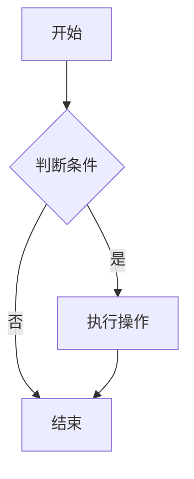
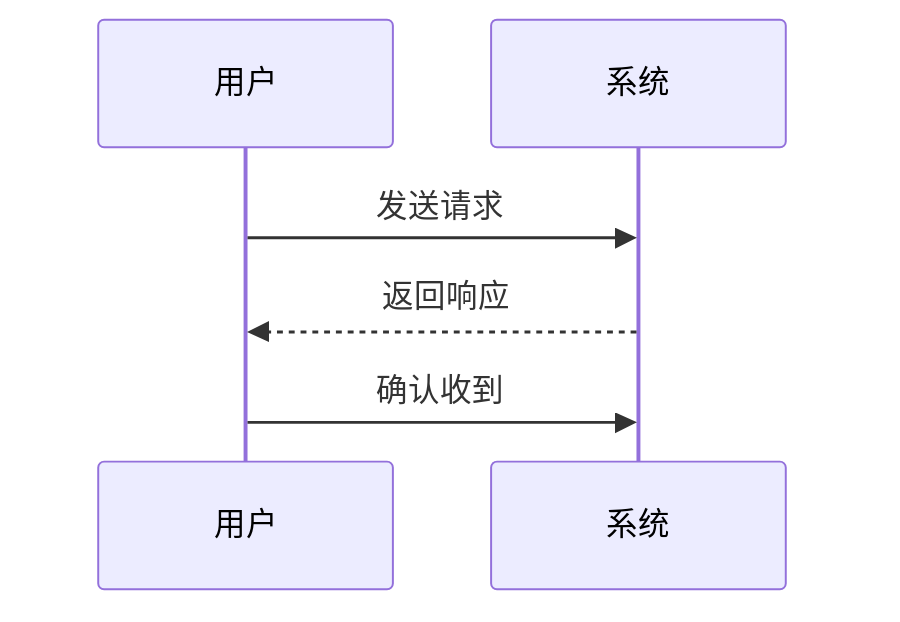
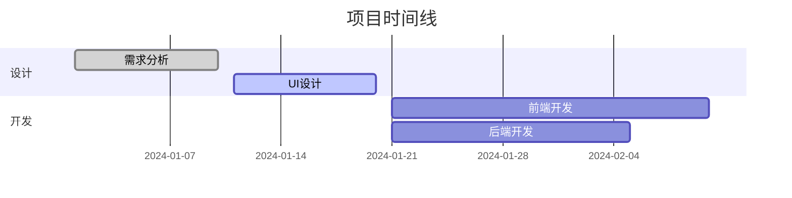

# 一级标题

## 二级标题

### 三级标题

#### 四级标题

##### 五级标题

###### 六级标题

## 重复标题

## 重复标题

## 重复标题

## 代码高亮行示例

高亮第 2 行：

```javascript{2}
function hello() {
  console.log('这行会被高亮');
  return 'world';
}
```

高亮第 1,3 行：

```python{1,3}
def greet(name):
    message = f"Hello, {name}!"
    print(message)
    return message
```

高亮第 2-4 行：

```vue{2-4}
<template>
  <div class="container">
    <h1>{{ title }}</h1>
    <p>{{ content }}</p>
  </div>
</template>
```

高亮多个范围：

```javascript{1,3-5,8}
const data = [1, 2, 3];
let result = 0;
for (let i = 0; i < data.length; i++) {
  result += data[i];
  console.log(`Step ${i}: ${result}`);
}
// 最终结果
console.log('Final result:', result);
```

```
import { h3 } from '@/utils/constants/command';

export default {
  modifier: 'ctrl',
  key: '3',
  action(editor) {
    editor.execCommand(h3);
  },
};

```

<iframe src="https://code-farmer-i.github.io/vue-markdown-editor/zh/plugins/mermaid.html#%E4%BD%BF%E7%94%A8"></iframe>

<div style="padding: 20px; border-left: 5px solid #3f51b5; border-radius: 5px; margin-bottom: 20px; line-height: 1.8; font-size: 16px; word-wrap: break-word;">
<h3 style="text-align: center; color: black; font-weight: bold;">利用基本不等式求最值$</h3>
<h4 style="background: linear-gradient(to right, #26a69a, #4db6ac); padding: 5px; color: white;">关键点</h4>
<p style="font-size: 14px; text-indent: 2em;">
利用基本不等式求最值的关键在于：依定值去探求最值，探求的过程中常需依据具体的问题进行合理的拆、凑、配等变换。
</p>
<h4 style="background: linear-gradient(to right, #ffeb3b, #fdd835); padding: 5px; color: black;">考向 1 配凑法求最值</h4>
<p style="font-size: 14px; margin-bottom: 1em;">例 1</p>
<p style="font-size: 14px; margin-bottom: 1em;">（1）已知 $0<x<\frac{3}{2}$ ，当 $x(3-2x)$ 取得最大值时，$x$ 的值为（ ）</p>
<ul style="font-size: 14px; list-style-type: circle; padding-left: 20px; margin-bottom: 1em;">
    <li>A．$\frac{1}{3}$</li>
    <li>B．$\frac{1}{2}$</li>
    <li>C．$\frac{2}{3}$</li>
    <li>D．$\frac{3}{4}$</li>
</ul>
<p style="font-size: 14px; margin-bottom: 1em;">（2）已知 $x<\frac{5}{4}$，则 $y=4x-2+\frac{1}{4x-5}$ 的最大值为 ______ 。</p>
<h5 style="font-weight: bold; margin-bottom: 1em;">解析</h5>
<p style="font-size: 14px; text-indent: 2em;">
（1）$\because 0<x<\frac{3}{2}, \therefore 3-2x>0$。由基本不等式得$x(3-2x) = \frac{2x(3-2x)}{2} \leqslant \frac{\left(\frac{2x+3-2x}{2}\right)^2}{2} = \frac{9}{8}$。
当且仅当 $2x=3-2x$，即 $x=\frac{3}{4}$ 时，等号成立。
故当 $x(3-2x)$ 取得最大值时，$x$ 的值为 $\frac{3}{4}$。
</p>
<p style="font-size: 14px; text-indent: 2em;">
（2）$\because x<\frac{5}{4}, \therefore 5-4x>0$
$\therefore y = 4x-2+\frac{1}{4x-5} = -[(5-4x)+\frac{1}{5-4x}]+3 \leqslant -2\sqrt{(5-4x)\times\frac{1}{5-4x}}+3=1$。
当且仅当 $5-4x=\frac{1}{5-4x}$，即 $x=1$ 时，等号成立。
故 $y=4x-2+\frac{1}{4x-5}$ 的最大值为 1 。
</p>
<p style="font-weight: bold; text-indent: 2em;">答案: （1）D （2）1</p>
<h4 style="background: linear-gradient(to right, #ffeb3b, #fdd835); padding: 5px; color: black;">考向 2 拆裂项求最值</h4>
<p style="font-size: 14px; margin-bottom: 1em;">例 2 函数 $y=\frac{x^2+x+3}{x-2}(x>2)$ 的最小值为_________。</p>
<h5 style="font-weight: bold; margin-bottom: 1em;">解析</h5>
<p style="font-size: 14px; text-indent: 2em;">
$y = \frac{x^2+x+3}{x-2} = \frac{(x-2)^2+5(x-2)+9}{x-2} = x-2+\frac{9}{x-2}+5$。
$\because x>2,$ $\therefore x-2>0,$
$\therefore y \geqslant 2\sqrt{(x-2)\cdot\frac{9}{x-2}}+5=11$。
当且仅当 $x-2=\frac{9}{x-2}$，即 $x=5$ 时，等号成立。故原函数的最小值为 11 。
</p>
<p style="font-weight: bold; text-indent: 2em;">答案: 11</p>
<h4 style="background: linear-gradient(to right, #ffeb3b, #fdd835); padding: 5px; color: black;">考向 3 分组并项求最值</h4>
<p style="font-size: 14px; margin-bottom: 1em;">例 3 若 $x, y$ 为正数，则 $\left(x+\frac{1}{2y}\right)^2+\left(y+\frac{1}{2x}\right)^2$ 的最小值为 ________。</p>
<h5 style="font-weight: bold; margin-bottom: 1em;">解析</h5>
<p style="font-size: 14px; text-indent: 2em;">
$\because x, y$ 为正数，$\therefore \left(x+\frac{1}{2y}\right)^2+\left(y+\frac{1}{2x}\right)^2 = \left(x^2+\frac{1}{4x^2}\right)+\left(y^2+\frac{1}{4y^2}\right)+\left(\frac{x}{y}+\frac{y}{x}\right) \geqslant 2\sqrt{x^2\cdot\frac{1}{4x^2}}+2\sqrt{y^2\cdot\frac{1}{4y^2}}+2\sqrt{\frac{x}{y}\cdot\frac{y}{x}}=4$。
</p>
<p style="font-size: 14px; text-indent: 2em;">
当且仅当 $x^2=\frac{1}{4x^2}, y^2=\frac{1}{4y^2}, \frac{x}{y}=\frac{y}{x}$，即 $x=y=\frac{\sqrt{2}}{2}$ 时，等号成立，此时原式取得最小值 4 。
</p>
<p style="font-weight: bold; text-indent: 2em;">答案: 4</p>
<h4 style="background: linear-gradient(to right, #ffeb3b, #fdd835); padding: 5px; color: black;">考向 4 常数代换法求最值</h4>
<p style="font-size: 14px; margin-bottom: 1em;">
例 4
（1）若 $x>0, y>0$ 且 $x+y=1$，则 $\frac{4}{x}+\frac{1}{y}$ 的最小值为( )
</p>
<ul style="font-size: 14px; list-style-type: circle; padding-left: 20px; margin-bottom: 1em;">
    <li>A．7</li>
    <li>B．8</li>
    <li>C．9</li>
    <li>D．16</li>
</ul>
<p style="font-size: 14px; margin-bottom: 1em;">（2）若正数 $x, y$ 满足 $x+y=xy$，则 $x+2y$ 的最小值为( )</p>
<ul style="font-size: 14px; list-style-type: circle; padding-left: 20px; margin-bottom: 1em;">
    <li>A．6</li>
    <li>B．$2+3\sqrt{2}$</li>
    <li>C．$3+2\sqrt{2}$</li>
    <li>D．$2+2\sqrt{3}$</li>
</ul>
<h5 style="font-weight: bold; margin-bottom: 1em;">解析</h5>
<p style="font-size: 14px; text-indent: 2em;">
（1）由题意，知 $\frac{4}{x}+\frac{1}{y}=\left(\frac{4}{x}+\frac{1}{y}\right)(x+y)=5+\frac{4y}{x}+\frac{x}{y} \geqslant 5+2\sqrt{\frac{4y}{x}\cdot\frac{x}{y}}=9$。
当且仅当 $\frac{4y}{x}=\frac{x}{y}$，即 $x=\frac{2}{3}, y=\frac{1}{3}$ 时，等号成立，$\therefore \frac{4}{x}+\frac{1}{y}$ 的最小值为 9 。
</p>
<p style="font-size: 14px; text-indent: 2em;">
（2）$\because$ 正数 $x, y$ 满足 $x+y=xy$，$\therefore \frac{1}{x}+\frac{1}{y}=1$，$\therefore x+2y=(x+2y)\left(\frac{1}{x}+\frac{1}{y}\right)=\frac{x}{y}+\frac{2y}{x}+3 \geqslant 2\sqrt{\frac{x}{y}\cdot\frac{2y}{x}}+3=2\sqrt{2}+3$。
当且仅当 $\frac{x}{y}=\frac{2y}{x}$，即 $x=\sqrt{2}+1, y=\frac{2+\sqrt{2}}{2}$ 时，等号成立，$\therefore x+2y$ 的最小值为 $3+2\sqrt{2}$。
</p>
<p style="font-weight: bold; text-indent: 2em;">答案: （1）C （2）C</p>
<h5 style="font-weight: bold; margin-bottom: 1em;">方法提炼</h5>
<ol style="font-size: 14px;">
    <li>该类问题可归纳为以下模型：
        <ol style="font-size: 14px; padding-left: 20px;">
            <li>已知 $x>0, y>0, ax+by=c$，求 $\frac{m}{x}+\frac{n}{y}$ 的最小值；</li>
            <li>已知 $x>0, y>0, \frac{a}{x}+\frac{b}{y}=c$，求 $mx+ny$ 的最小值。</li>
        </ol>
    </li>
    <li>解题步骤如下：
        <ol style="font-size: 14px; padding-left: 20px;">
            <li>把条件中的等式变形为 "1" 的表达式；</li>
            <li>把 "1" 的表达式与所求最值的式子相乘，变形为积是定值的形式；</li>
            <li>利用基本不等式求解最值。</li>
        </ol>
    </li>
</ol>
<h4 style="background: linear-gradient(to right, #ffeb3b, #fdd835); padding: 5px; color: black;">考向 5 消元法求最值</h4>
<p style="font-size: 14px; margin-bottom: 1em;">
例 5 若正实数 $x, y$ 满足 $x^2+\frac{y^2}{2}=1$，则 $x\sqrt{1+y^2}$ 的最大值是___________。
</p>
<h5 style="font-weight: bold; margin-bottom: 1em;">解析</h5>
<p style="font-size: 14px; text-indent: 2em;">
方法 1：由 $x^2+\frac{y^2}{2}=1$ 可得 $y^2=2-2x^2$，
则 $x\sqrt{1+y^2}=x\sqrt{1+2-2x^2}=\sqrt{\frac{1}{2}\times 2x^2(3-2x^2)} \leqslant \sqrt{\frac{1}{2}\times[\frac{2x^2+(3-2x^2)}{2}]^2}=\frac{3\sqrt{2}}{4}$。
当且仅当 $2x^2=3-2x^2$，即 $x=\frac{\sqrt{3}}{2}$ 时，等号成立，所以 $x\sqrt{1+y^2}$ 的最大值是 $\frac{3\sqrt{2}}{4}$。
</p>
<p style="font-size: 14px; text-indent: 2em;">
方法 2：$x\sqrt{1+y^2}=\sqrt{2} \cdot x\sqrt{\frac{1+y^2}{2}} \leqslant \sqrt{2} \cdot \frac{x^2+\frac{1+y^2}{2}}{2} = \frac{3\sqrt{2}}{4}$。
当且仅当 $x=\sqrt{\frac{1+y^2}{2}}$，即 $x=\frac{\sqrt{3}}{2}, y=\frac{\sqrt{2}}{2}$ 时，等号成立，所以 $x\sqrt{1+y^2}$ 的最大值是 $\frac{3\sqrt{2}}{4}$。
</p>
<p style="font-weight: bold; text-indent: 2em;">答案: $\frac{3\sqrt{2}}{4}$</p>
</div>

- [x] Task

## Mermaid 图表示例

流程图：



时序图：



甘特图：



$$\sum_{i=1}^n a_i=0$$

$a+a=2$

::: warning
_here be dragons_
:::
