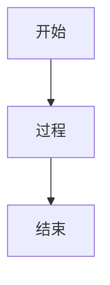
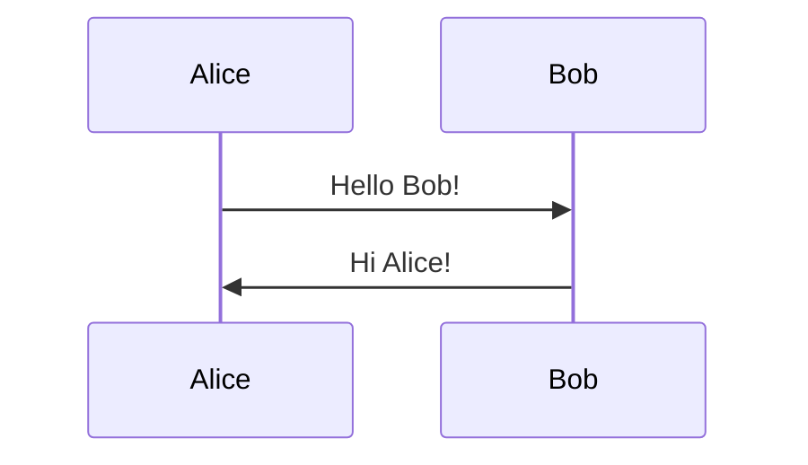
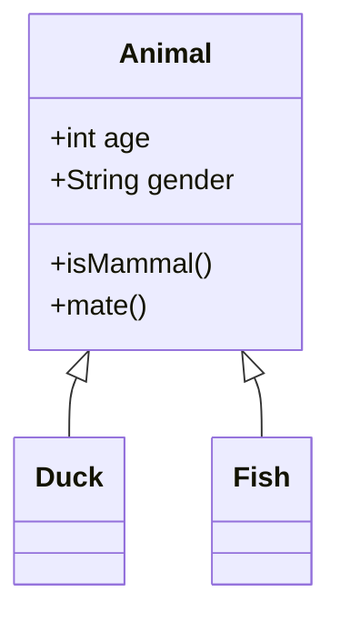
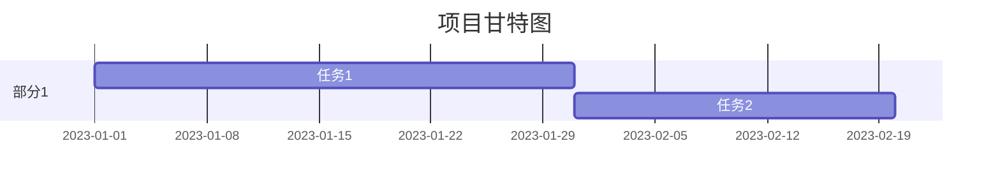
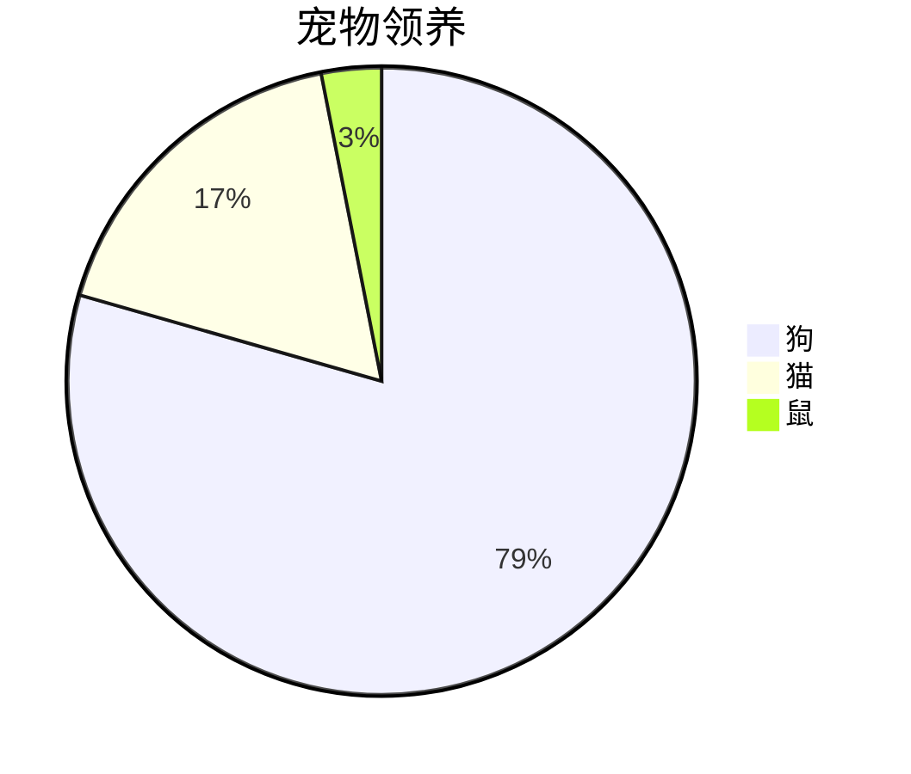
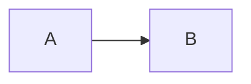
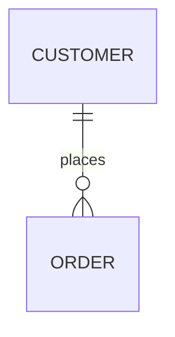
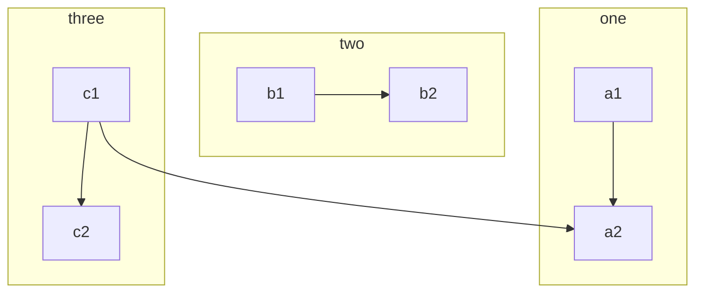

# Mermaid 图表测试

此文件用于测试 Markdown 编辑器对 Mermaid 图表的处理，包括各种图表类型、语法和边界情况，如流程图、序列图、类图、在 HTML 中嵌入、无效语法、空图表等。

## 简单流程图



## 序列图



## 类图



## Gantt 图



## 饼图



## 在 HTML 中的 Mermaid

<div>

</div>

## 无效语法

```mermaid
graph TD
    A -- > B  // 无效箭头
```

## 空图表

```mermaid

```

## 多图表在同一文档

```mermaid
flowchart TD
    Start --> End
```



## 其他边界情况

嵌套在列表中：

- ```mermaid
  graph TD
      X --> Y
  ```

转义或特殊字符：

```mermaid
graph TD
    A["特殊字符: \" & < >"] --> B
```

大图表（多行）：


